<FeatureHead
    title = 'minecraft指令烹饪指南：凉拌实体选择器'
    authorName = 创小业
    avatarUrl = '../../_authors/mini_ye.jpg'
    :socialLinks="[
        { name: 'BiliBili', url: 'https://space.bilibili.com/133430292' }
    ]"
    resourceLink = 'https://www.bilibili.com/read/cv36591936'
/>

::: tip
**先看我qwq**

你好qwq，欢迎阅读小业的文章。最近和群友讨论目标选择器的性能问题，我稍微读了实体选择的相关源代码，就用这篇文章总结 minecraft 命令系统中，实体选择的读取和处理过程，以及它如何影响后续的选择。

在写这篇文章之前，我不怎么关注实体选择内部如何优化，因为我写代码会更多地关注自己的逻辑，而不过多计较游戏代码层面的设计和优化。mojang 既然给出，它就有必要保证在开发者提供正常选择逻辑的前提下，游戏代码的处理和优化的合理性。这里是想说，优化是尽量可以做的事情，而不是必须做到底的事情。如何优化是需要开发经验积累的，优化代码也不应该过多影响开发效率，在力所能及的范围内做到优化即可。

下面我们一起看看处理实体选择的游戏代码，并总结一些规律，优化实体选择的写法，顺带吐槽 mojang。之所以说是“实体选择”，是因为选择实体除了目标选择器，还可以提供 uuid 和 玩家名 直接选择，我将这些统称为“实体选择”。

中间的分析过程非常多，想直接看结论的请直接跳到“**是时候让它变得好吃**”[^1]章节

有很多图片而且字有时候比较小，app 可以直接点击图片放大，web 端需要把网页放大，尝试一下 Ctrl+鼠标滚轮噢~

源码版本是 JE 1.20.6，基于 fabric yarn 反混淆，可能与官方有出入，但看看简单的源码足够啦~
:::

## 命令的读取和处理

数据包会在游戏中执行 `/reload` 时重新读取。数据包文件提供给游戏的是一堆字符串，游戏验证字符串所代表的命令是否符合格式，如果是则会在游戏内部创建对应的命令对象。命令能够做到的事情是已经写死的，但它们可以通过拼装和排序实现各种不同的逻辑，改变游戏内的行为，这是数据包数据驱动性的体现。这一步我称之为读取和处理。

我们写的命令会被游戏先读取，然后它就已经存在于内存中，等待后续的“使用”。之所以提这一点，是因为在阅读本文涉及的源码时，也涉及到了读取时的字符串处理逻辑，我也不知道如何更好地表述这一点，但我会在后续提示你哪些是“读取和处理”，哪些是“使用”。

## 准备原材料

这一章我们来阅读源码~

需要找个切入口，比如 execute as <实体> 这里就有选择实体的逻辑，来到 `ExecuteCommand` 类：

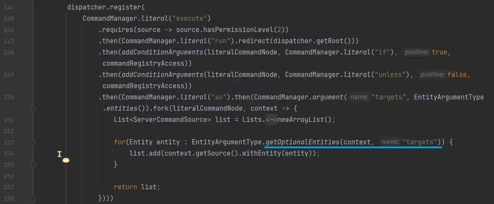

图中划线的 `getOptionalEntities` 方法是选取实体的方法，一直点进去，来到 `EntitySelector#getUnfilteredEntities` 方法：


在这个方法中看到了一些判断 `includesNonPlayers`、`senderOnly` 的值并决定分支的逻辑，显然这里是“使用”目标选择器的逻辑，也就是命令已经在执行了。为了弄清这些值的含义，我们应该去“读取和处理”的部分看看，通过 `includesNonPlayers` 、 `senderOnly` 这些的 `usages` 很容易找到 `EntitySelectorReader` 类就是处理目标选择器读取和处理的类，经过观察，该类中的 `read` 方法是开始读取和处理的方法：

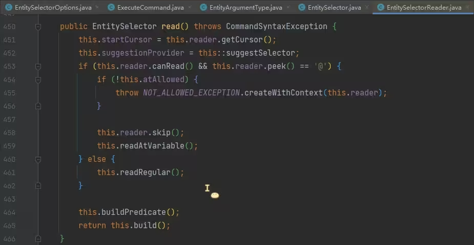

第 453 行，判断下一个字符是不是`@`，如果是则后续走目标选择器的读取和处理逻辑，否则跳到 461 行。在处理目标选择器的逻辑中，第 454 行判断了 `atAllowed` ，显然该变量指示这里不应该用目标选择器，稍微看了一下，跟权限有关，这里我们不关心它；第 459 行，调 `readAtVariable` 方法，读取和处理目标选择器；

第 461 行，调`readRegular`方法，该方法是直接输入玩家名和 uuid 的处理逻辑，因为它们不是目标选择器；

第 464 行，调`buildPredicate`方法，该方法分别构造了实体旋转角 predicate 和玩家等级 predicate，划重点；

第 465 行，调 build 方法，该方法根据读取的 `dx`、`dy`、`dz` 和 `x`、`y`、`z` 分别构造了选择器的 `Box` 和 `Function<Vec3d, Vec3d>` 用于后续目标选择器根据区域筛选实体，最后实例化 `EntitySelector` 对象，目标选择器读取和处理完成。

请留意，这里是“读取和处理”阶段，不考虑函数宏的前提下，这里的逻辑仅在数据包加载时会走，不涉及运行时的性能问题。

所以根据上面的分析，第 459 行调用的 `readAtVariable` 方法是现在要关心的，它读取和处理目标选择器，点进去看：

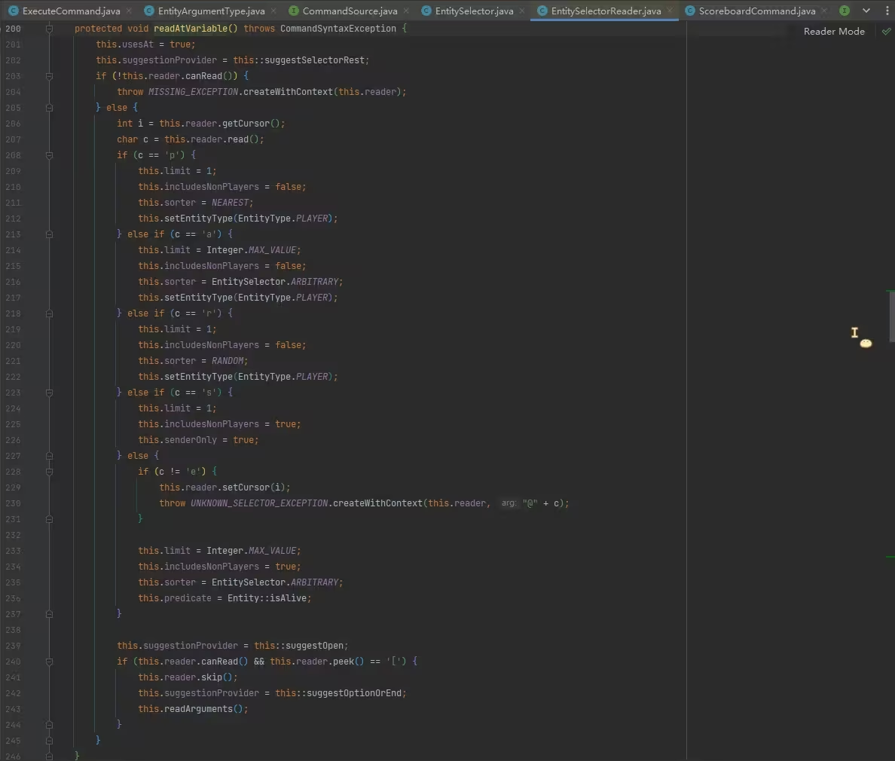

在该方法中，读取 `@` 之后的字符，如果是 `p`、`a`、`r`、`s`、``e`` 则分别给一些成员赋值，这些值是什么意思已经明了了。

- `limit` 实体的限制数量

- `includeNonPlayers` 是否选择非玩家实体

- `sorter` 排序方式

- `senderOnly` 是否为 @s 选择器

- `predicate` 条件链

选择器 `@` 后面的字符会影响此处构造目标选择器对象时，给成员赋的值。例如 `@p` 选择器是选择最近的一个玩家，观察第 209~212 行就可以看到它是通过给 `limit`、`includeNonPlayers` 等成员赋值实现的，所以，其实 `@a[limit=1,sort=nearest]` 和 `@p` 没有区别，它们的区别仅仅是数据包加载时的解析成本，但解析之后形成的选择器对象相同，在命令运行时它们的效率没有区别。

我们特别关注 `predicate`，这是在 `EntitySelectorReader` 和 `EntitySelector` 中都存在的成员，目标选择器的每个条件会被构造成 `predicate`，链在一起，最后对实体进行测试，它有助于后续阅读和理解每个目标选择器参数的处理顺序。

第 236 行，由于 `@e` 选择器的 `predicate` 首先调 `Entity#isAlive` 检查实体是否存活，推测这是 `@e[type=minecraft:player]` 无法选择在死亡界面未点击复活的玩家的原因。

这里仅了解了目标选择器的类型，而读取和解析其中的参数是第 243 行的 `readArguments` 方法，一起来看：

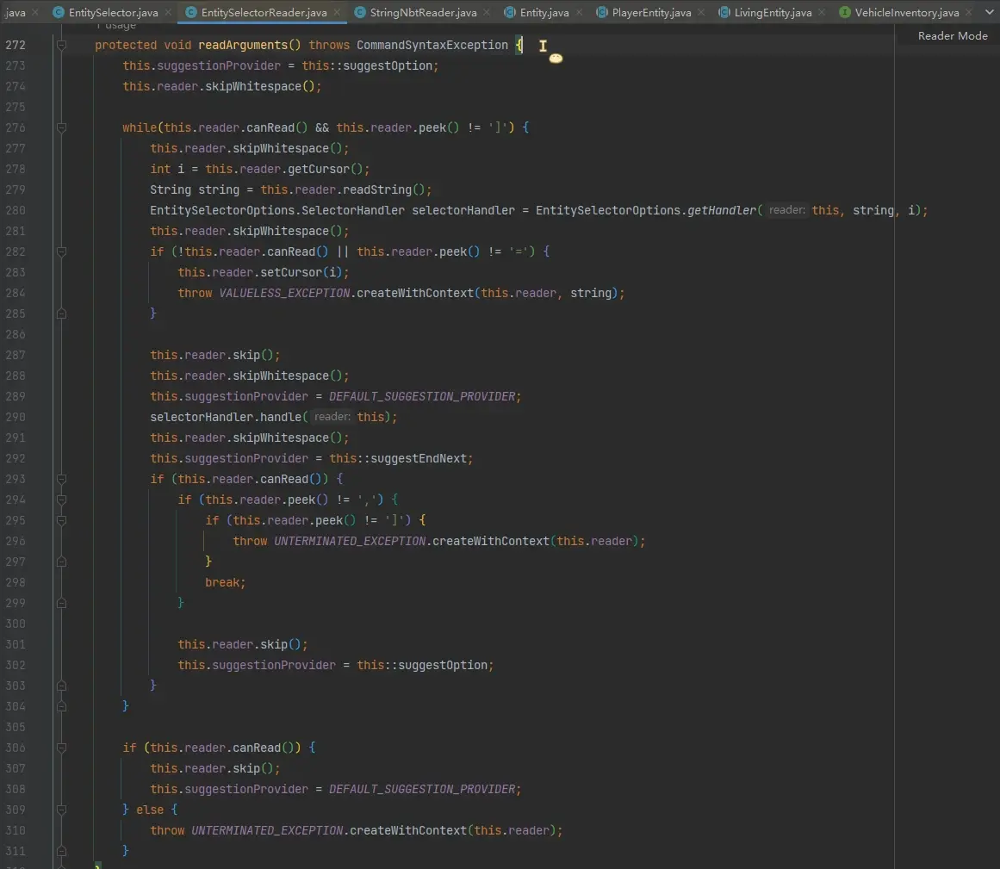

该方法的主要逻辑是第 276 行一个大 while 循环读取目标选择器的所有参数。在循环体中，第 279~280 行读取该参数的名称，然后调 `EntitySelectorOptions#getHandler` 拿 handler，然后在第 290 行用这个 handler 处理后面的内容。比如，目标选择器存在 `type=minecraft:sheep` 参数，则会读取 "type"，然后拿到 "type" 参数的 handler，然后用这个 handler 去处理 "minecraft:sheep"。

所以只要找到各个参数的 handler，就能知道参数都是怎么处理的了，进 `EntitySelectorOptions#getHandler` 方法：

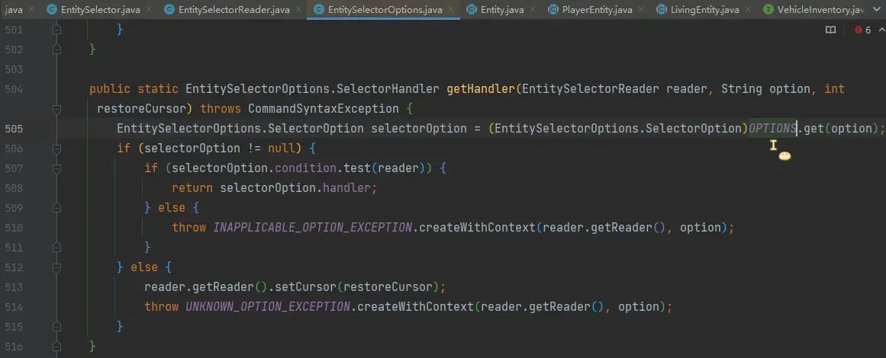

第 505 行有个 `OPTIONS`，handler 就是从这拿出来的，所以需要看看是哪里往 `OPTIONS` 塞东西，查看 usages 跳到 `putOption` 方法：


它有 21 个 usages，点一下就看到了：

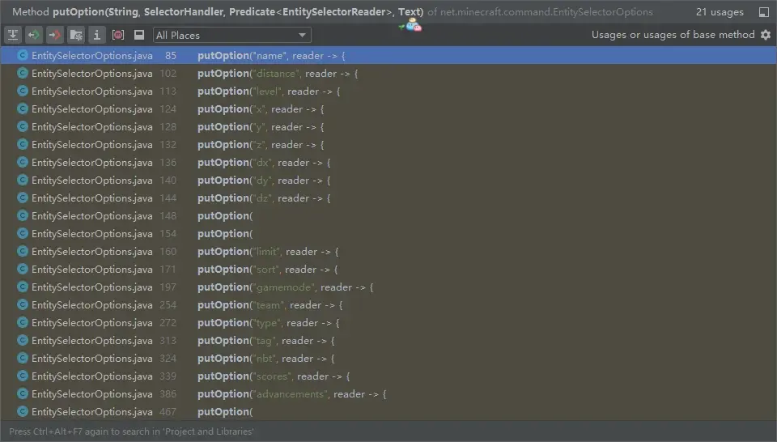

找到了，定位下去：

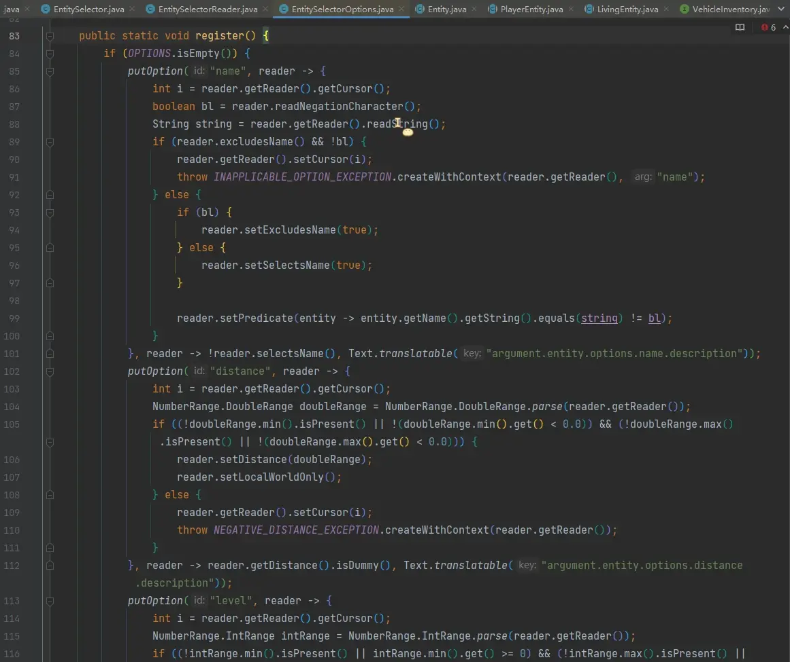

可以看到在注册时写入的 handler，此处是所有目标选择器参数的读取和处理逻辑，由于代码有 400 多行，我读完整理成表格，见下一节。

## 处理原材料★

这一节我们来分析顺序与优化问题

### 与书写顺序相关的参数


上一节我们提到，读取和处理目标选择器各个参数时，会循环读取目标选择器的所有参数，找对应 handler 处理。观察表格，大部分参数都是在解析后，直接构造一个 predicate 然后拼在已有的 predicate 后面，这意味着 predicate 链的顺序与参数顺序有关，比如 `nbt` 参数和 `scores` 参数，由于它们的处理逻辑都是直接构造 predicate 然后拼接，所以在目标选择器中，我们将参数 `nbt` 写在 `scores` 前面，会在选择实体时，先检查 `nbt`，然后检查 `scores`，而如果将参数 `nbt` 写在 `scores` 后面，则顺序也会反过来，这就得到了一个能优化目标选择器的方法：因为选择实体时，会拿所有实体，依次用 predicate 测试，每次测试都滤去不符合的实体，且滤去后的实体不再用后续 predicate 测试，剩余的就是成功被选择的实体，所以哪个参数能排除掉更多实体，哪个参数就应该写在更靠前的位置。

### 与书写顺序无关的参数

但是，并不是所有参数都会直接构造 predicate，有些参数只是暂时存储在 `EntitySelectorReader` 对象中，然后在读取完后再构造 predicate 或进行其他的选择操作，这意味着这些参数不受其在选择器中的顺序的影响，这些参数有：

- `x`、`y`、`z`
- `dx`、`dy`、`dz`
- `distance`
- `x_rotation`、`y_rotation`
- `level`
- `limit`
- `sort`

`x_rotation`、`y_rotation` 和 `level` 会依次拼在 predicate 链后面，它们总是在靠后的位置测试，与在选择器中的书写位置无关。

## 特殊的参数（涉及优化）

`x`、`y`、`z`、`dx`、`dy`、`dz` 和 `distance` 还会影响最开始的优化：

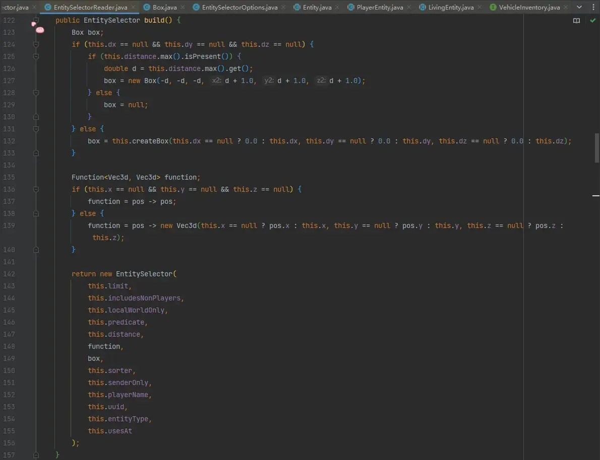

在构造 `EntitySelector` 时，会传入 `Box` 参数，这个参数将在 `EntitySelector` 后续被用于选择实体时，根据区域筛选出一些可能的实体，这一步是在初筛。具体来说，观察第 132 行可知，只要提供了 `dx`、`dy`、`dz` 中的其中一部分，那么即使不提供缺少的部分，也会被视为提供了 0.0 值，此时 `Box` 以 `dx`、`dy`、`dz` 参数为准；而如果不提供 `dx`、`dy`、`dz` 的任何一个，但提供了 `distance`，则 `Box` 以 `distance.max` 为准，粗筛是根据边长为` 2 * max + 1` 的正立方体 `Box`，这个地方十分有趣，想象一下如果 `distance.max` 非常大，那么圈出的 `Box` 的无用区域就越多，换句话说这个初筛(粗筛)就越“粗”。

这里还有一个疑问，`distance` 参数如果只提供 `min` 而不提供 `max`，是否就没有这个优化，甚至是劣化？因为 mojang 喜欢在一些为 `null` 的地方塞个 `MAX` 进去，比如当选择器提供了 `distance=1..` 时，mojang 是否会将其处理为 `distance=1..Double::MAX` 呢，这样就得到了一个巨大的 `Box` 进行初筛，这毫无意义。但在解析 `DoubleRange` 的类中我没有找到证据支撑，所以这里应该是可以为 `null` 的，没有这个顾虑，但 `distance` 参数只提供 `min` 而不提供 `max` 确实就没有优化效果。

`Function<Vec3d, Vec3d>` 参数则是 `x`、`y`、`z` 提供的位置，这三个参数也可以只提供一部分，缺少的参数会沿用命令执行上下文的 `pos` 的对应分量。

现在还剩 `sort` 和 `limit` 没有探究，因为它们是在选择过程中和最后返回结果时生效，但我们还没有看一开始说的：如果直接提供玩家名或者 uuid 而不是目标选择器的逻辑，一起来看 `EntitySelectorReader#readRegular`:

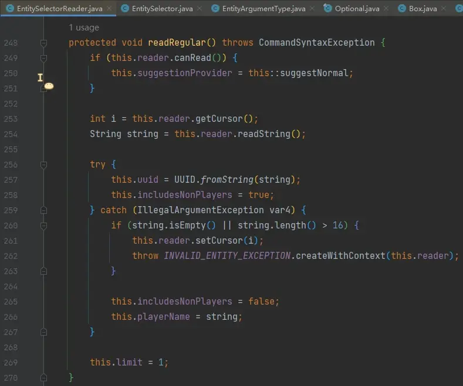

第 257 行，尝试转换为 uuid。如果可以转换，因为 uuid 也可以是非玩家实体的 uuid，所以置 `includesNonPlayers` 为 `true`；

如果不能转换，则认为输入了玩家名，最多 16 个字符，合法时置 `includesNonPlayers` 为 `false`，并保存玩家名到 `playerName` 成员。`playerName` 成员仅在此处能被赋值，在选择器中使用 `name= 参数是构造 predicate 测试实体名字`，与此处不同。

### 选择器的“选择”过程

上面我们详细阅读了实体选择器的读取和处理逻辑，现在可以把目光看向选择的过程了。

回到 EntitySelector#getUnfilteredEntities 方法：

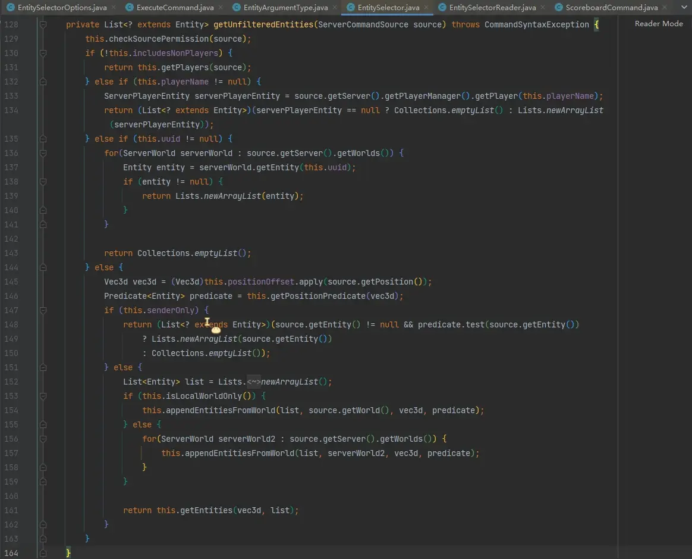

130 行：如果 `includesNonPlayers` 为 `false`，代表该选择器只选择玩家，调 `getPlayers` 方法。`getPlayers` 方法后续的逻辑与本方法基本相同，区别会在后续指出；

132 行：如果有 `playerName`，说明该选择器是直接指定玩家名的（例如 `execute as Mini_Ye`），它不会有任何条件，直接在玩家列表中找是否有对应名字的玩家，然后返回；

135 行：如果有 `uuid`，说明该选择器是直接指定 uuid 的（例如 `execute as 0-0-0-0-1`），它不会有任何条件，直接在实体列表中找是否有对应 uuid 的实体，然后返回；

146 行，根据先前传入的 `Box` 和 `x`、`y`、`z` 构造的 `Function` 构造 predicate 并拼接到最后，这一步是 `x`、`y`、`z`、`dx`、`dy`、`dz` 和 `distance` 参数的准确筛选：


147 行，判断该选择器是否为 `@s`，如果是，用 predicate 链测试该实体，然后返回；

153 行，调 `isLocalWorldOnly` 判断 `localWorldOnly` 的值，如果为 `true`，则仅在本选择器所在的维度选择实体，否则在所有维度选择实体。影响 `localWorldOnly` 的参数为 `x`、`y`、`z`、`dx`、`dy`、`dz` 和 `distance`，只要指定任一这些参数，就会使该选择器仅在所在的维度选择实体；

不管是第 154 行还是第 157 行，均调用 `appendEntitiesFromWorld` 方法：


这里的参数 i 为 `limit`，但却不一定是我们设置的 `limit`，它由第 167 行的 `getAppendLimit` 方法给出，其内部逻辑判断 `sorter` 是否为 `arbitrary`，如果是则使用我们指定的 `limit`，否则 `limit` 为 `Integer.MAX_VALUE`，即无限制。所以，目标选择器的 `limit` 参数仅在 `sort` 为默认时有优化效果，因为此时无顺序要求，只要实体选够数量就停止选择。

    关于这一点仍要继续解释。实体在游戏内存中以一定数据结构存储，例如实体列表。列表的遍历一般从头开始，假设目标选择器不指定 `sort`，则该目标选择器的选择顺序是“任意的”。假设实体列表为 [A, B, C, D, E] 共五个实体，它们都符合要求，当不指定 `sort` 且 `limit=2` 时，总是选择 A 和 B，后面三个实体不会被选择，这符合开发者的要求——“你给我两个符合的实体就行，是哪两个我不关心，即使你总是给我 A 和 B 也可以”。然而，`sort=random` 时，意味着开发者要求游戏“随机选择”，所有的实体都应该有相同的概率选出，即使 `limit=2`，也不能在此处选择 A、B 就不选了，因为排在列表后面的 C、D、E 三个实体也必须参与这种随机。同理的还有 `sort=nearest, limit=2` 时，选择最近的 2 个实体，万一排在列表最后的实体 E 才是最近的呢？不能选了 A、B 就不选后面的了，这会导致结果错误。

    因此，在 `EntitySelector#appendEntitiesFromWorld` 方法中，传给 `collectEntitiesByType` 方法的 `limit` 参数仅在 `sort` 不指定时，才是开发者提供的 `limit`，否则 `limit` 始终无限制。换句话说，只有不指定 `sort` 时，指定 `limit` `才可能有优化。另外，collectEntitiesByType` 方法中会根据提供的 `Box` 初筛，所在的区块与 `Box` 不相交的实体会首先排除，这是 `x`、`y`、`z`、`dx`、`dy`、`dz` 和 `distance` 能优化的根据。而 `Box` 和 `distance` 会在 predicate 链的最后再准确判断一次。

回到上面的图，161 行，调 EntitySelector#getEntities：


该方法的逻辑中，选择的结果中有多个实体时会根据 `sorter` 排序，`limit` 参数在最后约束返回的数量。在看到第 247 行判断结果数量时，我第一反应是为什么不写成 `entities.size() > this.limit`，毕竟只要选择的实体数量不超过 `limit`，不管是什么排序方式都不会导致有实体再被过滤，细想了一下是因为即使结果数量不超过 `limit`，也应该使用 `sort` 排序，这会影响后续的执行顺序。例如 `execute as @e[sort=nearest] run xxx` 虽然没有限制 `limit`，但是开发者希望所有的实体按照距离排序后，依次执行 `xxx`，所以即使结果数量没有达到 `limit`，`sorter` 也是要应用的。

是时候让它变得好吃~

### 选择器选择流程图

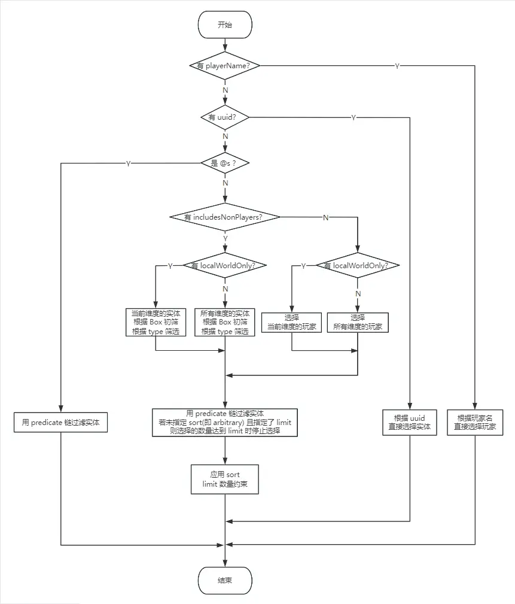

- 直接用 uuid 或 玩家名 选择，最快；

- 对于 `@e`、`@a` 选择器，如果没有指定 `sort`（没指定 等价于 `sort=arbitrary`），则 `limit` 有优化效果。例如，现在有一万个实体（9999 只牛和 1 只羊），要选出这只羊，考虑使用 `@e[type=minecraft:sheep,limit=1]`，如果这只羊幸运地排在实体列表靠前的位置，它会很快被选出，然后选择器会停止选择；

- 对 `@e`、`@a`、`@p`、`@r` 选择器指定 `x`、`y`、`z`、`dx`、`dy`、`dz` 和 `distance` 的其中一个，会使选择器仅在当前维度选择实体。当正在加载的区块来自多个维度时，如果能够确定要选择的实体仅在当前维度，可以考虑加入它们之中的至少一个；

- 对 `@e` 选择器指定 `dx`、`dy`、`dz` 的其中一个，或者指定 `distance` 且有 `distance.max`，就会使该选择器具有 `Box`（即使没有指定 `x`、`y`、`z`，因为它们会被赋值为选择器当前记录的位置）。选择器会在测试所有条件之前进行区块初筛，与 `Box` 没有交集的区块中的实体会在这一步就被过滤掉。请注意，仅指定 `distance=min..` 时没有 `Box`，没有该优化；请注意，仅 `@e` 选择器有该优化，例如 `@a[distance=..11]` 没有该优化；

- 对 `@e` 选择器指定 `type= 参数`，会在上一步的 `Box` 初筛后立即测试 `type`。请注意，`type=#<类型标签>` 无效；请注意，`@p`、`@a`、`@r` 选择器自带该优化，因为它们的 `entityType` 会自动赋值为玩家类型 `EntityType.PLAYER`；请注意，此处仅有优化作用，选择器中的 `type` 参数仍旧会在 predicate 链中测试；

- 选择器最后几项依次总是测试： `x_rotation` -> `y_rotation` -> `level` -> `Box(x、y、z、dx、dy、dz)` -> `distance` -> `sort` -> `limit`，而除去这些参数，其余参数按照选择器中的书写顺序依次测试。因此，能过滤更多实体的参数应该考虑放在更靠前的位置；

## 出锅啦

收获满满~来看看一个好的选择器是什么样子的吧~

存档的主世界、地狱、末地都有许多区块正在加载

三个维度中，每个维度分别都有上千个实体均匀分布在不同地方

另外还有 1000 只羊均匀分布在主世界所有加载的区块中。其中有 2 只羊的 temp 记分板为 88 分，已知这两只羊均位于主世界出生点 (0,0) 附近几格，且其中一只的毛被剪了

在数据包中使用这个实体选择器选择这只被剪掉羊毛的羊并让她说 QwQ：

```mcfunction
execute as @e[type=minecraft:sheep,distance=..10,scores={temp=88},nbt={Sheared:1b},limit=1] run say QwQ
```

这个选择器好吃在：

使用了 `distance=..10` 参数，这是因为已知要选择的羊在主世界出生点 (0,0) 附近几格，此处 `distance` 的最大值 10 较为合理，过滤掉大量离得较远的羊

使用了 `type` 参数，不是羊的实体会在这一步被过滤

使用了 `limit` 参数，一旦要选择的这只羊幸运地位于主世界的实体列表靠前的位置，会省去后续大量选择

`scores` 参数位于 `nbt` 参数前，非常好的写法，因为 `nbt` 参数匹配 `nbt` 的消耗较大，而仅有 2 只羊能通过 `scores` 的检查，大大降低了后续测试 `nbt` 参数的代价。

## 调料加太多就不好了

优化的尽头是劣化

### 误区 1：能过滤更多实体的参数绝对要放在更靠前的位置

一般来说，能过滤更多实体的参数考虑放在更靠前的位置，有些参数除外，例如 `nbt={...}` 参数，该参数的消耗异常巨大，它会将待检测的实体所有的 `nbt` 复制一份，连同骑乘者列表 `Passengers` 的 `nbt` 也会递归复制，因此 `nbt` 参数更多考虑放在靠后的位置；

### 误区 2：limit=xxx 参数就一定好

对于 `@e`、`@a` 选择器，在 `sort` 为任意时（即不指定 `sort`），如果知道实体数量或者本身就对实体数量有要求，可以使用 `limit` 参数进行优化，但由于限制了实体数量，实体数量多时可能不易察觉。

例如，在制作小游戏地图时，通常使用 `marker` 放置在地图中标记位置。如果仅有一个 `marker`，可以使用 `limit=1` 优化，但如果不小心在别的地方生成了同样的 `marker`，选择器总是会选择其中一个，开发者可能需要花时间察觉到这一错误。

### 误区 3：有 Box 就一定好

（避免跳着看的观众不懂是什么意思：`Box` 指的是使用 `dx`、`dy`、`dz` 和 `distance=..max` 时，选择器会首先选择出一个可能的区域内的实体这一优化行为）

`distance=..10000000` 不太好，因为这个坐标太大了，通常情况下，加载的区块不会在这么远的位置（就算有，如果比较少，也不推荐这么写），所以它几乎排除不了多少实体，反而增加了初筛成本。

另外，有 `Box` 一定程度上增加了代码阅读难度，例如，就算我知道要选择的实体在坐标 500 范围内，但是写个 `distance=..500` 会让人不明所以，所以必要时请在命令旁边注明 `distance=..500` 是为了有 `Box`。

## 保留节目：吐槽 mojang

在阅读这坨代码时就发现几个非常难吃的地方，详见上面总结的表格。

有些参数会验证是否存在，不能有重复参数，例如：


不能有多个 `name` 是正常的，因为实体只能有一个名字，但是 `scores` 就不行了：


好唔...不能有多个 `scores` 也认啦~但是 `tag` 参数说：“我可以！”


选择 “至少有一个标签” 同时 “不能有任何标签” 的实体，矛盾式产生了qwq

而在 `scores` 参数内部，记分板又是可以重复的：


因为 `scores` 的 handler 处理时是用 `HashMap` 存储解析结果的，而且不检查重复，`HashMap` 在 `key` 相同时会用旧值覆盖新值，所以 `scores` 内部发生重复时，仅靠后的分数范围有效，详见上面总结的表格。

然后 `@p` 选择器还能覆盖 `sort` 和 `limit` 使其退化成 `@a`，总之有很多这些神奇的操作 mojang 也一点都不想防的样子qwq：


不想吐槽惹，写了一天的文章，好累qwq

感谢阅读~


[^1]: 原文如此