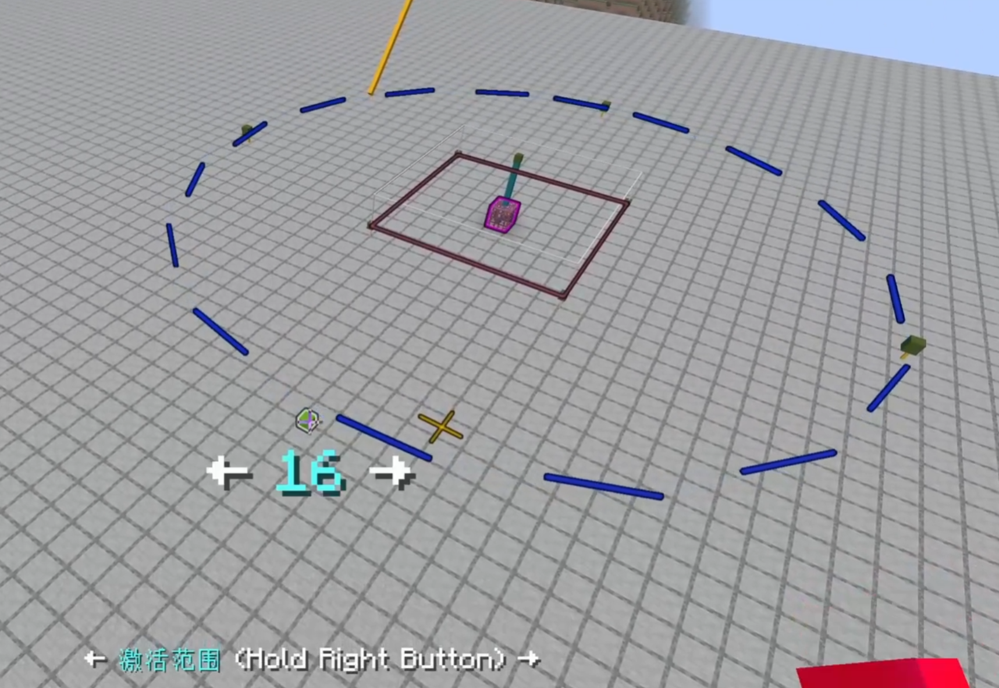

<FeatureHead
    title = '《大别墅》与对话框杂谈'
    authorName = Dahesor
    avatarUrl = '../../_authors/dahesor.jpg'
    :socialLinks="[
        { name: 'BiliBili', url: 'https://space.bilibili.com/1017007290' },
        { name: 'GitHub', url: 'https://github.com/Dahesor/' }
    ]"
    resourceLink = 'https://www.bilibili.com/video/BV1aT7czEEuf'
/>

## 摘要

本文记录并探讨了数个笔者在研究新版本对话框以及制作《大别墅》数据包时所遇的困难，趣事，以及它们的最终解决方案。

## 内容

1. 给远方的实体传递信息
2. 处理强制加载的问题
3. 我们需要自毁的标记
4. 读取玩家输入的SNBT
5. 处理用户的多行文本输入

## 什么是对话框，什么是《大别墅》

**对话框是**Java 1.21.6新增的数据包组成部分，可以向用户展示简易的对话窗口以显示通知或收取用户的输入。\
详见Wiki: [对话框](https://zh.minecraft.wiki/w/?curid=151497)

**《大别墅》**（**DaBsu**, **D**i**a**log **B**atch **S**pawner **U**tils）是由我在上个月制作的，允许地图作者方便，可视化地编辑与管理大量刷怪笼的数据包，使用了大量对话框。\
本文并不是完全关于对话框的，也包含了部分其他问题的探讨。\
想要了解《大别墅》或使用它，请看展示视频：[大别墅](https://www.bilibili.com/video/BV1aT7czEEuf)

## 给远方的实体传递信息

在大别墅中，用户可以选择任意数量的刷怪笼一同编辑，包括未加载区块或是其他维度中的刷怪笼。\
每个注册的刷怪笼都会将自己的信息——比如位置，类型，维度等——存进storage的`Dimension`下。当有刷怪笼被选择时，这个信息会被复制一份到`Selected`中。换言之一个刷怪笼被选择完全由storage记录，那我们该如何通知未加载区块中的标记实体，自己被选择了呢？

你或许会发现我们完全不需要通知它们自己被选择了，然而《大别墅》会使被选中的刷怪笼闪烁——也就是每两秒生成一个持续一秒的发光展示实体——因此每个刷怪笼的标记实体都必须知道自己是否被选择了。

显而易见地，我们不可能在用户选择刷怪笼时`forceload`所有刷怪笼并修改它们的数据。那么我们多多少少只有两种办法了：

首先，我们可以使用storage。每个处于加载区块中的标记实体都可以去找自己是否存在于`Selected`多层列表中，如果是就证明自己被选中了。这样也就不需要在选择时额外做工作——毕竟只有加载区块中的刷怪笼才可能被高亮。\
然而，为了做使被选中的刷怪笼闪烁这个功能浪费这些精力和算力显然是不明智的——我们需要至少每两秒判断一次，而且一张大一点的CTM地图起码有上千个刷怪笼，同时也可能有数百个刷怪笼被加载。在一个可能包含上千项的多层列表中判断自己是否存在多少有些不优雅。

既然如此，就只有第二种方法了，也就是修改标记实体在计分板上的分数。这样实体只需要做一个`if score @s selected matches ...`检测就可以知道自己是否被选中了。\
可能有人会有疑惑，既然实体在未加载的区块中，我们该如何修改它们的分数呢？\
其实，计分板和实体是完全没有绑定的。我们经常提到`假玩家`，也就是计分板上没有对应一个实体的计分目标。然而这样说多少是不准确的，因为实际上计分板的所有计分目标都是`假玩家`。

当我们在计分板命令中使用目标选择器时，如果目标是玩家，会使用玩家ID当做计分目标的名称，而目标是其他实体则会使用它们的UUID。只要你知道玩家ID或实体的十六进制连字符UUID，那么即使找不到实体（下线，或是未加载）也可以更新它们的分数。因此，只需要在实体创建时记录并计算出它们的连字符UUID，那么即使它们被卸载了，也可以直接使用UUID + 宏更新它们的分数。

*目前稳定得到任何实体十六进制UUID字符串的方式是取数组UUID后算出16进制的格式。有现成的库，比如[gu](https://github.com/gibbsly/gu)，帮你做这件事。*

## 处理强制加载的问题

在忘记了哪个版本后，`/forceload`命令再也无法在上下文内完成。这意味着在/forceload后对那个区块的立即操作都几乎不会成功。\
实际上，现在版本`/forceload`完全完成的耗时是不确定的。即使在`forceload`后延后3 tick也有不小的概率区块没有完全加载，无法选中实体。

那么该如何稳定编辑未加载区块中的方块与实体呢？幸运的是，`execute if loaded`命令可以判断任意坐标所属区块是否完全加载。因此在现版本，你需要做的是在执行`/forceload`后每刻判断一次`execute if loaded`直到通过。

## 我们需要自毁的标记

《大别墅》的其中一个功能是世界中的视觉化快速编辑。用户在选择一个刷怪笼后可以看到使用展示实体绘制的各项数据，比如生成范围。\
用户可以选择直接拖动展示实体以修改它对应的数据。

修改生成范围时，用户可以将这个数值改的很大，比如96。这意味着远端的展示实体距离刷怪笼96格远，距离另一端快要200格远了——这完全有可能超出了游戏的加载距离。\
因此如果用户刷的一下把范围拖动到96，且模拟距离又很小，哦豁完蛋，有实体丢了。\
以后玩家就可能看到在空中悬浮的展示实体。

仔细查看我们需要实现的东西：



展示实体分为两类。一类是蓝色的，用来展示范围的虚线。这些实体在范围变化时不需要实际上改变位置，只需要调整`translation`即可。因此它们实际上永远位于刷怪笼的位置，也就不怕丢。

真正怕丢的是第二类，也就是图片中的4个绿色小正方体。用户可以拖动它们以改变整个范围的大小。它们必选在其所显示的位置，因为需要检测玩家的视线。一旦范围太大它们就可能丢掉。

当然，我们可以让这些绿色小正方体也使用`translation`调整位置，然后使用标记实体代替它们出现在视觉上的位置来检测玩家视线……不过这些标记实体还是可能会丢。

那么有没有不怕丢的实体呢？有没有什么什么东西一旦没有数据包更新就会自毁呢？有的，有请**区域效果云**。

区域效果云有`Duration`和`Age`标签控制它的存活时间。因此我们只需要使用区域效果云来做视线检测即可。\
所有正常加载的区域效果云都会被数据包时刻更新`Age`标签确保它不过期，并时刻更新时间戳证明它有被一直加载。然而一旦位于未加载的区域，再次被加载时它的时间戳就不再会等于当前的`gametime`，数据包就可以判断并将其删除。如果数据包在它被再次加载前被卸载，那么它也会在几刻内过期，自然消失。

## 读取玩家输入的SNBT

[1.21.6-pre2](https://zh.minecraft.wiki/w/?curid=152627)后，对话框的所有字符串输入都会为特殊字符转义。这意味着我们没法再直接使用`dynamic/run_command`直接接受复合标签。比如：

```mcfunction
#dynamic/run_command
data merge storage foo:bar $(input)
```

在pre-2之前，只要用户在文本框中输入的是合法的复合标签，那么无论是什么，`data`命令都可以正确组装并运行。\
然而在这之后，所有单双引号和反斜线之前都会加入一个反斜线来转义(`'` `"` `\` → `\'` `\"` `\\`)，而换行则会被转换为`\n`。\
这使得我们无法直接接受复合标签，因为假设用户输入的是`{string:"yes"}`，那么命令就会变成：

```mcfunction
data merge storage foo:bar {string:\"yes\"}
```

而这是不合法的。

我们只能先将整个复合标签存进字符串里：

```mcfunction
#dynamic/run_command
data modify storage foo:bar input set value {input:"$(input)"}
```

这样会变成：

```mcfunction
data modify storage foo:bar input set value {input:"{string:\"yes\"}"}

```

然后再跑一遍宏：

```mcfunction
function string_to_object with storage foo:bar input

#> function string_to_object
$data modify storage foo:bar input set value $(input)
```

才能把输入转换为复合标签。

这时你可能有疑问，如果玩家同时输入了单双引号怎么办？比如输入是`{string:"haha'hehehe"}`
这时组合的命令会变成：

```mcfunction
data modify storage foo:bar input set value {input:"{string:\"haha\'hehehe\"}"}
```

这怎么办？外面没有单引号但是里面的单引号被转义了。\
——不怎么办。这在Minecraft中是合法的。只要外侧有引号，那么内部的引号无论单双都可以转义。只不过相同的那个必须转义，不相同的那个随便。\
以下4条命令等价：

```mcfunction
data merge storage foo:bar {string:"单' \"双"}
data merge storage foo:bar {string:"单\' \"双"}
data merge storage foo:bar {string:'单\' "双'}
data merge storage foo:bar {string:'单\' \"双'}
```

## 处理用户的多行文本输入

pre-2同时掀起的麻烦不止上面一个。从这个版本开始出现了一个Bug, [MC-298893](https://bugs.mojang.com/browse/MC/issues/MC-298893)。简单来讲，对话框的文本输入允许多行，而`max_lines`这个参数规定了最多有几行。

理论上来讲，它规定的应该是用户可以输入几个换行，也就是按几次回车——在pre-2之前也确实如此——然而在这个版本之后突然它变成了限制视觉上有几行。\
也就是说，如果我们规定`max_lines`为1，那么用户无法再输入任何文本框的宽度装不下的字符串。如果没有这个漏洞，那么文字应该自动地在显示上换到下一行才对。

这意味着什么呢？《大别墅》允许用户直接在对话框中编辑刷怪笼的NBT数据。有这个BUG，那么要么我们想要接受任意长度的SNBT标签输入，就必须得将`max_lines`调整的很大，也就是说用户输入的字符串中可能会随机被填入`\n`，而这是灾难性的。

那么Mojang能否修复这个漏洞呢？当然不行。我报告的这个漏洞成功won't fix（承认存在但是不修复。）


这就只好自己想办法了。我们需要把用户输入的字符串中的所有`\n`去掉。这就需要我们把字符串拆成一个一个的字符，判断一遍再组合回去。\
拆字符串很简单，有`data string`，那么该如何组合字符串呢？

使用宏直接拼接听起来很简单，String Lib就是直接拼的。然而我们处理的是一个SNBT的字符串。这意味着里面极大概率会出现各种各样的需要转义的字符，比如单双引号和反斜线。这样使用宏直接拼接几乎肯定会出错。

想来想去，我们可以这样：

首先，从头到尾挨个字符地扫一遍字符串，这个过程中丢弃所有的`\n`，并分离出所有需要转义的字符，`'`和`\`。这样把这个字符串拆成一个列表：

- `{st\nring:"yes'ha\nha''grat"}`
- [`"{string:"yes"`,`"'"`,`"haha"`,`"'"`,`""`,`"'"`,`"grat"}"`]

这样我们就可以计算出想要把这样一个列表几个几个地拼啊拼拼到一起，每个字符串需要过几次宏，也就可以计算出需要在每个需转义的字符前添加多少个反斜线：

```mcfunction
#> function dnt:private/concat/get_slash/loop

$data modify storage dnt:ram concat.escape set value "$(escape)$(escape)$(escape)$(escape)\\"
scoreboard players remove $slash_count calc.dnt 1
execute if score $slash_count calc.dnt matches 1.. run function dnt:private/concat/get_slash/loop with storage dnt:ram concat
```

上面`$slash_count`代表了需要转义的次数。

这样我们就可以将`$(escape)`添加到每个需转义的字符之前了，最终经过宏拼接得到输入去掉了所有`\n`的版本：

- `{string:"yes'haha''grat"}`

同样的系统还可以用来拼接任意字符串。这个系统被我整理为了DNT(Dahesor NBT Transformer)库，从《大别墅》中分离了出来给其他有类似需要的人使用：

- [Github](https://github.com/Dahesor/DNT-Dahesor-NBT-Transformer)
- [红石中继站](https://www.mczwlt.net/resource/ryzp7bof)
《大别墅》还有一个可以将试炼刷怪笼的NBT配置数据转换为等价的JSON结构字符串的功能，也是由DNT库实现的。

## 总结

以上就是我在制作《大别墅》时遇到的最有趣的一些问题。或许还有其他的麻烦，但都已经淡忘了。解决它们也确实是制作中最有趣的部分。
