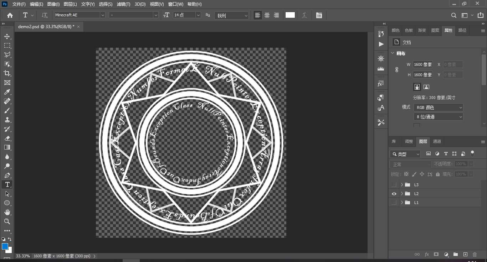
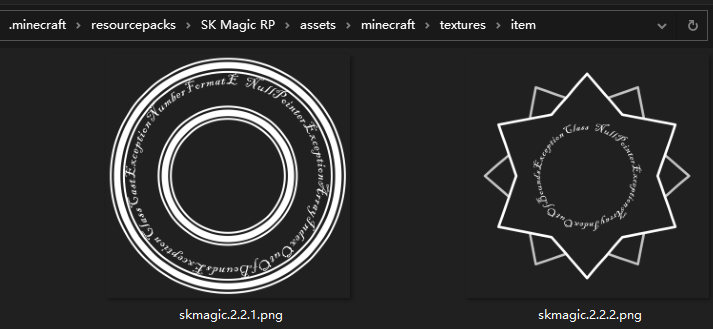
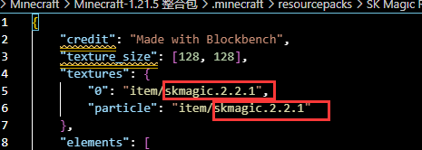
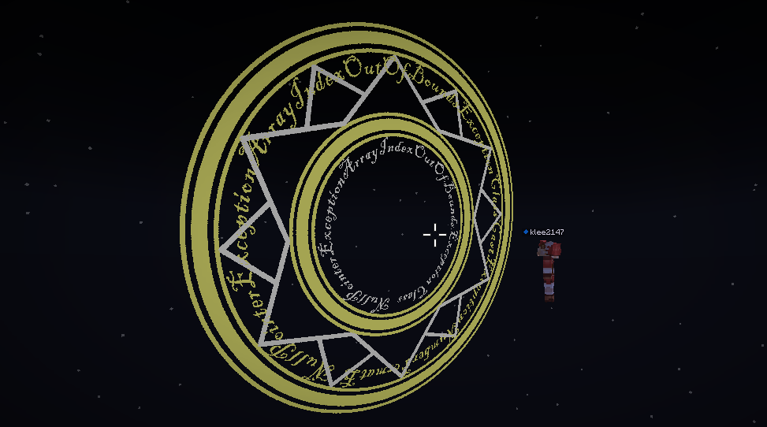

<FeatureHead
    title = '一种基于展示实体的法阵'
    authorName = SKSAMA
    avatarUrl = '../../_authors/sk.jpg'
    :socialLinks="[
        { name: 'BiliBili', url: 'https://space.bilibili.com/1546917549' },
        { name: 'GitHub', url: 'https://github.com/ymqlgthbSakuraDream' }
    ]"
    resourceLink = 'https://ymqlgthbsakuradream.github.io/posts/minecraft/Archive.20250611/'
    cover='../_assets/5.jpg'
/>

本项目旨在通过简单的函数调用创建多样的法阵效果

## API函数

---

**sklibs:skmagic/new**

创建法阵\
执行者将作为新法阵的持有者，如果该执行者已经持有法阵，则新的法阵会替换原来的法阵\  

<NBTTree code='
@Desc<"根标签">
data config {
    @Desc<"该法阵所包含的层">
    elements as list<data {
        @Desc<"(可选，该项默认为model的值) 层ID">
        id as string;
        @Desc<"该层的模型">
        model as string;
        @Desc<"模型的渲染颜色，列表中的三个值分别表示RGB通道，使用颜色转换器计算颜色">
        color as list<float>;
        @Desc<"该层距离玩家眼部的距离">
        distance as float;
        @Desc<"该层的缩放倍数">
        size as float;
        @Desc<"(可选) 旋转步长，例如[10,3.14]表示每10tick旋转3.14弧度，不指定该项则不旋转">
        rotate_step as list<float>;
        @Desc<"(可选，默认为0) 初相位">
        rotate_phase as float;
    }>;
}'
/>

**sklibs:skmagic/modify**  

修改法阵的属性\
将修改执行者所持有的法阵的属性，如果执行者没有持有法阵，则该函数不起作用\

<NBTTree code='
@Desc<"根标签">
data config {
    @Desc<"目标层ID，给所有ID为该ID的层应用如下变换">
    id as string;
    @Desc<"缩放倍数">
    size as float;
    @Desc<"到玩家眼部的距离">
    distance as float;  
    @Desc<"插值时间">
    duration as int;
}'
/>

**sklibs:skmagic/modify2**  

批量修改法阵的属性\
将批量修改执行者所持有的法阵的属性，如果执行者没有持有法阵，则该函数不起作用\

<NBTTree code='
@Desc<"根标签">
data config {
    @Desc<"修改列表">
    modify as list<data {
        @Desc<"目标层ID，给所有ID为该ID的层应用如下变换">
        id as string;
        @Desc<"缩放倍数">
        size as float;
        @Desc<"到玩家眼部的距离">
        distance as float;  
        @Desc<"插值时间">
        duration as int;
    }>;
}'
/>

**sklibs:skmagic/insert**  

向法阵添加新的层\  
向执行者所持有的法阵添加新的层，如果执行者没有持有法阵，则该函数不起作用\  
参数格式与sklibs:skmagic/new相同\

<NBTTree code='
@Desc<"根标签">
data config {
    @Desc<"该法阵所包含的层">
    elements as list<data {
        @Desc<"(可选，该项默认为model的值) 层ID">
        id as string;
        @Desc<"该层的模型">
        model as string;
        @Desc<"模型的渲染颜色，列表中的三个值分别表示RGB通道，使用[颜色转换器](#color)计算颜色">
        color as list<float>;
        @Desc<"该层距离玩家眼部的距离">
        distance as float;
        @Desc<"该层的缩放倍数">
        size as float;
        @Desc<"(可选) 旋转步长，例如[10,3.14]表示每10tick旋转3.14弧度，不指定该项则不旋转">
        rotate_step as list<float>;
        @Desc<"(可选，默认为0) 初相位">
        rotate_phase as float;
    }>;
}'
/>

**sklibs:skmagic/remove**  

移除函数执行者所持有的法阵\
没有参数

**sklibs:skmagic/danmaku**  

发射弹幕\  
向执行者面向的方向发射指定数量的弹幕\

<NBTTree code='
@Desc<"根标签">
data config {
    @Desc<"弹幕的数量">
    n as int;
}'
/>

::: details 颜色转换器
<div id="color"></div>
<iframe src="https://tools.minecraft.wiki/static/tools/decimalColor/" style="border: none; display: block; width: 100%; height: 355px; background-color: #f0f0f0;"></iframe>
:::

## 快速体验

快速体验**[演示视频](链接一会补上)**中的法阵  
聊天框里执行该函数打开菜单

```mcfunction
/function sklibs:skmagic/demo/menu
```


## 制作自己的法阵

一张图看懂下面整个流程


下载**[资源包](#download)**，并将它解压到`.minecraft/resourcepacks`文件夹下，这个资源包里存放了一些已经制作好的材质和模型，现在我们将在它的基础上制作新的材质与模型  
  
绘制材质，可以使用PhotoShop绘制，需要注意以下几点  

- 图像应为正方形
- 绘制的图案应为白色，这是为了方便后续着色
- 图案以外的地方保持透明



将绘制好的材质分层导出，因为法阵是需要旋转的，我们希望每一层有不同的旋转速度。需要多少层并无限制，这里演示只分了两层  
  
- 图像导出到`(资源包)/assets/minecraft/textures/item`文件夹下
- 文件名任意



然后需要制作模型  
来到`(资源包)/assets/minecraft/models/skmagic`文件夹下，找到`demo.json`复制一份，文件名任意，打开新复制的json文件，填入刚才做好的材质文件的文件名，注意这里的文件名没有.png后缀，如图所示



如果你的材质文件分了很多层，则每一层都需要单独创建模型文件，刚才的材质有两层，则需要两个模型文件，如图所示 


接下来需要添加**[物品模型映射](https://zh.minecraft.wiki/w/%E7%89%A9%E5%93%81%E6%A8%A1%E5%9E%8B%E6%98%A0%E5%B0%84)**  
打开`(资源包)/assets/minecraft/items/acacia_button.json`添加如下内容，如图所示，红色方框指定的是模型文件的文件名，不需要.json后缀，绿色方框是模型的“调用名称”，你可以通过这个名字来调用对应的模型文件  


```json
        {"when": "d2.2.1","model": {"type": "model","model": "minecraft:skmagic/d2.2.1","tints": [{"type": "dye","default": [0,0,0]}]}},
        {"when": "d2.2.2","model": {"type": "model","model": "minecraft:skmagic/d2.2.2","tints": [{"type": "dye","default": [0,0,0]}]}}
```

最后只需要调用`sklibs:skmagic/new`函数就可以看到效果了

```mcfunction
function sklibs:skmagic/new {config:{elements:[
    {model:"d2.2.1",id:"1",size:6f,distance:8f,color:[1, 1, 0.5],rotate_step:[15,0.5]},
    {model:"d2.2.2",id:"1",size:6f,distance:8f,color:[1, 1, 1],rotate_step:[15,-0.5]},
]}}
```



## 数据包下载

[数据包 1.21.5_skmagic_1.0.7z](https://ymqlgthbsakuradream.github.io/posts/minecraft/Archive.20250611/1.21.5_skmagic_1.0.7z)

[资源包 SK Magic RP.7z](https://ymqlgthbsakuradream.github.io/posts/minecraft/Archive.20250611/SK%20Magic%20RP.7z)
