<FeatureHead
    title = 'Minecraft 自定义结构生成指南'
    authorName = 酒石酸菌
    avatarUrl = '../../_authors/酒石酸菌.webp'
    :socialLinks="[
        { name: 'BiliBili', url: 'https://space.bilibili.com/4435845' },
        { name: 'Github', url: 'https://github.com/TartaricAcid' }
    ]"
/>

## 导读

Minecraft 作为一款沙盒游戏，其高度自由的玩法一直是玩家们热爱的核心与灵魂。冒险内容更是广受欢迎，许多玩家乐于探索新的群系和维度，结伴挑战那些危险或奇妙的结构。随着游戏的发展，玩家对于个性化内容的需求也越来越高。

自 Minecraft 1.18 版本起，游戏引入了强大的 worldgen（世界生成）自定义功能，使得自定义结构可以完全通过数据包实现，无需编写复杂的代码。这一革新为创作者们打开了全新的世界，让他们能够轻松地为游戏添加独特的建筑群落和探索内容。

本教程适用于所有数据包、模组、插件作者。无论你使用的是原版 Minecraft、Forge、NeoForge、Fabric、Spigot 还是 PaperMC 平台，自定义结构的实现方式几乎都是一致的。

本文以 NeoForge 1.21.1 环境为例进行详细讲解，同时涵盖的技术内容理论上适用于 1.20 及以上的所有版本。考虑到本教程主要面向入门用户，我们将重点关注实用性和可操作性，对于一些过于复杂的参数细节不会深入探讨。如果后续有需要，我们会另行推出专门的高级解析篇章。

## 理解结构集（Structure Set）

在 Minecraft 进行世界生成时，游戏引擎会自动读取 `worldgen/structure_set` 文件夹下的所有结构集定义文件，并根据配置在合适的生物群系中生成对应的结构。

结构集本质上是一个配置文件，它告诉游戏"在什么地方、以什么频率、生成哪些建筑"。

通过自定义数据包，我们可以轻松添加全新的结构集。首先需要创建标准的数据包目录结构：

```
自定义数据包
└── data
    └── custom (命名空间，可以自定义)
        └── worldgen
            └── structure_set
                └── custom.json (结构集名称，可以自定义)
```

在编写结构集文件时，推荐使用 <https://misode.github.io/worldgen/structure-set> 这个优秀的在线工具来生成对应的 JSON 配置。该网站提供了可视化功能，能够直观地观察结构生成密度和分布效果，对于新手来说非常友好。

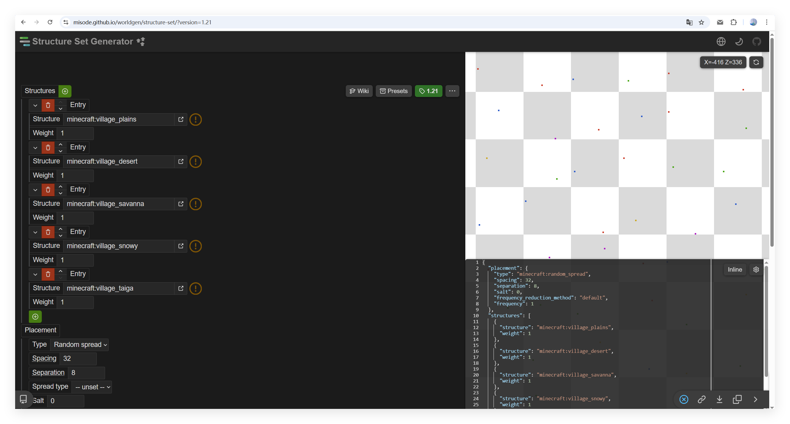

为了更好地理解结构集的作用，我们以一个有趣的例子来演示：**将原版村庄改造成非常城市化的村庄。**

```json
{
  "placement": {
    // 一般来说都是 random_spread，除非是要塞那种特殊机制的结构
    "type": "minecraft:random_spread",
    // 村庄既然要城市化，那么必须生成概率要大大增加，我们让它每 2 区块尝试生成一次
    "spacing": 2,
    // 村庄之间的最小距离（区块）。两次结构之间的最大距离则为 2 × spacing - separation
    "separation": 1,
    // 盐，对的，就叫这个。需要懂一些密码学知识才能理解，你可以把它理解为一个随机数种子
    "salt": 0,
    // 频率算法，默认就行了
    "frequency_reduction_method": "default",
    // 频率，0-1，既然我们要城市化，那么就让它 100% 生成吧
    "frequency": 1
  },
  // 所有尝试加入的结构
  "structures": [
    {
      "structure": "minecraft:village_plains",
      "weight": 1
    },
    {
      "structure": "minecraft:village_desert",
      "weight": 1
    },
    {
      "structure": "minecraft:village_savanna",
      "weight": 1
    },
    {
      "structure": "minecraft:village_snowy",
      "weight": 1
    },
    {
      "structure": "minecraft:village_taiga",
      "weight": 1
    }
  ]
}
```

重新进入游戏后，你会惊喜地发现村庄变得极其密集，非常的城市化：


通过这个简单的例子，我们可以看到结构集配置的强大威力。仅仅修改几个参数，就能完全改变游戏的探索体验。

## 深入结构定义（Structure）

在前面的例子中，我们在结构集的 `structures` 字段中使用了原版的结构定义文件。但实际上，这些结构定义本身也是完全可以自定义的，这为我们提供了更大的创作空间。

这里需要注意一个重要的区别：原版中有两个都叫做 `structure` 的文件夹，它们的用途截然不同。一个位于数据包根目录下，存储的是 NBT 格式的结构模板文件（这些是通过结构方块导出的）；另一个位于 `worldgen/structure` 路径下，存储的是 JSON 格式的结构定义文件（这些是告诉游戏如何生成结构的配置）。

结构定义文件的功能非常强大，它允许我们精确控制结构的各个方面：生成类型、适用的生物群系、生成位置（如地面、地下或水中）、生成高度范围、结构内生物类型，以及结构与周围地形的契合方式等等。这些参数的组合能够创造出千变万化的生成效果。

Minecraft Wiki 的[结构定义格式](https://zh.minecraft.wiki/w/%E7%BB%93%E6%9E%84%E5%AE%9A%E4%B9%89%E6%A0%BC%E5%BC%8F)页面详细列出了所有可用的结构类型，从中我们可以看出不同类型的自定义程度：

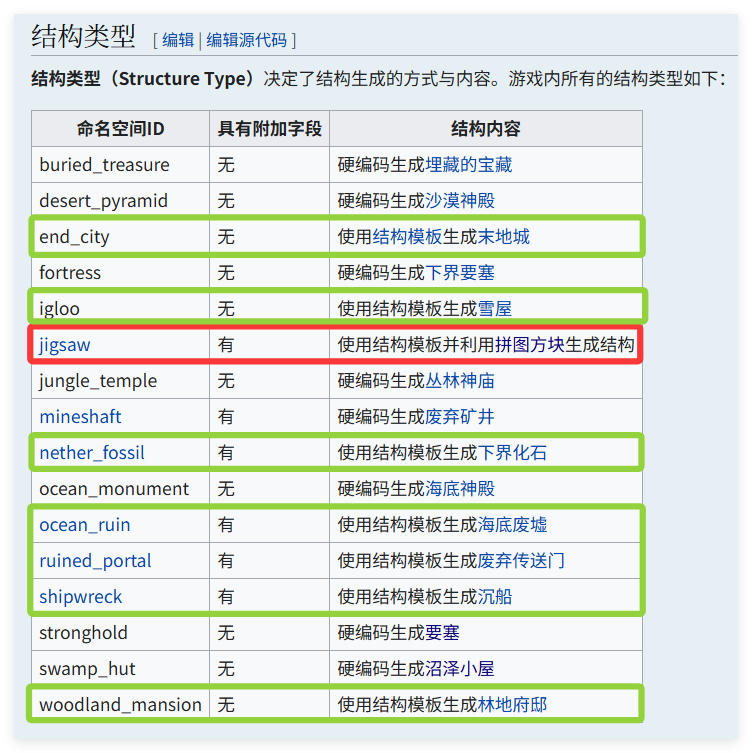

- 未圈部分：自定义程度最低，仅能修改部分参数，建筑样式无法更改；
- 绿色部分：自定义程度较高，可修改参数和结构模板；
- 红色部分：自定义程度最高，可修改大量生成参数，并通过拼图机制实现复杂结构生成。

> [!TIP]
> 仔细观察结构的诞生时间：1.13 之前的结构多为硬编码；1.18 之前开始使用结构模板；之后则全面采用拼图机制。


为了展示结构定义的强大功能，我们来尝试一个富有想象力的项目：让村庄生成在海底，创造一个真正的亚特兰蒂斯村庄！

首先，我们需要在 `worldgen/structure` 目录下创建 `custom_village.json` 文件。这个文件将定义我们的海底村庄如何生成：

```json
// 我们来生成一个亚特兰蒂斯
// 参数可参考：https://zh.minecraft.wiki/w/%E7%BB%93%E6%9E%84%E5%AE%9A%E4%B9%89%E6%A0%BC%E5%BC%8F
{
  // 类型，只有 minecraft:jigsaw 自由度是最高的
  "type": "minecraft:jigsaw",
  // 我盟让它生成在所有带有 #minecraft:is_ocean 的生物群系中
  "biomes": "#minecraft:is_ocean",
  // 拼图方块距离起始点的最大距离
  "max_distance_from_center": 80,
  // 可选参数，村庄的生成高度
  // 这里我填写 OCEAN_FLOOR_WG，理论上它会生成在海床上
  "project_start_to_heightmap": "OCEAN_FLOOR_WG",
  "start_height": {
    "absolute": 0
  },
  // 村庄大小，我们设定小一些，3，也就是最多递归生成 3 次
  "size": 3,
  // 这个结构范围内可以生成的生物，留空，表示默认
  "spawn_overrides": {},
  // 起始的拼图池
  "start_pool": "minecraft:village/plains/town_centers",
  // 生成的阶段，参考 WiKi
  "step": "surface_structures",
  // 与周围地形的适配，这里就用这个，能自动契合周围环境
  "terrain_adaptation": "beard_thin",
  // 当超出范围时还生成其他拼图结构么
  // 用来防止结构垂直方向生成
  "use_expansion_hack": true
}
```

接下来，我们需要修改之前创建的结构集文件，将原版村庄替换为我们的自定义海底村庄：

```json
{
  "placement": {
    "type": "minecraft:random_spread",
    // 为了避免村庄叠村庄，这次我们把生成间隔稍微扩大一些，方便观察
    "spacing": 8,
    "separation": 2,
    "salt": 0,
    "frequency_reduction_method": "default",
    "frequency": 1
  },
  "structures": [
    // 这里只写我们的结构
    {
      "structure": "custom:custom_village",
      "weight": 1
    }
  ]
}
```

完成配置后重新进入游戏，你会在海洋中发现一些奇妙的现象。虽然村庄的起始建筑确实按照我们的设定生成在了海床上，但后续的拼图部分却出现了意想不到的效果：

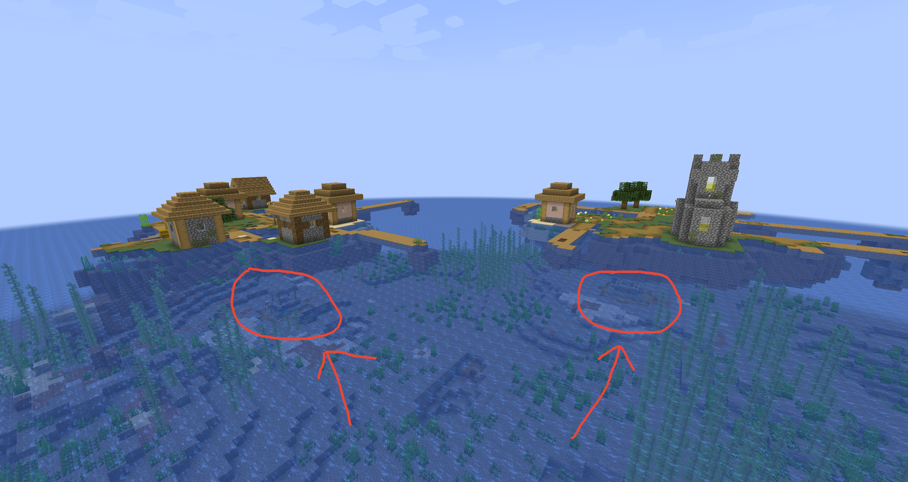

这个现象揭示了一个重要问题：为什么村庄起点能够正确地生成在海床上，但后续的拼图结构却不符合我们的预期呢？要理解这个问题，我们需要深入了解 Minecraft 拼图结构的生成机制。

## 解密拼图结构生成机制

在 Minecraft 的方块化世界中，如何自然地生成大型建筑群一直是一个技术挑战。简单的网格化放置会让建筑显得僵硬和不自然，而 Mojang 开发的拼图机制则巧妙地解决了这个问题。这套系统不仅保证了结构的自然衔接，还实现了高度的随机性和可扩展性。

关于拼图机制的工作原理，YouTube 上有一个非常优秀的可视化教程，强烈推荐观看：<https://www.youtube.com/watch?v=VNaGXvpE0Nw>。该视频用直观的动画展示了整个生成过程，比文字描述更容易理解。

### 递归生成的拼图逻辑

当游戏确定需要生成一个大型建筑群时，整个过程从一个中央起始结构开始。这个起始结构并不是独立的建筑，而是包含了多个关键的拼图方块，这些方块就像是建筑的"接口"：

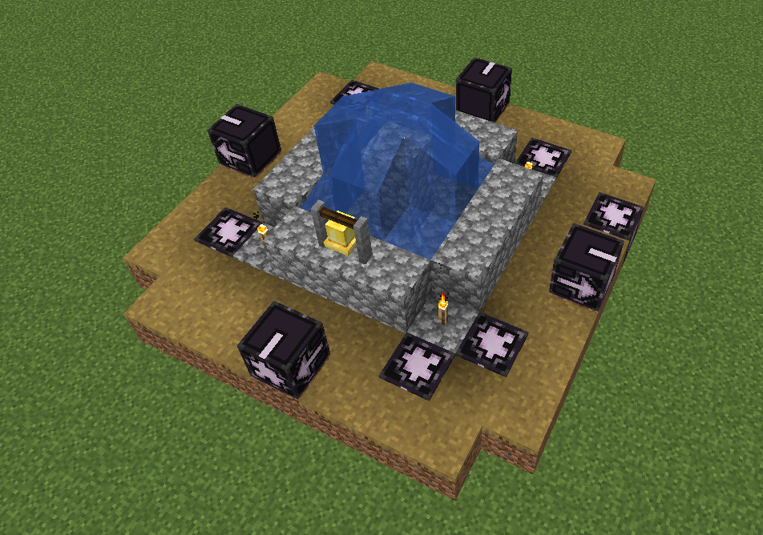

当我们用调试工具打开这些拼图方块时，可以看到其内部存储着丰富的配置信息：

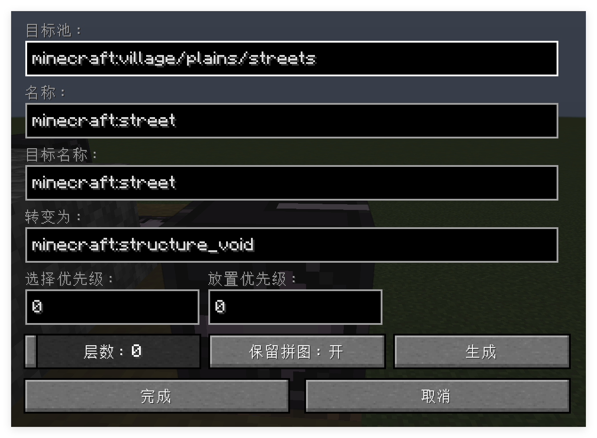

每个拼图方块的数据都指定了下一个应该生成的结构池，系统会从该池中随机选择一个合适的结构，并沿着拼图方块指定的方向继续生成。这种设计确保了每次生成的建筑群都有所不同，避免了重复感。

生成过程是这样进行的：当系统识别到起始结构中的拼图方块时（如下图箭头所指的位置），它会触发下一层结构的生成过程：

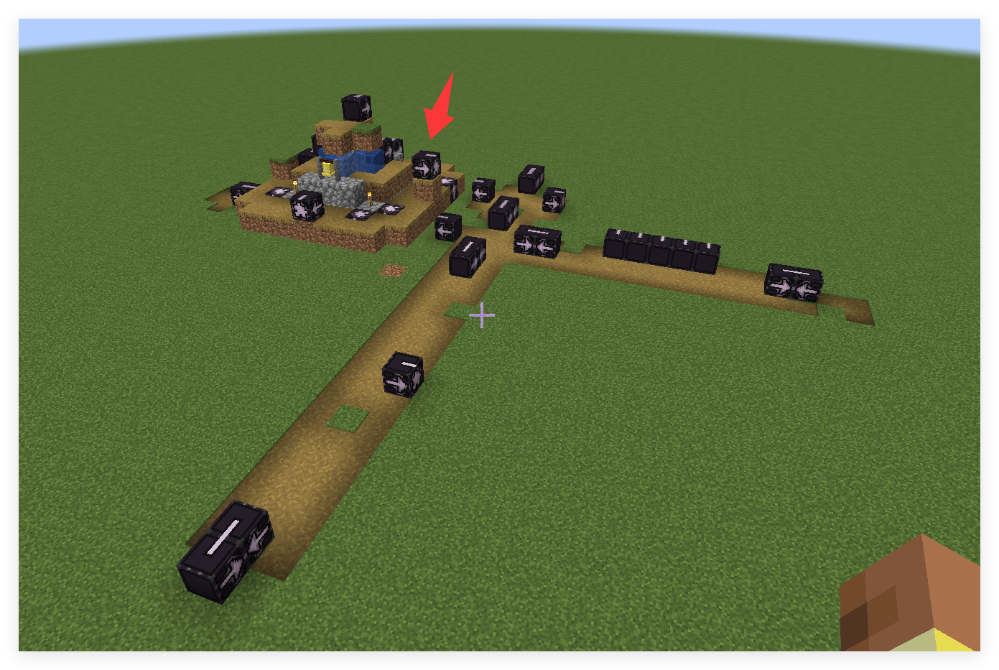

新生成的结构会自然地与原有结构衔接，形成连贯的街道网络。这个过程不断重复，逐渐构建出完整的建筑群：

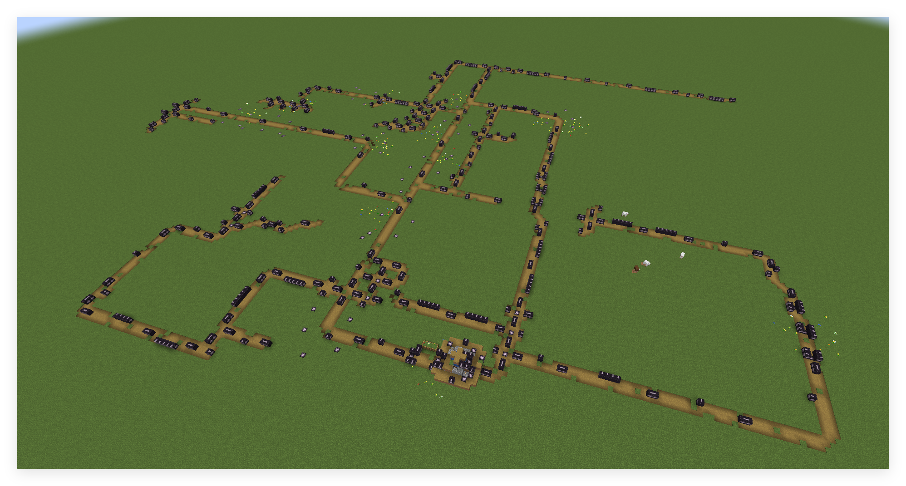

在街道结构生成完成后，系统会继续处理街道结构中的拼图方块，从村庄小屋结构池中随机选择合适的建筑进行生成。随后，小屋结构池又会从村民或动物结构池中选择生成对象，最终完成整个村庄的构建。这种层次化的递归生成机制确保了村庄既有统一的风格，又具备丰富的多样性。

当然，如果不对这种递归过程加以限制，理论上它可以无限进行下去，这显然是不现实的。因此，系统设计了多重限制机制来控制生成范围。

前面我们在 `custom_village.json` 文件中设置的 `size` 参数正是用于控制这种递归深度的关键配置。系统设定的最大递归深度为 22 层，当达到这个限制时，系统将自动停止尝试生成新的结构，避免无限扩展。

### 拼图拼接的智能匹配机制

拼图拼接机制是整个系统的技术核心，它决定了不同结构如何自然地连接在一起。深入理解这个机制对于创建复杂且协调的自定义结构至关重要。

拼图方块的放置位置策略直接影响其拼接行为，主要体现在两种不同的应用场景中。

**1. 边界外延拼接**

拼图方块可以摆放在结构边线上，朝外链接其他结构。只要外部结构不与已有结构产生碰撞，就能成功放置：

这种方式常用于街道、建筑群和道路网络的构建：

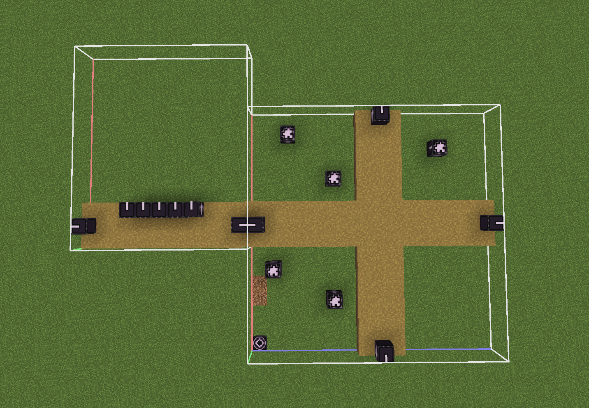

**2. 内部嵌入拼接**

拼图方块也可以放置在结构内部，用于嵌入子结构。此时系统会严格判断可用空间大小：

如下图所示：

- A 拼图所处区域有 13 格空间，可以拼接房屋 C 或 D
- B 拼图所处区域只有 7 格空间，仅能拼接房屋 C

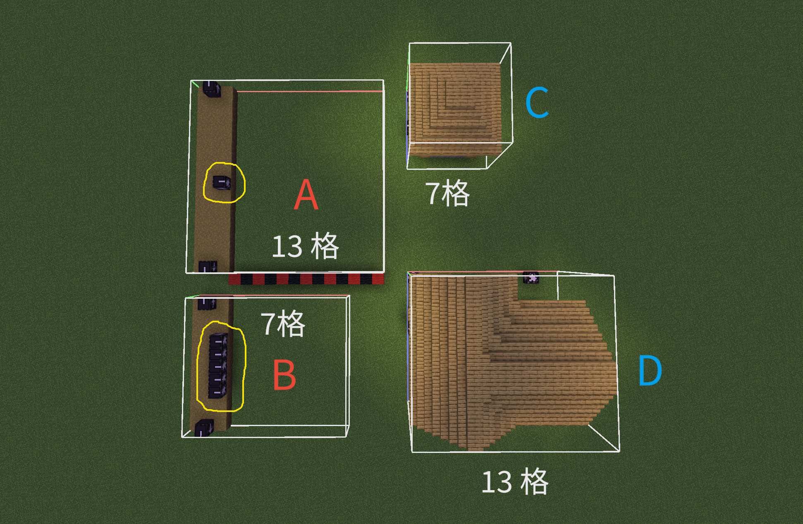

系统的碰撞检测机制是拼图系统能够稳定运行的重要保障。它确保新生成的结构不会与已有建筑产生重叠或冲突。TelepathicGrunt 在其[结构教程项目](https://github.com/TelepathicGrunt/StructureTutorialMod)中提供了一个很好的可视化演示，其中红色框表示会产生冲突的情况，帮助我们直观理解这个检测过程：

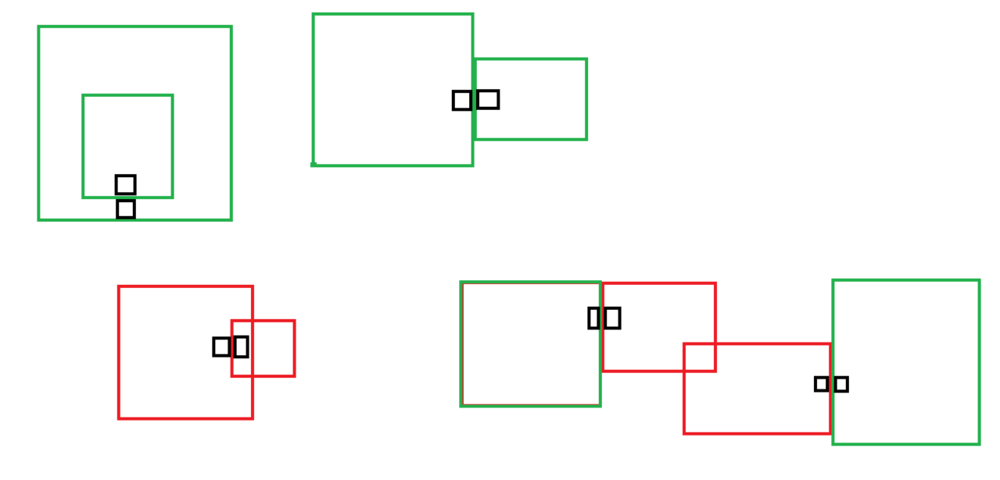

当拼图方块检测到目标结构无法在当前位置成功放置时，系统并不会简单地跳过这个位置，而是启动智能的降级处理机制。系统会读取结构池配置中的 fallback 字段，该字段指向另一个备用结构池。程序会递归地检查备用池中的所有可放置结构。

这种设计有效避免了结构生成突然中断的情况，确保能够生成合适的收尾结构，保持整体建筑群的完整性：

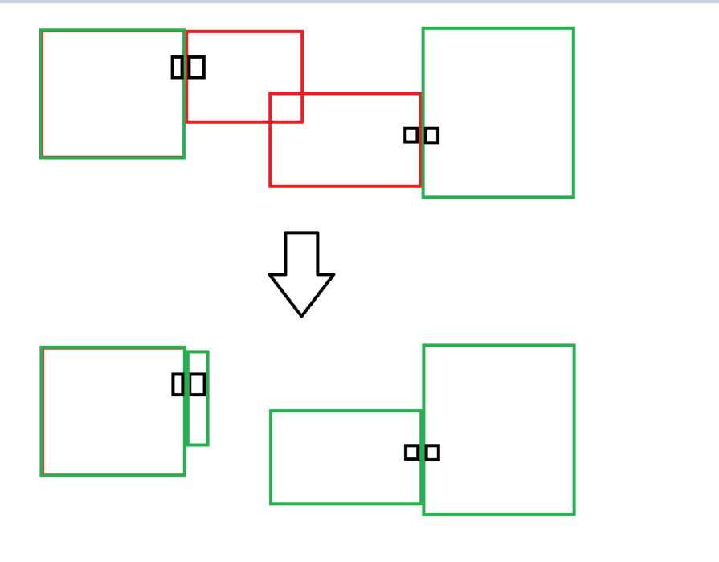

在结构池的配置中，每个结构都被赋予了权重值，这些数值直接影响结构被选中的概率。权重值越大的结构，在随机选择过程中被选中的可能性就越高。这种加权随机机制让创作者能够精确控制不同类型建筑在生成结果中的出现频率：

```json
{
  "elements": [
    {
      "element": {
        "element_type": "minecraft:legacy_single_pool_element",
        "location": "minecraft:village/plains/streets/corner_01",
        "processors": "minecraft:street_plains",
        "projection": "terrain_matching"
      },
      "weight": 2
    },
    {
      "element": {
        "element_type": "minecraft:legacy_single_pool_element",
        "location": "minecraft:village/plains/streets/straight_02",
        "processors": "minecraft:street_plains",
        "projection": "terrain_matching"
      },
      "weight": 4
    },
    {
      "element": {
        "element_type": "minecraft:legacy_single_pool_element",
        "location": "minecraft:village/plains/streets/straight_03",
        "processors": "minecraft:street_plains",
        "projection": "terrain_matching"
      },
      "weight": 7
    }
  ],
  "fallback": "minecraft:village/plains/terminators"
}
```

### 地形适配的智能算法

对于地下遗迹这类结构，系统可以直接按照网格化的方式进行生成，因为它们不需要与地表环境产生复杂的交互。但对于村庄这类需要与地表环境和谐共存的结构，如果仍然采用僵硬的网格化生成方式，当建筑群跨越山坡、河流或其他地形变化时，就会产生极不自然的视觉效果。

Mojang 的开发团队充分考虑到了这个问题，并在结构池配置中引入了地形匹配参数。以村庄使用的 `terrain_matching` 为例，该算法在生成下一个拼图结构时会智能分析周围的地形特征：当遇到水面区域时，系统会自动铺设木板或桥梁结构；当遇到山坡地形时，系统会自动调整建筑的高度和角度，使其自然贴合当前的地形起伏。

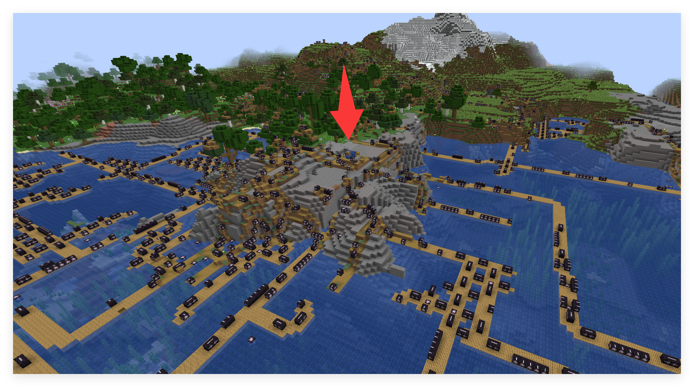

这种地形适配机制有一个重要特点：除了起始结构是按照配置强制放置的之外，所有后续从模板池中选取的结构都会经过自动地形适配处理。这确保了最终生成的建筑群不仅在功能上连贯统一，在视觉上也与周围环境融为一体，创造出自然和谐的景观效果。

### 问题根源：亚特兰蒂斯村庄的生成异常

现在我们可以清楚地诊断出之前海底村庄项目中遇到的问题了。虽然我们在结构定义中明确指定了村庄应该生成在海床上，并且起始结构确实按照我们的设定强制放置在了正确的位置，但是后续的结构生成却出现了意外。

问题的核心在于：我们在指定结构池时完全沿用了原版的配置内容。虽然第一个中心建筑按照我们的自定义设定被强制放置在海床上，但所有后续的拼图结构都被原版的"地形自动匹配算法"进行了处理。这个算法并不知道我们想要创建一个海底文明，它仍然试图让建筑与"正常"的地表环境相匹配，这就导致了那种看似诡异但实际上符合算法逻辑的生成效果。

要彻底解决这个问题并创造出真正的亚特兰蒂斯村庄，我们需要更深入地自定义整个生成流程，包括创建专门的结构模板和配套的结构池配置。

## 创建自定义结构模板

### 结构方块：建筑师的数字化工具

结构方块是 Minecraft 中创建自定义结构的核心工具，它就像是一个强大的建筑录制器，能够将你的创意建筑转化为可复用的数字模板。

结构方块是创造模式的专用工具，普通玩家无法在创造物品栏中直接找到它。你需要通过以下指令来获取：

```mcfunction
/give @s minecraft:structure_block
```

结构方块具有三种不同的工作模式，每种模式都有其特定的用途。

1. **保存模式（Save）**：用于导出结构
2. **加载模式（Load）**：用于导入结构
3. **角落模式（Corner）**：用于标记结构边界

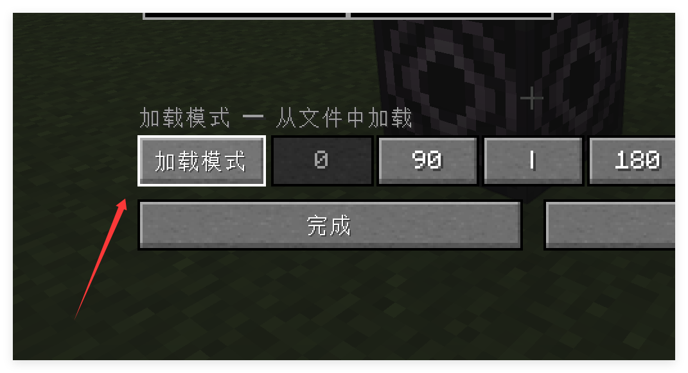

### 从构思到模板：完整的结构导出工程

#### 步骤1：构建结构

在创造模式下建造你想要的结构，注意以下几点：

- 保持结构尺寸合理（最大 48×48×48）
- 如果你要做拼图结构，需仔细考虑拼图方块的放置位置、朝向和名称
- 预留必要的空位用于结构适配

#### 步骤2：放置结构方块

1. 在结构的一个角落放置结构方块
2. 将模式设置为"保存"（Save）
3. 输入结构名称（如 `custom:my_house`）

#### 步骤3：设置边界

- **手动设置**：在"大小"字段中输入 X、Y、Z 尺寸
- **自动检测**：使用"检测"按钮自动计算结构大小
- **角落标记**：使用角落模式的结构方块标记对角

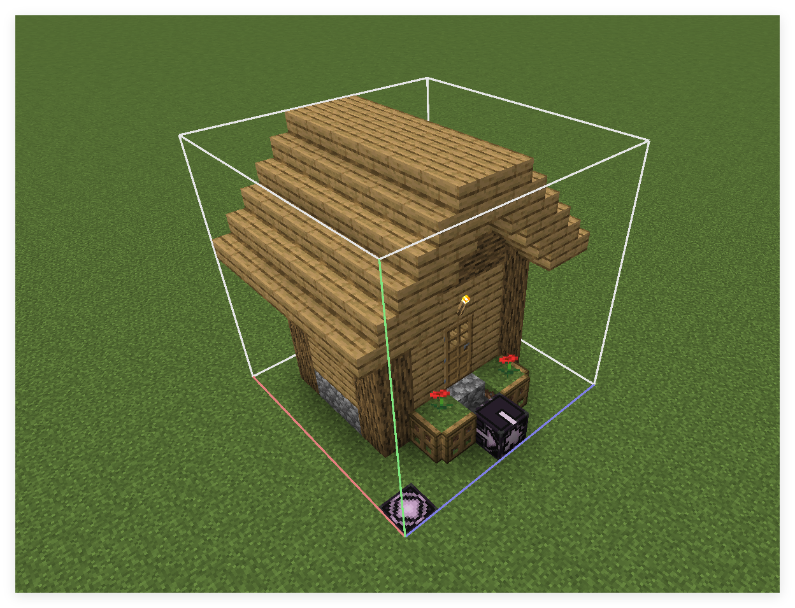

最后一步是执行保存操作。点击"保存"按钮后，结构将被保存到你当前存档文件夹下的特定路径：`generated/minecraft/structures/custom/my_house.nbt`。这个 NBT 文件就是你的结构模板，可以在不同的世界和数据包中重复使用。

### 结构空位（Structure Void）

结构空位是一个特殊方块，在结构生成时会被处理为"不替换原有方块"。

**获取方式：**

```mcfunction
/give @s minecraft:structure_void
```

**主要用途：**

1. **保持原有地形**
   - 在山坡上生成建筑时，结构空位位置保持原地形
   - 避免不必要的地形破坏

2. **部分替换策略**
   - 只替换特定区域的方块
   - 保持自然的地形过渡

3. **空气区域标记**
   - 明确标记哪些位置应该是空气
   - 区分"替换为空气"和"不进行替换"

当你摆放结构空位时，建议打开结构方块的配置"显示隐形方块"功能，方便观察空气、结构空位等：

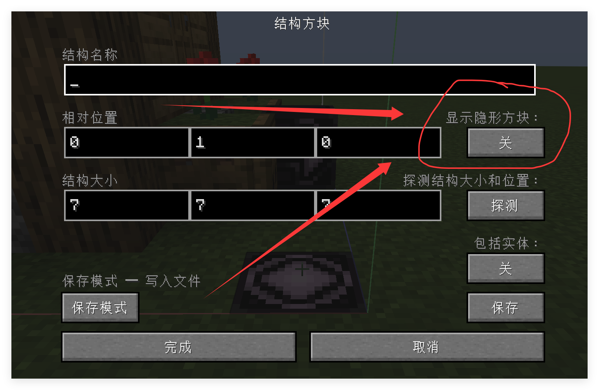

此时空气方块会显示为紫色小框，结构空位显示为粉色小框

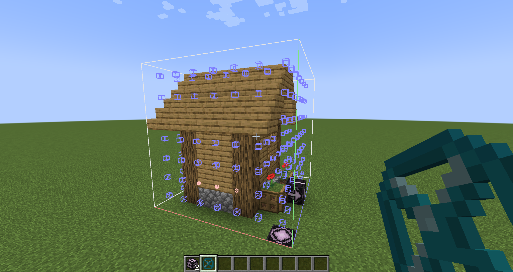

### 拼图方块参数详解

拼图方块是拼图系统的核心，其参数配置直接影响结构的生成效果。

拼图在摆放时是需要注意朝向的。朝上的拼图只会和朝下的拼图链接，朝下的同理。但任意水平方向的拼图则会自动旋转整个结构来适配合适的朝向。

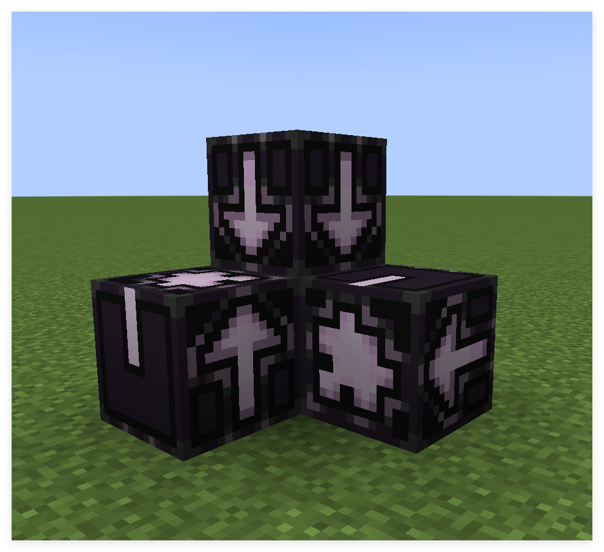

接下来对各个参数进行介绍：

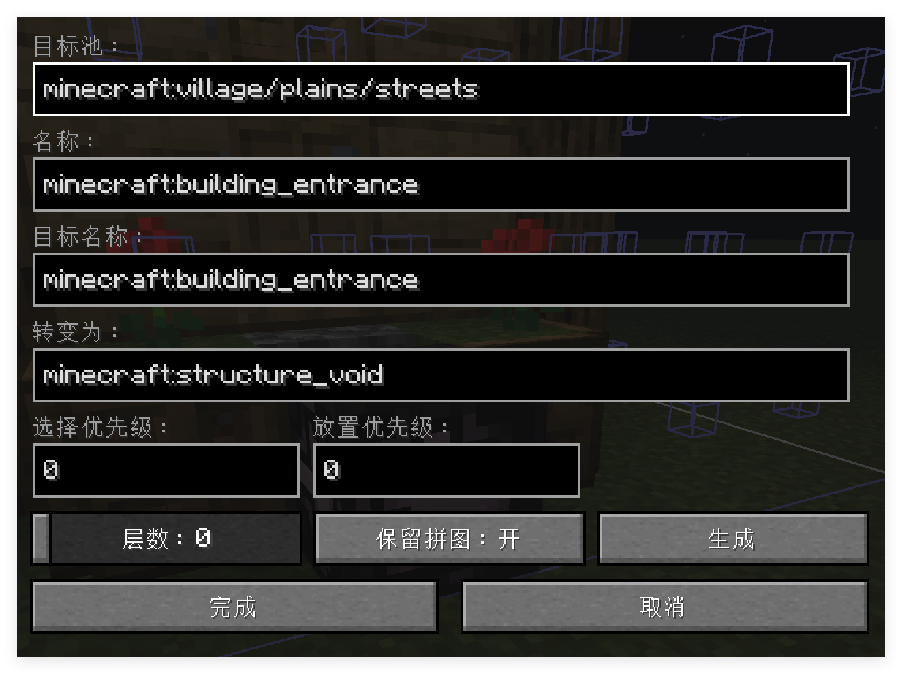

#### 1. 目标池

指定下一个结构应该从哪个结构池中选择：
上图中的为 `minecraft:village/plains/streets` 就表示从原版此 ID 的结构池中随机选择合适的结构与当前拼图进行拼接。

#### 2. 名称

当前拼图方块的标识符，用于与其他拼图方块匹配。

#### 3. 目标名称

指定要连接的拼图方块名称，必须匹配才能成功连接。

```text
连接示例:
拼图 A 名称: "minecraft:building_entrance"
方块 B 目标名称: "minecraft:building_entrance"
→ 成功连接
```

#### 4. 转变为

游戏在自然生成结构时，会主动移除所有的拼图方块，这里就填写此拼图方块移除后，该处转变成的方块种类。
填写为 `minecraft:structure_void` 时则和前面的结构空位效果一致。

#### 5. 层数

控制点击“生成”按钮时递归生成的层数，仅用于游戏内调试，不会写进模板文件中

#### 6. 保持拼图

决定拼图方块在结构生成后是否保留，仅用于游戏内调试，不会写进模板文件中。

## 高效的结构文件管理与优化

**结构验证清单：**

- [ ] 拼图方块配置正确
- [ ] 结构空位放置合理
- [ ] 尺寸符合限制要求
- [ ] 与目标池兼容
- [ ] 文件命名规范

当你完成上述检查项目后，就可将导出的 nbt 文件放进你的数据包的 structure 文件夹中。为了保持项目的整洁性，建议创建合理的子文件夹结构来组织不同类型的建筑：

```text
数据包
└── data
    └── custom    # 命名空间文件夹
        └── structure
            ├── building    # 套的子文件夹，仅仅是为了规整，非必须
            │   ├── house_small.nbt
            │   └── house_large.nbt
            └── decoration
                └── fountain.nbt
```

由于结构文件采用二进制的 NBT 数据格式并使用 gzip 压缩，直接编辑这些文件是相当困难的。幸运的是，社区开发了优秀的工具来解决这个问题。使用 VSCode 编辑器并安装 [NBT Viewer](https://marketplace.visualstudio.com/items?itemName=Misodee.vscode-nbt) 插件，就可以方便地打开和编辑这些结构模板文件。

该插件的 3D 可视化功能特别实用。当你选中 3D 视图中的特定方块时，可以直接修改其内部存储的数据。如下图所示，我们可以通过插件直接修改拼图方块中的结构池名称，这极大地简化了数据包的制作和调试过程：

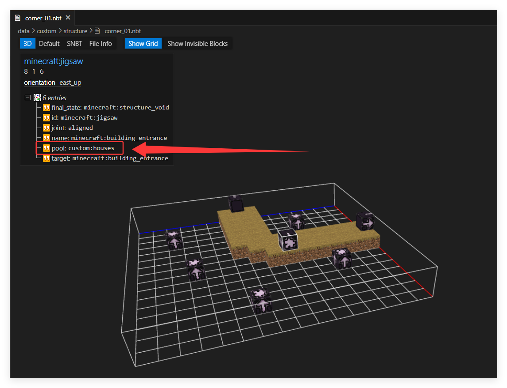

## 构建结构池系统

结构池是拼图生成系统的核心配置文件，它定义了结构之间的连接关系和生成逻辑。详细的参数说明可以参考 <https://zh.minecraft.wiki/w/%E7%BB%93%E6%9E%84%E6%B1%A0>。

拼图方块中配置的"目标池"字段实际上就是结构池的 ID 标识符。当游戏生成起始结构后，起始结构中的拼图方块会根据这个标识符在数据包中寻找对应的结构池配置，然后从池中随机选取合适的结构进行递归生成。整个过程中，系统还可以在生成前后对结构进行额外的修改和处理。

原版村庄的生成遵循着一套精心设计的层次结构：从起始结构（town_centers）开始，扩展到街道系统（streets），再连接到各种村庄建筑（houses），最后生成村民和动物（villager）。在这个主要流程中，还会穿插一些装饰性元素（decor）、植被（trees），以及没有任何拼图连接的终止结构（terminators），这些元素共同构成了丰富多样的村庄生态。

为了高效实现我们的亚特兰蒂斯村庄项目，我们将采用渐进式的方法：在修改原版模板文件的基础上，重点创建起始结构、街道系统和村庄建筑这三个核心部分的结构池配置。

### 起始结构池配置（`worldgen/template_pool/town_centers.json`）

起始结构池定义了村庄的核心建筑，通常是广场、喷泉或其他标志性建筑。这个结构池的配置相对简单，因为它只需要包含一个或几个中心建筑选项：

```json
{
  "elements": [
    {
      "element": {
        // 固定写这个
        "element_type": "minecraft:single_pool_element",
        // 这需要我们放一个模板文件 plains_fountain_01.nbt 在 structure 文件夹下（注意不是 worldgen 下的那个）
        // 这里为了方便，我们直接修改原版的结构文件
        "location": "custom:plains_fountain_01",
        // 我们先暂时留空
        "processors": "minecraft:empty",
        // 必须设置为 rigid，否则不能在水下生成
        "projection": "rigid"
      },
      "weight": 1
    }
  ],
  // 这个池子没有其他元素了，所以我们设置一个空的回退
  "fallback": "minecraft:empty"
}
```

### 街道系统池配置（`worldgen/template_pool/streets.json`）

街道系统是连接各个建筑的骨架结构，需要包含多种不同的道路类型以适应各种连接需求：

```json
{
  "elements": [
    {
      "element": {
        "element_type": "minecraft:legacy_single_pool_element",
        // 直道，没有小屋拼图
        "location": "custom:straight_01",
        "processors": "minecraft:empty",
        "projection": "rigid"
      },
      "weight": 4
    },
    {
      "element": {
        "element_type": "minecraft:legacy_single_pool_element",
        // 直道，带一个 13 格空位的小屋拼图
        "location": "custom:straight_02",
        "processors": "minecraft:empty",
        "projection": "rigid"
      },
      "weight": 4
    },
    {
      "element": {
        "element_type": "minecraft:legacy_single_pool_element",
        // 转角，带一个 7 格空位的小屋拼图
        "location": "custom:corner_01",
        "processors": "minecraft:empty",
        "projection": "rigid"
      },
      "weight": 4
    },
    {
      "element": {
        "element_type": "minecraft:legacy_single_pool_element",
        // 十字路口，带七个 7 格空位的小屋拼图
        "location": "custom:crossroad_01",
        "processors": "minecraft:empty",
        "projection": "rigid"
      },
      "weight": 4
    }
  ],
  "fallback": "minecraft:empty"
}
```

### 建筑结构池配置（`worldgen/template_pool/houses.json`）

建筑结构池包含了村庄中的各种房屋和功能建筑，这些建筑会被街道系统中的拼图方块调用：

```json
{
  "elements": [
    {
      "element": {
        "element_type": "minecraft:legacy_single_pool_element",
        // 小型村民房屋，占地 7 格
        "location": "custom:plains_small_house_1",
        "processors": "minecraft:empty",
        "projection": "rigid"
      },
      "weight": 1
    },
    {
      "element": {
        "element_type": "minecraft:legacy_single_pool_element",
        // 中型村民房屋，占地 13 格
        "location": "custom:plains_medium_house_1",
        "processors": "minecraft:empty",
        "projection": "rigid"
      },
      "weight": 1
    }
  ],
  "fallback": "minecraft:empty"
}
```

仅有结构池配置文件还不足以完成我们的亚特兰蒂斯项目，我们还需要提供配套的结构模板文件，也就是上述配置中 `location` 字段所引用的具体建筑文件。

在这个阶段，我们可以采用一个高效的方法：直接复制原版的结构模板文件，然后使用 VSCode 的 NBT Viewer 插件进行必要的修改。

使用插件打开结构文件后，重点关注其中的拼图方块配置。

在 3D 视图中选中拼图方块时，需要仔细检查 pool 字段的设置，这个字段决定了该拼图方块在递归生成时会选择哪个结构池。我们需要将所有引用原版结构池的地方替换为我们自定义的结构池。

具体来说，如果原来的配置指向 streets 相关的结构池，要修改为我们的 `custom:streets`；如果指向 houses 相关的结构池，要修改为我们的 `custom:houses`。

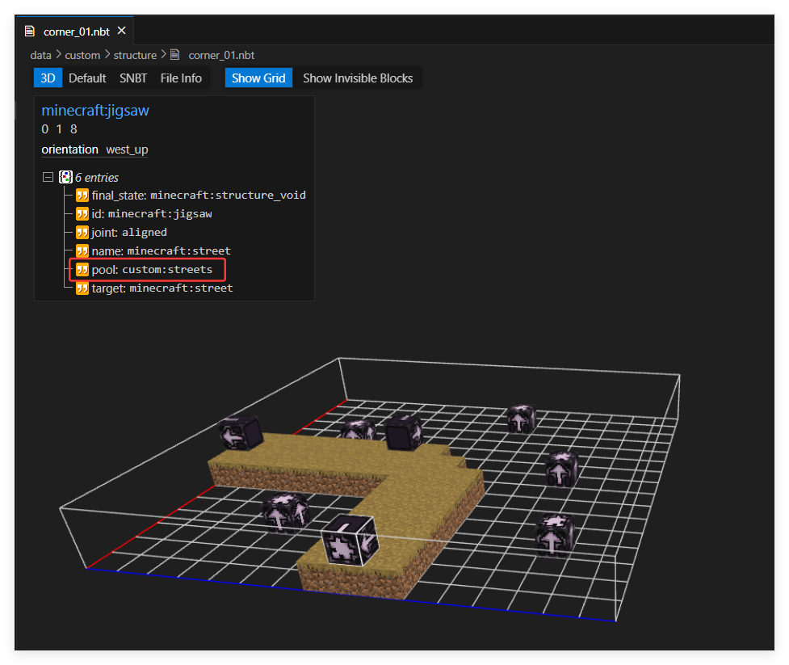

完成所有配置文件和模板文件的修改后，你的数据包目录结构应该是这样的：

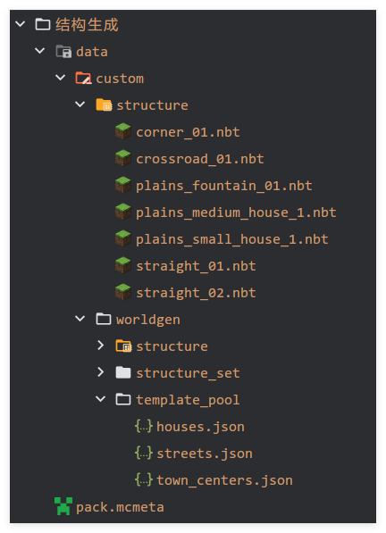

当所有文件都准备就绪并且检查无误后，重新进入游戏世界，前往深海群系，你就能够看到真正的海底村庄奇观了：

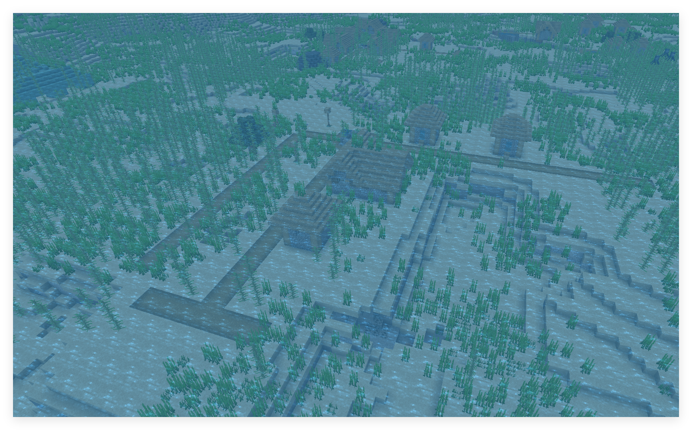

这个结果展示了拼图系统的强大功能：通过精心配置结构池和模板文件，我们成功地将原本设计用于地表的村庄系统移植到了海底环境中，创造出了独特的亚特兰蒂斯文明景观。

## 实用开发工具与调试指令

在开发和测试自定义结构的过程中，掌握一些实用的指令可以大大提高工作效率，让你能够快速验证配置是否正确，及时发现和解决问题。

使用 locate 指令可以快速定位特定的结构或生物群系：

```mcfunction
/locate structure minecraft:village_taiga
/locate biome minecraft:wooded_badlands
```

当你需要直接测试结构的生成效果时，place 指令提供了即时放置的功能，可以直接在当前位置放置指定的结构或结构模板：

```mcfunction
/place structure custom:custom_village
/place template custom:corner_01
```
