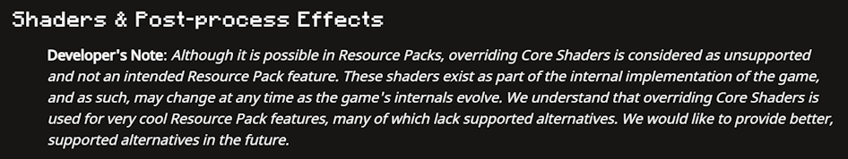
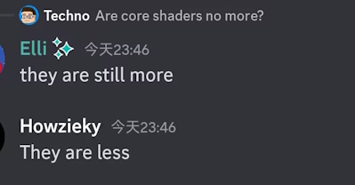
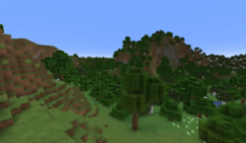
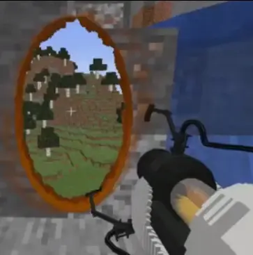
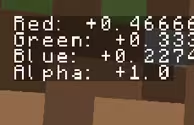
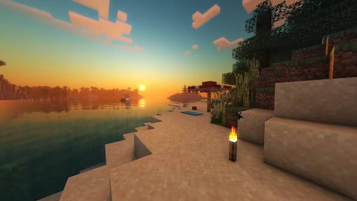
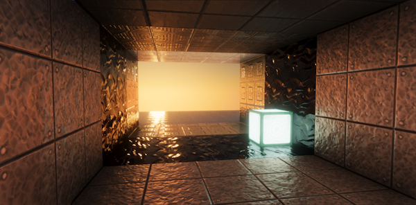
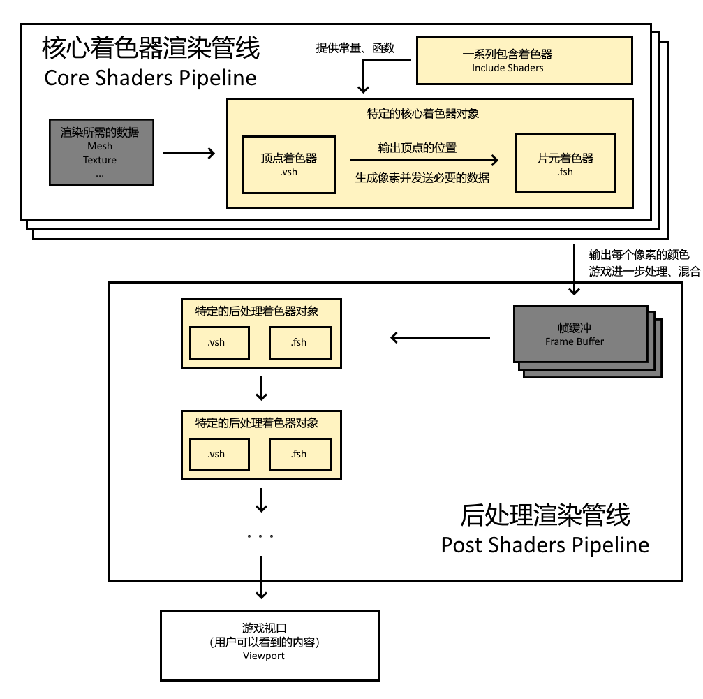
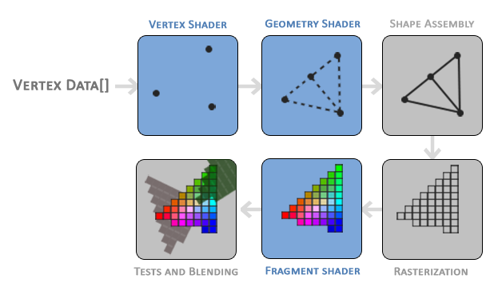

<FeaturedHead
    title = '着色器基础教程01：Minecraft中的着色器'
    authorName = 轩宇1725
    avatarUrl = '../../_authors/轩宇1725.jpg'
    :socialLinks="[
        { name: 'BiliBili', url: 'https://space.bilibili.com/104432208' }
    ]"
/>

## 写在前面

之前的着色器教程写在b站专栏里，在香草图书馆可以查到（被标记为 `已过时` ） 。但是由于b站不向下兼容的神秘更改，这些教程也用不了了。

另一方面，截止到本篇写作日期（2025年8月3日），Minecraft 的着色器并不是一个稳定的 API，每经过几个版本就会进行更改，着色器教程难以维护。

也正因如此，建议阅读本文章的读者按照下面的思路进行学习：

- 首先与教程的版本保持一致

- 在熟练编写着色器内容后，在 wiki 和原版资产文件中对照并适应新版本的编写。

与其他 Minecraft 技术领域学习不同的是，着色器的 Wiki 页面在前期学习中并没有很好的效果，直到本教程的第五期才有查阅价值。这主要是由于目前 Wiki 的内容是面向一般的着色器工作者快速了解 Minecraft 渲染特性的，而着色器本身需要一定系统化的学习，技术门槛比其他领域要高很多，而且目前中文页面很久没有维护，很多读者也并没有查阅英文页面的习惯，这就让着色器的学习对初学者十分不友好。本教程的初衷就是尽量细致地补充那些 Wiki 上缺乏的内容，使得没有着色器基础的人也能快速学习并能够进行 Minecraft 着色器的开发。当然由于 API 频繁变更，我更希望教程能够传达给读者的是研究着色器特性的方法，而非不变的特性叙述和测试数据。

*（也号召各位在编写着色器或阅读源码的过程中补充各个版本可用来参考和检测的管线内容，可加入数据维护群1004722950）*

## 着色器是做什么的

### Minecraft中的着色器

着色器是资源包内的一种资产，用于控制 **客户端** 中的渲染过程。

简单来说，模型纹理等耳熟能详的资源包内容只是一堆不可见的数据，而着色器则是利用这些数据在平面上进行绘制的程序，控制了最终输出到屏幕上的 **每个顶点的位置、每个像素的颜色** 。

然而，着色器虽然能轻易地改变每个像素的颜色，但在 **什么条件下改变成什么样的颜色** ，才是我们修改着色器的核心问题。

目前，着色器无法和数据包进行直接通信，输入比较受限，由此决定了Minecraft原版着色器几乎都是各种歪门邪道。同样的做法在Minecraft原版以外的地方可能并不是很好的写法，但却是我们能用的最好的写法

在后面的教程中，我会介绍着色器的工作流程，届时将会对此有更深的理解

### Minecraft着色器历史

#### 低版本

Minecraft着色器的历史其实非常悠久，首次加入是在1.7，用于“超级秘密选项”中的屏幕效果，当时只存在 **后处理着色器** （将整张屏幕看做一个带有贴图的平面，然后对它进行修改，因此只能做到类似滤镜的效果）。随后超级秘密选项按钮在`1.9`被移除，遗留的着色器在`1.20.5`被删除。

但`1.8`时已经加入了旁观苦力怕、末影人、蜘蛛以及发光实体轮廓的屏幕效果、在`1.16`时加入了“极佳！”画质

虽然这些后处理着色器不能改变世界中元素的形状，但由于可以访问深度信息和颜色信息，已经可以做到一些不错的效果了，如水面模糊、景深、传送门、屏幕调试文字等作品

#### 新版本

`1.17` 开始加入了核心着色器，核心着色器的开放意味着我们可以操控世界中每个元素的顶点、当然更重要的是，我们现在可以访问更多渲染时需要用的特异性数据和全局数据。后文我们会详细地介绍这些方面。

由于现在能访问许多最终可能不会渲染到屏幕上的内容、以及雾气、光照的计算，着色器的内容开始变得复杂且多样化。一些复杂的效果现在也可以实现了

下图分别是是来自bradleyq和JNNGL的原版光影

### Minecraft外的着色器

一般来说，开发者通常拥有读整个渲染过程的控制权，特别是控制哪些数据能输入着色器，而Minecraft的资源包中并不能做到这一点，这也是Minecraft中着色器如此轮椅的原因。

但广泛地学习更多有关着色器和图形学的内容依然是有用的，这里推荐一些可能需要的资源。注意，你并不需要现在马上去学习这些内容，大多数内容我会在教程中提及，这些资源仅供进一步学习使用。

#### GAMES101

[课程录像](https://www.bilibili.com/video/BV1X7411F744/) [课程主页](https://sites.cs.ucsb.edu/~lingqi/teaching/games101.html)

一门现代计算机图形学的公开系统课，完整地学习它不是必要的，但很多需要掌握的基本知识可以在课程内学习到，我同样会在教程内给出基本的讲解。

#### shadertoy

[官网](https://www.shadertoy.com/)

着色器编写者交流的网站，这个网站提供了许多基于着色器的开源作品，你也可以在上面编写着色器并发布。

#### LearnOpenGL

[原文](https://learnopengl.com/) [中文翻译](https://learnopengl-cn.github.io/)

一门OpenGL（即Minecraft使用的图形API）的系统教程，学习它不是必要的，但对理解渲染过程有帮助。

因此，Minecraft资源包着色器的学习，一方面是学习GLSL（OpenGL着色语言）本身的语法（与其他平台基本一致），另一方面更重要的是理解Mojang定制渲染管线的结构和约定。

## 渲染管线

*注：从这里开始，教程中会出现很多重要概念，我会提供他们的英文名以方便对照*

*对渲染管线的介绍是必要的基础，这里还不包括任何的代码和解决方案，但必须要掌握这个基础*

### 基本概念

做过模型的读者应该对模型的表示方式不陌生，在`.json`文件中，烘焙模型是由一个个体素的`from`坐标到`to`坐标定义的。然而在着色器中，我们操作的对象则更加精细。以烘焙模型为例，每个体素在着色器中被看做24个**顶点（Vertex）**（矩形4个顶点*6个面），整个由顶点相互连接而成的模型我们称之为**网格（Mesh）**。

有的读者可能会感到奇怪，每个体素只需要8个顶点就可以表示它的形状，为什么这里我们有24个如此之多的顶点呢？

其实在渲染过程中，顶点不止用来标定位置，每个顶点是都拥有很多的属性（Vertex Attributes），除了位置，往往还有**法线（Normal 垂直于面的方向）**、**颜色（Color）**、**纹理（Texture）**、**UV坐标**等等。这也就不难理解为什么六个面不能简单地共用8个顶点了——角落上的顶点需要代表三个面的信息，自然需要3个不一样的顶点。

当然，只有顶点我们不可能得到一块完整的面。所以确定顶点的在屏幕上的位置后，我们会在每3个点之间的区域生成像素，这些像素被称为**片元（Fragment）**，当着色器经过计算输出每个片元的颜色后，我们才能在屏幕上看到一块完整的面。（从这个过程也可以看出，虽然Minecraft的烘焙模型是以体素为基本单位的，但是对于着色器来说，每个面其实都是**三角形**，而非矩形）

一句话总结、我们在屏幕上看到的内容都由是一个个的**片元**，而**片元**的位置和数据来自一个个**顶点**。从数据到显示这中间的一系列运算，由**着色器（Shader）**来执行。

### 着色器类型

我们现在已经知道了着色器的主要工作，即顶点和片元相关的运算。而基于按特定的目的，我们可以将着色器分为三大类。

- 核心着色器（Core Shader）：处理网格、纹理等数据，并输出为可见的画面。

- 后处理着色器（Post Shader）：处理经过游戏进一步处理后的核心着色器输出，即帧缓冲（Frame Buffer），将其合成为最终输出的画面。

- 包含着色器（Include Shader）：被核心着色器引入的`.glsl`文件（新版本后处理也可以使用了，但是存在感不是很强）、用于提供各种常量和工具函数。

核心着色器和后处理着色器是许多不同名称的着色器对象的总称。对核心着色器来说，不同的着色器对象是用于处理不同类型的游戏内容的（比如方块和实体使用不用的着色器对象处理），对后处理着色器来说，不同的着色器对象是在后处理管线（Pipeline）用调用的不同程序。每个着色器对象都由一个`.vsh`顶点着色器（Vertex Shader）和一个`.fsh`片元着色器（Fragment Shader）组成。

*注：在`1.21.5`之前，每个着色器对象可以用一个对应的`.json`文件来配置其使用的顶点着色器和片元着色器，你可以修改这个配置文件来让不同的着色器对象使用同样的`.vsh`和`.fsh`，但是在`1.21.5`后，移除了这些`.json`文件，不同的着色器对象现在只能使用固定的`.vsh`和`.fsh`*

上面的新概念可能比较多，但都很重要，我会用下面的示意图来表示他们之间的关系，其中黄色背景的内容就是我们可以修改的着色器内容：

### 渲染过程（渲染管线）

OpenGL采用类似流水线作业的方式来处理渲染过程，因此称为**渲染管线（Rendering Pipeline）**。

如果你感觉上文的内容量已经足够多，那么你大可休息一会再继续阅读，因为接下来我们将说明上述的各种概念如何控制渲染的过程。虽然这些过程需要借助线性代数中的数学工具，但我这里会尽量避免使用数学概念，仅在必要的时候提及。

尽管我们只需要修改顶点着色器和片元着色器的内容，了解整个渲染过程依然是必要的，但不需要了解内部如何实现下文会提到的图元装配、光栅化等过程，我们只关注着色器。

#### 第一阶段 - 顶点着色器阶段

加载到游戏内的各种事物将会将自己的顶点属性发送给特定的着色器对象，由`.vsh`顶点着色器来处理这些顶点。

顶点着色器在此阶段的主要任务是位置的转换，以世界中的实体为例，发送给着色器的顶点坐标都是基于摄像机的相对坐标。但是OpenGL约定，顶点的输出坐标都是从 `(-1.0, -1.0, -1.0)` 到 `(1.0, 1.0, 1.0)` 的范围内，且原点在屏幕中心，z轴垂直屏幕向外。顶点着色器的任务，就是利用游戏发送的包括摄像机数据在内的一些列数据，配合顶点自身的属性，进行一系列数学计算，使得顶点移动到正确的位置。

顶点着色器输出的内容其实很多，首先当然包括顶点的位置，其次是顶点需要传递给其他阶段的各种属性。

#### 第二阶段 - 图元装配（Primitive Assembly）

这一步是不可编程的。图元装配阶段会将上一阶段顶点着色器输出的顶点连接为基本图元（点、线、**三角形**）。在上一阶段中，并不是所有发送到着色器的顶点都会被保留在屏幕上，超出 `(-1.0, -1.0, -1.0)` 到 `(1.0, 1.0, 1.0)` 范围内的顶点是最终不可见的，图元装配阶段会将它们**剔除**。

#### 第三阶段 - 几何着色器（Geometry Shader）

几何着色器可以在基本图元的基础上生成更多的顶点和图元，但Minecraft不允许修改几何着色器，故我们略过。

#### 第四阶段 - 光栅化（Rasterization）

这一步同样是不可编程的。将上一步得到的几何图元离散为屏幕上像素对应的一个个片元，每个片元会继承顶点着色器输出的属性，并且平滑插值，这个过程叫做 **片元插值（Fragment Interpolation）** 。插值即将离散内容变为连续内容的过程，片元将会根据自己和顶点的相对位置，从顶点的属性值中计算出自己的属性值。

例如，一个三角面的三个顶点分别定义了三个UV坐标 `(0.0, 0.0), (1.0, 0.0), (0.0, 1.0)` 那么每个片元就会插值得到自己对应的UV坐标，如在第一个顶点和第二个顶点中心的片元，其UV坐标就是 `(0.5, 0.0)`.

#### 第五阶段 - 片元着色器

这个阶段和第一阶段类似，利用每个片元的数据计算，并输出这个片元的最终颜色、透明度和该片元对应的深度值。游戏还会决定这些数据会输出到哪一个帧缓冲中，但我们不考虑这些细节。

#### 第六阶段 - 测试与混合

该阶段主要包括 **深度测试（Depth Test）** 和 **透明度混合（Alpha Blending）** 等内容。深度测试将会基于片元的深度，决定哪一个片元会留在画面上。透明度混合则会根据片元的透明度与其他片元进行颜色混合，并最得到新的颜色。

### 资源包中的文件层次

在 `1.21.2` 以前，所有的着色器都存储在资源包的`assets/minecraft/shaders`下，核心着色器存储在`shaders/core`下、包含着色器存储在`shaders/include`下、后处理着色器的管线定义在`shaders/post`下、后处理着色器的着色器程序在`shaders/program`下。

    assets/minecraft/shaders/
    ├── core/                  [核心着色器]
    │   ├── rendertype_entity.vsh
    │   └── rendertype_entity.fsh
    ├── include/               [包含着色器]
    │   ├── fog.glsl
    │   └── light.glsl
    ├── post/                  [后处理管线定义]
    │   └── creeper.json
    └── program/               [后处理着色器程序]
        ├── blur.fsh
        └── blur.vsh

在 `1.21.2` 后，后处理着色器管线被移到了`assets/minecraft/post_effect`下。

    assets/minecraft/
    ├── shaders/
    │   ├── core/              [核心着色器]
    │   ├── include/           [包含着色器]
    │   └── post/              [后处理着色器程序]
    │       ├── blur.fsh       
    │       └── blur.vsh       
    └── post_effect/           [后处理管线定义]
        └── creeper.json

## 总结

本节教程介绍了着色器及其工作流程，还未开始介绍着色器的编写。相对于资源包的其他部分，着色器确实需要先经过理论的学习才能开始上手编写，这也是着色器的一大特点。下节开始将会介绍核心着色器的编写，并用它来实现一些简单的内容。从下一节开始，你将会看到上述概念在着色器中的反复体现。

虽然在开头说过，但这里依然要提醒，着色器不是稳定的API，Mojang明确表示会频繁更改，因此最好在固定的版本学习着色器，然后对照wiki和原版资源进行进一步学习。
