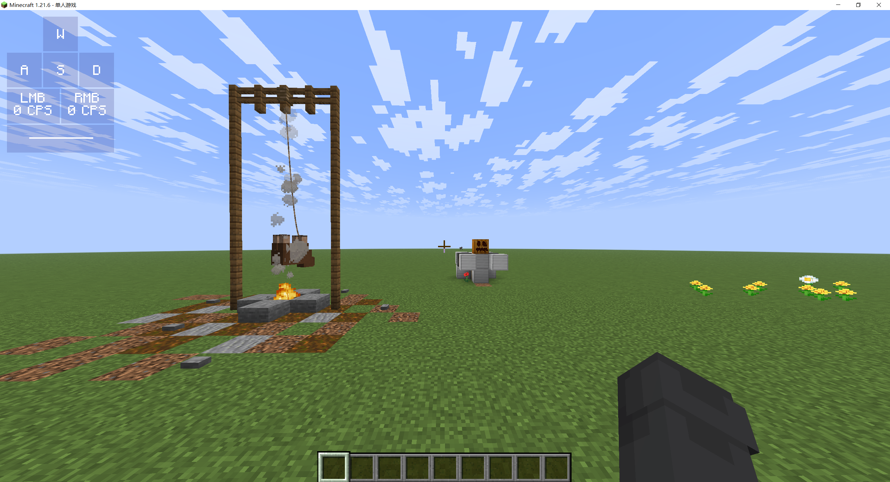
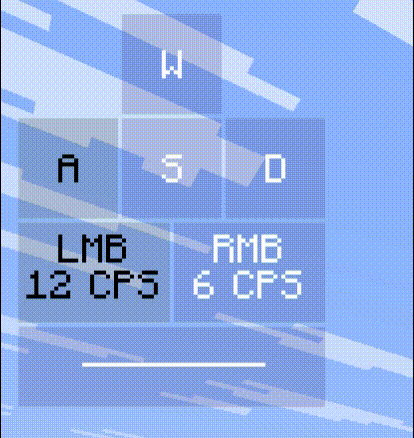

<FeaturedHead
    title = '基于keybind_down和着色器的原版按键显示 '
    authorName = 火昱Flame
    avatarUrl = '../../_authors/火昱Flame.webp'
    :socialLinks="[
        { name: 'BiliBili', url: 'https://space.bilibili.com/1036717393' }
    ]"
/>

## 简介

在原版MC中，按键检测是较为困难的，但如果只是显示呢

CPS即鼠标每秒点击次数

我在看到某模组的**CPS显示**时，产生了想法：**能不能在原版做一个CPS显示?**

本文将详细介绍使用[着色器](https://zh.minecraft.wiki/w/%E7%9D%80%E8%89%B2%E5%99%A8)检测 `keybind_down` 模型变化实现的**CPS显示**

可供着色器初学者参考

(注：要看懂需要一定基础)

## 效果展示

- 默认ui在左上角


- 点击效果


## 思路描述

有点长，懒得看可以去[省流](#省流-总结)

### keybind_down

在 1.21.4 中，mojang加入了[物品模型映射](https://zh.minecraft.wiki/w/%E7%89%A9%E5%93%81%E6%A8%A1%E5%9E%8B%E6%98%A0%E5%B0%84)

物品模型映射中 `condition` 类型会根据条件是否满足显示不同的模型

其中的 `keybind_down` 条件就是按键检测的核心

它表示玩家是否**按下**游戏中绑定的某个**按键**

```json
{
    "model": {
        "type": "composite",
        "models": [
            {
                "type": "condition",
                "property":"keybind_down",
                "keybind":"key.attack",
                "on_true": {
                    "type": "model",
                    "model": "cps:lmb1"
                },
                "on_false": {
                    "type": "model",
                    "model": "cps:lmb0"
                }
            },
            ...
        ]
    }
}
```

上方代码就定义了一个在**按下左键**(攻击键)时显示为 `lmb1`模型，**松开左键**时显示为 `lmb0`模型 的模型映射

而这两种模型对应的**纹理**则完全不同

当玩家**按下左键**时，物品模型变化，纹理变化，纹理的**颜色**也就变化

### 着色器简要说明

着色器是**图像渲染**的一个重要过程

Mojang 在原版资源包中开放了部分着色器的修改

因此我们可以通过**资源包覆盖**这些着色器

原版可以更改的着色器分为两类，分别是**顶点着色器**和**片段着色器**

这里只简要说明不细讲

#### 顶点着色器 & 片元着色器

简要说明:

在MC中，一个面由四个**顶点**组成

对于**每个面**，它会经过：

顶点着色器(后面简称vsh)计算并输出每个**顶点**的**位置**

片元着色器(后面简称fsh)计算并输出顶点间每个**像素**的**颜色**

#### 核心着色器 & 后处理着色器

简要说明：

核心和后处理其实是两个阶段

在核心着色器阶段，会对游戏中**未处理**的每个面（像是草方块的6个面，粒子的1个面）应用vsh和fsh

最后这些面会从<u>不可见的3D数据</u>变成一张<u>可以在屏幕看到的2D图片</u>

而后处理阶段，就是对这种**处理完成**的面再次应用vsh和fsh

后处理的这个应用目标，可以叫它**帧缓冲**

#### 区别

对于核心，我们只能覆盖原版写好的着色器（也就是改里面的代码）

而对于后处理，我们可以创建新的着色器，并修改渲染管线（可以自定义着色器应用的顺序，以及应用在哪个帧缓冲上）

同时，后处理有个特性，它能够**利用帧缓冲进行**跨帧传递数据（分辨率变化或者资源包重载时重置）

### 把数据从核心传到后处理

现在回到正题，要想做cps显示，肯定不能只有一个时刻的数据

因此我们要使用后处理的自定义缓冲跨帧<u>储存过去的数据</u>

同时我们也要读取到前面 keybind_down 部分描述的**颜色变化**(点击信息)

但是，**后处理**的目标是已经修改完成的画面，如果直接把加上 keybind_down 的物品放在玩家附近，它在屏幕上的位置会不断改变，无法读取到它的颜色信息

不过，**核心**的目标是单独分开的面，可以直接读取到颜色信息

所以，我们要先用核心着色器读取数据，再把面的位置移动到屏幕上的一个固定位置

这样后处理只要读取这个固定位置的像素颜色即可

#### 固定位置

现在第一步是用核心着色器把物品模型的面放在屏幕上一个固定的位置

根据前面介绍我们知道，vsh可以更改顶点坐标

通过全局量 ScreenSize (屏幕长宽多少像素)，我们可以知道“一个像素”的位置

通过 gl_VertexID 表示此顶点的序号，我们可以知道这个顶点应该放在哪个角上

通过二者结合，我们可以把面的4个顶点分别放在某一个像素的四个角上

```glsl

float pixel_l = 2/ScreenSize.x;
float pixel_h = 2/ScreenSize.y;
// ScreenSize 表示屏幕长宽多少像素
// vsh的输出坐标范围是-1.0到1.0，所以屏幕长宽为2
// 2/ScreenSize 获取一个像素的长宽

float[] cornerX = float[]( 0, 0, 1, 1 );
float[] cornerY = float[]( 1, 0, 0, 1 );
// 不同的顶点的位置
// 使得4个顶点分别在区域的4个角上 

void Unit(int start, int end){
    int len = end-start;
    vec2 pos = vec2( (start+len*cornerX[gl_VertexID%4])*pixel_l, cornerY[gl_VertexID%4]*pixel_h);
    gl_Position = vec4(pos-vec2(1),0,1);
}
```

(以上代码适用于1.21.6，其他版本的顶点序号、代码可能有所不同)

图示的 `Unit` 函数可以把面放到 <u>从第start个像素到第end个像素</u> 之间的条状区域上


#### 编写核心vsh

我把因为 keybind_down 变化的纹理整个替换成“特殊颜色”

因为整张纹理都是“特殊颜色”，4个顶点处肯定也就能读到“特殊颜色”

```glsl

vec4 col = round(texture(Sampler0, UV0)*255);
// 获取顶点处的颜色

if(col.a == 212) {   // 检测纹理是否是特殊透明度
    int p = int(col.r)/2;
    Unit(p, p+1);
}

/*
用 Red通道 确定要放在哪个像素点上

我用0 1表示未按下与按下（p模除2）

用0 2 4表示按下哪个按键（p整除2）

因此把面放在 red整除2（col.r/2）的位置上
*/

// 文件 assets/minecraft/shaders/core/rendertype_item_entity_translucent_cull.vsh
```

#### 编写核心fsh

其实不必须，但是这里要把透明度改回不透明

顺便让 Red通道 表示是否按下按键

```glsl

vec4 col = round(texture(Sampler0, texCoord0)*255);
if(col.a == 212){
    int c = int(col.r)%2;
    fragColor = vec4(float(c),0,0,1);
}
// 文件 assets/minecraft/shaders/core/rendertype_item_entity_translucent_cull.fsh
```

### 后处理部分

前面只大概介绍了后处理，这里再进行补充

游戏默认不使用后处理，只有某些情况会开启[特定后处理管线](https://zh.minecraft.wiki/w/%E7%9D%80%E8%89%B2%E5%99%A8#%E5%8F%AF%E7%94%A8%E5%90%8E%E5%A4%84%E7%90%86%E7%AE%A1%E7%BA%BF)

其中极佳管线在玩家打开“极佳”图形品质时启用，我使用它因为它比较方便

#### 后处理渲染管线

渲染管线定义了多个**目标**(帧缓冲)和多个**过程**

每个渲染过程如下：

1. 输入的帧缓冲，全局量
2. 使用的着色器
3. 输出的帧缓冲

```json
{
    "vertex_shader": "minecraft:post/blit",
    "fragment_shader": "minecraft:post/blit",
    "inputs": [
        {
            "sampler_name": "In",
            "target": "final"
        }
    ],
    "uniforms": {
        "BlitConfig": [
            {
                "name": "ColorModulate",
                "type": "vec4",
                "value": [ 1.0, 1.0, 1.0, 1.0 ]
            }
        ]
    },
    "output": "minecraft:main"
}
// 示例
```

这是原版极佳管线的一个**渲染过程**

最上面两个是它使用的着色器`blit`，这个着色器是原版自带的着色器

它可以原封不动地把输入缓冲的数据转移到输出缓冲

`final` 是经过了前面所有处理的缓冲

`minecraft:main` 是最终显示在屏幕上的缓冲

整段意思就是直接把 `final` 缓冲 输出到屏幕上

#### 编写渲染管线

我们要使用后处理管线跨帧储存数据，而一个渲染过程的输入和输出不能是同一个缓冲

因此我们要先定义两个自定义缓冲

```json
{
    "targets" : {
        "final": {},
        "hidden_final": {},
        "cps_last_data":{"persistent": true},
        "cps_next_data":{}
    },
      ...
}
// 文件 assets/minecraft/post_effect/transparency.json
```

这里的 `cps_last_data` 用于储存上帧发送来的数据，需要跨帧储存数据，所以设定 `persistent` 为 true

`cps_next_data` 则用于储存要发送给下一帧的数据，填写空对象即可

在一帧中，需要做以下事情：

1. 读取**上帧**储存的 `cps_last_data` 以及**本帧**的点击信息 (点击信息来自之前发送的固定像素点, 而像素点就在原来的 **final** 缓冲中)

2. 计算出 **cps**

3. 使用所有数据, **绘制画面**

4. 将 `cps_last_data` 设置为**本帧**的新数据

因为 `cps_last_data` 在最后被设置为本帧的数据

因此在下一帧中, 获取到的 `cps_last_data` 就会是上帧的数据

根据这个思路, 我们要先读取**上帧数据**、**本帧点击信息**

然后计算出 **新的数据**，储存在临时缓冲中（其实就是 `cps_next_data`）

```json
{
    "targets" : {
        "final": {},
        "hidden_final": {},
        "cps_last_data":{"persistent": true},
        "cps_next_data":{}
    },
    "passes": [
        { ... }, // 原版的极佳处理
        { ... }, // 隐藏前面设置的像素点
        {
            // 计算当前帧的数据
            "vertex_shader": "minecraft:post/cps_main",
            "fragment_shader": "minecraft:post/cps_main",
            "inputs": [
                {
                    "sampler_name": "In",
                    "target": "final"  // 提供点击信息 (特殊像素点)
                },
                {
                    "sampler_name": "CpsData",
                    "target": "cps_last_data"  // 提供上帧数据
                }
            ],
            "uniforms": { ... }, // 没用
            "output": "cps_next_data"  // 输出
        },
        { ... },
        { ... }
    ]
}
// 文件 assets/minecraft/post_effect/transparency.json
```

所以输入两个缓冲到 `cps_main`

让 `cps_main` 着色器使用这些数据，计算出新数据

再输出到 `cps_next_data`

接着使用新数据**绘制画面**

```json
{
    "targets" : {
        "final": {},
        "hidden_final": {},
        "cps_last_data":{"persistent": true},
        "cps_next_data":{}
    },
    "passes": [
        { ... }, // 原版的极佳处理
        { ... }, // 隐藏前面设置的像素点
        { ... }, // 计算当前帧的数据
        {
            // 绘制画面
            "vertex_shader": "minecraft:post/cps_output",
            "fragment_shader": "minecraft:post/cps_output",
            "inputs": [
                {
                    "sampler_name": "In", 
                    "target": "hidden_final"
                    /*      
                    在屏幕右下角放着几个像素点不是很好，我顺便把它们隐藏掉了
                    （其实就是用上方一个正常像素的颜色覆盖了特殊像素的颜色）
                    隐藏后的游戏画面存放在了 `hidden_final` 缓冲中
                    */
                },
                {
                    "sampler_name": "CpsKey",
                    "target": "final"
                    // 提供点击信息
                },
                {
                    "sampler_name": "CpsData",
                    "target": "cps_next_data"
                    // 提供前面计算得到的CPS
                },
                {
                    "sampler_name": "PsdAscii",
                    "location": "minecraft:psd_ascii",
                    "bilinear": false,
                    "width": 128,
                    "height": 128
                    // psd_ascii 不是我们定义的缓冲，而是一张纹理，我直接把原版ascii字体的纹理复制了过来
                }
            ],
            "uniforms": { ... }, // 没用
            "output": "minecraft:main"
            // 输出的缓冲是 minecraft:main
            // 也就是最后玩家看到的画面
        },
        { ... }
    ]
}
// 文件 assets/minecraft/post_effect/transparency.json
```


这个渲染过程将通过 `cps_output` 着色器将 ui 绘制在玩家屏幕上

最后最后，还要把新的数据移动到 `cps_last_data` 缓冲提供给下一帧的 `cps_main` 着色器使用

```json
{
    "targets" : {
        "final": {},
        "hidden_final": {},
        "cps_last_data":{"persistent": true},
        "cps_next_data":{}
    },
    "passes": [
        { ... }, // 原版的极佳处理
        { ... }, // 隐藏前面设置的像素点
        { ... }, // 计算当前帧的数据
        { ... }, // 绘制画面
        {
            // 储存在下一帧中的“上帧数据”
            "vertex_shader": "minecraft:post/blit",
            "fragment_shader": "minecraft:post/blit", // 原版的 blit 着色器
            "inputs": [
                {
                    "sampler_name": "In",
                    "target": "cps_next_data"
                }
            ],
            "uniforms": {
                "BlitConfig": [
                    {
                        "name": "ColorModulate",
                        "type": "vec4",
                        "value": [ 1.0, 1.0, 1.0, 1.0 ]
                    }
                ]
            },
            "output": "cps_last_data"
            // 输出缓冲 cps_last_data 具有跨帧特性
            // 储存本帧的新数据
            // 将会在下一帧中的 cps_main 渲染过程中作为“上帧数据”被使用
        }
    ]
}
// 文件 assets/minecraft/post_effect/transparency.json
```

#### cps_main

使用 glsl 的 `texelFetch` 函数可以读取指定像素的颜色

```glsl

lmb = texelFetch(InSampler, ivec2(0, 0), 0).r;
rmb = texelFetch(InSampler, ivec2(1, 0), 0).r;
// 文件 assets/minecraft/shaders/post/cps_main.vsh
```
根据上面渲染管线的定义，我们知道 InSampler 对应 final 缓冲

而 final 缓冲是处理完的游戏画面，其中就有我们使用核心着色器发送的固定像素点，[点击回顾](#固定位置)

直接读取就能得到点击信息

我包里是先用 vsh 获取再传到 fsh 中

这样可能有点多此一举，实际上可以直接在 fsh 中读取

`cps_main` 要做三件事：读点击信息，读上帧数据，输出新数据

这里已经完成**读取点击信息**

接下来准备**读取上帧数据**和**输出新数据**的函数

```glsl

ivec2 this_pos = ivec2(texCoord * CpsDataSize); // 当前像素的像素坐标
int px = this_pos.x;
int py = this_pos.y;

void out_int(int x, int y, int i){
    if(this_pos == ivec2(x,y)) {
        /*
        fsh 会对输出缓冲的每一个像素执行一次
        因此可以通过判断当前像素是否在特定位置
        （即 this_pos == ivec2(x,y) ）
        来将数据输出到特定像素
        */
        vec3 c;
        c.r = i / 65536;
        c.g = (i % 65536) / 256;
        c.b = i % 256;
        // 把输入的 int 数据转成颜色
        fragColor = vec4(c/255, 1);
    }
}
int in_int(int x, int y){
    ivec3 c = ivec3(texelFetch(CpsDataSampler, ivec2(x,y), 0).rgb*255);
    int i = c.r*65536 + c.g*256 + c.b;
    return i;
    // 类似读取点击信息，但在读取颜色后，将其转成了 int 数据
}
// 文件 assets/minecraft/shaders/post/cps_main.fsh
```

---

接下来要**计算CPS**

大概就是4个步骤

(注：点击时间队列：把每次点击发生的时间，放在一个队列中)

1. 获取上帧的 `CPS` `点击时间队列` `本帧时间`

2. 如果本帧中，`点击时间队列`队列首的点击存在超过 1s，则删除该点击，同时`CPS`减1

（这一步我的方法较为抽象，我把时间规定在 0s 到 1s 范围内循环，如果`当前时间`与`点击时间`重合了，说明已经循环一次，也就是经过了1s）

（这么抽象的原因是在旧版本 Time 全局量本来就是 0s 到 1s 的，新版本我就没有改）

3. 如果本帧中**按下左键**，上帧却是**松开左键**，说明进行了一次点击，则在`点击时间队列`的队列末记录这次点击的时间，同时`CPS`加1

4. 把新的 `CPS` `点击时间队列` `本帧时间` 输出，提供给绘制画面，以及下一帧计算使用

```glsl
int time = int(32768*mod(GameTime*1200,1)); // 本帧时间，在0-32768范围内（循环一次表示一秒）

if(py == 0 || py == 1){ // 左键区域

    // py==0 区域用于储存每次左键的点击时间（一个队列）
    // py==1 区域用于储存左键点击的特殊数据

    int lmb_cps = in_int(1,1); // 上帧的左键cps
    int lf_lmb = in_int(0,1); // 上帧是否点击
    int mark = in_int(2,1);// 获取“上帧是否点击”标记值，防止按下左键立即删除点击的情况
    int lf_time = in_int(3,1); // 获取“上帧时间”
    int fc_time = in_int(0,0); // 最远点击的时间
    if(fc_time != lf_time){
        mark = 1; // 若时间改变, 开始删除点击
        out_int(2,1, 1);
    }
    if(mark == 1) { // 如果当前时间已经超过了最近一次点击时间, 则尝试删除点击
        int del_c = 0; // 初始化 “ 删除点击的数量 ”

        for(int i=0; i<lmb_cps; i++){ // 从队列首开始遍历点击时间
            int c_time = in_int(i,0); // 该点击的时间

            if(time >= lf_time){
                if(lf_time <= c_time && c_time <= time){    // 如果该点击时间在 [上帧时间, 本帧时间] 区间内，
                    del_c++;                                // 说明该点击存在超过1s，“删除点击的数量” += 1
                }else break;
            }else{
                if(c_time >= 0 && c_time <= 16384){     // 这一部分用于防止 “点击时间靠近 1s 边界” 特殊情况
                    if(0 <= c_time && c_time <= time){
                        del_c++;
                    }else break;
                }else{
                    if(lf_time <= c_time && c_time <= 32768){
                        del_c++;
                    }else break;
                }
            }
        }
        if(px >= 0 && px < lmb_cps && py == 0) out_int(px,0, in_int(px+del_c,0)); 
        lmb_cps -= del_c;   // 这部分根据 “ 删除点击的数量 ” 减少 cps，并把超时的点击从队列中弹出
    }
    if(lf_lmb==0 && lmb==1){  // 如果上帧未点击，本帧点击，说明 “ 按下左键 ”
        out_int(2,1, 0); // 在下帧中的 mark = 0
        out_int(lmb_cps,0, time); // 在队列末添加新的“点击时间”
        lmb_cps++; // cps增加
    }
    out_int(0,1, int(lmb)); // 在下帧中的 lf_lmb
    out_int(3,1, time); // 在下帧中的 lf_time
    out_int(1,1, lmb_cps); // 在下帧中的 lmb_cps
}
// 文件 assets/minecraft/shaders/post/cps_main.fsh
```

另外这个只是左键，还要做右键的

#### cps_output

最后一步，绘制ui

首先读取需要的数据

```glsl

uniform sampler2D CpsDataSampler;
uniform sampler2D CpsKeySampler;

int in_int(int x, int y){
    ivec3 c = ivec3(texelFetch(CpsDataSampler, ivec2(x,y), 0).rgb*255);
    int i = c.r*65536 + c.g*256 + c.b;
    return i;
}
// 从 cps_next_data(即CpsDataSampler) 中读取CPS

int in_key(int x){
    return int(texelFetch(CpsKeySampler, ivec2(x,0), 0).r);
}
// 从 final(即CpsKeySampler) 中读取点击信息

out float lmb_cps;
out float rmb_cps;
out float lmb;
out float rmb;

out float w;
out float a;
out float s;
out float d;
out float space;

void main(){
    vec4 outPos = ProjMat * vec4(Position.xy * OutSize, 0.0, 1.0);
    gl_Position = vec4(outPos.xy, 0.2, 1.0);

    texCoord = Position.xy;

    lmb_cps = float(in_int(1, 1));
    rmb_cps = float(in_int(1, 3));

    lmb = in_key(0);
    rmb = in_key(1);
    w = in_key(2);
    a = in_key(3);
    s = in_key(4);
    d = in_key(5);
    space = in_key(6);
}
// 文件 assets/minecraft/shaders/post/cps_output.vsh
```

读取信息后，只要根据信息绘制ui即可

如以下代码根据是否按下**空格**，显示两种不同的颜色：

```glsl

...

bool range2d(ivec2 v, ivec2 vmin, ivec2 vmax){
    return v.x >= vmin.x && v.y > vmin.y && v.x < vmax.x && v.y <= vmax.y;
}
// 判断某二维向量是否在指定范围

void mixout(vec4 color){
    fragColor = vec4(mix(fragColor.rgb, color.rgb, color.a),1);
}
// 输出颜色，但是加上了透明度混合

ivec2 gui(int x, int y){
    return ivec2(x,y)*psd_GuiScale;
}
// 将向量乘上特定倍率

...

void main(){
    ...

    if(range2d(this_pos, Pos, Pos+gui(77,20))) mixout((space == 1) ? Press_Background : Release_Background);
    if(range2d(this_pos, Pos+gui(16,10), Pos+gui(62,11))) mixout((space == 1) ? Press_Text : Release_Text);
    /*
    this_pos 表示此像素的像素坐标
    Pos 表示 ui 起始位置
    Press_Backgroud 与 Release_Backgroud 分别代表 按下/松开 时显示的颜色

    含义：
        先用 if(range2d(...)) 选择特定区域输出特定颜色
        再根据前面获取的 space 值输出不同颜色
    */

    ...
}

// 文件 assets/minecraft/shaders/post/cps_output.fsh
```

其他按键也是如此，有所不同的是**文字**绘制

我将原版 ascii 字体纹理复制了过来使用，通过读取该纹理来显示字符

### 结束

最后就完成了资源包部分啦，数据包只要一直把展示实体tp到玩家就行了

需要更详细了解的可以尝试拆包，或者直接来问我

## 省流 (总结)

使用**物品模型映射**中的 `keybind_down` 在玩家按下某个按键时**改变模型**

使用**核心着色器**把模型移动到屏幕上的某个**固定的像素点**

并且在模型改变时，像素的**颜色**也改变

使用**后处理着色器**，读取**固定像素点**的**颜色**

利用后处理缓冲**跨帧储存数据**特性，储存1秒内的所有点击，并计数作为cps

最后使用**后处理着色器**将 ui 绘制在屏幕上

其中，文字部分通过读取**ascii字体纹理**来绘制

最后写一下数据包，让这个物品一直出现在玩家附近就行


