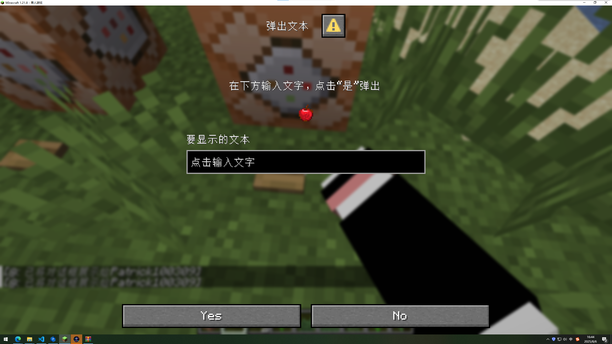
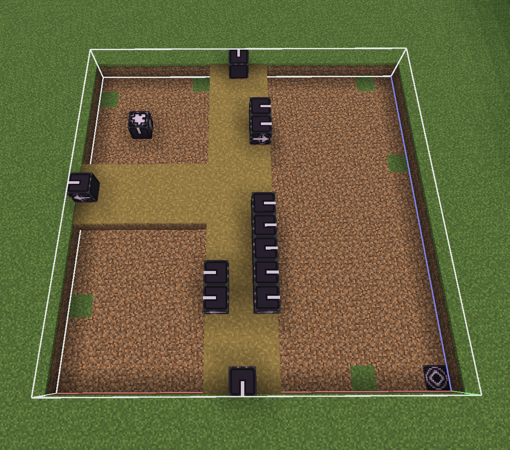

<FeatureHead
    title = 'Patrick的数据包开发新手导航'
    authorName = Patrick
    avatarUrl = '../../_authors/Patrick.jpg'
    :socialLinks="[
        { name: 'BiliBili', url: 'https://space.bilibili.com/544435182' }
    ]"
    resourceLink = 'https://github.com/NessunoNessun0/TRPG_Plus'
    cover='../_assets/3.png'
/>

## 现在就开始你的数据包创作之旅！

*看着B站上的大佬制作原版模组非常激动，自己也想试试！于是打开了VS Code……*

*……等等，我现在该做什么？*

为了解决这个问题，此篇指南诞生了。它结合了我的创作经验写就。无论你是刚刚开始创作数据包，正面对着新建数据包不知所措，亦或是想要创作但是找不到灵感，都来看看吧！我将分两个章节向你简要介绍如何入手数据包、告诉你如何获取灵感以及一些我犯过的错误，希望它能帮助到你！

*本篇文章为已经搭建好开发环境、基本了解如何创建一个空数据包的读者准备，[如果你还不知道如何做这些……](https://zh.minecraft.wiki/w/Tutorial:%E5%88%B6%E4%BD%9C%E6%95%B0%E6%8D%AE%E5%8C%85 "转到wiki")*

### 一、认识数据包可以做什么

在本章，我将根据复杂程度推荐一个数据包各个板块的入手顺序，并向你基本介绍它们。要注意的是，本章节并不会对如何制作它们都有详细的解释。大多数内容你要借助其他资料完成，本篇章只做导航作用

**本章只对数据包中的内容作介绍，如果你想知道我对寻找灵感的建议，可以直接去读下一章**

#### 1、从标签入手

标签，顾名思义是用于将游戏元素进行归类的工具。它不能独自发挥什么太大的作用。然而，它的数据结构是如此简单以至于是一个非常好的给新手熟悉JSON格式的途径。现在跟随我的脚步，试着创建你的第一个标签。

由于该部分是读者的开篇作品，此小节会详细解释。

在开始之前，我们需要思考一个问题：**如果一个世界加入了许多不同的数据包，如何才能保证不同作者创作的内容不会出现名称冲突的情况？**

一个解决方法很容易想到：我们可以给每一个数据包都加上一个专属的标识，然后将每一个内容的名字前面加上它所属的数据包的标识。这样只要不同数据包的标识不同，就不会产生冲突了！

恭喜你发明了一个非常实用的工具——**命名空间**

现在看向你的空数据包，如果你按照正确的操作创建了的话，里面应该有一个data文件夹。

在data文件夹内部新建一个文件夹，它的名字就是命名空间。
::: tip 提示1
data文件夹的下方可以有多个命名空间，但我不建议这么做。如果你没有很好地规划，这样做只会让你的数据包显得很乱。
:::
::: warning 重要提示1
数据包内部的文件夹名及文件名仅允许：

* `0123456789` 数字
* `abcdefghijklmnopqrstuvwxyz` 小写字母
* `_` 下划线
* `-` 连字号（减号）
* `/` 正斜杠（不能用于命名空间）
* `.` 句号（不能用于命名空间）

:::
::: tip 提示2
如果两个数据包中有相同的命名空间并且恰好有文件撞名，那么优先级高的数据包中的内容会覆盖掉优先级低的数据包中的内容。你可以在世界创建时的数据包窗口调整优先级，也可以在世界创建后使用[命令/datapack](https://zh.minecraft.wiki/w/%E5%91%BD%E4%BB%A4/datapack "这是什么？")调整。

利用这一点，我们可以为原有的数据包制作拓展或者覆盖原版数据包的内容
:::
想好你的命名空间以后，创建以下目录：*data/<命名空间>/tags/item*

此目录用于管理物品标签，请在此目录下新建<自定义名称>.json，然后写入以下内容：

```json
{
  "values":[
    "minecraft:iron_ingot",
    "minecraft:gold_ingot"
  ]
}

```

::: warning 重要提示2
刚刚你写下的编程语言叫做[JSON](https://zh.minecraft.wiki/w/JSON "这是什么？")。

如果你对JSON格式不了解，请点击上方的超链接。观察代码，寻找JSON的语法特点。
:::

在上方的例子当中，字段values中的内容就是标签的内容。它们都属于这个标签。如果你想的话，可以参见上方格式为此标签添加更多物品

但是单独有这一个标签是没有用的！现在我们让它有用一些！

现在在你的数据包中创建文件：*data/minecraft/tags/item/arrows.json*

这个标签的作用是控制哪些物品可以被弓或弩发射，现在我们就来试一试。

在此文件当中输入以下内容：

```json
{
  "values":[
    "minecraft:potato", //现在土豆可以被发射了
    "#<你的命名空间>:<你刚才写的标签的名字>"  //标签文件可以引用其他的标签，遵循#<命名空间>:<名称>格式。前方的“#”表示这是一个标签
  ]
}

```

现在将数据包装入你的世界中。打开你的世界文件夹，把数据包拖入datapacks目录中，重载世界即可。如果顺利，土豆大炮应该可以用了。将土豆或者你定义的别的东西装进弩里试一试。

::: tip 提示3
你可以浏览[此页面](https://zh.minecraft.wiki/w/%E6%A0%87%E7%AD%BE#%E7%89%A9%E5%93%81)来了解如何定义其他游戏元素的标签以及原版标签的用途。
:::

::: tip 提示4
[中文Minecraft Wiki](https://zh.minecraft.wiki/)是创作数据包的一个很有用的工具！有关数据包的所有基础内容都可以在上面找到。一个优秀的数据包开发者应该学会熟练使用Wiki。之后的章节不会如此详细地向你讲解开发过程，你必须从Wiki上找到答案。

在你的阅历逐渐丰富之后，你可以尝试为Wiki作出贡献。如果发现Wiki上的内容有误，不要犹豫，编辑它！
:::

很有趣对吧？让我们进入下一个小节。

#### 2、入门级函数

函数是数据包中的第一个内容。或者说，数据包的前身就是函数包。函数是封装起来的一连串命令，将命令在函数里写好，你就可以拿着你的数据包把你的命令装在任何世界里了。并且，函数可以很容易地修改。这可比命令方块好使

创建*data/<命名空间>/function/<取个名字>.mcfunction*文件，使用你的VS Code打开它。然后你就可以在内部写入命令了。每一行都可以写一条命令，你可以用双斜杠“//”进行单行注释。

::: warning 重要提示3

函数里的命令不可以用“/”开头，直接写就好

:::

在里面随便写几条命令，把写好之后的函数放进世界当中，你可以用命令/function或者命令/schedule来执行你的函数。把函数加入#minecraft:load标签里可以让它在数据包加载时执行一次（重载世界或使用命令/reload），把函数加入#minecraft:tick标签可以让它在每一个游戏刻内执行一次。

函数有另一种动态的编写方式，叫做宏函数。这使得你可以指定函数的某些内容在运行时可变来让运行变得更加灵活。在一行函数前加上“$”可以使一行命令变为宏，示例：

函数mypack:myfunction中的内容：

```mcfunction
$say $(msg)
```

执行命令：

```mcfunction
/function mypack:myfunction {msg:"Hello world!"}
```

等价于：

```mcfunction
say Hello world!
```

宏函数还可以使用命令存储作为参数来执行，关于相关内容，参见[命令/data](https://zh.minecraft.wiki/w/%E5%91%BD%E4%BB%A4/data)以及[命令存储数据格式](https://zh.minecraft.wiki/w/%E5%91%BD%E4%BB%A4%E5%AD%98%E5%82%A8%E5%AD%98%E5%82%A8%E6%A0%BC%E5%BC%8F)

由于命令本身就十分复杂，这里无法介绍太多，请通过Wiki或者在B站上搜索教程来了解更多内容……

在通过Wiki了解一些命令后，你可以查看香草图书馆中的其他页面来启发你如何综合运用这些命令。

在进入下一个小节之前，你至少要先了解什么是数据组件，尤其是其中的物品堆叠组件。物品堆叠组件是现版本用于控制物品行为的最常用的方式。参见：

[数据组件 - 中文 Minecraft Wiki](https://zh.minecraft.wiki/w/%E6%95%B0%E6%8D%AE%E7%BB%84%E4%BB%B6)\
[物品堆叠数据格式 - 中文 Minecraft Wiki](https://zh.minecraft.wiki/w/%E7%89%A9%E5%93%81%E5%A0%86%E5%8F%A0%E6%95%B0%E6%8D%AE%E6%A0%BC%E5%BC%8F)

你可能注意到了，上面的某些页面链接到的东西格式似乎和JSON很像。是的，在数据包中的某些JSON文件也会使用到它们，同样使用JSON格式。但是你要注意，命令解析器很少会支持JSON格式。当你在命令当中使用它们的时候，往往需要用到另一种语言：[SNBT格式](https://zh.minecraft.wiki/w/SNBT%E6%A0%BC%E5%BC%8F)

虽然对于下一个小节的学习也许不是必须的，但是我十分建议你了解一下以下内容：

[文本组件 - 中文 Minecraft Wiki](https://zh.minecraft.wiki/w/%E6%96%87%E6%9C%AC%E7%BB%84%E4%BB%B6)\
[实体数据格式 - 中文 Minecraft Wiki](https://zh.minecraft.wiki/w/%E5%AE%9E%E4%BD%93%E6%95%B0%E6%8D%AE%E6%A0%BC%E5%BC%8F)\
[目标选择器 - 中文 Minecraft Wiki](https://zh.minecraft.wiki/w/%E7%9B%AE%E6%A0%87%E9%80%89%E6%8B%A9%E5%99%A8)

你可以通过一些命令来应用刚才学到的东西：\

[命令/give - 中文 Minecraft Wiki](https://zh.minecraft.wiki/w/%E5%91%BD%E4%BB%A4/give)\
[命令/tellraw - 中文 Minecraft Wiki](https://zh.minecraft.wiki/w/%E5%91%BD%E4%BB%A4/tellraw)\
[命令/summon - 中文 Minecraft Wiki](https://zh.minecraft.wiki/w/%E5%91%BD%E4%BB%A4/summon)

::: danger 试一试1

在阅读教学示例之后按照自己的想法创建另一个东西是非常重要的！只有自己运用才能熟练掌握所学。现在不妨尝试一下这个：
创建一个宏函数，使其接受一个参数“name”。执行的效果是，给予执行者一个叫做“name”的玩家的头颅
提示：函数中的每一条命令的默认执行者及其他的命令上下文就是函数的执行者及命令上下文，参见[命令上下文 - 中文 Minecraft Wiki](https://zh.minecraft.wiki/w/%E5%91%BD%E4%BB%A4%E4%B8%8A%E4%B8%8B%E6%96%87)，当你用/function执行命令时，函数的执行者就是你！

:::
::: warning 重要提示4

你必须注意某些特性的适用游戏版本。不同的游戏版本之间可能存在较大差异。香草图书馆中的很多内容并不适用于最新游戏版本

:::

#### 3、配方

配方，是Minecraft中除了战利品表以外获得物品的最常用的方式。它与标签一样用JSON文件定义。定义一个配方相对来讲比较简单。作为入门新手，我十分建议你先尝试定义一个配方。

在本小节中，我将使用三个例子来帮助你入门。

首先我们来制作一个工作台有序配方。

Mojang在很早以前就把附魔金苹果的合成配方移除了。虽然现在我们依然可以通过宝库再生附魔金苹果，但是如果能通过配方获得的话还是非常方便。所以我们现在就来把这个配方重新添加进Minecraft中！

现在创建以下文件：*data/<命名空间>/recipe/enchanted_golden_apple.json*

之后写入这些内容，查看注释来了解不同字段的作用：

```json
{
  "type": "crafting_shaped",	//这个字段指明此配方的类型。crafting_shaped指明这是一个工作台中的有序配方
  "pattern": [	//现在使用不同的字符来表示不同的物品，然后像在工作台中放置物品一样放置这些字符。如果你想表达一个位置什么都不放，就使用空格。这里是一个3*3配方的示例，你也可以改成两行两列的格式。
    "ggg",
    "gag",
    "ggg"
  ],
  "key": {  //在这里解释刚才的字符“g”和“a”都是什么
    "g":"minecraft:gold_block", //这里表示“g”这个字符是金块
    "a":[ //你可以使用一个数组来指定多个物品。如果你这样做，这表示字符“a”这个格子可以放置下列物品中的一个。例如在这里，我允许玩家使用普通苹果或者金苹果来合成
    //你也可以引用一个标签，只需遵循这个格式：#<命名空间>:<ID> 但你要注意，数组和标签只能选择一个！
      "apple",
      "golden_apple"
    ]
  },
  "result": { //在这里指定物品的输出。如果你想让输出的物品带上物品组件，参见上文引用的“物品堆叠数据格式”页面
    "id": "minecraft:enchanted_golden_apple"
  },
  "category":"equipment"  //这个字段是可选的，表示配方的分类。在这里我将其归类为“装备”。大多数时候你可以不写
}

```

::: tip 提示5

你可以使用命令/recipe来给予自己配方并查看配方是否能够正常读取

:::

在完全了解上述例子之后，自己动手试一试创建另一个配方吧

::: danger 试一试2

尝试一下这个配方：
铁砧 铁砧 铁砧
空 竹子 空
空 竹子 空
↓
三叉戟

:::

第二个例子，让我们来尝试一个类型转化配方。

在将钻石装备升级为下界合金装备的时候，如果一直都没有找到升级锻造模板将会是一件很恼人的事情。所以让我们来设计一个工作台配方，令钻石剑不需要锻造模板就可以升级为下界合金剑，再清除所有铁砧累计惩罚！代价是——需要一个下界合金块。

```json
{
  "type":"crafting_transmute",  //表示这是一个类型转化配方
  "input":"diamond_sword",  //要转化的物品
  "material":"netherite_block", //转化消耗的物品
  "result":{
    "id":"netherite_sword", //要转化成什么物品
    "components":{
      "!minecraft:repair_cost":{} //这里自定义物品堆叠组件。前面的“!”表示我们要清除这一物品组件
    }
  }
}
```

现在来试一试：

::: danger 试一试3

尝试一下这个配方：
原物品：铁剑
消耗：钻石
成品：钻石剑
物品堆叠组件：不修改

:::
::: danger 试一试4

尝试一下这个配方：
原物品：铁块
消耗：蓝色染料或青金石
成品：钻石块
物品堆叠组件：不修改
提示：input或者material字段也可以使用数组定义多个可用的物品

:::
::: tip 你知道吗

物品转化配方曾经叫嬗变配方，该配方的名字同样经历了多次“嬗变”。

:::

接下来我们熟悉一下烧炼配方

众所周知，钻石是由煤炭经过长时间的高温高压形成的

虽然现实当中不可能，但在MC中我们可以加入一个用高炉把煤炭块烧成钻石的配方！

```json

{
  "type": "blasting", //告诉游戏这是一个高炉配方
  "ingredient": "coal_block", //原材料是煤炭块
  "experience": 180,  //我们给超多的经验值！
  "cookingtime": 24000, //长时间高温，所以需要24000游戏刻才能烧好
  "result": {
  "id":"minecraft:diamond"  //给你钻石！
  }
}
```

::: danger 试一试5

尝试一下这个配方：
原物品：甜浆果
方块：熔炉（type:smelting）
成品：发光浆果
烧炼时长：100刻
经验值：3

:::
其他配方类型参见：[配方 - 中文 Minecraft Wiki](https://zh.minecraft.wiki/w/%E9%85%8D%E6%96%B9#%E5%90%88%E6%88%90%E9%85%8D%E6%96%B9)

#### 4、战利品表

战利品表是玩家在Minecraft中获取物品**最主要**的方式。因此学习它是数据包学习历程中的很重要的内容。由于读者读到这里的时候已经对JSON格式有了清晰的了解，因此后文主要以导航及将各个概念联系在一起为主，不再详细解释文件格式。对此请移步Wiki。（建议和该小节的其他内容对比阅读）

[战利品表 - 中文 Minecraft Wiki](https://zh.minecraft.wiki/w/%E6%88%98%E5%88%A9%E5%93%81%E8%A1%A8)

我们如何描述战利品表呢……嗯……如果你玩过抽卡游戏的话，你可以把它想象成一个卡池。当游戏应用战利品表的时候，会从这些卡池当中随机抽取一些物品出来。然后也许把这些物品放到箱子里，也许把它们作为生物的掉落物，也许成为你打碎方块之后掉落的物品……就是这样！

实际处理起来会比上面说的多几个步骤，比如判断一个物品能不能被抽到，以及给物品加一些修饰，不过大体离不开这些东西。

如果要给战利品表分一个层次出来，大概是这样：

战利品表
↓
目标池
↓
抽取项

我们要说明几个概念。首先，并不是所有的抽取项或者池子都可以被抽到。比如，在钓鱼的时候，如果鱼钩不在[开阔水域](https://zh.minecraft.wiki/w/%E9%92%93%E9%B1%BC#%E5%9E%83%E5%9C%BE%E4%B8%8E%E5%AE%9D%E8%97%8F)，那么你就钓不到宝藏。在Minecraft中，我们使用[谓词](https://zh.minecraft.wiki/w/%E8%B0%93%E8%AF%8D%EF%BC%88%E6%B6%88%E6%AD%A7%E4%B9%89%EF%BC%89)来检测某个事物是否能够达成我们所设置的条件。不仅是战利品表，数据包当中很多地方都使用了谓词。你还可以像定义标签一样把常用的一些谓词定义成一个文件，使用时直接引用即可。（当然不定义文件现用现写也是可以的！大多数时候都是这样）[命令](https://zh.minecraft.wiki/w/%E5%91%BD%E4%BB%A4/execute)也可以使用谓词。在战利品表中，你可以给一个目标池加上谓词来决定它能否被抽取，也可以给

第二个概念是[战利品上下文](https://zh.minecraft.wiki/w/%E6%88%98%E5%88%A9%E5%93%81%E4%B8%8A%E4%B8%8B%E6%96%87)，谓词在进行判断的时候需要有判断的依据。比如，检测玩家挖掘方块用的工具时，谓词首先要知道玩家所用的工具是什么。这个工具就是战利品上下文。上下文包括很多，比如玩家的位置，使用的工具，被击杀生物的详细信息等等。在不同的场合下，战利品上下文可能不同。比如，当战利品表用来生成考古的战利品的时候，就不会给出“被击杀实体”的战利品上下文。

::: tip 提示6

一定要注意，大多数谓词对战利品上下文有特殊要求，在使用之前请先检查使用场合是否能提供所需的战利品上下文

:::

接下来我们要说一说[物品修饰器](https://zh.minecraft.wiki/w/%E7%89%A9%E5%93%81%E4%BF%AE%E9%A5%B0%E5%99%A8)。物品修饰器用于调整将要生成的物品。比如修改物品的数量、给装备添加魔咒、设置自定义名称等等。物品修饰器本身也可以设置谓词。如果你想使用命令应用物品修饰器，请见[命令/item](https://zh.minecraft.wiki/w/%E5%91%BD%E4%BB%A4/item)。物品修饰器可以单独应用于某个抽取项，也可以应用在某一个目标池上（当你这么做时，目标池中的所有内容都会应用这个物品修饰器），甚至你可以把它应用到整个战利品表上！

当战利品表被应用时，首先游戏会先剔除不会被抽取到的项目（即未通过谓词检测）。然后将没有内容的空池移除。游戏会依次在每个目标池中抽取。抽取时先决定在该目标池抽取的次数，然后依据各个抽取项的权重加权抽取。然后应用所有可以应用的物品修饰器。

::: tip 提示7

抽取项也分单一抽取项和复合抽取项两种。复合抽取项包含若干个单一抽取项。在战利品抽取之前复合抽取项必须先展开成几个单独的单一抽取项。展开时该复合抽取项会按照它的类型选取列表中一部分单一抽取项展开。

:::

想好上述关键词之间的联系，现在对照Wiki，尝试写下你的第一个战利品表吧！

::: danger 试一试6

尝试修改远古城市的战利品表，使其会生成带有相当于附魔台70级附魔的附魔书。
如果你不知道从哪里找到原版战利品表并复制粘贴来修改，请看下一小节的内容

:::
::: danger 试一试7

制作一个应用于箱子的战利品表，使其会开出来多种食物。
你可以用[命令/loot](https://zh.minecraft.wiki/w/%E5%91%BD%E4%BB%A4/loot)来将战利品表放置到世界中，或者在使用[命令/setblock](https://zh.minecraft.wiki/w/%E5%91%BD%E4%BB%A4/setblock)时设置[箱子的数据](https://zh.minecraft.wiki/w/%E7%AE%B1%E5%AD%90#%E6%96%B9%E5%9D%97%E5%AE%9E%E4%BD%93)，或者给予自己一个箱子物品并使用[minecraft:block_entity_data物品堆叠组件组件](https://zh.minecraft.wiki/w/%E6%95%B0%E6%8D%AE%E7%BB%84%E4%BB%B6#block_entity_data)规定箱子应用的战利品表

:::

#### 5、参考原版数据包

原版的数据包提供了大量实例供你参考，因此知道原版数据包在哪里是一件很重要的事。
原版游戏文件夹默认在*C:\users\user\AppData\Roaming\.minecraft*。**如果你的启动器使用的不是这个路径，请查看你的启动器设置**
随后打开versons目录，你会看到各个版本的文件夹。点进一个你想要查看数据包的版本，你会看到一个和版本名称一样的.jar文件。右键它并使用WinRAR或者其他压缩文件查看器打开。

打开之后，看到data文件夹，这就是原版数据包了。

#### 6、进度

进度，作为Minecraft少有的直接引导玩家的机制，也同样是数据包中很重要的一部分。本小节将简要讲述进度的用途，并举出实例。

进度主要有以下4个用途：

* 用于引导玩家游戏
* 给予玩家配方
* 设置条件触发函数
* 设置条件给予玩家物品

参考Wiki获得详细信息：[进度定义格式 - 中文 Minecraft Wiki](https://zh.minecraft.wiki/w/%E8%BF%9B%E5%BA%A6%E5%AE%9A%E4%B9%89%E6%A0%BC%E5%BC%8F?variant=zh)

现在我们看看原版的一个进度（“钻石！”，试试自己能不能在原版数据包中找到它）：

```json
{
  "parent": "minecraft:story/iron_tools",       //定义上游进度
  "criteria": {                                 //这一字段用于定义准则。准则是玩家达成进度所需的条件
    "diamond": {                                //“diamond”是准则的名字
      "conditions": {                           //检查的内容，这一字段中的内容随着触发器的种类的改变不同
        "items": [                              //这一字段包含几个物品谓词，用于判断获得什么物品才能达成进度
          {
            "items": "minecraft:diamond"
          }
        ]
      },
      "trigger": "minecraft:inventory_changed"  //准则所适用的触发器。此触发器用于检查玩家背包的变化。当玩家背包有变化的时候触发一次。触发器在被触发的时候会进行条件检查，检查成功时准则才能成功取得
    }
  },
  "display": {                                  //进度的显示信息
    "description": {                            //进度的介绍，是一个文本组件
      "translate": "advancements.story.mine_diamond.description"
    },
    "icon": {                                   //一个物品，用于进度的图标
      "count": 1,
      "id": "minecraft:diamond"
    },
    "title": {                                  //进度的标题，是一个文本组件
      "translate": "advancements.story.mine_diamond.title"
    }
  },
  "requirements": [                             //一个准则数组的数组，一个准则数组中的准则达成任意一个则视为该准则数组已被达成。此字段内部的准则数组必须全部被达成
    [
      "diamond"
    ]
  ],
  "sends_telemetry_event": true                 //达成此进度以后是否发送遥测数据。用于Mojang统计玩家们完成进度的情况
}

```

由于没有定义，此进度完成之后不会得到任何奖励。但是实际上你可以定义进度完成的奖励。只需要在JSON文件的根对象下写入以下字段：

<NBTTree code='
@Desc<"根对象，进度中其余的部分被省略">
data Reward {
@Desc<"达成进度的奖励">
reward as data{
@Desc<"（默认为0）完成进度后玩家将获得的经验值">
experience as int;
@Desc<"完成进度后执行的函数，不支持函数标签。等同于直接使用/function">
function as string;
@Desc<"完成进度后玩家获得的战利品表">
loot as list<string>;
@Desc<"完成进度后玩家解锁的配方">
recipes as list<string>;
};
};'
/>

::: tip 提示8

这几种奖励各有用处。经验值是原版完成目标和挑战会给予玩家的。解锁配方的奖励原版用于实现“获得一个物品时解锁相关配方”的机制。数据包中常用剩下的两种：获得函数使得数据包创作者可以使用进度中的触发器来触发函数。战利品表则在稍旧的版本中实现给配方的输出物品增添特殊NBT的功能

:::

#### 7、杂项

此处罗列了一些资源包中较为零碎的内容
如果你会制作资源包，你可以尝试以下内容：

* [旗帜图案](https://zh.minecraft.wiki/w/%E6%97%97%E5%B8%9C%E5%9B%BE%E6%A1%88%E5%AE%9A%E4%B9%89%E6%A0%BC%E5%BC%8F)
* 生物变种
* [唱片机曲目](https://zh.minecraft.wiki/w/%E5%94%B1%E7%89%87%E6%9C%BA%E6%9B%B2%E7%9B%AE%E5%AE%9A%E4%B9%89%E6%A0%BC%E5%BC%8F?variant=zh)
* [画变种](https://zh.minecraft.wiki/w/%E7%94%BB%E5%8F%98%E7%A7%8D%E5%AE%9A%E4%B9%89%E6%A0%BC%E5%BC%8F)
* [盔甲纹饰](https://zh.minecraft.wiki/w/%E7%9B%94%E7%94%B2%E7%BA%B9%E9%A5%B0%E5%AE%9A%E4%B9%89%E6%A0%BC%E5%BC%8F)
* [狼音效变种](https://zh.minecraft.wiki/w/%E7%8B%BC%E9%9F%B3%E6%95%88%E5%8F%98%E7%A7%8D%E5%AE%9A%E4%B9%89%E6%A0%BC%E5%BC%8F)
  制作资源包的教学内容图书馆内有所提及，或者直接[前往Wiki](https://zh.minecraft.wiki/w/%E8%B5%84%E6%BA%90%E5%8C%85)

试炼刷怪笼的数据可以被数据包单独定义，这样可以避免在修改其内容的时候修改结构：[试炼刷怪笼配置定义格式 - 中文 Minecraft Wiki](https://zh.minecraft.wiki/w/%E8%AF%95%E7%82%BC%E5%88%B7%E6%80%AA%E7%AC%BC%E9%85%8D%E7%BD%AE%E5%AE%9A%E4%B9%89%E6%A0%BC%E5%BC%8F)

#### 8、对话框

**此部分的内容建议对命令有更深入的了解后再来看**
至少，你要知道什么是[文本组件](https://zh.minecraft.wiki/w/%E6%96%87%E6%9C%AC%E7%BB%84%E4%BB%B6)

在25w20a中，Mojang加入了[对话框](https://zh.minecraft.wiki/w/%E5%AF%B9%E8%AF%9D%E6%A1%86%E5%AE%9A%E4%B9%89%E6%A0%BC%E5%BC%8F?variant=zh)这一激动人心的更新。它提供了数据包和玩家交互的新方式。

对话框可以被[命令/dialog](https://zh.minecraft.wiki/w/%E5%91%BD%E4%BB%A4/dialog)调用。或者加入`#pause_screen_additions`标签让其显示在菜单界面，或者加入`#quick_actions`标签使得其可以用快捷键G唤起。在被唤起时，对话框可以向玩家显示信息，玩家可以通过输入控件输入信息，并使用它们执行命令。这是Mojang第一次允许数据包作者直接读取字符串输入，并且提供了一个与玩家交互的非常简便的方式，可谓是划时代的更新

本小节将简单介绍对话框中的各种部分。



弹出此对话框的命令：
`/dialog show @p {body:[{type:"plain_message",contents:{"text":"在下方输入文字，点击“是”弹出"}},{type:"item",item:{id:"apple"}}],inputs:[{key:"text",type:"text",initial:"点击输入文字",label:{"text":"要显示的文本"}}],"title":{"text":"弹出文本"},no:{label:"No"},yes:{label:"Yes",action:{type:"dynamic/run_command",template:"dialog show @p {body:{type:\"plain_message\",contents:{\"text\":\"$(text)\"}},type:\"notice\",title:{\"text\":\"显示文本\"}}"}},type:"confirmation"}`

首先请看以上图片。

屏幕最上方的“弹出文本”称作“框头”，即对话框的标题。
对话框的标题可以自定义。

框头的下方是内容。内容分为主体元素和输入面板两个部分。并且输入面板在主体元素下方
主体元素用于向玩家显示消息。图片中的第二行文字和那块苹果都属于主体元素

::: tip 提示9

资源包可以定义物品映射。即同一种物品可以存在不同的纹理。通过资源包增添物品映射后，给物品加上[item_model](https://zh.minecraft.wiki/w/%E6%95%B0%E6%8D%AE%E7%BB%84%E4%BB%B6#item_model)组件指定映射，再用对话框调用它们即可实现显示图片的效果

:::

图片中的文本框属于输入面板。玩家可以在输入面板当中填写信息。输入面板由输入控件组成，不同种类的输入控件可以提供不同的信息。

最下方的部分叫做框尾。框尾的样式随着对话框种类的不同会有所变化。当玩家点击框尾的按钮时会执行操作。（有时输入面板的某些按钮也能执行操作）当玩家执行操作之后，游戏会根据数据包作者设定的内容执行命令。玩家从输入控件中输入的内容大多也会影响命令的执行。

::: tip 提示10

作为数据包时，输入控件在服务器中使用往往不是很方便。这是因为通过动态操作执行命令的时候，所执行的命令必须是该玩家的权限等级本来就可以执行的命令。并且执行的命令不能需要签名。这意味着数据包作者基本上只能让玩家执行[命令/trigger](https://zh.minecraft.wiki/w/%E5%91%BD%E4%BB%A4/trigger)。输入控件在此起到的唯一作用只能是修改触发不同的触发器以及将它们设置为不同的值。文本输入控件很难起到作用。

由此看来，数据包中的对话框更适合放在地图中使用。在服务器当中我们更建议使用插件。Mojang提供了一种custom点击事件，它允许插件作者将输入控件的值打包发送给服务器，随后服务端的插件可以使用事件监听器接收。

:::

总的来说，对话框的使用方法是：数据包作者首先通过主体元素向玩家展示信息。随后玩家通过输入控件来输入信息，最后通过操作按钮提交操作。

现在查看Wiki给出的定义格式，写一个比较实用的数据包：

::: danger 试一试8

制作一个数据包。其中按下G键会弹出一个管理员面板。其中设置几个按钮跳转到其他方便管理员管理世界的面板。
提示：建议使用[命令/dialog](https://zh.minecraft.wiki/w/%E5%91%BD%E4%BB%A4/dialog)实现跳转的功能，避免非管理员玩家跳转。

请至少有以下两个面板：
1、设计一个面板，使管理员可以便捷调整世界的天气、时间和一些常用的游戏规则
2、设计一个面板，使管理员输入实体的命名空间ID即可获得一个对应的[试炼刷怪笼 ](https://zh.minecraft.wiki/w/%E8%AF%95%E7%82%BC%E5%88%B7%E6%80%AA%E7%AC%BC)。要求普通试炼和不祥试炼难度不同，并且管理员可以指定普通试炼和不祥试炼通关后启用的战利品表。

:::

#### 9、魔咒

本小节将会向你简单描述数据包当中可以定义魔咒的哪些信息并简单讲解各字段的作用，并补充wiki上没有的内容。
首先打开网页，对照本教程观看：[魔咒定义格式 - 中文 Minecraft Wiki](https://zh.minecraft.wiki/w/%E9%AD%94%E5%92%92%E5%AE%9A%E4%B9%89%E6%A0%BC%E5%BC%8F)

我们一个个看：

description字段。是魔咒的名称。

anvil_cost字段。决定着在铁砧中合并魔咒的花费。实际合并魔咒的花费为魔咒等级乘以这个字段。值得注意的是，**在书上合并魔咒会获得半价优惠**。

max_level字段决定魔咒的最大等级。

weight字段决定魔咒在附魔台或者在使用

enchant_with_levels物品修饰器时选中此魔咒的几率。

min_cost和max_cost决定某个等级的此魔咒在被附魔台或enchant_with_levels物品修饰器选中时所需的修正附魔等级范围。

::: tip 提示11

你可以查看[附魔（物品修饰） - 中文 Minecraft Wiki](https://zh.minecraft.wiki/w/%E9%99%84%E9%AD%94%EF%BC%88%E7%89%A9%E5%93%81%E4%BF%AE%E9%A5%B0%EF%BC%89#%E4%BF%AE%E6%AD%A3%E9%99%84%E9%AD%94%E7%AD%89%E7%BA%A7)页面来知晓修正附魔等级是什么，以及不同物品和不同附魔台等级所对应的范围

:::

supported_items字段定义了该魔咒支持的物品。只有被支持的物品和书才可以通过铁砧附上此魔咒。

primary_items字段定义了可以通过附魔机制添加此魔咒的物品，默认与supported_items字段相同且必须是它的子集。

::: tip 提示12

原版当中就有primary_items字段不包含suppported_items所有内容的例子，比如锋利可以通过铁砧附魔在斧上但不能通过附魔台附在斧上

:::

slots决定了魔咒的生效槽位。大多数魔咒效果都会检查带有此魔咒的物品是否在生效槽位上

exclusive_set决定了魔咒与哪些魔咒相排斥

effects字段最为重要。它定义的是魔咒的行为。

##### 魔咒效果组件和魔咒效果

魔咒效果组件和魔咒效果分为多种。这里对它们作简要介绍，具体格式参见Wiki。

魔咒效果组件决定了魔咒效果在什么时候应用，而魔咒效果会对具体的情况作出处理。

当世界中的某些事件触发了魔咒效果组件时，其就会按顺序应用包含的魔咒效果。有些魔咒效果组件允许魔咒效果单独设置条件来限制应用。有些魔咒效果组件会“**带目标**”，即数据包作者可以选择魔咒效果应用在攻击者上还是被攻击者上，或者魔咒的所有者应当是攻击者还是被攻击者。（例如荆棘附魔应当是被攻击者持有该附魔，而造成伤害的效果应当作用在攻击者上）

::: tip 提示13

注意区分“魔咒效果”和“魔咒效果组件”。这里再强调一遍：
魔咒效果是对具体的行为有影响的东西，而后者决定在什么场景下触发魔咒效果。

:::

值效果型：此类**魔咒效果组件**只会对物品的**特定行为的数值**产生影响。例如弩上弦所用的时间。此类魔咒效果组件支持值效果型魔咒效果。**值效果魔咒效果**是用来修改数值的魔咒效果，它们接受一个数值，经过运算后输出。值效果型魔咒效果组件包含一个或多个值效果型魔咒效果，当应用时，魔咒效果组件会输入一个初始值并**按顺序**应用魔咒效果。

实体效果型：此类魔咒效果组件包含若干个实体魔咒效果。当符合条件时魔咒效果组件会调用其中的**实体效果**。实体效果多种多样，通常会对游戏产生特殊影响

::: tip 提示14

可以使用run_function实体效果组件调用函数来让魔咒的行为变得更加可自定义

建议多多查看Wiki，也许你能从Mojang给出的这些魔咒效果组件和魔咒效果中找到灵感

:::

还有几个比较简单但也很有趣的组件：

属性型效果组件和属性型魔咒效果会单纯给玩家添加[属性修饰符](https://zh.minecraft.wiki/w/%E5%B1%9E%E6%80%A7#%E4%BF%AE%E9%A5%B0%E7%AC%A6)。

位置依赖型效果组件会在玩家的位置有改变时触发，支持属性效果和实体效果。

单元组件用于原版的诅咒。

而声音组件设置三叉戟和弩装载的声音，如果你会做资源包，可以用它们设计出一些~~鬼畜~~有趣的东西。

尝试设计一个魔咒：
::: danger 试一试9

设计一个斩首魔咒，支持剑并可在附魔台上取得。当敌人的生命值小于其最大生命值的10%×魔咒等级时，直接斩杀对方并掉落头颅。

:::
::: warning 重要提示5

请为你的魔咒设计获取方式！设置了supported_items和primary_items字段不意味着这个魔咒就可以在附魔台中取得！你很有必要查看一下[魔咒标签](https://zh.minecraft.wiki/w/%E6%A0%87%E7%AD%BE#%E9%AD%94%E5%92%92)页面！

一个魔咒能否在交易中出现、能否在附魔台上得到、能否在默认的大多数结构中生成、能否出现在生物所穿的天然装备上都由魔咒标签控制。

* 如果你把魔咒放在non_treasure标签中，它就是一个非宝藏魔咒。控制一般获取方法（如交易、战利品等）的魔咒标签都包含它，因此不必重复设置

* 没有放置在on_random_loot上的魔咒不会在战利品箱中出现，但这**并不是硬编码**的（即并不是说你一定不能把不在这个标签内的魔咒放到战利品箱中）。只是因为官方的结构中箱子的战利品表中的**大多数**附魔装备的物品修饰器引用的都是此标签。但是你自己的战利品表依然可以不引用此标签，你也依然可以在特别的抽取项上设置独有附魔。（比如，原版的迅捷潜行不在on_random_loot中，但是远古城市的箱子中有专门的附魔书带有此魔咒）

* 出现在double_trade_price标签中的魔咒不一定会在交易中出现。只是如果它出现了，价格会变成双倍

* 不要局限于原版就有的获取魔咒的方式，自己可以设计一些特别的方式。
:::

对于魔咒，我有一个作品可以供你参考，请见[附件一](/feature/archive/202508/_assets/附件一.zip)（数据包）和[附件二](/feature/archive/202508/_assets/附件二.zip)（资源包）

#### 10、自定义世界生成

自1.16开始数据包就可以自定义世界生成中的许多内容了，并且可自定义的部分越来越多。在这一小节，我们将向你介绍世界生成的一般步骤及各个元素间的联系。各个元素的定义方法请点击超链接了解

*由于世界生成本身过于复杂，本小节只阐述其原理*

##### [世界生成](https://zh.minecraft.wiki/w/%E4%B8%96%E7%95%8C%E7%94%9F%E6%88%90)的一般步骤

首先，世界会先根据[世界预设](https://zh.minecraft.wiki/w/%E4%B8%96%E7%95%8C%E9%A2%84%E8%AE%BE%E5%AE%9A%E4%B9%89%E6%A0%BC%E5%BC%8F)来确定世界中的[维度](https://zh.minecraft.wiki/w/%E7%BB%B4%E5%BA%A6%E5%AE%9A%E4%B9%89%E6%A0%BC%E5%BC%8F)。维度定义格式当中需要定义[维度的类型](https://zh.minecraft.wiki/w/%E7%BB%B4%E5%BA%A6%E7%B1%BB%E5%9E%8B)来决定该维度中除世界生成之外的效果（维度类型与世界生成无关，只影响世界生成后的游戏运行。放在这里只为了方便）。

当生成一个区块时，第一步会先调用[结构集](https://zh.minecraft.wiki/w/%E7%BB%93%E6%9E%84%E9%9B%86)（结构集只是定义了[结构](https://zh.minecraft.wiki/w/%E7%BB%93%E6%9E%84%E5%AE%9A%E4%B9%89%E6%A0%BC%E5%BC%8F)应当如何放置。而结构本身应另行定义）来计算是否有结构可以放置在此区块中。随后游戏会检测附近的区块中的结构在本区块中是否有能生成的部分。

第二步游戏会通过[噪声设置](https://zh.minecraft.wiki/w/%E5%99%AA%E5%A3%B0%E8%AE%BE%E7%BD%AE)中与生物群系有关的部分计算区块中每一个地方的温度、湿度、大陆性、侵蚀度、深度和奇异度。并通过它们决定[生物群系](https://zh.minecraft.wiki/w/%E7%94%9F%E7%89%A9%E7%BE%A4%E7%B3%BB%E5%AE%9A%E4%B9%89%E6%A0%BC%E5%BC%8F)的分布情况。

::: tip 提示15

为了节省算力，游戏并不会给每一个方块都计算精确的生物群系，而是会以几个方块为一组的生物群系单元计算。通常为4×4×4大小。

:::

第三步，游戏会通过噪声设置计算哪些地方应该填充固体，哪些地方应该是含水层。表面规则会开始应用（表面规则由噪声设置定义）

第四步，游戏会应用地形[雕刻器](https://zh.minecraft.wiki/w/%E9%9B%95%E5%88%BB%E5%99%A8%E5%AE%9A%E4%B9%89%E6%A0%BC%E5%BC%8F)开始雕刻峡谷和洞穴。由于有新的空气出现，含水层和表面规则有些会再应用一次。雕刻器本身被生物群系文件引用。

第五步，游戏会正式开始放置结构和地物。地物会根据生物群系和[已放置的地物](https://zh.minecraft.wiki/w/%E5%B7%B2%E6%94%BE%E7%BD%AE%E7%9A%84%E5%9C%B0%E7%89%A9)文件决定地物该放置在何处。已放置的地物文件只负责引用[地物配置](https://zh.minecraft.wiki/w/%E5%B7%B2%E9%85%8D%E7%BD%AE%E7%9A%84%E5%9C%B0%E7%89%A9)。地物本身需要已配置的地物文件额外配置。在这之后，[高度图](https://zh.minecraft.wiki/w/%E9%AB%98%E5%BA%A6%E5%9B%BE)也出炉了

第六步，游戏会计算光照信息，然后根据光照生成初始的生物

最后一步，游戏会把区块放置到世界里并进行方块更新。区块生成完毕。

接下来，我会以一个拼图结构为例，向你展示制作结构的过程。

##### 制作拼图结构

在Minecraft中，有一种方块你可能听说过但是大概率从来没用过。它就是[拼图方块](https://zh.minecraft.wiki/w/%E6%8B%BC%E5%9B%BE%E6%96%B9%E5%9D%97)！本节将介绍使用它来制作拼图结构。

首先我们要清楚拼图结构是什么。我们见到的很多结构，比如废弃下界传送门还有丛林神庙。它们的生成十分固定。要么是全世界的这种结构都长一个样，要么就是从几个模板当中挑选一个。但是拼图结构不是。一个拼图结构分为非常多的小结构，每一个小结构像拼图一样一块一块拼起来。由于在拼接的时候这些小结构也是随机选取的，拼接的时候也比较随机，这就造成了每一个拼图结构都有很大不同的卓越效果！比如原版的村庄。原版的村庄从村庄的集合点开始（集合点同样是随机选取一个），延伸出几条道路，道路旁有随机的房屋，还有路灯和装饰。道路的尽头又延伸出新的道路……像这样拼起来！

而拼图方块，就相当于拼图上的“齿和接口”。在游戏想从一个拼图（也就是那个小结构）选取另一个拼图的时候，首先在原来的拼图中选取一个拼图方块（通常在结构的边缘）。然后根据拼图方块的设置，从数据包中检索所需的[目标池](https://zh.minecraft.wiki/w/%E7%BB%93%E6%9E%84%E6%B1%A0)。在指定的目标池中抽一个小结构，并检查指定的小结构中有没有符合要求的拼图方块（目标拼图方块的名称必须和原来的拼图方块的目标名称一致），如果检测成功，则顺利拼接~

现在，作为一次简单的制作体验，请你随意建造出至少1个小型结构，并在结构的侧面的最边缘放上若干个拼图方块（指向结构外面，建议放置2~3个），给每个拼图方块设定同样的名称、目标名称和[目标池](https://zh.minecraft.wiki/w/%E7%BB%93%E6%9E%84%E6%B1%A0)。然后用[结构方块](https://zh.minecraft.wiki/w/%E7%BB%93%E6%9E%84%E6%96%B9%E5%9D%97)保存并把它们放到你所定义的[结构池](https://zh.minecraft.wiki/w/%E7%BB%93%E6%9E%84%E6%B1%A0)中（用数据包定义）。最后放入世界当中并使用[命令/place](https://zh.minecraft.wiki/w/%E5%91%BD%E4%BB%A4/place)查看效果。

如果制作成功的话，想必你已经被它的强大功能震撼到了吧。但是刚刚只是一个简单的尝试。如果你想让它变得更加层次丰富一点，可以尝试以下操作：

* 将不同种类的结构放到不同的结构池：你可以用不同的结构池将结构进行分类。比如假设你想建造一个村庄，你就可以把房屋和道路放到不同的结构池。然后在放置拼图方块的时候选择目标池。这样你就可以在你想放置房屋的地方放置房屋，想延伸道路的地方延伸道路了。

* 你刚才放置拼图方块的时候，拼图方块应该全部指向每个拼图的外面。现在你可以尝试搭建一个较大的结构，然后让拼图方块指向结构的内部。这样接下来的结构就会生成在它的父级结构的内部。这种方法通常拿来用于生成结构内的装饰。要注意的是，如果你使用这种方式，则该拼图方块后续生成的结构都必须在这个大结构的内部。

::: tip 提示16

有些时候你可能希望保存的结构的形状是不规则的。比如当你在搭建一个村庄的道路的时候。道路可能会有拐弯，岔口。然而结构方块保存结构时只能保存长方体结构。如果你连带着不需要的空气保存了，那么结构在生成的时候也会生成空气。那些多余的空气会替换掉世界本来就有的方块，十分不美观，就如下图：

如果想要避免此类情况也很简单。可以在结构当中放置结构空位。在保存结构时，结构空位不会被保存。在生成结构时，结构空位的位置原有的方块将不会被替换。这样就让生成出来的效果变得合理。
如果你放置结构空位的需求比较简单，可以在定义结构池的时候使用`legacy_single_pool_element`结构池元素类型。它会让结构当中的所有空气都不生成，这样你就不用一个一个地手动放置结构空位了。

既然说到了道路，我们就来连带着说一下专用于道路的特殊设置。观察到原版的村庄道路是会随着地形而上下起伏。在使用`single_pool_element`和`legacy_single_pool_element`结构池元素类型时，你可以将`projection`字段设置为`terrain_matching`。这样结构模板在生成的时候就会随着地形的变化而变化了

我需要额外提醒一下，如果你同时应用了本提示上述的两种技巧，那么你需要**避免拼图方块悬空放置**。在下面垫点什么。不然在结构随地形变化而变化的时候，由于拼图方块下面是结构空位，所以游戏会直接把拼图方块下移到结构的底部，这样生成出的结构就会比你所想的要低。

:::
::: tip 提示17

假若你要是在结构当中放置了一些不寻常的方块实体，则一定要注意它们的特性！

用宝库举例。它的方块实体数据当中包含了一个时间戳记录更新状态的时间。这意味着如果你在一个游玩了很久的世界中保存它，那么该时间戳记录的时间会十分久远。当你在一个新世界中加载结构时，你必须等待很长时间宝库才能更新，在这之前你无法使用宝库。

解决方法是在结构中放置宝库之前先使用命令/tick冻结游戏，然后放置宝库并保存结构，这样时间戳就不会记录在宝库之中。

:::

对于拼图结构，我也有一个作品供你参考。请见[附件三](/feature/archive/202508/_assets/附件三.zip)。你可以使用命令`/locate structure patricks_structure:pillager_camp`来寻找这个结构。

##### 不断调试

我们说一下世界生成的其他部分。由于该段内容实在过于复杂，并且Wiki上的描述比较清楚，此处不再详细作说明。

如果你要创作这些内容，请先仔细阅读上方的“世界生成的步骤”一段文字，理清你都要定义哪些JSON文件，以及它们之间的联系。（尤其是互相引用的联系！）

其他的内容比较易懂，这里专为噪声设置作出一些提示。

* 如果你实在是看不明白某个使用密度函数的字段的具体行为，可以试一下以下操作：
  * 模仿原版数据包
  * 直接使用一个噪声函数的值而不作其他处理（效果最佳，原版中的很多字段就是如此）
  * 随意搭配密度函数，看看到底会发生什么（很多时候搭配出的内容十分有趣，你可以借题发挥）
* 最终密度建议花点心思调试，因为它决定了此维度最终的地形
* 预处理地表高度往往低于最终密度，所以在设置的时候好好想一想
* 不断调试，没人一上来就能写出最佳密度函数，Mojang也不行！

#### 11、我知道你不想做……但……

现在我们回到文章的起点……

你初次认识数据包，大概是通过别人的作品了解的。

现在，想必你已经见过许多大佬的作品了。

但是很多十分惊艳的功能，只靠Mojang给的那些用数据驱动的JSON文件是不行的。这些JSON文件十分不灵活。因为它们是Mojang专门为实现某些游戏行为而设计的。

然而，如果你想让你的数据包有些新意（还是心意也好），你就不得不整点十分特别的东西，就像那些大佬一样……

**他们是怎么做到的？**

Well，显然已经读到这里的你知道答案。

只有**函数**可以“灵活地”自定义游戏的行为……

我在这里打了个引号，因为它仅仅只是比数据包当中的其他内容灵活了一点。相比于其他的计算机高级语言，函数不仅在代码逻辑上缺乏许多实用的功能，在可读性上也是……十分糟糕。

这使得使用函数编写一些大项目是一个十分讨人厌的工作。由于它的语法实在是缺乏提示和可读性，当新手在写一些不是很熟悉的命令时，查看Wiki可能消耗了大半的时间。

不仅如此，编写函数实现一些功能，特别是和**视觉效果**有关的功能时会真正地体现出它们有多枯燥。如果你想做出好看的视觉效果，你可能要重复使用许多数据很复杂的实体，或者要消耗非常多（**真的很多**）的时间去调试粒子效果之类的……

我们举出两个例子。假如你想制作一个自定义方块，那么你得：

1. 把物品展示框的纹理修改成你需要的方块的纹理
2. 使用进度检测玩家放置物品展示框
3. 在目标位置放置**实体**来代表方块（你在修改纹理和碰撞上得下点功夫）
4. 恼人的是，有些方块你还得检测**朝向**……

假若你不擅长制作资源包，你可能就必须用物品展示实体来一点一点拼出你想要的了……

你可能在网上看到过一些大佬制作了一些使用物品展示实体和交互实体制作的很酷炫的实用工具面板，但是你知道这是如何做到的吗？

**你必须要一个一个为这些实体设置独有的数据**，比如给它们设置合理的朝向和交互行为。有些数据包设置了当玩家的指针指向面板中的某些元素时，这些会放大提醒。所以你还得检测玩家的指向……虽然很多情况下你可以复制粘贴代码，但是往往你设置第一个元素的时候也会费很多功夫。

哇，这些东西听上去就很麻烦……

**我知道你不想做，但……**

**如果你想让你的数据包与众不同，你往往避不开做这些事**

每一个匠心独具的数据包都需要作者耗费许多心血打造。如果你也想创作出内容丰富的数据包，你无法避开这些繁琐的工作。

但是，我依然有建议给你……

::: tip 提示18

在开始制作之前，如果你想提高代码的可读性并降低复杂度，你可以想想并寻找有哪些代码可以复用，或者你是否可以制作出一个合理的架构来优化代码结构。你可以在正式开始制作之前先写一些辅助函数帮助自己开发。

比如，原版的命令/schedule无法指定命令的执行者，这非常不好用，尤其是你想为BOSS或者玩家制作一些有许多施展阶段的技能时。为此你可以先写一个函数，能让你提前将执行者、执行命令和延迟的时间注册到命令存储当中，并且使用一个每一刻都执行的函数时刻遍历已注册的内容以便执行注册的命令。

又比如，当你的数据包中有许多相似的元素时，你只需要记录每个元素中有差异的部分，然后使用宏函数或者别的方式执行逻辑相同的代码。

再比如，如果你想让其他数据包作者很方便地为你的数据包制作拓展（或者你希望你之后自己也能很轻松地为你的数据包加东西），你就必须能让你的代码被“动态地”写。也就是你不能把代码写得太“死”。最近PVZ指导版很火，我们就用“MC指导版”做例子。在制作这样一个数据包时，你可以让“指导事件”以“注册”的形式加入到代码中。比如你可以写一个用于注册的宏函数，让你或者给你的数据包写拓展的人只需要调用你的注册函数并输入一些必要的数据即可。比如这个事件的介绍，当事件触发时调用的函数，判断此事件能否被触发时调用的函数等等……如果你真想“把函数当作谓词”使用，你可以在你的函数中加入命令/return来返回函数执行是否成功，然后用/execute中的if function命令来检测函数运行是否成功就可以了。

:::
::: danger 试一试10

制作出提示18中提到的“升级版命令/schedule”。

:::

### 二、点子与头脑风暴

你可能有时会想象力耗尽，或者想做点有新意的功能但不知从何取材？或者有时会漏掉一些值得发现的东西？本章节将告诉你一些我常用的寻找灵感的方法！

#### 1、从其他作品找灵感

你可以从其他人的作品中找到灵感。这并不是抄袭。有的时候从其他作品中寻找灵感可能效果更加卓越。比如从其他的电子游戏或MC小游戏当中寻找能作为数据包移植到MC中的部分。或者从其他人创作的数据包中摘取一部分并在他们的基础上有可观的**创新**。如果你想将别人的点子移植过来，最好在原基础上进行优化。如果你想摘取别人的代码，则必须取得他们的同意，否则这不会对社区有任何帮助，还会助长抄袭的风气。如果你是从其他模组或者其他游戏移植，则要注意移植后的内容是否和原作品一样有趣。

#### 2、从现实中找灵感

从现实中寻找灵感相对来讲有点难度。但是效果通常都十分喜人。这是因为玩家们对现实生活通常会很熟悉，并且在现实生活中好的东西放到MC中也会显得合理。看看现实当中有什么值得你移到MC中的内容！

#### 3、利用儿童的天性

玩是儿童的天性，想象力也是儿童的天性。你可以观察周围儿童的行为或者他们做的游戏。孩子们的世界远比我们的充满想象力！

举例：我旁观过一群孩子玩“鬼抓人”的游戏，但是“鬼”的眼睛被蒙住了，只能听声辨位；“人”也不能跑太远。据此，我把它改编成了“循声监守”小游戏

#### 4、“不要担心把画面弄糟，你是作者想做什么都好！”

**标题出自电视节目《艺术创想》*
实际上有时你并不用担心制作出的实际效果与预期不符。有些“预期不符”的表现效果甚至令人眼前一亮！在你写的程序可以运行但是没有达到你想要的效果的时候，可以先想想当前这个样子是不是也能作为一个特性加入你的数据包！

比如，之前我在做起床战争的数据包时，制作出来的火球右键之后不能自动向前飞行，必须先用拳头打一下才可以……我意识到这样子正好可以作为一个新的物品！于是一个特色物品——**手动炮台**诞生了！

不要担心把程序弄糟！你是作者它是什么你说了算！

#### 5、试试讲故事

把MC当作你叙事的工具。当你实在是想不到该把什么做成数据包放进MC时，可以尝试用数据包讲故事。你可以自己创作一则冒险的小故事，然后运用你制作数据包的技能实现它们（做成一个独立的维度或者一张地图）。虽然通常这样做的工作量很大，但它依然很受欢迎。并且游玩的人大多数时候不会过于在意你的剧情。

#### 6、在网上搜索如何寻找灵感

不幸的是，你正在干这件事。很抱歉以上方法没有帮助到你。不过我相信只要你保持创作的热情，你终能创作出伟大的作品！
