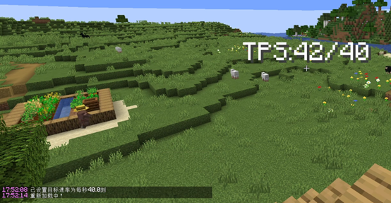
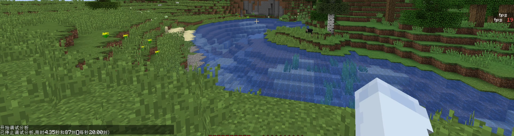

<FeatureHead
    title = '[1. 14. 4+] TPS检测'
    authorName = hao145245
    avatarUrl = '../../_authors/hao145245.webp'
    :socialLinks="[
        { name: 'BiliBili', url: 'https://space.bilibili.com/600039129' },
        { name: 'GitHub', url: 'https://github.com/hao145245' }
    ]"
    cover = '../_assets/6.png'
/>

> 8月6日在wiki发现的，B站，planetminecraft和modrinth搜了下发现没有人做过，于是记录一下。

## 原理[^1]

Java版1.3.1（12w27a）加入的`/debug stop`命令通过`/execute store result ...`获取的输出是整个分析过程中的平均TPS。

`/debug start`会开始新的刻分析器会话，会话可以通过`/debug stop`命令结束

因此我们可以借助`/schedule`[^2]为`/execute store result ... run debug stop`创建一个每`20tick`执行一次的计划来检测TPS

经测试，上述间隔低于`15tick`就会检测不出（误差很大），`20tick`可以兼顾速度和准确性

## 版本限制

### 权限等级

为什么是`1.14.4+`呢？因为`1.14.4-pre4`才在`server.properties`中加入了`function-permission-level`，用于控制函数拥有的权限等级。[^3]

而`/debug`命令需要的权限等级为`3`，函数默认的权限等级为`2`[^4]，导致低于`1.14.4-pre4`的版本无法通过函数运行`/debug`。

### schedule

`1.15(19w38a)`为`/schedule`加入了`replace`参数[^5]，在这之前的版本计划的函数如果不覆盖的话不知道会不会有问题。

> 写到这才发现`replace`是默认的，不知道在这之前的版本是不是也是默认。

### tick

`1.20.3(23w43a)`添加了`/tick`[^6]，在数据包运行的时候可以用`/execute store result ...`获取`/tick query`的输出获取目标TPS[^7]，如果服务器更改目标TPS的话可以检测。

### 单复数

`1.21(24w21a)`把`functions`重命名为`function`。[^8]

## 示例数据包

[这里](https://github.com/hao145245/TPS-Detection)是示例TPS检测数据包，会以`title`的形式显示当前TPS和目标TPS，支持`1.14.4+`。

### 代码

这是`1.21+`的代码

```mcfunction
# load.mcfunction

scoreboard objectives add tps_detection dummy

#1.20.3+
execute store result score target_tps tps_detection run tick query
#1.20.3-
#scoreboard players set target_tps tps_detection 20

#1.15+
schedule function tps-detection:update_tps 20 replace
#1.15- 1.14.4+
#schedule function tps-detection:update_tps 20

debug start
```

```mcfunction
# update_tps.mcfunction

#1.15+
schedule function tps-detection:update_tps 20 replace
#1.15- 1.14.4+
#schedule function tps-detection:update_tps 20

execute store result score tps tps_detection run debug stop

#display
title @a title ["TPS:",{"score":{"name":"tps","objective":"tps_detection"}},"/",{"score":{"name":"target_tps","objective":"tps_detection"}}]


debug start
```

### 演示

#### 1.14.4


#### 1.21.8



## 实战


## 写在后面

数据包检测TPS这个想法是`1.20.3`添加`/tick`的时候有的。当时以为能直接通过`/tick query`的输出获取TPS，甚至还想获取mspt，结果它的输出是目标TPS...

当时还想着从命令方块的输出获取，但是`/tick`需要的权限等级为`3`，完全不行。

之后想了个办法，`/schedule`等待的时间有`s`这个单位，以为是现实时间，但是游戏会将其转换为`tick`

发现`/debug`后以为有数据包的版本就能检测TPS，但是因为上面说的权限等级所以不行。

但是玩家还是能手动执行获取TPS的（如下图）



[^1]: 参见[命令/debug - 中文 Minecraft Wiki](https://zh.minecraft.wiki/w/%E5%91%BD%E4%BB%A4/debug)

[^2]: 参见[命令/schedule - 中文 Minecraft Wiki](https://zh.minecraft.wiki/w/%E5%91%BD%E4%BB%A4/schedule)

[^3]: 参见[Java版1.14.4-pre4 - 中文 Minecraft Wiki](https://zh.minecraft.wiki/w/Java%E7%89%881.14.4-pre4)

[^4]: 参见[权限等级 - 中文 Minecraft Wiki](https://zh.minecraft.wiki/w/%E6%9D%83%E9%99%90%E7%AD%89%E7%BA%A7#Java%E7%89%88_2)

[^5]: 参见[19w38a - 中文 Minecraft Wiki](https://zh.minecraft.wiki/w/19w38a)

[^6]: 参见[23w43a - 中文 Minecraft Wiki](https://zh.minecraft.wiki/w/23w43a)

[^7]: 参见[命令/tick - 中文 Minecraft Wiki](https://zh.minecraft.wiki/w/%E5%91%BD%E4%BB%A4/tick)

[^8]: 参见[24w21a - 中文 Minecraft Wiki](https://zh.minecraft.wiki/w/24w21a)
