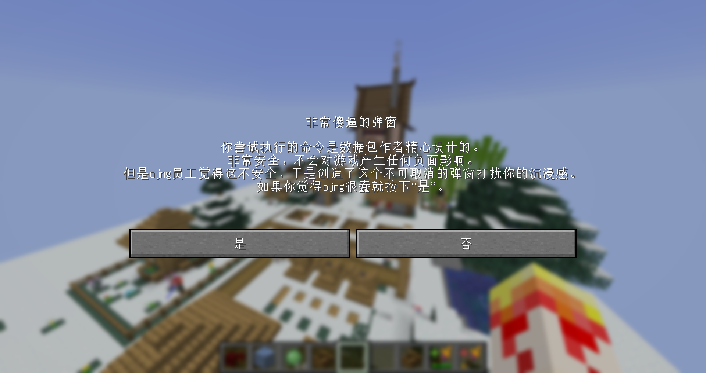
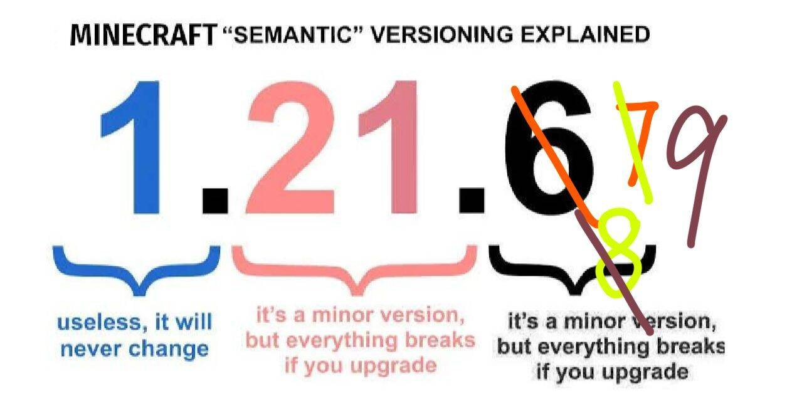

<script setup>
import { useData } from 'vitepress'
import ColorLine from '/.vitepress/vue/ColorLine.vue'
const { isDark } = useData()
</script>

# 封二
<ColorLine :height="4"/>

::: warning 你进入了一个秘密页面！
开个玩笑。  
在香草图书馆的更新过程中，我们发现，一些具有时效性的、细碎的信息，图书馆里没有适合他们存放的位置。  
因此，我们打算在《feature》中添加一个页面，放置一些杂项信息。随着《feature》更新一同更新。  
本页的内容不固定，可能会是各种信息，比如说命令问答，冷知识，~~数据包笑话~~，等等。  
我们在本页下方同样添加了本刊的讨论区，可以在下面发表你对本期《Feature》的看法，也可以向我们提问。
:::

## 命令快闪 Command Flashlight
<ColorLine :height="2"/>

::: tip
本版块分享一些命令的小技巧，主要来自underline群精华消息。
:::

### 无减速右键检测方案
（转载自wilozyxx）（可能是新方法？）  
首先，我可能不是第一个想到这个方法的人，因为它确实非常简单。但由于尚未见人讨论过这个方案，我觉得还是有必要专门发帖说明。  
原理说明： 该方法通过给予玩家一本没有"written_book_content"组件的成书。如你所知，这样的成书在右键点击时不会打开任何界面，玩家可以自由移动——既不会减速，也无需修改物品属性或借助其他实体。  
检测方式： 只需设置一个名为" minecraft.used:minecraft.written_book"的计分板目标，当玩家分数增加时即表示触发了右键点击（是的，这确实依赖计分板机制，我知道...）

::: tip 简评
这个方法的效果应当与胡萝卜钓竿一致，当然，需要测试。  
作为最简单的右键检测方法，胡萝卜钓竿在现在依然有其使用价值。不过，因为它吸引猪的特性有时候也会造成麻烦。诡异菌钓竿同理。而成书没有这种副作用。  
作为胡萝卜钓竿的平替，这一方案确有其价值。
:::

### 上下文内红石信号检测
本段函数给出了一种在上下文内检测指定位置有无红石信号的方案。在做地图的时候可能有用。  
需要预先存储所在坐标的方块和方块状态（如有）。
```mcfunction
setblock ~ ~ ~ minecraft:hopper
execute if block ~ ~ ~ minecraft:hopper[\ enabled = false ] run <YOUR_COMMAND>
$setblock ~ ~ ~ $(block)$(properties)
```

### 弓箭飞行朝向修复函数
直接修改箭的朝向并不能让箭在视觉上朝向指定的方向。这个函数可以同步箭的视觉朝向和实际朝向。

```mcfunction
execute positioned 0. 0. 0. positioned ^ ^ ^2 positioned ~ ~ 0. positioned ^ ^ ^-1 facing 0. 0. 0. run rotate @s ~ ~  
```
使用方法： execute as 箭 rotated as 弓箭的飞行方向 run function 弓箭飞行朝向修复函数

## 你问我答 Q & A
<ColorLine :height="2"/>
::: tip
本版块是问答版块。运作方式类似传统杂志的读者来信。你可以在讨论区写下你的问题，我们会挑选有价值的回答。
:::

> 当然，第一期是不会有内容的。我们希望在接下来的几期中充实这个版块。

## 数据包笑话 Datapack Jokes
<ColorLine :height="2"/>

1. Ojng员工小时候的故事：
   - ojng员工小时候吃自带小零食为了保证安全每吃一口都要家长签一次字
   - ojng员工小时候上三年级发现自己二年级写的暑假作业broken or incompatible
   - ojng员工小时候因为妈妈每个月都给他改一次名导致上不了学
   - ojng员工小时候开学因为用了新教材描述不一样导致开学考全错
2. 
3. 


<ClientOnly>
  <GiscusComment
    repo="CR-019/datapack-index"
    repoId="R_kgDONRhuqw"
    category="闲聊 Chats"
    categoryId="DIC_kwDONRhuq84CkchW"
    mapping="number"
    term="22"
    :strict="false"
    :reactionsEnabled="true"
    emitMetadata="0"
    inputPosition="top"
    :theme="isDark ? 'dark' : 'light'"
    lang="zh-CN"
    loading="lazy"
    class="giscus-wrapper"
  />
</ClientOnly>

<style>
.giscus-wrapper {
  margin: 3rem auto;
  max-width: 800px;
  padding-top: 2rem;
  border-top: 1px solid var(--vp-c-divider);
}
</style>