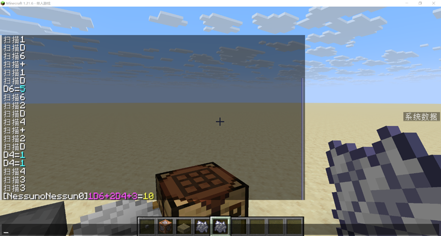

<FeatureHead
    title = '基于铁砧重命名物品的自定义指令'
    authorName = 没有人_没有人_
    avatarUrl = '../../_authors/没有人.webp'
    :socialLinks="[
        { name: 'BiliBili', url: 'https://space.bilibili.com/348994579' }
    ]"
    resourceLink = 'https://github.com/NessunoNessun0/TRPG_Plus'
/>

在使用Minecraft游玩模拟桌游的玩法时，无论是模组还是数据包，都不可避免的在有关掷骰的游戏操作非常麻烦。无论是拿取对应数量的对应骰子，加法计算和比较。在游戏中进行这一系列的操作时往往比在现实中掷骰更耗时。这会极大的消耗玩家的游戏热情。所以，就产生了方便的掷骰这一需求。

本文受跑团掷骰机器人启发。通过函数宏，命令存储，拼接字符串等原版功能，制作了使用铁砧重命名物品，即可根据物品的自定义名称运行指令的数据包（不包含拼写检查）。

对于掷骰场景，输入是一个多项式，项数不确定，可能有nDm（掷几个几面骰）或c（常数）两种运算，各项之间用加号连接。所以设计思路是扫描每个字符，检查分隔符`+`，即可截取出一项

例：

$$
    _01_1D_26_3+_42_5D_64_7+_83_9
$$

当扫描到(3,4)时是”+”，那么(0,3)则是一个单项式”1D6”。同理，函数继续运行，(7，8)时是”+”，那么(4,7)是一个单项式

当扫描结束，不再出现”+”。即可认为(7,8)是最后一个”+”，那么(8,-1)是一个单项式

对于每个单项式，有可能有nDm或c两种可能。nDm中有分隔符D，c是一个纯数字字符串。那么依次扫描单项式中的每一个字符，有”D”则为掷骰运算，没有则认为是一个纯数字。当扫描到”D”时，如例子所示：

$$
_01_1D_26_3
$$

(1,2)是”D”，那么可以认为(0,1)是n，(2,-1)是m。将n，m转换成计分板分数进行运算。

<figure>  <figcaption style="font-size:12px;color:#666;text-align:center;">解除调试行的注释，可以看到扫描和运算的过程</figcaption> </figure>

对于brp规则下的技能检定场景。需要先掷出D100，再与技能值，1/2技能值，1/5技能值比较。需要输入两个变量，技能和值。在这里的解决方案是扫描分隔符`|`。如前文所示之过程。不再赘述。

本文旨在抛砖引玉。提供一个当需要复杂信息输入时，在生存中（特别是没管理员权限时）也能使用的方案。比起聊天栏输入trigger指令的方案更简便（特别是变量复杂的时候）和沉浸式。希望各位大神日后能做出更通用，更简洁，完成度更高的方案。

本数据包已在GitHub开源供大家学习交流，文本提到的功能在roll命名空间下。
