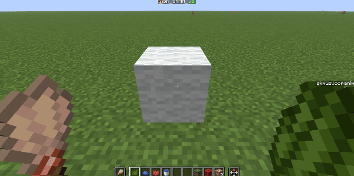

<FeaturedHead
    title = '像写诗一样制作可交互模型'
    authorName = SKSAMA
    avatarUrl = '../../_authors/sk.jpg'
    :socialLinks="[
        { name: 'BiliBili', url: 'https://space.bilibili.com/1546917549' },
        { name: 'GitHub', url: 'https://github.com/ymqlgthbSakuraDream' }
    ]"
    resourceLink = https://ymqlgthbsakuradream.github.io/posts/minecraft/Archive.20250808.html
    cover='../_assets/1.jpg'
/>


本项目名为**SK Model Workspace(模型工作空间)**，旨在通过简单的方式，创建可交互，可复用的模型。同时具有丰富的接口和较强的可拓展性  
~~由于作者一直在咕咕咕，导致该项目有很多坑没有填~~，如果你正在 **[香草图书馆](https://cr-019.github.io/datapack-index/)** 浏览本页面，可以 **[点这里](https://ymqlgthbsakuradream.github.io/posts/minecraft/Archive.20250808.html)** 访问该文章的原始页面，文章将在原始页面继续保持更新，之后会添加更多有用的功能  
之后我也会制作一些基于该数据包的原版家具，~~（然而我并不会建模，所以做的不怎么好）~~
  
 - 运作方式：原版游戏,**[数据包](https://zh.minecraft.wiki/w/%E6%95%B0%E6%8D%AE%E5%8C%85)**
 - 支持版本：**1.21.8**

本文将详细介绍该数据包的功能，并且提供一些案例教程方便读者理解  
有什么问题或建议可以直接在b站或QQ上联系我哦


# 数据包下载

<div class="nbttree">

**依赖关系**  

 + **(数据包)** SK Model Workspace
   + **(前置数据包)** SK API

</div>

[前往下载页面](https://ymqlgthbsakuradream.github.io/posts/minecraft/Archive.20250729.html)  

<br/><br/>

## 概述

### 什么是“可交互模型”呢

玩家对模型进行一定操作，模型对操作进行反馈，具备这种特征的模型可以称作“可交互模型”，比方说有一个椅子，玩家左键点击即可将其破坏，右键点击可以坐到上面。其中“左键点击”和“右键点击”即为操作，“破坏”和“坐”即为反馈，此时，这个椅子就是一个“可交互模型”


展示实体与交互实体在1.19.4版本被加入，为原版开发者们提供了诸多便利，也为找到“可交互模型”的简单实现方式带来了可能性，这一领域目前已有许多优秀的作品：

 - [Deco Creater kit - 简单交互性装饰模型支持库](https://www.mcmod.cn/class/14646.html)
 - [自然工艺 NatureCraft - 高版本自定义模型框架](https://github.com/Bybycyann/NatureCraft)
 - [NyaaWorks - 家具系统](https://github.com/Acappellia/NyaaWorks/blob/main/Readme.md)
 - [一键生成能自定义交互反馈的按钮](https://www.bilibili.com/video/BV1nx4y1279F)

### 该如何实现呢

在**SK Model Workspace**中，每一个可交互模型都由一个Marker，一个或多个展示实体与交互实体组成，其中交互实体用于接收玩家的操作，然后Marker将作为执行者执行事先设定好的事件，最终展示实体给予一定反馈

交互实体接收到玩家的操作以后，需要告诉Marker让其作为执行者，但是如何让交互实体找到Marker呢，一种方法是让交互实体作为Marker的乘客，交互实体可以使用**execute on vehicle**找到Marker，但是这样做很显然有一个问题：假如有不止一个展示实体，让它们都作为Marker的乘客，那么这些展示实体就无法分别设定自己的坐标。显然这是不合适的

另外一种方法是，在模型被创建的之时，将展示实体和Marker的UUID存入storage中，展示实体只需要查找表即可找到Marker

现在Marker成为了执行者，它可以操作所有的交互实体，这又该如何实现呢？其实也不难，我们将一个模型中所有的展示实体与交互实体称为该模型的元素(element)，为每一个元素设定一个不重复的元素ID，然后在Marker中存储所有元素的元素ID和UUID，Marker可以通过给定元素ID来查找该元素的UUID，从而对该元素执行操作


此外，**SK Model Workspace**还支持给模型配置方块，模型本身是没有碰撞体积的。可以配置屏障方块来给模型添加碰撞体积。也可以配置光源方块，让模型发光。
同时为了不影响世界中已经存在的方块，在模型被创建时，会检查目标位置的方块是否为空气，如果是，配置好的方块才会被放置

## 模型类

### 模型类格式

在**SK Model Workspace**中，模型是以**类**的形式定义的

<br/><br/>
```
data modify storage skmws reg.class.<类名> set value <模型数据>
```
参数说明  
**\<模型ID\>** 模型的ID，这是唯一的  
**\<模型数据\>** 一个包含该模型所有数据的复合标签,格式如下  

<div class="nbttree">

<node type="compound"/>(根标签)
   + <node type="bool" name="abstract"/> (可选)指明该模型类是否为抽象类  
   + <node type="string" name="extends"/> (可选)一个类名，该模型类的父类  
   + <node type="list" name="elements"/> 元素列表
     + <node type="compound"/>(一个元素)，**详见：[元素格式](#3.2)**
   + <node type="compound" name="marker_merge"/> (可选)合并数据至该模型的标记实体，**详见：[Wiki:Marker](https://zh.minecraft.wiki/w/%E6%A0%87%E8%AE%B0?variant=zh-cn#%E6%95%B0%E6%8D%AE%E5%80%BC)**
   + <node type="list" name="blocks"/> (可选)方块列表
     + <node type="compound"/>(一个方块)
       + <node type="list" name="position"/> 方块的相对位置
       + <node type="string" name="block"/> 方块ID
   + <node type="compound" name="events"/> (可选)该模型的私有事件列表
     + <node type="list" name="on_load"/> (可选)模型完成加载时执行的事件，**详见：[事件列表格式]()**
     + <node type="list" name="on_remove"/> (可选)模型被移除时执行的事件，**详见：[事件列表格式]()**
     + <node type="list"/>(事件列表ID) (可选)一个自定义事件列表，**详见：[事件列表格式]()**
   + <node type="compound" name="anim"/> (可选)该模型的私有动画
     + <node type="list"/>(动画ID) (可选)一个自定义动画，**详见：[动画格式]()**
   + <node type="compound" name="properties"/> (可选)该模型的动态配置
     + <node type="int" name="permission"/> (可选)模型的操作权限，**详见：[权限控制]()**
     + <node type="string" name="playsound_on_place"/> (可选)该模型被实例化时播放的声音
     + <node type="any"/>(一个自定义项目)
   + <node type="list" name="align_position"/> (可选)对齐坐标，若无该项则不进行坐标对齐，列表中有三个数，对应XYZ三轴，实际坐标为不大于当前坐标且能被该值整除的最大数字，填入-1则表示不对该轴坐标进行对齐，示例：[1,-1,1]表示XZ轴对齐方块网格，Y轴不进行对齐
   + <node type="float" name="align_rotation"/> (可选)约束偏航角，若无该项则不进行偏航角约束，示例：输入90代表实际偏航角被约束至东南西北四个方向之一，输入45代表实际偏航角被约束至八个基本方向
   + <node type="float" name="lock_rotation"/> (可选)锁定旋转角，让旋转角恒为指定值，如果该项与**align_rotation**同时存在，则优先使用该项
</div>


### 元素格式

我们将一个模型中的展示实体与交互实体统称为这个模型的元素，每一个元素都有一个在本模型类中唯一的元素ID

<div class="nbttree">

<node type="compound" name=""/>(一个元素)
   + <node type="string" name="id"/> 元素ID，元素列表中所有元素的ID不能重复
   + <node type="string" name="type"/> 实体类型，可选值为**item_display**，**text_display**，**block_display**，**interaction** <br> 当 **type:"interaction"** 时
   + <node type="compound" name="criteria"/>
     + <node type="list" name="leftclick"/> (可选)左键点击时执行的事件，**详见：[条件列表格式](#4.2)**
     + <node type="list" name="rightclick"/> (可选)右键点击时执行的事件，**详见：[条件列表格式](#4.2)**
   + <node type="compound" name="merge"/> (可选)合并数据至该元素，**详见：[Wiki:交互实体](https://zh.minecraft.wiki/w/%E4%BA%A4%E4%BA%92%E5%AE%9E%E4%BD%93#%E6%95%B0%E6%8D%AE%E5%80%BC)**
   + <node type="list" name="position"/> (可选)该元素的局部坐标<br> 当 **type:"item_display"** 或 **type:"text_display"** 或 **type:"block_display"** 时
   + <node type="compound" name="merge"/> (可选)合并数据，**详见：[Wiki:展示实体](https://zh.minecraft.wiki/w/%E5%B1%95%E7%A4%BA%E5%AE%9E%E4%BD%93#%E6%95%B0%E6%8D%AE%E5%80%BC)**
   + <node type="list" name="position"/> (可选)该元素的局部坐标
   + <node type="list" name="rotation"/> (可选)该元素的相对旋转角
</div>

### 模型类的动态配置

模型的动态配置数据存储在**properties**中，什么是动态配置呢？模型在使用过程中可能存在存取一些变量的需求，这些变量就是动态配置，动态配置可以在模型被实例化后更改并立即生效，例如操作权限**permission**，也是可以在模型被实例化后更改的，本数据包的一些内置功能也依靠动态配置实现

### 模型类的继承

**模型类**跟java中的**类**比较相似，同样支持多层继承，继承可以提升代码的复用性和扩展性  
  
这里举一个例子：我们要制作「门」，门的种类有很多「橡木门」，「白桦木门」，「金合欢木门」... 你可能会想到给每种门分别创建模型类，不过呢，这样做的话会产生相当多的冗余代码，因为任何一扇门都支持「开门」，「关门」等操作，而这项操作在每种类型的门的模型类中都写了一遍，虽然这样做也没什么问题无非多写了一点代码，我复制粘贴不就行了吗（笑），但是如果某一天要升级「开门」，「关门」等操作的相关代码，需要修改每一个类中的相关代码，这实在是太麻烦了  
  
于是聪明的你想到可以先创建一个「门」类，在「门」类中写上「开门」，「关门」相关代码，然后让「橡木门」类，「白桦木门」类，「金合欢木门」类 ... 都继承自「门」类，这样每一个继承自「门」类的类都拥有了「开门」，「关门」操作，接下来要做的只是在每一个子类中单独定义例如材质，模型，音效等子类特有内容即可  
  

**SK Model Workspace**按照以下方式处理类的继承，对处理好的数据进行临时存储，方便下次取用

 - 检查当前模型类的**extends**字段，如果存在的话，则对模型类继承进行以下处理，如果父类也继承自某个类，将对父类进行递归处理  
 - 合并(merge)子类与父类的除**elements**以外所有数据  
 - 在**elements**中，子类中与父类中**id**相同的元素进行合并，其余ID仅存在于父类或子类中的元素的数据则全部保留 

此外，父类中的数据可能是残缺的，必须经过子类的补充才可以被实例化，为了避免这种父类被误实例化而造成未知错误，可以添加**abstract: 1b**字段将该类声明为抽象类，抽象类不可被实例化

### 实例化模型类

什么是“实例化”呢，实例化确实是一个很抽象的概念，不过在这里你可以简单理解为把创建好的模型类摆出来，可以想象一下，你拿着一个方块对着地面点击右键，方块就被放在了地面上，这可以被认为是一种实例化  
  
**SK Model Workspace**提供多种实例化模型类的方式

1. 通过类名  
```
function skmws:construct {class:"<类名>"}
```
**(execute) as** 将作为该模型的拥有者  
**(execute) positioned** 模型的创建位置  
**(execute) rotated** 模型创建时的旋转角  
  
2. 通过传入完整的模型类数据  
```
function skmws:construct_with
```
**(execute) as** 将作为该模型的拥有者  
**(execute) positioned** 模型的创建位置  
**(execute) rotated** 模型创建时的旋转角  
**storage** skmws temp.input 输入一个完整的模型类数据

3. 通过Marker（供内部使用，不建议直接调用）  
生成一个带有如下数据的Marker，Marker的位置和旋转角将被应用于模型创建  

<div class="nbttree">

+ <node type="list" name='Tags:["skmws.construct"]'/>
+ <node type="compound" name="data"/>
  + <node type="compound" name=""/> <node type="string" name="input"/> 一个类名，或者一个完整的模型类数据

</div>

然后执行这个命令  
该命令会处理距离执行者最近的带有**skmws.construct**标签的Marker
```
function skmws:_private/_player_detect
```
**(execute) as** 将作为该模型的拥有者 


## 条件列表

### 概述

条件列表位于模型类中的interaction元素的**criteria**标签中，这个标签里的**leftclick**和**rightclick**就是条件列表，比方说当玩家左键点击了这个交互实体，则会执行**leftclick**标签中的条件列表  
  
为了解释清楚条件列表是干什么用的，举个例子：假设有一只羊，你可以手持小麦给羊喂食，或者手持染料给羊染色，手持剪刀给羊剪毛。像这种在不同情况下执行不同操作的行为可以通过条件列表实现  
  
在**SK Model Workspace**中，条件列表将按照以下方式处理

 - 依次检查条件列表中每一个项目
 - 直到找到一个项目，该项目中的条件检查均通过，则执行该项目中的事件列表，并不再继续检查后续的项目


### 条件列表格式

<div class="nbttree">

<node type="list" name=""/>(条件列表根标签)  
+ <node type="compound" name=""/>(一个检查项目)
    + <node type="string" name="mainhand_item"/> (可选)检查交互玩家主手物品，**详见：[Wiki:物品谓词](https://zh.minecraft.wiki/w/%E5%8F%82%E6%95%B0%E7%B1%BB%E5%9E%8B#item_predicate)**
    + <node type="string" name="offhand_item"/> (可选)检查交互玩家副手物品，**详见：[Wiki:物品谓词](https://zh.minecraft.wiki/w/%E5%8F%82%E6%95%B0%E7%B1%BB%E5%9E%8B#item_predicate)**
    + <node type="compound" name=""/><node type="string" name="predicate"/> (可选)检查交互玩家的实体谓词，**详见：[Wiki:实体谓词](https://zh.minecraft.wiki/w/%E5%AE%9E%E4%BD%93%E8%B0%93%E8%AF%8D)**
    + <node type="list" name="event"/> 以上检查均通过时执行的事件列表，**详见：[事件列表格式](#5.2)**

</div>

## 事件列表

### 概述

模型被交互后执行的操作均由事件列表实现，当一个事件列表被执行时，会依次执行该列表中所有的事件，事件列表可以定义在以下几个地方

 - 条件列表的**event** 标签中
 - 模型类的 **events.<事件列表ID>** 标签中，此时定义的事件列表为私有事件列表，仅可被本类及其子类访问
 - 存储 **storage skmws reg.events.<事件列表ID>** 标签中，此时定义的事件列表为全局事件列表，可以被所有模型类访问，本包的一些内置功能是使用全局事件列表实现的，**详见：[模块](#8)**
  

### 事件列表格式


事件列表的执行者为该模型的Marker  
可以使用 **@a[tag=skmws.s]** 来指定正在执行交互操作的玩家

<div class="nbttree">
 
<node type="list" name=""/>(一个事件列表)
   + <node type="compound" name=""/>(一个事件)
     + <node type="string" name="type"/> 事件类型
     + <node type="any" name=""/>该事件的额外参数（见下文）

</div>

#### # 破坏

 当 **type:"remove"** 时，移除该模型，同时触发on_remove私有事件列表

 当 **type:"destroy"** 时，破坏该模型，同时触发on_remove私有事件列表  
破坏模型产生的效果定义在模型类的动态配置中，格式如下
<div class="nbttree">

<node type="compound" name=""/>(模型类根标签) **详见：[模型类格式](#3.1)**
  + <node type="compound" name="properties"/>
    + <node type="compound" name="destroy"/> 存储模型被破坏时产生的效果
      + <node type="string" name="sound"/> 模型被破坏时播放声音
      + <node type="string" name="particle"/> 破坏粒子，**详见：[Wiki:方块粒子选项](https://zh.minecraft.wiki/w/%E7%B2%92%E5%AD%90%E6%95%B0%E6%8D%AE%E6%A0%BC%E5%BC%8F#%E6%96%B9%E5%9D%97%E7%B2%92%E5%AD%90%E9%80%89%E9%A1%B9)**
      + <node type="compound" name="item"/> (可选)破坏时的掉落物，该项不存在时则不产生掉落物，该项存在时则产生掉落物，并将该项的内容合并至物品,**详见：[Wiki:物品格式](https://zh.minecraft.wiki/w/%E7%89%A9%E5%93%81%E6%A0%BC%E5%BC%8F)**

</div>

#### # 冷却

 当 **type:"cooldown"** 时，设置交互冷却时间，在该时间段内模型不接受任何操作  
<div class="nbttree">

 + <node type="int" name="time"/> 冷却时间
</div>

#### # 坐

 当 **type:"sit"** 时，让执行交互操作的玩家坐在该模型上
<div class="nbttree">

 + <node type="string" name="id"/> 元素ID，指定让玩家坐到哪个元素上
</div>

#### # 调用事件列表

 当 **type:"call"** 时，调用另一事件列表
<div class="nbttree">

  + <node type="compound" name="with"/>
    + <node type="string" name="event"/> 事件列表ID
    + <node type="bool" name="global"/> (可选)指明调用的事件列表是否为公共事件列表
</div>

#### # 动画

 当 **type:"anim"** 时，播放动画
<div class="nbttree">

  + <node type="compound" name="with"/>
    + <node type="string" name="anim"/> 动画ID
    + <node type="bool" name="global"/> (可选)指明调用动画是否为公共动画
    + <node type="bool" name="loop"/> (可选)指明该动画是否会被循环播放
    + <node type="int" name="time"/> (可选)循环播放动画时，动画播放一次所用的时间
</div>


 当 **type:"stopanim"** 时，停止正在播放的循环动画


#### # 执行命令

 当 **type:"cmd"** 时，执行指定命令
<div class="nbttree">

  + <node type="compound" name="with"/>
    + <node type="string" name="cmd"/> 要执行的命令
    + <node type="string" name="key"/> (可选)一个NBT路径，从模型的动态配置中取用值作为要执行的命令的参数
</div>

 当 **type:"execute"** 时，让指定元素执行指定命令
<div class="nbttree">

  + <node type="string" name="id"/> 元素ID，作为执行者
  + <node type="compound" name="with"/>
    + <node type="string" name="cmd"/> 要执行的命令
    + <node type="string" name="key"/> (可选)一个NBT路径，从模型的动态配置中取用值作为要执行的命令的参数
</div>

#### # 修改元素数据

 当 **type:"merge"** 时，合并数据至指定元素
<div class="nbttree">

  + <node type="string" name="id"/> 元素ID
  + <node type="string" name="data"/> 合并数据
</div>

 当 **type:"modify"** 时，修改指定元素的指定数据
<div class="nbttree">

  + <node type="string" name="id"/> 元素ID
  + <node type="string" name="key"/> 一个NBT路径 
  + <node type="any" name="value"/> 值
</div>

#### # 元素增删

 当 **type:"element_append"** 时，添加元素
<div class="nbttree">

  + <node type="string" name="id"/> 元素ID
  + <node type="compound" name="data"/> (一个元素)
</div>

 当 **type:"element_remove"** 时，移除元素
<div class="nbttree">

  + <node type="string" name="id"/> 元素ID
</div>

#### # 方块增删

 当 **type:"block_append"** 时，添加方块
<div class="nbttree">

  + <node type="list" name="position"/> 放置位置
  + <node type="string" name="block"/> 方块ID
</div>

 当 **type:"block_remove"** 时，移除方块
<div class="nbttree">

  + <node type="list" name="position"/> 要被移除的方块的位置
</div>

#### # 移动模型

 当 **type:"move"** 时，移动整个模型，包括所有的方块和元素  
需要指定**position**，或者同时指定**facing**和**px**
<div class="nbttree">

  + <node type="compound" name="with"/>
    + <node type="list" name="position"/> (可选)一个三元列表，表示相对位移
    + <node type="string" name="facing"/> (可选)朝向，可选值为"N","E","S","W"
    + <node type="int" name="px"/> (可选)沿该朝向移动的像素点数
</div>

#### # 修改模型动态配置

 当 **type:"properties"** 时，编辑该模型的动态配置
<div class="nbttree">

  + <node type="string" name="key"/> 一个NBT路径 
  + <node type="any" name="value"/> 值
</div>

#### # 播放声音

 当 **type:"playsound"** 时，播放声音
<div class="nbttree">

  + <node type="string" name="key"/> 一个NBT路径，从模型的动态配置中取用值作为要播放的声音
</div>


### 事件的函数形式

此外这些事件还有其对应的函数，调用这些函数所达到的效果与在事件列表中执行事件相同  
可以在 **type:"cmd"** 事件执行的命令中使用这些函数，不能在其他的上下文中使用  
格式如下： 
```
function skmws:event/<事件类型> {<除type以外的参数>}  
```


## 动画

### 概述

展示实体的**transformation**字段可以进行插值，我们可以利用这个特性制作简单的动画  

动画可以定义在以下几个地方

 - 模型类的 **anim.<动画ID>** 标签中，此时定义的动画为私有动画，仅可被本类及其子类访问
 - 存储 **storage skmws reg.anim.<动画ID>** 标签中，此时定义的动画为全局动画，可以被所有模型类访问


### 动画格式

<div class="nbttree">

<node type="list" name=""/>(根标签)
  + <node type="compound" name=""/>(一个项目)
    + <node type="compound" name="merge"/> 要合并至元素的数据
      + <node type="compound" name=""/>**(元素ID)** 要合并至该元素的数据
    + <node type="int" name="delay"/> 距离上个项目的时间，若该项目为第一个项目则可省略该项

</div>

关于本节内容的教程详见 **[教程：动画](#9.3)**

## 权限控制

### 概述

每一个实例化后的模型都有自己的操作权限，权限信息定义在模型类的动态配置**permission**中  
  
可选值和解释如下表：

|**permission**的值|权限描述|
|-|-----|
|0|所有人可以访问|
|1|仅模型拥有者及其好友可以访问|
|2|仅模型拥有者可以访问|
|3|所有人不可访问|

 - 拥有者即为模型的创建者，谁实例化了这个模型，谁就是这个模型的拥有者
 - 带有**skmws.debug**标签的玩家可以无视权限直接对模型进行操作

### 好友系统

 这是权限控制系统的一个分支，各个玩家的好友数据存储在**storage skmws friends**中，目前只能通过命令操作

<div class="nbttree">

<node type="list" name="friends"/>
  + <node type="compound" name=""/>(一个项目)
    + <node type="string" name="UUID"/> 玩家的UUID字符串
    + <node type="list" name="friends"/> 该玩家的所有好友
      + <node type="compound" name=""/>(一个项目)
        + <node type="string" name="UUID"/> 玩家的UUID字符串
      + <node type="compound" name=""/>...
  + <node type="compound" name=""/>...

</div>
 


## 模块

### 概述

本包将一些常用的功能封装成了全局事件列表，我们将这些全局事件列表称为模块，模块可以在任何模型类中调用，简化了重复的操作。使用这些模块时，需要在模型类的动态配置中添加一些字段，具体内容见下文

### 全局事件：模型状态切换

有的时候创建的模型会有很多状态，例如门可以分为“打开”和“关闭”两种状态，蛋糕可以按食用程度分为8种不同的状态。为了简化对模型状态的处理，可以调用**toggle_state**全局事件列表让模型切换到下一个状态，然后自动调用该模型的私有事件列表**on_state_<当前的状态>** ，以完成对模型更细致的处理  
  
全局事件列表ID：**toggle_state**  

<div class="nbttree">

<node type="compound" name=""/>(模型类根标签) **详见：[模型类格式]()**
  + <node type="compound" name="properties"/>
    + <node type="compound" name="toggle_state"/> 存储模型状态切换相关配置
      + <node type="int" name="current_state"/> (可选)当前状态，默认为0
      + <node type="int" name="number_of_state"/> (可选)状态的数量，默认为2

</div>

关于本节内容的教程详见 **[实战：更丝滑的门](#9.6)** 

### 全局事件：推动模型

该模块被调用时可以让模型沿玩家面向的方向移动一格，如果模型的目标位置处有方块阻挡则不移动  
  
全局事件列表ID：**push**

<div class="nbttree">

<node type="compound" name=""/>(模型类根标签) **详见：[模型类格式]()**
  + <node type="compound" name="properties"/>
    + <node type="compound" name="pushable"/> 存储推动相关配置
      + <node type="int" name="playsound"/> (可选)模型被推动时播放的声音

</div>

关于本节内容的教程详见 **[教程：推动模型](#9.4)**

### 全局事件：染色与清洗

众多周知mojang给很多物品和方块都加入了16种可供选择的颜色，本数据包也提供了类似的功能  
  
染色：全局事件列表ID：**dye**

清洗：全局事件列表ID：**wash**

<div class="nbttree">

<node type="compound" name=""/>(模型类根标签) **详见：[模型类格式]()**
  + <node type="compound" name="properties"/>
    + <node type="compound" name="dyeable"/> 存储染色相关配置
      + <node type="string" name="id"/> 将要被染色的元素的ID
      + <node type="string" name="key"/> 一个NBT路径，模型被染色时将该值修改为指定值
      + <node type="list" name="values"/> 值列表
        + <node type="any" name="default"/> 默认颜色时，上方**key**中指向的的值将会被修改为该值
        + <node type="any" name=""/>(一个自定义颜色) 当模型被染成指定颜色时，上方**key**中指向的的值将会被修改为该值
      + <node type="string" name="playsound_on_dyeing"/>(可选) 模型被染色时播放的声音，若不指定则播放默认声音
      + <node type="string" name="playsound_on_washing"/>(可选) 模型被清洗时播放的声音，若不指定则播放默认声音

</div>

该模块的配置数据存储在**storage skmws config.dyeable**中，可以通过修改颜色配置以适配新的颜色

<div class="nbttree">

<node type="compound" name="dyeable"/>
  + <node type="list" name="colors"/> 颜色配置
    + <node type="compound" name=""/>(一个项目)
      + <node type="string" name="item"/> 检查手持物品，**详见：[Wiki:物品谓词](https://zh.minecraft.wiki/w/%E5%8F%82%E6%95%B0%E7%B1%BB%E5%9E%8B#item_predicate)**
      + <node type="string" name="key"/> 该颜色的键名
      + <node type="list" name="color"/> 一个三元列表，该颜色的RGB颜色值，用于显示粒子效果
  + <node type="string" name="playsound_on_dyeing"/> 模型被染色时默认播放的声音
  + <node type="string" name="playsound_on_washing"/> 模型被清洗时默认播放的声音


</div>

该配置的默认值如下:   
默认值写在了**function/cfg/config.mcfunction**中 

```json
{
    colors:[
        {item:"red_dye",key:"red",color:[0.7, 0.19, 0.17]},
        {item:"blue_dye",key:"blue",color:[0.15, 0.19, 0.57]},
        {item:"cyan_dye",key:"cyan",color:[0.16, 0.46, 0.59]},
        {item:"gray_dye",key:"gray",color:[0.26, 0.26, 0.26]},
        {item:"lime_dye",key:"lime",color:[0.25, 0.8, 0.2]},
        {item:"pink_dye",key:"pink",color:[0.85, 0.51, 0.6]},
        {item:"black_dye",key:"black",color:[0.12, 0.11, 0.11]},
        {item:"brown_dye",key:"brown",color:[0.32, 0.19, 0.1]},
        {item:"green_dye",key:"green",color:[0.23, 0.32, 0.1]},
        {item:"white_dye",key:"white",color:[0.94, 0.94, 0.94]},
        {item:"orange_dye",key:"orange",color:[0.92, 0.53, 0.27]},
        {item:"purple_dye",key:"purple",color:[0.48, 0.18, 0.75]},
        {item:"yellow_dye",key:"yello",color:[0.87, 0.81, 0.16]},
        {item:"magenta_dye",key:"magenta",color:[0.76, 0.33, 0.8]},
        {item:"light_blue_dye",key:"light_blue",color:[0.4, 0.54, 0.83]},
        {item:"light_gray_dye",key:"light_gray",color:[0.67, 0.67, 0.67]}
    ],
    playsound_on_dyeing:"minecraft:item.brush.brushing.gravel",
    playsound_on_washing:"minecraft:item.bucket.empty"
}

```

当全局事件列表**dye**被执行时，首先会检查玩家手持物品，如果在**storage skmws config.dyeable.colors**中定义了这个物品，则获取对应的颜色键名**key**和粒子颜色**color**，然后使用该键名去模型的动态配置**properties.dyeable.values**中查询一个值，使用该值覆盖掉**properties.dyeable.key**指向的数据的原始值，最后生成指定颜色的粒子。如果上述步骤有任意一项执行失败，则模型颜色不会改变  
  
当全局事件列表**wash**被执行时，使用模型的动态配置中**properties.dyeable.values.default**的值覆盖掉**properties.dyeable.key**指向的数据的原始值 

关于本节内容的教程详见 **[教程：染色](#9.5)**


## 案例教程


### 例程：简单装饰模型

先从最简单的开始，简单装饰模型主要的功能是装饰，所以不需要太复杂的效果，我们需要实现的内容有这些


 - 能够像方块一样放置和破坏，并且破坏时可以掉落物品
 - 放置时矫正方向和偏航角
 - 一格碰撞箱

模型类定义如下

```json
{
    // 该模型类的元素
    elements:[

        // 物品展示实体，用于展示模型
        {
            type:"item_display",
            id:"display",
            merge:{

                // 使用custom_model_data组件来显示自定义模型
                item:{
                    id:"acacia_boat",
                    components:{
                        custom_model_data:{strings:["15230006"]}
                    }
                }

            },

            // 该元素的相对旋转角，这里y轴旋转180度是因为在制作模型的时候角度弄错了导致多转了180度，然后懒得改了，这里再转180度就可以转回原位
            rotation:[180,0]
        },

        // 交互实体，用于处理右键点击事件
        {
            type:"interaction",
            id:"interact",

            // 交互实体的宽高都比1稍大一些，这是为了防止玩家点到屏障
            merge:{
                width:1.01,
                height:1.01
            },

            criteria:{
                leftclick:[ // 一个条件列表，在左键模型时执行
                    { //一个检查项目，但是没有定义任何条件，所以该项目无论何时都是通过的
                      event:[{type:"destroy"}] //一个事件列表，功能是摧毁模型
                    }  
                ]
            }
        }
    ],

    // 矫正模型位置，让模型对齐方块网格
    align_position:[1,1,1],

    // 矫正模型朝向，让模型对齐到8个基本方向
    align_rotation:45,

    // 模型的动态配置
    properties:{
      // 摧毁模型相关配置
      destroy:{

        // 摧毁时的声音和粒子
        playsound:"block.oak_wood.break",
        particle:"oak_planks",

        // 摧毁时的掉落物
        item:{
          // 掉落物的物品堆叠组件
          components:{ 

            // 自定义物品模型
            "minecraft:item_model":"acacia_boat",
            "custom_model_data":{strings:["15230006"]},

            // 自定义物品名字
            "minecraft:item_name":"公告牌"
          }
        }

      }
    }

    // 方块
    blocks:[
        // 在模型位置处放置一个屏障，用于充当一格的碰撞箱
        {block:"barrier",position:[0,0,0]}
    ]
}
```


### 教程：动画

使用**SK Model Workspace**的动画系统，可以完成一些简单的模型动画  

现在我们需要制作一个铁傀儡开凿机，并循环播放开凿动画  


观察一下开凿机，发现整个结构一共有5个方块，所以在模型类的**elements**中需要分别为这五个方块添加元素，元素ID分别为**head**，**body_1**，**body_2**，**body_3**，**body_4**，同时还需要一个交互实体，用于处理右键破坏操作  

```json
elements:[
        {
            type:"item_display",
            id:"head",
            merge:{item:{id:"carved_pumpkin"}},
            position:[0,2,0]
        },
        {
            type:"item_display",
            id:"body_1",
            merge:{item:{id:"iron_block"}},
            position:[1,1,0]
        },
        {
            type:"item_display",
            id:"body_2",
            merge:{item:{id:"iron_block"}},
            position:[0,1,0]
        },
        {
            type:"item_display",
            id:"body_3",
            merge:{item:{id:"iron_block"}},
            position:[-1,1,0]
        },
        {
            type:"item_display",
            id:"body_4",
            merge:{item:{id:"iron_block"}},
            position:[0,0,0]
        },
        {
            type:"interaction",
            id:"interact",
            merge:{
                width:1.5,
                height:3
            },
            criteria:{
                leftclick:[
                    {
                        event:[{type:"destroy"}]
                    }
                ]
            }
        },
    ]
```

在**properties**中配置一下破坏时的音效粒子和掉落物，这里的掉落物没有添加组件，所以会显示成默认材质(鸡刷怪蛋)

```json
properties:{
        destroy:{
            particle:"iron_block",
            playsound:"minecraft:block.iron.break",
            item:{}
        }
    }
```

然后我们需要制作铁傀儡开凿动画，并循环播放，这该怎么做呢？首先需要将动画定义为私有动画，私有动画存储在模型类的**anim**中

```json
anim:{

        // 动画ID，这里定义了一个名为"main"的动画
        main:[
            {
                merge:{
                    body_1:{transformation:{translation:[0,0,1]},interpolation_duration:3},
                    body_2:{transformation:{translation:[0,0,0]},interpolation_duration:3},
                    body_3:{transformation:{translation:[0,0,1]},interpolation_duration:3},
                    body_4:{transformation:{translation:[0,0,0]},interpolation_duration:3}
                }
            },
            {
                merge:{
                    body_1:{transformation:{translation:[0,0,0]},interpolation_duration:3},
                    body_2:{transformation:{translation:[0,0,1]},interpolation_duration:3},
                    body_3:{transformation:{translation:[0,0,0]},interpolation_duration:3},
                    body_4:{transformation:{translation:[0,0,1]},interpolation_duration:3}
                },
                delay:14
            }
        ]
    }
```

最后我们只需要让这个动画自动循环播放就可以了，可以通过**on_load**私有事件列表自动执行播放动画操作


```json
events:{
        on_load:[{type:"anim",with:{anim:"main",loop:1b,time:28}}]
    }
```

<details>
<summary>完整代码 [展开..]</summary>

```json
{
    elements:[
        {
            type:"item_display",
            id:"head",
            merge:{item:{id:"carved_pumpkin"}},
            position:[0,2,0]
        },
        {
            type:"item_display",
            id:"body_1",
            merge:{item:{id:"iron_block"}},
            position:[1,1,0]
        },
        {
            type:"item_display",
            id:"body_2",
            merge:{item:{id:"iron_block"}},
            position:[0,1,0]
        },
        {
            type:"item_display",
            id:"body_3",
            merge:{item:{id:"iron_block"}},
            position:[-1,1,0]
        },
        {
            type:"item_display",
            id:"body_4",
            merge:{item:{id:"iron_block"}},
            position:[0,0,0]
        },
        {
            type:"interaction",
            id:"interact",
            merge:{
                width:1.5,
                height:3
            },
            criteria:{
                leftclick:[
                    {
                        event:[{type:"destroy"}]
                    }
                ]
            }
        },
    ],
    properties:{
        destroy:{
            particle:"iron_block",
            playsound:"minecraft:block.iron.break",
            item:{}
        }
    },
    anim:{
        main:[
            {
                merge:{
                    body_1:{transformation:{translation:[0,0,1]},interpolation_duration:3},
                    body_2:{transformation:{translation:[0,0,0]},interpolation_duration:3},
                    body_3:{transformation:{translation:[0,0,1]},interpolation_duration:3},
                    body_4:{transformation:{translation:[0,0,0]},interpolation_duration:3}
                }
            },
            {
                merge:{
                    body_1:{transformation:{translation:[0,0,0]},interpolation_duration:3},
                    body_2:{transformation:{translation:[0,0,1]},interpolation_duration:3},
                    body_3:{transformation:{translation:[0,0,0]},interpolation_duration:3},
                    body_4:{transformation:{translation:[0,0,1]},interpolation_duration:3}
                },
                delay:14
            }
        ]
    },
    events:{
        on_load:[{type:"anim",with:{anim:"main",loop:1b,time:28}}]
    },
    align_position:[1,1,1],
    align_rotation:90
}
```

</details>


### 教程：推动模型

来看一个例子，现在需要制作一个可以被玩家推动的TNT


 - 手持铁斧左键即可破坏
 - 空手右键可以推动
 - 手持打火石右键可以点燃
 - 一格碰撞箱

通过观察不难发现这个模型需要一个展示实体和一个交互实体，元素列表如下

```json
elements:[
        {
            type:"item_display",
            id:"tnt",
            merge:{
                item:{id:"tnt"}
            }
        },
        {
            type:"interaction",
            id:"interact",
            merge:{
                width:1.01,
                height:1.01
            }
        }
    ]
```

使用屏障方块模拟碰撞箱，写法如下

```json
blocks:[
        {position:[0,0,0],block:"barrier"}
    ],
```

现在我们需要对玩家的操作进行处理，可以通过**条件列表→事件列表**架构来处理

```json
criteria:{
                // 左键时执行的条件列表
                leftclick:[

                    // 手持铁斧时破坏模型
                    {
                        mainhand_item:"minecraft:iron_axe",
                        event:[{type:"destroy"}]
                    }
                ],

                // 右键时执行的条件列表
                rightclick:[

                    // 手持打火石时，移除模型，并在相同位置生成一个点燃的TNT
                    {
                        mainhand_item:"minecraft:flint_and_steel",
                        event:[
                            {type:"remove"},
                            {type:"cmd",with:{cmd:"summon minecraft:tnt ~ ~ ~ {fuse:20}"}}
                        ]
                    },

                    // 没有手持打火石时，右键即可推动模型
                    {
                        event:[{type:"call",with:{event:"push",global:1b}}]
                    }
                ]
            }
```

最后只需要修改一下模型的动态配置

```json
    properties:{
        pushable:{
            // 推动时发出的声音
            playsound:"minecraft:block.grass.hit"
        },
        destroy:{

            // 破坏粒子和音效
            particle:"tnt",
            playsound:"minecraft:block.grass.break",

            // 掉落物
            item:{
                components:{
                    "minecraft:item_model":"minecraft:tnt",
                    "minecraft:item_name":"TNT"
                }
            }
        },

        // 模型被创建时播放的声音 
        playsound_on_place:"minecraft:block.grass.place"
    }
```

<details>
<summary>完整代码 [展开..]</summary>

```json
{
    elements:[
        {
            type:"item_display",
            id:"tnt",
            merge:{
                item:{id:"tnt"},
                teleport_duration:5
            }
        },
        {
            type:"interaction",
            id:"interact",
            merge:{
                width:1.01,
                height:1.01
            },
            criteria:{
                leftclick:[
                    {
                        mainhand_item:"minecraft:iron_axe",
                        event:[{type:"destroy"}]
                    }
                ],
                rightclick:[
                    {
                        mainhand_item:"minecraft:flint_and_steel",
                        event:[
                            {type:"remove"},
                            {type:"cmd",with:{cmd:"summon minecraft:tnt ~ ~ ~ {fuse:20}"}}
                        ]
                    },
                    {
                        event:[{type:"call",with:{event:"push",global:1b}}]
                    }
                ]
            }
        }
    ],
    align_position:[1,1,1],
    align_rotation:90,
    blocks:[
        {position:[0,0,0],block:"barrier"}
    ],
    properties:{
        pushable:{
            playsound:"minecraft:block.grass.hit"
        },
        destroy:{
            particle:"tnt",
            playsound:"minecraft:block.grass.break",
            item:{
                components:{
                    "minecraft:item_model":"minecraft:tnt",
                    "minecraft:item_name":"TNT"
                }
            }
        },
        playsound_on_place:"minecraft:block.grass.place"
    }
}

```

</details>


### 教程：染色

染色是一个很常用的功能，接下来我们通过一个简单的例子带你了解这个功能  

现在要制作一个可以染色的羊毛块



 - 副手持有刷子，主手持有染料时，右键羊毛方块，可以将羊毛染成对应颜色
 - 副手持有刷子，主手持有水桶时，右键羊毛方块，可以冲洗羊毛方块使其恢复到白色
 - 左键摧毁方块

不难发现这个模型包含两个元素，一个展示实体，一个交互实体
```json
elements:[
    // 交互实体
        {
            type:"interaction",
            id:"interact",
            merge:{
                width:1.01,
                height:1.01
            },
            criteria:{
                //...
            }
        },

        // 展示实体
        {
            type:"item_display",
            // 记住这个id，一会要考
            id:"block",
            merge:{
                item:{
                    id:"white_wool"
                },
                teleport_duration:5
            }
        }
    ]
```

然后配置条件列表和事件列表
```json
criteria:{
        // 左键摧毁方块
        leftclick:[
            {
                event:[{type:"destroy"}]
            }
        ],
        // 右键时
        rightclick:[
            // 副手持有刷子，主手持有染料时，右键羊毛方块，可以将羊毛染成对应颜色
            {
                offhand_item:"minecraft:brush",
                // #skmws:dye 标签中包含了所有染料
                mainhand_item:"#skmws:dyes",
                event:[{type:"call",with:{event:"dye",global:1b}}]
            },
            // 副手持有刷子，主手持有水桶时，右键羊毛方块，可以冲洗羊毛方块
            {
                offhand_item:"minecraft:brush",
                mainhand_item:"minecraft:water_bucket",
                event:[{type:"call",with:{event:"wash",global:1b}}]
            }
        ]
    }
```

最后是模型类的动态配置

```json
properties:{
        destroy:{
            particle:"white_wool",
            playsound:"minecraft:block.wool.break"
        },
        playsound_on_place:"minecraft:block.wool.place",

        // 染色与清洗相关的配置
        dyeable:{
            // 这里的元素id填写展示实体的元素id，表示要对该元素进行操作
            id:"block",
            // 这个NBT路径表示要修改指定元素的哪个值
            key:"item.id",
            // 值表，根据颜色决定要将key中路径的值替换为何值
            values:{
                default:"white_wool",
                red:"red_wool",
                blue:"blue_wool",
                green:"green_wool"
                //...
            }
        }
    }
```

<details>
<summary>完整代码 [展开..]</summary>

```json
{
    elements:[
        {
            type:"interaction",
            id:"interact",
            merge:{
                width:1.01,
                height:1.01
            },
            criteria:{
                leftclick:[
                    {
                        event:[{type:"destroy"}]
                    }
                ],
                rightclick:[
                    {
                        offhand_item:"minecraft:brush",
                        mainhand_item:"#skmws:dyes",
                        event:[{type:"call",with:{event:"dye",global:1b}}]
                    },
                    {
                        offhand_item:"minecraft:brush",
                        mainhand_item:"minecraft:water_bucket",
                        event:[{type:"call",with:{event:"wash",global:1b}}]
                    }
                ]
            }
        },
        {
            type:"item_display",
            id:"block",
            merge:{
                item:{
                    id:"white_wool"
                },
                teleport_duration:5
            }
        }
    ],
    blocks:[
        {position:[0,0,0],block:"barrier"}
    ],
    properties:{
        destroy:{
            particle:"white_wool",
            playsound:"minecraft:block.wool.break"
        },
        playsound_on_place:"minecraft:block.wool.place",
        dyeable:{
            id:"block",
            key:"item.id",
            values:{
                default:"white_wool",
                red:"red_wool",
                blue:"blue_wool",
                green:"green_wool"
            }
        }
    },
    align_position:[1,1,1],
    align_rotation:90
}
```

</details>


### 实战：更丝滑的门

原版MC的门没有开关门动画，现在来制作一个带有开关门动画的门


我们先来思考一下这个该如何实现  
首先门的展示部分可以用两个方块展示实体实现，交互使用交互实体，碰撞箱使用两个屏障方块

```json
{
    elements:[
        // 交互实体
        {
            type:"interaction",
            id:"interact",
            merge:{
                width:1.01,
                height:2
            }
        },
        // 方块展示实体，下半部分
        {
            type:"block_display",
            id:"lower",
            merge:{
                block_state:{
                    Name:"cherry_door",
                    Properties:{facing:"south",half:"lower"}
                }
            },
            position:[-0.5,0,-0.5]
        },
        // 方块展示实体，上半部分
        {
            type:"block_display",
            id:"upper",
            merge:{
                block_state:{
                    Name:"cherry_door",
                    Properties:{facing:"south",half:"upper"}
                }
            },
            position:[-0.5,1,-0.5]
        }
    ],
    // 方块，两个屏障
    blocks:[
        {position:[0,0,0],block:"barrier"},
        {position:[0,1,0],block:"barrier"}
    ]
}
```

不过现在这个门还无法进行任何交互，为了方便后续测试，先实现左键破坏，并在模型的动态配置中加入破坏相关的配置

```json

criteria:{
                leftclick:[
                    {
                        event:[{type:"destroy"}]
                    }
                ]
        }
```

```json
properties:{
        destroy:{

            // 破坏时的声音和粒子
            playsound:"block.cherry_wood.break",
            particle:"cherry_planks",

            // 掉落物
            item:{
                components:{
                    "minecraft:item_model":"minecraft:cherry_door",
                    "minecraft:item_name":"补帧 · 樱花木门"
                }
            }
        }
    }
```

现在需要实现右键开关门的操作，我们不妨把这个操作抽象一下，开门和关门可以视为两种状态，右键点击时可以从一种状态切换到另一种状态，使用 **全局事件: toggle_state** 可以很方便的解决有关状态切换的问题  
  
条件列表这样写：

```json
criteria:{
                rightclick:[
                    {
                        event:[{type:"call",with:{event:"toggle_state",global:1b}}]
                    }
                ]
            }

```

然后需要加入一些动态配置

```json
 properties:{
        toggle_state:{
            // 当前状态，我们可以规定1为关门，0为开门，创建模型时默认关门，所以这里写1
            current_state:1,

            // 状态的总数量，门只有开门和关门两种状态，所以这里写2
            number_of_state:2
        }
```

编辑一下切换到该状态时需要执行的事件

 - 关门时：放置屏障，播放关门音效，关门动画
 - 开门时：移除屏障，播放开门音效，开门动画

```json
events:{
        // 开门时执行的事件
        on_state_0:[

            // 播放开门音效
            {type:"playsound",key:"_door.playsound_open"},

            // 移除屏障
            {type:"block_remove",position:[0,0,0]},
            {type:"block_remove",position:[0,1,0]},

            // 动画(简单的动画可以直接使用merge实现)
            {
                type:"merge",
                id:"upper",
                data:{
                transformation:{
                    left_rotation:{axis:[0,1,0],angle:-1.5708},
                    translation:[0.1875,0,0]},
                    start_interpolation:0,
                    interpolation_duration:5
                }
            },
            {
                type:"merge",
                id:"lower",
                data:{
                    transformation:{
                        left_rotation:{axis:[0,1,0],angle:-1.5708},
                        translation:[0.1875,0,0]
                    },
                    start_interpolation:0,
                    interpolation_duration:5
                }
            }
        ],

        // 关门时执行的事件
        on_state_1:[

            // 播放关门音效
            {type:"playsound",key:"_door.playsound_close"},

            // 放置屏障
            {type:"block_append",position:[0,0,0],block:"barrier"},
            {type:"block_append",position:[0,1,0],block:"barrier"},

            // 动画
            {
                type:"merge",
                id:"upper",
                data:{
                    transformation:{
                        left_rotation:{axis:[0,1,0],angle:0},
                        translation:[0,0,0]
                    },
                    start_interpolation:0,
                    interpolation_duration:5
                }
            },
            {
                type:"merge",
                id:"lower",
                data:{
                    transformation:{
                        left_rotation:{axis:[0,1,0],angle:0},
                        translation:[0,0,0]
                    },
                    start_interpolation:0,
                    interpolation_duration:5
                }
            }
        ]
    }

```

事件中使用的音效需要在动态配置中定义

```json
properties:{
        _door:{
            playsound_open:"block.cherry_wood_door.open",
            playsound_close:"block.cherry_wood_door.close"
        }
    }
```

至此你完成了这个模型类的定义

<details>
<summary>完整代码 [展开..]</summary>

```json
{
    abstract: 1b,
    elements:[
        {
            type:"interaction",
            id:"interact",
            merge:{
                width:1.01,
                height:2
            },
            criteria:{
                leftclick:[
                    {
                        event:[{type:"destroy"}]
                    }
                ],
                rightclick:[
                    {
                        event:[{type:"call",with:{event:"toggle_state",global:1b}}]
                    }
                ]
            }
        },
        {
            type:"block_display",
            id:"lower",
            merge:{
                block_state:{
                    Name:"cherry_door",
                    Properties:{
                        facing:"south",
                        half:"lower"
                    }
                }
            },
            position:[-0.5,0,-0.5]
        },
        {
            type:"block_display",
            id:"upper",
            merge:{
                block_state:{
                    Name:"cherry_door",
                    Properties:{
                        facing:"south",
                        half:"upper"
                    }
                }
            },
            position:[-0.5,1,-0.5]
        }
    ],
    blocks:[
        {position:[0,0,0],block:"barrier"},
        {position:[0,1,0],block:"barrier"}
    ],
    events:{
        on_state_0:[
            {type:"playsound",key:"_door.playsound_open"},
            {type:"block_remove",position:[0,0,0]},
            {type:"block_remove",position:[0,1,0]},
            {
                type:"merge",
                id:"upper",
                data:{
                transformation:{
                    left_rotation:{axis:[0,1,0],angle:-1.5708},
                    translation:[0.1875,0,0]},
                    start_interpolation:0,
                    interpolation_duration:5
                }
            },
            {
                type:"merge",
                id:"lower",
                data:{
                    transformation:{
                        left_rotation:{axis:[0,1,0],angle:-1.5708},
                        translation:[0.1875,0,0]
                    },
                    start_interpolation:0,
                    interpolation_duration:5
                }
            }
        ],
        on_state_1:[
            {type:"playsound",key:"_door.playsound_close"},
            {type:"block_append",position:[0,0,0],block:"barrier"},
            {type:"block_append",position:[0,1,0],block:"barrier"},
            {
                type:"merge",
                id:"upper",
                data:{
                    transformation:{
                        left_rotation:{axis:[0,1,0],angle:0},
                        translation:[0,0,0]
                    },
                    start_interpolation:0,
                    interpolation_duration:5
                }
            },
            {
                type:"merge",
                id:"lower",
                data:{
                    transformation:{
                        left_rotation:{axis:[0,1,0],angle:0},
                        translation:[0,0,0]
                    },
                    start_interpolation:0,
                    interpolation_duration:5
                }
            }
        ]
    },
    properties:{
        destroy:{
            playsound:"block.cherry_wood.break",
            particle:"cherry_planks",
            item:{
                components:{
                    "minecraft:item_model":"minecraft:cherry_door",
                    "minecraft:item_name":"补帧 · 樱花木门"
                }
            }
        },
        _door:{
            playsound_open:"block.cherry_wood_door.open",
            playsound_close:"block.cherry_wood_door.close"
        },
        playsound_on_place:"block.cherry_wood.place",
        toggle_state:{
            current_state:1,
            number_of_state:2
        }
    },
    align_position:[1,1,1],
    align_rotation:90
}
```

</details>

不过先别急，刚才只是做作了樱花木门的模型类，现在需要进行拓展。  
先把所有门共有的数据提取出来放在父类中(下面的非共有数据已被注释)，并将父类定义为抽象类

```json
// 类名: _door
{
    // 定义为抽象类
    abstract: 1b,
    elements:[
        {
            type:"interaction",
            id:"interact",
            merge:{
                width:1.01,
                height:2
            },
            criteria:{
                leftclick:[
                    {
                        event:[{type:"destroy"}]
                    }
                ],
                rightclick:[
                    {
                        event:[{type:"call",with:{event:"toggle_state",global:1b}}]
                    }
                ]
            }
        },
        {
            type:"block_display",
            id:"lower",
            merge:{
                block_state:{
                    // Name:"cherry_door",
                    Properties:{
                        facing:"south",
                        half:"lower"
                    }
                }
            },
            position:[-0.5,0,-0.5]
        },
        {
            type:"block_display",
            id:"upper",
            merge:{
                block_state:{
                    // Name:"cherry_door",
                    Properties:{
                        facing:"south",
                        half:"upper"
                    }
                }
            },
            position:[-0.5,1,-0.5]
        }
    ],
    blocks:[
        {position:[0,0,0],block:"barrier"},
        {position:[0,1,0],block:"barrier"}
    ],
    events:{
        on_state_0:[
            {type:"playsound",key:"_door.playsound_open"},
            {type:"block_remove",position:[0,0,0]},
            {type:"block_remove",position:[0,1,0]},
            {
                type:"merge",
                id:"upper",
                data:{
                transformation:{
                    left_rotation:{axis:[0,1,0],angle:-1.5708},
                    translation:[0.1875,0,0]},
                    start_interpolation:0,
                    interpolation_duration:5
                }
            },
            {
                type:"merge",
                id:"lower",
                data:{
                    transformation:{
                        left_rotation:{axis:[0,1,0],angle:-1.5708},
                        translation:[0.1875,0,0]
                    },
                    start_interpolation:0,
                    interpolation_duration:5
                }
            }
        ],
        on_state_1:[
            {type:"playsound",key:"_door.playsound_close"},
            {type:"block_append",position:[0,0,0],block:"barrier"},
            {type:"block_append",position:[0,1,0],block:"barrier"},
            {
                type:"merge",
                id:"upper",
                data:{
                    transformation:{
                        left_rotation:{axis:[0,1,0],angle:0},
                        translation:[0,0,0]
                    },
                    start_interpolation:0,
                    interpolation_duration:5
                }
            },
            {
                type:"merge",
                id:"lower",
                data:{
                    transformation:{
                        left_rotation:{axis:[0,1,0],angle:0},
                        translation:[0,0,0]
                    },
                    start_interpolation:0,
                    interpolation_duration:5
                }
            }
        ]
    },
    properties:{
        destroy:{
            // playsound:"block.cherry_wood.break",
            // particle:"cherry_planks",
            // item:{
            //    components:{
            //        "minecraft:item_model":"minecraft:cherry_door",
            //        "minecraft:item_name":"补帧 · 樱花木门"
            //    }
            // }
        },
        _door:{
            // playsound_open:"block.cherry_wood_door.open",
            // playsound_close:"block.cherry_wood_door.close"
        },
        // playsound_on_place:"block.cherry_wood.place",
        toggle_state:{
            current_state:1,
            number_of_state:2
        }
    },
    align_position:[1,1,1],
    align_rotation:90
}
```

然后让子类继承自父类，并加入子类私有的数据，下面演示定义樱花木门类和竹木门类

```json
// 类名：cherry_door
{
    extends:"_door",
    elements:[
        {id:"upper",merge:{block_state:{Name:"cherry_door"}}},
        {id:"lower",merge:{block_state:{Name:"cherry_door"}}}
    ],
    properties:{
        destroy:{
            playsound:"block.cherry_wood.break",
            particle:"cherry_planks",
            item:{
                components:{
                    "minecraft:item_model":"minecraft:cherry_door",
                    "minecraft:item_name":"补帧 · 樱花木门"
                }
            }
        },
        _door:{
            playsound_open:"block.cherry_wood_door.open",
            playsound_close:"block.cherry_wood_door.close"
        },
        playsound_on_place:"block.cherry_wood.place"
    }
}
```

```json
// 类名：bamboo_door
{
    extends:"_door",
    elements:[
        {id:"upper",merge:{block_state:{Name:"bamboo_door"}}},
        {id:"lower",merge:{block_state:{Name:"bamboo_door"}}}
    ],
    properties:{
        destroy:{
            playsound:"block.bamboo_wood.break",
            particle:"bamboo_planks",
            item:{
                components:{
                    "minecraft:item_model":"minecraft:bamboo_door",
                    "minecraft:item_name":"补帧 · 竹木门"
                }
            }
        },
        _door:{
            playsound_open:"block.bamboo_wood_door.open",
            playsound_close:"block.bamboo_wood_door.close"
        },
        playsound_on_place:"block.bamboo_wood.place"
    }
}
```

可见，继承减少了冗余代码，极大地提升了代码复用性

<details>
<summary>门类(_door) 完整代码 [展开..]</summary>

```json
{
    abstract: 1b,
    elements:[
        {
            type:"interaction",
            id:"interact",
            merge:{
                width:1.01,
                height:2
            },
            criteria:{
                leftclick:[
                    {
                        event:[{type:"destroy"}]
                    }
                ],
                rightclick:[
                    {
                        event:[{type:"call",with:{event:"toggle_state",global:1b}}]
                    }
                ]
            }
        },
        {
            type:"block_display",
            id:"lower",
            merge:{
                block_state:{
                    Properties:{
                        facing:"south",
                        half:"lower"
                    }
                }
            },
            position:[-0.5,0,-0.5]
        },
        {
            type:"block_display",
            id:"upper",
            merge:{
                block_state:{
                    Properties:{
                        facing:"south",
                        half:"upper"
                    }
                }
            },
            position:[-0.5,1,-0.5]
        }
    ],
    blocks:[
        {position:[0,0,0],block:"barrier"},
        {position:[0,1,0],block:"barrier"}
    ],
    events:{
        on_state_0:[
            {type:"playsound",key:"_door.playsound_open"},
            {type:"block_remove",position:[0,0,0]},
            {type:"block_remove",position:[0,1,0]},
            {
                type:"merge",
                id:"upper",
                data:{
                transformation:{
                    left_rotation:{axis:[0,1,0],angle:-1.5708},
                    translation:[0.1875,0,0]},
                    start_interpolation:0,
                    interpolation_duration:5
                }
            },
            {
                type:"merge",
                id:"lower",
                data:{
                    transformation:{
                        left_rotation:{axis:[0,1,0],angle:-1.5708},
                        translation:[0.1875,0,0]
                    },
                    start_interpolation:0,
                    interpolation_duration:5
                }
            }
        ],
        on_state_1:[
            {type:"playsound",key:"_door.playsound_close"},
            {type:"block_append",position:[0,0,0],block:"barrier"},
            {type:"block_append",position:[0,1,0],block:"barrier"},
            {
                type:"merge",
                id:"upper",
                data:{
                    transformation:{
                        left_rotation:{axis:[0,1,0],angle:0},
                        translation:[0,0,0]
                    },
                    start_interpolation:0,
                    interpolation_duration:5
                }
            },
            {
                type:"merge",
                id:"lower",
                data:{
                    transformation:{
                        left_rotation:{axis:[0,1,0],angle:0},
                        translation:[0,0,0]
                    },
                    start_interpolation:0,
                    interpolation_duration:5
                }
            }
        ]
    },
    properties:{
        toggle_state:{
            current_state:1,
            number_of_state:2
        }
    },
    align_position:[1,1,1],
    align_rotation:90
}

```

</details>


<details>
<summary>樱花木门类(cherry_door) 完整代码 [展开..]</summary>

```json

{
    extends:"_door",
    elements:[
        {id:"upper",merge:{block_state:{Name:"cherry_door"}}},
        {id:"lower",merge:{block_state:{Name:"cherry_door"}}}
    ],
    properties:{
        destroy:{
            playsound:"block.cherry_wood.break",
            particle:"cherry_planks",
            item:{
                components:{
                    "minecraft:item_model":"minecraft:cherry_door",
                    "minecraft:item_name":"补帧 · 樱花木门"
                }
            }
        },
        _door:{
            playsound_open:"block.cherry_wood_door.open",
            playsound_close:"block.cherry_wood_door.close"
        },
        playsound_on_place:"block.cherry_wood.place"
    }
}

```

</details>

<details>
<summary>竹木门类(bamboo_door) 完整代码 [展开..]</summary>

```json

{
    extends:"_door",
    elements:[
        {id:"upper",merge:{block_state:{Name:"bamboo_door"}}},
        {id:"lower",merge:{block_state:{Name:"bamboo_door"}}}
    ],
    properties:{
        destroy:{
            playsound:"block.bamboo_wood.break",
            particle:"bamboo_planks",
            item:{
                components:{
                    "minecraft:item_model":"minecraft:bamboo_door",
                    "minecraft:item_name":"补帧 · 竹木门"
                }
            }
        },
        _door:{
            playsound_open:"block.bamboo_wood_door.open",
            playsound_close:"block.bamboo_wood_door.close"
        },
        playsound_on_place:"block.bamboo_wood.place"
    }
}

```

</details>


