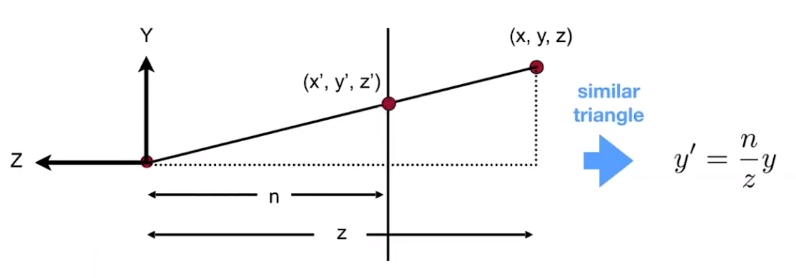

<FeatureHead
    title = '着色器02 核心着色器的工作流程（上）'
    authorName = 轩宇1725
    avatarUrl = '../../_authors/轩宇1725.jpg'
    :socialLinks="[
        { name: 'BiliBili', url: 'https://space.bilibili.com/104432208' }
    ]"
    cover='../_assets/3.png'
/>

## 回顾：顶点着色器的工作

*来自上一节的渲染管线小节*

$\Huge\text{“}$ 加载到游戏内的各种事物将会将自己的顶点属性发送给特定的着色器对象，由`.vsh`顶点着色器来处理这些顶点。

$\Huge\text{“}$ 顶点着色器在此阶段的主要任务是位置的转换，以世界中的实体为例，发送给着色器的顶点坐标都是基于摄像机的相对坐标。但是OpenGL约定，顶点的输出坐标都是从 `(-1.0, -1.0, -1.0)` 到 `(1.0, 1.0, 1.0)` 的范围内，且原点在屏幕中心，z轴垂直屏幕向外。顶点着色器的任务，就是利用游戏发送的包括摄像机数据在内的一些列数据，配合顶点自身的属性，进行一系列数学计算，使得顶点移动到正确的位置。

## GLSL

GLSL，即OpenGL Shading Language，是OpenGL着色器所使用的语言，语法和C类似。编程语言并不是本教程的重点，这里只简单介绍一些GLSL比较重要的概念。

若有需要，可以查阅 [GLSL的官方文档](https://registry.khronos.org/OpenGL/specs/gl/GLSLangSpec.4.60.pdf) 和其他非官方资料

* [docs.GL](http://cesium.xin/docsgl/sl4/dot)
* [LearnOpenGL - GLSL章节](https://learnopengl.com/Getting-started/Shaders)
* [GLSL Built-in Functions](https://registry.khronos.org/OpenGL-Refpages/gl4/)
* [GLSL Reference Card (PDF)](https://www.khronos.org/files/opengl43-quick-reference-card.pdf)

GLSL是运行在GPU上的语言，由于无法访问内存，GLSL不支持递归，但它有更强的并行计算能力。同一阶段着色器的运行没有先后顺序，它们是同时并行处理的。

### GLSL版本

每个GLSL程序都需要在开头使用 `#version <版本号>` 关键字来声明所使用的版本，不同的GLSL版本有不同的特性，如果没有特别说明，我们统一使用440版本进行讲解。

### GLSL的数据类型

除了常有的`int`, `float`, `double`, `uint` 和 `bool` 类型，GLSL还有其特色的 **向量（Vector）** 和 **矩阵（Matrix）** 。

GLSL提供了多种不同的向量与矩阵，你可以通过不同的前缀和后缀构建所需的向量或矩阵。向量和矩阵的默认分量都是`float`类型，你可以通过不同的前缀来构建不同分量类型的变量，前缀 `i` 代表分量都为 `int`，`u` 代表 `uint`，`b` 代表 `bool`，`d` 则代表 `double`。

对于向量，你可以在后面添加`2` `3` `4`来指定分量的数量，如`vec4`代表由4个 `float` 分量组成的向量。对于矩阵，只填入一个数字代表方阵的列数和行数，如`mat4`代表4行4列的 `float` 矩阵。`mat3x2`则代表 3列2行的 `float` 矩阵。

GLSL的一大特点就是你可以随意组合向量与矩阵来构建新的向量与矩阵，参考下面的代码：

```glsl 
vec3 v1 = vec3(1.0, 0.0, 1.0);
vec4 v2 = vec4(v1, 1.0);
mat4 m1 = mat4(
    v1, 2.0,
    v2,
    1.0, 2.0, 0.0, 1.0,
    vec4(1.0)     // 这是一种简写，代表全部分量为1.0的vec4，在低于GLSL 330的环境中不被允许
);
```

_GLSL中的矩阵采用的是列优先视角，虽然在代码中是按行书写的，但构造矩阵时内部会优先填入列的数据。这个特性决定的是矩阵在内存中的存储方式，对参与计算的矩阵表现有影响，在进行矩阵变换的时候一定要注意转置问题_

### 传递变量

**传递变量（Ins and Outs）** 是着色器通信的主要桥段，在变量的声明前添加 `in`，代表它的数据是由外部传入，`out` 则代表它的数据要传到外部。

对顶点着色器来说，它的传入变量就是前一节提到的顶点属性，后文我们会详细介绍。传出变量是在顶点处运算，发送到片元着色器进行插值的数据。

_在 **GLSL 130** 以前，传入变量要使用 `attribute` 关键字，而传出要使用`varying`_

### 全局量

**全局量（Uniforms）** 是一些游戏预设的变量，他们在渲染同一对象时的不同顶点、不同片元时保持相同，但在不同对象间可能不同、

全局量在声明时使用 `uniform` 关键字，只要声明，游戏会对他们进行自动赋值。

全局量在 **1.21.5** 之前，全局量需要用与着色器示例一一对应的`.json`文件配置，并且要在着色器文件内显式声明，指定的初始值无作用，游戏会重新给它们赋值。 **1.21.6** 后，游戏使用 **Uniform块** 声明（通过包含着色器引入声明，同样由游戏自动赋值）

顶点属性与全局量构成了着色器的全部输入，这也正体现了Minecraft中着色器数据获取受限的特点，顶点属性和全局量都是硬编码的，我们无法随意获取更多的数据。

### 向量与矩阵的运算

这里不赘述线性代数的相关知识，有需要的读者可自行学习。[【3Blue1Brown】线性代数的本质系列](https://www.bilibili.com/video/BV1ys411472E)

与数学中有所区别，GLSL向量与向量间有多种运算，包括标量乘法、叉乘、点乘、四则运算等。

前几种数学中定义过的运算外，其他的运算都是逐分量运算。可参考下面的代码：

```glsl

5.0 * vec4(1.0, 2.0, 3.0 ,1.0);
            // 标量乘法 == vec(5.0, 10.0, 15.0, 5.0)

cross(vec3(1.0, 2.0, 1.0), vec3(2.0, 3.0, 1.0));
            // 叉乘 == vec3(-1.0, 1.0, -1.0)

dot(vec3(1.0, 2.0, 1.0), vec3(2.0, 3.0, 1.0));
            // 点乘 == 9.0

vec3(1.0, 2.0, 1.0) + vec3(2.0, 3.0, 1.0);
            // 逐分量加法 == vec3(3.0, 5.0, 2.0)
            
abs(vec4(-1.0 ,2.0, -4.0));
            // 逐分量取绝对值 == vec4(1.0, 2.0, 4.0)

```

## 顶点着色器

### 顶点属性

**顶点属性(Vertex Attributes)** 是顶点着色器的主要输入。在Minecraft中，顶点属性包括：

 * Position - 输入的顶点位置，渲染不同对象时，输入的位置可能在不同坐标系中，后文坐标系板块会一并介绍。
 * Color - 顶点的颜色，一般包括自动上色、光照等在顶点处处理即可的颜色信息，纹理和雾气等复杂的颜色效果在 **片元着色器** 中才会处理。
 * UV/UV0 - 纹理坐标，但并 **不是烘焙模型文件中定义的UV坐标** ，而是游戏按照 `assets/minecraft/atlases` 下的规则将纹理组合为一张大的纹理图集后，对应的纹理在纹理图集中的UV坐标。
 * UV2 - 亮度纹理的纹理坐标，横坐标代表方块亮度，纵坐标代表天空亮度，与UV/UV0不同的是，它不是 **归一化** 的（即范围不是0.0到1.0），范围是0到256（实际上只会取到240）
 * Normal - 顶点的单位法向量。
 * Padding - 可视为占位符，仅用于对齐顶点数据，没有实际效果，也不在大多数着色器中出现。

在上一节中我们简单介绍过顶点属性这一概念，它定义了顶点的全部数据。在每个着色器中，不一定会输入全部可用的顶点属性。目前顶点属性是硬编码的，不能在资源包中额外获取其他可用的顶点属性。在接下来的教程中我们会逐个详细地介绍这些顶点属性是如何发挥作用的。

### 1.21.4 前的着色器配置文件

```json
{
    "vertex": "minecraft:core/terrain",
    "fragment": "minecraft:core/terrain",
    "samplers": [
        { "name": "Sampler0" },
        { "name": "Sampler2" }
    ],
    "uniforms": [
        { "name": "ModelViewMat", "type": "matrix4x4", "count": 16, "values": [ 1.0, 0.0, 0.0, 0.0, 0.0, 1.0, 0.0, 0.0, 0.0, 0.0, 1.0, 0.0, 0.0, 0.0, 0.0, 1.0 ] },
        { "name": "ProjMat", "type": "matrix4x4", "count": 16, "values": [ 1.0, 0.0, 0.0, 0.0, 0.0, 1.0, 0.0, 0.0, 0.0, 0.0, 1.0, 0.0, 0.0, 0.0, 0.0, 1.0 ] },
        { "name": "ModelOffset", "type": "float", "count": 3, "values": [ 0.0, 0.0, 0.0 ] },
        { "name": "ColorModulator", "type": "float", "count": 4, "values": [ 1.0, 1.0, 1.0, 1.0 ] },
        { "name": "FogStart", "type": "float", "count": 1, "values": [ 0.0 ] },
        { "name": "FogEnd", "type": "float", "count": 1, "values": [ 1.0 ] },
        { "name": "FogColor", "type": "float", "count": 4, "values": [ 0.0, 0.0, 0.0, 0.0 ] },
        { "name": "FogShape", "type": "int", "count": 1, "values": [ 0 ] }
    ]
}
```

这是 **1.21.4** 中的核心着色器 `rendertype_solid` 的json配置文件。其中包含了3个主要板块。

**1.21.5** 移除了该json文件，着色器实例调用的程序现在硬编码且不透明。建议读者先在1.21.4寻找着色器实例的配置，再去高版本寻找是否存在对应的着色器程序（Mojang你这么做就是为了恶心我一下吗）

 * **着色器程序** ：
 `vertex`和 `fragment` 字段指定了该着色器实例使用的顶点着色器和片元着色器。

 * **采样器** ：
 `samplers`字段指定了该着色器实例可以调用的采样器，我们会在片元着色器相关的教程讲到它。
 
 * **全局量** ：
 `uniform` 字段指定了该着色器可以使用的全局量。如果名称与类型与游戏指定的"特殊Uniform"不匹配，那么它就不会被自动赋值，而是使用values指定的初值

## 坐标系

渲染过程中顶点会经过多个坐标系的变换，包括：

 * **本地空间坐标（Local Space Coordinates）** ：顶点相对于模型原点的坐标，即由烘焙模型文件定义的坐标。

 

 * **世界空间坐标（World Space Coordinates）** ：模型放置在世界上后，顶点在世界内的坐标，以 $16^3$ 大小的区块为重复单位，坐标的取值也在0.0到16.0之间。大部分方块类的Position顶点属性为此坐标。这些坐标已被游戏预先进行 **模型变换（Model Transformation）** 从本地空间进入世界空间，并不需要在vsh内再进行此变换。

 

 * **视图空间坐标（View Space Coordinates）** ：顶点在以摄像机为原点，摄像机后方为z轴，上方为y轴的空间内的坐标，大部分实体类的Position顶点属性为此坐标，方块类的Position经过 **视图变换（View Transformation）** 后得到此坐标。为了使用视图变换，我们在这里使用的坐标是由4个分量构成的 **齐次坐标（Homogeneous Coordinate）** ，形如 $\displaystyle \left(x,y,z,w\right)$ 的坐标对应三维的 $\displaystyle \left(\frac{x}{w},\frac{y}{w},\frac{z}{w}\right)$，我们会在后文提到为何要定义这样的坐标。

 _图中将xyz映射到rgb，所以三个坐标都为负值的顶点看起来是黑色的，x方向的顶点是红色的，z方向的顶点是蓝色的，并且缩放到了1/64，使得4个区块内的颜色能被区分开来。_

 
 
 * **裁剪空间坐标（Clip Space Coordinates）** ：视图空间坐标经 **投影变换（​Projection Transformation）** 后得到的坐标。也即vsh输出的坐标。此空间只保留三维空间中范围从`(-1.0, -1.0, -1.0)`到`(1.0, 1.0, 1.0)`内的顶点，超出此范围的顶点将被剔除。

_此图需结合后文投影变换理解，稍安勿躁，教程中会特别涉及到该变换的介绍。这里图示中的"w"实为齐次坐标的w分量，我们在后文会介绍，此处以文字叙述为准，可将"w"看成"1"_


 * **归一化设备坐标（Normalized Device Coordinates, NDC）** ：裁剪空间坐标经 **透视除法（Perspective Division）** 后得到的三维空间坐标，即齐次坐标的xyz分量除以w分量。

 

 * **屏幕空间坐标（Screen Space Coordinates）** ：NDC中的顶点最终经过 **视口变换（Viewport Trasform）** 被映射到范围从`(0.0, 0.0)`到`(1.0, 1.0)`的二维屏幕坐标上，`(0.0, 0.0)`对应屏幕左下角，而`(1.0, 1.0)`对应屏幕右上角（如果你没有倒立使用屏幕的话）

### 着色器的任务

通过上面变换过程的总览，我们可以总结出顶点着色器的主要工作：将顶点从世界空间或视图空间中，经过 **模型视图变换和投影变换（合称MVP变换）** ，变换到裁剪空间中。

那么，着色器是如何做到这一点的呢？

下面是一个渲染方块的典型着色器核心部分。

_注： **1.21.6** 以上，uniform变量是由包含着色器dynamictransforms.glsl提供的（即前文提到的全局量块），在这之前uniform直接声明在着色器程序中，为了方便阅读，我直接在上面给出。_

```glsl
uniform vec3 ModelOffset;
uniform mat4 ProjMat;
uniform mat4 ModelViewMat;

void main() {
    vec3 pos = Position + ModelOffset;
    gl_Position = ProjMat * ModelViewMat * vec4(pos, 1.0);
}
```

由于地形是按区块渲染的，ModelOffset全局量在渲染每个区块时提供不变的 **摄像机到区块原点的偏移量** 。

模型变换已由游戏做好，而第一行的pos是由Position和区块偏移量相加得到的，由前面的叙述我们知道，Position是区块内的世界坐标（也可视为相对坐标），而偏移量是摄像机到区块原点的向量，二者相加便是顶点以摄像机为中心的坐标。这便是视图变换的前半部分。

而下面的ModelViewMat命名具有迷惑性，实际上它只完成了视图变换的后半部分，将坐标系旋转，使摄像机的后方成为z轴正方向，摄像机的上方成为y轴正方向（当然是右手系）。ProjMat则完成了投影变换，更具体地，它做的是 **透视投影变换（Perspective ​Projection Transformation）** 。

_注：也可以从另外一个视角来理解Minecraft着色器中的MVP，即区块就是渲染过程中的“模型”，Position则是本地坐标，第一行是将本地坐标移到世界坐标的模型变换，第二行则是完成剩下的视图变换和模型变换，只是省略了平移坐标系到摄像机这一步（因为在这个视角下摄像机本身就在原点）_

### 矩阵变换

为了理解上面的变换过程，这里必须要介绍一些线性代数相关的运算规则。

首先， **什么是向量？** 向量在中学阶段大家都学过，线性代数中一般使用列向量，比如 $\begin{bmatrix} x \\ y \\ z\end{bmatrix}$，这种表示方式与 $\left(x,y,z\right)$ 是等价的，但要注意与行向量 $\begin{bmatrix} x & y & z\end{bmatrix}$ 区分（向量和矩阵的表示使用圆括号和方括号是相同的）。在GLSL中使用的一般是2、3、4维的向量。 **什么是矩阵** ？由不同的列和行构成的数字阵列就是矩阵，向量也可以看做只有一列的矩阵。其中，行数和列数相等的矩阵叫做方阵。定义这些数学工具能极大地方便着色器中的运算。

**矩阵·向量的过程称为矩阵变换** ，首先一定要注意，矩阵乘法是 **从右往左** 的，例如 $C \cdot B \cdot A$ 代表的是先A后B再C，显然一般情况下也就不满足交换律（但是满足结合律）

从数值运算上来讲，矩阵·向量的运算过程，就是将矩阵的各列以向量的各个分量为权进行线性组合（即将多个向量按一定权重加和）。\
或者是将矩阵的第n行与向量点乘，得到结果向量的第n个分量，这两种运算过程等价。

而矩阵A·矩阵B的运算是用A对B的各列进行矩阵变换，然后组合在一起构成一个新的矩阵。\
或者是A的第n行与B的第m列点乘，得到结果矩阵的第n行m列分量。

这个运算过程机械且易记，相信学过线性代数的学生对此都很熟悉（没学过的就记住上面的运算规则吧=.=）

下面是帮助理解两种运算方式的例子：

$$ \begin{aligned} Ax = \begin{bmatrix} 1 & 1 & 4 \\ 5 & 1 & 4 \\ 1 & 9 & 1 \end{bmatrix} \begin{bmatrix} 1 \\ 3 \\ 2 \end{bmatrix} &= 1 \cdot \begin{bmatrix} 1 \\ 5 \\ 1 \end{bmatrix} + 3 \cdot \begin{bmatrix} 1 \\ 1 \\ 9 \end{bmatrix} + 2 \cdot \begin{bmatrix} 4 \\ 4 \\ 1 \end{bmatrix} &&= \begin{bmatrix} 12 \\ 16 \\ 30 \end{bmatrix} \\ &= \begin{bmatrix} (1,1,4)\cdot(1,3,2) \\ (5,1,4)\cdot(1,3,2) \\ (1,9,1)\cdot(1,3,2) \end{bmatrix} &&= \begin{bmatrix} 12 \\ 16 \\ 30 \end{bmatrix} \end{aligned} $$

当然，矩阵变换还有一个直观的几何理解，即空间基向量的变换，这个视角在图形学中尤其有用。

### 矩阵变换的基变换观点

观察这样一个矩阵变换过程

$$ A \cdot \vec v $$

我们知道，任何一个向量都可以表示为这个空间中的一组基的线性组合，即

$$ \vec v = a \hat i + b \hat j + c \hat k $$

由于矩阵变换是线性的，原本的变换等价于

$$ A \cdot \left(a \hat i + b \hat j + c \hat k \right) = a\left(A \cdot \hat i \right) + b\left(A \cdot \hat j \right) + c\left(A \cdot \hat k \right) $$

即新的向量等价于矩阵对各个基向量变换后的线性组合，特别地，为了便于理解，我们将基向量设为标准正交基

$$ \hat \imath = \begin{bmatrix} 1 \\ 0 \\ 0 \end{bmatrix}, \hat \jmath = \begin{bmatrix} 0 \\ 1 \\ 0 \end{bmatrix}, \hat k = \begin{bmatrix} 0 \\ 0 \\ 1 \end{bmatrix} $$

那么这些向量被变换后变成了什么呢？

不妨设

$$ A = \begin{bmatrix} a & d & g \\ b & e & h \\ c & f & l \end{bmatrix} $$

那么

$$ A \hat i = \begin{bmatrix} a \\ b \\ c \end{bmatrix}, A \hat j = \begin{bmatrix} d \\ e \\ f \end{bmatrix}, A \hat k = \begin{bmatrix} g \\ h \\ l \end{bmatrix}$$

Amazing啊！ **新的基向量居然就是矩阵的各列！**

那么想象力比较好的读者应该已经看出来了，矩阵变换的过程其实就是把标准正交基“拽”到矩阵各列所描述的基向量上去。

介于我们不是主讲数学内容，上面这段叙述如果有某个不懂的名词，建议先查阅再往下。在着色器中我们需要掌握的是 **矩阵的实际运算过程** 和 **基变换观点下的矩阵变换** ，并不需要过多深入探讨计算技巧或是特征值之类的概念。为了简单地入门线性代数，可以看一看我在上文中贴出的来自3Blue1Brown的《线性代数的本质》系列视频。从这里开始，我将假定读者掌握了一定的线性代数基础。若读者实在无法掌握数学概念，则可以直接看结论。

### 齐次坐标

前面叙述了矩阵变换的运算过程，稍加留意会发现，矩阵变换是无法处理 **平移变换** 的（任何矩阵都只能将原点 $(0, 0, 0)$ 变换到相同的原点位置，显然无法执行平移操作）。为了在三维空间内平移，我们定义了四个分量的齐次坐标 $(x, y, z, w)$ ，它表示的实际位置是 $\displaystyle (\frac{x}{w}, \frac{y}{w}, \frac{z}{w})$。这样就可以实现下面的平移过程：

$$ \begin{bmatrix} 1 & 0 & 0 & t_x \\ 0 & 1 & 0 & t_y \\ 0 & 0 & 1 & t_z \\ 0 & 0 & 0 & 1 \end{bmatrix} \begin{bmatrix} x \\ y \\ z \\ 1 \end{bmatrix} = \begin{bmatrix} x + t_x \\ y + t_y \\ z + t_z \\ 1 \end{bmatrix} $$

同时我们也约定，仅表示方向的向量w为0，表示点的向量w为1，这样就使得点受平移变换影响，而表示方向的向量不受影响。

## MVP变换

带着上面的矩阵变换视角重新来审视MVP变换。

### ModelViewMat推导

虽然我们还不知道投影变换是什么，但是很显然，`ModelViewMat`执行的其实只是一个简单的旋转。对其数据推导可以反过来让我们知道可以从该矩阵中读取到什么内容。

为了使摄像机的后方成为z轴正方向，摄像机的上方成为y轴正方向，我们需要记录玩家的水平旋转角度$\theta$（ **偏航角Yaw Angle** ）和竖直旋转角度$\phi$（ **俯仰角Pitch Angle** ）。更具体地，我们会先处理玩家的偏航角，然后再处理俯仰角。

对于旋转，我们可以考虑一个单位圆（半径为1的圆），设从原点到单位圆上一点的射线是正x轴逆时针旋转某个角度 $\alpha$ 得到的，那么从原点到单位圆上一点的向量则可用三角函数表示为 $\left(\cos \alpha, \sin \alpha \right)$


为了方便，这里直接采用玩家的选择角度作为偏航角和俯仰角（与数学中默认的角度有偏移，但这样方便我们获取玩家数据）

在Minecraft中，初始角度是x轴向左，y轴向上，z轴指向屏幕里的，而我们的顶点所在的坐标系是x轴向右，y轴向上，而z轴指向屏幕外的。这意味着我们需要构造一个初始旋转矩阵（实际上对应坐标系偏航180°，但我们定这个角度为玩家的偏航0°）

$$ I_0 = \begin{bmatrix} -1 & 0 & 0 \\ 0 & 1 & 0 \\ 0 & 0 & -1\end{bmatrix}$$

那么在此基础上，玩家的偏航角为 $\theta$ 时，对应的是玩家向右偏航 $\theta$ ,世界向左旋转（相当于y轴朝向纸面外，顺时针旋转），应该有y不变，而x和z方向上的标准正交基被旋转到了

$$ A_1 \cdot \hat \imath = A_1 \cdot \begin{bmatrix} 1 \\ 0 \\ 0 \end{bmatrix} = \begin{bmatrix} \cos \theta \\ 0 \\ -\sin \theta \end{bmatrix} $$

$$ A_1 \cdot \hat \jmath = A_1 \cdot \begin{bmatrix} 0 \\ 1 \\ 0
 \end{bmatrix} = \begin{bmatrix} 0 \\ 1 \\ 0 \end{bmatrix} $$

$$ A_1 \cdot \hat k = A_1 \cdot \begin{bmatrix} 0 \\ 0 \\ 1
 \end{bmatrix} = \begin{bmatrix} \sin \theta \\ 0 \\ \cos \theta \end{bmatrix} $$


无论是设出A的每一项解方程，还是用基变换的观点看，我们都可以得到偏航矩阵A。我们这里将新的基依次填入矩阵的每一列

$ A_1 = \begin{bmatrix} \cos \theta & 0 & \sin \theta \\ 0 & 1 & 0 \\ -\sin \theta & 0 & \cos \theta \end{bmatrix}$

不过前文说过，Minecraft中的玩家旋转角度与坐标系的旋转角度有180°的偏移，所以我们需要让$I_0$左乘$A_1$。而且我们这里处理的实际上是四个分量的齐次坐标，所以我们将其扩充为4x4的矩阵

$$ I_0 \cdot A_1 = \begin{bmatrix} -1 & 0 & 0 \\ 0 & 1 & 0 \\ 0 & 0 & -1\end{bmatrix} \begin{bmatrix} \cos \theta & 0 & \sin \theta \\ 0 & 1 & 0 \\ -\sin \theta & 0 & \cos \theta \end{bmatrix} = \begin{bmatrix} -\cos \theta & 0 & -\sin \theta \\ 0 & 1 & 0 \\ \sin \theta & 0 & -\cos \theta \end{bmatrix} $$

$$ A = \begin{bmatrix} -\cos \theta & 0 & -\sin \theta & 0 \\ 0 & 1 & 0 & 0 \\ \sin \theta & 0 & -\cos \theta  & 0 \\ 0 & 0  & 0  & 1\end{bmatrix} $$

Minecraft中，玩家的俯仰角为 $\phi$ 时，视角向下俯仰 $\phi$ ，世界向上旋转（相当于x轴朝向纸面外，逆时针旋转），应该有x不变，y轴和z轴上的基向量被旋转到新的为止。同理，我们可以推出俯仰角对应的旋转矩阵


$$ B = \begin{bmatrix} 1 & 0 & 0 & 0 \\ 0 & \cos \phi & -\sin \phi & 0 \\ 0 & \sin \phi & \cos \phi & 0 \\ 0 & 0 & 0 & 1\end{bmatrix} $$

最终我们得到

$$ \text{ModelViewMat} = B \cdot A = \begin{bmatrix} -\cos\theta & 0 & -\sin\theta & 0 \\ -\sin\theta\sin\phi & \cos\phi & -\cos\theta\sin\phi & 0 \\ \sin\theta\cos\phi & \sin\phi & -\cos\theta\cos\phi & 0 \\ 0 & 0 & 0 & 1\end{bmatrix} $$

验证：当 $\theta,\phi=0$ 时 `ModelViewMat` 的左上角3x3区域确实与$I_0$一致

回到着色器，上面所有的计算是为了帮助我们理解 `ModelViewMat` 的值，不过要注意，由于GLSL内部按列储存矩阵，代码中发挥 `ModelViewMat` 作用的矩阵应该声明为

```glsl
mat4 ModelViewMat = mat4(
    -cos(yaw), -sin(yaw)*sin(pitch), sin(yaw)*cos(pitch),   0,
        0    ,       cos(pitch)    ,       sin(pitch)   ,   0,
    -sin(yaw), -cos(yaw)*sin(pitch), -cos(yaw)*cos(pitch),   0,
        0    ,          0          ,         0          ,   1,
);
```

由此，我们可以：

* 从 `ModelViewMat` 的各项中读取到玩家的旋转角度Yaw和Pitch，为着色器提供信息。

* 直接指定特定的视图变换，在客户端层面让玩家看向特定的方向而不产生抖动。


### ProjMat推导

Minecraft世界中的三维物体在二维屏幕上的表示方法是把它投影在一个可视平面上。`ProjMat` 承担的就是这样一个投影过程。

#### 正交投影

理解透视投影前，我们可以先学习正交投影，这是一种比较简单的投影方式。其特点是 **没有近大远小的效果** ，同一物体无论远近在投影后的像大小都是一致的。


正交投影的原理是直接将物体平行（一般是平行于Z轴）投射到平面上，投影的区域由矩形的六个面限制。我们可以用每个面在垂直于面的坐标轴上投影的坐标`l`,`r`,`t`,`b`,`n`,`f`来定义这个区域。

正交投影矩阵的作用就是将这个平面映射为 $(-1,-1,-1)$ 到 $(1,1,1)$ 的裁剪空间内，最终裁剪空间经过透视除法得到NDC。总共分为三步：

 * 1. 将正交投影区域的矩形中心移到原点处，这个变换记为 $T$

我们先计算区域的中心坐标 $(x,y,z)$，由于六个边界的坐标是已知的，显然中点的坐标就是各个边界坐标的均值。$\displaystyle(x,y,z) = (\frac{r+l}{2},\frac{t+b}{2},\frac{f+n}{2})$

结合前面提到过的平移变换的知识，要将中点移到原点，那么就需要让三维空间坐标系中的每个点坐标减去中点的坐标。

$$ T = \begin{bmatrix} 1 & 0 & 0 & -\frac{r+l}{2} \\ 0 & 1 & 0 & -\frac{t+b}{2} \\ 0 & 0 & 1 & -\frac{f+n}{2} \\ 0 & 0 & 0 & 1 \end{bmatrix} $$

 * 2. 将区域的大小缩放至[-1,1]^3，这个变换记为 $S$

我们先计算当前区域的大小，这一步需要特别注意视图空间的坐标轴方向，用大的坐标值减去小的。于是我们可以得到当前区域的x宽度为 $(r-l)$，y高度为 $(t-b)$，z深度为 $(f-n)$。而目标区域的每条棱长都是2（从-1到1）。我们可以轻易地得到缩放变换的矩阵。

> 注：近平面所在位置为 $z = -n$ ，远平面所在位置为 $z = -f$，而 $(-n) - (-f) = f - n$，所以这里依然是用大的坐标减去小的。

$$ S = \begin{bmatrix} \frac{2}{r-l} & 0 & 0 & 0 \\ 0 & \frac{2}{t-b} & 0 & 0 \\ 0 & 0 & \frac{2}{f-n} & 0 \\ 0 & 0 & 0 & 1 \end{bmatrix} $$


 * 3. 计算两个变换的复合变换
 
$$ M_{Ortho} = S \cdot T = \begin{bmatrix} \frac{2}{r-l} & 0 & 0 & -\frac{r+l}{r-l} \\ 0 & \frac{2}{t-b} & 0 & -\frac{t+b}{t-b} \\ 0 & 0 & \frac{2}{n-f} & -\frac{f+n}{f-n} \\ 0 & 0 & 0 & 1 \end{bmatrix} $$

#### 透视投影

与正交投影不同 **透视投影（Perspective Projection）** 是一种比较接近真实世界中摄影结果的投影方法，也是包括Minecraft在内的大多数游戏中使用的投影方法

透视投影的原理是连接顶点与摄像机，这条连接线会在某个虚拟的平面上有一交点，这个交点就是顶点在透视投影下的像。

我们称这个平面为 **近平面（Near Plane）** ，稍远的地方还有一个最远能被渲染出的平面位置，称为 **远平面（Far Plane）** ，摄像机和两个平面构成了一个 **视锥体（Camera Frustum）**

`ProjMat` 的作用就是将近平面到远平面组成的视锥体的一部分映射到裁剪空间。


为了构造透视投影矩阵，我们可以先构造一个将视锥体转换成正交投影的矩形区域的矩阵 $ M_{Pers \to Ortho} $。然后再与上文推导出的 $M_{Ortho}$ 复合

如下图，这个矩阵要做的工作就是将棱台变换为矩形，为了得到唯一的变换，我们约定以下两点性质：

 * 近平面上所有的点保持不变
 * 远平面上的所有的点z坐标不变

回忆齐次坐标的性质，$(x,y,z,w)$ 表示的是三维空间中的点 $(\frac{x}{w},\frac{y}{w},\frac{z}{w})$，可以发现，对齐次坐标进行缩放后，表示的依然是同一个点，即：

$$ k(x,y,z,w) = (kx,ky,kz,kw) \to (\frac{kx}{kw},\frac{ky}{kw},\frac{kz}{kw}) = (x,y,z) $$

我们将在接下来的推导中运用这一点。


首先，我们从侧面观察视锥的上半部分，对于视锥内部的任意一个点 $(x,y,z)$，它在近平面上的投影为 $(x',y',z')$，由三角形的相似关系我们可以得到它对每一个点都存在 $x'=\frac{n}{z}x，y'=\frac{n}{z}y$ 的关系（n是近平面的z坐标）。



我们知道，将视锥变为矩形后，每个点的x、y坐标都会与它的投影相同，但z坐标我们还不知道会如何变化

$$ M_{Persp \to Ortho}\begin{bmatrix} x \\ y \\ z \\ 1 \end{bmatrix} = \begin{bmatrix} \frac{n}{z}x \\ \frac{n}{z}y \\ \text{unknown} \\ 1 \end{bmatrix} \to \text{乘以z消除分母} \to \begin{bmatrix} nx \\ ny \\ \text{unknown} \\ z \end{bmatrix} $$

若设 $M_{Persp \to Ortho}$ 是一个4x4的矩阵，我们其实已经可以填出它的部分内容。

$$ M_{Persp \to Ortho} = \begin{bmatrix} n & 0 & 0 & 0 \\ 0 & n & 0 & 0  \\ ? & ? & ? & ? \\ 0 & 0 & 1 & 0 \end{bmatrix} $$

这时候就需要用到我们刚刚约定的两个性质了

* 1. 近平面上所有的点保持不变

我们代入近平面上的任意点 $(x,y,n,1)$，它们总是会被映射到相同的位置，即：

$$ \begin{bmatrix} n & 0 & 0 & 0 \\ 0 & n & 0 & 0  \\ ? & ? & ? & ? \\ 0 & 0 & 1 & 0 \end{bmatrix} \begin{bmatrix} x \\ y \\ n \\ 1 \end{bmatrix} = \begin{bmatrix} x \\ y \\ n \\ 1 \end{bmatrix} \to 乘以n以保证格式相同 \to \begin{bmatrix} nx \\ ny \\ n^2 \\ n \end{bmatrix} $$

观察结果的第三个分量，它是由矩阵的第三行与向量点乘得到的

$$ \begin{bmatrix} ? & ? & ? & ? \end{bmatrix} \begin{bmatrix} x \\ y \\ n \\ 1 \end{bmatrix} = n^2 $$

显然，结果与x、y无关，所以我们知道前两个未知数一定是 $0$，不妨设后两个数为 $A、B$，即

$$ M_{Persp \to Ortho} = \begin{bmatrix} n & 0 & 0 & 0 \\ 0 & n & 0 & 0  \\ 0 & 0 & A & B \\ 0 & 0 & 1 & 0 \end{bmatrix} $$

而且我们有

$$ \begin{bmatrix} 0 & 0 & A & B \end{bmatrix} \begin{bmatrix} x \\ y \\ n \\ 1 \end{bmatrix} = n^2 \implies nA + B = n^2 $$

 * 2. 远平面上的所有的点z坐标不变
 
我们代入远平面上的中点，它的z轴会被映射到f，即原本的值。

$$ \begin{bmatrix} n & 0 & 0 & 0 \\ 0 & n & 0 & 0  \\ 0 & 0 & A & B \\ 0 & 0 & 1 & 0 \end{bmatrix} \begin{bmatrix} x \\ y \\ f \\ 1 \end{bmatrix} = \begin{bmatrix} \frac{n}{f}x \\ \frac{n}{f}y \\ f \\ 1 \end{bmatrix} \to 乘以f以保证格式相同 \to \begin{bmatrix} nx \\ ny \\ f^2 \\ f \end{bmatrix} $$

观察结果的第三个分量，它是由矩阵的第三行与向量点乘得到的

$$ \begin{bmatrix} 0 & 0 & A & B \end{bmatrix} \begin{bmatrix} x \\ y \\ f \\ 1 \end{bmatrix} = f^2 \implies fA + B = f^2 $$

现在我们有

$$ \begin{cases}
nA + B = n^2 \\
fA + B = f^2 
\end{cases} $$

可以解得

$$ \begin{cases}
A = n + f \\
B = -nf
\end{cases} $$

于是我们得到

$$ M_{Persp \to Ortho} = \begin{bmatrix} n & 0 & 0 & 0 \\ 0 & n & 0 & 0  \\ 0 & 0 & n + f & -nf \\ 0 & 0 & 1 & 0 \end{bmatrix} $$

最终，我们得到

$$ \begin{aligned} \text{ProjMat} &= M_{Ortho} \cdot M_{Persp \to Ortho} \\ &= \Large \begin{bmatrix} \frac{2}{r-l} & 0 & 0 & -\frac{r+l}{r-l} \\ 0 & \frac{2}{t-b} & 0 & -\frac{t+b}{t-b} \\ 0 & 0 & \frac{2}{n-f} & -\frac{f+n}{f-n} \\ 0 & 0 & 0 & 1 \end{bmatrix}\begin{bmatrix} n & 0 & 0 & 0 \\ 0 & n & 0 & 0  \\ 0 & 0 & n + f & -nf \\ 0 & 0 & 1 & 0 \end{bmatrix} \\ &= \Large \begin{bmatrix} \frac{2n}{r-l} & 0 & \frac{l+r}{l-r} & 0 \\ 0 & \frac{2n}{t-b} & \frac{b+t}{b-t} & 0 \\ 0 & 0 & \frac{n+f}{n-f} & \frac{2nf}{n-f} \\ 0 & 0 & -1 & 0 \end{bmatrix} \end{aligned} $$

除了l、r、t、b、n、f描述参数，更多的时候我们是用 **FOV（视场角）** 和 **Aspect（宽高比）** 、n、f描述的。转换关系如下：

$$ \begin{cases}
t = \tan(\frac{\text{FOV}}{2})\times n\\
b=-t\\
r = t \times \text{Aspect}\\
l = -r
\end{cases} $$

若用FOV、Aspect、n、f描述，则

$$ \text{ProjMat} = \Large\begin{bmatrix} \frac{1}{\tan{\frac{\text{FOV}}{2}\times \text{Aspect}}} & 0 & 0 & 0 \\ 0 & \frac{1}{\tan{\frac{\text{FOV}}{2}}} & 0 & 0 \\ 0 & 0 & \frac{n+f}{n-f} & \frac{2nf}{n-f} \\ 0 & 0 & -1 & 0 \end{bmatrix} $$

回到着色器，从上面的推导中可知，我们可以从 `ProjMat` 中获取视场角、宽高比、近平面和远平面信息，从而对着色器流程进行控制。

与`ModelViewMat`相同，如果要构造一个发挥`ProjMat`作用的矩阵，我们需要按列填入：

```glsl
mat4 ProjMat = mat4(
    1/(tan(FOV/2)*Aspect)  ,        0      ,       0      , 0,
                0          , 1/(tan(FOV/2)),       0      , 0,
                0          ,        0      ,  (n+f)/(n-f) , -1,
                0          ,        0      , (2*n*f)/(n-f), 0,
);
```

由此，我们不但可以从 `ProjMat` 的各项中读取到玩家的视场角、宽高比等信息。我们还可以控制和修改投影过程，例如使用固定的FOV或是切换为正交投影。

## 透视除法

顶点的坐标经过MVP变换后进入裁剪空间，输出至OpenGL的特殊变量`gl_Position`中。这些顶点坐标会经过透视除法，即令x、y、z分量除以w分量，得到对应的三维坐标。此时，超出裁剪范围的顶点将被抛弃，剩余的顶点将会进入NDC坐标系中，进行视口变换，输出到屏幕上。

此时，NDC中的z值会被映射到 $\left[0,1\right]$ 范围内，写入 **深度缓冲（Depth Buffer）** ，我们会在以后的教程中详细介绍。

视口变换的矩阵在此不给出，一是我们不关心这一步不由着色器操作的变换，二是若理解了透视投影的推导，这个矩阵的推导对读者来说并无难度。

## 总结

本节教程从vsh中的Position属性展开，通过数学推导的方式讲解了ModelViewMat、ProjMat参与变换到最终输出的全过程。若克服了数学困难，阅读本节教程后你将对着色器内的坐标系转换和矩阵变换有一个较深的理解。

阅读本节教程，读者应该可以知晓着色器中部分可以获取的重要数据：

 * 顶点坐标：直接读取`Position`
 * 偏航角：`atan(ModelViewMat[2][0] / ModelViewMat[0][0])`
 * 俯仰角：`atan(ModelViewMat[1][2] / ModelViewMat[1][1])`
 * 视场角（FOV）：角度值输出 `114.591559 * atan(1 / ProjMat[1][1])`（一、四象限）或 `atan(1.0, ProjMat[1][1]) * 114.591559`（全象限）_注：114.591559是弧度制转角度值系数*2，因为ProjMat使用的是FOV的半角_
 * 视锥宽高比：`ProjMat[1][1] / ProjMat[0][0]`
 * 近平面距离：`ProjMat[3][2]/(1-ProjMat[2][2])`
 * 远平面距离：`-ProjMat[3][2]/(1+ProjMat[2][2])`
 * 是否是GUI：GUI做正交投影变换，ProjMat是前文推导出的 $M_\text{Ortho}$。当然，在GLSL中我们要交换一下行和列。我们可以直接检测`ProjMat[2][3] == 0.0`

在未来的实践中，我们会经常 **在特定的坐标系下** 计算和操作，因此本节内容作为顶点着色器的奠基篇，需要掌握较多的数学内容。我强烈推荐没有线性代数基础的读者去观看3b1b的《线性代数的本质》，漫士的《无痛线代》，特别是GAMES101的Lecture03、04。这些教程不限于篇幅，比我讲的要更加深入和仔细，且GAMES101是现代计算机图形学入门课程，里面详细涉及到了各个变换矩阵的原理和推导。

当然，推导过程其实不要求着色器编写者掌握，这里的重点内容依然是分辨出代码各个阶段涉及到的坐标系和矩阵中的数据，我们在上一节说过，Minecraft着色器的数据获取是很受限的，因此我们必须从各种全局量中获取到一切我们需要的数据，这就包括了ModelViewMat中的视角和ProjMat中的FOV等数据。

这一节的内容在整个教程中已经达到了较难的那一批，未来的教程难度可能会比本篇更简单，比如下一节我们会涉及到 **片元着色器** 的基本工作流程、并配合它讲解剩余的Color、UV/UV0、UV2和Normal顶点属性，这些简单内容较少涉及到数学，在一节内可全部完成。

## 附录 - 列主序与行主序的混乱

**我们讲的线性代数内容一般都是以行主序描述的，但是GLSL内是以列主序描述的** ，即矩阵是按列填入GPU内存的。如果读者在实践中试图在GLSL代码中构造MVP变换，那么会遇到这样的问题：

如果直接按行主序构造偏航矩阵 $M_\text{Yaw}$ 和俯仰矩阵 $M_\text{Pitch}$，并用于MVP变换。（从右往左计算）

$$ M_\text{Pitch} \cdot M_\text{Yaw} \cdot P $$

在行主序的视角下这并无问题，但在GLSL的列主序观点下，这个运算实际上是线性代数中的：

$$ M_\text{Pitch}^T \cdot M_\text{Yaw}^T \cdot P $$

这里的符号 $M^T$ 表示 **转置（Transpose）** ，即交换行和列。特别地，我们的旋转矩阵刚好是 **正交矩阵（Orthogonal Matrix）** ，即各列相互正交的矩阵，它有一个性质是：正交矩阵的转置等于它的逆。

意味着我们刚刚执行的运算实际上是：

$$ M_\text{Pitch}^{-1} \cdot M_\text{Yaw}^{-1} \cdot P $$

依然是先偏航，后俯仰，但每次转动的方向相反。这在视觉上不会造成多大的错误，若不检查旋转方向，可能误以为结果符合预期。

但如果此时，我们想要用一个矩阵来表示 $ M_\text{Pitch} \cdot M_\text{Yaw} $ 就会出现问题。

我们在列主序下计算 $M_\text{view} = M_\text{Pitch} \cdot M_\text{Yaw}$，并替换掉代码里的变换。实际上运行的是什么呢？

$$ M_\text{view}^T \cdot P = (M_\text{Pitch} \cdot M_\text{Yaw})^T \cdot P $$

根据转置的定义，$(A \cdot B)^T = B^T \cdot A^T$，那么我们的计算就变成了

$$ M_\text{Yaw}^T \cdot M_\text{Pitch}^T \cdot P = M_\text{Yaw}^{-1} \cdot M_\text{Pitch}^{-1} \cdot P $$

这就变成了先俯仰，后偏航，而且两次旋转方向也是反的。

由于这些操作旋转的是物体自身坐标系​，因此顺序很重要。若不理解两个变换的先后顺序如此重要，可以转动自己的头。如果你先偏航，后俯仰，就是先左右摇头，再上下点头。此时世界不会在你的眼中“斜过来”。但如果交换顺序，先俯仰，后偏航，就是先上下点头，再沿着你的下巴到头顶的轴线左右摇头，此时世界就会“斜过来”。显然不符合预期。

特别地，当先执行的俯仰达到90°后，后执行的偏航会直接等效于一开始直接执行的 **翻滚（Roll）** 操作，这背后涉及的问题叫“万向节死锁”或“欧拉角死锁”，有兴趣的读者可以自行查阅。

所以当你在行主序视角下推导矩阵，一定要记住，填入GLSL的时候一定要交换行和列。

```glsl
mat3 m = mat3(
    1.0, 2.0, 3.0,   // 第一列
    4.0, 5.0, 6.0,   // 第二列
    7.0, 8.0, 9.0    // 第三列
);
```
