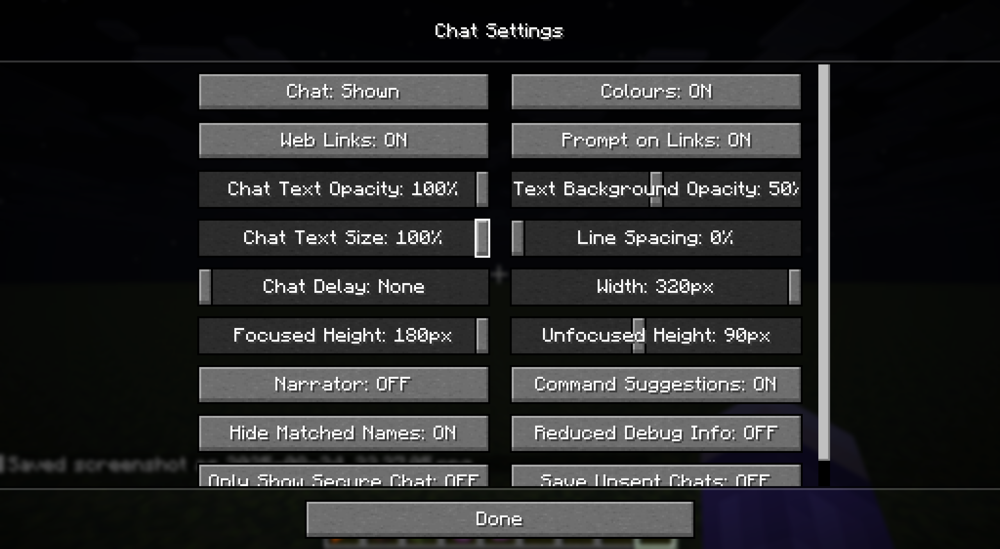
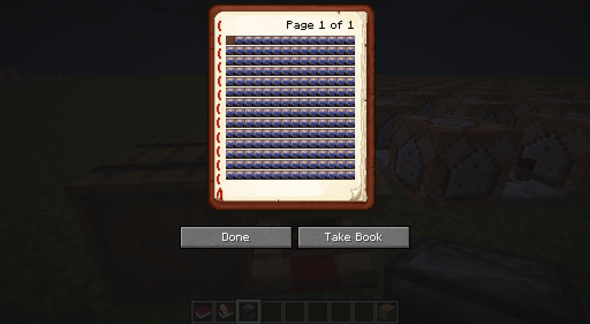
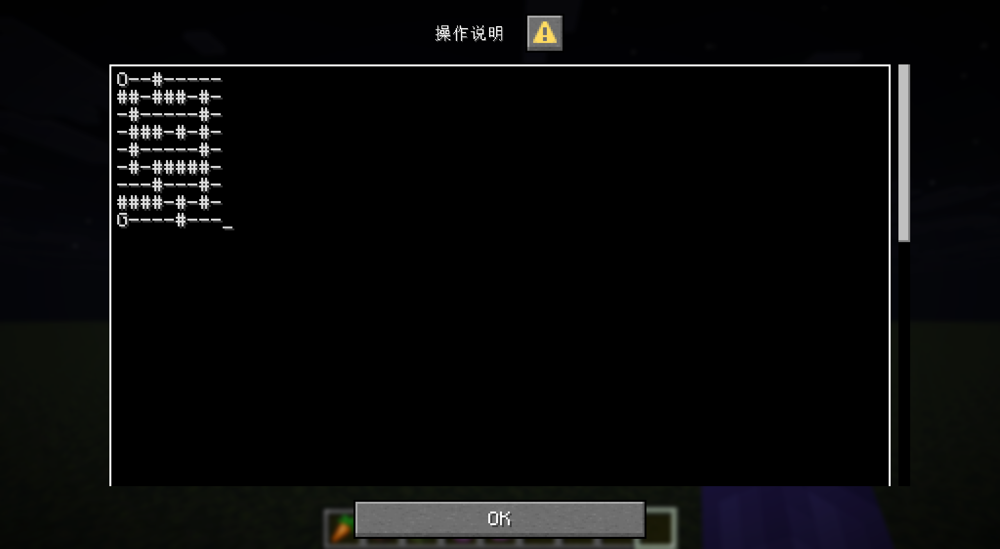
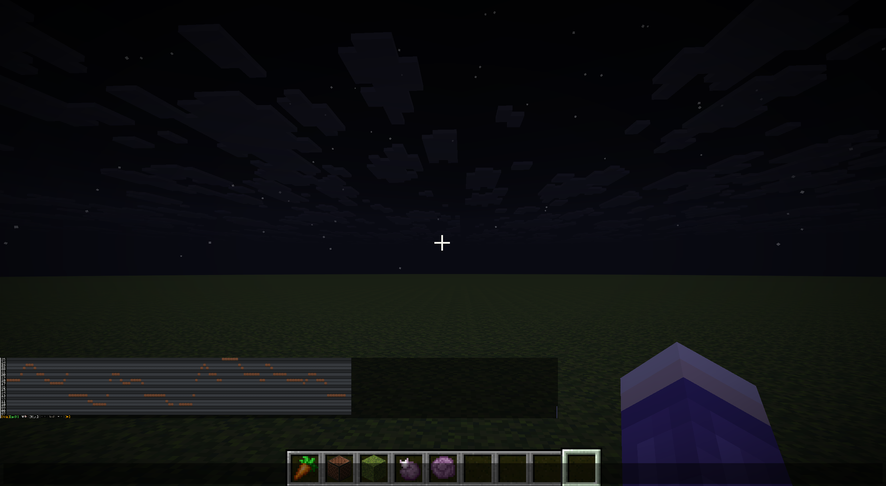
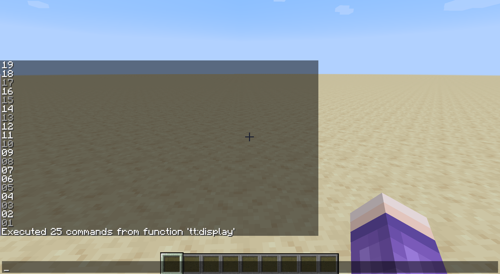
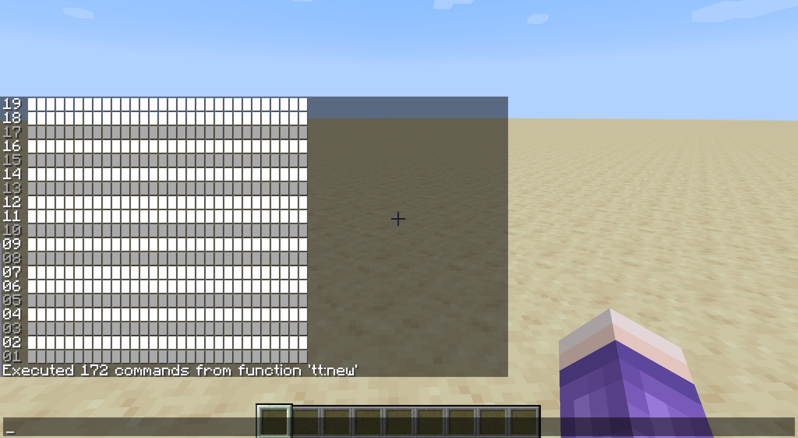
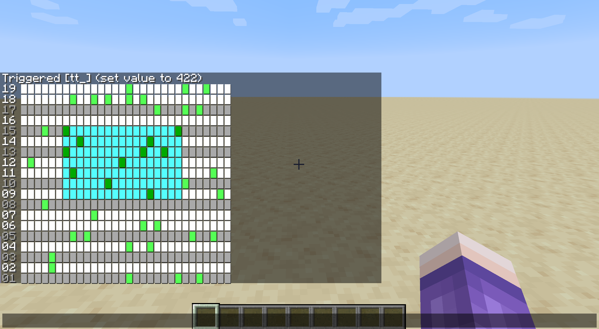

<FeatureHead
    title = '聊天栏卷轴式用户界面：历史背景与代码实现'
    authorName = 皮革剑
    avatarUrl = '../../_authors/皮革剑.jpg'
    :socialLinks="[
        { name: 'BiliBili', url: 'https://space.bilibili.com/2127740148' },
        { name: 'Github', url: 'https://github.com/LeatherSword/' }
    ]"
    cover='../_assets/5.png'
/>

## 摘要

文章从命令史角度出发介绍了一种最早于1.15版本即可实现的用户交互界面————聊天栏卷轴式用户界面，并通过一个示例展示了其原理。

## 一、聊天栏的基础特点
### 1.1 聊天栏概况
聊天栏是游戏**Minecraft: Java Edition**（以下简称游戏）中玩家界面的重要组成部分，键入状态下其通常可以占据玩家界面的约一半空间，且在其中显示的所有文字都能够附加点击事件，因此其可以成为数据包重要的自定义输入模块。

25w32a快照为文字组件添加了精灵图组件，使得聊天栏在**无资源包参与**的情况下也能够显示方块、物品、GUI按钮等纹理，进一步扩充了聊天栏能够显示的内容类型。（有资源包参与的情况下则最早在1.5版本就可以通过更改字体的方式实现。）
### 1.2 聊天栏的相关设置


默认设置下聊天栏的宽度（也是聊天栏在设置中的最大宽度）为320px，即可以连续输入**最多160个字符i（字符宽度1px+字符间隔1px）或者40个精灵图（宽度固定为8px且没有间隔）而不会触发自动换行**。聊天栏的一行默认行高为9px（8px+1px阴影，与选用的字体无关）。聊天栏的整体高度分为“聚焦高度”与“淡化高度”两种，分别对应输入状态与非输入状态的聊天栏显示，默认值分别为180px（20行）和90px（10行），最大可设置值为180px。由于非输入状态下光标锁定在屏幕中央，通常无法进行点击屏幕的输入，如无特殊标注，下文所述“高度”均为聚焦高度。

聊天栏还可以设置字符大小与行距，字符大小默认为100%，可以进行缩小；行距默认为0%（0px），最大100%（9px，即1行占据2行高度），实际显示中行距只能为整数px值，但**不是对产生的行距取整，而是对可能产生对应行距的边界百分比做了四舍五入取整**。因此行距百分比值分别为0~10、11~21、22~32、33~43、44~54、55~66、67~77、78~89、90~99、100时显示行距分别为0~9px，对应行高分别为9~18px。即行距设置为10%以下与设置为0%效果一致，但设置为11%却会使行距+1px，尽管9*11%=99%<1。

::: 注意
尽管都以px为单位显示，游戏对于聊天栏宽度和高度的处理方式却是不同的：

聊天栏的显示宽度始终对应**100%字符大小**下的像素宽度，而显示高度则始终对应**当前字符大小**下的像素高度，除以当前行高并向下取整。

因此，如果调整字符大小为50%，则聊天栏在同一行内可以显示2倍的内容，即320个字符i或80个精灵图，但仍然在0%行距时只显示20行内容，在11%行距时仅显示18行内容，即**行数表现始终与100%高度时一致**。
:::
如无特殊标注，以下所有内容都基于默认设置的聊天栏完成。
### 1.3 聊天栏与数据包可修改的其他UI界面的比较
#### 1.3.1 成书


成书是游戏中除聊天栏外少有的**能完整执行文本组件所有功能**的UI界面。实测其最多能够支持每页14行、每行放置57个字母i或14个精灵图，且文本也支持点击事件。

其相比聊天栏有一些优点：界面居中且有固定颜色底纹，不易受外界背景干扰；互动过程不会向游戏日志产出大量无效内容；界面自带向前翻页与向后翻页按键，翻页后的界面仍然能保持稳定，且如果放置在讲台则翻页行为可以从讲台的方块实体中检测。

缺点除了界面较小、字体不可调节之外还有：若成书不放置在讲台上，则点击执行指令过后会立刻关闭界面，且由于玩家NBT无法修改，无法直接向界面增补内容。（可以使用/give，/item replace直接替换成书或使用/item modify替换成书的页面内容，但无法直接使用/data增补或刷新。）放置在讲台的成书则没有此问题，但这一行为必然对世界造成影响，因此其使用范围会受到一些限制。
#### 1.3.2 对话框


25w20a快照引入的对话框极大的简化了数据包的用户互动逻辑，使得大部分小规模输入操作可以直接使用对话框完成。通过将二维列表转为特定字符组成的换行字符串，还可以使用对话框中最大的输入方式——多行文本输入达成编辑二维列表的目的（虽然相比即时刷新的界面而言更像是在编辑配置文件，互动性不强）。

当然，由于对话框也支持点击事件，其也可用于实现与二维列表交互的UI界面。仅就二维列表交互一项而言，对话框的缺点主要在于其不支持文本解析，也就意味着必须占用指令数量（指令外负载）而非指令本身的能力（指令内负载）完成页面的刷新（或者说拷贝），在相同的MaxCommandChainLength下减少数据包在一刻内的可用指令额度。

## 二、聊天栏卷轴式用户界面介绍
默认设置下聊天栏在同一页面上可以显示20行、每行40个精灵图，这一数量甚至已经超过了制作一个高级扫雷游戏需要的可点击区域规模。尽管如此，仍然有一些项目可能要求在聊天栏上对**大于这一规模**的二维列表进行操作，如实现绘图、编曲功能或实现类似泰拉瑞亚的二维游戏等。

单纯减小聊天栏的字符大小并不是完美的方案。对于宽度为2560px的屏幕而言，字符大小小于25%时显示汉字就会出现缺损，小于19%时数字和字母也会难以辨认，分辨率更小的屏幕可能在更早的位置出现这一问题；并且，尽管字符大小在1%以上时点击事件仍然有效，但操作难度与串行概率会随字符缩小而大幅增加，有时甚至需要开启放大镜功能才能确定操作位置，由此会极大损失用户体验，甚至损害用户视力健康。即便如此，这种调整对于项目的收益有时也比较有限，因为许多此类项目可能要求一个相当宽的二维列表，甚至是一个**长宽可变的**二维列表。


使用20行以上的行高（即聊天栏历史记录）也不是很好的方案，因为这类项目通常要求操作后立即刷新页面，而刷新页面会将聊天栏位置重置，点击21行以上的位置需要反复上拉，造成操作不便。因此，在有限屏幕空间内操作大型二维列表对于一些大型项目而言有其重要意义。

基于此要求，我们借鉴其他同样在有限屏幕空间展示内容的窗口界面的思路，制作卷轴式用户界面。其基础逻辑与读者在浏览器上阅读本刊时的行为——上下滑动界面一致，通过**移动屏幕整体显示的内容而不是扩大屏幕**的方式使理论上无限的内容可以在有限的窗口中自然地连续展现。事实上，如前面所言，这一原理不仅在聊天栏可用，在1.3节提及的成书和对话框等其他UI界面中均可用。


这种滑动可以是纵向滑动（见于绝大部分手机与电脑上；游戏中的滑动界面基本均为纵向）、横向滑动（如上图，见于编曲、视频剪辑软件以及多数横版游戏中；不清楚是否有人记得，Windows 8系列开始界面与许多应用的滑动界面均为横向滑动），以及二者皆有（如Microsoft Excel或画图等软件）。以上三种又可通过是否有一个恒定的宽度为依据分为变长定宽界面（前两种）与变长变宽界面（第三种）。

## 三、相关命令史背景与历史意义
1.13版本快照17w45b正式加入/data指令，但当时的/data指令只是原/blockdata与/entitydata指令的直接合并，还未引进定点修改的modify子命令。

1.14版本快照18w43a引入了/data modify子命令，使得数据包可以开始对NBT数据中的列表进行更为细致的操作，但该子命令提供的可以作用于列表的操作仅有set（替换）、append（在最后一项追加）、prepend（在第一项追加）、insert（定点插入）以及定点修改与删除功能（以上所有定点操作的下标均只能硬编码，无法使用变量），没有直接提供列表列表的随机读写功能。尽管如此，这一新增功能已经为卷轴式操作的用户界面奠定了非常重要的基础。

同样是这个版本的另一项重要修改是文本组件解析功能的加入，这使得数据包可以通过/tellraw和/title指令直接显示以JSON字符串形式存放的文本等内容。也就是说，**18w43a版本已经提供了构建卷轴式用户界面所需的所有指令基础及灵感**。

1.15版本快照19w38a添加的命令存储（快照19w39a追加了对命令存储的文本解析）则大幅减少了用户界面的刷新速度，在此之前通常必须将需要编辑的列表存放在实体中再进行加载，刷新速度受到明显限制；使用命令存储后则可以在1游戏刻内完成刷新。

1.20.2版本快照23w31a加入了宏函数功能，从此开始可以直接使用变量对NBT列表进行随机读写，这意味着卷轴式的列表操作不再是刚需。

1.21.6版本加入了对话框功能，可以使用/dialog命令创建占据整个用户界面的操作界面，并可以通过多种方式完成与用户的互动；对话框中也可以创建带有点击事件的文字，使得操作空间更加宽广，可以不再受到聊天栏20行的高度限制。

尽管如此，作为2020年至2023年间几乎唯一能够直接在UI界面上完成二维列表互动的方式，卷轴式用户界面仍然值得发掘其历史意义，并且其思路在2023年之后的版本中对于可变规模二维列表的编辑问题其实同样适用。同时，由于对话框不会支持解析，聊天栏卷轴式图形用户界面在其目标需求方面仍然有其特殊优势。

## 四、卷轴式用户界面的实现基础
### 4.1 列表操作
由于用户界面直接与二维列表互动，我们先对数据包中操作列表的方式进行一些比较。

以下列举的三种方法时间复杂度分别为`O(n)`、`O(logn)`与`O(1)`，指令缓存复杂度为`O(1)`、`O(n)`以及`O(1)`，但第三种方法只能在23w31a之后的版本使用。

#### 4.1.1 卷轴式列表操作与随机读写
卷轴是一组特殊的列表操作，能够适应可变长度的列表，并以`O(n)`的时间复杂度完成随机读写或者正序/逆序遍历。以命令存储中的`test:test1`列表为例：
```mcfunction
data modify storage test: test1 append from storage test: test1[0]
data remove storage test: test1[0]
```
如上操作会将列表的第一个元素移动至列表的最后，即列表整体“前移”了一位。循环执行n次即可将列表中下标为n的元素移动至下标为0的位置，从而能够读取下标为n的元素。
```mcfunction
data modify storage test: test1 prepend from storage test: test1[-1]
data remove storage test: test1[-1]
```
如上操作则相反，会将列表的最后一个元素移动到第一位，即列表整体“后移”了一位。进行上一个操作后修改下标为0的元素，再将此操作循环n次即可实现修改列表中下标为n的元素。

该操作最为直接的应用是冒泡排序，也几乎是宏函数出现之前对于可变长度列表而言最为自然的排序方式：

函数1
```mcfunction
scoreboard players set i test 1
execute store result score tot test run data get storage test: test1
execute if score i test <= tot test run function 函数2
```
函数2
```mcfunction
scoreboard players set j test 1
execute if score j test < tot test run function 函数3
data modify storage test: test1 append from storage test: test1[0]
data remove storage test: test1[0]
scoreboard players add i test 1
execute if score i test <= tot test run function 函数2
```
函数3
```mcfunction
execute store result score t1 test run data get storage test: test1[0]
execute store result score t2 test run data get storage test: test1[1]
execute if score t1 test > t2 test run scoreboard players operation t1 test >< t2 test
execute store result storage test: test1[0] int 1 run scoreboard players get t1 test
execute store result storage test: test1[1] int 1 run scoreboard players get t2 test
data modify storage test: test1 append from storage test: test1[0]
data remove storage test: test1[0]
scoreboard players add j test 1
execute if score j test < tot test run function 函数3
```
运行函数1的结果是将`test:test1`列表中的所有元素从小到大排序，时间复杂度固定为`O(n^2)`。

#### 4.1.2 二分法随机读写
当列表长度确定时，可以对于对应长度的列表制作一组函数，以`O(logn)`的时间复杂度完成随机读写操作，但缺点是需要n-1个函数文件，其中一半的函数会硬编码该列表每一个位置的读写操作。而由于游戏会缓存函数文件，该方法可能会占用很大的缓存。

该方法可以与卷轴式操作配合使用，若将长度为m*n（m可变，n不可变）的列表变为二维列表，则可以在`O(mlogn)`的时间复杂度以及`O(n)`的指令缓存复杂度下完成读写。可以对m和n的大小进行一些权衡使得读写更加高效。

篇幅原因，这里不呈现二分法读写的示例。

#### 4.1.3 宏函数随机读写
这是23w31a版本引入宏函数的结果，可变长度列表现在可以用`O(1)`的时间复杂度与指令缓存复杂度完成读写，遍历复杂度仍为`O(n)`。

读写示例如下：

函数1
```mcfunction
execute store result storage test: _.i int 1 run scoreboard players get i test
function 函数2 with storage test: _
```
函数2
```mcfunction
$execute store result storage test: test1[$(i)] int 1 run scoreboard players get t1 test
```
运行函数1即可将计分板t1项目存入列表的第i位。
### 4.2 显示界面
卷轴式用户界面的精髓在于，无论二维数组的大小如何，显示在屏幕的元素个数是有限且明确的。因此显示操作的量虽然不小，但是可以完全以硬编码方式完成。

以下两种方法分别以硬编码与非硬编码的方式实现了可以点击的用户界面，其中非硬编码方法由于使用了宏函数而只能在23w31a版本后使用。
#### 4.2.1 硬编码方式
编写以下Python代码生成一个函数文件，函数将显示二维列表test:test1前20行前40列的内容，附带更新test_trigger触发计分板的点击事件。如果二维列表的组织顺序不同则交换第269位的i和j即可。
```python
(lambda width,height:open("文件名.mcfunction","w",encoding="utf-8").writelines('tellraw @s {"text":"","extra":[%s]}\n'%(",".join('{"storage":"test","nbt":"test1[%d][%d]","interpret":true,"click_event":{"action":"run_command","command":"trigger test_trigger set %d"}}'%(i,j,i*width+j) for j in range(width))) for i in range(height)))(40,20)
```
太快了没看清？以上代码与下面是基本等价的。
```python
width=40
height=20
with open("文件名.mcfunction","w",encoding="utf-8") as f:
    for i in range(height):
        f.write('tellraw @s [{{"text":""}}')
        for j in range(width):
            f.write(f',{{"storage":"test","nbt":"test1[{i}][{j}]","interpret":true,"click_event":{{"action":"run_command","command":"trigger test_trigger set {i*width+j}"}}}}')
        f.write(']\n')
```
#### 4.2.2 非硬编码方式
这一方式只能在23w31a版本之后使用，作用与上一种方法类似，但不同的是，这一次无需修改数据包即可更改显示的行数与列数。函数1只需要（在行数与列数变更后）运行一次，之后每次需要显示时调用函数4即可。

函数1
```mcfunction
data modify storage test: screen set value []
scoreboard players set i test 0
scoreboard players set k test 0
execute store result storage test: _.i int 1 run scoreboard players get i test
execute if score i test < height test run function 函数2
```
函数2
```mcfunction
data modify storage test: screen append value {text:"\n"}
scoreboard players set j test 0
execute store result storage test: _.j int 1 run scoreboard players get j test
execute store result storage test: _.k int 1 run scoreboard players get k test
execute if score j test < width test run function 函数3 with storage test: _
scoreboard players add i test 1
execute store result storage test: _.i int 1 run scoreboard players get i test
execute if score i test < height test run function 函数2
```
函数3
```mcfunction
$data modify storage test: screen[-1].extra append value {storage:"test:",nbt:"test1[$(i)][$(j)]",click_event:{action:run_command,command:"trigger test_trigger set $(k)"}}
scoreboard players add j test 1
scoreboard players add k test 1
execute store result storage test: _.j int 1 run scoreboard players get j test
execute store result storage test: _.k int 1 run scoreboard players get k test
execute if score j test < width test run function 函数3 with storage test: _
```
函数4
```mcfunction
tellraw @s {storage:"test:",nbt:"screen",interpret:true}
```
## 五、变长定宽卷轴式用户界面的完整实现：以编曲工具为例
这一章将分为6节，以一个实际需求：“简易编曲工具”的完整实现为例，展示变长定宽卷轴式用户界面如何用于制作有实际意义的项目。

在此之前，我们明确这一需求的具体要求如下：

**开发使用游戏版本为19w39a之后、23w31a之前的版本（即可以使用命令存储，但不能使用宏函数），实际使用19w39a，即这样开发的数据包将在1.15及以上的版本中可用。**
::: tip 提示
这一版本选择是刻意为之。使用23w31a之后的宏函数会减少一定操作量，但宏函数出现之前的版本更能凸显这一用户界面实现的历史意义。
:::
项目命名空间为tt。
::: warning 注意
仅出于方便书写及不关联至任何实际作品需要。实际项目不应使用如此简略的命名空间。
:::
笔者的代码风格中会以下划线数量区分循环层次，如有使用其他代码风格的读者请特别注意这一点。

由于游戏中音符盒的可调节音高为2个8度（25个不同音高），我们将在这个数据包中实现一个行数为25、列数可变的卷轴式用户界面，并将每一行硬编码对应到音符盒乐器harp的每一个音高。

由于行数25小于int类型的最大二进制位数，我们可以直接将该界面处理的二维列表保存至一个一维int类型数组中，以在不编辑某个音乐片段时节省一定空间。

该用户界面将实现以下功能：从一维int数组中加载、保存至一维int数组、片段前后移动、片段上下移动、单点编辑（单音预览）、矩形区域选择、矩形区域覆盖/反转/删除、矩形区域复制粘贴/移动、添加列、删除列、整体预览。
### 5.1 前期准备
#### 5.1.1 素材准备
项目中将会准备如下四种界面素材，但不准备提供其他操作按钮的素材，请想要实现的读者自行整理，实际应用中可以选用25w32a以后的精灵图形式显示。

本次使用的界面素材为字符\u258b（▋），在游戏中显示时占用6px宽度（5px自宽+1px间隔），在前缀2位数字序号的情况下可以在1行中显示50个。用户界面的几乎全部空间都会由该素材构成。

界面素材与一个数值项value置于同一复合标签中，方便其他函数读取对应位置的状态。
::: warning 注意
在25w02a版本之前SNBT并不与JSON兼容，需要解析的JSON内容只能通过字符串形式传递，因而此处素材均为字符串形式。尝试在25w02a之后实现的读者可以直接将素材以SNBT格式存储。
:::
函数 tt:init/resource （添加到minecraft:load标签）
```mcfunction
data modify storage tt:res inactive set value {display:'{"text":"\\u258b"}',value:0b}
data modify storage tt:res inactive_selected set value {display:'{"text":"\\u258b","color":"aqua"}',value:0b}
data modify storage tt:res active set value {display:'{"text":"\\u258b","color":"green"}',value:1b}
data modify storage tt:res active_selected set value {display:'{"text":"\\u258b","color":"dark_green"}',value:1b}
```
#### 5.1.2 计分板准备
本项目将使用1个变量计分板和1个触发计分板。
函数 tt:init/_ （添加到minecraft:load标签）
```mcfunction
scoreboard objectives add tt dummy
scoreboard objectives add tt_ trigger
```
#### 5.1.3 操作界面准备
本项目的点击操作界面使用4.2.1硬编码方式生成，所以需要一个Python代码帮助完成。

由于确定的行数25略大于聊天栏可用行数（20，但由于原项目需要占用一行作为操作栏所以只有19），相较于使用卷轴方式竖向移动而言，直接硬编码25行屏幕空间再根据位置隐藏对应列显然开销更小。因此我们将使用一项计分板变量pos_y（范围为0~6）指定显示位置，值为0时显示1~19行，值为6时显示7~25行。

同时我们还将在每行的开头显示行编号，并且根据行编号选择显示颜色，以达到区别显示黑键白键的目的。界面在行编号之后将显示50列内容。

为尽量贴近编曲工具的习惯排布，我们按照由编号高到低的顺序显示这些行。

另外，由于操作界面只有横向滚动，存储界面数据时我们将采取先列后行的方式，即`screen[j][i]`代表第i行第j列，以方便进行卷轴滚动操作。

Python代码如下（放置在数据包根目录下）：
::: warning 注意
由于点击事件的写法变更，该部分无法不经修改直接适用于25w02a以上版本。
:::
```python
open("data/tt/functions/display.mcfunction","w",encoding="utf-8").writelines('\nexecute if score pos_y tt matches %d..%d run tellraw @s {"text":"%02d ","color":"%s","extra":[%s]}'%(max(i-18,0),min(i,6),i+1,["white","gray"][[1,0,1,0,1,0,0,1,0,1,0,0,1,0,1,0,1,0,0,1,0,1,0,0,1][i]],",".join('{"storage":"tt:","nbt":"screen[%d][%d].display","interpret":true,"clickEvent":{"action":"run_command","value":"/trigger tt_ set %d"}}'%(j,i,i*50+j) for j in range(50))) for i in range(24,-1,-1))
```
完成这一步准备之后可以进行确认：在计分板tt设置pos_y为0，运行函数tt:display，若出现以下界面说明操作界面准备完成：

#### 5.1.4 其他准备
将一些重要的运算用常数以及界面长宽等信息提前存入变量计分板（注意：这些变量的值无法影响硬编码内容）；另外制作一份空列备用。

函数 tt:init/other （添加到minecraft:load标签）
```mcfunction
scoreboard players set height tt 25
scoreboard players set screen_height tt 19
scoreboard players set screen_width tt 50
scoreboard players set preview_notelen tt 6
scoreboard players set 2 tt 2
scoreboard players set -1 tt -1
scoreboard players set 1 tt 1
scoreboard players set 0 tt 0
data modify storage tt: empty_column set value []
data modify storage tt: empty_column append from storage tt:res inactive 
# 请将上一条重复25遍。
```
### 5.2 加载、阅览与保存
#### 5.2.1 移动列
这项功能堪称整个卷轴式界面最为核心的功能。实现与前文所述一致。

我们将使用计分板项pos_x跟踪卷轴的“位置”（也就是现在在第0位的元素是列表的第几位），使用计分板项clip_length跟踪片段长度。

为了确定移动的列数，我们使用计分板项target_x确定目标位置（由其他函数修改，相当于给定参数），比较后进行循环移动操作。
::: tip
由于卷轴移动会导致一些已经存储的坐标移动（参考刻舟求剑），我们将相对应的重新计算以下坐标（在后面的功能中会使用到）：
最小/最大可修改x坐标（min_edit_x与max_edit_x，可以有负数），已选择位置1、2的x坐标（selected_pos_x1与selected_pos_x2）。

由于其他功能可能需要临时性移动卷轴但不希望坐标变更，我们将同时提供一个临时使用的版本，只要保证对应功能执行结束前后pos_x不变即可。
:::
函数 tt:move/_
```mcfunction
scoreboard players operation tmp tt = target_x tt
scoreboard players operation tmp tt -= pos_x tt
scoreboard players operation min_edit_x tt -= tmp tt
scoreboard players operation max_edit_x tt -= tmp tt
scoreboard players operation selected_pos_x1 tt -= tmp tt
scoreboard players operation selected_pos_x2 tt -= tmp tt
execute if score pos_x tt < target_x tt run function tt:move/forward
execute if score pos_x tt > target_x tt run function tt:move/backward
```
函数 tt:move/temp
```mcfunction
execute if score pos_x tt < target_x tt run function tt:move/forward
execute if score pos_x tt > target_x tt run function tt:move/backward
```
函数 tt:move/forward
```mcfunction
data modify storage tt: screen append from storage tt: screen[0]
data remove storage tt: screen[0]
scoreboard players add pos_x tt 1
execute if score pos_x tt < target_x tt run function tt:move/forward
```
函数 tt:move/backward
```mcfunction
data modify storage tt: screen prepend from storage tt: screen[-1]
data remove storage tt: screen[-1]
scoreboard players remove pos_x tt 1
execute if score pos_x tt > target_x tt run function tt:move/backward
```
#### 5.2.2 添加列/删除列
该功能同时也将承担加载新建片段的功能。

为了确定添加的列数，我们使用计分板项target_length确定目标片段长度，比较后进行循环增/删列操作。
增删操作不会更改已有的坐标，但由于片段长度改变，最大可修改x坐标及最大x坐标将变更。

由于列表末尾元素并非实际末尾，此处将移动片段使pos_x为0再在增删完成后回移。相关变更将在移动后进行。
::: tip 提示
尝试在23w31a以后版本实现的读者可以直接在前述最大可修改x坐标处定点编辑而不需移动片段。
:::
函数 tt:modify/_
```mcfunction
scoreboard players operation tmp_prev_pos_x tt = pos_x tt
scoreboard players set target_x tt 0
function tt:move/_
scoreboard players operation max_edit_x tt = target_length tt
execute if score clip_length tt < target_length tt run function tt:modify/add
execute if score clip_length tt > target_length tt run function tt:modify/remove
scoreboard players operation target_x tt = tmp_prev_pos_x tt
function tt:move/_
```
函数 tt:modify/add
```mcfunction
data modify storage tt: screen append from storage tt: empty_column
scoreboard players add clip_length tt 1
execute if score clip_length tt < target_length tt run function tt:modify/add
```
函数 tt:modify/remove
```mcfunction
data remove storage tt: screen[-1]
scoreboard players remove clip_length tt 1
execute if score clip_length tt > target_length tt run function tt:modify/remove
```
#### 5.2.3 新建片段
该功能将按照长度为0初始化整个片段后使用5.2.2“添加列”功能添加target_length个初始列。此处不为新建片段的过程制作UI界面，有需要的读者可以使用对话框等方式自行搭建。

函数 tt:new
```mcfunction
scoreboard players set min_edit_x tt 0
scoreboard players set min_pos_x tt 0
scoreboard players set max_pos_x tt 0
scoreboard players set pos_y tt 0
scoreboard players set clip_length tt 0
scoreboard players set mode tt 1
data modify storage tt: screen set value []
function tt:modify/_
function tt:display
```
完成这一步后可以进行确认：在计分板tt设置target_length为30，运行函数tt:new，出现如下界面说明前两步均正确进行：

#### 5.2.4 从int数组加载片段
该功能将从固定位置（tt:clip）的int数组加载整个页面并完成初始化。int数组以二进制形式存放片段的音符位置，总共占用25个二进制位。

有需要的读者可以另外实现多片段管理与切换功能。

函数 tt:load/_
```mcfunction
scoreboard players set min_edit_x tt 0
scoreboard players set min_pos_x tt 0
scoreboard players set pos_y tt 0
scoreboard players set clip_length tt 0
execute store result score target_length tt run data get storage tt: clip
scoreboard players operation max_edit_x tt = target_length tt
scoreboard players operation max_pos_x tt = target_length tt
scoreboard players operation max_pos_x tt -= screen_width tt
scoreboard players operation max_pos_x tt > 0 tt
data modify storage tt: screen set value []
scoreboard players set clip_length tt 0
execute if score clip_length tt < target_length tt run function tt:load/__
```
函数 tt:load/__
```mcfunction
data modify storage tt: screen append value []
execute store result score note_tmp0 tt run data get storage tt: clip[0]
scoreboard players set i tt 1
execute if score i tt <= height tt run function tt:load/___
data modify storage tt: clip append from storage tt: clip[0]
data remove storage tt: clip[0]
scoreboard players add clip_length tt 1
execute if score clip_length tt < target_length tt run function tt:load/__
```
函数 tt:load/___
```mcfunction
scoreboard players operation note_tmp1 tt = note_tmp0 tt
scoreboard players operation note_tmp0 tt /= 2 tt
scoreboard players operation note_tmp1 tt %= 2 tt
execute if score note_tmp1 tt matches 1 run data modify storage tt: screen[-1] append from storage tt:res active
execute if score note_tmp1 tt matches 0 run data modify storage tt: screen[-1] append from storage tt:res inactive
scoreboard players add i tt 1
execute if score i tt <= height tt run function tt:load/___
```
#### 5.2.5 将片段存储至int数组
该功能与5.2.4相反，将片段存储至int数组中。不会破坏片段本身或改变任何坐标。实现中在两级循环过程中都使用了卷轴法完成数组遍历。

由于第二级循环的长度恒定且不大，读者也可采用重复硬编码方式完成读取存储。

函数 tt:save/_
```mcfunction
data modify storage tt: clip set value []
scoreboard players operation tmp_prev_pos_x tt = pos_x tt
scoreboard players set target_x tt 0
function tt:move/_
scoreboard players set i tt 0
execute if score i tt < clip_length tt run function tt:save/__
scoreboard players operation target_x tt = tmp_prev_pos_x tt
function tt:move/_
```
函数 tt:save/__
```mcfunction
scoreboard players set note_tmp0 tt 0
scoreboard players set j tt 1
execute if score j tt <= height tt run function tt:save/___
data modify storage tt: clip append value 0
execute store result storage tt: clip[-1] int 1 run scoreboard players get note_tmp0 tt
data modify storage tt: screen append from storage tt: screen[0]
data remove storage tt: screen[0]
scoreboard players add i tt 1
execute if score i tt < clip_length tt run function tt:save/__
```
函数 tt:save/___
```mcfunction
execute store result score note_tmp1 tt run data get storage tt: screen[0][0].value
scoreboard players operation note_tmp0 tt *= 2 tt
scoreboard players operation note_tmp0 tt += note_tmp1 tt
data modify storage tt: screen[0] append from storage tt: screen[0][0]
data remove storage tt: screen[0][0]
scoreboard players add j tt 1
execute if score j tt <= height tt run function tt:save/___
```
### 5.3 处理用户输入
处理部分将会每刻循环执行，对来自触发计分板的值进行处理并交给特定函数实现对应功能。完成处理后将触发计分板重置为特定值。（注意触发计分板在enable后会自动设为0，reset会自动禁用触发计分板。）该函数也同时承担每刻触发5.4部分函数的任务。代码如下：

函数 tt:tick/action （添加到minecraft:tick标签）
```mcfunction
execute as @a[scores={tt_=0..}] run function tt:tick/_
execute as @a[tag=tt_on_preview] run function tt:preview/_
scoreboard players enable @a tt_
scoreboard players set @a tt_ -3000
```
如本章概述中所述，项目中同时存在单点编辑、矩形区域选择两种基本操作方式，矩形区域选择还将会有多次不同意义的点击事件，如果不对这些编辑方式进行区分就会发生冲突。

因此，我们引入一个变量“模式”（mode），用以在不同状况下调用不同类型的函数。模式列表如下：

插入模式：单点编辑，mode=1。

选择模式：矩形选择，未选择任何点时mode=2，选择1个点时mode=3，选择2个点时mode=4。

对应切换关系如以下~~确定的有限自动机~~示意图所示：


所有模式的界面点击都对应大于等于0的触发数值，而对操作栏的点击都对应小于0的触发数值。出于自定义程度考虑，本章不会实现操作栏按钮，有兴趣的读者可以在此处自行补充相关逻辑。
::: warning 注意
由于自动的模式切换可能导致错误的提前触发（如在模式2选择1个点后切换至模式3导致该点的坐标被模式3的执行函数错误处理），我们以触发计分板是否重置作为判断用户输入已经执行的依据，因此每一次进入都将进行一次触发计分板的判断。尝试在23w31a版本后实现的读者可以使用return run代替这一操作。
:::
函数 tt:tick/_
```mcfunction
execute if score @s tt_ matches 0.. run function tt:tick/resolve
execute if score @s tt_ matches 0.. if score mode tt matches 1 run function tt:insert/_
execute if score @s tt_ matches 0.. if score mode tt matches 2 run function tt:select_0/_
execute if score @s tt_ matches 0.. if score mode tt matches 3 run function tt:select_1/_
execute if score @s tt_ matches 0.. if score mode tt matches 4 run function tt:select_2/_
```
这一步完成后可以进行初步测试：多次点击屏幕，若弹出的提示均为已改变计分板（而不是红色的“未被允许”提示）则循环部分基本正确。
#### 5.3.1 获取点击坐标
点击坐标的获取与显示部分的click_event写法关联很大。

在25w20a版本前，需要更高权限的click_event不会弹窗提醒，因而此前可以直接在click_event里写带参函数调用直接传递点击位置的x坐标与y坐标，尽管这样做会直接使得只有管理员可以操作。（对于23w31a之前的版本则需要为每一个可点击位置硬编码一个函数，可以使用程序批量生成）

但无论是面对更广泛的使用人群还是更新的版本要求，使用触发器是更为方便的选择，尽管这就意味着一次点击只能传递1个数，且必须有一个函数一直循环检查触发计分板的内容。

由于坐标信息需要2个数，我们需要一种方式把2个数放进1个数中，而放置时的顺序会决定读取的顺序。不过这其实不是什么问题，因为显示的项目数量始终有限，行数和列数其实都在可控范围内。

参考5.1.3中的click_event写法，数字i*width+j对应第i行第j列也即screen[j][i]的内容，则我们将使用以下函数读取为“第y行第x列”：

函数 tt:tick/resolve
```mcfunction
scoreboard players operation click_y tt = @s tt_
scoreboard players operation click_y tt /= screen_width tt
scoreboard players operation click_x tt = @s tt_
scoreboard players operation click_x tt %= screen_width tt
```
#### 5.3.2 单点编辑（预览）
这一功能的要求为：切换点击对应位置的显示状态（未激活变为激活，反之亦然），刷新界面，并播放对应行的乐器声音。因此我们需要进行定点编辑。

由于单点编辑的范围限定在屏幕空间内，3.1的三种定点编辑方式都可以使用，我们将在此使用4.1.1卷轴法，有兴趣的读者可以尝试其他方式。

函数 tt:insert/_
```mcfunction
scoreboard players operation target_x tt += click_x tt
function tt:move/_
scoreboard players set i tt 0
execute if score i tt < height tt run function tt:insert/__
scoreboard players operation target_x tt -= click_x tt
function tt:move/_
function tt:insert/preview
function tt:display
scoreboard players set @s tt_ -3000
```
函数 tt:insert/__
```mcfunction
execute if score i tt = click_y tt run function tt:insert/modify
data modify storage tt: screen[0] append from storage tt: screen[0][0]
data remove storage tt: screen[0][0]
scoreboard players add i tt 1
execute if score i tt < height tt run function tt:insert/__
```
函数 tt:insert/modify
```mcfunction
execute store result score note_tmp1 tt run data get storage tt: screen[0][0].value
execute if score note_tmp1 tt matches 1 run data modify storage tt: screen[0][0] set from storage tt:res inactive
execute if score note_tmp1 tt matches 0 run data modify storage tt: screen[0][0] set from storage tt:res active
```
预览功能也将以硬编码方式进行。Python代码如下（放置在数据包根目录）：
```python
open("data/tt/functions/insert/preview.mcfunction",'w',encoding="utf-8").write('\n'.join(f'execute if score click_y tt matches {i} run playsound block.note_block.harp record @s ~ ~ ~ 1 {pow(2,-1.0+i/12):.6f}' for i in range(25)))
```
完成这一步编写后可以点击屏幕进行测试：若改变颜色的格子位置与点击位置一致，且播放了正确音高的声音事件，说明编写正确。若不一致，请观察改变颜色位置是否与点击位置关于y=x对称，如是，则处理部分在某一位置写反了行与列的标记。
#### 5.3.3 矩形区域选择
这一功能的要求为：点击屏幕上的两个位置，选择由这两个位置决定的一个矩形范围。选择完成后将矩形范围高亮并刷新界面。
::: tip 注意
由于对两个位置的点击之间以及输入第三次操作前可能存在卷轴移动操作，前两个坐标可能会有变更，该变更已由5.2.1部分代为处理。
:::
函数 tt:select_0/_
```mcfunction
scoreboard players operation selected_pos_y1 tt = click_y tt
scoreboard players operation selected_pos_x1 tt = click_x tt
function tt:display
scoreboard players set mode tt 3
scoreboard players set @s tt_ -3000
```
处理第二个坐标时，为了之后方便处理，将顺序调整为x1<=x2,y1<=y2，并将可能的逆序情况使用标签进行标记。

高亮过程仍然使用卷轴法完成。
:::warning 注意
由于5.2.1部分“正常版本”的横向卷轴移动函数（tt:move/_）会改变存储的坐标位置，此处请务必使用“临时变更”版本的函数（tt:move/temp）。使用宏函数法进行实现的读者可忽略此项。
:::

函数 tt:select_1/_
```mcfunction
scoreboard players operation selected_pos_y2 tt = click_y tt
scoreboard players operation selected_pos_x2 tt = click_x tt
tag @s remove tt_select_x_left
execute if score selected_pos_x1 tt > selected_pos_x2 tt run tag @s add tt_select_x_left
execute if score selected_pos_x1 tt > selected_pos_x2 tt run scoreboard players operation selected_pos_x1 tt >< selected_pos_x2 tt
tag @s remove tt_select_y_down
execute if score selected_pos_y1 tt > selected_pos_y2 tt run tag @s add tt_select_y_down
execute if score selected_pos_y1 tt > selected_pos_y2 tt run scoreboard players operation selected_pos_y1 tt >< selected_pos_y2 tt
scoreboard players operation target_x tt += selected_pos_x1 tt
function tt:move/temp
scoreboard players operation i tt = selected_pos_x1 tt
execute if score i tt <= selected_pos_x2 tt run function tt:select_1/__
scoreboard players operation target_x tt -= selected_pos_x2 tt
scoreboard players remove target_x tt 1
function tt:move/temp
function tt:display
scoreboard players set mode tt 4
scoreboard players set @s tt_ -3000
```
函数 tt:select_1/__
```mcfunction
scoreboard players set j tt 0
execute if score j tt < height tt run function tt:select_1/___
scoreboard players add target_x tt 1
function tt:move/temp
scoreboard players add i tt 1
execute if score i tt <= selected_pos_x2 tt run function tt:select_1/__
```
函数 tt:select_1/___
```mcfunction
execute if score j tt >= selected_pos_y1 tt if score j tt <= selected_pos_y2 tt run function tt:select_1/modify
data modify storage tt: screen[0] append from storage tt: screen[0][0]
data remove storage tt: screen[0][0]
scoreboard players add j tt 1
execute if score j tt < height tt run function tt:select_1/___
```
函数 tt:select_1/modify
```mcfunction
execute store result score note_tmp1 tt run data get storage tt: screen[0][0].value
execute if score note_tmp1 tt matches 1 run data modify storage tt: screen[0][0] set from storage tt:res active_selected
execute if score note_tmp1 tt matches 0 run data modify storage tt: screen[0][0] set from storage tt:res inactive_selected
```
完成这一步后可以设置mode=2尝试选择一个矩形区域，若对应区域被正确高亮，说明编写正确。

#### 5.3.4 选择后的下一步操作
选择矩形框后的操作分别有：取消选择、覆盖（全设为激活）、反转、删除（全设为未激活）、粘贴、移动。
注意这些操作的共性：所有操作均要求对原位置进行变更（即使是取消选择也需要），而粘贴和移动还需要对由第三次点击确定的目标位置进行变更。

所以我们将把这些操作统一划分为两个循环部分：源（source）与目标（target）。源部分将按照特定方式遍历所有已选择区域执行替换并（如有需要）写入至剪贴板；目标部分则会从剪贴板读取内容进行写入。

对于粘贴与移动逻辑，我们特别设置其为粘贴至从第三次点击坐标开始，由第一次点击坐标向第二次点击坐标方向形成的矩形，以使操作更为自然。

源部分代码如下：

函数 tt:select_2/source/_
```mcfunction
execute as @s[tag=tt_to_copy] run data modify storage tt: clipboard set value []
scoreboard players operation target_x tt += selected_pos_x1 tt
function tt:move/temp
scoreboard players operation i tt = selected_pos_x1 tt
execute if score i tt <= selected_pos_x2 tt run function tt:select_2/source/__
scoreboard players operation target_x tt -= selected_pos_x2 tt
scoreboard players remove target_x tt 1
function tt:move/temp
```
函数 tt:select_2/source/__
```mcfunction
execute as @s[tag=tt_to_copy] run data modify storage tt: clipboard append value [B;]
scoreboard players set j tt 0
execute if score j tt < height tt run function tt:select_2/source/___
scoreboard players add target_x tt 1
function tt:move/temp
scoreboard players add i tt 1
execute if score i tt <= selected_pos_x2 tt run function tt:select_2/source/__
```
函数 tt:select_2/source/___
```mcfunction
execute if score j tt >= selected_pos_y1 tt if score j tt <= selected_pos_y2 tt run function tt:select_2/source/modify
data modify storage tt: screen[0] append from storage tt: screen[0][0]
data remove storage tt: screen[0][0]
scoreboard players add j tt 1
execute if score j tt < height tt run function tt:select_2/source/___
```
函数 tt:select_2/source/modify
```mcfunction
execute store result score note_tmp1 tt run data get storage tt: screen[0][0].value
execute if score note_tmp1 tt matches 1 run data modify storage tt: screen[0][0] set from storage tt: select_source_active
execute if score note_tmp1 tt matches 0 run data modify storage tt: screen[0][0] set from storage tt: select_source_inactive
execute as @s[tag=tt_to_copy] run data modify storage tt: clipboard[-1] append from storage tt: screen[0][0].value
```
目标部分代码如下：

函数 tt:select_2/target/_
```mcfunction
scoreboard players operation selected_pos_y3 tt = click_y tt
scoreboard players operation selected_pos_x3 tt = click_x tt
scoreboard players operation selected_pos_y4 tt = click_y tt
scoreboard players operation selected_pos_x4 tt = click_x tt
execute as @s[tag=tt_select_x_left] run scoreboard players operation selected_pos_x3 tt -= selected_pos_x2 tt
execute as @s[tag=tt_select_x_left] run scoreboard players operation selected_pos_x3 tt += selected_pos_x1 tt
execute as @s[tag=!tt_select_x_left] run scoreboard players operation selected_pos_x4 tt += selected_pos_x2 tt
execute as @s[tag=!tt_select_x_left] run scoreboard players operation selected_pos_x4 tt -= selected_pos_x1 tt
execute as @s[tag=tt_select_y_down] run scoreboard players operation selected_pos_y3 tt -= selected_pos_y2 tt
execute as @s[tag=tt_select_y_down] run scoreboard players operation selected_pos_y3 tt += selected_pos_y1 tt
execute as @s[tag=!tt_select_y_down] run scoreboard players operation selected_pos_y4 tt += selected_pos_y2 tt
execute as @s[tag=!tt_select_y_down] run scoreboard players operation selected_pos_y4 tt -= selected_pos_y1 tt
scoreboard players operation target_x tt += selected_pos_x3 tt
function tt:move/temp
scoreboard players operation i tt = selected_pos_x3 tt
execute if score i tt <= selected_pos_x4 tt run function tt:select_2/target/__
scoreboard players operation target_x tt -= selected_pos_x4 tt
scoreboard players remove target_x tt 1
function tt:move/temp
```
函数 tt:select_2/target/__
```mcfunction
scoreboard players set j tt 0
execute if score j tt < height tt run function tt:select_2/target/___
data remove storage tt: clipboard[0]
scoreboard players add target_x tt 1
function tt:move/temp
scoreboard players add i tt 1
execute if score i tt <= selected_pos_x4 tt run function tt:select_2/target/__
```
函数 tt:select_2/target/___
```mcfunction
execute if score j tt >= selected_pos_y3 tt if score j tt <= selected_pos_y4 tt run function tt:select_2/target/modify
data modify storage tt: screen[0] append from storage tt: screen[0][0]
data remove storage tt: screen[0][0]
scoreboard players add j tt 1
execute if score j tt < height tt run function tt:select_2/target/___
```
函数 tt:select_2/target/modify
```mcfunction
execute store result score note_tmp1 tt run data get storage tt: clipboard[0][0]
data remove storage tt: clipboard[0][0]
execute if score note_tmp1 tt matches 1 run data modify storage tt: screen[0][0] set from storage tt:res active
execute if score note_tmp1 tt matches 0 run data modify storage tt: screen[0][0] set from storage tt:res inactive
```
各操作入口代码参见5.5.3。若此处内容难以理解可结合操作入口的函数内容进行理解。编写完成之后可以先写入操作入口函数，再尝试操作进行功能测试。

### 5.4 预览播放
预览播放部分将先进行保存，再对保存的内容进行播放。预览操作入口参见5.5.5节。

此处实现的是播放函数，将在每刻维护一个计时器，计时器结束后播放一个音符。该函数由5.3部分的函数在每刻激活。

函数 tt:preview/_
```mcfunction
execute store result score note_tmp0 tt run data get storage tt: preview_clip[0]
function tt:preview/play
scoreboard players add preview_tick tt 1
execute if score preview_tick tt >= preview_notelen tt run function tt:preview/next
```
函数 tt:preview/next
```mcfunction
scoreboard players operation preview_tick tt -= preview_notelen tt
execute unless data storage tt: preview_clip[0] run tag @s remove tt_on_preview
data remove storage tt: preview_clip[0]
```
生成函数 tt:preview/play 的Python代码如下：
```python
open("data/tt/functions/preview/play.mcfunction",'w',encoding="utf-8").write('\n'.join(f'scoreboard players operation note_tmp1 tt = note_tmp0 tt\nscoreboard players operation note_tmp0 tt /= 2 tt\nscoreboard players operation note_tmp1 tt %= 2 tt\nexecute if score note_tmp1 tt matches 1 run playsound block.note_block.harp record @s ~ ~ ~ 1 {pow(2,-1.0+i/12):.6f}' for i in range(25)))
```
### 5.5 操作栏
这是这一实现的最后一部分。操作栏集合了各类操作入口。笔者在此不做具体操作栏实现，但会列出所有操作栏入口代码，请读者自行配置各类按钮。参考入口函数如下，直接执行这些函数也将实现对应功能：
::: tip 提示
配置按钮时注意适时使用灰色按钮（与常规按钮形状一致但不带click_event）限制一些功能的可用范围（如不应允许超出片段长度的左右移动，因此判断位置到达左右边界时替换对应操作按钮为灰色按钮以限制移动范围），并隐藏一些只在特定模式下使用的按钮。
:::
#### 5.5.1 片段移动
函数 tt:bar/x_left
```mcfunction
scoreboard players remove target_x tt 1
function tt:move/_
function tt:display
scoreboard players set @s tt_ -3000
```
函数 tt:bar/x_right
```mcfunction
scoreboard players add target_x tt 1
function tt:move/_
function tt:display
scoreboard players set @s tt_ -3000
```
函数 tt:bar/y_up
```mcfunction
scoreboard players add pos_y tt 1
function tt:display
scoreboard players set @s tt_ -3000
```
函数 tt:bar/y_down
```mcfunction
scoreboard players remove pos_y tt 1
function tt:display
scoreboard players set @s tt_ -3000
```
#### 5.5.2 模式切换
函数 tt:bar/toggle_insert
```mcfunction
execute if score mode tt matches 4 run function tt:bar/cancel
scoreboard players set mode tt 1
function tt:display
scoreboard players set @s tt_ -3000
```
函数 tt:bar/toggle_select
```mcfunction
scoreboard players set mode tt 2
function tt:display
scoreboard players set @s tt_ -3000
```
#### 5.5.3 矩形选择后的操作
函数 tt:bar/toggle_copy
```mcfunction
tag @s remove tt_to_move
function tt:display
scoreboard players set @s tt_ -3000
```
函数 tt:bar/toggle_move
```mcfunction
tag @s add tt_to_move
function tt:display
scoreboard players set @s tt_ -3000
```
函数 tt:bar/fill
```mcfunction
data modify storage tt: select_source_active set from storage tt:res active
data modify storage tt: select_source_inactive set from storage tt:res active
function tt:select_2/source/_
function tt:bar/toggle_select
```
函数 tt:bar/invert
```mcfunction
data modify storage tt: select_source_active set from storage tt:res inactive
data modify storage tt: select_source_inactive set from storage tt:res active
function tt:select_2/source/_
function tt:bar/toggle_select
```
函数 tt:bar/delete
```mcfunction
data modify storage tt: select_source_active set from storage tt:res inactive
data modify storage tt: select_source_inactive set from storage tt:res inactive
function tt:select_2/source/_
function tt:bar/toggle_select
```
函数 tt:bar/cancel
```mcfunction
data modify storage tt: select_source_active set from storage tt:res active
data modify storage tt: select_source_inactive set from storage tt:res inactive
function tt:select_2/source/_
function tt:bar/toggle_select
```
#### 5.5.4 保存操作
函数 tt:bar/save
```mcfunction
function tt:save/_
function tt:display
scoreboard players set @s tt_ -3000
```
#### 5.5.5 预览操作
函数 tt:bar/preview_start
```mcfunction
function tt:save/_
data modify storage tt: preview_clip set from storage tt: clip
scoreboard players set preview_tick tt 0
tag @s add tt_on_preview
function tt:display
scoreboard players set @s tt_ -3000
```
函数 tt:bar/preview_pause
```mcfunction
tag @s remove tt_on_preview
function tt:display
scoreboard players set @s tt_ -3000
```
函数 tt:bar/preview_resume
```mcfunction
tag @s remove tt_on_preview
function tt:display
scoreboard players set @s tt_ -3000
```
## 六、变长变宽卷轴式用户界面简要介绍
本章将简要提及变长变宽卷轴式用户界面，不会给出变长变宽卷轴式用户界面的完整实现，但实现步骤与第四章差别不大。

变长变宽卷轴式用户界面的不同主要体现在其不仅在长度（横向数量）上可变，还在宽度（纵向数量）上可变。其除了横向移动外还会有纵向移动的需求。

其重要问题在于，无论选取行还是列作为列表的第一层级，总会有一侧列表需要许多次卷轴操作才能执行1次移动，当该界面的长宽都很大时单次操作耗时可能变得不可接受（若已知该规模不大可忽略本章之后所有内容）。

此时我们有必要回归卷轴式用户界面的核心思想：无论二维列表长宽，可以显示在屏幕上的内容始终是有限的。

由此我们可以有一种思路，即在限制移动操作速度的前提下减少不可见的移动操作。

设列表大小为`M*N`，屏幕大小为`m*n`，`M,N>>m,n`。设选取行作为第一层级，则1次操作执行1次纵向移动，M次操作执行1次横向移动，而这M次操作中有`M-m`次对用户界面是不可见的。

此时我们考虑为每一行存储一个卷轴位置，每次横向移动只执行其中可见的m次操作并更新y坐标，m的数值是可以接受的。

假设进行了t次横向移动，则通常情况下t的数值也不会非常大，此时进行一次纵向移动将对应进行t次操作的横向移动。该效率也基本可以接受。

如有可能，其他功能将参照这一思路进行优化。当然，我们需要承认这类用户界面仍然受到整体内存空间、指令执行等多种限制，不可能无限扩张，但相关思维仍有可能在实际的项目开发中受用。
## 七、有关聊天栏用户界面的一些其他细节
### 7.1 闪屏
当聊天栏用户界面使用触发器输入时，默认设置下会出现闪屏问题。

该问题的出现主要是由于`click_event`的命令执行会立刻发送反馈，而检测函数只能在每刻刷新界面。由于反馈内容通常只有1行，其会在短时间内将聊天栏所有信息上移1行，造成闪屏出现。

通常可以直接将游戏规则`SendCommandFeedback`（1.8版本加入）设为False来避免触发器自动发送消息，但这也会屏蔽其他指令的反馈，对调试十分不利。

另外还有一种较为巧妙的方式，可以在仍然允许指令反馈的前提下避免闪屏。该方式利用1.13-pre7版本更新的`/scoreboard objectives modify displayname`命令，在每次显示后将显示内容的前19行设置为触发器的名称（支持解析）。这样触发点击事件后会发送一个21行的触发反馈，在其显示在屏幕上的20行中有19行与界面原先显示的内容一致，这样就避免了闪屏问题。

### 7.2 日志堆积
由于聊天栏内容会在游戏日志同步，聊天栏用户界面刷新时不可避免地会出现日志堆积问题。不过这些日志产生于客户端，所以通常而言不会对游戏运行造成很大影响，只需关闭日志输出即可。

至于聊天栏本身的历史记录，通常只会保留100条，所以通常也不需要刻意清屏。
## 八、总结与展望
也许有人会有疑问：既然已经有了像对话框这样的直接交互方案，以及宏函数这样方便开发的特性，我们为什么还要回到6年前的1.15版本探讨旧版本的交互界面实现呢？

不可否认的是，对话框与宏函数特性确实十分方便开发，利用这些特性我可以方便地制作第五章项目的[完整版](https://www.planetminecraft.com/data-pack/popped-chorus-music-composition-tool-with-gui/)，还用上了最新的精灵图特性。然而，对于像我这样目睹过游戏从个位数版本（甚至测试版本）发展到现在的人而言，6年前甚至7年前的那个时代其实是十分值得怀念的。

当时数据包作为刚起步的新兴事物，从1.12版本原来为进度而生的函数系统发展而来（是的我也曾尝试写过1.12版本的“前数据包”）。也许是1.13版本基础大改带来的模组空窗期的作用，1.14版本时数据包发展迅速，出现了很大量的新玩法。

之后的一个个版本更新下来，Pack_Format从曾经的4、5、6（曾记否1.16时一个版本下辖2个数据包版本号还被喷过）、7、8、10到15、26、48再到现在的84.0，虽然许多更新更方便的指令特性被加入，但随着版本号通货膨胀而来的还有更加庞大（也许可以称作臃肿）的技术性内容下放以及更低的跨版本兼容性。数据包作为当时模组的临时替代品正在逐渐出现模组曾经经历过的版本断层，未被更新的数据包也许将随着版本更迭逐步被人们遗忘。

也许我在此的看法略有偏颇，但无论怎样，我们一致拥有的是，对当年那个时代本身的怀念。尽管那个时代不一定完美，尽管游戏版本仍然不断迭代，新特性不断出现，只要曾经的版本仍然留存，来自那个时代的执念就将永远推动一代又一代的数据包开发者们继续挖掘新特性，制作新玩法。