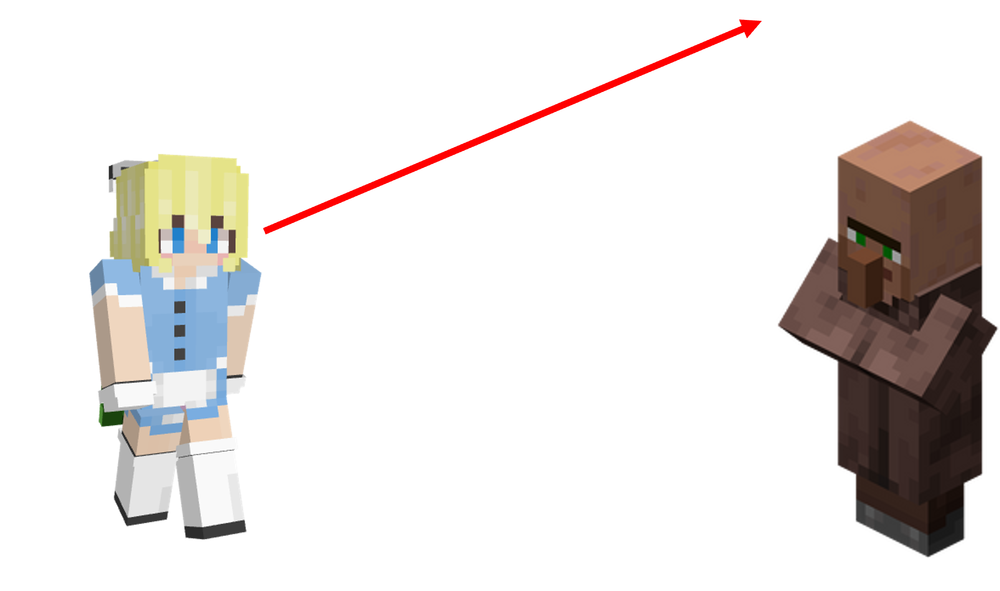
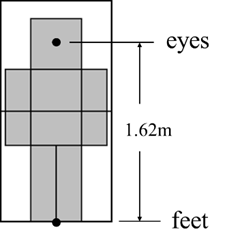

<FeatureHead
    title = '命令中的实体锚点和执行锚点'
    authorName = 徐木弦
    avatarUrl = '../../_authors/徐木弦.jpg'
    :socialLinks="[
        { name: 'BiliBili', url: 'https://space.bilibili.com/449298404' }
    ]"
    cover='../_assets/6.png'
/>


## 摘要
本文研究内容源自于一则数据包笑话：
Mojang员工小时候被教导说直视他人的眼睛时要往人家头顶上的空气看，观察下来才发现他默认把自己的脚当作眼睛，拿自己的脚去看别人的眼睛。

## 引言
`/rotate`是用于更改实体朝向的命令，当其被用于旋转实体使之面向另一个实体时，语法为：
````
rotate <target> facing entity <facingEntity> [<facingAnchor>]
````
其中的参数`[<facingAnchor>]`类型为实体锚点，可用参数`feet`和`eyes`，分别用于朝向目标实体的脚部和眼部。如果一个命令初学者需要使自身朝向最近村民的眼部，出于人类的阅读书写习惯，他很可能将命令写成：
````
rotate @s facing entity @n[type=villager] eyes
````
然而命令实际执行下来，玩家的视线却如下图所示：

如果将参数`eyes`去掉：
````
rotate @s facing entity @n[type=villager]
````
从视角上看，玩家似乎真正朝向了村民的眼部。然而，如果将村民换成末影人，并依照上述命令格式仿写：
````
rotate @s facing entity @n[type=enderman]
````
实际并不会使玩家朝向末影人的眼部，因此这种方案是不通用的。下文将介绍其中的原理和解决办法。

## 原理
### 实体锚点
**实体锚点（Entity Anchor）** 是实体身上用于定位的**点**，有两个可用的实体锚点：脚部和眼部。故名思义，脚部位于实体碰撞箱的底部中心点，这个位置实际上就是实体本身的位置，也是**默认使用的实体锚点**。眼部位于实体眼睛高度处碰撞箱的中心点。
眼部和脚部在水平方向上的位置是一样的，在$y$轴上，这个实体眼睛部位的高度就是眼部和脚部高度的差值。

对于玩家而言，其眼部与脚部的高度差约为1.62格，如上图所示。但是不同实体的眼部高度实际上是不一致的，不能笼统地认为所有实体的眼部高度均为1.62格。

### 执行锚点
相应地，锚点也作为命令上下文参数的一部分，是为**执行锚点（Execution Anchor）**，它与执行位置、执行朝向一同影响命令执行结果。
如果执行位置为一个实体所在的位置，则脚部与执行位置实际上是重合的。事实上在所有的命令中，**执行锚点默认都是脚部**。无论锚点是否被修改为眼部，执行位置一定是在实体碰撞箱的底部中心点，不会随着锚点的变化而发生变动。
执行锚点的应用场景相对于执行位置而言较少，它只会影响**局部坐标、实体朝向和执行朝向**，从而影响`/tp`、`/rotate`和`/execute`三条命令的`facing`子命令的执行结果。当锚点是脚部时，**相对坐标和局部坐标的原点、实体朝向和执行朝向的起点都在执行位置（脚部）**。而当锚点是眼部时，**相对坐标的原点在执行位置，也就是脚部；局部坐标的原点、实体朝向和执行朝向的起点在眼部**。
以下举一个例子以进一步说明：
````
execute as @a at @s anchored eyes run setblock ~ ~ ~ stone
````
这条命令将执行锚点设为玩家的眼部，而执行位置仍然为玩家碰撞箱底部中心点，这个位置被相对坐标`~ ~ ~`使用，因此石头会放置在玩家下半身所在方块。
````
execute as @a at @s anchored eyes run setblock ^ ^ ^ stone
````
同样是将执行锚点设为玩家的眼部，但`^ ^ ^`使用执行锚点，因此石头会放置在玩家上半身所在方块。

## 解释
以下解释“引言”部分提出来的例子。
````
rotate @s facing entity @n[type=villager] eyes
````
此命令没有修饰执行锚点，因此默认锚点为玩家（`@s`）的脚部。朝向的起点为脚部，终点为命令指定的村民的`eyes`，此即为玩家的朝向：

由于村民眼部的高度与玩家一致，因此对于下面的命令：
````
rotate @s facing entity @n[type=villager]
````
朝向的起点为玩家的脚部，终点默认为村民的脚部，视线方向水平，能够使玩家直视村民的眼睛。但是对于眼部高度非1.62格的实体，该命令则无法达到预期效果。于是这种写法不严谨。
最严谨的写法即是将执行锚点直接设为玩家的眼部，并使玩家朝向村民的眼部：
````
execute anchored eyes run rotate facing entity @n[type=villager] eyes
````

## 参考文献
[1] https://zh.minecraft.wiki/w/%E5%91%BD%E4%BB%A4%E4%B8%8A%E4%B8%8B%E6%96%87
[2] https://zh.minecraft.wiki/w/%E5%91%BD%E4%BB%A4/rotate
[3] https://zh.minecraft.wiki/w/%E5%91%BD%E4%BB%A4/execute