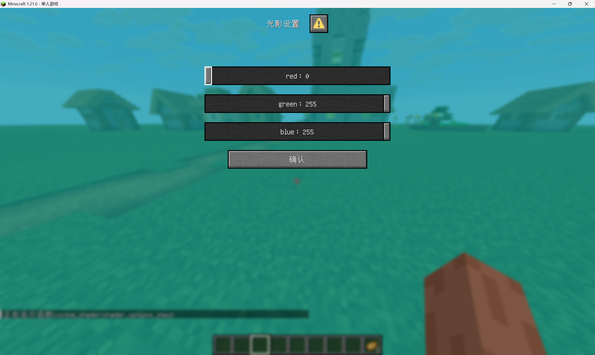

<FeatureHead
    title = '数据包向资源包着色器传入参数'
    authorName = MC作死狼王
    avatarUrl = '../../_authors/狼王.jpg'
    :socialLinks="[
        { name: 'BiliBili', url: 'https://space.bilibili.com/508626439' }
    ]"
/>

## 前篇-俺寻思之力

首先创建一个mc资源包

[创建资源包基础教程](https://zh.minecraft.wiki/w/Tutorial:%E5%88%B6%E4%BD%9C%E8%B5%84%E6%BA%90%E5%8C%85?variant=zh-cn)

我们资源包要做的部分是着色器

[mcwiki着色器部分](https://zh.minecraft.wiki/w/%E7%9D%80%E8%89%B2%E5%99%A8)

着色器分为核心着色器和后处理着色器，而后处理着色器在assets/minecraft/post_effect目录下控制渲染管线，一共有
| json文件 | 作用 |
| :----- | :------- |
| blur.json | gui背景模糊 |
| creeper.json | 旁观模式苦力怕视角 |
| entity_outline.json | 发光实体描边渲染 |
| invert.json | 旁观模式末影人视角 |
| spider.json | 旁观模式蜘蛛视角 |
| transparency.json | 极佳图像品质渲染 |

聪明的小伙伴不难发现transparency是正常游玩下可常驻的渲染模式(开启极佳图像品质)
| 帧缓冲 |
| :----- |
|main - 游戏主体部分帧缓冲 |
|translucent - 绑定半透明帧缓冲 |
|item_entity - 绑定物品实体帧缓冲 |
|particles - 绑定粒子帧缓冲 |
|weather - 绑定天气帧缓冲 |
|clouds - 绑定云帧缓冲 |

仔细寻思寻思，particles(粒子)是比较方便，可控的部分，并且核心着色器中含有particles.fsh和particles.vsh.

自定义且判断一个特殊的粒子我们需要粒子的一些属性，比如透明度，查询一下wiki

[粒子数据格式](https://zh.minecraft.wiki/w/%E7%B2%92%E5%AD%90%E6%95%B0%E6%8D%AE%E6%A0%BC%E5%BC%8F)

颜色粒子选项可以自定义RGBA，`entity_effect`和`tinted_leaves`粒子都可用颜色粒子选项，可惜有个bug，`tinted_leaves`的A值实际上永为1.0，所以只能用`entity_effect`

## 1. 粒子顶点着色器修改基础

把mc的jar文件解压，在目录中找到`assets/minecraft/shaders/core/`

找到`particle.vsh`和`particle.fsh`，复制进自己的资源包里。

这是`particle.vsh`，粒子的顶点着色器

```glsl
#version 150

#moj_import <minecraft:fog.glsl>
#moj_import <minecraft:dynamictransforms.glsl>
#moj_import <minecraft:projection.glsl>

in vec3 Position;
in vec2 UV0;
in vec4 Color;
in ivec2 UV2;

uniform sampler2D Sampler2;

out float sphericalVertexDistance;
out float cylindricalVertexDistance;
out vec2 texCoord0;
out vec4 vertexColor;

void main() {
    gl_Position = ProjMat * ModelViewMat * vec4(Position, 1.0);

    sphericalVertexDistance = fog_spherical_distance(Position);
    cylindricalVertexDistance = fog_cylindrical_distance(Position);
    texCoord0 = UV0;
    vertexColor = Color * texelFetch(Sampler2, UV2 / 16, 0);
}
```

对mc着色器有一些不太理解的可以去看一下mcwiki

[mcwiki着色器部分](https://zh.minecraft.wiki/w/%E7%9D%80%E8%89%B2%E5%99%A8)

`Position`是以玩家为坐标系原点下的坐标

`ModelViewMat * vec4(Position, 1.0)`得到的是眼坐标系下粒子坐标

`ProjMat * ModelViewMat * vec4(Position, 1.0)`后得到的是NDC坐标系下的粒子坐标，待裁剪。

glsl里内置gl_VertexID，可以获取当前顶点索引，而粒子都是四边形，所以顶点索引可以判断当前顶点在粒子哪个点上。

我们不妨上手试一下，把particle.vsh改为以下代码

```glsl
#version 150

#moj_import <minecraft:fog.glsl>
#moj_import <minecraft:dynamictransforms.glsl>
#moj_import <minecraft:projection.glsl>

in vec3 Position;
in vec2 UV0;
in vec4 Color;
in ivec2 UV2;

uniform sampler2D Sampler2;

out float sphericalVertexDistance;
out float cylindricalVertexDistance;
out vec2 texCoord0;
out vec4 vertexColor;

const vec2 quadCorners[4] = vec2[4](
    vec2(1.0, -1.0),
    vec2(1.0, 1.0),
    vec2(-1.0, 1.0),
    vec2(-1.0, -1.0)
);

void main() {
    vec4 clipSpacePos = vec4(0, 0, -1, 1);
    clipSpacePos.xy += quadCorners[gl_VertexID%4];
    gl_Position = ProjMat * clipSpacePos;
    sphericalVertexDistance = fog_spherical_distance(Position);
    cylindricalVertexDistance = fog_cylindrical_distance(Position);
    texCoord0 = UV0;
    vertexColor = Color * texelFetch(Sampler2, UV2 / 16, 0);
}
```

这串代码将粒子映射到眼前固定位置，保证后续粒子一定不会被裁剪。

然后将粒子固定到屏幕右上角。

```glsl
#version 150

#moj_import <minecraft:fog.glsl>
#moj_import <minecraft:dynamictransforms.glsl>
#moj_import <minecraft:projection.glsl>
#moj_import <minecraft:globals.glsl>

#define RESOLUTION_FACTOR 500

in vec3 Position;
in vec2 UV0;
in vec4 Color;
in ivec2 UV2;

uniform sampler2D Sampler2;

out float sphericalVertexDistance;
out float cylindricalVertexDistance;
out vec2 texCoord0;
out vec4 vertexColor;

const vec2 quadCorners[4] = vec2[4](
    vec2( 1.0, -1.0),
    vec2( 1.0,  1.0),
    vec2(-1.0,  1.0),
    vec2(-1.0, -1.0)
);

void main() {
    // 初始化裁剪空间位置，位于视图中心
    vec4 clipSpacePos = vec4(0.0, 0.0, -1.0, 1.0);
    
    // 根据当前顶点索引获取对应的角偏移量
    vec2 cornerOffset = quadCorners[gl_VertexID % 4];
    
    // 将角偏移量应用到xy坐标上
    clipSpacePos.xy += cornerOffset;
    
    // 计算用于调整投影的偏移量 (0 到 1),将 (-1,1) 映射到 (1,0)
    vec2 ndcCornerOffset = (vec2(1.0) - cornerOffset) * 0.5; 
    
    // 计算屏幕空间的偏移 (像素单位)
    vec2 screenOffset = ndcCornerOffset / ScreenSize;
    
    gl_Position = ProjMat * clipSpacePos;
    gl_Position.xy = gl_Position.w * (vec2(1.0) - screenOffset * vec2(RESOLUTION_FACTOR));
    
    sphericalVertexDistance = fog_spherical_distance(Position);
    cylindricalVertexDistance = fog_cylindrical_distance(Position);

    texCoord0 = UV0;
    vertexColor = Color * texelFetch(Sampler2, UV2 / 16, 0);
}
```

这里我们加入了`#moj_import <minecraft:globals.glsl>`,可以使用`ScreenSize`获取屏幕分辨率,`RESOLUTION_FACTOR`是粒子在右上角渲染的分辨率因子。这串代码能让你在屏幕右上角500x500分辨率的固定区域渲染粒子。仅用来传输的话2x2分辨率即可，1像素可能因为精度丢失，导致绘制不上。

但是我们希望只有被标记的粒子才被移动到屏幕右上角，可以通过数据包生成特殊`entity_effect`粒子，比如传入a值为0.114，在着色器中通过`Color.a`判断。

## 2. 配合数据包部分，粒子传参数据进入着色器

[数据包制作基础教程](https://zh.minecraft.wiki/w/Tutorial:%E5%88%B6%E4%BD%9C%E6%95%B0%E6%8D%AE%E5%8C%85?variant=zh-cn)

本章默认你已有基础的数据包制作知识。

在数据包中的每tick都会执行的mcfunction文件中写上`execute as @a at @s run particle entity_effect{color:[1.0,1.0,1.0,0.114]} ~ ~ ~`

然后粒子顶点着色器改成以下代码

```glsl
#version 150

#moj_import <minecraft:fog.glsl>
#moj_import <minecraft:dynamictransforms.glsl>
#moj_import <minecraft:projection.glsl>
#moj_import <minecraft:globals.glsl>

#define RESOLUTION_FACTOR 500

in vec3 Position;
in vec2 UV0;
in vec4 Color;
in ivec2 UV2;

uniform sampler2D Sampler2;

out float sphericalVertexDistance;
out float cylindricalVertexDistance;
out vec2 texCoord0;
out vec4 vertexColor;

const vec2 quadCorners[4] = vec2[4](
    vec2( 1.0, -1.0),
    vec2( 1.0,  1.0),
    vec2(-1.0,  1.0),
    vec2(-1.0, -1.0)
);

void main() {
    if (Color.a > 0.113 && Color.a < 0.115) {
        // 初始化裁剪空间位置，位于视图中心
        vec4 clipSpacePos = vec4(0.0, 0.0, -1.0, 1.0);
    
        // 根据当前顶点索引获取对应的角偏移量
        vec2 cornerOffset = quadCorners[gl_VertexID % 4];
    
        // 将角偏移量应用到xy坐标上
        clipSpacePos.xy += cornerOffset;
    
        // 计算用于调整投影的偏移量 (0 到 1),将 (-1,1) 映射到 (1,0)
        vec2 ndcCornerOffset = (vec2(1.0) - cornerOffset) * 0.5; 
    
        // 计算屏幕空间的偏移 (像素单位)
        vec2 screenOffset = ndcCornerOffset / ScreenSize;
    
        gl_Position = ProjMat * clipSpacePos;
        gl_Position.xy = gl_Position.w * (vec2(1.0) - screenOffset * vec2(RESOLUTION_FACTOR));
    }
    else {
        gl_Position = ProjMat * ModelViewMat * vec4(Position, 1.0);
    }
    sphericalVertexDistance = fog_spherical_distance(Position);
    cylindricalVertexDistance = fog_cylindrical_distance(Position);

    texCoord0 = UV0;
    vertexColor = Color * texelFetch(Sampler2, UV2 / 16, 0);
}
```

由于浮点精度问题，在顶点着色器中，我们得用Color.a > 0.113 && Color.a < 0.115做区间来判断特殊粒子。

但此时摆在我们面前的还有两个问题:

1. 右上角的粒子颜色显示会根据光照变化。

2. 粒子不是纯色的

3. 雾气会影响粒子颜色

对我们而言都不利于用粒子传参，

第一个问题是`vertexColor = Color * texelFetch(Sampler2, UV2 / 16, 0);`中的`texelFetch(Sampler2, UV2 / 16, 0)`，这是光照下的颜色。

第二个问题是在`particle.fsh`中`vec4 color = texture(Sampler0, texCoord0) * vertexColor * ColorModulator`的`texture(Sampler0, texCoord0)`

第三个问题是在`particle.fsh`中`fragColor = apply_fog(color, sphericalVertexDistance, cylindricalVertexDistance, FogEnvironmentalStart, FogEnvironmentalEnd, FogRenderDistanceStart, FogRenderDistanceEnd, FogColor);`使用的`apply_fog`方法

对此，全部做特殊判断特殊处理

`particle.vsh`如下
```glsl
#version 150

#moj_import <minecraft:fog.glsl>
#moj_import <minecraft:dynamictransforms.glsl>
#moj_import <minecraft:projection.glsl>
#moj_import <minecraft:globals.glsl>

#define RESOLUTION_FACTOR 500

in vec3 Position;
in vec2 UV0;
in vec4 Color;
in ivec2 UV2;

uniform sampler2D Sampler2;

out float sphericalVertexDistance;
out float cylindricalVertexDistance;
out vec2 texCoord0;
out vec4 vertexColor;
out vec4 baseColor;

const vec2 quadCorners[4] = vec2[4](
    vec2( 1.0, -1.0),
    vec2( 1.0,  1.0),
    vec2(-1.0,  1.0),
    vec2(-1.0, -1.0)
);

void main() {
    if (Color.a > 0.113 && Color.a < 0.115) {
        // 初始化裁剪空间位置，位于视图中心
        vec4 clipSpacePos = vec4(0.0, 0.0, -1.0, 1.0);
    
        // 根据当前顶点索引获取对应的角偏移量
        vec2 cornerOffset = quadCorners[gl_VertexID % 4];
    
        // 将角偏移量应用到xy坐标上
        clipSpacePos.xy += cornerOffset;
    
        // 计算用于调整投影的偏移量 (0 到 1),将 (-1,1) 映射到 (1,0)
        vec2 ndcCornerOffset = (vec2(1.0) - cornerOffset) * 0.5; 
    
        // 计算屏幕空间的偏移 (像素单位)
        vec2 screenOffset = ndcCornerOffset / ScreenSize;
    
        gl_Position = ProjMat * clipSpacePos;
        gl_Position.xy = gl_Position.w * (vec2(1.0) - screenOffset * vec2(RESOLUTION_FACTOR));
    }
    else {
        gl_Position = ProjMat * ModelViewMat * vec4(Position, 1.0);
    }
    sphericalVertexDistance = fog_spherical_distance(Position);
    cylindricalVertexDistance = fog_cylindrical_distance(Position);
    texCoord0 = UV0;
    vertexColor = Color * texelFetch(Sampler2, UV2 / 16, 0);
    baseColor = Color;
}
```

`particle.fsh`如下
```glsl
#version 150

#moj_import <minecraft:fog.glsl>
#moj_import <minecraft:dynamictransforms.glsl>

uniform sampler2D Sampler0;

in float sphericalVertexDistance;
in float cylindricalVertexDistance;
in vec2 texCoord0;
in vec4 vertexColor;
in vec4 baseColor;

out vec4 fragColor;

void main() {
    if (baseColor.a > 0.113 && baseColor.a < 0.115) {
        fragColor = vec4(baseColor.rgb, 1.0);
    }
    else {
        vec4 color = texture(Sampler0, texCoord0) * vertexColor * ColorModulator;
        if (color.a < 0.1) {
            discard;
        }
        fragColor = apply_fog(color, sphericalVertexDistance, cylindricalVertexDistance, FogEnvironmentalStart, FogEnvironmentalEnd, FogRenderDistanceStart, FogRenderDistanceEnd, FogColor);
    }
}
```

至此，我们成功将rgb均为1.0的纯色传入给着色器并且在屏幕右上方渲染出来。

## 3. 后处理着色器读取传参与实战

在画质`极佳`时，`transparency.fsh`开启，本章对渲染管线部分不做介绍与操作，仅在`transparency.fsh`中进行操作。

在`transparency.fsh`中，含有`ParticlesSampler`，通过取样可以获得右上方的像素信息，在`int main() {}`里面写上`vec4 particleInput = texture(ParticlesSampler, vec2(1.0, 1.0));`就可以获取粒子传入的数据RGB，尾行添加`fragColor = particleInput;`，不出意外的话整个屏幕会变成纯色。颜色是你每tick运行指令里的药水粒子的颜色。

# 实战: 屏幕滤镜+滤镜颜色设置

1.21.6引入了dialog，可以配合函数宏来实现内置光影设置

在`namespace/dialog`里面写个`example.json`

```json
{
  "type": "minecraft:multi_action",
  "title": {
    "text": "光影设置"
  },
  "inputs": [
    {
      "type": "minecraft:number_range",
      "key": "shader_options_red",
      "label": "red",
      "start": 0,
      "end": 255,
      "step": 1,
      "initial": 255
    },
    {
      "type": "minecraft:number_range",
      "key": "shader_options_green",
      "label": "green",
      "start": 0,
      "end": 255,
      "step": 1,
      "initial": 255
    },
    {
      "type": "minecraft:number_range",
      "key": "shader_options_blue",
      "label": "blue",
      "start": 0,
      "end": 255,
      "step": 1,
      "initial": 255
    }
  ],
  "after_action": "close",
  "actions": [
    {
      "label": "确认",
      "action": {
        "type": "dynamic/run_command",
        "template": "function custom_shader:shader_options_input {red:$(shader_options_red), green:$(shader_options_green), blue:$(shader_options_blue)}"
      }
    }
  ]
}
```

然后在`minecraft/tags/dialog/pause_screen_additions.json`里面写入
```json
{
    "values": [
        "namespace:example"
    ]
}
```

在`custom_shader:shader_options_input`里面写
```
$scoreboard players set @s custom_shader.filter.red $(red)
$scoreboard players set @s custom_shader.filter.green $(green)
$scoreboard players set @s custom_shader.filter.blue $(blue)
```

在load阶段把计分板都注册好并且对所有玩家这些计分板赋值255

然后tick阶段就是把计分板除255储存到storage里然后函数宏运行paticle指令，我相信你一定能想出来怎么写。

然后是`transparency.fsh`的代码如下:
```glsl
#version 150

uniform sampler2D MainSampler;
uniform sampler2D MainDepthSampler;
uniform sampler2D TranslucentSampler;
uniform sampler2D TranslucentDepthSampler;
uniform sampler2D ItemEntitySampler;
uniform sampler2D ItemEntityDepthSampler;
uniform sampler2D ParticlesSampler;
uniform sampler2D ParticlesDepthSampler;
uniform sampler2D WeatherSampler;
uniform sampler2D WeatherDepthSampler;
uniform sampler2D CloudsSampler;
uniform sampler2D CloudsDepthSampler;

in vec2 texCoord;

#define NUM_LAYERS 6

vec4 color_layers[NUM_LAYERS];
float depth_layers[NUM_LAYERS];
int active_layers = 0;

out vec4 fragColor;

void try_insert( vec4 color, float depth ) {
    if ( color.a == 0.0 ) {
        return;
    }

    color_layers[active_layers] = color;
    depth_layers[active_layers] = depth;

    int jj = active_layers++;
    int ii = jj - 1;
    while ( jj > 0 && depth_layers[jj] > depth_layers[ii] ) {
        float depthTemp = depth_layers[ii];
        depth_layers[ii] = depth_layers[jj];
        depth_layers[jj] = depthTemp;

        vec4 colorTemp = color_layers[ii];
        color_layers[ii] = color_layers[jj];
        color_layers[jj] = colorTemp;

        jj = ii--;
    }
}

vec3 blend( vec3 dst, vec4 src ) {
    return ( dst * ( 1.0 - src.a ) ) + src.rgb;
}

void main() {
    color_layers[0] = vec4( texture( MainSampler, texCoord ).rgb, 1.0 );
    depth_layers[0] = texture( MainDepthSampler, texCoord ).r;
    active_layers = 1;

    vec4 particleInput = texture(ParticlesSampler, vec2(1.0, 1.0));

    try_insert( texture( TranslucentSampler, texCoord ), texture( TranslucentDepthSampler, texCoord ).r );
    try_insert( texture( ItemEntitySampler, texCoord ), texture( ItemEntityDepthSampler, texCoord ).r );
    try_insert( texture( ParticlesSampler, texCoord ), texture( ParticlesDepthSampler, texCoord ).r );
    try_insert( texture( WeatherSampler, texCoord ), texture( WeatherDepthSampler, texCoord ).r );
    try_insert( texture( CloudsSampler, texCoord ), texture( CloudsDepthSampler, texCoord ).r );

    vec3 texelAccum = color_layers[0].rgb;
    for ( int ii = 1; ii < active_layers; ++ii ) {
        texelAccum = blend( texelAccum, color_layers[ii] );
    }

    fragColor = mix(vec4( texelAccum.rgb, 1.0 ), particleInput, 0.5);
}
```
最后如果你细心点会发现视角摇晃开启的时候，走路时粒子其实渲染偏下导致无法正常读取颜色，是因为mc神奇的渲染机制，视角摇晃不算在`ModelViewMat`里面，坑爹啊~

总之投影偏移量改一下就能修好bug了(俺寻思之力)

`particle.vsh`如下

```glsl
#version 150

#moj_import <minecraft:fog.glsl>
#moj_import <minecraft:dynamictransforms.glsl>
#moj_import <minecraft:projection.glsl>
#moj_import <minecraft:globals.glsl>

#define RESOLUTION_FACTOR 2

in vec3 Position;
in vec2 UV0;
in vec4 Color;
in ivec2 UV2;

uniform sampler2D Sampler2;

out float sphericalVertexDistance;
out float cylindricalVertexDistance;
out vec2 texCoord0;
out vec4 vertexColor;
out vec4 baseColor;

const vec2 quadCorners[4] = vec2[4](
    vec2( 1.0, -1.0),
    vec2( 1.0,  1.0),
    vec2(-1.0,  1.0),
    vec2(-1.0, -1.0)
);

void main() {
    if (Color.a > 0.113 && Color.a < 0.115) {
        // 初始化裁剪空间位置，位于视图中心
        vec4 clipSpacePos = vec4(0.0, 0.0, -0.05, 1.0);
    
        // 根据当前顶点索引获取对应的角偏移量
        vec2 cornerOffset = quadCorners[gl_VertexID % 4];
    
        // 将角偏移量应用到xy坐标上
        clipSpacePos.xy += cornerOffset;
    
        // 计算用于调整投影的偏移量 (-1.5 到 0.5),将 (-1,1) 映射到 (0.5,-1.5)
        vec2 ndcCornerOffset = -cornerOffset-0.5; 
    
        // 计算屏幕空间的偏移 (像素单位)
        vec2 screenOffset = ndcCornerOffset / ScreenSize;
    
        gl_Position = ProjMat * clipSpacePos;
        gl_Position.xy = gl_Position.w * (vec2(1.0) - screenOffset * vec2(RESOLUTION_FACTOR));
    }
    else {
        gl_Position = ProjMat * ModelViewMat * vec4(Position, 1.0);
    }
    sphericalVertexDistance = fog_spherical_distance(Position);
    cylindricalVertexDistance = fog_cylindrical_distance(Position);
    texCoord0 = UV0;
    vertexColor = Color * texelFetch(Sampler2, UV2 / 16, 0);
    baseColor = Color;
}
```

至此我们已经完成了可用的基于原版写的滤镜+滤镜设置

