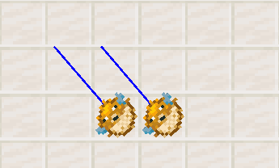
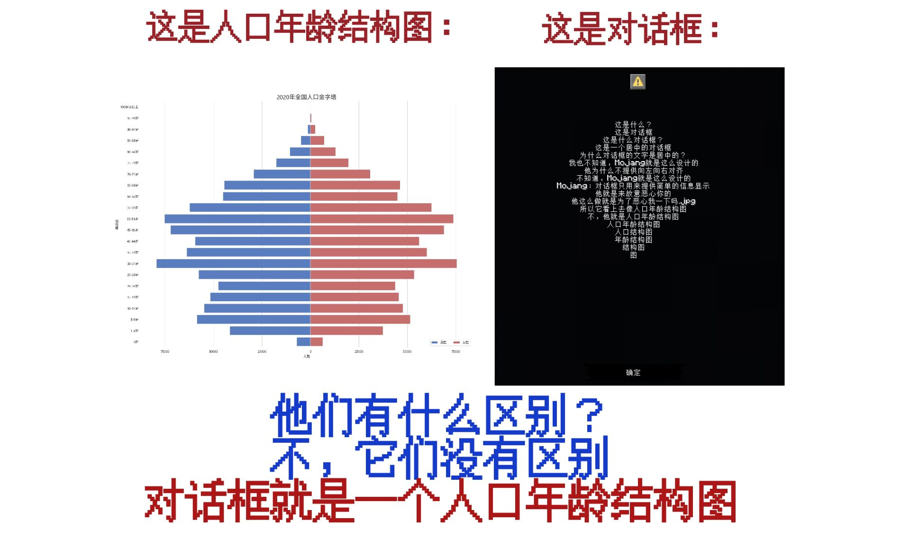

<script setup>
import { useData } from 'vitepress'
import ColorLine from '/.vitepress/vue/ColorLine.vue'
const { isDark } = useData()
</script>

# 封二
<ColorLine :height="4"/>

::: warning 你进入了一个秘密页面！
开个玩笑。  
在香草图书馆的更新过程中，我们发现，一些具有时效性的、细碎的信息，图书馆里没有适合他们存放的位置。  
因此，我们打算在《feature》中添加一个页面，放置一些杂项信息。随着《feature》更新一同更新。  
本页的内容不固定，可能会是各种信息，比如说命令问答，冷知识，~~数据包笑话~~，等等。  
我们在本页下方同样添加了本刊的讨论区，可以在下面发表你对本期《Feature》的看法，也可以向我们提问。
:::

## 命令快闪 Command Flashlight
<ColorLine :height="2"/>

::: tip
本版块分享一些命令的小技巧，主要来自underline群精华消息。
:::

### 保持实体旋转的精度

通常情况下，实体旋转数据会以 1.40625 度（360/256）的步长发送给客户端，而非使用完整精度。然而，在调查问题 MC-278440 时，我发现将 OnGround（在地面）值切换为与上一刻相反的状态，可以使游戏发送具有完整精度的旋转数据包。

```mcfunction
execute as @n[type=item_display,limit=2] at @s run rotate @s ~0.1 ~
execute as @n[type=item_display] store success entity @s OnGround byte 1 store success score @s test unless score @s test matches 1
```

注意1：此方法利用了漏洞 [MC-278440](https://mojira.dev/MC-278440)。
注意2：这与 Air toggling（空中切换）技术不同。
一些直接应用场景：

[MC-272913](https://mojira.dev/MC-272913)（item_display 渲染模型的旋转不精确）的最终修复：允许进行精确旋转，对于拥有长模型的展示实体（display entities）尤其有用。

[MC-184359](https://mojira.dev/MC-184359)（旁观者视角只能按步长旋转）的部分解决方法：对于基于 /spectate 命令的镜头技术非常有效。但不幸的是，它仅适用于非生物实体（non-living entities）。

对 [MC-278440](https://mojira.dev/MC-278440)（某些实体在一段时间后会自行轻微旋转）的讽刺性自我引用式解决方法：提前触发此漏洞可以确保这种非预期的旋转动画不会在之后随机发生。

[MC-300341](https://mojira.dev/MC-300341)（生物在受到攻击或在旋转过程中发生碰撞时，其视觉旋转会随机与实际旋转不同步）的部分解决方法：此技术似乎有助于绕过此错误，但它可能是一个不完整的修复方案，或者可能产生意外的副作用，例如身体的旋转会进行指数插值（exponentially interpolated）。

下面的 GIF 图比较了应用解决方法前后（针对 MC-272913）的旋转精度：
左侧：仅旋转（`rotate`）
右侧：旋转 + 地面状态切换（`rotate & OnGround toggling`）



### 对玩家瞬时触发附魔效果
(1.21.6+)  
如果想让自定义附魔效果在命令上下文内瞬时触发，可以将需要的自定义附魔附魔触发条件编辑为`location_changed`，使用槽位设置为鞍(`saddle`)或`body`;  
然后将带有指定附魔的对应装备使用`/item`指令装备到对应槽位；  
接下来，给玩家的游戏模式瞬间切换为`旁观模式`然后切回去，就可以实现触发了。

:::warning 注意  
这可能需要借助计分板缓存玩家原先的游戏模式，然后特别处理一下旁观切创造模式的默认飞行（这个可以先切一次生存或冒险模式解决）。  
如果你在1.21.5及以前的版本，也可以将使用槽位设置在其他的位置，在触发时瞬间替换然后再换回去。为了不影响原本的装备，需要自己写一个缓存机制。
:::

### 喵
  ／l、  
（ﾟ､ 。 ７  
　l、 ~ヽ  
　じしf_, )ノ​  

## 你问我答 Q & A
<ColorLine :height="2"/>

### Q:如何获取现实时间？
A：你可以截取命令方块的输出存储（`LastOutput`），使用`/forceload`强加载一个区块，在那里放置一个命令方块，循环触发一个不合法指令（如`random roll 1`）,  
然后每tick获取该方块`LastOutput.text`的值，使用字符串截取功能按位截取（1 9选取，其中可以使用1 3截取小时，4 6截取分钟，7 9截取秒）即可。  
(1.21.5+)

## 数据包笑话 Datapack Jokes
<ColorLine :height="2"/>




<ClientOnly>
  <GiscusComment
    repo="CR-019/datapack-index"
    repoId="R_kgDONRhuqw"
    category="闲聊 Chats"
    categoryId="DIC_kwDONRhuq84CkchW"
    mapping="number"
    term="24"
    :strict="false"
    :reactionsEnabled="true"
    emitMetadata="0"
    inputPosition="top"
    :theme="isDark ? 'dark' : 'light'"
    lang="zh-CN"
    loading="lazy"
    class="giscus-wrapper"
  />
</ClientOnly>

<style>
.giscus-wrapper {
  margin: 3rem auto;
  max-width: 800px;
  padding-top: 2rem;
  border-top: 1px solid var(--vp-c-divider);
}
</style>