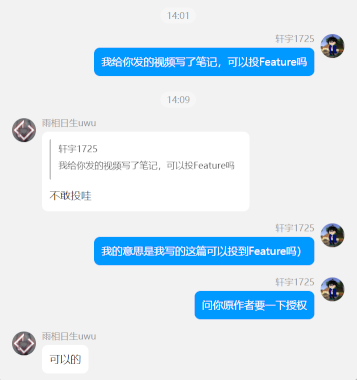
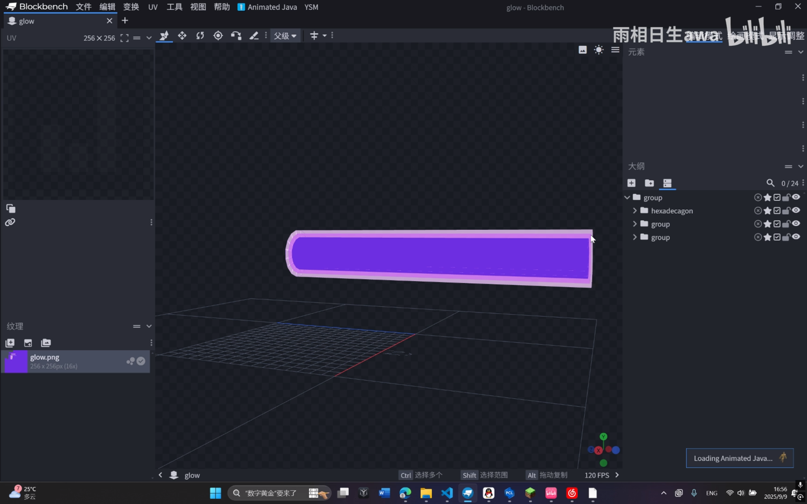
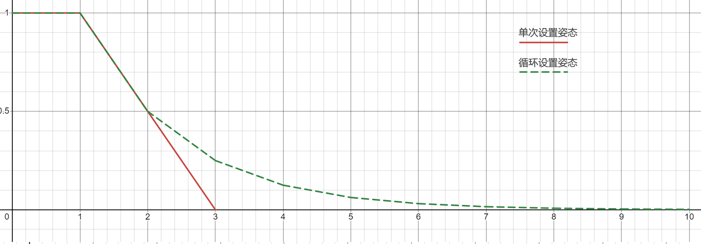
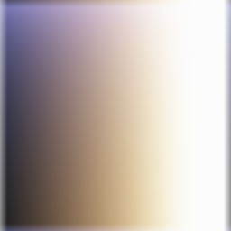

<FeatureHead
    title = '基于展示实体的一些巧思'
    authorName = 轩宇1725
    avatarUrl = '../../_authors/轩宇1725.jpg'
    :socialLinks="[
        { name: 'BiliBili', url: 'https://space.bilibili.com/104432208' }
    ]"
    :extraAuthors="['雨相日生awa']"
    resourceLink = https://www.bilibili.com/video/BV1C7HyzNEeh
    cover='../_assets/1.png'
/>

## 综述

过去，原版模组中的动画几乎都是使用盔甲架姿态变换或者是tp来实现的，受到最大 TPS 的限制，一般情况下动画最高只能达到 20FPS。此外，除了引入更多重复性的体素外，难以实现含有体素变形的动画。

而 1.19.4 加入的展示实体是原版模组中一个十分灵活且有用的工具，由于其能自定义线性变换和插值的特性，被广泛用于各种高帧率动画，因此掌握展示实体的简单使用是十分有必要的。**有读者和作者提出 Feature 的内容比较硬核，导致新人都不敢投递文章，因此我选择编撰一篇较为简单的展示实体动画笔记。**

> 笔记已获原作者授权
>
> 原作地址 [https://www.bilibili.com/video/BV1C7HyzNEeh](https://www.bilibili.com/video/BV1C7HyzNEeh) by: 雨相日生awa

该视频介绍了几个使用自定义烘焙模型 + 展示实体插值动画 + 生命周期的示例，用于制作简单的动态特效。

::: warning ↑编辑注
实际上我们近几个月得到的投稿质量已经远高于《Feature》的准入标准，因此大家不要担心自己的发现不够重量级而不敢投稿，我们欢迎所有人踊跃向《Feature》投稿~  
不要害怕喵，点击就送喵！
:::

## 激光例子 - 淡出的模型动画

### 基本思路

在第一个例子中，作者利用负体积体素制作了一个带"描边"的圆柱模型，用于充当激光的主体。

作者这里使用的是Blockbench的插件 Outline Creator (by Wither) 自动构建外轮廓，如果需要手动制作外轮廓，需要先将Blockbench中的 `文件 -> 设置 -> 吸附 -> 负值模型` 或 `File -> Settings -> Snapping -> Nagetive Size` 勾选。

在命令方面。作者生成了一个 scale 变换为 `[5f, 5f ,25f]` 的物品展示实体，且展示的物品挂载 `minecraft:item_model` 组件，指向刚刚创建的模型。同时，创建了一个计时器，在展示实体生成后 10 tick 将其移除。并在生成后的第2t设置新姿态 `scale:[0f, 0f, 25f]`，插值2t。这里展示实体的尺寸在 z 方向不变，x 和 y 方向从 `5` 缩放到 `0`，表现为圆柱体线性变细的效果。

### Mojang留的小坑

值得注意的是，物品展示实体和方块展示实体的插值特性有区别，当目前插值未完成时，又被设置了新的姿态，那么：

- 物品展示实体会以当前姿态为“前一个姿态”，新设置的姿态为“下一个姿态”，进行插值

- 方块展示实体会以上次设置的姿态为“前一个姿态”，新设置的姿态为“下一个姿态”，进行插值

> 此特性可能在未来会被修复

由于这里使用的是物品展示实体，所以除了直接设置一次新姿态外，我们也可以循环设置姿态。将 “在生成后的第2t设置新姿态” 换为 “在生成后的2t及之后都设置新姿态”，可以利用简单的指令让展示实体的尺寸总体上呈现非线性变化，看起来更加自然的同时省去了数据包内的计算（不过依然要频繁访问实体数据）。由于上面介绍的原因，如果使用方块展示实体会发生鬼畜。

下图展示了单次设置姿态和循环设置姿态的直径变化规律，横轴为时间（以tick为单位），纵轴为某时刻下直径与初始直径的比值。

## 刀光例子 - 面向玩家的伪粒子

一般来说，这类特效只需要在模型中放置一个体素，至少一个面拥有纹理即可。通过设置 `billboard`，展示实体可以基于摄像机方向旋转模型，值得注意的是，模型坐标系的 z 方向是与摄像机 z 轴同向的。

通过骑乘，可以让另一个刀光与该刀光在客户端完全同步运动，通过这种方式可以将多个不同的展示实体动画锚定在一起。

### Mojang留的小坑

摄像机坐标系和玩家坐标系有180°的水平旋转差。摄像机坐标系的 z 轴垂直屏幕向外，而玩家坐标系 z 轴垂直屏幕向内（都是右手系）。如果绕不过来，为了保险可以在垂直于模型坐标系 z 轴的两个面上都贴上纹理。

## 其他思考

上面的例子本质上是实现了一个简单的 “模型 - 事件队列 - (连续/非连续)线性插值” 的动画系统，其实现设计大于技术方面。我们确实可以用 Blockbench 的 Animated Java (by Titus Evans) 插件来制作这些动画，但对于这样简单的效果，其实没有必要使用 Animated Java 的封装。手动制作和简单封装会比用 Animated Java 生成的数据包更加精简。并且对于不熟悉 Animated Java 生成的数据包的开发者而言，比较方便引入参数化控制和维护。

对于和激光类似的动画，应该将展示实体的 brightness 改为 `{block:15,sky:15}`，也可以参照下图选择一个合适的光照颜色（横轴为block，纵轴为sky，与原始颜色乘算。该图片并不是原始数据，存在一定程度的失真）

如果需要在展示实体上挂载着色器，可能需要使用皮革类或其他能通过数据包指定颜色的物品。然后在着色器内检测特定的 **顶点颜色**

## 总结

本篇笔记通过解析原作者雨相日生的视频，整理了一些简单展示实体动画效果的实现方法：

- 通过计时器维护的缩放变换，实现展示实体淡入/淡出的效果，可拓展到旋转或弹跳等动画
- 通过设置光照等级来调整特效的颜色效果
- 通过设置自动旋转实现类似粒子效果的特效
- 通过骑乘绑定多个展示实体动画
- 以及几个需要注意的小坑