<FeatureHead
    title = '核心着色器的工作流程（中）：从顶点到片元'
    authorName = 轩宇1725
    avatarUrl = '../../_authors/轩宇1725.jpg'
    :socialLinks="[
        { name: 'BiliBili', url: 'https://space.bilibili.com/104432208' }
    ]"
    cover='../_assets/3.png'
/>

## 综述：

该教程紧密承接上一节教程，通过片元着色器巩固了GLSL的语言特性，并通过从0开始构建 “纹理采样 + 光照贴图 + 环境光遮蔽 + 染色 + 雾气” 来讲解片元着色器的工作流程和主要任务，为未来的实践奠基。

## 回顾

在上一节教程中，我们深入探讨了顶点在 `.vsh` 着色器中的变换过程，了解了顶点是如何从模型空间一步一步最终映射到屏幕空间的。我保证，对顶点变换的过程理解已经几乎是本系列涉及到的部分中，对数学要求最高的。从这节开始，数学相关的内容会减少，但是我们依然要求读者基本熟悉了矩阵变换的相关原理。

## 片元

### 片元插值

上一节介绍的顶点着色器处理的是顶点，在顶点着色器工作流程的最后，我们将顶点经过MVP变换和透视除法，最终变换到了NDC空间中 $\left( \left[-1,1\right]^3 \right)$ 。在这之后，将会进行 **图元装配（Primitive Assembly）** ，将顶点连接为基本图元（点、线、**三角形**），然后进行 **光栅化(Rasterization)** 操作，将图元装配阶段的图元离散为一个个对应屏幕像素的 **片元（Fragment）** 。

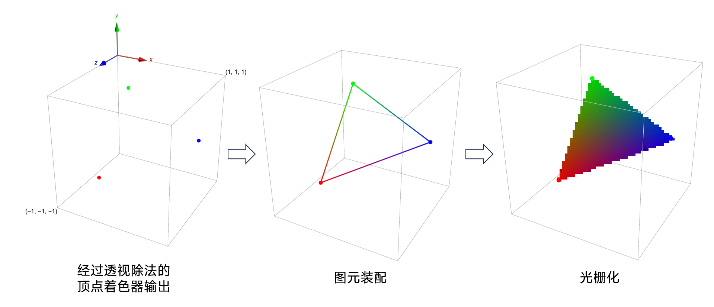

在生成片元的过程中，每个片元会根据其和顶点（通常是三个）的相对位置，对顶点着色器输出的数据进行插值（表现在颜色上就是渐变效果）。这个过程就叫做 **片元插值 (Fragment Interpolation)** 。

片元插值是一个符合直觉而十分重要的特性，在 Minecraft 中，片元插值主要提供平滑光照（光照等级在顶点处计算，这样可以减少计算的次数）和每个片元的线性UV（UV储存在顶点属性中，并发送到 `fsh`）

### 片元插值的数学基础

如果我们将构成三角面三个顶点表示为 $\mathbf{P_1}、\mathbf{P_2}、\mathbf{P_3} \in \mathbb R^n$ 。那么，三角形内部的任意一点 $P$ 总是能写成：

$$ \mathbf{P} = u \cdot \mathbf{P_1} + v \cdot \mathbf{P_2} + w \cdot P_3 $$

在这里不赘述 $u、v、w$ 的取值过程

那么这一点的任何一个传递变量（即 `vsh` 输出的数据） $\xi(\mathbf{P})$ 满足：

$$ \xi(\mathbf{P}) = u \cdot \xi(\mathbf{P_1}) + v \cdot \xi(\mathbf{P_2}) + w \cdot \xi(\mathbf{P_3}) $$

> 注：这里的插图与 `教程01->渲染过程` 中出现的摘自《LearnOpenGL》的插图的差异主要体现在：《LearnOpenGL》上凸显的是 `fsh` 控制输出颜色的功能，此处凸显的是对 `vsh` 输出数据的插值特性。这里为了凸显不同的片元，对光栅化输出设备的分辨率做了夸张。

### 片元着色器的任务

片元插值后，将进入片元着色器阶段。这个阶段，每个片元都会运行一次片元着色器，因此，一些显然在三角面内不会发生突变的数据完全可以放在顶点着色器进行计算，从而减轻运行负担。每个片元着色器运行时都是并行的，因此不存在固定的先后顺序。

片元着色器的任务十分简单，但也可以十分复杂。说简单，是因为片元着色器基本就是通过顶点着色器发送的数据和全局量来计算这个片元最终的颜色。说复杂，是因为在很多渲染领域（如真实感渲染和风格化渲染），对色彩和光照的操作有可能比上节讲的MVP变换更难理解。

## 传递变量

我们刚刚叙述的 “顶点着色器输出的数据” 在 GLSL 程序中有一个正式的名字：**传递变量（Varying Variable / Ins and Outs）** 。在上一节中，我们曾对此做过简单的介绍：

在变量的声明前添加 `in`，代表它的数据是由外部传入，`out` 则代表它的数据要传到外部。

顶点着色器用 `in` 前缀表示顶点属性（即游戏输入的数据），`out` 前缀则表示传递到片元着色器的数据。片元着色器用 `in` 前缀对应顶点着色器中的 `out`，并一般用 `out` 来表示输出的颜色（一般是 `out vec4 fragColor` ，其等价于直接使用的 `gl_FragColor`）

传递变量也要符合变量的基本规则，这约束了顶点着色器传出的变量名不能和输入时顶点属性的变量名相同。所以片元着色器中继承的顶点属性通常有不同的名字，例如：


### 传递变量一览
| 顶点属性或源数据 | fsh中使用的名称 | 备注 |
| --- | --- | --- |
| Position | N/A | 在vsh内使用完毕 |
| Normal | N/A | 在vsh内使用完毕 |
| Padding | N/A | 无使用 |
| fog_spherical_distance(Position) | sphericalVertexDistance  | 实体、末地门方块、粒子闪电等特效中使用 |
| fog_cylindrical_distance(Position) | cylindricalVertexDistance | 实体、裂痕、末地传送门方块、粒子和闪电等屏幕特效中使用 |
| texelFetch(Sampler2, UV2 / 16, 0) | lightMapColor | 渲染实体时使用 |
| texelFetch(Sampler1, UV1, 0) | overlayColor | 渲染实体时使用 |
| projection_from_position(gl_Position) | texProj0 | 渲染末地传送门方块时使用 |
| Color | VertexColor | |
| UV/UV0 | texCoord/texCoord0 | 当存在多个UV属性时，变量名会取UV0，否则为UV |
| UV1 | texCoord1 | 有传递，但在fsh中无使用 |
| UV2 | texCoord2 | |

## 片元的颜色

片元的颜色主要由四个部分贡献：纹理、光照、顶点颜色、雾气。（不同的对象渲染过程可能有些许不同，但这里我只给出一个较为一般化的渲染过程）。

### 纹理

**纹理（Texture）** 常被错误地称作 “材质” 或者被称作贴图，虽然在原版的渲染过程中纹理几乎就是材质，但我们在这里使用更加准确的叫法，在之后的教程中我们也会对 “材质” 概念进行进一步的说明。

纹理往往和 **采样器（Sampler）** 一一对应。采样器是一个特殊的对象，由 `uniform sampler2D` 前缀声明。但一般不同于常规的 “值类型的Uniform变量”，采样器的值是它在渲染管线内部的 “绑定ID”，要使用它，必须配合一类 **采样函数**。

在 `fsh` 中采样纹理的颜色数据，一般使用的是 `vec4 texture(sampler2D Sampler, vec2 UV))` 函数，这个函数要求提供一个 `sampler2D Sampler` ，作为采样器；一个 `vec2 UV` 作为采样坐标；返回一个 `vec4(r,g,b,a)` 格式的归一化颜色值。

由于在着色器中，纹理对应的是 `Sampler0` （大部分是资源包文件夹textures下的图片文件），纹理坐标对应 `texCoord/texCoord0`，所以 `texture(Sampler0, texCoord)` 或  `texture(Sampler0, texCoord0)`

编写下面的着色器代码

```glsl
#version 150

uniform sampler2D Sampler0;

in vec2 texCoord0;

out vec4 fragColor;

void main(){
    fragColor = texture(Sampler0, texCoord0);
}
```

此程序将能采样每个片元的纹理，并输出纹理的颜色值，下图是输出效果。

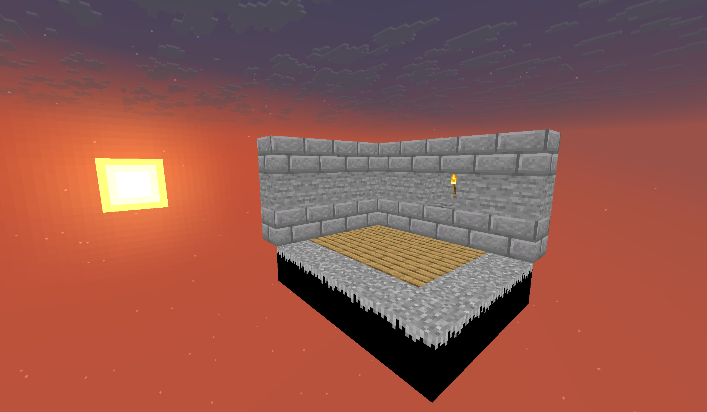

图片中出现了很多黑色的像素，这是因为这些方块的渲染类型不输出alpha（不透明度）通道，而这些像素在纹理中是 `vec4(0, 0, 0, 0)`，因此被渲染成了全黑，所以我们需要适当修改程序，让这些全透明像素不被渲染，下面是1.21.8的原版实现（删除了其他代码）

```glsl
#version 150

uniform sampler2D Sampler0;

in vec2 texCoord0;

out vec4 fragColor;

void main(){
    vec4 color = texture(Sampler0, texCoord0);
    #ifdef ALPHA_CUTOUT
        if (color.a < ALPHA_CUTOUT) {
            discard; // 片元着色器的 discard 关键字代表丢弃这个片元不进行渲染
        }
    #endif
    fragColor = color;
}
```

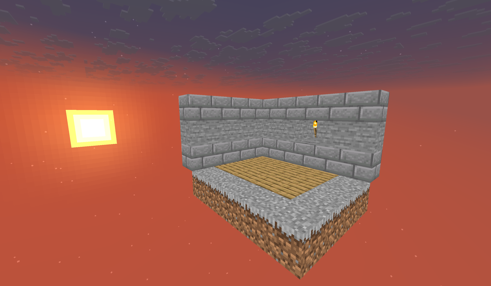

### 光照

**光照（Lighting）** 是让画面更加自然必不可少的组成部分。在真实感渲染中，光照可以说是最重要的核心，不过，Minecraft原版的光照系统相对来说还是比较简单。

光照也要通过采样器和采样坐标进行采样，不过，我们这里要手动实现一个新的采样函数，其核心依然是 `textures` 函数。（该函数已被Mojang实现并放入原版资源包）

```glsl
vec4 minecraft_sample_lightmap(sampler2D lightMap, ivec2 uv) {
    return texture(lightMap, clamp(uv / 256.0, vec2(0.5 / 16.0), vec2(15.5 / 16.0)));
}
```

这个函数在采样的基础上，对采样的坐标进行了 **钳制Clamping**，使得纹理坐标最小不低于 $\displaystyle \frac{0.5}{16.0}$ 、最大不高于 $\displaystyle \frac{15.5}{16.0}$。事实上，这里的uv坐标已经具备直观的意义，其横轴（u方向）对应 $方块光照等级 \times 16.0$，纵轴（v方向）对应 $天空光照等级 \times 16.0$。Minecraft 光照系统中预设的最大光照等级是16.0，所以最大值为 256.0。为了归一化坐标，uv被除以了250.0，同时钳制在对应光照等级 $\left[0.5, 15.5\right]$ 的范围内（即最暗不低于0.5，最亮不大于15.5）

下图是典型情况光照贴图的参考，该图像不是原始数据，存在一定程度的失真，而且光照贴图实际上是通过各种条件程序化生成的：

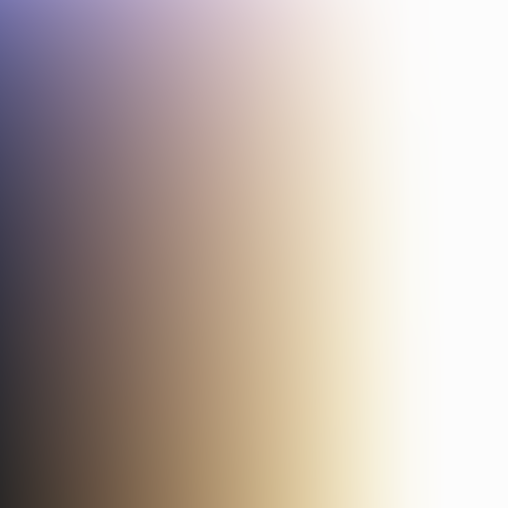

可以观察到，天空光是青蓝色的，方块光是白色，方块光的颜色权重总是大于天空光，这就是Minecraft的光照特点。

光照贴图对应的采样器是 `Sampler2` ，对应的采样坐标是 `UV2` （在顶点着色器中）。但为了方便演示，我们在片元着色器中进行采样。 `UV2` 传入片元着色器时叫 `texCoord2` ，所以我们写：

```glsl
#version 150

uniform sampler2D Sampler0;
uniform sampler2D Sampler2;

in vec2 texCoord0;
in vec2 texCoord2;

out vec4 fragColor;

vec4 minecraft_sample_lightmap(sampler2D lightMap, ivec2 uv) {
    return texture(lightMap, clamp(uv / 256.0, vec2(0.5 / 16.0), vec2(15.5 / 16.0)));
}

void main(){
    vec4 color = texture(Sampler0, texCoord0) * minecraft_sample_lightmap(Sampler2, ivec2(texCoord2));
    #ifdef ALPHA_CUTOUT
        if (color.a < ALPHA_CUTOUT) {
            discard;
        }
    #endif
    fragColor = color;
}
```

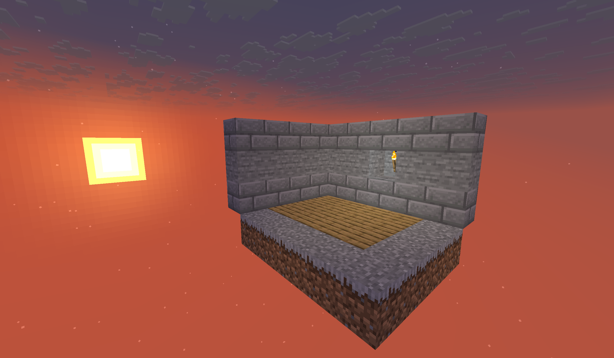

>注：在fsh中渲染光照有一个小坑，因为 UV2 是以ivec2（整数向量）声明的，不是光滑可插值的变量，所以不能直接按ivec2传递，而是要进行类型转换用vec2传递

光照的另一部分计算在顶点属性内传递，在下文顶点颜色中介绍。

### 顶点颜色

**顶点颜色（Color）** 主要包括两部分：**环境光遮蔽（Ambient Occlusion，AO）** 和 **染色（Tinting）**

Minecraft中实现的 **环境光遮蔽** 比较简单，表现为方块在于其他方块的连接处会略微变暗、同一光照等级下，方块不同面的实际亮度不一样。

**染色** 是一个非资源包制作组往往可能不会注意到的细节，例如草方块的草皮部分、树叶、水之类的方块，在不同的生物群系会有平滑的变色表现，比如沼泽的水会显得更加浑浊，温带海洋的水会更加清澈。

事实上，这些方块的纹理都是黑白的蒙版，游戏通过采样colormap获得一个用于正片叠底的颜色，与纹理采样得到的颜色相乘

> 注：
> - 这个过程也更加体现了为什么“纹理”而非“材质”、“贴图”是更准确的叫法，在很多场景下，texture下的图片文件仅仅提供表面的纹理变化，而不含颜色。
> - 包含特殊的顶点颜色的对象还有粒子效果、染色皮革物品、药水、刷怪蛋等，资源包开发领域一般将其称为自动上色。但要注意，粒子 `dust` 的顶点色并不在浮点数误差范围内等于 `/particle` 指令给定的参数，而是具有一定的偏移量，这导致每个 `dust` 的颜色都有略微区别；感兴趣的读者可以自行查阅“负值颜色减小dust误差”的研究。

这些内容都由游戏事先做好，我们不需要在着色器中处理，只需要将顶点属性 `Color` 传递到片元着色器中，重命名为 `vertexColor`


```glsl
#version 150

uniform sampler2D Sampler0;
uniform sampler2D Sampler2;

in vec2 texCoord0;
in vec2 texCoord2;
in vec4 vertexColor;

out vec4 fragColor;

vec4 minecraft_sample_lightmap(sampler2D lightMap, ivec2 uv) {
    return texture(lightMap, clamp(uv / 256.0, vec2(0.5 / 16.0), vec2(15.5 / 16.0)));
}

void main(){
    vec4 color = texture(Sampler0, texCoord0) * vertexColor * minecraft_sample_lightmap(Sampler2, ivec2(texCoord2));
    #ifdef ALPHA_CUTOUT
        if (color.a < ALPHA_CUTOUT) {
            discard;
        }
    #endif
    fragColor = color;
}
```

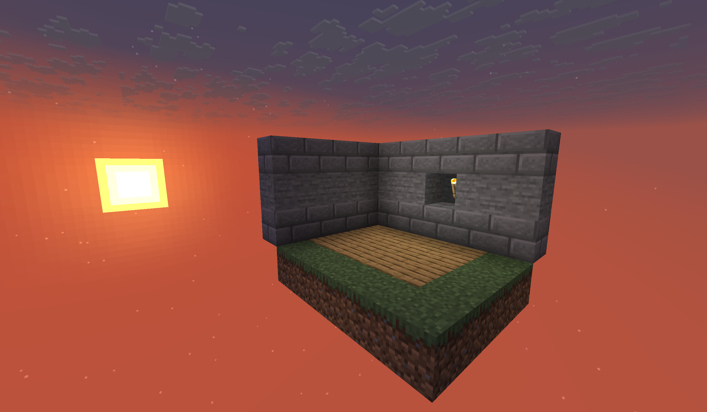

现在的画面已经十分自然。

### 雾气

> 雾气的具体实现和数学原理将会在之后的教程中提及，这里只简单介绍雾气的概念。

**雾气（Fog）** 是 Minecraft 画面内容的主要部分。雾气的使用可能比大多数人想的更加广泛，它被用于：天空盒下半部分的渲染、远处方块、实体的表面渲染、水下和岩浆下的屏幕变色、夜视失明和黑暗的效果等等。Minecraft 通过定义不同浓度、距离和不同颜色的雾气实现了各种各样的效果。在 1.21.8，一个经典的的雾气效果可以通过 minecraft:fog.glsl 提供的函数
```glsl
apply_fog(color, sphericalVertexDistance, cylindricalVertexDistance, FogEnvironmentalStart, FogEnvironmentalEnd, FogRenderDistanceStart, FogRenderDistanceEnd, FogColor);
```

添加，其中的参数都是全局量和前文传递变量一览表格中出现过的变量，不需要我们进行计算。

```glsl
#version 150

#moj_import <minecraft:fog.glsl>

uniform sampler2D Sampler0;
uniform sampler2D Sampler2;

in float sphericalVertexDistance;
in float cylindricalVertexDistance;
in vec4 vertexColor;
in vec2 texCoord0;
in vec2 texCoord2;

out vec4 fragColor;


vec4 minecraft_sample_lightmap(sampler2D lightMap, ivec2 uv) {
    return texture(lightMap, clamp(uv / 256.0, vec2(0.5 / 16.0), vec2(15.5 / 16.0)));
}

void main() {
    vec4 color = texture(Sampler0, texCoord0) * vertexColor * minecraft_sample_lightmap(Sampler2, ivec2(texCoord2));
    #ifdef ALPHA_CUTOUT
        if (color.a < ALPHA_CUTOUT) {
            discard;
        }
    #endif
    fragColor = apply_fog(color, sphericalVertexDistance, cylindricalVertexDistance, FogEnvironmentalStart, FogEnvironmentalEnd, FogRenderDistanceStart, FogRenderDistanceEnd, FogColor);
}
```

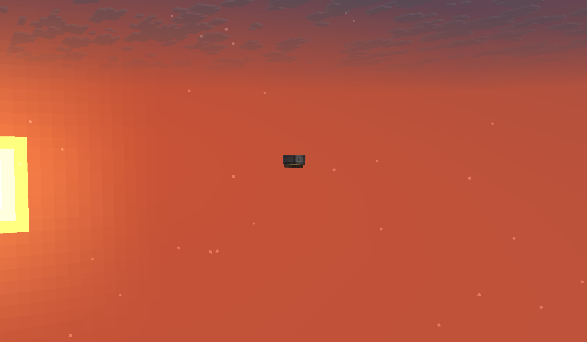

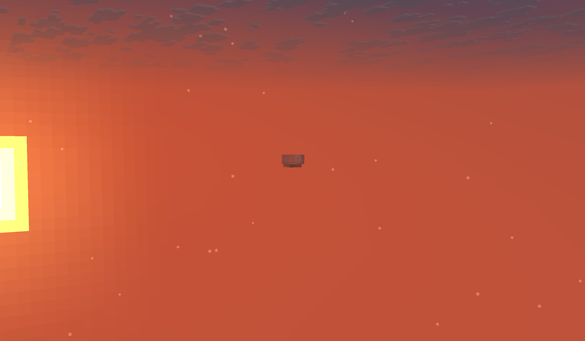

远处的场景添加雾气前后对比

## 帧缓冲

现在我们已经初步完成了物体的渲染，片元着色器运行结束之后会将输出变量 `fragColor` 或 `gl_FragColor` 输出到显存中，但不会立即发送到屏幕上，存放这些数据的地方我们称之为 **帧缓冲（Fragment Buffer）**，特别地，存放颜色的信息我们称为 **颜色缓冲（Color Buffer）**。除了颜色缓冲，片元的深度信息也会被输出到 **深度缓冲（Depth Buffer）** 并进行归一化，值得注意的是，写入的深度值并不是线性变化的，因为我们没有必要对接近远平面的极远的像素与接近近平面的像素使用同样的精度记录。具体来说，我们希望用更高的精度去记录较近的深度值，对远处的深度可以使用较低的精度。这一过程是通过透视投影和透视除法自然引入的，我们不需要进行过多的计算。

在这里给出深度映射的公式，NDC中的坐标范围是 $\left[-1, 1\right]$，深度缓冲中的值范围是 $\left[0, 1\right]$，那么深度映射的公式就是

$$\displaystyle \text{depth} = \frac{z_\text{NDC} + 1}{2}$$

即近平面 $(z_\text{NDC} = -1.0)$ 会被映射到 $\text{depth} = 0.0$，近平面 $(z_\text{NDC} = +1.0)$ 会被映射到 $\text{depth} = 1.0$

## 测试和混合

缓冲最终会被发送到游戏中，进行测试（深度测试和alpha测试，决定了那些像素会被最终保留下来）和混合（根据其他片元修改片元的颜色），最终输出到 `minecraft:main` 缓冲。如果玩家开启了“极佳！”画质，那么这些缓冲就会被发送到后处理着色器，进行进一步混合。

后处理阶段结束后，`minecraft:main` 会被发送到视口上，我们就可以看到各个游戏内容被正确地渲染了。

## 总结

本教程给出了一个经典的片元着色器的渲染流程，相比于上一节的顶点着色器，可以说简单了很多。但本章只是对片元着色器的工作进行了初略的介绍和实践，事实上片元着色器的主要难点在于对色彩和光照的操作，各种高级光照模型和程序化生成图片都是由片元着色器负责的。本节特意绕开了对雾气的细节讨论，目的就是为了控制理解难度，将较为复杂的色彩操作放在后面的教程介绍。这里贴几张原版光影的图片，以展示片元着色器的复杂应用场景，也为了让读者对教程未来的组织方向和当前进度能有一定的了解：

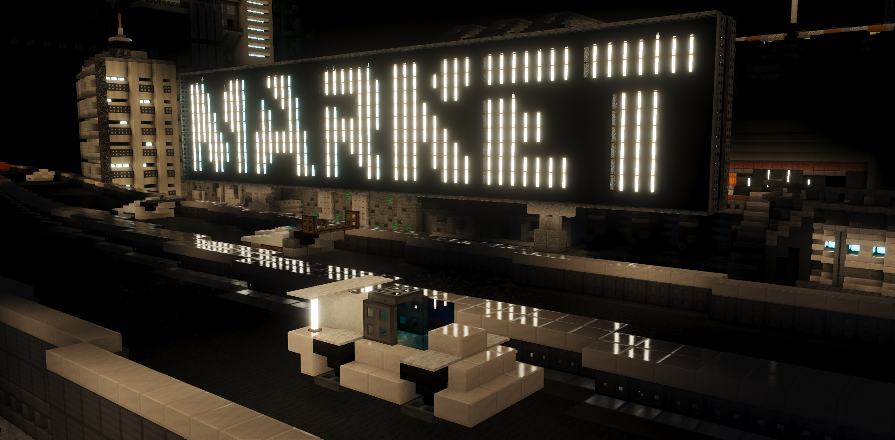

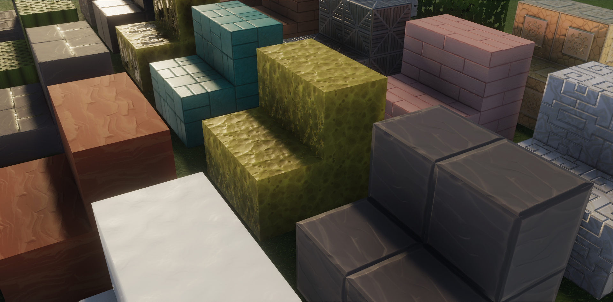

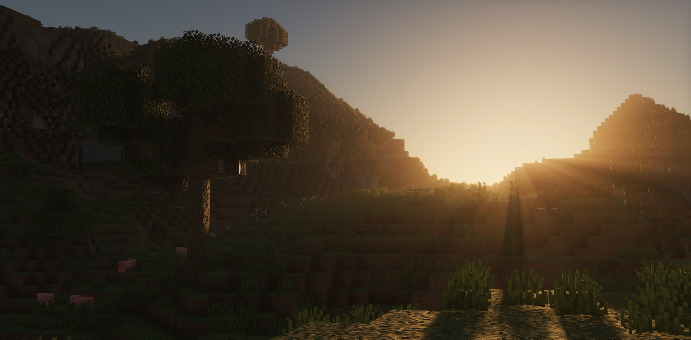

项目地址：[https://github.com/JNNGL/vanilla-shaderpack](https://github.com/JNNGL/vanilla-shaderpack) by JNNGL [Discord](https://discord.gg/5aU2JzXy23)