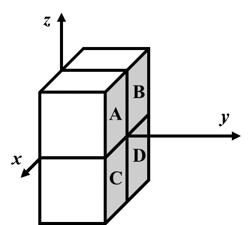

<FeatureHead
    title = '坐标系与坐标参数相关的基础理论'
    authorName = 徐木弦
    avatarUrl = '../../_authors/徐木弦.jpg'
    :socialLinks="[
        { name: 'BiliBili', url: 'https://space.bilibili.com/449298404' }
    ]"
    cover='../_assets/4.png'
/>


## 摘要
Minecraft的游戏世界是三维的。在编写命令的时候，有时需要确定这个命令的作用对象需要的位置参数。这样的参数被称为坐标。本文列举了命令系统使用的坐标参数格式，对其性质及用途作理论上的阐述。

## 引言
Minecraft使用的空间直角坐标系是右手坐标系。在这种空间直角坐标系中，$x$轴和$z$轴所反映的是水平方向上的位置，$y$轴所反映的是垂直方向上的位置。其中，$x$轴的正方向指向正东，而$z$轴的正方向指向正南。

在多数情况下，可以用三个参数来表示某一点的位置，这是一个有序的实数三元组：
````
<x> <y> <z>
````
比如，用数学方法表示的点$(0,4,4)$在一些命令参数中直接表示为`0 4 4`。

> **例** 空间直角坐标系中有两个点$A(124.5,76,−64.29)$、$B(−10.003,80,−33.33)$，则$B$点在水平位置上位于$A$点的什么方向？
**解** $B$点$x$坐标位于$A$点$x$坐标的负方向，因此$B$点在东西方向上位于$A$点的西方；$B$点$z$坐标位于$A$点$z$坐标的正方向，因此$B$点在东西方向上位于$A$点的南方。综上所述，$B$点位于$A$点的西南方向。

虽然不同的坐标表示方式基本一致，但不同的命令作用的对象不同，其坐标参数类型也不完全一致，下文将梳理命令系统使用的所有种类的坐标参数。

## 参数类型
命令使用4种与坐标相关的参数类型：方块坐标`minecraft:block_pos`、三维坐标`minecraft:vec3`、平面方块坐标`minecraft:column_pos`和二维坐标`minecraft:vec2`。它们的关系和应用场景可以很清晰地列于下表：
|  | 一般应用于方块 | 一般应用于非方块的游戏内容 |
|-------|-------|-------|
| 三维 | `minecraft:block_pos` | `minecraft:vec3` |
| 二维 | `minecraft:column_pos` | `minecraft:vec2` |

### 方块坐标
坐标表示的是一个没有体积的点，而方块是有体积的，因此需要给方块规定一个基准点，用这个基准点的坐标来表示该对象的坐标。
Minecraft规定：大部分方块的长、宽和高均为1米，体积为1立方米。用坐标系表示这些位置时，默认了方块的边长和坐标系的单位长度在数值上相等，这意味着坐标系的基本单位为米，或称为“格”。
一个方块使用其**西北下角**的点作为它的**方块坐标（Block position）**。若一个方块的西北下角顶点坐标为$(x,y,z)$，则该方块的方块坐标记为$(x,y,z)$，而这个方块位于$(x,y,z)$和$(x+1,y+1,z+1)$这两个坐标围成的立体几何图形之间。

由于方块的角总是位于整数坐标点，作为命令参数`minecraft:block_pos`的方块坐标一定是由三个整数构成的有序三元组。允许在方块坐标中使用相对坐标和局部坐标。
命令`/setblock`、`/fill`、`/clone`、`/fillbiome`、`/spawnpoint`和`/setworldspawn`均使用方块坐标，除此之外，`/data`、`/item`和`/execute`中用于处理方块实体数据的子命令也使用方块坐标。

> **例** 如图所示，方块坐标为`0 0 0`的方块为哪一个？

**解** 方块坐标严格按照西北下角顶点来计算，而正西、正北分别是$x$轴和$z$轴的负方向，因此用方块坐标指示的方块位置，永远位于实际坐标的东南方向，且在垂直方向上位于上方，在空间直角坐标系中的反映即为$x$、$y$、$z$三个坐标轴的正方向。因此方块坐标为`0 0 0`的方块位于第一卦限，即方块$A$。

### 三维坐标
**三维坐标（Three-dimensional coordinates）** 是精确表示一个位置的坐标参数，命令参数类型为`minecraft:vec3`，用于表示坐标位置的三个元素均为双精度浮点数。三维坐标一般应用于实体，使用三维坐标的命令有`/tp`（`/teleport`）、`/rotate`、`/summon`、`/particle`、`/playsound`，`/damage`，以及`/execute`的`facing`和`positioned`子命令。
可以看到，上述命令大部分都是实体相关的命令，**实体在使用三维坐标时，其碰撞箱底部中心点是这个实体的坐标**。例如，使用命令
````
tp 5.0 56.0 17.0
````
后，玩家脚底的中心点位于$(5.0,56.0,17.0)$，或者可以说玩家的锚点脚部位于$(5.0,56.0,17.0)$。
上面的例子中表示的坐标带有小数点，因为三维坐标的三个参数均是双精度浮点数。但是，这并不意味着三维坐标只能使用浮点数。例如，若使用整数形式的坐标$(5,56,17)$来描述玩家位置，在实际操作中，却发现这个玩家位于三维坐标$(5.5,56.0,17.5)$。如图，可以观察到玩家的坐标发生了“偏移”，与实际坐标有所出入。其中$x$坐标和$z$坐标都发生了“偏移”，而$y$坐标不受影响。

这些位置的偏移都位于相对方块两条对边的中心线上，这是因为三维坐标使用了**中心校准（Center correct）**，即使用整数形式的三维坐标，当其某一个坐标参数为$n$（$n∈Z$）时，其实际坐标为$n−0.5$，这样可以使得实体位置与方块位置相适应。注意**中心校准仅适用于$x$坐标和$z$坐标。$y$坐标严格使用实际坐标**。
注意这里不使用“三维坐标根据方块坐标位于方块中心”的说法，是因为三维坐标的三个参数中整数和浮点数形式可以混用，并且使用小数形式的参数严格遵循实际坐标，整数形式的参数则使用中心校准。比如，位于`5 56 17.0`的玩家实际位于$(5.5,56,17.0)$。

### 平面方块坐标
故名思义，平面方块坐标`minecraft:column_pos`就是二维的方块坐标，以西北角的二维坐标作为一个方块纵列的平面坐标，两个元素均为整数。目前使用这种参数格式的命令只有`/forceload`。

### 二维坐标
即只由$x$坐标和$z$坐标构成的**二维坐标（Two-dimensionalcoordinates）**。二维坐标的命令参数类型为`minecraft:vec2`，两个元素均为双精度浮点数。二维坐标若为整数，则也使用中心校准。`/spreadplayers`和`/worldborder`均使用这种参数格式。、

## 相对坐标和局部坐标
坐标参数除了使用数字形式之外，还可以使用波浪号或脱字符表示相对或局部坐标。

### 相对坐标
世界坐标是以空间直角坐标系为基准的、固定的坐标体系，每一个位置都有其固定的坐标。在表示这些坐标的时候，有时候需要确定“相对位置”，即抛开固有的以原点为基准的坐标系，使用“相对偏移量”来表达一个位置相对于另一个位置的坐标，即下文所要介绍的**相对坐标（Relative world coordinates）**。与之相对的固定空间直角坐标系坐标被称为**绝对坐标（Absolute world coordinates）**。在相对坐标系中，必须要确定一个原点，这个原点通常是命令执行位置。如果命令由玩家执行，则原点为玩家所在的位置；如果命令由命令方块执行，则原点为该命令方块所在的位置。相对坐标用波浪号`~`和相对偏移量表示，如果是二维的坐标，那就是
````
~[<dx>] ~[<dz>]
````
如果是三维的坐标，那就是
````
~[<dx>] ~[<dy>] ~[<dz>]
````
若相对偏移量`[<dx>]`、`[<dy>]`、`[<dz>]`不填写，则偏移量为0，偏移量可以为负。这就相当于建立了一个以命令执行位置为原点的空间直角坐标系。例如，相对于该点正东面的3格距离可以表示为`~3 ~ ~`。


> **例** 一个位于点$(−24,55,10)$的命令方块，其相对坐标`~12 ~‐3 ~‐5`所指的方块坐标为____________。
**解** 相对坐标规定命令方块所在的位置即为原点，在将相对坐标转换为绝对坐标时，只需要在绝对坐标的基础上做相应的加减，这个题中的方块坐标为$(−24−12,55−3,10−5)$，计算可得$(−12,52,5)$。

**相对坐标可以与绝对坐标混合使用。** 在不使用波浪号的坐标参数中，计算绝对坐标。比如，`~10 10 ~10`会根据执行位置变换$x$坐标和$z$坐标，但$y$坐标被固定为$10$。
如果在方块坐标中使用相对坐标，坐标值会被向下（负无穷）取整使之与方块坐标贴合。例如，当命令执行位置为$(10.5,70.2,-9.1)$时，方块坐标的相对坐标原点`~ ~ ~`取整为`10 70 -10`。
上述的四种坐标参数类型，`minecraft:block_pos`、`minecraft:vec3`、`minecraft:column_pos`和`minecraft:vec2`均可以使用相对坐标。

### 局部坐标
除了相对坐标外，命令系统还有一种更加灵活的坐标，即**局部坐标（Local coordinates）**。局部坐标也用于表示相对偏移量，与相对坐标不同的是，局部坐标使用方向来表示偏移。同样地，局部坐标也有作为锚点的命令执行位置，由脱字符和相对偏移量的格式来表示：
````
^[<dx>] ^[<dy>] ^[<dz>]
````

而局部坐标脱离了绝对坐标系规定的方向，它使用命令执行朝向作为基准。如图，使用局部坐标相当于建立了一个坐标轴方向任意的坐标系，但是坐标轴之间的正交关系不变。若执行者为玩家或其他实体，随着这些实体的视角转动，这个坐标系也跟随其视角转动。规定：**命令执行朝向即为局部坐标系$z$轴的正方向**。**若命令执行者为命令方块，则局部坐标系与相对坐标系无异，以南方为$z$轴的正方向**。因此$x$轴正方向位于执行朝向的左边，$y$轴正方向位于执行朝向的上方。比如，执行朝向右边$3$米距离的局部坐标为`^‐3 ^ ^`。
**由于局部坐标不使用绝对坐标系规定的坐标轴方向，因此局部坐标不能与绝对坐标和相对坐标混用。**
如果在方块坐标中使用局部坐标，和相对坐标一样，坐标值也会被向下（负无穷）取整使之与方块坐标贴合。
**但是局部坐标不能用于二维的坐标参数`minecraft:column_pos`和`minecraft:vec2`，只能用于三维的`minecraft:block_pos`和`minecraft:vec3`。**

## 其他参数中的坐标形式
### 目标选择器中的坐标
目标选择器原点使用一组双精度浮点数作为参数的值，共包括了`x`、`y`、`z`三个参数：
````
<目标选择器变量>[x=<x>,y=<y>,z=<z>]
````
参数的值可以为小数，位置原点的坐标不适用中心校准，所有位置原点坐标一律使用其实际坐标。用法举例：
````
@a[x=0,y=57,z=0]
````
这个选择器参数定义了精确的原点$(0.0,57.0,0.0)$。原点参数是可选的，三个参数均可选填。当某个坐标的参数未定义值时，则在未指定的坐标轴上使用命令执行位置。例如，定义下列参数：
````
@a[x=0,z=0]
````
由于参数`y`未定义，则使用命令执行位置的$y$坐标作为参数`y`的值。若三个参数均未定义值，则完全使用命令执行位置。一般而言，**原点参数需要配合距离、体积、排序或数量参数使用**。但是像`@p`这种本身具有排序功能的选择器可以单独使用原点参数，如`@p[x=0,y=0,z=0]`会选择离$(0,0,0)$最近的玩家。
**原点参数不会修改命令执行位置。**

### 对执行位置向下取整
`/execute`的`align`子命令将命令执行位置的实际坐标向下取整，语法为：
````
align <axes> ‐> execute
````
其中`<axes>`使用了特殊的参数格式——坐标轴组合`minecraft:swizzle`。可以为`x`、`y`和`z`的任意**不重复**组合，因此像xx这样的组合是错误的。所有可用的组合有：`x`、`y`、`z`、`xy`、`xz`、`yx`、`yz`、`zx`、`zy`、`xyz`、`xzy`、`yxz`、`yzx`、`zxy`和`zyx`，一共有15种不同的组合。子命令`align`会将该组合中所有相应坐标轴上的坐标向下取整（即向负无穷大取整）。各坐标轴的顺序没有要求，于是像`xy`和`yx`这样的组合效果完全相同。对坐标取整一共有七种情况，下面将所有的情况与15种组合对应起来：
* 仅对$x$坐标取整：`x`；
* 仅对$y$坐标取整：`y`；
* 仅对$z$坐标取整：`z`；
* 对$x$坐标和$y$坐标取整：`xy`和`yx`；
* 对$x$坐标和$z$坐标取整：`xz`和`zx`；
* 对$y$坐标和$y$坐标取整：`yz`和`zy`；
* 对$x$坐标、$y$坐标和$z$坐标取整：`xyz`、`xzy`、`yxz`、`yzx`、`zxy`和`zyx`。

> **例** 已知命令执行者位于$(12.5,76,−41.3)$，执行下面的命令后：
``
execute align xyz run tp ~ ~ ~
``
该命令执行者的实际坐标为何？
**解** 由题意可知，该命令的初始执行位置为(12.5,76,−41.3)，`xyz`组合使`align`子命令将该执行位置的$x$坐标、$y$坐标和$z$坐标向下取整，得到修饰后的执行位置$(12.0,76.0,−42.0)$。可以看到，若坐标为正，则向下取整会去除小数点；若坐标为整数则不变；若坐标为负，则去除小数点后将整数位置上的数字减去1。最后处理`run`命令时，命令`/tp`会将命令执行者传送至修饰后的坐标。
同理，如果执行的命令为
``
execute align x run tp ~ ~ ~
``
则修饰后的执行位置为$(12.0,76,−42.0)$，这里$y$坐标和$z$坐标没有向下取整。
有一点需要读者注意，`align`子命令不等同于坐标的中心校准，因为命令中的所有坐标均为实际坐标，所以整数坐标的表现形式为方块的边缘。在这个例子中，$x$坐标和$z$坐标均进行了向下取整，所以命令执行者被传送到了四个方块的交点，如图所示：


虽然`align`子命令不等同于坐标的中心校准，但仍然可以利用`align`子命令对已有的实体进行手动中心校准，下面再举一个例子：

> **例** 将任意坐标的命令执行者位置校准至其所在方块的中心。
**解** 可以先用`align`子命令对$x$坐标和$z$坐标向下取整：无论命令执行者位于其所在方块内的任一坐标，向下取整后的执行位置都是相同的，然后用`/tp`命令进行手动中心校准，即将命令执行者的$x$坐标和$z$坐标向正方向移动0.5格，此时命令执行者就被校准到了方块的中心点。有效的命令为：
``
execute align xz run tp ~0.5 ~ ~0.5
``

## 参考文献
[1] https://zh.minecraft.wiki/w/%E5%9D%90%E6%A0%87
[2] https://zh.minecraft.wiki/w/%E7%9B%AE%E6%A0%87%E9%80%89%E6%8B%A9%E5%99%A8
[3] https://zh.minecraft.wiki/w/%E5%91%BD%E4%BB%A4/execute
[4] https://zh.minecraft.wiki/w/%E5%8F%82%E6%95%B0%E7%B1%BB%E5%9E%8B