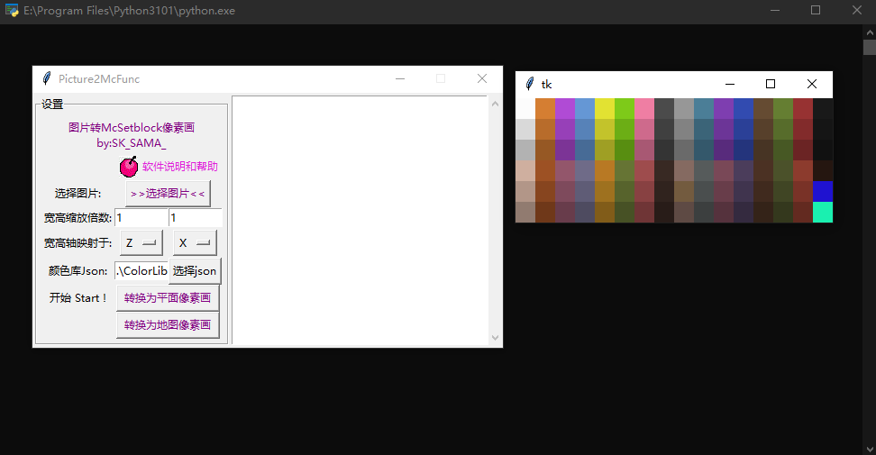
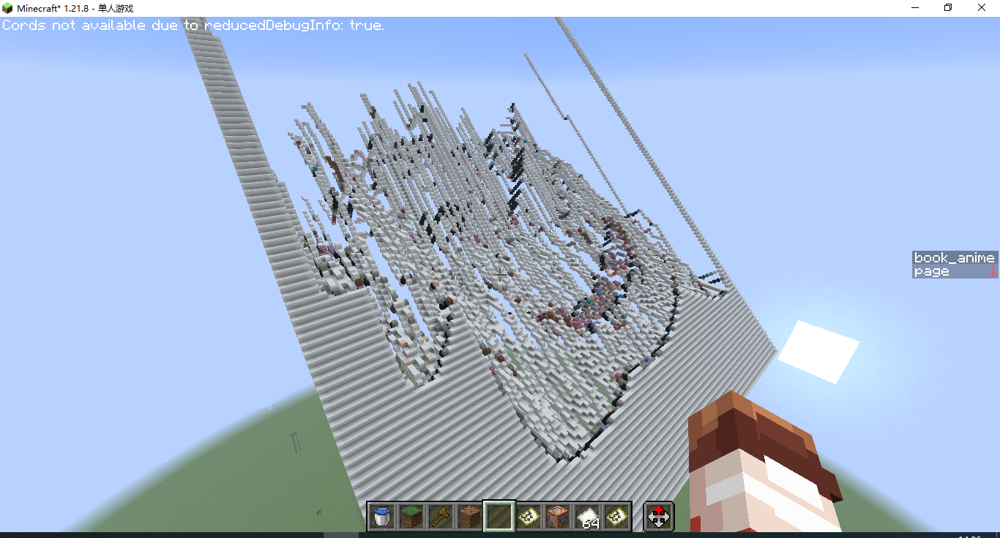
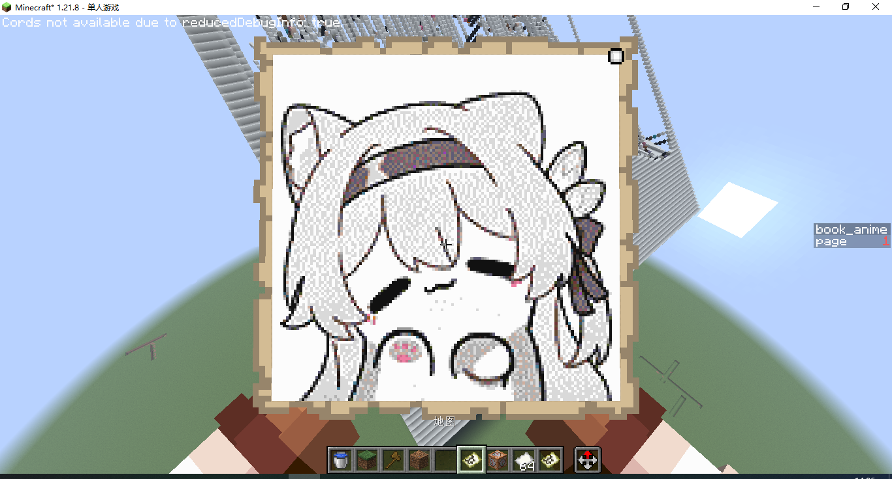
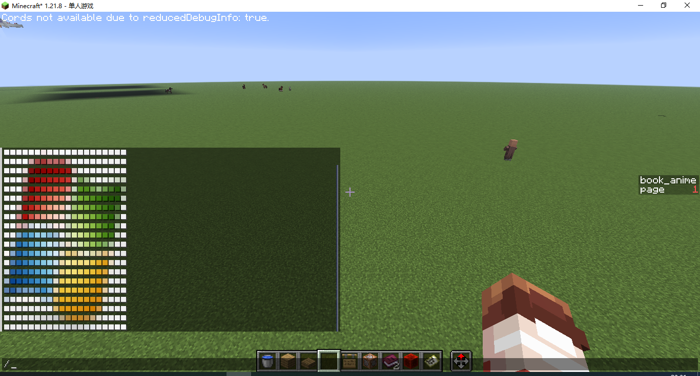
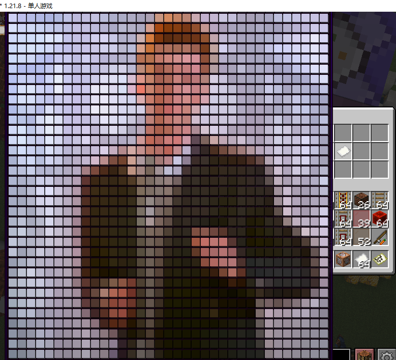
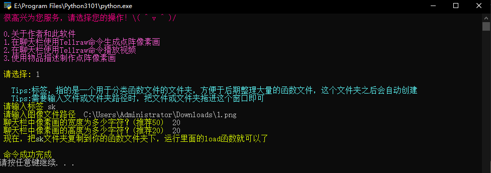
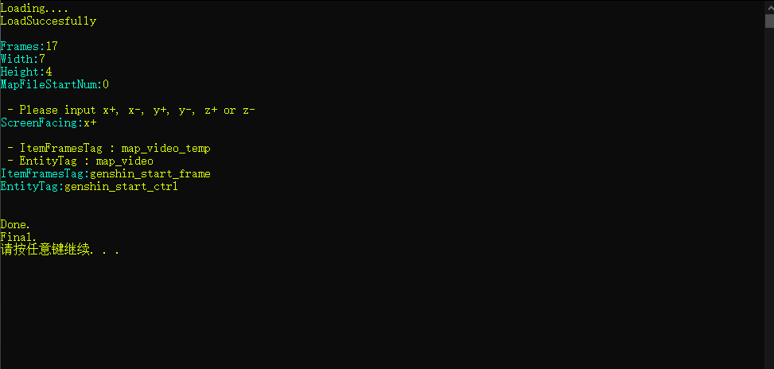
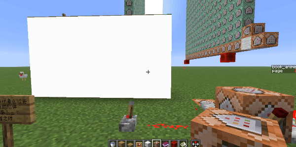
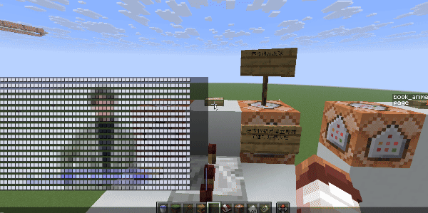
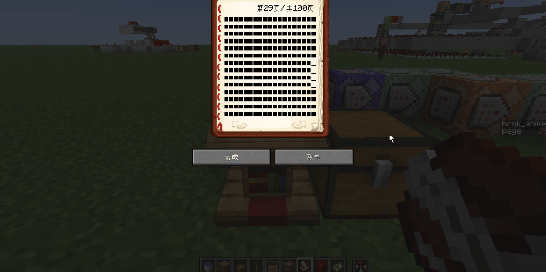

<FeatureHead
    title = '杂谈 · 其一 · 关于「像素画」的一些研究'
    authorName = SKSAMA
    avatarUrl = '../../_authors/sk.jpg'
    :socialLinks="[
        { name: 'BiliBili', url: 'https://space.bilibili.com/1546917549' },
        { name: 'GitHub', url: 'https://github.com/ymqlgthbSakuraDream' }
    ]"
    resourceLink = 'https://ymqlgthbsakuradream.github.io/posts/minecraft/Archive.20251006.html'
    cover='../_assets/6.png'
/>

## 关于「杂谈」

由于一些事情，最近没有时间和精力去制作新的东西了，所以打算写一些杂谈类的文章，记录一下之前玩过的一些命令，以及做过的一些零散作品  
  
先祝各位中秋安康！

## 杂谈 · 其一

自从Mojang更新了函数，命令的执行就不再局限于命令方块，但是那时的函数并不完善，既不能传参，也没有返回值。那时我能想到的用法就是利用函数批量执行大量命令，而这些命令可以通过程序生成。  
  
于是当时的我制作了各种各样的生成器来生成批量命令，虽然放在现在来看，它们确实已经过时了，但这并不妨碍我写文章去记录它们。  
  
这次的主题是像素画~~（那时我是真的很爱折腾，做了这么多没用的像素画生成程序）~~

## 像素画

### 地图画

这估计是最普通的像素画了，原理是用程序生成一个mcfuntcion函数文件，里面全是setblock命令，然后执行这个函数即可，这个程序可以生成立体地图画，放在当时可以算是很超前的，不过现在有了更好的软件：[SlopeCraft BV1So4y1D7wB](https://www.bilibili.com/video/BV1So4y1D7wB)

### 文本像素画

在**20w17a**更新中，文本组件中的color可以使用十六进制颜色码来自定义颜色，而不必使用几种预设的颜色，利用这个特性我们就可以在任何可以显示文本的地方来放像素画了，例如下面的聊天栏和物品描述

对此我也是写了一个程序来生成此类像素画

## 像素动画

既然已经实现了单张像素画的生成，那么我们不妨多生成几张，然后利用schedule命令依次显示，利用这个原理就可以播放视频了。  
（记得当时b站上有各种各样的类似的整活视频）

### 地图动画

利用这种方案可以以很高的分辨率播放视频，不过缺点也显而易见：资源占用较多，播放起来肉眼可见的卡

### 聊天栏动画

在聊天栏中使用文本播放视频，可以做到非常流畅，但是对分辨率不能要求太高

### 讲台动画

这是一个有意思的方案，灵感来自[BV1eb411S7Ut](https://www.bilibili.com/video/BV1eb411S7Ut)，于是制作了这个可以用讲台播放的BadApple

## 总结

展示实体在1.19加入，文本展示实体使文本不再局限于聊天框和各种UI中，物品展示实体配合物品模型映射可以直接显示任何图片，现在看来，上文提到的方案可能并不适用于目前，但它们留下的探索价值是不可忽略的。

