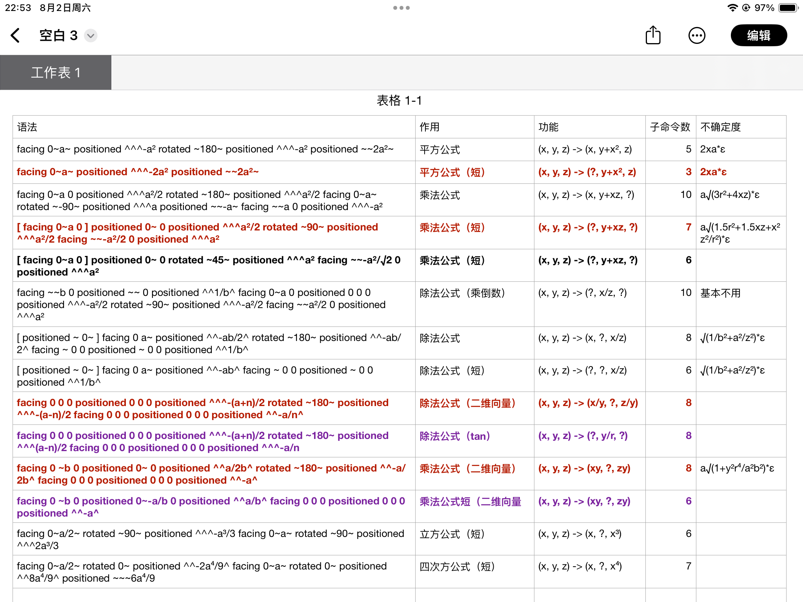
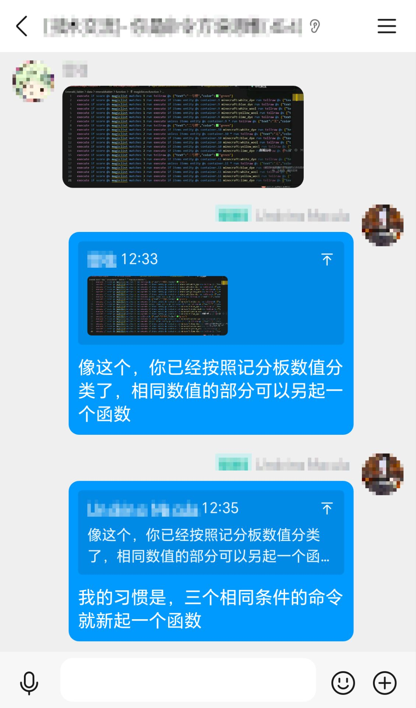

<script setup>
import { useData } from 'vitepress'
import ColorLine from '/.vitepress/vue/ColorLine.vue'
const { isDark } = useData()
</script>

# 封二
<ColorLine :height="4"/>

::: warning 你进入了一个秘密页面！
开个玩笑。  
在香草图书馆的更新过程中，我们发现，一些具有时效性的、细碎的信息，图书馆里没有适合他们存放的位置。  
因此，我们打算在《feature》中添加一个页面，放置一些杂项信息。随着《feature》更新一同更新。  
本页的内容不固定，可能会是各种信息，比如说命令问答，冷知识，~~数据包笑话~~，等等。  
我们在本页下方同样添加了本刊的讨论区，可以在下面发表你对本期《Feature》的看法，也可以向我们提问。
:::

## 图书馆上新 What's New
<ColorLine :height="2"/>

::: tip
本版块贴出最近收录在图书馆的新帖子，替代原先的“最近更新”页面。
:::

- [bookshelf中文文档](https://docs.mcbookshelf.dev/zh-cn/master/)
- [IconifyCraft - ICON 字体资源包生成器](https://iconifycraft.vercel.app/)
- [小豆的数学库 **v3.1**(主体)](https://github.com/xiaodou8593/math3.1)&nbsp;&nbsp; `~1.20.4-1.21~`
    - 该数学库的主要功能依赖于单元库，需要与主体一并安装：
    - ([图形库gelib](https://github.com/xiaodou8593/math3.1_gelib))&nbsp;&nbsp;
    - ([数据结构库dslib](https://github.com/xiaodou8593/math3.1_dslib))&nbsp;&nbsp;
    - ([线性代数库lalib](https://github.com/xiaodou8593/math3.1_lalib))&nbsp;&nbsp;
- [SKSAMA的个人博客](https://ymqlgthbsakuradream.github.io/archives/)


## 命令快闪 Command Flashlight
<ColorLine :height="2"/>

::: tip
本版块分享一些命令的小技巧，主要来自underline群精华消息。
:::

### 关于实体加载
实体如果是forceload卸载 自然卸载，uuid都是可以重新加载的；  
如果是tp或者summon进未加载区块的就会导致无法再次生成。  
命令应该都没有实体uuid列表的更新，所以tp实体到未加载区块的时候，这个实体的uuid还在列表里，所以会被summon检测到uuid重复，而游戏的正常进程会从列表里卸载这个实体uuid，所以可以召唤重复uuid；  
forceload是例外，可能是因为直接复用了游戏进程。

### execute上下文内四则运算



### 控制单个实体不受群体仇恨影响

> “这是我一直在研究的一个实验性数据包，它允许你通过给生物一个带有单一自定义附魔的物品来控制它们是否会在其群体受到攻击时变得敌对。持有带有自定义附魔的剑的生物只有在被直接攻击时才会变得敌对，而不会加入周围的其他敌对生物。适用于蜜蜂、狼和僵尸化猪灵。”  

这是通过利用 `follow_range` 属性的两个奇特机制来实现的：  
1. 具有非常低的 `follow_range` 值的生物不会加入其敌对群体，并且在被攻击时不会激怒其群体。  
2. 具有非零 `follow_range` 值的生物如果其 `AngerTime` NBT 值每刻手动更新，则会始终追踪其目标（_我不知道为什么这有效，它就是有效_）  
使用这个数据包，持有带有 `cc:independence` 附魔的 `golden_sword` 的生物有一个恒定的 `follow_range` 值为 0，因此它会忽略所有群体的敌意。当它被攻击时，其 `follow_range` 值会更新为一个非常小的数字，并且其 `AngerTime` 值每刻更新，以便它们追逐攻击者而不会激怒其群体。数据包本身比这更复杂，但这捕捉了大规模的机制。  
限制：行为并不总是完美。有时当你直接攻击独立生物时，仍然会有 1 或 2 个生物被激怒。这通常发生在群体生物在被攻击时非常接近独立生物时，因此在生物密度较低的区域效果最好。此外，这个包没有针对性能进行优化，不过我认为它足够好可以分享。  

https://github.com/oligomc/mccrowdcontrol

:::warning 编者注
在快照25w41a后，`AngerTime` 标签被移除，新版是否适用该方法需要验证。
:::

## 你问我答 Q&A

本期你问我答分享一个经验。  
在编写数据包的过程中，我们通常会用条件判断是否执行指令。对于在相同条件下连续执行的多条命令，我们可以考虑将其独立出来建立一个新的函数，在其中执行对应命令，这样能节省目标选择器的性能损耗，也会让数据包更加可读。  

例如：
```mcfunction
execute if score @s foo matches 1 run say 1
execute if score @s foo matches 1 run say 2
execute if score @s foo matches 1 run say 3
```

就可以优化为：
```mcfunction
execute if score @s foo matches 1 run function foo:bar
```

```mcfunction
say 1
say 2
say 3
```

我个人的经验是三条或以上相同条件的指令就另立一个函数。



<ClientOnly>
  <GiscusComment
    repo="CR-019/datapack-index"
    repoId="R_kgDONRhuqw"
    category="闲聊 Chats"
    categoryId="DIC_kwDONRhuq84CkchW"
    mapping="number"
    term="27"
    :strict="false"
    :reactionsEnabled="true"
    emitMetadata="0"
    inputPosition="top"
    :theme="isDark ? 'dark' : 'light'"
    lang="zh-CN"
    loading="lazy"
    class="giscus-wrapper"
  />
</ClientOnly>