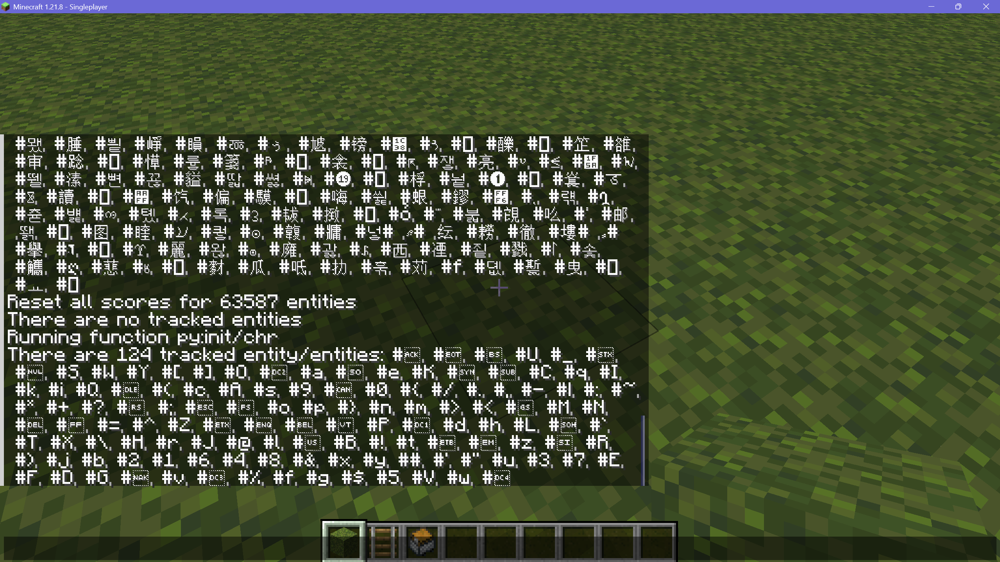
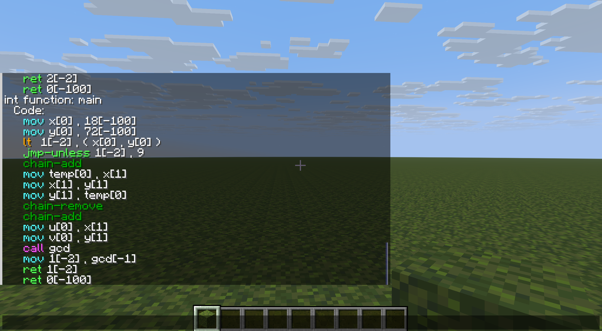

<FeatureHead
    title = '使用数据包制作编译器或解释器: 以C语言子集C-Minus为例'
    authorName = 皮革剑
    avatarUrl = '../../_authors/皮革剑.jpg'
    :socialLinks="[
        { name: 'BiliBili', url: 'https://space.bilibili.com/2127740148' },
        { name: 'Github', url: 'https://github.com/LeatherSword/' }
    ]"
    resourceLink = 'https://www.planetminecraft.com/data-pack/in-game-c-minus-compiler-pack-programming-language/'
/>

## 摘要

本文介绍了编译器的概念与mcfunction作为一门计算机语言的基本特征，并通过实现一个C语言子集C-Minus的完整编译器，示范了如何使用数据包制作从高级语言到mcfunction的编译器(解释器)。

## 目录

- 前言
- [一、总体介绍](#一总体介绍)
- [二、关于源语言与目标语言](#二关于源语言与目标语言)
- [三、词法分析(Lexical Analysis)](#三词法分析lexical-analysis)
  - [3.1 数据包字符识别](#31-数据包字符识别)
  - [3.2 更详细的内容](./content3.md)
- [四、语法分析(Parse)、语义分析与中间代码生成](#四语法分析parse语义分析与中间代码生成)
  - [4.1 语法分析总述](#41-语法分析总述)
  - [4.2 函数与存储分配](#42-函数与存储分配)
  - [4.3 未定义行为](#43-未定义行为)
  - [4.4 更详细的内容](./content4.md)
- [五、代码运行](./content5.md)
- [六、运行展示](./content6.md)
- [七、后记](#七后记)

## 前言

笔者不是计算机相关专业学生，没有系统地学过编译器。接下来的行文大部分还是会使用白话而非专业术语讲解，尽管会引用一些来自《编译原理》的文字作为参考，但笔者也不甚理解这些文字在说些什么。

由于该实现只是以完整而非完美为首要目标，几乎没有进行优化。有需要的读者可以参照[同刊4月刊的数据包优化指南](https://vanillalibrary.mcfpp.top/datapack-index/feature/archive/202504/3/content.html)以及《编译原理》相关章节实现优化功能。

本文算是抛砖引玉之作，笔者知道读者中不乏计算机专业学生甚至长期从业者，若对文本有疑问或建议，欢迎在本刊评论区提出，十分感谢。

完整版数据包参见[此处](https://www.planetminecraft.com/data-pack/in-game-c-minus-compiler-pack-programming-language/)。Github源代码仓库参见[此处](https://github.com/LeatherSword/McFunction-C-Minus-Compiler)。受笔者精力和能力限制，该数据包可能仍然有一些bug，欢迎使用后指出。

## 一、总体介绍

**编程语言**（又称程序设计语言，programming language）是用于描述计算的符号系统。用高级语言编写的程序怎样才能在游戏Minecraft: Java Edition（以下简称游戏）中执行呢？理论上，构造Mod直接执行某种用高级语言编写的程序是可能的，这里不举出例子。虽然这类做法非常多见，但是我们是数据包开发者，所以这里不讨论Mod。

实际上，对于数据包而言，能直接执行的都是低级的**McFunction语言**程序，它是由一条或多条指令构成的指令序列，称为函数。每条指令对应游戏中的一种特定操作。每种Minecraft游戏版本都有其特定的指令系统，如Java版本的指令系统与基岩版的指令系统长期存在很大差异，基岩版又与衍生的教育版指令系统有一些差别。

那么，高级语言程序就需要翻译成McFunction程序才能在游戏中执行。能够完成从一种语言到另一种语言的保语义变换的软件称为**翻译器**，这两种语言分别称为该翻译器的**源语言**和**目标语言**。

**编译器**是一种翻译器，它的特点是目标语言比源语言低级。本文将使用数据包（mcfunction语言）构造从高级语言（以一个C语言子集C-Minus为例）到mcfunction的编译器。

需要注意的是，本文与[同刊8月刊的clang-mc项目](https://vanillalibrary.mcfpp.top/datapack-index/feature/archive/202508/7/content.html)和mcfpp等任何使用外部程序实现的语言或编译器不同，旨在提供一个使用数据包制作编译器的可行性探讨和思路展示而不是作品本身。有相关基础的读者自行尝试理解后可以基于类似思路制作其他语言到mcfunction的编译器或解释器，甚至还可以尝试使用数据包实现其他语言到特定现实架构汇编语言的**交叉编译器**。

## 二、关于源语言与目标语言

### 2.1 关于目标语言mcfunction

显然mcfunction语言是一种解释型语言而非编译型语言，尽管数据包中的mcfunction语言代码会进行缓存，而缓存时会进行命令解析（解析失败则无法执行函数）。

由于mcfunction语言的运算几乎只能通过计分板操作完成，且一行代码只能完成一个运算操作，许多开发者会将其视为一种**汇编语言**处理，如前述clang-mc项目通过**模拟寄存器和x86指令集**等操作，先进行mcfunction与汇编语言之间的转换，再在游戏外部使用适用于x86指令集的编译器基础设施完成进一步开发。

笔者不计划批判这一观点（不可否认的是这一方式确实为相关开发带来了极大的便利），但本文不倾向于使用这样的开发方式。为了寻找更加合适的开发基础，我们将梳理mcfunction语言的一些基本特征。

#### 2.1.1 mcfunction语言的变量

mcfunction语言在基础上拥有十分丰富的变量类型，尽管这些类型并不一定有相匹配的计算方式。这些变量本身的处理类似高级语言，不会像寄存器操作一样有数量限制。

mcfunction的变量大体可以分为计分板变量与NBT变量两种，这两种变量在一定条件下可以互相转换。当然，某种意义上自定义boss栏也可以作为一种与以上两种变量互相转换的变量。

很难定性mcfunction语言在变量类型上属于哪一种，但可以确定的是mcfunction一定是类型化语言。对于计分板变量而言，可以视同静态类型语言（其实只有int一种类型）。但对于有类型划分的NBT变量而言，由于其变量类型在运行期间确定（如对于类型为double的命令存储`test:test1`而言在/data命令中处理`test:test1[2]`不会导致解析错误，只会在运行时报告为命令失败），可以按照动态类型语言处理。

##### 2.1.1.1 计分板变量

计分板变量是mcfunction语言中几乎最为常见的变量种类，也是拥有最多计算指令的变量种类。

计分板变量均可视为int类型，即其范围为-2147483648至2147483647，计算超出范围时会自动溢出。在`/scoreboard players operation`命令中，可以执行加法、减法、乘法、整除（除以0将报错; 乘除2的幂操作可视为位左移/右移操作）以及更大覆盖（相当于max）、更小覆盖（相当于min）和交换操作。另外，计分板还可以通过`/execute (if/unless) score`命令执行比较（等于、大于等于、小于等于、大于、小于）操作。较为可惜的是，mcfunction并没有天然提供位运算机制。

计分板变量之间可以通过`/scoreboard players operation`的赋值命令进行移动，并通过`/execute store result ... run scoreboard players get`命令转变为其他变量类型。

##### 2.1.1.2 NBT变量

NBT变量可以储存不同种类的信息并与世界（方块与实体）进行信息交互，但缺点是提供的运算不足。

NBT变量包括整型（byte/short/int/long）、浮点（float/double）、字符串、数组、列表和复合标签（键值对或字典）。这些变量几乎没有原生计算操作，但可以通过`/execute if data`判断一个键值是否存在或是否等于某个确定值。另外，由于使用一个值覆盖一个与之相同的值会导致命令失败，可通过尝试覆盖的方式判断两个NBT变量是否完全相等。

NBT变量之间可以通过`/data modify ... set from ...`的赋值命令进行移动，并通过`/execute store result ... run data get`命令转变为其他变量类型（由于返回值仍然为int范围，变量若为长整型则溢出，若为浮点则被舍去，若为字符串和列表则返回其长度，若为复合标签则返回其标签数量）。字符串可以进行切片转存。列表可以在最前/最后添加元素，配合宏函数可以进行随机存取和随机定点插入/删除。

##### 2.1.1.3 自定义boss栏变量

每一个自定义boss栏可以存储2个int数值（最大值与当前值），尽管这些值直接设置时都会有大小限制（最大值大于0，当前值大于等于0），使用/execute转存时没有这些限制，即其完全可以用于存取2个int数值。

显然这种变量存储方式并没有多大用处，因为int数值可以存储在计分板，而自定义boss栏并不能执行任何运算。此处提及该存储方式只是因为其正好也是`/execute store result`命令中可用的存储位置之一，即只有以上三种类型的变量可以直接互相存取转换。其他类型的命令，即使也可以存取数据，几乎仍然需要和这三种变量（具体来说是前两种）交互，并且大概率需要使用宏或提取命令方块输出完成。

#### 2.1.2 mcfunction语言的代码组织形式

数据包中mcfunction语言的代码文件以.mcfunction为后缀，其执行只能按照顺序执行，没有行数区别，没有goto，因此使用非模拟CPU方式工作的mcfunction语言程序不依赖行间跳转的方式实现判断等功能。当然，由于本文的编译器实现不依赖于数据包的函数结构，代码组织样式可能不同。

#### 2.1.3 mcfunction语言的判断

mcfunction语言使用`/execute if ... run function`命令进行判断操作。这一命令可以对许多类型的信息进行判断，甚至引用另一个函数参与判断。由于其可以引用计分板，事实上可以支持大部分其他编程语言可行的判断方式。并且由于这一判断并不一定需要跳转运行其他函数（if子命令也可以终结execute命令），也可以借此进行一些布尔运算（注意不是位运算）。

#### 2.1.4 mcfunction语言的函数

mcfunction语言的每一个代码文件称为一个函数。此处函数的概念与大部分其他编程语言不同: mcfunction语言的函数并没有原生的局部变量，所有变量均为全局。尽管可以以NBT变量形式传入参数，这些参数只会作为宏参与函数执行的初始化而并不能作为局部变量使用。每一个函数可以提供一个返回值（默认为0）或一个失败标记，这些内容可以由上一层函数的/execute命令存储后处理，也可以连续返回。当执行到提供返回值的/return命令时，函数将被打断运行。

#### 2.1.5 mcfunction语言的循环与递归

由于mcfunction语言没有局部变量和goto功能，mcfunction语言事实上并不原生提供循环，而其递归功能在事实上完全承担了循环功能的作用。mcfunction语言的递归与其他语言的递归不同: 其并不在每一层传递参数和局部变量，也就意味着这种递归不需要占用大量栈空间。（当然，若在每一次递归过程都使用宏函数调用，则应当还是会占用许多额外空间存储生成的函数实例。）因此，mcfunction语言并没有单设的递归大小限制，尽管命令链长和性能限制会实际上限制递归长度。

### 2.2 关于源语言C-Minus

**注: 笔者原先发布解释器时使用的事实上是Python的子集，但由于Python的语法细节数量庞大，笔者在开发过程中出现了完美主义的倾向，导致开发过程停滞很长时间。同时，极大数量的语法细节也已经使本文的上一稿几乎完全偏题。对Python构造的解释器会在之后继续开发并发布完整版，但不会在本文中展示。**

有上过编译原理课程的读者可能会对C-Minus这个语言比较熟悉。C-Minus是一个**几乎专门用于编译器架构演示的模式语言**，在C语言的基础上删减了绝大部分语法特性，只保留int类型，if判断，while循环和函数功能，并且支持的运算只有加减乘除（计分板全都支持），因此其整体而言可以几乎完全只使用计分板变量完成开发，而不需要模拟或处理其他任何语法杂项。
更具体的语法情况将在下文详述。

## 三、[词法分析(Lexical Analysis)](./content3.md)

词法分析是解释器的第一步。我们将把以字符串形式存储的代码分解成更小的“词法单元”并组成“词素”。

无相关经验的读者若翻阅《编译原理》相关章节试图理解这两个概念的含义，可能会感到头晕或疲倦。事实上，作为非专业人士，笔者也很难理解那些抽象的数学概念。（~~能把简简单单的东西写出一种高等数学的感觉也许也是一种绝活吧，~~）

不多说废话，我们将用最直接的想法实现词法分析器。

词法分析其实就是将一长串的文字拆成一个个词。讨论这个时先暂时排除中文。（~~看完整本《编译原理》都不见得能做到中文的自动分词吧，~~）先想想，我们阅读英文时又是怎么分词的呢？没错，看开头结尾。一个词只有在开头之前一个字符不是字母，并且最后一个字符之后也不是字母（可能是空格或标点符号）的时候才是一个完整的词，我们可以按照开头位置和结尾位置的不同特征完成分词。

对于C-Minus而言，这个分词过程略微更加复杂一些，因为我们并没有严格地将不同类型的成分之间用空格隔开。但幸好，不同类型的成分之间仍然有很大的形态差异，使得我们能够将它们分开。篇幅原因，这些内容将在后文实现时详细讲解。

### 3.1 数据包字符识别

在正式实现之前，我们有必要先问一下: mcfunction的字符串没有提供原生的字符数据转换，如何才能做到字符识别呢？

[同刊8月刊clang-mc项目](https://vanillalibrary.mcfpp.top/datapack-index/feature/archive/202508/7/content.html)的作者xia__mc在5月份笔者发布解释器项目时在评论区问了同样的问题，当时笔者按照制作时积累的一些经验进行了初步解答。5个月之后，笔者对这一问题已有了更多的想法，现在呈现如下:

#### 3.1.1 遍历字符串

字符串遍历使用1.19.4版本23w03a的字符串切片特性完成，每次会从字符串首位取用1个字符。我们假定代码存储在位置`c-:code.0`（可破坏）并在位置`c-:code._`有一份备份。
我们将把取用的字符的对应数字存入自身的c-chr计分板中。对应每一次操作代码如下（会破坏`code.0`）:

函数 `c-:next-char/`

```mcfunction
data remove storage c-: code.1
data modify storage c-: code.1 set string storage c-: code.0 0 1
data modify storage c-: code.0 set string storage c-: code.0 1
execute store success score #__got c- store result score @s c-chr run function c-:next-char/_ with storage c-: code
execute if score #__got c- matches 0 store result score @s c-chr run function c-:next-char/-
execute unless data storage c-: code.1 run scoreboard players set @s c-chr 0

scoreboard players add #tok1 c- 1
```

#### 3.1.2 识别单个字符

我们当然可以对每一个取得的字符枚举每一个可能的字符尝试匹配。如果需要处理的规模不大，这样的枚举法也勉强可以接受。事实上，由于笔者才疏学浅，5月发布的版本中部分使用了比这一方案效率更低的“枚举尝试覆盖”方案。

函数 ~~`c-:next_char/_`~~（弃用）

```mcfunction
execute if data storage c-: code{1:" "} run scoreboard players set @s c-chr 32
execute if data storage c-: code{1:"!"} run scoreboard players set @s c-chr 33
# ... （省略13条命令）
execute if data storage c-: code{1:"/"} run scoreboard players set @s c-chr 47
execute if data storage c-: code{1:"0"} run scoreboard players set @s c-chr 48
# ... （省略8条命令）
execute if data storage c-: code{1:"9"} run scoreboard players set @s c-chr 57
execute if data storage c-: code{1:":"} run scoreboard players set @s c-chr 58
# ... （省略5条命令）
execute if data storage c-: code{1:"@"} run scoreboard players set @s c-chr 64
execute if data storage c-: code{1:"A"} run scoreboard players set @s c-chr 65
# ... （省略56条命令）
execute if data storage c-: code{1:"z"} run scoreboard players set @s c-chr 122
# ... （省略3条命令）
execute if data storage c-: code{1:"~"} run scoreboard players set @s c-chr 126
```

但当时xia__mc的提问要求识别更多符号甚至整个Unicode空间符号，而指令数量复杂度为O(n)的枚举法显然对此无能为力，几乎不可避免的会超出指令数量上限。此时我们势必需要一种方式，能够在O(logn)甚至O(1)的指令数量复杂度下完成识别。

此时，我们不得不将视角转向游戏指令系统中原生的文字匹配机制。

是的，当我们尝试使用枚举法解决字符问题时，我们已经忽略了游戏指令系统内置的匹配方案: 计分板。计分板在每次指令解析时都会完成玩家名称的匹配。23w31a的宏函数机制使得我们可以修改玩家名称的内容，进而直接借用计分板原生的匹配功能以O(1)的指令数量复杂度完成匹配。

::: danger 注意
由于计分板系统对计分项的跟踪是全局的，向单个计分板添加过多计分项的操作（下文称为“巨型计分板”）事实上会对所有计分板的失败查询造成较大影响（对成功查询影响很小）。
实测在存在c-chr计分板的情况下，无论是否对c-chr计分板查询，任何失败的计分板查询/操作耗时约为成功的计分板操作的10倍至30倍，存储NBT操作的4倍。

本实现不关心该开销（因为编译操作通常在单个时间段内集中完成而不是持续执行，因此不做过多的效率考虑），但若同一世界内其他依赖计分板计算且可能引用到未知计分板项的数据包可能会受到性能影响。

因此，实际编写时，如无特殊需求，请尽量将c-chr计分板的内容限定在ASCII范围内（将下方Python代码第三行的65536改为128即可）。
若读者有部分Unicode范围识别的需要（如实现易语言编译器等），请参照3.1.4节的内容，尽量只保留需要的字符。
如果读者希望实现的包确实有全Unicode BMP范围识别的需要（如实现Python的ord()函数），请考虑在独立的世界中进行该包的编写和测试，以避免巨型计分板对其他数据包效率的干扰。
若读者又确实有与其他数据包并行使用的需求，请考虑在此处牺牲部分效率，改为使用存储NBT进行匹配。
:::

类似地，借用NBT或Tag匹配也可以达成同样的效果，而且不需要对空格等进行特判。不过其实对应的还要对双引号做特判，且效率相对计分板而言较低。

至于计分板接受什么类型的名称这个问题，只要其中没有空格（32）、水平制表符（9）或换行（10和13分别是LF与CR，通常情况下只会使用10），（~~是的没错，计分板甚至能够接受大部分ASCII控制字符作为其玩家名称~~）并且不是单独一个`*`号（代表该计分板下的所有项目）或者`@`号（会被识别为不完整的目标选择器而报错）就可以识别，无论它实际是什么（包括全角空格，尽管在聊天框输入的指令会自动删去全角空格而导致非常奇怪的行为）。至于这两个符号的问题也很好解决，只要添加一个合理前缀就可以了。这里选择添加`#`号为前缀（同时也相当于标注这些名称为虚拟玩家名称）。



在此之前，我们将添加一个单独的计分板专门用于识别，使用一个Python脚本生成添加计分板项的函数文件。笔者在此只生成编号为0x00~0xFFFF（65535）的字符（即Unicode BMP平面，包含了绝大部分日常可用的文字），跳过前述不可被计分板接受的字符以及一些不可用的字符（这些字符在Python使用chr函数转换时会报告`UnicodeEncodeError`异常）。事实上，Python的chr函数支持的字符范围为0~0x10FFFF（1114111，即Unicode全部平面），所以有需要的读者也可以通过上调`MaxCommandChainLength`游戏规则或分挂多个函数执行的方式完成更大范围的Unicode支持。代码如下（放置在数据包根目录）:

```python
with open('data/c-/function/init/chr.mcfunction',"w",encoding="utf-8") as f:
    f.write('scoreboard objectives add c-chr dummy')
    for i in range(0,65536):
        try:
            if i not in [9,10,13,32]:
                f.write(f'\nscoreboard players set #{chr(i)} c-chr {i}')
        except UnicodeEncodeError:
            pass
```

执行该代码后将会生成一个2.5MB大小的函数文件`c-:init/chr`。执行该函数，随后你会关注到scoreboard.dat文件的大小变成了约466KB。这个文件大小其实还是相当可以接受的。不过需要注意的是，由于进行这一步准备之后计分板跟踪的对象数量过多，执行任何使用`*`号选择所有计分板项（即使与c-chr计分板无关）的命令都有使服务端卡死的风险。

识别部分的代码如下（接着前面的函数看）:

函数 `c-:next-char/_`

```mcfunction
$return run scoreboard players get #$(1) c-chr
```

#### 3.1.3 特判

有少量字符是无法通过以上方式判断的，这些字符包括: 半角空格、制表符及换行符。这些字符进入以上函数时会初始化失败，返回成功值为0，此时触发特判，最终完成对该字符的判断。代码如下:

函数 `c-:next-char/-`

```mcfunction
execute if data storage c-: code{1:" "} run return 32
execute if data storage c-: code{1:"\n"} run return 13
execute if data storage c-: code{1:"\r"} run return 10
execute if data storage c-: code{1:"\t"} run return 9
return 65536
```

::: tip 其实也可以不需要如此大费周章

事实上，就解析大部分编程语言（即使是易语言）的代码而言，通常不需要对整个Unicode空间的字符做出识别。原因是，超出ASCII范围的代码一般是注释、字符串内容或变量名，它们都是作为整体存储的，完全可以将所有没有特殊语法含义的字符（无论是什么）全部看作是“某个字符”而自动编入变量名/注释/字符串的一部分，等到识别完成后再直接从源代码对应位置再次切片传递给语法分析器。

此时前述初始化Python代码可以只保留第一个循环，甚至可以只保留标点空格、数字以及少量特殊标志字母而去掉所有其他识别。

不过既然考虑到添加Unicode识别的性能开销并不大，并且一些编程语言也可能需要识别单个字符的数字编码（由于clang-mc项目根本不是在游戏内实现编译器，我猜测当时xia__mc其实是想问这个），其实还不如就把这个功能一并完成了，可以直接在两个地方使用。

:::

### 3.2 [更详细的内容](./content3.md)

## 四、[语法分析(Parse)、语义分析与中间代码生成](./content4.md)

### 4.1 语法分析总述

::: warning 注意
本章的全部实现内容基于语法分析相关的理论基础以及大量其他基础（因此很不方便重新分划章节），但基于C-Minus语言的具体需要，我们将表达式求值从整体程序中拆分出来，单独使用自下而上分析，其他成分的分析全部使用自上而下分析。大致理由如下:

上一稿的源语言Python有一个特点: 它不需要强制把所有主要逻辑装进一个函数中书写，因此最外层与函数层并没有明显区别，最外层同样可以有赋值和调用等运算语句。因此，对于Python语言的分析而言，全部自下而上分析是可行的。

但C系语言是有"最外层"情况的，在程序的最外层没办法执行赋值等语句，只能进行定义（全局变量、结构体、类以及函数），而内层无法进行函数定义（C-Minus不支持函数声明）。所以我们需要单独的一层处理最外层内容，也正因此我们必须改用自上而下的方式实现上层识别。

当然，理论上对表达式求值部分自上而下分析也同样可行，我们在表达式部分使用自下而上分析主要是为了效率和简洁程度考虑。
:::

#### 4.1.1 自上而下的语法分析

如果有读者已经阅览过[同刊8月刊“基于铁砧重命名物品的自定义指令”](https://vanillalibrary.mcfpp.top/datapack-index/feature/archive/202508/5/content.html)，这篇所描述的事实上就是一个相对简单的语法分析过程，其产生式如下:（读者如果看不懂产生式也没关系，笔者其实也看不懂，之后的过程其实也不会直接用到这个东西，因为抽象程度太高了。）

$$
n\rightarrow\mathbf{digit}
$$

$$
m\rightarrow\mathbf{digit}
$$

$$
E\rightarrow nDm\mid n
$$

$$
A\rightarrow E+A\mid E
$$

我们可以简要将原作者的设计思路翻译为一个自上而下的分析过程。以原作者的举例为例:

$$
1D6+2D4+3
$$

首先放置一个开始符号 $A$ ，然后尝试用产生式 $A\rightarrow E+A$ 扩展该表达式。这一尝试即原作者所述"扫描每一个字符，检查分隔符 $+$ "。

如果检查到了分隔符 $+$ ，就代表+号前面的部分( $1D6$ )匹配 $E$ ，后面匹配 $A$ ; 之后程序将继续对后面匹配的 $A$ 进行同样的扩展尝试。否则(如已经扫描至最后一项)即不能匹配，改为使用 $A\rightarrow E$ 产生式。

接着将这一过程产生的$E$尝试使用产生式 $E\rightarrow nDm$ 扩展，过程同上，同样扫描分隔符 $D$ ，若无则改为使用 $E\rightarrow n$ 产生式匹配。

当然，绝大部分现代编程语言的产生式数量都远超"指令掷骰"这一简单需求，使用自上而下的分析过程相对复杂，因为在产生式数量较大的情况下很难从一开始就确定使用哪一个产生式进行扩展，不可避免的会出现费时的回溯操作（虽然人们已经竭尽所能减少所需回溯的数量，但相关操作也使得代码变得十分不直观）。

#### 4.1.2 自下而上的"移进-归约"分析

因此，本文将在表达式部分使用另一种分析过程，即自下而上的分析过程，也即"移进-归约"解析方式。这种方式不尝试将一个开始符号"分解"成一组符号或词素，而是在读入一组词素时逐级将词素"合并"为符号。
不过，由于这些方法的原始描述实在抽象程度过高，**下文可能会对这些定义有很大程度的曲解**，并会直接使用语法树而跳过解析树等其他概念。

我们以以下表达式为例简单介绍"移进-归约"解析方式的基本思路:

$$
1*6+2*4*5+3
$$

从左向右扫描每一个字符（其实是词素，此处为方便表示而全部选用了1字符长的词素）：

```
1                 -- *6+2*4*5+3
*(1,)             -- 6+2*4*5+3
*(1,),6           -- +2*4*5+3
*(1,6)            -- +2*4*5+3
计算: 1*6=6
+(*(1,6),)        -- 2*4*5+3
+(*,),2           -- *4*5+3
+(*,),*(2,)       -- 4*5+3
+(*,),*(2,),4     -- *5+3
+(*,),*(2,4)      -- *5+3
计算: 2*4=8
+(*,),*(*(2,4),)  -- 5+3
+(*,),*(*,),5     -- +3
+(*,),*(*,5)      -- +3
计算: 8*5=40
+(*,*(*,5))       -- +3
计算: 6+40=46
+(+(*,*),)        -- 3
+(+,),3           --
+(+,3)            --
计算: 46+3=49
```

最终希望将其转化成以下形态的语法树:（以及一连串运算代码）

<div class="nbttree">

<node type="compound" name="" /> +

- <node type="compound" name="" /> +
  - <node type="compound" name="" /> *
    - <node type="int" name="" /> 1
    - <node type="int" name="" /> 6
  - <node type="compound" name="" /> *
    - <node type="compound" name="" /> *
      - <node type="int" name="" /> 2
      - <node type="int" name="" /> 4
    - <node type="int" name="" /> 5
- <node type="int" name="" /> 3

</div>

每次扫描到的字符都将会入栈（移进），但有时在入栈前可以决定是否将之前的内容进行合并（归约）。按照语法树的规则，这种合并将会把量合并至运算符中。

关键情况是，有时目前所获得的信息不足以保证前面的内容一定能够合并，在缺乏运算符层级的情况下会发生"移进-归约冲突"，如阅读到 $1*6+2$ 时不能确定继续入栈操作还是已经可以将 $2$ 合并至运算符 $+$ 。但在明确运算符层级的前提下，这一问题能够通过多读1个字符的方式解决，如多读1个字符 $*$ 即可决定 $2$ 不能被单独合并至运算符 $+$ ，也即不能被归约。

因为笔者实在是没有看懂 $LR$ 解析的具体操作，所以本文的实现不遵循 $LR(1)$ 解析的方式，也不会使用 $LR$ 解析中的"抽象状态"（即栈中状态仍然由栈中内容判定。），只能说是普通的"移进-归约"分析。

但不论怎样，移进-归约分析本质上也是确定的有限自动机（DFA），所以其结构与词法分析器一样由许多节点构成，只是每一个节点的跳转由"获取下一个字符"变成了"获取下一个词素"。

#### 4.1.3 中间代码生成

我们使用的C-Minus语言全部使用int类型变量（也即计分板变量），所有运算操作可以直接确定为计分板运算操作。
理论上这已经允许我们直接生成mcfunction代码，但由于作用域与函数的存在，计分板项运算所在的计分板无法直接确定，因此我们仍然只能生成中间代码而无法更具体地编译为固定代码。

由于归约操作始终自下而上进行，归约操作的顺序可以直接对应生成的中间代码的顺序而无需另外开销构建依赖图。

我们将使用的中间代码列出如下:

```mcfunction
# add <s>(<s_>) , <o>(<o_>)
scoreboard players operation <s> <s_> += <o> <o_>

# sub <s>(<s_>) , <o>(<o_>)
scoreboard players operation <s> <s_> -= <o> <o_>

# mul <s>(<s_>) , <o>(<o_>)
scoreboard players operation <s> <s_> *= <o> <o_>

# div <s>(<s_>) , <o>(<o_>)
scoreboard players operation <s> <s_> /= <o> <o_>

# mod <s>(<s_>) , <o>(<o_>)
scoreboard players operation <s> <s_> %= <o> <o_>

# mov <s>(<s_>) , <o>(<o_>)
scoreboard players operation <s> <s_> = <o> <o_>

# add-chain
<向访问链中增加一位>

# remove-chain
<移除访问链末位>

# call <f>
<跳转至函数f的第一行代码>

# ret <s>(<s_>) <f> （注: f在编译期自动附加到中间代码上。即使是无返回值函数在此也按返回0处理。）
<从现有函数中返回>

# eq <s>(<s_>) , <o>(<o_>) == <o2>(<o2_>)
execute store result score <s> <s_> if score <o> <o_> = <o2> <o2_>

# ne <s>(<s_>) , <o>(<o_>) != <o2>(<o2_>)
execute store result score <s> <s_> unless score <o> <o_> = <o2> <o2_>

# gt <s>(<s_>) , <o>(<o_>) > <o2>(<o2_>)
execute store result score <s> <s_> if score <o> <o_> > <o2> <o2_>

# lt <s>(<s_>) , <o>(<o_>) < <o2>(<o2_>)
execute store result score <s> <s_> if score <o> <o_> < <o2> <o2_>

# ge <s>(<s_>) , <o>(<o_>) >= <o2>(<o2_>)
execute store result score <s> <s_> if score <o> <o_> >= <o2> <o2_>

# le <s>(<s_>) , <o>(<o_>) <= <o2>(<o2_>)
execute store result score <s> <s_> if score <o> <o_> <= <o2> <o2_>

# return <f> <o>(<o_>)
scoreboard players operation <f> c-data.global = <o> <o_>

# if <s>(<s_>) , <b>
execute if score <s> <s_> matches 0 run <跳转至b位置>

# jmp <b>
<跳转至b位置>
```

### 4.2 函数与存储分配

#### 4.2.1 作用域

C系列语言的代码有作用域的区分，C-Minus要求我们实现这一特性。代码中每一个函数都有自身的作用域，函数的不同实例会有不同的作用域，另有一个全局作用域。
每个作用域下的变量只在本作用域及其子作用域内可读写，并可被子作用域内的同名变量覆盖。
理论上Python等其他语言也有很类似的概念，但C系列语言的代码有一个情况: 每一个代码块（包括由if或while产生的代码块）也会产生独立作用域，因此会出现作用域嵌套。

在现实架构中，变量在中间代码层面就已经被转变为寄存器分配信息和栈上变量信息，变量名随符号表丢弃。有兴趣的读者可以按照这种方式重新实现作用域部分的内容。
但我们非常希望充分利用mcfunction的本身功能，将变量名保留到最后的运行过程中。因此，我们将使用不同的计分板存储不同作用域下的同名变量。

为节省开销，我们将只会为存在变量定义（包括参数）的作用域执行计分板创建。作用域的标号将会是连续的，由一个特定变量跟踪作用域总数，并使用一个栈记录层次嵌套关系。
理论上因调用导致的作用域变更与函数中的子作用域不是一码事（某个被调用的函数的"上一层作用域"是全局而不是调用者），但由于调用的连续性以及层次关系在编译期就已经确定，我们可以只使用一层栈。

由于在表达式的执行过程中也会存在函数调用，临时计分板其实也会互相干扰，但由于临时计分板不会形成嵌套结构，我们只需要对每一个函数创建一个临时计分板即可。

由于代码执行顺序固定且C系语言不允许嵌套函数，嵌套的代码块会形成一种叫做"访问链"的层级结构，且在C中该链为"静态链"（即编译时确定的链与运行时的链完全一致）。我们可以在编译期就明确每一个变量调用对应的变量作用域在访问链上相对现有作用域的"距离"（全局除外），因此**中间代码的每一个变量都会同时存储一个"作用域偏移值"**。该偏移值代表了使用该变量需要向上寻找多少层作用域，0为现在的作用域，通常情况下该值为正。详细的实现将在下文呈现。

#### 4.2.2 存储格式

分析和中间代码生成过程中，我们将使用存储`c-:variable`存储变量与函数（包括其中间代码）。遵循以下格式:
<div class="nbttree">

<node type="list" name="variable"/> 变量与函数的存储位置。

- <node type="compound" name=""/> 一个变量。放置在最外层的变量为全局变量。
  - <node type="string" required=true name="name"/> 变量名。
  - <node type="string" required=true name="type"/> 变量的类型。对于本文实现的C-Minus语言而言，其值只可能是"int"。
  - <node type="int" name="initial"/> 变量的初始值。将在程序运行开始时移动至全局计分板。
- <node type="compound" name=""/> 一个函数。函数只会存在于最外层。
  - <node type="string" required=true name="name"/> 函数名。
  - <node type="string" name="type"/> 函数的返回值类型。对于本文实现的C-Minus语言而言，其值只可能是"int"。若函数为void类型则此项不存在。
  - <node type="list" name="arg"/> 函数的参数列表。对于无参数的函数而言该项必不存在（调用可以附加任意数量的无效参数），对于不允许附加参数调用的函数（在定义时使用void指定）而言该项必须存在且为空列表。
    - <node type="compound" name=""/> 一个参数，遵循与变量相同的格式。
  - <node type="list" required=true name="code"/> 存放函数中间代码的列表。对函数而言此项必须存在。
    - <node type="compound" name=""/> 一行中间代码。
      - <node type="string" required=true name="v"/> 中间代码的指令。
      - <node type="int" name=""/><node type="string" name="s"/> 源变量的计分板名称。
      - <node type="int" name="s_"/> 源变量的作用域偏移值。设为-100代表常数计分板，设为-1代表全局作用域，设为-2代表临时变量（本层），设为-2147483648代表该变量不可运算（即void类型）。
      - <node type="int" name=""/><node type="string" name="o"/> 目标变量的计分板名称。
      - <node type="int" name="o_"/> 目标变量的作用域偏移值。设为-100代表常数计分板，设为-1代表全局作用域，设为-2代表临时变量（本层），设为-2147483648代表该变量不可运算（即void类型）。

</div>

当然，我们也不会从一开始就全部在这个存储项中工作，而是会分成多层级的临时存储项:
<div class="nbttree">

<node type="compound" name="now-declaration"/> 正在进行中的变量声明的临时存储位置，格式同上。函数参数的声明以及if/while结构也会短暂使用该存储位。若识别为函数定义则该声明会被移动至 now-function 中。

<node type="compound" name="now-function"/> 正在进行中的函数定义的临时存储位置。格式同上。C系语言不支持嵌套函数，因此该项不使用列表。完成定义后该函数会被移动至 variable 中。

<node type="list" name="now-block"/> 仅用于代码块，存储代码块的一些过程信息，以便在识别结束时确定跳转位置。

- <node type="compound" name=""/> 其中的一项。
  - <node type="int" name="0"/> 该项用于while代码块，存储循环开始位置。代码块结束后会附加前往循环开始位置的跳转。
  - <node type="int" name="1"/> 该项用于if和while代码块，存储判定位置。代码块结束后会将跳转行数附加到该项记录的行数处。
  - <node type="bool" name="chain"/> 代码块内部是否有局部变量定义，这决定了代码块中是否需要新建作用域层级（新建作用域操作在局部变量定义的位置完成）。函数始终会由其调用的上一层新建作用域。

<node type="list" name="now-variable"/> 正在定义的代码块的变量。由于嵌套代码块的存在，此处实现为列表（栈）。确定变量的作用域层级时以从后往前遍历该列表寻找变量定义。完成定义后该列表将被丢弃。

- <node type="list" name=""/> 一个代码块的局部变量列表，格式同上。

<node type="list" name="now-expression"/> 正在进行移进-归约分析的表达式。由于括号的存在，也实现为列表（栈）。理论上，当一个表达式到达其结尾位置时，该列表中应当只有1个元素。

- <node type="compound" name="_"/> 表达式其中的一个元素。向内套一层以便进行一些匹配。运算符会自动与上一个元素合并。
  - <node type="int" name=""/><node type="string" name="_"/> 变量的计分板名称。
  - <node type="string" name=""/><node type="int" name="__"/> 变量的作用域偏移值。设为字符串"global"代表全局作用域，设为"temp"代表临时变量。
  - <node type="byte" name="v"/> 运算符。

<node type="list" name="now-codeline"/> 现在正在生成的中间代码行临时存储于此。该项为优化目的添加，也可不带此项，但有部分代码会更加繁琐。

</div>

### 4.3 未定义行为

C语言中有许多操作被定性为未定义行为。当然，由于我们实现的C-Minus语言去除了C的大部分特性，许多未定义行为并不存在（如强制进行指针类型转换），但仍有一些未定义行为可能出现，
如在表达式中出现对同一个变量的多次赋值修改后再引用（例如`b=(a=3)+(a=4)`），或在表达式中出现连续的比较符号（由于C-Minus语言没有布尔运算，一个表达式中最多只允许出现一个比较符号）。
本文的实现不会支持这些未定义行为，请不要预期这些行为的结果。

### 4.4 [更详细的内容](./content4.md)

## 五、[代码运行](./content5.md)

现实架构中，由高级语言转化成的汇编代码或中间代码将进一步转化为机器语言进行执行。
而在此处，我们将使用宏把中间代码转化为mcfunction代码完成执行。

在这一阶段需要处理的主要问题有2个:

1. 如何通过作用域确定变量所在的计分板;
2. 如何实现跳转。

我们将始终使用一个程序计数栈维护目前所在的函数和代码行数。计数栈中的每一个计数器存储pos和next-pos两个位置。
每次执行前使用上一次的next-pos覆盖pos作为执行的代码位置，并增加1位后覆盖next-pos。程序内的跳转指令可能覆写next-pos，而call指令则会向栈中新增一项。

## 六、[运行展示](./content6.md)

为了在Minecraft中展示我们的编译效果，最基础地，我们需要一个代码编辑框，用于输入C-Minus源码。


此外，中间代码对于排查编译过程可能出现的错误情况有重要意义，其实也决定着我们的编译器能否做到真正做到映射，同时实现中间代码展示可用于一些分析。



## 七、后记

如果你不是计算机专业的学生的话，能一路看到这里，我应该给你鼓个掌。
但是由于本人也不是计算机专业的学生，所以我写到这里已经相当崩溃了，现在没有力气鼓掌了。

你问我这么个东西编出来有些什么用，我只能说没啥用处。
C-Minus是没有原生输出方式的语言，所以运行的程序只能通过main函数的返回值与我们交互。
（Python的编写方式和输出方式还是太好用了点，导致有这么个东西存在的情况下更接下来的内容很容易变得暗淡无光。）

不过，正如前面所述，这篇文章只不过是提供一个思路，而基于这个思路可以有更为宏伟的作品出现。

想来，我想在后记说的话好像在前言都说完了，那就再次感谢CR和Vanilla Library团队给予本人这一平台能够分享自己想做的内容。后记就先说到这里。

本文于2025.08.30起稿，2025.09.22推翻重写，2025.10.06终稿并提交。  
受2025.10.09的新特性影响，笔者另撰写了一篇，因此本文没有刊载在10月刊。  
2025.10.24完成最终修改，最终将在11月刊呈现。
