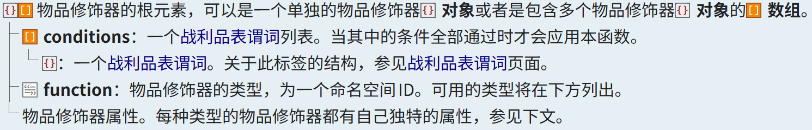
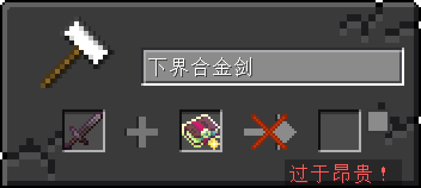
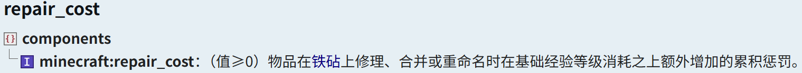

<FeatureHead
    title='自定义魔咒的综合应用'
    authorName='七柏'
    avatarUrl='../../_authors/七柏.jpg'
    cover = '../_assets/3.png'
    :socialLinks="[
        { name: 'BiliBili', url: 'https://space.bilibili.com/405830542' }
    ]"
    :extraAuthors="[
        {
            authorName: 'Antares',
            socialLinks: [
                { name: 'BiliBili', url: 'https://space.bilibili.com/2127740148' }
            ],
            avatarUrl: '../../_authors/Antares.jpg'
        },
        {
            authorName: '晓舒迢',
            socialLinks: [
                { name: 'BiliBili', url: 'https://space.bilibili.com/402383436' }
            ],
            avatarUrl: '../../_authors/晓舒迢.jpg'
        }
    ]"
/>

## 摘 要

在 1.21 本前, 数据包还只能对游戏内少量的内容进行增删, 如需创作新鲜的效果则需要借助于函数文件 (mcfunction), 由于在这之前 Mojang 所提供的触发器有限 (进度、统计信息等), 玩家经常需要编写很复杂的函数用于事件监听, 从性能和灵活性角度来说都非常受限. 自定义魔咒是 1.21 引入的一个技术性更新, 其将魔咒数据化驱动, 为数据包提供了多种触发器与效果器, 以此来实现旧版本难以完成甚至无法实现的功能. 

本文系统梳理了附魔机制的核心要素 (包括附魔等级、物品附魔能力、魔咒权重与修正等级)、铁砧系统的经验惩罚模型, 并重点解析了自定义魔咒的定义结构、效果组件设计及其高级应用场景. 通过结合实体触发器 (如 post_attack、location_changed、tick) 与多样化的效果器 (如 run_function、apply_impulse、explode、replace_block 等), 开发者可构建高度灵活且低耦合的游戏逻辑. 此外, 文章还探讨了在不同游戏版本 (尤其是 1.21.5 前后) 中利用隐式装备槽实现玩家或生物事件监听的技术演进, 并展示了社区中多个典型实践案例.

## 1. 引言

Minecraft 自诞生以来, 凭借其高度开放的沙盒机制和持续迭代的内容生态, 吸引了大量玩家与创作者投身于地图、玩法与机制的深度定制. 在 Java 版中, 数据包 (Data Pack) 作为官方支持的非模组化扩展手段, 长期以来承担着规则调整、战利品重定义、函数自动化等核心功能. 然而, 在 1.21 版本之前, 数据包的能力边界十分明确：它缺乏对“事件”的原生响应能力. 开发者若希望实现“当玩家攻击时触发某效果”或“生物落地时生成粒子”这类动态交互, 往往需要借助进度 (Advancement) 系统间接监听, 或通过高频 tick 函数轮询状态——这不仅导致逻辑冗余、可读性差, 更在复杂场景下显著拖累服务器性能, 尤其在 Folia 等新型多线程服务端架构中几乎不可行.

这一困境在 Minecraft 1.21 的“自定义魔咒” (Custom Enchantments) 机制引入后迎来转机. 该更新将魔咒从静态属性彻底转变为可编程的数据驱动实体, 通过在魔咒定义中嵌入触发器 (Triggers) 与效果器 (Effects), 实现了对游戏内关键行为 (如攻击、移动、挖掘、受击等) 的直接捕获与响应. 更重要的是, 这些逻辑由游戏引擎原生调度, 无需依赖外部函数循环, 从而在保证效果丰富性的同时, 大幅降低资源开销.

自定义魔咒的出现, 不仅重新定义了“附魔”的语义——从单纯的属性加成拓展为通用事件处理器——也为数据包开发者提供了一套轻量、高效、高兼容性的新范式. 无论是实现武器特效、环境互动、生物 AI 增强, 还是在 Folia 服务端构建无 tick 的高性能玩法, 自定义魔咒都展现出前所未有的潜力.

本文旨在系统梳理自定义魔咒的技术原理与应用方法. 首先回顾附魔与铁砧机制的基础规则, 继而深入解析魔咒定义中的关键字段 (尤其是 min_cost/max_cost 与 effect 组件) , 随后分类介绍各类触发器与效果器的功能特性, 并结合版本演进探讨其在生物与玩家事件监听中的实践策略. 最后, 通过社区典型案例展示其在实际项目中的强大表现力, 为数据包开发者提供一套完整的参考框架与设计思路.

## 2. 附魔

在开始讲解魔咒之前, 我们先要了解与其直接相关的一个游戏机制 —— 附魔 (Enchanting) 是一种为不具有魔咒的物品随机生成一个或多个魔咒的方式[^1]. 这是玩家在游戏中最能直接体验到的魔咒获取渠道与用途. 原版游戏中存在多种魔咒获取方式, 按作弊与非作弊区分, 大致可分为: 

* **作弊类**: /enchant, /item, /loot, /data (不可直接对玩家操作);

* **非作弊类**: 附魔台, 宝箱战利品, 钓鱼战利品, 宝库战利品, 村民交易, 袭击生物掉落, 自然生物掉落(普通或困难模式下).

在上述方式中, 除去 /enchant 直接指定魔咒和 /data 这种直接对 nbt 进行修改的操作外, 其他操作都直接或间接通过物品修饰器[^8]进行实现.

### 2.1. 附魔属性

一次附魔操作由以下因素共同决定: 附魔等级、附魔能力 (物品)、挑选权重 (魔咒)、最大和最小修正附魔等级 (魔咒)[^2]。

$\textbf{2.1.1.}$ **附魔等级**[^2][^8][^12]

通过常规途径获得附魔的附魔等级如下表所示:

|                             操作                             |   附魔等级   |
| :----------------------------------------------------------: | :----------: |
|                          附魔台附魔                          | 1-30 levels  |
|               钓鱼和要塞、丛林神庙的箱子战利品               | 5-22 levels  |
|                 末地城、远古城市的箱子战利品                 | 20-39 levels |
|               试炼密室的箱子战利品和宝库战利品               | 0-20 levels  |
|                     远古城市的箱子战利品                     | 30-50 levels |
|                           村民交易                           | 5-19 levels  |
| 生物天然装备 (可在[魔咒提供器](https://zh.minecraft.wiki/w/魔咒提供器定义格式#魔咒提供器)定义文件中调整) | 5-22 levels  |

通过作弊获得:

作弊手段中经历完整附魔流程的包括 `/loot` 以及 `/item` 的子命令 `/item modify`, 它们均使用物品修饰器[^8]的方式向物品添加魔咒.

	
	
中文 Minecraft Wiki - 物品修饰器#主要格式

其中, 与附魔相关的修饰器有 4 个, 分别是：

- [enchanted_count_increase](https://zh.minecraft.wiki/w/物品修饰器#enchanted_count_increase): 决定了指定魔咒对该物品数量的影响;
- [enchant_randomly](https://zh.minecraft.wiki/w/物品修饰器#enchant_randomly): 为物品附上一个随机的魔咒. 魔咒的等级也是随机的;
- [enchant_with_levels](https://zh.minecraft.wiki/w/物品修饰器#enchant_with_levels): 使用指定的魔咒等级附魔物品 (大约等效于使用这个等级的附魔台附魔物品);
- [set_enchantments](https://zh.minecraft.wiki/w/物品修饰器#set_enchantments): 直接设置物品的魔咒.

其中 enchant_randomly 与 enchant_with_levels 两个修饰器会参与传递附魔等级的上下文.

$\textbf{2.1.2.}$ **附魔能力 (物品)**[^2]

::: tip 关于游戏内物品附魔能力
详见[附魔 (物品修饰) #附魔能力](https://zh.minecraft.wiki/w/%E9%99%84%E9%AD%94%EF%BC%88%E7%89%A9%E5%93%81%E4%BF%AE%E9%A5%B0%EF%BC%89#%E9%99%84%E9%AD%94%E8%83%BD%E5%8A%9B)
:::

物品的附魔能力组件 **(enchantable component)**[^9] 在 24w34a (1.21.2) 版本加入游戏, 其定义格式入下:

	
	
中文 Minecraft Wiki - 数据组件

$\textbf{2.1.3.}$ **(魔咒) 挑选权重 & 最大和最小修正附魔等级**[^5]

	
	
中文 Minecraft Wiki - 魔咒定义格式

- 魔咒的挑选权重由 **weight** 定义;
- 最大和最小修正附魔等级由 **max_level&min_level** 定义.

### 2.2. 魔咒生成

$\textbf{2.2.1.}$ **根据物品附魔能力修正附魔等级**

我们假设附魔等级为 $$c$$, 物品的附魔能力为 $$l$$, 则修正后的附魔等级 $$c'$$ 通过下列步骤计算获得[^2]:
为附魔等级添加物品附魔能力修正, 增值服从[三角分布](https://zh.wikipedia.org/wiki/三角形分布). $${\rm{randInt}}(k)$$ 用于生成在区间 $$[0,k-1]$$ 内均匀分布的随机整数;
$$
c'=c+1+{\rm{randInt}}\left(\left\lfloor\frac{l}{4}\right\rfloor+1\right)+{\rm{randInt}}\left(\left\lfloor\frac{l}{4}\right\rfloor+1\right)
$$
对修正的附魔等级进行波动调节, 其中 $${\rm{randFloat}}()$$ 用于生成在区间 $$[0,1)$$ 内的随机浮点数;
$$
{c'=\{1+0.15[{\rm randFloat}()+{\rm randFloat}()-1]\}c'}^{\rm [Java版]}
$$
对修正的附魔等级进行舍入操作, 并引入约束使其 $$1≤c'≤2^{31}$$.
$$
c'=\max{(\min{(c',2147483647)},1)}
$$
$\textbf{2.2.2.}$ **生成可选魔咒列表**

- 筛除不可附魔魔咒, ([灵魂疾行](https://zh.minecraft.wiki/w/灵魂疾行)、[迅捷潜行](https://zh.minecraft.wiki/w/迅捷潜行)、[风爆](https://zh.minecraft.wiki/w/风爆)) 不会出现在魔咒列表中; 
- 若非宝藏列表则不会出现宝藏魔咒; 
- 根据魔咒的 **primary_items** 字段[^6], 筛除掉不适用于目标物品的魔咒;
- 筛除修正附魔等级不在区间 $$[{\rm min\_cost}(c'),{\rm max\_cost}(c')]$$ 内的魔咒[^5], 若在区间内, 则选取满足的最大魔咒等级加入区间;

$\textbf{2.2.3.}$ **在可选魔咒列表中根据加权随机魔咒**

经过上述两个流程得到可选魔咒列表后, 游戏会根据魔咒自身的**挑选权重**对列表中的魔咒进行加权, 若本次附魔通过附魔台, 则随机函数会使用玩家的附魔种子 (XpSeed) 进行计算[^2][^4][^11].

::: tip 关于RNG附魔 (附魔台)
**RNG (Random Number Generator)** 即[随机数发生器](https://docs.oracle.com/en/java/javase/17/docs/api/java.base/java/util/Random.html). 附魔种子的生成使用实体自身的随机数发生器的结果. 根据当前的魔咒列表和物品附上的魔咒, 可以反推附魔种子, 根据附魔种子又可以推得实体随机数发生器种子. 通过丢弃物品等方式, 可以使得实体随机数发生器更新. 利用此项特性, 可以使附魔种子 "固定" 某一个可以获得指定魔咒的种子上, 从而进行精准地附魔[^4]. 
:::

### 2.3. 魔咒标签

 **魔咒标签 (Enchantment Tags)** 是魔咒的组合，用于控制魔咒的出现条件和一些基本功能[^6]。 自 1.21 更新引入魔咒定义格式后，魔咒的大部分属性都可以直接通过 JSON 字段来进行定义，但如果你要更完善地创作自定义魔咒，则还需要考虑魔咒标签。

本文从 Wiki 中筛选出了部分标签深度参与游戏机制的标签, 下表列出了这些标签及其负责的功能:

|          标签           |                             功能                             |
| :---------------------: | :----------------------------------------------------------: |
|         #curse          |    在提示框中以红色文本显示且不可被祛魔的魔咒 (诅咒魔咒).    |
|      #non_treasure      |                         非宝藏类魔咒                         |
|        #treasure        |                          宝藏类魔咒                          |
|  #in_enchanting_table   |       会出现在附魔台中的魔咒(默认仅包含#non_treasure)        |
| #on_mob_spawn_equipment |             会出现在随机生成生物所穿装备上的魔咒             |
|     #on_random_loot     |             会出现在战利品箱子内的战利品上的魔咒             |
|  #on_traded_equipment   |               会出现在交易中的附魔装备上的魔咒               |
|       #tradeable        |                会出现在交易中的附魔书上的魔咒                |
|   #double_trade_price   |                  要花费双倍绿宝石交易的魔咒                  |
|     #tooltip_order      | 影响在物品[提示框](https://zh.minecraft.wiki/w/提示框)中所显示魔咒的顺序 |

战利品相关:

|                标签                |                             功能                             |
| :--------------------------------: | :----------------------------------------------------------: |
|            #smelts_loot            | 使掉落的战利品经过[烧炼](https://zh.minecraft.wiki/w/烧炼)的魔咒 |
|  #prevents_bee_spawns_when_mining  |      使工具破坏蜂巢和蜂箱后不会释放激怒状态的蜜蜂的魔咒      |
| #prevents_decorated_pot_shattering | 使工具不会打破[饰纹陶罐](https://zh.minecraft.wiki/w/饰纹陶罐)的魔咒 |
|       #prevents_ice_melting        | 使工具不会将[冰](https://zh.minecraft.wiki/w/冰)打破成[水](https://zh.minecraft.wiki/w/水)的魔咒 |
|     #prevents_infested_spawns      | 允许工具破坏[虫蚀方块](https://zh.minecraft.wiki/w/虫蚀方块)而不生成其中生物的魔咒 |

## 3. 铁砧机制

通过将工具与附魔书(或携带魔咒的同种工具), 可将魔咒转移到工具上. 相比于合成两个相似物品上的魔咒, 使用附魔书的花费更少, 且能让物品获得在附魔台上无法得到的魔咒[^3].

虽说铁砧可以方便地将魔咒合并到工具上, 但每次铁砧操作 (重命名操作除外) 都会为物品增加 "累积惩罚", 这种累计惩罚会影响到后续在铁砧上进行操作所需要消耗的经验值, 假设物品第 n 次在进行铁砧操作受到的经验惩罚为 $f(n),~(n \in N)$, 又有 $f(0)=0, f(n+1)=2f(n)+1$, 易得式[^13]：
$$
f(n)=2^n-1, n \in N
$$
我们可以得到表格:

| 累计操作次数 | 累计经验惩罚 |
| :----------: | :----------: |
|      0       |      0       |
|      1       |      1       |
|      2       |      3       |
|      3       |      7       |
|      4       |      15      |
|      5       |      31      |
|      6       |      63      |
|    ......    |    ......    |

::: important
生存模式或冒险模式下, 铁砧单次只能进行耗费最高39级经验等级的操作. 如果消耗大于该经验等级, 铁砧将提示 "过于昂贵！" 并拒绝操作. 创造模式没有此限制.

创造模式下, 若单次操作需要消耗超过 2147483647 (32位有符号整数的最大值) 级经验等级, 则不会显示附魔花费, 无法取出 “操作完成” 的物品, 尽管其会被展示出来, 合成箭头上也不会有红色交叉.
:::

	
	
大于39级的操作会提示过于昂贵并拒绝操作 (生存或冒险模式)

累计惩罚组件 **(repair_cost component)**[^9] 定义格式见下:

	
	
中文 Minecraft Wiki - 数据组件

## 4. 自定义魔咒

魔咒在游戏内使用 `ENCHANTMENT` 注册表, 在数据包 `data/<命名空间>/enchantment` 目录内定义[^5].

	
	
中文 Minecraft Wiki - 魔咒定义格式

### 4.1. 最大和最小修正附魔等级

如上图所示, 给出了定义一个魔咒所需要的树结构. 效果清晰的字段本文不做过多赘述, 如有需要可以翻阅 [Wiki](https://zh.minecraft.wiki/w/魔咒定义格式) 页面查看. 本文主要关注魔咒的**最小/最大修正附魔等级**.

	
	
修正附魔等级格式

如果我们想自己向游戏内注册一个魔咒, 该如何实现呢? 在写完其它字段后, 我们关注到 <node type="int" name=" min_cost"/> 和 <node type="int" name=" max_cost"/> 这两个字段. Wiki 上关于这两个字段的描述是:

> 如果一个魔咒为 $n$ 级, <node type="int" name=" base"/> 为 $b$, <node type="int" name=" per_level_above_first"/>为 $p$, 则附魔等级为 $b+p(n−1)$. 如果一个魔咒在某一个等级时最大修正附魔等级小于最小修正附魔等级, 则这一等级的魔咒无法通过附魔台、物品修饰器或其他自然方式产生.

即, 在一次[附魔](#2.2 魔咒生成)中, 若魔咒等级对应的附魔等级恰好在最大修正附魔等级和最小修正附魔等级之间的区域, 则该等级魔咒可选. 附魔等级计算参见上文 [2.2. 魔咒生成](#2.2. 魔咒生成).

	
	

上图描述了保护 (protection) 魔咒的修正附魔等级曲线, 从图中可以清晰看出 1, 2, 3 级保护魔咒的附魔等级范围为 1-12, 12-23 和 23-34, 而第 4 级保护魔咒的最小修正附魔等级为 34 级, 超出附魔台所能提供的最大附魔等级 30 级, 故不易通过附魔台附魔得到 (需根据物品附魔能力计算后判断).

为了方便操作, 作者通过 [GeoGebra](https://www.geogebra.org/graphing?lang=zh_CN) 创建了一个可视化文件, 可在[附件](#V.I)中查看.

### 4.2. 魔咒效果

在 Minecraft 中, 魔咒效果依赖于效果组件 (Effect components) 实现. 在考虑创建一个魔咒事件流时, 我们核心要考虑的只有两个部分, 分别是**触发器**和**效果器**. 其在魔咒的 <node type="compound" name=" effect"/> 字段中被定义. 在事件之外, 魔咒效果组件还支持一些对物品效果的修改, 如为物品添加属性修饰、改变充能弩时使用的声音、改变三叉戟的声音. 

::: warning
此处所述的**触发器**和**效果器**分别对应Wiki[^5]中的**效果组件**和**魔咒效果**.
:::

$\textbf{4.2.1.}$ **触发器**

根据可向下传递的参数关系差异, 我们将触发器分为**值触发器**、**实体触发器**与**伤害免疫触发器**. 下面会**列出作者常用的**触发器 (完整的触发器列表参阅 Wiki[^5]), 并对其中几个特殊触发器进行讲解.

::: warning
为方便描述, 此处将**位置依赖的效果型组件**一并归入**实体触发器**中.
:::

- **值触发器**

  该类触发器会在上下文中传递一个值变量, 这个值可以是攻击伤害、保护系数、冷却时间、数量等.

  |     命名空间ID      |                            初始值                            |                             描述                             |
  | :-----------------: | :----------------------------------------------------------: | :----------------------------------------------------------: |
  | armor_effectiveness | 仅使用物品护甲值和盔甲韧性计算得到的[伤害减免](https://zh.minecraft.wiki/w/盔甲机制#伤害减免)比例 | 此物品提供的[伤害减免](https://zh.minecraft.wiki/w/盔甲机制#伤害减免)比例, 计算结果钳制在区间 $$[0,1]$$ 上. |
  |       damage        | 生物的[基础近战攻击力](https://zh.minecraft.wiki/w/近战攻击#基础近战攻击力) | 使用此物品攻击时造成的伤害, 即[魔咒攻击力](https://zh.minecraft.wiki/w/近战攻击#魔咒攻击力) |
  |  damage_protection  |                              0                               | 此物品提供的[魔咒保护系数](https://zh.minecraft.wiki/w/盔甲机制#保护魔咒机制). |

  值触发器效果比较常规, 在此不花费过多篇幅讲解.

- **实体触发器**

  该类触发器会在上下文中传递和事件相关的实体信息, 如实体数据、实体位置等.

  |          命名空间ID           |                           触发场景                           |                             补充                             |
  | :---------------------------: | :----------------------------------------------------------: | :----------------------------------------------------------: |
  |             tick              |               生物每个游戏刻都会触发一次此效果               |              可**装备在生物上**控制一些独立效果              |
  | post_piercing_attack[1.21.11] | · 生物主手持带有该魔咒效果组件的物品攻击其他实体后 · 玩家主手持带有该魔咒效果组件并且带有 `piercing_weapon` [数据组件](https://zh.minecraft.wiki/w/数据组件)的物品按下攻击键后. 触发间隔受 `minimum_attack_charge` 数据组件影响 |                     稳定的**左键监听**器                     |
  |           hit_block           | 玩家刚开始挖掘方块, 或箭、三叉戟实体击中方块. 忽略 <node type="list" name=" slots"/> 字段 **(仅主手手持触发)**. |                   用来进行一些**方块操作**                   |
  |          post_attack          | 攻击后触发此效果 (包括矛的两种攻击方式[新增：[JE 1.21.11](https://zh.minecraft.wiki/w/Java版1.21.11)] ) 箭和风弹伤害非生物实体不触发. 爆炸伤害等不触发. | 非常常用的触发器, 可以**装备在生物上**做一些攻击效果, 也可直接编辑**箭矢**的 nbt 添加该种触发器魔咒以实现独特效果 |
  |       location_changed        | · 生物所在的**方块位置**发生变动时 (即生物脚部坐标在方块边缘变化时) 触发此效果. · 生物落地时也会瞬间触发一次此效果. · 当附有此魔咒的物品刚被装备时也会瞬间触发一次此效果. · 玩家在旁观模式时此效果不生效, 切换出旁观模式的瞬间也会触发一次此效果. | 最常见的用法也是最直接的就是**监听玩家移动**. 由于其瞬发特性 (在一个上下文内触发), 也可以拿来做一些**强依赖时序**的效果 |

- **伤害免疫触发器**

  该类触发器会传入一个伤害类型的上下文, 结合谓词实现对特定伤害类型免疫.

$\textbf{4.2.2.}$ **效果器**

- **值效果器**

  和**值触发器**搭配使用, 用来对数值做一些运算.

- **其他效果器**

  |      命名空间ID      |                             效果                             |                             补充                             |
  | :------------------: | :----------------------------------------------------------: | :----------------------------------------------------------: |
  |        all_of        |                按照顺序依次应用各个实体效果.                 |                              -                               |
  |   apply_mob_effect   |   若作用实体为生物, 对其施加随机倍率、随机时长的状态效果.    |                              -                               |
  |  change_item_damage  | 修改当前物品 (触发此效果的物品) 的[耐久度](https://zh.minecraft.wiki/w/耐久度). 使用正值时将减少耐久度; 使用负值时将增加物品耐久度, 且增加值不受任何魔咒影响. |                              -                               |
  |    damage_entity     |                 对作用实体进行随机大小的伤害                 |                        可指定伤害类型                        |
  |       explode        |                    根据作用位置发生爆炸.                     | 原版唯一的高自由度爆炸来源, 可结合 tick 或 location_changed 触发器装备于盔甲架上来实现高度可控的爆炸生成 |
  |        ignite        |                        使作用实体着火                        | 原版唯一的实体着火借口, 搭配 location_changed 触发器的瞬发特性使用 |
  |    replace_block     |                         替换一个方块                         |                              -                               |
  |     replace_disk     |           替换实体周围的一个圆柱形状内的所有方块.            |                              -                               |
  |     run_function     | 运行指定的[函数](https://zh.minecraft.wiki/w/Java版函数), 以作用实体为命令执行者, 以作用位置为命令执行位置, 以作用实体的朝向为执行朝向, [权限等级](https://zh.minecraft.wiki/w/权限等级)为2级. |                  函数接口, 可承接自定义功能                  |
  | set_block_properties |                   设置一个方块的方块属性.                    |                   可以拿来做调试棒 (bushi                    |
  |   spawn_particles    |      生成单个[粒子](https://zh.minecraft.wiki/w/粒子).       |                  该粒子可以继承触发者动量.                   |
  |   apply_exhaustion   | 增加玩家的[消耗度](https://zh.minecraft.wiki/w/消耗度). 只对玩家有实际作用. |                    原版唯一的消耗度接口.                     |
  |    apply_impulse     | 为目标实体施加一个冲量. 可通过多次应用该魔咒效果叠加移动速度. |             玩家唯一的动量接口, 不用绕路实现了.              |

- **属性效果**

  可为生物添加临时的属性修饰符, 即可以生效但无法导出.

### 4.3. 高级用法

自定义魔咒本身除去为物品添加新效果之外, 得益于其多样化的触发器与效果器, 我们可以将其依附在物品媒介上来当做事件**监听器**使用. 

::: warning
在 1.21.5 前, 虽说所有生物均存在 `armor.body` 和 `saddle` 槽位, 但通过 `/item` 命令试图向其中置入物品仍会被拒绝, 但仍可使用 `/data` 命令对生物的槽位进行强制修改以实现对生物事件的监听, 但由于 `/data` 不可操作玩家, 致使这之前的版本玩家都不能有一个不占用显式槽位的方法使用魔咒触发器与效果器. 在 1.21.5 版本, 虽说可以通过 `/item` 向玩家的这两个槽位添加物品, 但在 `keepInventory` 规则为 `false` 时, 会出现死亡清空掉的 BUG. 玩家能稳定使用魔咒触发器与效果器的版本在 1.21.6+.
:::

$\textbf{4.3.1.}$ **监听生物**

在玩家事件监听方面, 成就系统提供了一系列直接的触发器, 统计信息搭配 tick 函数使用也可对玩家的部分操作进行持续监听. 但在之前的版本, 想要监听非玩家生物事件是一件让人头疼的事情, 但有了自定义魔咒之后, 我们只需要在生物的槽位上填充对应的魔咒物品, 即可在有限的范围内对生物事件进行监听处理.

$\textbf{4.3.2.}$ **监听玩家**

1.21.5+ 版本结合 `equippable` 组件, 使用 `/item` 命令向玩家隐式槽位安装魔咒触发器.

## 5. 关于魔咒驱动在 Folia 服务端的应用

Folia作为特殊的服务器核心, 在数据包方面以其坐牢般的编写难度闻名, 如函数 tick、data、screboard、function 等通通无法使用, 因此想要编写出丰富的玩法极其困难.
但在 1.21 后, 情况发生了变化: mc 加入了魔咒数据驱动, 丰富的魔咒组件及其效果器使大多数想法都有了实现的可能性. 在我和服务器另一位数据包开发者商议后, 决定将每种特殊武器的效果储存进自带的魔咒里, 并将该魔咒设置为诅咒使其成为武器固有的一部分. 如今九个月过去, 在这期间我积累了大量的魔咒编写经验和 folia 赤石心得, 直到现在我还记得使用魔咒前拿进度检测武器肘击怪物导致 tps 大跳水的那个下午.
具体实现个例可以点击[手册](https://docs.qq.com/aio/DT093Q1ZOV1NpdW5X?p=1vXgZJMFcv0pOUxwgQcO15) (数据包→武器)

> “魔咒, 轻而易举啊！”
> “坏了坏了！”
> “此存档已启用安全模式”

—— 晓舒迢

## 6. 社区作品

- [禁用苦力怕破坏](https://www.mcmod.cn/class/23093.html): 使用 `explode` 效果器实现的高自由度爆炸;

- [Motionomicon](https://modrinth.com/datapack/motionomicon): 使用 `apply_impulse` 效果器实现的玩家 Motion 编辑;

  > 关于玩家动量, 上一代技术利用的是末影水晶爆炸, 社区里也有一个库 [Player Motion](https://modrinth.com/datapack/player_motion).

- [[数据包]1.21.5+饰品槽](https://www.bilibili.com/video/BV1khMwzEED1/?spm_id_from=333.1387.homepage.video_card.click): 使用玩家 `armor.body` 槽位结合展示实体UI技术实现的玩家饰品槽;

- [Classic KB - 低版本 KB 模拟](https://www.bilibili.com/video/BV1iCvAzVEDu): 使用 `post_attack` 触发器结合水晶 Motion 实现的低版本 KB 效果模拟;

- [AMR Bot - 摔落保护模块](https://www.bilibili.com/video/BV1TrUpBeErs): 使用 `location_changed` 触发器实现的高空摔落保护;

- [ICT 服务器 - 数据包内容](https://docs.qq.com/aio/DT093Q1ZOV1NpdW5X?p=1vXgZJMFcv0pOUxwgQcO15): 在 folia 端借助魔咒驱动实现的丰富效果玩法.

## 7. 结论与展望

Minecraft 1.21 引入的自定义魔咒机制, 让数据包开发者不再依赖复杂的函数轮询, 就能直接响应游戏中的关键事件 (如攻击、移动、挖掘等). 通过组合触发器和效果器, 魔咒不仅能实现传统附魔效果, 还能作为轻量级的“事件监听器, 用于武器特效、生物行为控制、玩家交互等多种场景.

尤其在 Folia 等限制 tick 函数的服务端上, 自定义魔咒凭借原生调度、低性能开销的优势, 成为构建高性能玩法的重要工具. 社区已涌现出许多实用案例, 如摔落保护、击退模拟、粒子动量控制等, 充分展现了其灵活性和实用性.

未来, 随着更多触发器和效果器的加入, 以及对玩家隐式装备槽支持的完善, 自定义魔咒有望覆盖更广泛的交互需求, 成为原版内容创作的核心手段之一. 

## 致谢

- 感谢 [Antares](https://space.bilibili.com/123178313) 关于 `spawn_particles`  效果器功能上的指导;
- 感谢 [晓舒迢](https://space.bilibili.com/402383436) 关于 folia 端魔咒使用经验的分享.

## 附件

**I. 修正附魔等级可视化文件**: [cost_level.ggb](./cost_level.ggb);

## 参 考 文 献

[^1]:[中文 Minecraft Wiki. 魔咒[DB/OL]. (2025-12-02)[2025-12-06].](https://zh.minecraft.wiki/w/魔咒)
[^2]:[中文 Minecraft Wiki. 附魔 (物品修饰) [DB/OL]. (2025-11-25)[2025-12-06].](https://zh.minecraft.wiki/w/附魔 (物品修饰) )
[^3]:[中文 Minecraft Wiki. 铁砧机制[DB/OL]. (2025-12-05)[2025-12-06].](https://zh.minecraft.wiki/w/铁砧机制)
[^4]:[中文 Minecraft Wiki. 附魔台[DB/OL]. (2025-11-30)[2025-12-06].](https://zh.minecraft.wiki/w/附魔台)
[^5]:[中文 Minecraft Wiki. 魔咒定义格式[DB/OL]. (2025-11-13)[2025-12-06].](https://zh.minecraft.wiki/w/魔咒定义格式)
[^6]:[中文 Minecraft Wiki. Java版标签[DB/OL]. (2025-11-18)[2025-12-06].](https://zh.minecraft.wiki/w/Java版标签)
[^7]:[中文 Minecraft Wiki. 命令/enchant[DB/OL]. (2025-11-25)[2025-12-06].](https://zh.minecraft.wiki/w/命令/enchant)
[^8]:[中文 Minecraft Wiki. 物品修饰器[DB/OL]. (2025-11-30)[2025-12-06].](https://zh.minecraft.wiki/w/物品修饰器)
[^9]:[中文 Minecraft Wiki. 数据组件[DB/OL]. (2025-12-05)[2025-12-06].](https://zh.minecraft.wiki/w/数据组件)
[^10]:[中文 Minecraft Wiki. 槽位[DB/OL]. (2025-11-13)[2025-12-06].](https://zh.minecraft.wiki/w/槽位)
[^11]:[中文 Minecraft Wiki. 玩家[DB/OL]. (2025-11-19)[2025-12-06].](https://zh.minecraft.wiki/w/玩家)
[^12]:[中文 Minecraft Wiki. 魔咒提供器定义格式[DB/OL]. (2025-11-13)[2025-12-06].](https://zh.minecraft.wiki/w/魔咒提供器定义格式)

[^13]: [肥啾U_ruby. 问题答疑杂集: F13-怎么给你的武器装备用最佳顺序附魔？[EB/OL]. (2022-01-06)[2025-12-06]](https://www.bilibili.com/opus/612489536438520248?spm_id_from=333.1387.0.0)
[^14]:[大佬萌茶. 数据包教程: 教你如何创造新附魔！超详细-我的世界数据包教程 [Z/OL]. (2025-12-06)[2025-12-08]](https://www.bilibili.com/video/BV1d62XBZEdd)
[^15]:[蓝染惣左介-. mc魔咒的那些事: #1 魔咒文件格式 [Z/OL]. (2025-12-03)[2025-12-08]](https://www.bilibili.com/video/BV1iVSeBLEYm)
[^16]: [中文 Minecraft Wiki. 战利品上下文[DB/OL]. (2025-11-22)[2025-12-08].](https://zh.minecraft.wiki/w/战利品上下文)
