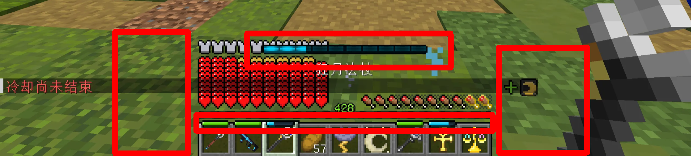
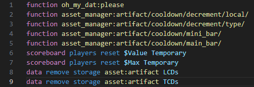

<FeatureHead
    title = 'TheSkyBlessing数据包解析'
    authorName = TODO
    avatarUrl = '../../_authors/TODO.jpg'
    :socialLinks="[
        { name: 'BiliBili', url: 'https://space.bilibili.com/TODO' },
    ]"
    cover='18b92d0c-50de-4329-95cb-083241f90f1a.png'  
    resourceLink = 'https://github.com/ProjectTSB/TheSkyBlessing'
/>

# 前言

TheSkyBlessing（常见译名天空之祝，下面简称 TSB）是一个由日本团队主导的地图项目，基于原版数据包和资源包开发，地图内为类空岛生存挑战，地图中共有 90 个不同主题的空岛可以探索，玩家的目标是解放所有空岛，有明确的主线和攻略进度，期间需要挑战数百种不同的怪物，十余场 BOSS 战，最重要的上千种神器可以获取。玩家既可以选择物理或魔法流派，也可以选择火/水/雷/冰以及神明祝福提供的被动形成搭配策略，对于拥有不同抗性的敌人，也需要考虑切换策略，后期整体策略性也随玩家可获得的内容增长

笔者在实际游玩中找到了不少高版本制作的灵感，尤其是数据包开发，TSB 在实现自定义资产库，类计算机应用架构和数据包性能优化上提供了很多很好的解决方案，尤其是其中运用了很多游戏外的编程概念，实际地图的游玩体验也很流畅，对其的解析非常有助于数据包开发进阶和编程理解，故作此作为学习笔记，这篇解析也会分为几个部分完成

虽然 TSB 团队已将数据包主体放在 github 上开源并且 wiki 已经提供了不少指导，但由于日语翻译困难以及仍然涉及第三方作品，本篇重点会放在如何复刻以及用在自己地图中的思路上。由于内容多，以及有些实现过程可能封装了太多层，口头解释难免不清楚，故一些分析缺失或数据包基础的部分不再赘述，有学习兴趣的读者推荐自行下载，国内网站上也已有汉化版

# tick 函数——常用模块内容

在数据包最顶层的 load 和 tick 函数中有一些常用的内容单独列出如下，这些全局相关的数据在之后也会提到

## 世界计时

/time query gametime 命令可以获取世界存档打开的时间，将其存储可以为每一 tick 的操作提供唯一的标识符

```mcfunction
execute store result storage global Time int 1 run time query gametime
```

## 多人游戏检测

```mcfunction
execute store result score $PlayerCount Global if entity @a
```

## 间隔计时器

适用于不需要每 tick 执行的函数，如每秒才执行一次，这里是每 4t 执行一次（0.2s）

```mcfunction
scoreboard players add $4tInterval Global 1
scoreboard players operation $4tInterval Global %= $4 Const
execute if score $4tInterval Global matches 0 run function core:tick/4_interval
```

## 玩家事件

全局 tick 函数的下一层即是玩家的 tick 函数，一些常用的玩家事件列举如下

```mcfunction
# player/load.mcfunction

scoreboard objectives add UsedMilk used:milk_bucket {"text":"牛奶使用检查"}
scoreboard objectives add UsedTotem used:totem_of_undying {"text":"图腾使用检查"}
scoreboard objectives add RecipeVersion dummy {"text":"用于检查商人交易内容更新的分数"}
scoreboard objectives add FirstJoinEvent custom:play_time {"text":"事件: 首次加入"}
scoreboard objectives add RejoinEvent custom:leave_game {"text":"事件：重新加入"}
scoreboard objectives add DeathEvent deathCount {"text":"事件：死亡"}
scoreboard objectives add RespawnEvent custom:time_since_death {"text":"事件: 重生"}
scoreboard objectives add ClickCarrotEvent used:carrot_on_a_stick {"text":"事件：点击胡萝卜钓竿"}
scoreboard objectives add Sneak custom:sneak_time {"text":"事件：潜行"}
scoreboard objectives add Elytra custom:aviate_one_cm {"text":"事件: 鞘翅"}
scoreboard objectives add DropEvent custom:drop {"text":"事件：物品掉落"}
```

```mcfunction
execute if entity @s[scores={DeathEvent=1..}] run tag @s add Death
execute if entity @s[scores={FirstJoinEvent=1}] run function core:handler/first_join
execute if entity @s[scores={RejoinEvent=1..}] run function core:handler/rejoin
execute if entity @s[scores={RespawnEvent=1}] run function core:handler/respawn
```

# load 函数——数据迁移字段和生产环境区分

数据包顶层的 load 函数分为两部分——load 主函数和 load_once 函数，其中创建计分板等初始化操作实际在 load_once 函数中完成。load 主函数有以下片段

```mcfunction
data modify storage global IsProduction set value true
execute if data storage global {IsProduction:1b} unless data storage global GameVersion run function core:load_once
execute if data storage global {IsProduction:0b} run function core:load_once

function core:migration/
```

```mcfunction
# function core:migration/
execute if data storage global {GameVersion:"v1.0.0"} run function core:migration/v1.0.1/
execute if data storage global {GameVersion:"v1.0.1"} run function core:migration/v1.0.2/
```

load_once 函数顶部有以下片段

```mcfunction
# function core:load/once
data modify storage global GameVersion set value "v1.0.2"
data modify storage global FirstGameVersion set value "v1.0.2"
data modify storage global ExpectedDatapackCount set value 22

# ... （各类计分板初始化）
```

补充一下前置知识，“development”和“production”是计算机应用开发中的两个术语，分别表示生产（仍处于开发中的状态）和发布（开发结束交给用户使用的状态）。玩家在论坛上下载的一定是发布版，load 函数中 IsProduction 这个变量一定是 true，而地图制作者开发数据包的过程中这个值则是 false，上线前才将其改为 true

## 实现解析

这部分内容主要是用于地图在发布后的数据迁移，即玩家可以在保留数据的同时更新地图（一般是替换数据包或 level.dat 文件）。目前最新的地图版本是 1.0.2，假使我在地图版本是 1.0.0 的时候下载下来游玩，这个数据包第一次加载流程列举如下：

1. 检测到 storage 中没有 GameVersion 字段
2. 判断为第一次进入地图
3. 执行 load_once 函数，记录当前游戏版本为 1.0.0
4. 后续进入地图时，检测到 GameVersion 字段，不再重复执行 load_once 函数

现在地图更新为 1.0.1 版本，数据包中 migration 函数中增加了这一行以及对应的数据迁移函数，在上面流程的基础上，新的加载流程如下

```mcfunction
execute if data storage global {GameVersion:"v1.0.0"} run function core:migration/v1.0.1/
```

1. 检测到 GameVersion 字段，不再执行 load_once 函数
2. 执行 migration 函数，发现 GameVersion 字段和旧的版本号匹配，执行新版本的数据迁移函数，更新 GameVersion 字段为最新的版本号
3. 后续进入地图时，检测到 GameVersion 字段，依然不再重复执行 load_once 函数

由此可以发现这么处理后 load_once 函数是字面意义从进入地图开始只执行了一次，后续版本更新的数据迁移函数也只会在更新版本后的第一次进入地图执行一次。以上是玩家实际游玩地图时的状态，地图制作者开发数据包的状态就简单多了，将 IsProduction 字段改为 false 后 load_once 每次进入地图都会执行，地图版本必定是最新的，无需处理数据迁移问题

整体而言，在 load 函数中添加这些内容都是服务于玩家能随后续更新继续游玩的需求，整体有为碟醋包盘饺子的味道，但如果地图后续没有破坏性更新或需要频繁修 bug，这么处理也不失为一种选择

# 自定义 UI——使用 font 制作物品栏物品冷却条

## 实现效果


玩家屏幕上的 UI 可以拆分为以下几部分介绍（请手动忽略装了苹果核模组的饱食度显示）

- 主冷却条
- 左侧装备冷却条
- 中间快捷栏冷却条
- 右侧玩家效果状态



- 主冷却条
  -- 显示主手物品的冷却时间，和快捷栏物品顶部显示的相同，只有手持处于冷却状态的物品才会显示出来
- 左侧装备冷却条
  -- 显示身上装备四个部位以及副手物品各自的冷却时间，只有装备技能处于冷却装备才会显示出来
- 中间快捷栏冷却条
  -- 显示快捷栏中的九个物品各自的冷却时间，没有冷却或冷却完毕的物品上不会显示出来
- 右侧玩家效果状态
  -- 顾名思义显示玩家所处的效果状态，但这里指的不是原版的各种药水状态，这里的特殊状态都是地图素材中自定义的内容，正面效果和负面效果分开两行，比如这里手持新月护符而获得了一个周期获得额外生命值的“新月”效果，带有“+”号代表正面效果，不同的自定义特殊效果有各自不同图标。这部分涉及资产库的内容留到以后介绍

## 实现解析

首先明确的是，实现自定义 ui 的关键一定是一段在 tick 函数中执行的 title 命令。从玩家使用一个物品使其进入冷却状态开始来分析 tick 函数到底做了什么，整体步骤如下

1. 减少冷却时间
2. 计算当前冷却时间和最大冷却时间的百分比
3. 将百分比的数值映射为一个 unicode 字符
4. 将这个字符和与其配套的资源包字体封装为一个文本组件，在不同字符之间插入空格以达到调整 UI 坐标的效果
5. 使用/title 将这个文本组件显示到玩家屏幕 actionbar 位置上

这里只介绍后面几步，整体的命令片段如下所示。这里需要注意的是由于最后是使用空格调整 UI 坐标，所以把所有 UI 放到同一个文本组件可能会导致挤压错位，为此精确定位的部分需要单独提出来，如这里分为了 minibar（装备和快捷栏冷却条）、mainbar（主冷却条）和 effect（玩家状态）三部分，下面均以 minibar 部分为例



从资源包开始。在 font 目录下有一个 minibar/common 字体，其对应的位图是冷却进度条的图片资源，进度条正常情况下共有 18 种状态，分别对应\u1000 到\u1016 这 17 个字符，还有一种空字符，其中字符偏移设置为-42 可以使进度条刚好显示在快捷栏物品上方的位置


在资源包定义好后，在游戏中使用 title 指定这个字体以及要显示的字符即可将图标显示到玩家屏幕上。执行以下命令，可以看到\u1000 字符对应的满的绿色进度条图标显示到正中的快捷栏上方（actionbar 位于正中，又设置了-42 的向下偏移）

```mcfunction
title @s actionbar [{"text":"\u1000","font":"cooldown/mini_bar/common"}]
```


回到案例中，最终显示到玩家屏幕的/title 命令在玩家的 tick 函数中运行，这里 minibar、mainbar 和 effect 三部分存储数据被以 nbt 的格式传入到文本组件中（这里用到了 oh_my_dat 会在后面介绍），并且根据游戏模式做了区分，此时解析的首要任务就变成了找到传入存储的位置

```mcfunction
function oh_my_dat:please
title @s[gamemode= spectator] actionbar [{"text":""},{"storage":"oh_my_dat:","nbt":"_[-4][-4][-4][-4][-4][-4][-4][-4].Message.MainBar[]","interpret":true,"separator":""},{"storage":"oh_my_dat:","nbt":"_[-4][-4][-4][-4][-4][-4][-4][-4].Message.Effect[]","interpret":true,"separator":""}]
title @s[gamemode=!spectator] actionbar [{"text":""},{"storage":"oh_my_dat:","nbt":"_[-4][-4][-4][-4][-4][-4][-4][-4].Message.MiniBars[]","interpret":true,"separator":""},{"storage":"oh_my_dat:","nbt":"_[-4][-4][-4][-4][-4][-4][-4][-4].Message.MainBar[]","interpret":true,"separator":""},{"storage":"oh_my_dat:","nbt":"_[-4][-4][-4][-4][-4][-4][-4][-4].Message.Effect[]","interpret":true,"separator":""}]
data remove storage oh_my_dat: _[-4][-4][-4][-4][-4][-4][-4][-4].Message
```

于是在 asset_manager:/artifact/cooldown/mini_bar/construct_message.m 这个宏定义的函数中有这么一段用于封装文本组件。可以看到这个宏的参数最终都会转换为 unicode 的一部分，根据前面资源包的定义，即参数需是 1000 到 1016 或 9999 这些数，分别对应身上装备四个部位、副手物品和快捷栏的九个物品的图标，不同图标之间使用空格分隔（这里的 space 字体会在最后附上）

```mcfunction
$data modify storage oh_my_dat: _[-4][-4][-4][-4][-4][-4][-4][-4].Message.MiniBars set value [
    '{"text":"\\uC151","font":"space"}',
    '{"text":"\\u$(Head)","font":"cooldown/mini_bar/head"}',

    '{"text":"\\uC024","font":"space"}',
    '{"text":"\\u$(Chest)","font":"cooldown/mini_bar/chest"}',

    '{"text":"\\uC024","font":"space"}',
    '{"text":"\\u$(Legs)","font":"cooldown/mini_bar/legs"}',

    '{"text":"\\uC024","font":"space"}',
    '{"text":"\\u$(Feet)","font":"cooldown/mini_bar/feet"}',

    '{"text":"\\u0003","font":"space"}',
    '{"text":"\\u$(Offhand)","font":"cooldown/mini_bar/offhand"}',

    '{"text":"\\u0011","font":"space"}',
    '{"text":"\\u$(Hotbar0)","font":"cooldown/mini_bar/common"}',

    '{"text":"\\u0002","font":"space"}',
    '{"text":"\\u$(Hotbar1)","font":"cooldown/mini_bar/common"}',

    '{"text":"\\u0002","font":"space"}',
    '{"text":"\\u$(Hotbar2)","font":"cooldown/mini_bar/common"}',

    '{"text":"\\u0002","font":"space"}',
    '{"text":"\\u$(Hotbar3)","font":"cooldown/mini_bar/common"}',

    '{"text":"\\u0002","font":"space"}',
    '{"text":"\\u$(Hotbar4)","font":"cooldown/mini_bar/common"}',

    '{"text":"\\u0002","font":"space"}',
    '{"text":"\\u$(Hotbar5)","font":"cooldown/mini_bar/common"}',

    '{"text":"\\u0002","font":"space"}',
    '{"text":"\\u$(Hotbar6)","font":"cooldown/mini_bar/common"}',

    '{"text":"\\u0002","font":"space"}',
    '{"text":"\\u$(Hotbar7)","font":"cooldown/mini_bar/common"}',

    '{"text":"\\u0002","font":"space"}',
    '{"text":"\\u$(Hotbar8)","font":"cooldown/mini_bar/common"}',

    '{"text":"\\uC089","font":"space"}'
]
```

## 复刻效果

去掉上面宏函数所需的参数即可直接运行，引入资源包中必要的 space 字体，最终 ui 显示的定位效果如下

```mcfunction
title @s actionbar [ \
    {"text":""}, \
    \
    {"text":"\uC151","font":"space"}, \
    {"text":"\u1000","font":"cooldown/mini_bar/head"}, \
    \
    {"text":"\uC024","font":"space"}, \
    {"text":"\u1000","font":"cooldown/mini_bar/chest"}, \
    \
    {"text":"\uC024","font":"space"}, \
    {"text":"\u1000","font":"cooldown/mini_bar/legs"}, \
    \
    {"text":"\uC024","font":"space"}, \
    {"text":"\u1000","font":"cooldown/mini_bar/feet"}, \
    \
    {"text":"\u0003","font":"space"}, \
    {"text":"\u1000","font":"cooldown/mini_bar/offhand"}, \
    \
    {"text":"\u0011","font":"space"}, \
    {"text":"\u1000","font":"cooldown/mini_bar/common"}, \
    \
    {"text":"\u0002","font":"space"}, \
    {"text":"\u1000","font":"cooldown/mini_bar/common"}, \
    \
    {"text":"\u0002","font":"space"}, \
    {"text":"\u1000","font":"cooldown/mini_bar/common"}, \
    \
    {"text":"\u0002","font":"space"}, \
    {"text":"\u1000","font":"cooldown/mini_bar/common"}, \
    \
    {"text":"\u0002","font":"space"}, \
    {"text":"\u1000","font":"cooldown/mini_bar/common"}, \
    \
    {"text":"\u0002","font":"space"}, \
    {"text":"\u1000","font":"cooldown/mini_bar/common"}, \
    \
    {"text":"\u0002","font":"space"}, \
    {"text":"\u1000","font":"cooldown/mini_bar/common"}, \
    \
    {"text":"\u0002","font":"space"}, \
    {"text":"\u1000","font":"cooldown/mini_bar/common"}, \
    \
    {"text":"\u0002","font":"space"}, \
    {"text":"\u1000","font":"cooldown/mini_bar/common"}, \
    \
    {"text":"\uC089","font":"space"}, \
]
```


到这一步为止，使用资源包 font 字体实现显示进度条图标就已经完成了，由于这一步用到了宏，所以回到最开始前两步只需解决获取进度条对应物品的冷却时间百分比和转换为宏参数即可，但 TSB 中计算冷却时间由于涉及到资产库介绍太过繁琐，自定义 UI 的部分先到此为止

# 将经验指示器改造为法力值指示器

## 实现效果


这里我的最大法力值为 428（MP 值，后面仍然用法力值的说法），可以看到在等级位置显示成当前的数值，并且经验条能够随法力值百分比变化

## 实现解析

同样明确，为了手动控制经验条同时规避原版经验球机制的干扰，一定是由一个在 tick 函数中执行 xp 命令的函数来完成。实现这个功能的主要函数有两个，player_manager:mp/viewer/check_xpbar 函数随玩家 tick 执行，其主要内容如下


上面的函数没有分隔可能显得有些混乱，实际我们只需要知道主要实现只需要调用 adjust_xpbar 函数那行即可，其他部分都是服务于计算用的，所以 check_xpbar 函数的功能可以这么划分

1. 获取玩家当前经验和当前等级最大经验的百分比（玩家数据中的 xp_p 属性）
2. 计算当前法力值和最大法力值的百分比
3. 如果玩家当前等级和当前法力值不相等（即法力值发生改变），或者经验条百分比和法力值百分比的计算结果不一致（即最大法力值发生改变），则执行更新
4. 执行 adjust_xpbar 函数进行更新，根据当前法力值百分比设置经验条长度，并将等级设置为当前法力值

百分比计算和比较这部分内容使用计分板很容易就能完成，设置等级使用/xp 命令也可以直接完成，问题在于如何实现控制经验值条和百分比相符，这就来到了这个系统中最巧妙的部分了。adjust_xpbar 函数的命令如下

```
xp set @s 40 levels
xp set @s 0 points
scoreboard players operation $NowMP Temporary = @s MP
scoreboard players operation $NowMP Temporary /= $10 Const
scoreboard players operation $NowLvP Temporary *= $2^24 Const
scoreboard players operation $NowLvP Temporary *= $2 Const
execute if score $NowLvP Temporary matches ..-1 run xp add @s 128 points
scoreboard players operation $NowLvP Temporary *= $2 Const
execute if score $NowLvP Temporary matches ..-1 run xp add @s 64 points
scoreboard players operation $NowLvP Temporary *= $2 Const
execute if score $NowLvP Temporary matches ..-1 run xp add @s 32 points
scoreboard players operation $NowLvP Temporary *= $2 Const
execute if score $NowLvP Temporary matches ..-1 run xp add @s 16 points
scoreboard players operation $NowLvP Temporary *= $2 Const
execute if score $NowLvP Temporary matches ..-1 run xp add @s 8 points
scoreboard players operation $NowLvP Temporary *= $2 Const
execute if score $NowLvP Temporary matches ..-1 run xp add @s 4 points
scoreboard players operation $NowLvP Temporary *= $2 Const
execute if score $NowLvP Temporary matches ..-1 run xp add @s 2 points
scoreboard players operation $NowLvP Temporary *= $2 Const
execute if score $NowLvP Temporary matches ..-1 run xp add @s 1 points
xp set @s 0 levels
scoreboard players operation $NowMP Temporary *= $2^20 Const
scoreboard players operation $NowMP Temporary *= $2 Const
execute if score $NowMP Temporary matches ..-1 run xp add @s 1024 levels
scoreboard players operation $NowMP Temporary *= $2 Const
execute if score $NowMP Temporary matches ..-1 run xp add @s 512 levels
scoreboard players operation $NowMP Temporary *= $2 Const
execute if score $NowMP Temporary matches ..-1 run xp add @s 256 levels
scoreboard players operation $NowMP Temporary *= $2 Const
execute if score $NowMP Temporary matches ..-1 run xp add @s 128 levels
scoreboard players operation $NowMP Temporary *= $2 Const
execute if score $NowMP Temporary matches ..-1 run xp add @s 64 levels
scoreboard players operation $NowMP Temporary *= $2 Const
execute if score $NowMP Temporary matches ..-1 run xp add @s 32 levels
scoreboard players operation $NowMP Temporary *= $2 Const
execute if score $NowMP Temporary matches ..-1 run xp add @s 16 levels
scoreboard players operation $NowMP Temporary *= $2 Const
execute if score $NowMP Temporary matches ..-1 run xp add @s 8 levels
scoreboard players operation $NowMP Temporary *= $2 Const
execute if score $NowMP Temporary matches ..-1 run xp add @s 4 levels
scoreboard players operation $NowMP Temporary *= $2 Const
execute if score $NowMP Temporary matches ..-1 run xp add @s 2 levels
scoreboard players operation $NowMP Temporary *= $2 Const
execute if score $NowMP Temporary matches ..-1 run xp add @s 1 levels
scoreboard players reset $NowMP Temporary
```

这个函数用到了两次二进制分解算法，首先介绍下这个算法（整数溢出等计算机基础不再补充）

> 通过二进制数的不断左移（×2）和检查符号位（负数表示最高位为 1）来检测每个二进制位并为其分配权重，适用于需要将浮点数转换为整数的场景

大致可以分解为如下步骤（注意初始传入的比例值和当前法力值使用的都是浮点数）：

1. 设置当前法力值百分比的经验
   1. 设置玩家等级为 40（40 级升到 41 级的所需经验为 202，即经验条总值为 202，比较接近 100 的倍数）
   2. 当前的比例值乘以初始精度值 2^24（这里会导致结果乘以 2，和上一步的经验条总值实际为 200 对应）
   3. 算法执行，每一步通过 add 为玩家添加经验，最终经验点总值为初始的比例值转换的整数的两倍
2. 设置等级和法力值相等
   1. 当前的比例值乘以初始精度值 2^20
   2. 算法执行，每一步通过 add 为玩家添加等级，最终等级为初始的当前法力值转换的整数

## 复刻效果

check_xpbar 函数如下，和上面相比，这里对获取玩家经验条百分比的部分作了简化

```mcfunction
execute store result score $LvP Temporary run data get entity @s XpP 100
execute unless score $LvP Temporary matches 0 run scoreboard players add $LvP Temporary 1

scoreboard players operation $NowLvP Temporary = @s MP
scoreboard players operation $NowLvP Temporary *= $100 Const
scoreboard players operation $NowLvP Temporary /= @s MPMax

execute store result score $Lv Temporary run xp query @s levels
execute if score @s MP = $Lv Temporary if score $LvP Temporary = $NowLvP Temporary run tag @s add Success
execute if entity @s[tag=!Success] run function mw:xp/adjust
tag @s remove Success

scoreboard players reset $Lv Temporary
scoreboard players reset $LvP Temporary
scoreboard players reset $NowLvP Temporary
```

adjust_xpbar 函数，和上面有些许不同是因为已根据实际数据进行了处理

```mcfunction
xp set @s 40 levels
xp set @s 0 points

scoreboard players operation $NowMP Temporary = @s MP

scoreboard players operation $NowLvP Temporary *= $2^24 Const

scoreboard players operation $NowLvP Temporary *= $2 Const
execute if score $NowLvP Temporary matches ..-1 run xp add @s 128 points
scoreboard players operation $NowLvP Temporary *= $2 Const
execute if score $NowLvP Temporary matches ..-1 run xp add @s 64 points
scoreboard players operation $NowLvP Temporary *= $2 Const
execute if score $NowLvP Temporary matches ..-1 run xp add @s 32 points
scoreboard players operation $NowLvP Temporary *= $2 Const
execute if score $NowLvP Temporary matches ..-1 run xp add @s 16 points
scoreboard players operation $NowLvP Temporary *= $2 Const
execute if score $NowLvP Temporary matches ..-1 run xp add @s 8 points
scoreboard players operation $NowLvP Temporary *= $2 Const
execute if score $NowLvP Temporary matches ..-1 run xp add @s 4 points
scoreboard players operation $NowLvP Temporary *= $2 Const
execute if score $NowLvP Temporary matches ..-1 run xp add @s 2 points
scoreboard players operation $NowLvP Temporary *= $2 Const
execute if score $NowLvP Temporary matches ..-1 run xp add @s 1 points

xp set @s 0 levels

scoreboard players operation $NowMP Temporary *= $2^20 Const

scoreboard players operation $NowMP Temporary *= $2 Const
execute if score $NowMP Temporary matches ..-1 run xp add @s 1024 levels
scoreboard players operation $NowMP Temporary *= $2 Const
execute if score $NowMP Temporary matches ..-1 run xp add @s 512 levels
scoreboard players operation $NowMP Temporary *= $2 Const
execute if score $NowMP Temporary matches ..-1 run xp add @s 256 levels
scoreboard players operation $NowMP Temporary *= $2 Const
execute if score $NowMP Temporary matches ..-1 run xp add @s 128 levels
scoreboard players operation $NowMP Temporary *= $2 Const
execute if score $NowMP Temporary matches ..-1 run xp add @s 64 levels
scoreboard players operation $NowMP Temporary *= $2 Const
execute if score $NowMP Temporary matches ..-1 run xp add @s 32 levels
scoreboard players operation $NowMP Temporary *= $2 Const
execute if score $NowMP Temporary matches ..-1 run xp add @s 16 levels
scoreboard players operation $NowMP Temporary *= $2 Const
execute if score $NowMP Temporary matches ..-1 run xp add @s 8 levels
scoreboard players operation $NowMP Temporary *= $2 Const
execute if score $NowMP Temporary matches ..-1 run xp add @s 4 levels
scoreboard players operation $NowMP Temporary *= $2 Const
execute if score $NowMP Temporary matches ..-1 run xp add @s 2 levels
scoreboard players operation $NowMP Temporary *= $2 Const
execute if score $NowMP Temporary matches ..-1 run xp add @s 1 levels

scoreboard players reset $NowMP Temporary
```

这里设置最大法力值为 200，当前法力值为 100


这里还测试了设置的初始等级不为 40 的情况。因为经验点的总值是百分比转换而来，所以经验条的总值必须是 100 或 100 的倍数才可以，如果是 100 的倍数，则初始百分比值也乘以对应的倍数即可。经查询 mc 各等级经验条总值最接近的有 28 级（102 点）和 40 级（202 点），为此调整第一步中设置的初始等级为 28 和初始精度数少一位（2^23）进行尝试，最终也能实现相同的结果，但如下图所示，满法力值时经验条明显缺失了一小段，这表示经验点计算的最终结果精度还是不匹配，暂时不理解这点差距是如何产生的


此外由于 xp 命令每 tick 都会执行，于是游戏会不断为玩家播放玩家升级的音效，这点很烦人。所以在资源包的 assets/minecraft/sounds.json 文件中可以找到这段覆写了声音事件，将玩家升级的音效去掉就可以了

```json
{
  "entity.player.levelup": {
    "replace": true,
    "sounds": []
  }
}
```

# OhMyDat 和数据接口——使用缓存进行优化的方法

前面的案例全都跳过了数据计算相关的部分，是因为 TSB 在计算前还设计了一层接口层，所有数据都必须通过接口层获取，这些内容都在主包的 api 目录中，这里先介绍玩家数据相关的接口以补全前面两个案例中缺失的计算部分

首先是[OhMyDat](https://github.com/Ai-Akaishi/OhMyDat)这个在整个项目中占据的非常重要的地位的包，其作用非常简单——为执行命令的实体创建一个私有的数据存储空间，在需要将执行者的所有数据放入存储时，只要引入 OhMyDat 即可快速存储和读取即可。以 github 上演示的命令行为例简单介绍

```mcfunction
# 使用前执行please函数（函数的执行者必须是要存储数据的实体）
function #oh_my_dat:please

# 获取数据存储
data get storage oh_my_dat: _[-4][-4][-4][-4][-4][-4][-4][-4].DataName

# 修改数据存储
data modify storage oh_my_dat: _[-4][-4][-4][-4][-4][-4][-4][-4].DataName set value DataValue

# 删除数据存储
data remove storage oh_my_dat: _[-4][-4][-4][-4][-4][-4][-4][-4].DataName
```

OhMyDat 的大致原理是<b>使用一个时间复杂度为 O(1)的算法将实体数据存储到多维数组中的一个空间</b>，所以在同一 tick 中多次调用也不会产生过大的消耗。对于玩家来说，存储的数据是玩家的 nbt，而对于项目中的其它资产比如自定义的怪物，则存储的内容还有对应资产的 id，这样创建的对象即能存储自己的数据，也可以通过 id 连接到资产库中的对应位置获取数据，这实际上已经形成了面向对象编程中对象和类的关系。这类应用方式在整个项目中十分常见，所以关于 OhMyDat 很值得再开一篇单独介绍，下面只关注玩家接口里最基本的用法

回到前面制作法力值条的例子。已知重新设置玩家的经验条需要用到玩家当前经验值百分比，使用`data get entity @s XpP` 可以直接获取，但 data 命令一向是性能优化的重点关注对象，这段命令会放在 tick 函数中执行更是如此，随着命令增加，在同一 tick 中同一个属性可能会被读取无数次


为此 TSB 引入了数据缓存机制代替直接获取，还是获取 XpP 属性为例，其接口路径为 api/data_get/xp_p（其它属性路径同理如 api/data_get/health）。这个接口主要内容有下面几行，最后 XpP 最后在 OhMyDat 的一个名为 DataCache 的存储空间中读出，这个存储空间即是数据缓存


而在获取所有属性的接口前面，restore_or_fetch 这个函数都会先执行一次，检查缓存是否需要更新，其主要内容有下面几行


由此，数据缓存的工作流程归纳如下：

1. 需要获取玩家属性，执行 api 目录中的对应 data_get 函数
2. data_get 函数先执行一次 restore_or_fetch 函数
3. restore_or_refetch 函数中
   1. 将数据缓存的时间更新为当前时间
   2. 如果更新前不是最新时间，则更新数据，使用 set from 将玩家数据存入缓存中
   3. 如果是最新时间，并且 isDirty 标志不为 true，则不再更新数据（可以手动控制是否更新缓存）
4. 回到 data_get 函数中，从数据缓存中获取玩家对应的数据

假设在同一 tick 中我需要获取两次玩家的 XpP，通过调用 data_get 的接口，第一次获取时缓存就会更新为最新时间，之后再读取也不再触发更新，两次读取缓存中的数据都是最新的，只要调用接口获取数据之后就只会从缓存中读取，所以无论获取什么属性，同一 tick 中只会获取玩家数据一次。其中 OhMyDat 的使用简化了为实体区分存储空间的流程，所以这种数据接口模式同样适用于多人游戏和自定义的其他实体，对性能控制是非常不错的启发

### 附录

space 空格字体（资源包 minecraft/font 目录下）

[space.json](space.json)

常见常数（创建 Const 计分板后在 load 函数中执行）

[define_const.mcfunction](define_const.mcfunction)
