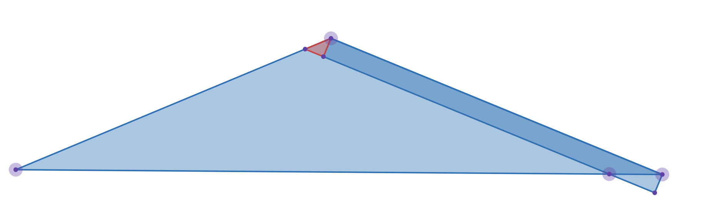

<FeatureHead
    title = '一种可行的将OBJ模型转换为json模型的方法'
    authorName = 轩宇1725
    avatarUrl = '../../_authors/轩宇1725.jpg'
    :socialLinks="[
        { name: 'BiliBili', url: 'https://space.bilibili.com/104432208' }
    ]"
    cover='../_assets/2.png'
/>

> 关键词
> OBJ模型，json模型，Minecraft，几何结构转换，体素化，轻量化模型，切线空间

## 综述和背景

本文旨在研究一种可行的高精度、近乎无损且轻量化的 OBJ (Wavefront) 转 JSON 模型（Minecraft 风格）的方法，帮助美术人员在通用建模软件中完成设计后，能够快速将工程导入 Minecraft 场景。

我们考虑的两种模型有显著的不同，OBJ 模型由顶点-面定义物体的几何结构，以三角面网格为核心（一些软件也支持多边形面），可以高精度、低面数地表示复杂的几何结构（如曲面）。而 Minecraft 的 json 模型由经过平移、旋转、缩放的体素定义，通常不能较好地表示复杂曲面，甚至难以表示三角形。在不考虑材质和贴图的情况下，我们接下来将讨论一种可行的，在可接受的视觉效果误差中，将 OBJ 模型转换为 json 模型的方法。

## 模型体素化的传统实现

### 方法简介

将 OBJ 模型转换为 json 模型相似的体素化模型的传统方法是用轴对齐的立方体（体素）来近似 OBJ 模型的几何结构。这种方法的基本思路是：

1. 将 OBJ 模型放入一个三维网格中

2. 确定最小细分网格

3. 对每个网格单元，检查其是否与 OBJ 模型相交，如果是，就填充一个体素

4. 对生成的体素模型进行优化，减少体素数量

5. 得到最终的体素模型

### 方法的不足

这种传统方法的实现方式简单，但存在不可忽视的缺点：

1. 这种方法产生的视觉误差太大（我们现在还未定义误差），尤其是对于曲面和斜面，体素化模型往往显得非常粗糙。

2. 要达到较高的视觉精度，需要使用非常细的网格，导致体素数量激增，模型变得非常庞大，难以在 Minecraft 中使用。

3. 即使进行了优化，如合并一些体素，或在不同的位置使用不同的细节等级（Level of Detail，LOD），生成的体素模型仍然可能包含大量冗余体素，影响性能的同时及其不利于美术人员进行修改。

## 改进方法

### 定义误差

为了更好地衡量转换后的json模型与原始OBJ模型之间的差异，也为了我们实现优化算法，我们需要定义转换前后的误差值。

#### 体积误差

对于体积拟合产生的误差（如传统方法），我们可以使用失真体积来衡量，失真体积定义为为两个模型的并集体积与它们交集体积的差。由于我们最终会在各个角度上观察模型，我们需要计算不同视角下的失真体积投影面积，取其平均值作为最终误差指标。

研究指出，三维空间中的凸多面体在 $SO(3)$ 作用下的平均投影面积与该多面体的表面积为定值 $\frac{1}{4}$ 对于凹多面体（更一般的情形）由于面会相互遮挡，该结论不再成立，但我们可以通过采样多个视角来近似计算平均投影面积，而且它的上界仍然是 $\frac{1}{4}$，为了简化计算，我们采用上界衡量误差。

即，

$$e_V = \frac{S}{4} \geq \frac{1}{4 \pi} \int_{S^2} A(\boldsymbol{u}) \,\mathrm d \omega,$$

其中 $S$ 为失真体积的表面积，$A(\boldsymbol{u})$ 为视角 $\boldsymbol{u}$ 下的投影面积，积分在整个单位球面 $S^2$ 上进行。我们采用 $\tfrac{S}{4}$ 作为简化误差的上界，这在保证保守估计的同时简化了计算。

#### 表面误差

对于表面拟合产生的误差 $e_S$ （如我们接下来要介绍的方法），我们可以使用失真表面积来衡量，失真表面积定义为两个模型的表面积之差的绝对值。

同样地，我们不考虑遮挡的影响，直接使用每个细分表面失真表面积的和作为误差指标。具体的计算式与拟合方式有关，我们接下来再介绍，但思想和体积误差类似。

### 优化方向

模型复杂度可以用体素数量来衡量，我们希望误差和复杂度都尽可能小，但二者往往是矛盾的，定义一个代价指标，其与误差和复杂度成正比（这里采用加权和衡量），即

$$J = \alpha e + \beta M,$$

其中 $e$ 为误差指标，$M$ 为体素数量，$\alpha, \beta$ 为权重系数。我们希望通过优化算法，使得 $J$ 最小化。

### 改进的体素化方法综述

由于 Minecraft 的 json 模型是基于可旋转的体素定义的，我们可以利用这一点，通过允许体素进行旋转来更好地拟合 OBJ 模型的几何结构，从而减少误差。

对于原始的 OBJ 模型，我们将相互连通、相互平行的三角形定义为一个表面。表面中的三角形满足以下条件：

1. 表面中相邻的三角形至少有两个共享的顶点

2. 表面中所有三角形的法线方向相同（即平行），实际实现中考虑一定足够小的夹角误差

3. 满足上述两个条件的三角形如果相邻同一个表面中的三角形，则也属于该表面

对于每个表面，我们计算其切线空间（tangent space），即定义一个局部坐标系，使得该表面的法线方向与局部坐标系的某个轴对齐。然后，我们在该切线空间中进行体素化，使用轴对齐的体素来近似该表面的几何结构。

### 具体实现步骤

#### 读取 OBJ 模型
    
这一步骤比较简单，OBJ 文件格式是文本格式，可以使用现有的库（如 TinyOBJLoader）来解析 OBJ 文件，只需要提取顶点、法线和面索引信息。在文件中，分别以 `v` `n` `f` 开头的行表示顶点、法线和面索引。

有时法线信息可能不存在或不可靠，我们可以通过顶点和面的信息计算法线。对于每个三角形面，我们可以使用叉积计算法线：

$$\boldsymbol{N} = \frac{(\boldsymbol{v}_2 - \boldsymbol{v}_1) \times (\boldsymbol{v}_3 - \boldsymbol{v}_1)}{\|(\boldsymbol{v}_2 - \boldsymbol{v}_1) \times (\boldsymbol{v}_3 - \boldsymbol{v}_1)\|}$$

有时候 OBJ 模型中会出现多边形面（如Blender导出的模型），我们可以将多边形面三角化，转换为多个三角形面进行处理。

#### 构建表面连通分量

我们遍历所有读取到的三角面，按照上述定义创建连通分量，得到多个表面，每个表面就是一个无向图。

#### 计算切线空间

在每个表面中，我们取该表面的法线作为切线空间的法线 $\boldsymbol{N}$，取一个与法线不共线的向量作为切线方向 $\boldsymbol{T}$（如任意三角形的边，将其归一化），然后通过叉积计算副切线方向 

$$\boldsymbol{B} = \boldsymbol{N} \times \boldsymbol{T}$$

三个向量构成一个正交的局部坐标系，我们构造一个变换矩阵 $\boldsymbol{M}_{TBN}$，将全局坐标系转换为切线空间坐标系：

$$\boldsymbol{M}_{TBN} = \begin{bmatrix}\boldsymbol{T} & \boldsymbol{B} & \boldsymbol{N}\end{bmatrix}$$

由于该矩阵是正交矩阵，其逆存在且逆矩阵等于其转置矩阵：

$$\boldsymbol{M}_{TBN}^{-1} = \boldsymbol{M}_{TBN}^T$$

将表面的所有顶点坐标 $\boldsymbol{v}_i$ 通过该矩阵变换到切线空间：

$$\boldsymbol{v}_i' = \boldsymbol{M}_{TBN} \boldsymbol{v}_i$$

#### 寻找切线空间内的最优矩形

在切线空间中，我们需要找到一个最优的矩形来初步填充表面的内部，使得删去这个矩形面积后，残留的三角形数量最少。同时，由于这一步的误差是可以避免的，所以我们不能接受任何误差，即满足矩形需满足条件：

1. $e_S = 0$
2. 满足条件的矩形包含在表面的内部。
3. 由于美术上的需求，矩形的边长需要取最小元 $\delta$ 的整数倍

直观地，满足这样条件的矩形面积越大越好，但小于表面的边界能放入的最大矩形面积，同时可能对角度和位置有一定限制，使得剩余的三角面最少。

我们可以通过枚举法来寻找最优矩形，具体步骤如下（可用更高效的方法替代以提升性能）：

1. 在切线空间中提取表面的边界顶点
2. 将每条边分别与坐标轴对齐，然后以 $\delta$ 为LOD，对边界内的区域进行网格划分（只有完全包含在边界内的网格才被保留）
3. 对于每个网格单元，尝试将其作为矩形的左下角，然后枚举可能的宽度和高度（均为 $\delta$ 的整数倍），检查该矩形是否完全包含在边界内
4. 对于满足条件的矩形，计算删去该矩形后剩余的三角面数量，记录下剩余三角面数量最少的矩形作为当前最优解

注意，删去矩形后，剩余的区域可能会出现非三角面，我们需要对这些区域进行重新三角化，以确保所有剩余区域都由三角形面组成。并且对于剩余的三角形，我们需要重新计算它们的连通分量，最终的衡量标准是剩余三角面的总数量。

确定后的矩形，我们通过左乘 $\boldsymbol{M}_{TBN}^{-1}$ 将其转换回全局坐标系，得到该表面的一个体素化块（扁平的体素）。

#### 处理剩余三角面

对于三角面，由于存在最小元 $\delta$，我们首先讨论它的尺寸，若三角形的最小外接矩形的长宽都小于 $\delta$，则称该三角形为小的；若三角形的最大内接矩形的长宽都大于等于 $\delta$，则称该三角形为大的；其他情况称为中等的。

1. 对于小的三角形，我们尝试两种拟合方式：

    1. 使用两个包边矩形拟合三角形。最大角对应的顶点，平行于该顶点的邻边在三角形内侧放置两个矩形，使得两个矩形靠内的边交于这个顶点对边上一点。通过取不同的交点，可以得到不同的拟合，选择误差最小的方式。包边矩形的尺寸不必为 $\delta$ 的整数倍，但若解能够取到 $\delta$ 的整数倍，则选择 $\delta$ 整数倍中能够最小化误差 $e_S$ 的解。

    2. 计算三角形的重心，然后以重心为中心，直接用一个 $\delta \times \delta$ 的矩形拟合该三角形，一条边与三角形的边重合，计算误差 $e_S$。

    此处的误差 $e_S$ 定义为集合 $\{S: S \in S_{voxel}, S \notin S_{triangle}\}$ 的测度的$\frac{1}{4}$，即矩形超出三角形部分的面积：

    $$e_S = \frac{1}{4} \sum_{S \in S_{voxel}, S \notin S_{triangle}} Area(S)$$

    选取这两种方式中误差较小的一种作为该小三角形的拟合方式。

2. 对于中等的三角形，我们只考虑使用两个包边矩形的方法，流程和处理小三角形的类似。

3. 对于大的三角形，我们首先用三个包边矩形拟合该三角形。从三个顶点沿着邻边方向各放置一个矩形，厚度分别为 $d_1, d_2, d_3$. 这样就产生一个内部区域，我们对该区域进行传统的体素（像素）化处理，但要求每个矩形的尺寸为 $\delta$ 的整数倍，并且在处理完毕后合并相邻的矩形。此时令 $d_1, d_2, d_3$ 取使内部区域有解且 $e_S$ 最小的值，同样地，若解能够取到 $\delta$ 的整数倍，则选择 $\delta$ 整数倍中能够最小化误差 $e_S$ 的解。

找到的所有矩形，我们通过左乘 $\boldsymbol{M}_{TBN}^{-1}$ 将其转换回全局坐标系，得到该表面的剩余三角面的体素化块。

下面我们详细讨论上面提到的覆盖方法:

##### 双包边法:


双包边法在一般情况下可以较好地拟合小三角形


在特殊情况中，可以发现矩形的顶点固定在三角形三个角上时会出现无法拟合的情况，需要延长矩形

> 注：虽然这种情况总能通过调整D点的位置避免，但我们现在还不能确定限制D的位置是否比允许延长矩形更好，因此我们选择允许延长矩形。

因此，适用于一般情况的双包边法逻辑为：

1. 选取最大角，记为 $A$ ，邻角记为 $B$ 和 $C$，三个角的对边分别记为 $a, b, c$。

2. 在 $a$ 上取一点 $D$ , 过 $D$ 作 $b，c$ 的垂线，分别于射线 $BA, CA$ 交于点 $E, F$。

3. 以 $E$ 为例，若 $E$ 在 $b$ 上，则矩形 $R_1$ 的一条边为 $AB$，与其垂直的邻边长为 $d_1$ 其值等于 $D$ 与 $b$ 的距离; 若 $E$ 在 $b$ 沿 $BA$ 方向的延长线上，则矩形 $R_1$ 的一条边为 $BE$ , 与其垂直的邻边长同样为 $d_1$。

为了简化计算，我们假设 $d_1,d_2$ 都取不到 $\delta$ 的整数倍，这样它们就是连续值，计算出最佳取值后再试图将其调整为 $\delta$ 的整数倍。

那么，$d_1$ 与最终取值的差不大于 $\Delta d_1 = \delta$ , 同理 $d_2$ 与最终取值的差不大于 $\Delta d_2 = \delta$。

在一般情况的计算中，以角 $B$ 上的矩形 $R_1$ 为例，容易算得失真面积为:

$$ S(R_1) = \frac{1}{2} d_1^2 \tan B $$

在需延长矩形的特殊情况下，失真面积为:

$$ S(R_1) = \frac{1}{2} (d_1^2 \tan B + (\cot C d_1 - b)^2 \tan(B+C))$$

且临界条件为 $\cot C d_1 - b = 0$ , 当等号左边为正时，$D$ 的投影在 $BC$ 的延长线上，为负时，$D$ 的投影在 $BC$ 上。

所以我们可以用一个 `max()` 函数来统一表示失真面积：

$$ S(R_1) = \frac{1}{2} \left( d_1^2 \tan B + (\max(0, \cot C d_1 - b))^2 \tan(B+C) \right) $$

两边的面积之和没有重叠，因此总失真面积为:

$$ S = S(R_1) + S(R_2) $$

误差为失真面积的 $\frac{1}{4}$ :

$$ e_S = \frac{S}{4} = \frac{S(R_1) + S(R_2)}{4} $$

且约束条件为 $\phi (d_1, d_2) = d_1 \sin B + d_2 \sin C - a = 0$

利用拉格朗日乘数法，我们构造拉格朗日函数：

$$ \mathcal{L}(d_1, d_2, \lambda) = e_S(d_1, d_2) + \lambda \phi(d_1, d_2) $$

对 $d_1, d_2, \lambda$ 求偏导并令其为零，得到方程组：

$$
\frac{\partial \mathcal{L}}{\partial d_1} = 0, \quad \frac{\partial \mathcal{L}}{\partial d_2} = 0, \quad \frac{\partial \mathcal{L}}{\partial \lambda} = 0
$$

注意，$\mathcal{L}$ 临界点处不可导，因此我们需要分情况讨论：

容易证明，只会有一边需要延长矩形，也即只有三种情况：

在给定的满足约束条件的 $d_1, d_2$，若 $\cot C d_1 - b \leq 0$ 且 $\cot B d_2 - c \leq 0$，则为一般情况（临界处视为一般情况）；

若 $\cot C d_1 - b > 0$ 且 $\cot B d_2 - c \leq 0$，则为延长 $R_1$ 的情况；

若 $\cot C d_1 - b \leq 0$ 且 $\cot B d_2 - c > 0$，则为延长 $R_2$ 的情况。

分别将三种情况代入上面的方程组，求候选解，然后计算误差，选择误差最小的解作为最终解。此时将 $d_1, d_2$ 调整为 $\delta$ 的整数倍，选择调整后误差最小的解作为最终解（不一定总能办到）。

##### 环绕包围法

适用于大三角形的环绕包围法逻辑为：

1. 我们使用不同的 LOD 来判断内部区域，即将内部区域离散为 $\xi\delta \times \xi\delta$ 的网格，$\xi$ 取 $1, 2, \dots, k$，其中 $k$ 为三角形最大内接矩形的边长与 $\delta$ 的比值的整数部分。对于我们定义中的“大的三角形”，$k \ge 1$。

2. 在不同的 LOD 下，对内部区域进行像素化处理（内接拟合），即在划分好的网格内，选取完全包含在三角形内的网格作为像素块。

3. 选取三角形的三个顶点 $A, B, C$，分别沿着邻边方向放置三个矩形 $R_1, R_2, R_3$，其厚度分别为 $d_1, d_2, d_3$。选择最小的 $d_1, d_2, d_3$ 覆盖内接拟合无法覆盖的区域，并计算包边带来的失真面积 $S$。

对于这一步，我们需要先选取方向，即选取一边为底边，此时已经确定的像素将产生左、右和上边界。对左侧的斜边，我们计算左边界和上边界每个格点距离斜边的距离，取最小值作为 $d_1$，同理右侧的斜边取最小值作为 $d_2$，显然底边的 $d_3$ 为 0.

分别计算不同边作为底边的 $d_1, d_2, d_3$，然后计算失真面积 $S$，选择使得 $S$ 最小的解。

下面我们讨论失真面积 $S$ 的计算方式。


考虑一般的环绕包围法，假设 $d_1, d_2, d_3$ 分别为左、右和底边的矩形厚度，$A, B, C$ 分别为左、右和底边的角度，则失真面积 $S$ 可以表示为：

$$ S = \frac{1}{2} \left((d_1^2 + d_2^2)\cot A + (d_1^2 + d_3^2)\cot B + (d_2^2 + d_3^2)\cot C\right) $$



考虑顶角为钝角时，显然钝角附近不存在误差面积。以右侧为例，可以计算出红色三角形的面积为

$$S_\Delta = \frac{1}{2}d_1^2 \cot(B+C) = - \frac{1}{2} d_1^2 \cot A$$

这刚好与我们原本计算右侧矩形在此处产生的失真面积项相反，如果套用原来的公式，这么这一项刚好为红色三角形面积的负值，因此我们需要将其去掉。

通过 `max` 制约 $\cot A, \cot B, \cot C$ 得到修正后的失真面积：

$$ S = \frac{1}{2} \left((d_1^2 + d_2^2)\max(0, \cot A) + (d_1^2 + d_3^2) \max(0, \cot B) + (d_2^2 + d_3^2) \max(0, \cot C)\right) $$

4. 计算每个 LOD 下的误差值 $e_S = \frac{S}{4}$ 和体素数量 $M$，选择使得代价指标 $\mathcal{J} = \alpha e_S + \beta M$ 最小的解作为最终解。

在这个算法中，最优解由 LOD 唯一确定，因为 $e_S$ 和 $M$ 都由 LOD 决定，因此代价函数可以表示为 $\mathcal{J}\left(\right.$ LOD $\left.\right)$。由于 LOD 只能取离散值 $1, 2, \dots , k$，我们可以通过遍历所有可能的 LOD 来找到最优解。

#### 体素块的描述

现在对于所有已经确定的矩形，我们需要将其转换为 Minecraft json 模型所需的格式。Minecraft json 模型中的体素定义在不同平台有些许不同，但都主要由下面的信息组成（我们不考虑材质）：

1. 体素的位置：定义体素在三维空间中的位置。基岩版体素定义中的 `origin` 数组和Java版中的 `from` 数组就是这个位置。

2. 体素的尺寸：定义体素的长、宽、高。基岩版体素定义中的 `size` 数组就是这个尺寸。对于Java版，`to` 数组为位置与尺寸的和。

3. 体素的旋转：定义体素相对于其局部坐标系的旋转角度，由三个轴的旋转欧拉角描述。基岩版体素定义中的 `rotation` 数组和 Java 版中的 `rotation.x`, `rotation.y`, `rotation.z` 键就是这个旋转信息。

4. 旋转中心：定义体素旋转时的参考点。基岩版体素定义中的 `pivot` 数组和 Java 版中的 `rotation.origin` 对象就是这个旋转中心。

为了确认这四个信息，我们需要确认从单位正方体变换到目标矩形的变换矩阵 $\boldsymbol{M}_{voxel}$。

体素变换的顺序是：先缩放，再平移，最后绕旋转中心旋转3个欧拉角，因此变换矩阵可以表示为：

$$f: \mathbb{R}^3 \rightarrow \boldsymbol{P}\boldsymbol{R}\boldsymbol{P}^{-1}\boldsymbol{T}\boldsymbol{S}\mathbb{R}^3$$

其中 $\boldsymbol{P}$ 表示将旋转中心移到原点的平移矩阵，$\boldsymbol{R}$ 表示绕原点旋转的矩阵，每个轴旋转的顺序是 $X \rightarrow Y \rightarrow Z$，$\boldsymbol{T}$ 表示平移矩阵，$\boldsymbol{S}$ 表示缩放矩阵。

对于我们得到的矩形顶点，我们先计算出最小点 $\boldsymbol{v}_{min}$，其与相邻顶点构成的向量 $$\boldsymbol{d}_x = \boldsymbol{v}_1 - \boldsymbol{v}_{min}, \quad \boldsymbol{d}_y = \boldsymbol{v}_2 - \boldsymbol{v}_{min}$

即可得到体素的位置和尺寸：

$$\boldsymbol{T} = \begin{bmatrix} 1 & 0 & 0 & \boldsymbol{v}_{min,x} \\ 0 & 1 & 0 & \boldsymbol{v}_{min,y} \\ 0 & 0 & 1 & \boldsymbol{v}_{min,z} \\ 0 & 0 & 0 & 1 \end{bmatrix}, \boldsymbol{T}^{-1} = \begin{bmatrix} 1 & 0 & 0 & -\boldsymbol{v}_{min,x} \\ 0 & 1 & 0 & -\boldsymbol{v}_{min,y} \\ 0 & 0 & 1 & -\boldsymbol{v}_{min,z} \\ 0 & 0 & 0 & 1 \end{bmatrix}$$

$$\boldsymbol{S} = \begin{bmatrix} \|d_x\| & 0 & 0 & 0 \\ 0 & \|d_y\| & 0 & 0 \\ 0 & 0 & 0 & 0 \\ 0 & 0 & 0 & 1\end{bmatrix}$$

由于 $d_1, d_2$ 始终是正交的，而且将最小点平移到原点后方向和大小不改变，可以直接用于计算。我们只需要找到将其法线和一个向量对其齐的旋转矩阵 $\boldsymbol{R}$ 即可。假设法线为 $\boldsymbol{N}$，我们可以通过以下步骤计算旋转矩阵：

1. 计算旋转轴 $\boldsymbol{A} = \boldsymbol{N} \times \boldsymbol{Z}$，其中 $\boldsymbol{Z} = (0, 0, 1)$ 是全局坐标系的 $Z$ 轴。

2. 计算旋转角度 $\theta = \arccos(\boldsymbol{N} \cdot \boldsymbol{Z})$。

3. 使用 Rodrigues' 旋转公式构造旋转矩阵 $\boldsymbol{R}$：

$$\boldsymbol{R} = \boldsymbol{I} + \sin(\theta) [\boldsymbol{A}]_{\times} + (1 - \cos(\theta)) [\boldsymbol{A}]_{\times}^2$$

其中 $[\boldsymbol{A}]_{\times}$ 是向量 $\boldsymbol{A}$ 的反对称矩阵。

最后，我们可以通过分解旋转矩阵 $\boldsymbol{R}$ 来得到绕每个轴的欧拉角。

记绕 $X、Y、Z$ 轴的旋转欧拉角为 $rx, ry, rz$，显式地写出 $\boldsymbol{R}$ 如下:

$$\boldsymbol{R} = \begin{bmatrix}
\cos(rz)\cos(ry) & \cos(rz)\cos(ry)\sin(rx)-\sin(rz)\cos(rx) & \cos(rz)\sin(ry)\cos(rx)+\sin(rz)\sin(rx) & 0 \\
\sin(rz)\cos(ry) & \sin(rz)\sin(ry)\sin(rx)+\cos(rz)\cos(rx) & \sin(rz)\sin(ry)\cos(rx)-\cos(rz)\sin(rx) & 0 \\
-\sin(rx) & \cos(ry)\sin(rx) & \cos(ry)\cos(rx) & 0 \\
0 & 0 & 0 & 1
\end{bmatrix}$$

可以从矩阵中提取出欧拉角：

记 $\boldsymbol{R}$ 的第 $i$ 行 $j$ 列元素为 $\boldsymbol{R}_{ij}$，则有：

$$ry = \arcsin(-\boldsymbol{R}_{31})$$

由于可能发生万向节死锁，我们需要根据 $ry$ 的值选择不同的计算方式：

定义一个较小的阈值 $$\varepsilon = 10^{-6}$$

当 $\left|\boldsymbol{R}_{31}\right| \lt 1 - \varepsilon$ 时，不发生万向节死锁，直接计算剩余的欧拉角：

$$rx = \arctan2\left(\frac{\boldsymbol{R}_{32}}{\cos(ry)}, \frac{\boldsymbol{R}_{33}}{\cos(ry)}\right)$$

$$rz = \arctan2\left(\frac{\boldsymbol{R}_{21}}{\cos(ry)}, \frac{\boldsymbol{R}_{11}}{\cos(ry)}\right)$$

当 $\left|\boldsymbol{R}_{31}\right| \geq 1 - \varepsilon$ 时，发生万向节死锁，需要使用其他方法计算欧拉角。

$\qquad$ 设置 $rz = 0$

$\qquad$ 若 $\boldsymbol{R}_{31} \lt 0$:

$$ry = \frac{\pi}{2}$$

$$rx = \arctan2(\boldsymbol{R}_{12}, \boldsymbol{R}_{13})$$

$\qquad$ 否则:

$$ry = -\frac{\pi}{2}$$

$$rx = \arctan2(-\boldsymbol{R}_{12}, -\boldsymbol{R}_{13})$$

事实上由于旋转中心和旋转轴是任意的，达到同样的视觉效果有多个可能的解，在我们的计算中，旋转中心就是体素的最小点.

故我们需要的四个信息如下：

基岩版体素定义：

```json
{
  "origin": [v_min.x, v_min.y, v_min.z],
  "size": [|d_x|, |d_y|, 0],
  "rotation": [rx_in_degrees, ry_in_degrees, rz_in_degrees],
  "pivot": [v_min.x, v_min.y, v_min.z]
}
```

Java版体素定义：

```json
{
  "from": [v_min.x, v_min.y, v_min.z],
  "to": [v_min.x + |d_x|, v_min.y + |d_y|, v_min.z],
  "rotation": {
    "origin": [v_min.x, v_min.y, v_min.z],
    "x": rx,
    "y": ry,
    "z": rz
  }
}
```

直接按照 json 格式写入即可。

### 剩余问题

尽管我们提出了一种可行的将 OBJ 模型转换为 json 模型的方法，但仍然存在一些剩余问题需要进一步研究和解决：

1. 文章中叙述的寻找最优矩形的算法复杂度较高，尤其是在处理复杂表面时，可能需要更高效的算法来加速这一过程。

2. 我们将三角面看作是与其他三角面独立的，美术人员通常会将大块的误差隐藏在不可见的区域内（如封闭的内部），从而减小cube数的同时达到比较小的误差，这一点我们目前还未考虑。

3. 当前方法主要以误差为优化目标，在多数情况下无法把体素数（cube 数）优化到与人工制作相同的低水平。相比于美术人员手动制作的模型，自动转换的模型在误差与方块数上通常都更高。

4. 对于非常复杂的几何结构，当前的方法可能仍然无法达到理想的视觉效果，未来可以考虑结合其他技术，如细分曲面或多分辨率表示，以进一步提升转换质量。

但总而言之，这种基于切线空间的体素化方法为高精度、轻量化的 OBJ 到 json 模型转换提供了一种有前景的解决方案。按照文章中的思路能够编写一个实际可用的转换工具，帮助美术人员更高效地将设计成果应用于 Minecraft 场景中。