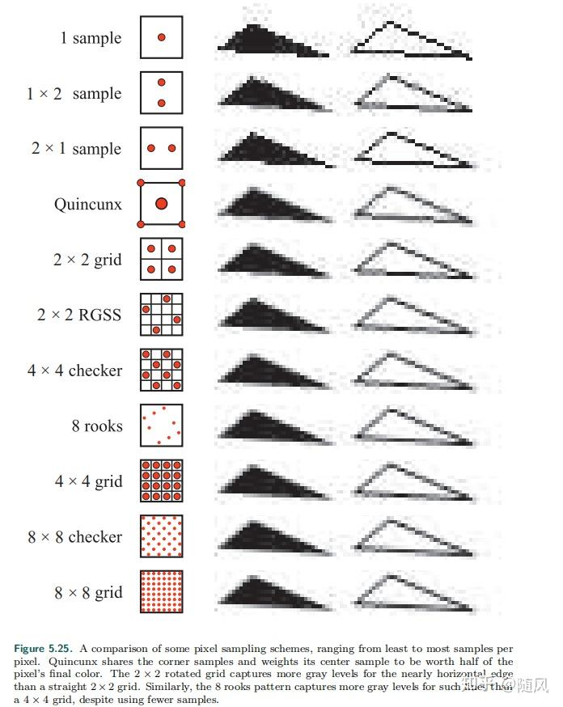

<FeatureHead
    title = '附注-核心全局量汇总（上）'
    authorName = 轩宇1725
    avatarUrl = '../../_authors/轩宇1725.jpg'
    :socialLinks="[
        { name: 'BiliBili', url: 'https://space.bilibili.com/104432208' }
    ]"
/>

## 综述

前面三节文章将核心着色器的工作流程已经描述的较为清晰，但仍有一些总体性的细节部分需要澄清。因此，本节教程将在前面几节建立的基础之上，对核心着色器中的部分必须掌握的全局量进行汇总，剩下的全局量将会放到下一个附注（全局量附注02）.

## 前言

由于教程的每篇写作周期较长，并由于 Feature 发刊周期为一月一发，会出现部分囤稿，目前讲到的东西已经有一些在发刊之前就被 Mojang 修改，有些则是发刊时准确的信息更新后变得不再准确（虽然我们在第一篇的前言就警告过这一点）。对于对基本流程影响较大的更改，我会修改 Feature 上的原文部分，对于一些渲染逻辑的小更改，我只会在更新过程中用附录或注记的形式提示。

本篇要讲的东西时效性可能也比较强，未来的读者请务必对照Wiki和官方发布的更改日志进行学习。

颜色值用十六进制表示法和归一化浮点数表示法具有一定的误差，文章中尽量给出官方信息和社区中广泛使用的值，所以会出现两种表示方法混用的现象。

本篇开始写作于11月10日晚，演示版本为 1.21.11，之前已发刊的篇幅为 1.21.8。

本节列出的全局量块为:

- Globals

- Fog

- DynamicTransform

- Projection

- LightmapInfo

## 正文

目前全局量由 **全局量块（uniform blocks）** 引入，通过引入一个块对象（一般声明在包含着色器内），一并引入和它有关的全部全局量。

虽然一些全局量被绑定为一个整体引入，但在某些场景下并不是所有的全局量都有赋值。在这些场景下调用这些未被赋值的全局量是未定义行为，很可能导致意料之外的输出甚至游戏崩溃。

## Layout 关键字

这里介绍一个 GLSL 关键字 `layout` ，它用于指定全局量块的内存对齐方式。

在顶点属性中，常用的 `layout(location = x)` 用于指定顶点属性的位置索引，在代码内是通过该索引为顶点属性赋值的。但在如 Minecraft 的核心着色器中，顶点属性的位置索引是由引擎自动分配的（通过顶点属性变量名查找位置），因此不需要手动指定。

`layout(std140)` 用于指定全局量块的内存对齐方式为 `std140` ，这是 OpenGL 规定的一种标准对齐方式，保证了在不同平台和驱动下全局量块的内存布局一致。

`std140` 对齐方式的规则如下:

- 标量类型（如 `float`、`int`、`bool`）占用 4 字节，且对齐到 4 字节边界。

- 向量类型（如 `vec2`、`vec3`、`vec4`）占用 8、12、16 字节，且对齐到其大小的倍数边界（vec2 对齐到 8 字节，vec3 和 vec4 对齐到 16 字节）。

- 矩阵类型（如 `mat2`、`mat3`、`mat4`）按列存储，每列作为一个向量类型处理。

- 数组类型的每个元素按其类型对齐，并且数组的起始位置对齐到 16 字节边界。

虽然 `std140` 的对齐方式使得如 `vec3` 这样的类型过长，但不要试图访问用于对齐的额外字节，这会导致未定义行为。

### 共用块 Globals

共用块是核心着色器的后处理着色器都可以使用的块

共用块被 `globals.glsl` 声明如下:

```glsl
layout(std140) uniform Globals {
    ivec3 CameraBlockPos;
    vec3 CameraOffset;
    vec2 ScreenSize;
    float GlintAlpha;
    float GameTime;
    int MenuBlurRadius;
    int UseRgss;
};
```

#### CameraBlockPos

CameraBlockPos 在 1.21.11 版本引入，用于表示摄像机在世界中的绝对坐标，以方块为单位。注意，它不是玩家的位置，在第一人称下它与玩家位置相同，但在第三人称或自由视角下它会有所不同。

### CameraOffset

CameraOffset 在 1.21.11 版本引入，表示摄像机在方块内的小数坐标，其与 CameraBlockPos 结合可以得到摄像机的精确位置。

#### ScreenSize

ScreenSize 表征了当前缓冲区的宽度和高度（以像素为单位），虽然尺寸理论上不会出现小数，但由于着色器管线内由浮点数计算占主导，将其转换为 `ivec2` 可能会造成计算上的不利（比如进行插值需要浮点数而不能是整数），故这里使用的类型是 `vec2`。

ScreenSize 在原版中使用的例子如下：

```glsl
// rendertype_lines.vsh 用于控制线框、鱼线等类型的渲染

#version 330

    .
    .
    .

void main() {

    .
    .
    .

    vec3 ndc1 = linePosStart.xyz / linePosStart.w;
    vec3 ndc2 = linePosEnd.xyz / linePosEnd.w;

    // ScreenSize 在这里被用作计算线宽和偏移量，因为这些线应该在屏幕中不被拉伸，故不能直接使用NDC坐标为基准
    vec2 lineScreenDirection = normalize((ndc2.xy - ndc1.xy) * ScreenSize);
    vec2 lineOffset = vec2(-lineScreenDirection.y, lineScreenDirection.x) * LineWidth / ScreenSize;

    if (lineOffset.x < 0.0) {
        lineOffset *= -1.0;
    }

    if (gl_VertexID % 2 == 0) {
        gl_Position = vec4((ndc1 + vec3(lineOffset, 0.0)) * linePosStart.w, linePosStart.w);
    } else {
        gl_Position = vec4((ndc1 - vec3(lineOffset, 0.0)) * linePosStart.w, linePosStart.w);
    }

    .
    .
    .

    vertexColor = Color;
}
```

#### GlintAlpha

GlintAlpha 是附魔光效的强度，取值在 $[0,1]$ 。在代码中它与RGB直接乘算，但由于附魔光效本身是一个半透明的渲染对象，因此乘入 GlintAlpha 实际上起到的是调节附魔光效透明度的作用，我们以后在讲到半透明混合时会介绍这种特性。

GlintAlpha 在原版中使用的例子如下

```glsl
// glint.fsh 用于渲染物体表面的附魔光效，附魔光效是一个独立的渲染对象，这里的采样是对附魔光效的纹理而不是附加光效的物体

#version 330

    .
    .
    .

void main() {
    vec4 color = texture(Sampler0, texCoord0) * ColorModulator;
    if (color.a < 0.1) {
        discard;
    }
    // GlintAlpha 这里用作与雾乘算，然后再与采样的颜色乘算
    float fade = (1.0f - total_fog_value(sphericalVertexDistance, cylindricalVertexDistance, FogEnvironmentalStart, FogEnvironmentalEnd, FogRenderDistanceStart, FogRenderDistanceEnd)) * GlintAlpha;
    fragColor = vec4(color.rgb * fade, color.a);
}
```

#### GameTime

GameTime 是一个表征世界时间的全局量，在默认情况下约每20分钟在 $[0,1]$ 内循环一次，具体的计算式为 $(gametime \mod 24000) / 24000$

这里的 $gametime$ 为每秒20单位，与 `/time query gametime` 返回的值相同（但是客户端和服务端之间可能存在延迟），这个时间不受游戏规则 `doDaylightCycle` (或 1.21.11起改名为的 `advance_time`) 影响。

GameTime 是以 tick 为单位计算的，而不是现实时间，因此可用 `/tps` 更改其更新速率。

> 注: 在旧版本中 (可能是 1.21.5 以下的版本，需要验证) 后处理着色器只能使用 Time 全局量，每秒在 $[0,1]$ 内循环

GameTime 在原版中使用的例子如下

```glsl
//rendertype_end_portal.fsh 用于渲染末地传送门内的星空效果

#version 330

    .
    .
    .

mat4 end_portal_layer(float layer) {
    // GameTime 在这里被用于随时间变化的平移效果
    mat4 translate = mat4(
        1.0, 0.0, 0.0, 17.0 / layer,
        0.0, 1.0, 0.0, (2.0 + layer / 1.5) * (GameTime * 1.5),
        0.0, 0.0, 1.0, 0.0,
        0.0, 0.0, 0.0, 1.0
    );

    mat2 rotate = mat2_rotate_z(radians((layer * layer * 4321.0 + layer * 9.0) * 2.0));

    mat2 scale = mat2((4.5 - layer / 4.0) * 2.0);

    return mat4(scale * rotate) * translate * SCALE_TRANSLATE;
}

out vec4 fragColor;

void main() {
    .
    .
    .
}
```

#### MenuBlurRadius

MenuBlurRadius 用于后处理的模糊程序，指定模糊的强度，等于视频设置中的 **菜单背景模糊程度** ，即取 $[0,10]$ 内的整数 。虽然这个变量存在于一个通用的程序，但只有打开菜单或标题界面时才会进入使用这个变量的分支（即打开菜单时背景的模糊效果）

MenuBlurRadius 在原版中使用的例子如下

```glsl
//box_blur 是一个后处理程序，用于创造模糊效果

#version 330

    .
    .
    .

// This shader relies on GL_LINEAR sampling to reduce the amount of texture samples in half.
// Instead of sampling each pixel position with a step of 1 we sample between pixels with a step of 2.
// In the end we sample the last pixel with a half weight, since the amount of pixels to sample is always odd (actualRadius * 2 + 1).
void main() {
    vec2 oneTexel = 1.0 / InSize;
    vec2 sampleStep = oneTexel * BlurDir;

    vec4 blurred = vec4(0.0);
    
    // 当 Radius 小于 0.5 时，MenuBlurRadius 才会被使用
    // 1.21.10 中只有三个场景调用此程序：
    //     实体外轮廓（Radius 设为 2.0）
    //     蜘蛛视角（Radius 设为 7.0 和 15.0）
    //     打开菜单栏或标题界面时（Radius 设为 0.0）
    
    float actualRadius = Radius >= 0.5 ? round(Radius) : float(MenuBlurRadius);
    for (float a = -actualRadius + 0.5; a <= actualRadius; a += 2.0) {
        blurred += texture(InSampler, texCoord + sampleStep * a);
    }
    blurred += texture(InSampler, texCoord + sampleStep * actualRadius) / 2.0;
    fragColor = blurred / (actualRadius + 0.5);
}
```

#### UseRgss

实际上是一个布尔值，当视频设置中的 **纹理过滤** 被设置为 **RGSS** 模式时，这个全局量为 1，否则为 0。

RGSS (Rotated Grid Super-Sampling， 旋转网格超采样) 是一种抗锯齿技术。我们知道，每个片元可能会对应于纹理上的一块较大区域，而不是纹理上的一个像素，因此在采样时可能会出现锯齿现象。RGSS 通过在纹理区域内选择多个采样点，**并将其旋转一个角度**，使得采样点很少与竖直方向和水平方向齐平，从而提升采样效果。



### 雾气 Fog

与雾气相关的全局量块被包含着色器 `fog.glsl` 引入，声明如下：

```glsl
layout(std140) uniform Fog {
    vec4 FogColor;
    float FogEnvironmentalStart;
    float FogEnvironmentalEnd;
    float FogRenderDistanceStart;
    float FogRenderDistanceEnd;
    float FogSkyEnd;
    float FogCloudsEnd;
};
```

这些全局量大部分已经在上一节教程简单叙述过，这里我们以更加定量的方式介绍这些全局量。

#### FogColor

FogColor 是一个归一化颜色值，是雾气渲染的核心变量。

影响 FogColor 的因素很多，包括时间、群系、boss栏（如凋灵）、天气、状态效果（夜视，失明和黑暗）和特殊的环境（如水下、岩浆和细雪内）等

影响 FogColor 的因子如下表，这里大部分只给出定性描述，完整的计算过程我会在附录给出

1. 群系

    决定雾色最主要的因素，每个群系都有一个指定的雾色，在末地，实际的基础雾色是群系雾色的 $0.15$ 倍

2. 时间

    在主世界时，雾气的明度会随时间变化，设 $C$ 为新的颜色，$\begin{pmatrix}r \\ g \\ b \end{pmatrix}$ 为旧的颜色，$T \in [0, 1]$ 为一天中的时间，则:

    $$
    A = \max(0, \min(\frac{1}{2} + \cos(2\pi T), 1))\\
    C = \begin{pmatrix} 0.94A + 0.06 & 0 & 0 \\ 0 & 0.94A + 0.06 & 0 \\ 0 & 0 & 0.91A + 0.09 \end{pmatrix} \begin{pmatrix} r \\ g \\ b \end{pmatrix}
    $$

3. 天空颜色

    渲染距离越小，雾的颜色就越接近天空的颜色，直到当渲染距离为32时，雾的颜色不再受天空颜色影响。

    关于天空颜色的变化规律将在光照全局量块的介绍中定量分析。

4. 太阳

    当渲染距离大于等于4时，玩家在日出或日落时所面对的方向也会影响雾色

5. 天气

    当天气为雷暴时，整体色调都会偏灰。当天气为雨天时，整体色调会偏灰但比雷暴更偏向蓝色系。

6. 水下

    玩家进入水下时，雾的颜色取决于摄像机所处的群系，从一种群系游移到另一种群系时，雾色会在5秒内逐渐变化。
    
    沼泽和红树林的雾比其他群系中的雾更浓，这一特性由生物群系标签 `has_closer_water_fog` 控制。

7. 细雪和岩浆

    细雪和岩浆内的雾气分别为定值 RGB(0.623, 0.734, 0.785) 和 RGB(0.6,0.1,0.0).

8. 高度：
    
    在非超平坦且玩家不处于细雪或岩浆内时，雾色相比原色的明度倍率由计算式 `power(clamp((y-minY)*0.03125,0.0,1.0))` 。体现为雾气会在最低高度上方32格到最低的过程中逐渐由原色变为纯黑。

9. 失明和黑暗：

    当玩家拥有这两种状态效果且不处于细雪或岩浆内时，雾色会被设为纯黑。且失明优先于黑暗效果。

10. 凋灵：

    当凋灵的boss栏存在时，雾色会变得更深更红。这个特性由bossbar的 `CreateWorldFog` 和 `DarkenScreen` 控制（只能在 `level.dat` 的 `CustomBossEvents` 中更改，目前 `/bossbar` 命令没有此接口）.

11. 夜视：

    如果玩家的视角不在水下，也没有黑暗效果，夜视会使得雾色更加明亮。

#### FogEnvironmentalStart & FogEnvironmentalEnd

用于渲染在近距离占主导的球状雾

FogEnvironmentalEnd 和 FogEnvironmentalStart 会受到各种因素的影响，在叙述中，一般称两者为可见距离和起始距离。

当摄像头在主世界的空气中，天气为晴天，且没有失明或黑暗的情况下，会应用大气迷雾，起始距离为 0.0，可见距离为 1024.0。

1. 水下

摄像机进入水下时，起始距离会被设置为 -8.0，可视距离会被设置为 24.0。

经过 2.2 秒后，可视距离会在 2.0 秒内提升到 58.0， 然后在约 24.7 秒内上升到 96.0。

这就体现为进入水下后可视距离急剧下降，在短时间内快速上升，然后在较长的时间内上升到最大可视距离。

2. 天气

当天气为雨天或雷雨时，起始距离会被设置为 -80.0，可视距离会被设置为 896.0。

3. 岩浆

当摄像机进入岩浆后，起始距离会被设置为 0.25，可视距离会被设置为 1.0。

若玩家有抗火效果，则起始距离为 0.0，可视距离会被设置为 5.0.

4. 黑暗

当玩家有黑暗效果时，起始距离会被设置为 11.25，可视距离会被设置为 15.0。

5. 失明

当玩家有失明效果时，起始距离会被设置为 1.25，可视距离会被设置为 5.0。

失明的优先级高于黑暗，两者在岩浆中都不生效。

6. 下界和末影龙

当玩家处于下界（准确来说是应用下界效果的维度）或一个存在末影龙boss战事件的维度中时，起始距离会被设置为渲染距离的5%，可视距离会被设置为渲染距离的一半，但不会低于96。

#### FogRenderDistanceStart & FogRenderDistanceEnd

FogRenderDistanceStart 和 FogRenderDistanceEnd 用于渲染在渲染距离边界占主导的圆柱状，为了掩盖区块加载的边界。可视距离为渲染距离，起始距离为渲染距离的90%。

#### FogSkyEnd

FogSkyEnd 用于天空迷雾的渲染，等于渲染距离。虽然天空迷雾也使用的是 `apply_fog()` 函数，但其提供的球状雾起始距离为定值 0 可视距离为 FogSkyEnd，圆柱状雾的起始距离和可视距离都为 FogSkyEnd。这意味着天空雾的实际效果只取决于球状雾。

```glsl
fragColor = apply_fog(ColorModulator, sphericalVertexDistance, cylindricalVertexDistance, 0.0, FogSkyEnd, FogSkyEnd, FogSkyEnd, FogColor);
```

#### FogCloudsEnd

FogCloudsEnd 用于云层迷雾的渲染，等于视频设置中的 **云层距离** ，但其不直接渲染雾气，而是基于雾值削弱云层的不透明度。

```glsl
color.a *= 1.0f - linear_fog_value(vertexDistance, 0, FogCloudsEnd);
```

这表现为，从摄像机原点开始，云层的不透明度随距离线性降低，直到 FogCloudsEnd 外完全不可见。

### 动力学变换 DynamicTransform

与各种变换相关的全局量被包含着色器 `dynamictransforms.glsl` 声明如下:

```glsl
layout(std140) uniform DynamicTransforms {
    mat4 ModelViewMat;
    vec4 ColorModulator;
    vec3 ModelOffset;
    mat4 TextureMat;
    float LineWidth; // until 1.21.11
};
```

> 这里出现了矩阵，注意 GLSL 中的声明是按列声明的。下面的内容是数学上的形式。

这些全局量被称为动力学变换，是因为它们由玩家的位置和朝向等频繁被改变的数据所决定。

#### ModelViewMat

ModelViewMat 在第二节 **核心着色器的工作流程（上）** 中介绍过，它是用于模型-视图变换的矩阵，由摄像机的旋转角度计算而来，主要功能是对坐标系进行线性变换，使得摄像机位于原点并朝向 $-z$ 轴，由于输入着色器的数据本身就以摄像机为原点，因此这个矩阵只承担旋转功能（不包括绕 $z$ 轴的旋转）

$$ \text{ModelViewMat} = \begin{bmatrix} -\cos\theta & 0 & -\sin\theta & 0 \\ -\sin\theta\sin\phi & \cos\phi & -\cos\theta\sin\phi & 0 \\ \sin\theta\cos\phi & \sin\phi & -\cos\theta\cos\phi & 0 \\ 0 & 0 & 0 & 1\end{bmatrix} $$

旋转执行的顺序是先偏航（绕 $y$ 轴旋转角度 $\theta$ ），再俯仰（绕 $x$ 轴旋转角度 $\phi$），由于 Minecraft 命令上下文中的局部坐标系与OpenGL中的摄像机坐标系有旋转 $180°$ 的偏移，因此这里的旋转矩阵看上去不像熟悉的标准形式。具体计算可回到第二节 **核心着色器的工作流程（上）** 中查阅。

#### ColorModulator

根据广泛的测试和经验，这个全局量实际上并不会发生任何作用，但是它在代码中与几乎所有的颜色乘算，更改它相当于对所有的颜色进行统一的乘算。

我们暂时没有在源代码中找到与这个值有关的信息，也许只是用作着色器调试。

#### ModelOffset

> 旧版本发挥同一作用的全局量名称是 `ChunkOffset`

由于顶点属性 `Position` 指定的是顶点在区块内的偏移量，要知道顶点相对于摄像机（原点）的偏移量，就必须知道区块起始点相对于摄像机的偏移量。这个偏移量就是 ModelOffset 的值。

#### TextureMat

用于附魔光效、风弹、世界边界等动态的纹理效果，是一个 4D 的 UV 变换矩阵，以平移为主。

### 投影变换 Projection

与投影相关的全局量（虽然目前只有一个）被包含着色器 `projection.glsl` 声明如下:

```glsl
layout(std140) uniform Projection {
    mat4 ProjMat;
};
```

#### ProjMat

ProjMat 在原版中承担将视图空间投影到裁剪空间中的工作，投影方式是由FOV（视场角）和 Aspect（宽高比）、n（近平面位置）、f（远平面位置）描述的透视投影矩阵

$$ \text{ProjMat} = \Large\begin{bmatrix} \frac{1}{\tan{\frac{\text{FOV}}{2}\times \text{Aspect}}} & 0 & 0 & 0 \\ 0 & \frac{1}{\tan{\frac{\text{FOX}}{2}}} & 0 & 0 \\ 0 & 0 & \frac{n+f}{n-f} & \frac{2nf}{n-f} \\ 0 & 0 & -1 & 0 \end{bmatrix} $$

### 光照贴图 LightmapInfo

与光照贴图生成相关的全局量被核心着色器 `lightmap.fsh` 声明如下

光照贴图的生成是一个较为复杂的过程，详细的计算过程我会在下一节介绍，这里只提供全局量信息的汇总

```glsl
layout(std140) uniform LightmapInfo {
    float AmbientLightFactor;
    float SkyFactor;
    float BlockFactor;
    float NightVisionFactor;
    float DarknessScale;
    float DarkenWorldFactor;
    float BrightnessFactor;
    vec3 SkyLightColor;
    vec3 AmbientColor;
} lightmapInfo;
```

#### AmbientLightFactor

AmbientLightFactor 决定了环境光的亮度，在地狱为 $0.1$ ，在末地为 $0.25$ ，在主世界为 $0$ 。

#### SkyFactor

SkyFactor 指定了光照贴图被天空光增亮的程度，在如打雷这样使天空闪烁的场景下会增加，也随时间等因素变化。

#### BlockFactor

BlockFactor 是一个随机变动的因子，用于模拟方块光源的闪烁效果。

#### NightVisionFactor

NightVisionFactor 用于指定夜视效果增亮光照贴图的程度，取值在 $[0, 1]$ 之间。

#### DarknessScale

DarknessScale 用于指定黑暗效果使光照贴图变暗的程度，取值在 $[0, 1]$ 之间。

#### DarkenWorldFactor

当 bossbar 的 `DarkenScreen` 属被设置为 `1b` 时，DarkenWorldFactor 指定了其使光照贴图变暗的程度。

#### BrightnessFactor

BrightnessFactor 对应视频设置中的 "亮度"，归一化后取值在 $[0, 1]$ 之间。

#### SkyLightColor

天空光的颜色，随时间等因素变化。

#### AmbientColor

环境光的颜色，由维度指定。