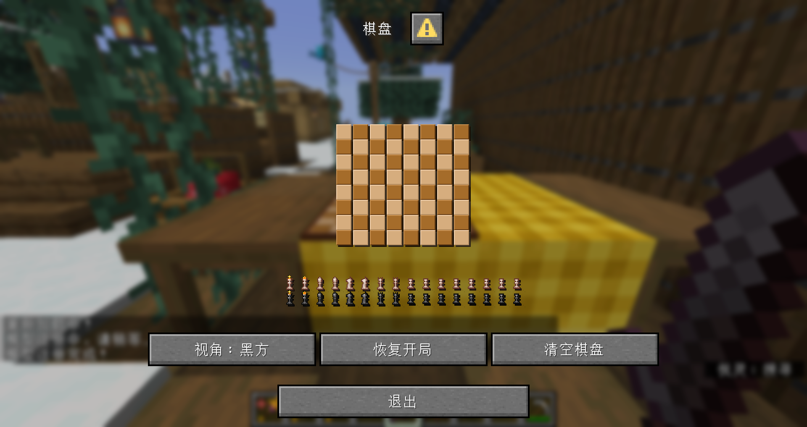
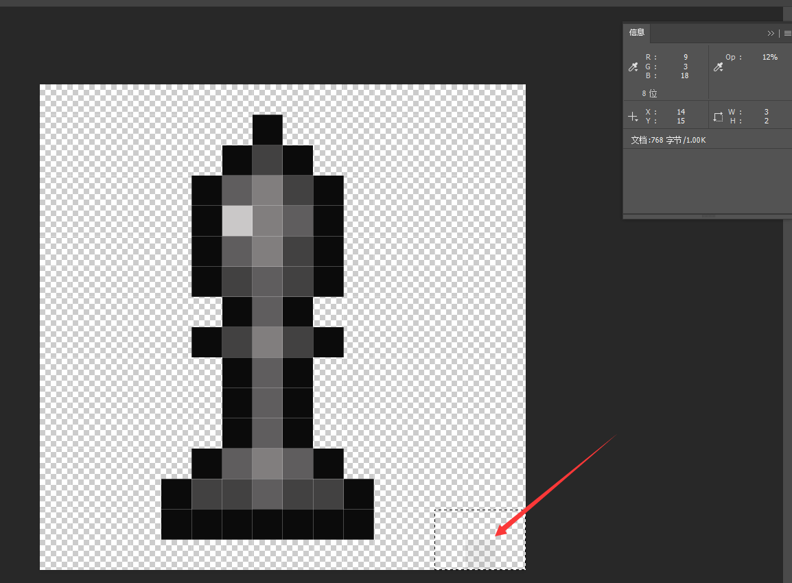

<FeatureHead
    title='如何使用最新最热的MC特性制作带劲的国际象棋（上）'
    authorName='CR_019'
    cover= '../_assets/d.png'
/>

[展示视频](https://www.bilibili.com/video/BV1YXbazMEpn)

如视频所示，这是一个在原版MC中，使用数据包+资源包实现的国际象棋，可以实现正常的摆子、吃子，并提供清空棋盘和恢复开局两个快捷选项。此外，棋局的实时局面可在棋盘模型上正常显示。

该作品使用的技术包括了近两年来更新的诸多新特性：对话框、物品模型映射、函数宏，以及其衍生出的许多技术。接下来，我将从棋盘模型、棋局界面、后端系统三个角度对该项目进行技术解析。

# 前置内容：棋局数据结构
要保存一个棋局盘面并不困难，我们只需要记录每个棋子的对应坐标即可。\
因此我们可以维护一个结构体，存储对应棋子的$x$和$y$坐标。为了方便数据包编写时索引，我们维护两个层级：`black`和`white`，在其下存储对应阵营的每个棋子的坐标。最终得到如下结构体：

```mcfunction
data modify entity @s data.chessboard set value {\
    chess_pieces:{\
        white:{\
            rook0:{x:0,y:0},\
            rook1:{x:7,y:0},\
            knight0:{x:1,y:0},\
            knight1:{x:6,y:0},\
            bishop0:{x:2,y:0},\
            bishop1:{x:5,y:0},\
            king:{x:3,y:0},\
            queen:{x:4,y:0},\
            pawn0:{x:0,y:1},\
            pawn1:{x:1,y:1},\
            pawn2:{x:2,y:1},\
            pawn3:{x:3,y:1},\
            pawn4:{x:4,y:1},\
            pawn5:{x:5,y:1},\
            pawn6:{x:6,y:1},\
            pawn7:{x:7,y:1}\
        },\
        black:{\
            rook0:{x:0,y:7},\
            rook1:{x:7,y:7},\
            knight0:{x:1,y:7},\
            knight1:{x:6,y:7},\
            bishop0:{x:2,y:7},\
            bishop1:{x:5,y:7},\
            king:{x:3,y:7},\
            queen:{x:4,y:7},\
            pawn0:{x:0,y:6},\
            pawn1:{x:1,y:6},\
            pawn2:{x:2,y:6},\
            pawn3:{x:3,y:6},\
            pawn4:{x:4,y:6},\
            pawn5:{x:5,y:6},\
            pawn6:{x:6,y:6},\
            pawn7:{x:7,y:6}\
        }\
    }\
}
```
存储在棋盘根实体的`data.chessboard.chess_pieces`路径下。

特别地，若棋子被吃或不在棋盘上，使用`{x:-1,y:-1}`标识。

# Part1：棋盘模型
为使棋盘模型可以放置，我使用了我自己开发的装饰模型前置库dc，使其支持放在世界中，并接管交互事件。\
简而言之，每个放置的模型由一个根实体、一个展示实体、一个交互实体组成，我们通常用根实体处理逻辑事件，在展示实体上处理模型显示。

更多的细节在此省略，我们直接进入如何同步显示棋局这个问题。

为使棋子显示在棋盘的每个格子上，我们需要为每个棋子的每个格子的情况都建立一个模型。因此需要$64\times16$个模型。\
这是本部分最肝的一步，好在模型的位置很有规律，我们可以在AI的帮助下，编写一个脚本，用程序批量生成。\
得到这些模型后，我们可以在物品模型映射中，用“拼好模”（`composite`类型映射）将这些模型组合起来。

我们将模型的`custom_model_data`的`string`列表定义为一个$64$项的列表，每一项代表棋盘上的一个格子。\
例如`0`项代表`(1,1)`,`14`项表示`(2,7)`。项的值代表这个格子上的棋子，`empty`表示无棋子，有棋子时以`(兵种)_(阵营)`表示该棋子的类型。\
比如：`king_black`表示黑王。\
我们同样用AI生成脚本完成这个模型映射的编写。

如此，资源包侧的任务就完成了。只需要在数据包侧修改模型的`custom_model_data`列表即可让棋子在指定的位置显示。

建立一个函数用于同步棋局数据和模型显示：

::: details data\chess\function\events\sync\sync.mcfunction

```mcfunction
execute as @n[type=item_display,tag=pc_chess_sync_display] run data modify entity @s item.components.minecraft:custom_model_data.strings set value ["empty","empty","empty","empty","empty","empty","empty","empty","empty","empty","empty","empty","empty","empty","empty","empty","empty","empty","empty","empty","empty","empty","empty","empty","empty","empty","empty","empty","empty","empty","empty","empty","empty","empty","empty","empty","empty","empty","empty","empty","empty","empty","empty","empty","empty","empty","empty","empty","empty","empty","empty","empty","empty","empty","empty","empty","empty","empty","empty","empty","empty","empty","empty","empty"]

data modify storage pc:chess temp.sync.piece set value "pawn_white"
function chess:events/sync/_utils/calculate with entity @s data.chessboard.chess_pieces.white.pawn0
function chess:events/sync/_utils/sync_ with storage pc:chess temp.sync
function chess:events/sync/_utils/calculate with entity @s data.chessboard.chess_pieces.white.pawn1
function chess:events/sync/_utils/sync_ with storage pc:chess temp.sync
function chess:events/sync/_utils/calculate with entity @s data.chessboard.chess_pieces.white.pawn2
function chess:events/sync/_utils/sync_ with storage pc:chess temp.sync
function chess:events/sync/_utils/calculate with entity @s data.chessboard.chess_pieces.white.pawn3
function chess:events/sync/_utils/sync_ with storage pc:chess temp.sync
function chess:events/sync/_utils/calculate with entity @s data.chessboard.chess_pieces.white.pawn4
function chess:events/sync/_utils/sync_ with storage pc:chess temp.sync
function chess:events/sync/_utils/calculate with entity @s data.chessboard.chess_pieces.white.pawn5
function chess:events/sync/_utils/sync_ with storage pc:chess temp.sync
function chess:events/sync/_utils/calculate with entity @s data.chessboard.chess_pieces.white.pawn6
function chess:events/sync/_utils/sync_ with storage pc:chess temp.sync
function chess:events/sync/_utils/calculate with entity @s data.chessboard.chess_pieces.white.pawn7
function chess:events/sync/_utils/sync_ with storage pc:chess temp.sync

data modify storage pc:chess temp.sync.piece set value "rook_white"
function chess:events/sync/_utils/calculate with entity @s data.chessboard.chess_pieces.white.rook0
function chess:events/sync/_utils/sync_ with storage pc:chess temp.sync
function chess:events/sync/_utils/calculate with entity @s data.chessboard.chess_pieces.white.rook1
function chess:events/sync/_utils/sync_ with storage pc:chess temp.sync

data modify storage pc:chess temp.sync.piece set value "knight_white"
function chess:events/sync/_utils/calculate with entity @s data.chessboard.chess_pieces.white.knight0
function chess:events/sync/_utils/sync_ with storage pc:chess temp.sync
function chess:events/sync/_utils/calculate with entity @s data.chessboard.chess_pieces.white.knight1
function chess:events/sync/_utils/sync_ with storage pc:chess temp.sync

data modify storage pc:chess temp.sync.piece set value "bishop_white"
function chess:events/sync/_utils/calculate with entity @s data.chessboard.chess_pieces.white.bishop0
function chess:events/sync/_utils/sync_ with storage pc:chess temp.sync
function chess:events/sync/_utils/calculate with entity @s data.chessboard.chess_pieces.white.bishop1
function chess:events/sync/_utils/sync_ with storage pc:chess temp.sync

data modify storage pc:chess temp.sync.piece set value "king_white"
function chess:events/sync/_utils/calculate with entity @s data.chessboard.chess_pieces.white.king
function chess:events/sync/_utils/sync_ with storage pc:chess temp.sync

data modify storage pc:chess temp.sync.piece set value "queen_white"
function chess:events/sync/_utils/calculate with entity @s data.chessboard.chess_pieces.white.queen
function chess:events/sync/_utils/sync_ with storage pc:chess temp.sync


data modify storage pc:chess temp.sync.piece set value "pawn_black"
function chess:events/sync/_utils/calculate with entity @s data.chessboard.chess_pieces.black.pawn0
function chess:events/sync/_utils/sync_ with storage pc:chess temp.sync
function chess:events/sync/_utils/calculate with entity @s data.chessboard.chess_pieces.black.pawn1
function chess:events/sync/_utils/sync_ with storage pc:chess temp.sync
function chess:events/sync/_utils/calculate with entity @s data.chessboard.chess_pieces.black.pawn2
function chess:events/sync/_utils/sync_ with storage pc:chess temp.sync
function chess:events/sync/_utils/calculate with entity @s data.chessboard.chess_pieces.black.pawn3
function chess:events/sync/_utils/sync_ with storage pc:chess temp.sync
function chess:events/sync/_utils/calculate with entity @s data.chessboard.chess_pieces.black.pawn4
function chess:events/sync/_utils/sync_ with storage pc:chess temp.sync
function chess:events/sync/_utils/calculate with entity @s data.chessboard.chess_pieces.black.pawn5
function chess:events/sync/_utils/sync_ with storage pc:chess temp.sync
function chess:events/sync/_utils/calculate with entity @s data.chessboard.chess_pieces.black.pawn6
function chess:events/sync/_utils/sync_ with storage pc:chess temp.sync
function chess:events/sync/_utils/calculate with entity @s data.chessboard.chess_pieces.black.pawn7
function chess:events/sync/_utils/sync_ with storage pc:chess temp.sync

data modify storage pc:chess temp.sync.piece set value "rook_black"
function chess:events/sync/_utils/calculate with entity @s data.chessboard.chess_pieces.black.rook0
function chess:events/sync/_utils/sync_ with storage pc:chess temp.sync
function chess:events/sync/_utils/calculate with entity @s data.chessboard.chess_pieces.black.rook1
function chess:events/sync/_utils/sync_ with storage pc:chess temp.sync

data modify storage pc:chess temp.sync.piece set value "knight_black"
function chess:events/sync/_utils/calculate with entity @s data.chessboard.chess_pieces.black.knight0
function chess:events/sync/_utils/sync_ with storage pc:chess temp.sync
function chess:events/sync/_utils/calculate with entity @s data.chessboard.chess_pieces.black.knight1
function chess:events/sync/_utils/sync_ with storage pc:chess temp.sync

data modify storage pc:chess temp.sync.piece set value "bishop_black"
function chess:events/sync/_utils/calculate with entity @s data.chessboard.chess_pieces.black.bishop0
function chess:events/sync/_utils/sync_ with storage pc:chess temp.sync
function chess:events/sync/_utils/calculate with entity @s data.chessboard.chess_pieces.black.bishop1
function chess:events/sync/_utils/sync_ with storage pc:chess temp.sync

data modify storage pc:chess temp.sync.piece set value "king_black"
function chess:events/sync/_utils/calculate with entity @s data.chessboard.chess_pieces.black.king
function chess:events/sync/_utils/sync_ with storage pc:chess temp.sync

data modify storage pc:chess temp.sync.piece set value "queen_black"
function chess:events/sync/_utils/calculate with entity @s data.chessboard.chess_pieces.black.queen
function chess:events/sync/_utils/sync_ with storage pc:chess temp.sync
```
:::

::: details data\chess\function\events\sync\\\_utils\calculate.mcfunction
```mcfunction
#计算棋子坐标
$scoreboard players set $x pc_chess_position $(x)
$scoreboard players set $y pc_chess_position $(y)

execute if score $x pc_chess_position matches -1 run return run data modify storage pc:chess temp.sync.position set value -1

scoreboard players operation $result pc_chess_position = $y pc_chess_position
scoreboard players operation $result pc_chess_position *= $8 pc_chess_position
scoreboard players operation $result pc_chess_position += $x pc_chess_position

execute store result storage pc:chess temp.sync.position int 1 run scoreboard players get $result pc_chess_position
```
:::

::: details data\chess\function\events\sync\\\_utils\sync\_.mcfunction

```mcfunction
execute if score $x pc_chess_position matches -1 run return 0
$data modify entity @n[type=item_display,tag=pc_chess_sync_display] item.components."minecraft:custom_model_data".strings[$(position)] set value "$(piece)"
```

:::

可以看到该函数先传入了一个全空的`custom_model_data`列表，然后穷举读取每一个棋子的位置，通过$xy$坐标算出`custom_model_data`列表中对应的项数，最后将对应的项设为该棋子对应的字符串，再将这个列表整体推送到物品模型的数据上。

这样我们就可以随时通过这个函数同步棋局的情况，在任意情况下更新棋局状态数据后都可调用。

# Part2：棋局界面

放置模型后，空手右键棋盘即可打开棋局界面。该界面是使用对话框制作的。\
对话框对于数据包作者来说是一个痒点，它提供了很方便的ui界面，但是并不易于使用。好在Mojang没有屏蔽其中文本组件的点击事件，使得我们能够使用字体黑科技对其进行一些有限的排版。

作为实时显示棋局的对话框，我们自然需要使用内联宏对话框来实现动态，具体的实现方法见[上一期《拾尘》篇章](/resources/dust/8/对话框小游戏.md)，在此不再赘述。\
棋局界面的主体由三组文本组成，棋盘的文本，棋子的文本，选择框文本。\
我们在资源包的`dialog`字体中注册了这些文本对应的纹理，并且注册了不同长度的正负空格字体，后续会用到。

第一步是拼棋盘。将黑格和白格的字体交替放置得到棋盘。但是需要注意的是，默认的字体因为需要渲染阴影，字和字之间有1个像素的空隙，我们需要用1像素的负空格消除这个空隙。\
纵向使用换行来拼接，由于换行符向下的像素量是固定的，我们需要在字体设置中设置合适的高度使得上下能够无缝拼接。

> 直接拼合的效果如下：
> 

第二步是渲染棋子。棋子的位置，如上所述，是很好读取的。不过如何将棋子对应的字体塞到棋盘上面呢？\
插入到指定的坐标肯定不行，它会显示在两格棋盘中间，并且会破坏文本列表使得后续棋子定位出错。因此我们选择将棋子对应的文本附加在这一行文本的末尾，先用指定长度的负空格把光标移动到指定的格子位置，然后用对应的正空格把光标移动回行末，以免影响后续棋子的渲染。\
在这里，我们的字体宽高为$9$像素，因此我们每向前移动$n$格，就需要$9 \times n$像素的负空格，和$9 \times (n-1)$像素的正空格。

::: warning 一些字体纹理的小巧思
实际上，MC在渲染自定义字体时，会将右侧的空白纹理直接截断，导致棋子字体不等宽。并且字体渲染时会直接丢弃不透明度小于$10\%$的像素。因此，我们需要在字体纹理的右下角点一个不透明度略大于$10\%$像素点，以防止被截断并且尽量不被玩家注意。

:::

选择框的渲染和棋子类似，在此就不赘述了，也是读取坐标并且用负空格偏移到指定格数。

当然大家还能看到棋盘外有存放被吃掉的棋子的位置，每个棋子对应的位置是固定的，在渲染棋子的时候会特判放置。具体的实现方式是直接穷举。

上述所有文本均做了点击事件，点击后会设置`trigger`计分板为指定的值，数据包通过处理该值可以得知玩家点击的格数和类型，并进行下一步操作。该系统具体的实现会在后端系统模块中详解。

# 小结
如此我们就将外观的部分基本上讲完了。在下期，我们将会详解该国际象棋的后端系统，如何读取玩家的输入，修改棋局状态，并同步到模型和对话框上。