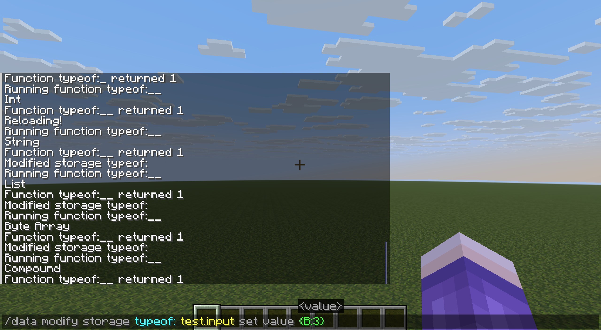

<FeatureHead
    title='如何判断给定地址的NBT数据类型'
    authorName='皮革剑'
/>



<br>

# 引言
作为一种类型化语言（具体来说是动态类型语言），由于`mcfunction`的隐式类型转换实在不算少（例如列表、字符串和复合标签在被提取至返回值时都会进行隐式转换,且含义不同），NBT数据的正确利用非常依赖对数据类型的正确认知。

然而，`mcfunction`并没有原生提供数据类型的判别和获取机制。这就向我们提出了一个问题：

**给定一个NBT地址，输出该NBT地址存放的数据类型。**

## 一、列表尝试追加法（已过期）

这一部分的方法由巨佬[@小豆8593](https://space.bilibili.com/206987540)提及，仅适用于1.21.5之前的版本。

`1.21.5`版本（具体来说是快照`25w09a`）之前，列表类型只支持同型列表，即列表内所有元素都必须具有相同的数据类型。

该限制是强制性的：尝试向列表类型添加具有不同数据类型的元素会直接失败，不会进行任何隐式转换。\
这一行为与数组（字节型、整型、长整型）不同，后者尽管也只支持单一数据类型，但在数值上还是会进行隐式转换。如以下示例：
```mcfunction
data modify storage test: t0 append value 132.45d
```
若NBT路径 `storage test: t0` 存放的是一个整型数组 `[I;]` ，则数据会首先隐式转换为整型`132`再以整型存入整型数组；\
若是字节型 `[B;]` ，则还将进一步截取为字节型数据得 `-124b` 。\
**但如果此处放置了任意一个已有非double类型元素的普通列表（如 `[12.44f]` ），则append操作会直接失败，失败理由是“没有变化，选定的区域已经有这些数据”。**\
（~~data指令的老问题了，无论事实上是因为什么原因modify失败都会显示这个错误的错误信息。~~）

因此，该问题的解决方案就十分简单了：取一些列表，将目标项尝试追加到该列表中并记录返回值，若返回状态为成功则得到该项的类型。参考实现如下：
```mcfunction
data remove storage typeof: test.target
execute unless data storage typeof: test.input run return run tellraw @s {"text":"Null"}

data modify storage typeof: test.target set value [0]
data modify storage typeof: test.target append from storage typeof: test.target
execute unless data storage typeof: test.target[1] run return run tellraw @s {"text":"Int"}

# 重复以上3行。重复段第一行的value分别换为[0b]、[0s]、[0l]、[0f]、[0d]、[[]]、[[B;]]、[[I;]]、[[L;]]、[{}]、[""]，分别测试即可。
```

## 二、SNBT解析法（需要实体）

该方法适用于`1.19.4`及以后至今的版本，需要一个[文本展示实体](https://zh.minecraft.wiki/w/?curid=101695)。

区分NBT数据类型的一个重要方式是通过SNBT转换，转换后的SNBT文本中可以清晰地看到后缀等类型标记。\
`1.19.4`的字符串切片功能意味着，只要能够获得目标项的SNBT文本，就可以完成类型区分。

而在哪里能够取得纯文本类型的SNBT字符串呢？文本组件解析是一个方案（理论上取命令方块的LastOutput也可做，但由于data get命令的呈现结果是彩色的SNBT，底层文本组件相对复杂，不易取得需要的数据）。\
对storage内容的文本解析可由告示牌、成书（首次打开）、boss栏标题、文本展示实体等方式完成，**但其中能自动化运行且能完整取回解析后文本的只有文本展示实体。**

**由NBT地址项解析的文本组件将会是纯文本（完整字符串）形式的SNBT格式表示（除非源地址NBT是字符串，此时解析的文本组件为源字符串的直接拷贝）。**\
不过字符串也不难办，在外面再套一层列表（仅一个元素）即可保证所有类型的数据都以SNBT形式进行解析，只要别忘了在取字符的时候往内多走一位。

取得SNBT格式字符串后，我们主要关注其最后一个字符，通过该字符我们能够区分大部分类型：
- `}` 对应复合标签
- `'"` 对应字符串
- `b` 对应字节型数值
- `s` 对应短整型数值
- `l` 对应长整型数值
- `f` 对应单精度浮点数值
- `d` 对应双精度浮点数值
- `0..9` 对应整型数值（也可排除法）
- `]` 对应列表或数组，需要进一步取字符串前3个字符进行区分：
    - `[B;` 对应字节型数组
    - `[I;` 对应整型数组
    - `[L;` 对应长整型数组
    - 否则，对应列表

函数实现如下：
```mcfunction
execute unless data storage typeof: test.input run return run tellraw @s "Null"

data remove storage typeof: test.target
data modify storage typeof: test.target append from storage typeof: test.input
summon text_display 0 0 0 {Tags:["typeof_temp_resolution"],text:{storage:"typeof:",nbt:"test.target"}}
data modify storage typeof: test.string set from entity @e[type=text_display,tag=typeof_temp_resolution,limit=1] text
kill @e[type=text_display,tag=typeof_temp_resolution]

data modify storage typeof: test.suffix set string storage typeof: test.string -2 -1
execute if data storage typeof: test{suffix:'b'} run return run tellraw @s "Byte"
execute if data storage typeof: test{suffix:'s'} run return run tellraw @s "Short"
execute if data storage typeof: test{suffix:'l'} run return run tellraw @s "Long"
execute if data storage typeof: test{suffix:'d'} run return run tellraw @s "Double"
execute if data storage typeof: test{suffix:'f'} run return run tellraw @s "Float"
execute if data storage typeof: test{suffix:'"'} run return run tellraw @s "String"
execute if data storage typeof: test{suffix:"'"} run return run tellraw @s "String"
execute if data storage typeof: test{suffix:'}'} run return run tellraw @s "Compound"
execute unless data storage typeof: test{suffix:']'} run return run tellraw @s "Int"

data modify storage typeof: test.prefix set string storage typeof: test.string 1 4
execute if data storage typeof: test{prefix:'[B;'} run return run tellraw @s "Byte Array"
execute if data storage typeof: test{prefix:'[I;'} run return run tellraw @s "Int Array"
execute if data storage typeof: test{prefix:'[L;'} run return run tellraw @s "Long Array"

return run tellraw @s "List"
```

## 三、宏解析法与其局限性

`1.20.2`更新的函数宏也是SNBT格式数据的一个来源，同样，在外层套一个列表可以保证测试项总是以SNBT格式加载。

但由于转义问题，如果测试项中含有字符串则无法将以宏形式取出的SNBT写法通过`data`存入字符串（若用双引号括起则一定会出现初始化错误，用单引号则当字符串内有引号转义时会出现错误）。

因此，相比有实体的方法，该方案不能分辨：字符串、复合标签（里面可能有字符串）、列表（里面可能有字符串）。

## 四、其他杂项识别

如果确实希望使用上文的宏解析法制作无实体的类型识别，则需要对字符串、复合标签和普通列表进行单独判断。以下提供一些识别方案：

### 4.1 复合标签

- ~~`data modify <source> merge from <target>` 命令要求`<source>`和`<target>`均为复合标签才能成功，但由于无法避免`<source>`和`<target>`完全相同导致失败的特殊情况，该方案不算很好。~~
- ~~`data modify <source>.<path> set value <val>` 命令要求`<source>`为复合标签才能成功，但由于无法避免`<source>`内已有`{<path>:<val>}`项，该方案也不是很好。~~
- 只有复合标签可以被作为参数使用`function`命令传入另一函数，否则失败。该函数并不一定需要接收参数，因此函数内放置一条始终成功的命令（如 `return 1` ）即可保证测试项为复合项时操作必定成功。
- 不过，最方便的区分方法就是用`execute if data <path>{}`，该命令在`<path>`为复合标签时一定得到1，否则得到0。

### 4.2 普通列表

- ~~`execute if data <path>[]`，该命令在`<path>`为空列表时也得到0，因此不是好的检测方式。~~
- 只有普通列表可以通过append追加一个非数值元素（例如`{}`、`[]`、`""`），通过该方式可直接完成筛选。

### 4.3 字符串

- `data modify <source> set string <target>` 命令要求`<target>`必须为数值（自动转化为字符串）或字符串类型，否则失败。若数据符合要求，从中取下标从0到0的子串的操作必定成功。
- 结合上一条，在已经区分出数值或字符串的情况下，只有数值能够成功追加到一个数组中，也只有数值能在通过宏传入并使用双引号包围的情况下成功解析。这样可以排除法判断出字符串。

### 4.4 杂项识别与宏识别的综合

基于以上方案的组合，以下函数也可以识别全部类型，而无需一个实体。

函数1
```mcfunction
data remove storage typeof: test.target
execute unless data storage typeof: test.input run return run tellraw @s "Null"
execute if data storage typeof: test.input{} run return run tellraw @s "Compound"

data modify storage typeof: test.target append from storage typeof: test.input
execute store success storage typeof: test.success byte 1 run data modify storage typeof: test.target[0] append value []
execute if data storage typeof: test{success:1b} run return run tellraw @s "List"

execute store success storage typeof: test.success byte 1 run function 函数2 with storage typeof: test
execute if data storage typeof: test{success:0b} run return run tellraw @s "String"

data modify storage typeof: test.suffix set string storage typeof: test.string -2 -1
execute if data storage typeof: test{suffix:'b'} run return run tellraw @s "Byte"
execute if data storage typeof: test{suffix:'s'} run return run tellraw @s "Short"
execute if data storage typeof: test{suffix:'l'} run return run tellraw @s "Long"
execute if data storage typeof: test{suffix:'d'} run return run tellraw @s "Double"
execute if data storage typeof: test{suffix:'f'} run return run tellraw @s "Float"
execute unless data storage typeof: test{suffix:']'} run return run tellraw @s "Int"

data modify storage typeof: test.prefix set string storage typeof: test.string 1 4
execute if data storage typeof: test{prefix:'[B;'} run return run tellraw @s "Byte Array"
execute if data storage typeof: test{prefix:'[I;'} run return run tellraw @s "Int Array"
execute if data storage typeof: test{prefix:'[L;'} run return run tellraw @s "Long Array"

return run tellraw @s "Unknown"
```
函数2
```mcfunction
$data modify storage typeof: test.string set value "$(target)"
return 1
```