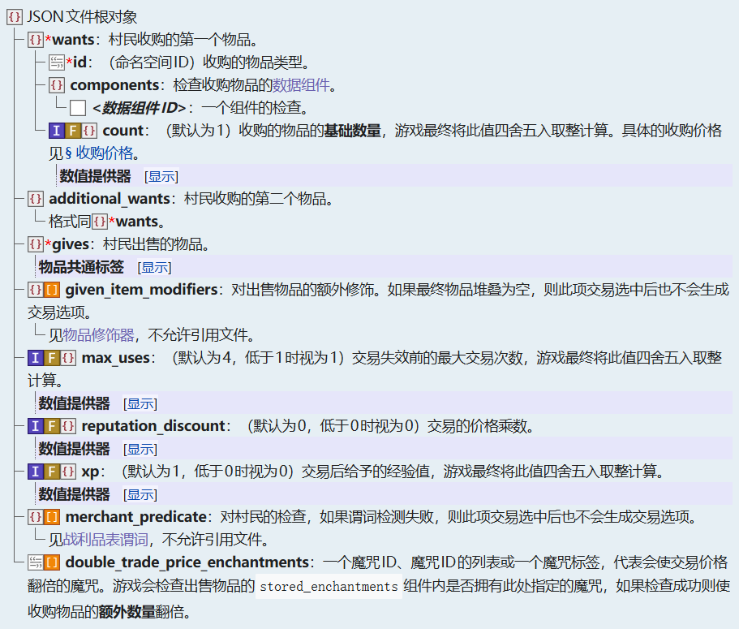
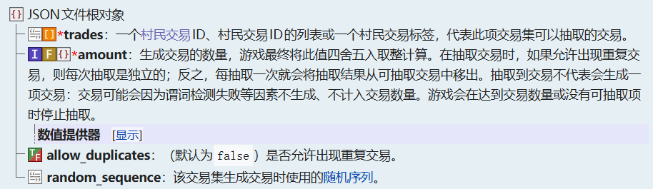

<SpotlightHead
    title = "香草快讯 - Mojang Spotlight - 2026年01月"
    authorName = Alumopper
    avatarUrl = '/datapack-index/_authors/alumopper.jpg'
    :socialLinks="[
        { name: 'BiliBili', url: 'https://space.bilibili.com/280394409' },
        { name: 'GitHub', url: 'https://github.com/Alumopper' }
    ]"
    cover='../_assets/spotlight.png'
    type=0
/>

这里是***香草***快讯，全Minecraft最***Vanilla***的技术性快照新闻，由本社记者*香草狐*为你报道最新快照消息~

本月Mojang共发布了三个快照，分别是26.1的snapshot 1-3。26.1也是 Minecraft 使用新版本号规则的首个版本。目前，数据包版本来到了**97.0**，资源包版本来到了**78.0**。

本月更新了很多有意思的内容，包括村民交易数据驱动化，新的光照有关的环境属性，以及新的世界时钟功能等等。

先说结论，本月更新破坏性较小，实用性较强，总体属于**超大杯中**水平。

## 村民交易数据驱动

在 26.1-snapshot-1中，将村民和流浪商人的交易选项数据驱动了。村民的交易现在主要由两个注册项控制，即交易蓝图`villager_trade`和交易集`trade_set`。

`villager_trade`注册项，也就是`data/命名空间/villager_trade`中的每一个json文件，都代表了一个交易蓝图。村民和流浪商人根据交易蓝图来生成交易。其定义结构如下所示：

`trade_set`则定义了村民提供的交易组合。但是目前此定义是硬编码，只能覆盖原版已有的交易集。目前原版定义的交易集合包括用于对应职业的对应等级的村民的`<profession>/level_<level>`，以及用于流浪商人的`wandering_trader/buying`，`wandering_trader/uncommon`和`wandering_trader/common`。其定义结构如下所示：

使用`reload`不能够重新加载这两个注册项，必须重启服务端（单人模式下退出世界重进）才行。

## 光照环境属性

在26.1-snapshot-1中，添加了和光照有关的环境属性，意味着可以在不同的生物群系或者不同的时间段控制环境光照的变化。

目前光照环境属性有：

* `minecraft:visual/block_light_tint`

RGB值，控制了方块光照的色调。方块光照颜色在低光照下为灰色，中等光照时会被此属性染色，高光时为白色。默认情况下，它呈现出火把的黄色调。当前屏幕上所有的光源都会收到此属性的影响，不能为每个光源指定颜色。如果在不同的生物群系中定义了不同的方块光照色调，那么玩家看到的光源的颜色也只会和玩家所在的生物群系有关，而不会和光源所在的生物群系有关。此后的属性也是同理的。

* `minecraft:visual/ambient_light_color`

RGB值。控制环境光照的颜色。

* `minecraft:visual/night_vision_color`

RGB值。当玩家拥有夜视效果的时候，采用`minecraft:visual/night_vision_color`和`minecraft:visual/ambient_light_color`在RGB三个通道中分别的最大值作为最终颜色。

## 世界时钟

世界时钟（World Clock，译名暂未确定）是26.1-snapshot-3中新添加的机制。在之前，其实也有一个内置的世界时钟，用于控制昼夜循环，以及时间线的行为等等，可以使用`time`命令控制，但是现在，世界时钟被完全数据驱动化，在命名空间文件夹的`world_clock`目录下定义的json文件即为一个世界时钟。世界时钟的定义结构不包含任何的字段，也就是说你的json文件里面只需要写一个`{}`即可。

随着世界时钟的加入，也伴随了很多的更改和增强。

对时间线来说，现在可以使用`clock`字段指定时间线使用的是哪个世界时钟，使用`minecraft:overworld`表示使用原版内置的默认世界时钟，即和以前时间线的默认行为一致。在维度类型定义中，也新增了`default_clock`的可选字段，指定此维度会使用哪个世界时钟，也就是`time`命令控制的时钟。

`time`命令也跟随世界时钟进行了一轮加强。原先的`time`命令的行为将会操控当前维度的默认世界时钟（`default_vlock`字段指定的世界时钟）。同时，你也可以使用`time of <clock>`对特定世界时钟进行控制。此外，`time`命令现在可以控制世界时钟的暂停和继续。使用`time [of <clock>] pause`暂停世界时钟，使用`time [of <clock>] resume`继续暂停的世界时钟。`time add`和`time set`命令的返回值也变为了被操作的世界时钟经过的总刻数，而不是当前的时间。

## `swing`命令

`swing`命令是26.1-snapshot-1中新添加的命令，作为小玩具，可以控制支持此动画的实体进行手臂摆动的动画，例如玩家模型和僵尸等。

命令格式：`/swing [<targets>] [mainhand|offhand]`

## 杂项

新增了物品修饰器：

* `minecraft:set_random_dyes`：如果物品在`#dyeable`标签中，则设置物品的`minecraft:dyed_color`数据组件。
* `minecraft:set_random_potion`：从给定的列表中随机设置物品的`minecraft:potion_contents`数据组件。

修改了物品修饰器：

* `minecraft:enchant_with_levels`和`minecraft:enchant_randomly`新增布尔字段`include_additional_cost_component`，表示是否根据魔咒的花费为物品增加`minecraft:additional_trade_cost`组件。

向实体谓词的玩家子谓词中增加了`food`字段，用于检查玩家的饥饿度和饱和度。

`lightmap.fsh`被大幅修改。

更多详细内容请查阅更新日志~

* 26.1-snapshot-1：<https://zh.minecraft.wiki/w/Java%E7%89%8826.1-snapshot-1>
* 26.1-snapshot-2：<https://zh.minecraft.wiki/w/Java%E7%89%8826.1-snapshot-2>
* 26.1-snapshot-3：<https://zh.minecraft.wiki/w/Java%E7%89%8826.1-snapshot-3>
