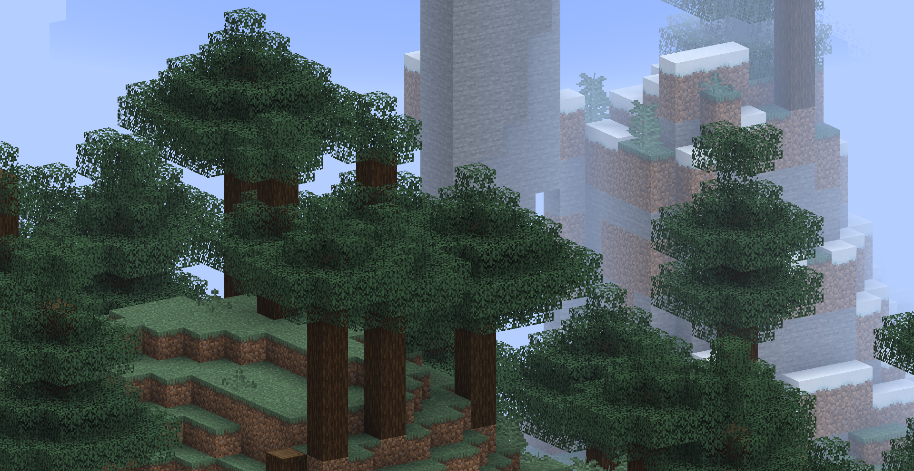
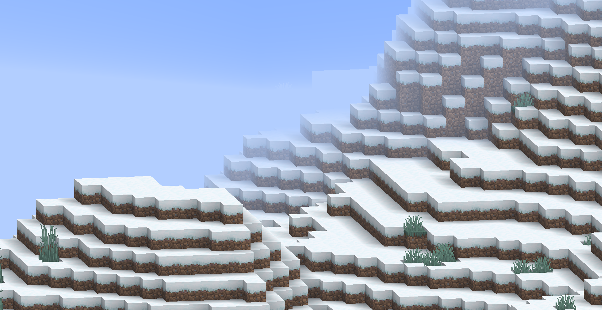
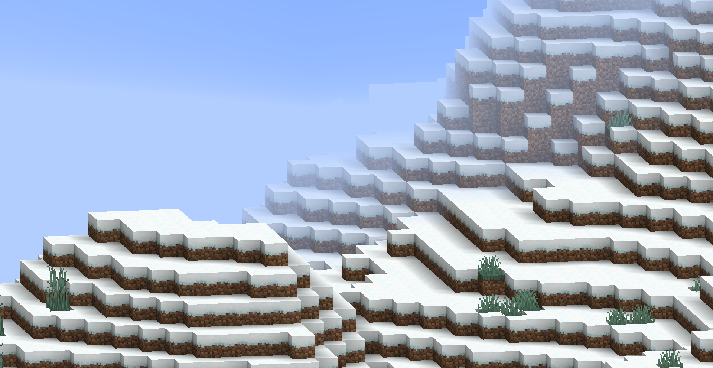

<FeaturedHead
    title='着色器实践篇：简单2D场景的搭建'
    authorName='轩宇1725'
    cover = '../_assets/1.png'
/>


> [做2D原版方块地图的都是潮男](https://www.bilibili.com/video/BV1L44y1L7wD/)
> —— 晴路卡

## 综述

Minecraft 的众多地图都是以原生的3D视角控制的，也有一些固定角度第三人称视角的地图，但很少有地图是以纯2D视角进行设计和游玩的。 本文档将介绍如何使用 Minecraft 的资源包和数据包功能，结合一些通用的原子操作，来实现一个简单的2D场景。

本文章叙述内容使用 1.21.10 原版客户端及资源包、数据包演示。主要利用基于着色器的渲染控制，粒子、展示实体等手段来实现2D场景的视觉效果。数据包部分则用于实现一些交互逻辑。

## 前言

本教程假设读者已经具备一定的 Minecraft 资源包和数据包制作基础，熟悉 GLSL 着色器编程，并了解 Minecraft 的渲染管线和相关概念。如果你对这些内容不熟悉，建议先参考相关基础教程。（或者先阅读，遇到不懂的地方再回头查阅相关资料）

MVP变换相关（ModelViewMat、ProjMat 的原理和推导）：
- [着色器02 核心着色器的工作流程（上）, Feature, 2025, 09](/feature/archive/202509/3/content)

光照、迷雾相关（强度计算过程）：
- [着色器03 核心着色器的工作流程（下）, Feature, 2025, 11](feature/archive/202511/2/content)


## 资源包准备

### 正交投影

2D 场景的核心在于视角的控制。Minecraft 默认使用透视投影，这会导致远处的物体看起来更小。为了实现2D效果，我们需要将投影方式改为正交投影（不是在所有的2D场景中必须的）。

为了达到这个目的，我们需要修改 MVP 变换的过程，将投影矩阵替换为正交投影矩阵。

投影矩阵在 `ProjMat` 中定义，其在显存中存储的格式为列优先顺序的 4x4 矩阵:

```glsl
mat4 ProjMat = mat4(
    1/(tan(FOV/2)*Aspect)  ,        0      ,       0      , 0,
                0          , 1/(tan(FOV/2)),       0      , 0,
                0          ,        0      ,  (n+f)/(n-f) , -1,
                0          ,        0      , (2*n*f)/(n-f), 0,
);
```

正交投影只关心近平面、远平面和视锥的宽高比，因此我们可以将其替换为如下形式:

```glsl
mat4 OrthoProjMat = mat4(
    1/(n*tan(FOV/2)*Aspect) ,        0        ,       0     , 0,
               0            , 1/(n*tan(FOV/2)),       0     , 0,
               0            ,        0        ,   -2/(f-n)  , 0,
               0            ,        0        , -(f+n)/(f-n), 1,
);
```

其中的必要信息我们可以直接从 `ProjMat` 中获取。

```glsl
float tan_half_FOV = 1.0 / ProjMat[1][1];
float aspect = ProjMat[1][1] / ProjMat[0][0];
float n = (ProjMat[3][2] + 1.0) / ProjMat[2][2];
float f = (ProjMat[3][2] - 1.0) / ProjMat[2][2];

mat4 OrthoProjMat = mat4(
    1.0 / (n * tan_half_FOV * aspect), 0.0, 0.0, 0.0,
    0.0, 1.0 / (n * tan_half_FOV), 0.0, 0.0,
    0.0, 0.0, -2.0 / (f - n), 0.0,
    0.0, 0.0, -(f + n) / (f - n), 1.0
);
```

> 此处仅演示原理，实际使用中我们可以使用 Onnowhere 提供的 [vsh_util.glsl](https://github.com/onnowhere/core_shaders/blob/master/.shader_utils/vsh_util.glsl) 包含着色器工具函数来简化操作。
> Onnowhere 提供的方法使用了固定的近平面，和一个 ZOOM 参数用来控制左右、上下边距，工程上更实用。

我们在顶点着色器中，将构造的正交投影矩阵替换掉原本的 `ProjMat` 变量（注意，请务必完全替换地图中使用的所有着色器），得到如下效果：



注意，由于近平面距离是固定的，在计算正交投影时 FOV 仅用于确认近平面大小，因此调整 FOV 不会影响视角的透视效果，但会影响视野范围的大小，与 Onnowhere 提供的 ZOOM 参数具有相同的控制效果。

> 编者的建议：先在 FOV 最大的情况下调整 ZOOM 参数，使得视野范围覆盖整个场景，同时允许玩家调整FOV来缩放视野范围。（如果不允许玩家调整 FOV，则可以直接将着色器中获取的 FOV 固定为一个常数值）

### 重置迷雾

由于投影方式的改变，使用摄像机位置与顶点位置的距离来计算迷雾效果已经不再合适。我们需要重置迷雾的计算方式，使其与 Z 轴坐标相关。

我们先通过将sphericalVertexDistance传参设为 0 删除环境迷雾（球状雾），保留渲染距离迷雾，因为它们本身用于掩盖远处物体，与视角无关。

```glsl
    fragColor = apply_fog(color, 0.0, cylindricalVertexDistance, FogEnvironmentalStart, FogEnvironmentalEnd, FogRenderDistanceStart, FogRenderDistanceEnd, FogColor);
```





如果你的场景中不使用迷雾效果，那么到这一步就结束了（或者你也可以直接删除所有的迷雾）

我们接下来的例子并不会使用迷雾，但这里提供一个基于 Z 轴坐标的迷雾计算方法，供有需要的读者参考，不需要迷雾计算的读者可以跳到下一小节。

经过透视投影后，顶点的深度值存储在 `gl_Position.z` 中，我们可以使用它来计算迷雾效果，但在此之前我们需要先手动做一次透视除法：

```glsl
// 在 vsh 中计算
float z_ndc = gl_Position.z / gl_Position.w; // 归一化设备坐标系下的 z 值，范围 [-1, 1]
```

此处 z_ndc 为 -1 的点全部落在近平面上，z_ndc 为 1 的点全部落在远平面上。我们可以将其线性映射到 [near, far] 范围内（利用 vsh_utils 获取远平面位置，近平面取 0.05 定值）：

```glsl
// 在 vsh 中计算
float far = getFarClippingPlane(ProjMat);
float near = 0.05;
float z_view = ((z_ndc + 1.0) / 2.0) * (far - near) + near; // 视图空间下的 z 值，范围 [near, far]
```

最后我们修改迷雾计算调用, `sphericalVertexDistance` 使用我们计算得到的 `z_view`, `FogEnvironmentalStart` 和 `FogEnvironmentalEnd` 则根据实际需求设置（示例代码中使用原值）：

```glsl
// 在 vsh 中计算
sphericalVertexDistance = z_view;
```

```glsl
// 在 fsh 中计算
    fragColor = apply_fog(color, sphericalVertexDistance, cylindricalVertexDistance, FogEnvironmentalStart, FogEnvironmentalEnd, FogRenderDistanceStart, FogRenderDistanceEnd, FogColor);
```

修改后，迷雾就不再是以摄像机为原点的球状迷雾，而是等值面始终平行于摄像机视平面的平行迷雾。

### 锁定视角

同样地，如果你的需要动态调整视角，可以跳过这一步。

我们通过修改 `ModelViewMat` 来控制视角，`ModelViewMat` 在显存中存储的格式为列优先顺序的 4x4 矩阵:

```glsl
mat4 ModelViewMat = mat4(
    -cos(yaw), -sin(yaw)*sin(pitch), sin(yaw)*cos(pitch),   0,
        0    ,       cos(pitch)    ,       sin(pitch)   ,   0,
    -sin(yaw), -cos(yaw)*sin(pitch), -cos(yaw)*cos(pitch),   0,
        0    ,          0          ,         0          ,   1,
);
```

这里形式与标准的旋转矩阵略有不同，这是因为 F3 中查看的视角与实际摄像机视角存在 180 度的偏差。这里的 yaw 和 pitch 分别表示 F3 信息中显示的水平和垂直方向的旋转角度。

为了锁定视角，我们需要将 yaw 和 pitch 固定为常数值。例如，我们希望视角正对着斜下方，我们可以将 yaw 设为 45 度，pitch 设为 -30 度（注意角度需要转换为弧度制）：

```glsl
float yaw = radians(45.0);
float pitch = radians(-30.0);
mat4 FixedModelViewMat = mat4(
    -cos(yaw), -sin(yaw)*sin(pitch), sin(yaw)*cos(pitch),   0,
        0    ,       cos(pitch)    ,       sin(pitch)   ,   0,
    -sin(yaw), -cos(yaw)*sin(pitch), -cos(yaw)*cos(pitch),   0,
        0    ,          0          ,         0          ,   1,
);
```

或者，我们也可以直接使用一个预先计算好的矩阵常量来替换 `ModelViewMat` 变量：

```glsl
mat4 FixedModelViewMat = mat4(
    -0.7071,  0.3536,  0.6124, 0.0,
     0.0   ,  0.8660, -0.5000, 0.0,
    -0.7071, -0.3536, -0.6124, 0.0,
     0.0   ,  0.0   ,  0.0   , 1.0,
);
```

这样，就从根本上锁定了视角，不论玩家如何移动和旋转摄像机，渲染出来的画面始终保持不变。但当玩家的偏移量太高时，依然会导致一些面的剔除，因此数据包层面依然需要在检测后重置玩家的朝向。

### 表面透射

由于我们是上帝视角，有时我们希望透过方块来观察其内部的物体。为此，我们需要实现一种表面透射效果。

表面透射的核心思路是使用深度和与视线的夹角来实现半透明效果，即对每个片元，如果它足够靠近画面中心，且深度小于我们观察的目标，则根据其与视线的夹角来计算透明度。仿照线性迷雾值的计算方法，在一定范围内，不透明度最低，然后逐渐上升，直到一定范围外为原始不透明度。

我们已经介绍了如何获取视图空间下的 z 值 `z_view`, 但该值不方便我们进行表面投射计算，因此我们直接使用归一化设备坐标系下的 z 值 `z_ndc` 来进行比较：

```glsl
// 在 vsh 中计算
out float z_ndc;
float z_ndc = gl_Position.z / gl_Position.w; // 归一化设备坐标系下的 z 值，范围 [-1, 1]
```

我们用相对于屏幕中间的距离来衡量片元距离画面中心的远近：

```glsl
// 在 fsh 中
#moj_import <minecraft:globals.glsl>

float max_component = max(gl_FragCoord.x, gl_FragCoord.y);
float dist = distance(gl_FragCoord.xy/max_component, ScreenSize / (2.0 * max_component));
```
这里， `gl_FragCoord` 是片元在屏幕上的坐标，以屏幕像素为单位。`ScreenSize` 是屏幕的分辨率大小（宽度和高度），是一个 uniform 全局量（来自Globals块）。

通过计算 max_component，我们将屏幕坐标归一化到 [0, 1] 范围内，同时保留了宽高比。`dist` 的值表示片元距离屏幕中心的相对距离，范围大约在 [0, 0.5] 之间。也即 `gl_FragCoord.xy` 与 `ScreenSize / 2.0` 的距离除以 max_component。

最后我们根据 `z_view` 和 `dist` 来计算透明度：

```glsl
// 在 fsh 中
    float target_z = -0.941; // 目标物体的 z_view 值, 此项由数据包层面传递给着色器，后文介绍
    float distance_min = 0.05; // 距离阈值，低于该距离完全透射
    float distance_max = 0.15; // 距离衰减范围，高于该距离完全不投射
```

这里的 target_z 是在NDC中描述的目标物体深度值，取值在 [-1, 1] 之间。在摄像机距离目标 32 格时, FOV 为 110 时, 这个值大约为 0.941.

注意，在很多着色器中不支持半透明输出，因此我们需要一种算法来模拟半透明效果。一种简单的方式是以一定的概率随机丢弃片元，从而达到类似半透明的视觉效果，基本代码结构如下：

```glsl
if (depth < target_z) {
    float alpha_factor = getAlphaFactor(dist, distance_min, distance_max);
    if (random_chance(alpha_factor)) {
        discard;
    }
}
```

这里的 `getAlphaFactor` 函数根据片元距离计算出一个透明度因子，范围在 [0, 1] 之间：

```glsl
float getAlphaFactor(float dist, float distance_min, float distance_max) {
    if (dist >= distance_max) {
        return 0.0; // 完全透明
    } else if (dist <= distance_min) {
        return 1.0; // 完全不透明
    } else {
        // 线性插值计算透明度因子
        return (distance_max - dist) / (distance_max - distance_min);
    }
}
```

`random_chance` 函数根据透明度因子随机决定是否丢弃片元：

```glsl
bool random_chance(float alpha_factor) {
    // 这里使用一个简单的伪随机数生成方法
    float rand_value = fract(sin(dot(gl_FragCoord.xy ,vec2(12.9898,78.233))) * 43758.5453);
    return rand_value < alpha_factor;
}
```

这样，当观察点被目标物体遮挡时，靠近画面中心且与视线夹角较小的片元会有较高的概率被丢弃，从而实现表面透射效果。


同时，我们有事希望有特定的表面不进行透射，我们可以通过加入一个额外的检测条件来控制。方法有很多种，如检测模型位置的小数位便宜、检测纹理的特定通道等，检测特定对象的技巧会在其他的着色器实践篇中提及。

## 用户视频设置

上述的不少内容需要用户在视频设置中进行一些调整以获得最佳效果，主要调整的参数为：

1. 正交投影的缩放 ZOOM 参数

2. 透射的 z_view 目标值

我们只能通过传入的全局量获取这些参数，但幸运的是，Minecraft 提供了一些全局量可以被我们利用，下面列出方便用户进行修改的全局量，读者可自行选用：


```glsl
// 来自 globals.glsl 中的 Globals 块
int MenuBlurRadius;
int UseRgss;
```

- `MenuBlurRadius`：对应 `选项 -> 视频设置 -> 菜单背景模糊程度`，取值范围为 0-10 的整数.
- `UseRgss`：当 `选项 -> 视频设置 -> 纹理过滤` 被设置为 **RGSS** 模式时，这个全局量为 1，否则为 0。

```
// 来自 fog.glsl 中的 Fog 块
float FogRenderDistanceEnd;
```

- `FogRenderDistanceEnd`：对应 `选项 -> 视频设置 -> 渲染距离`，取值范围为 (2-32)*16.0，即取值为该设置的值乘以16.0后的结果。16.0 是一个区块的尺寸。

```
// 来自 projection.glsl 中的 Projection 块
mat4 ProjMat;
```

- `ProjMat`：投影矩阵，我们可以通过它来计算出 FOV，对应 `选项 -> 视场角`，范围为 30-110 度。具体计算方式为 `float FOV = atan(1.0 / ProjMat[1][1]) * 2.0 * (180.0 / 3.1415926);`

我们可以在预设的默认参数基础上，允许用户通过改变这些全局量的取值来微调最终效果，从而适配不同的屏幕分辨率和个人喜好。

## 数据包准备

### 摄像机锁定

为了确保玩家视角始终如一，我们需要在数据包层面重置玩家的朝向。我们可以通过一个简单的循环函数来实现，如果你需要让玩家自己操控视角，可以跳过这一步。

::: warning
循环修改玩家的朝向在多人游戏中会占用较多的带宽，建议仅在单人游戏或局域网环境中使用。
:::

```mcfunction
# 在 #tick 函数中循环调用
execute at 观察目标 rotated -135.0 -30.0 positioned ^ ^ ^32 run tp 摄像机标记点 ~ ~ ~ ~ ~
data merge entity 摄像机标记点 {teleport_duration:5}
ride 摄像机 mount 摄像机标记点
rotate 摄像机 45 30
execute as 摄像机 at @s run rotate @s 45 30
```

这里, `观察目标` 表示要观察的实体，在由数据包控制摄像机的例子中一半不为玩家（因为玩家必须充当摄像机实体），`摄像机标记点` 是一个展示实体，因为展示实体允许进行可控的插值，`摄像机` 是实际的摄像机实体，即玩家。指令中的各个旋转角度和距离都可以根据实际需求进行调整，这里只是一个示例。

由于我们之前在着色器中锁定了视角，因此这里循环重置玩家的朝向并不会造成传统方案的抖动。

## 总结

至此，我们通过修改投影矩阵、重置迷雾计算、锁定视角和实现表面透射，并建立了摄像机追踪系统，从渲染的角度构建了一个上帝视角场景的搭建。接下来，我们还需要通过数据包来实现一些交互逻辑，如目标控制，UI实现等，但这不是本文的重点内容，读者可以根据实际需求自行设计实现。