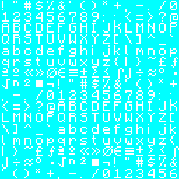
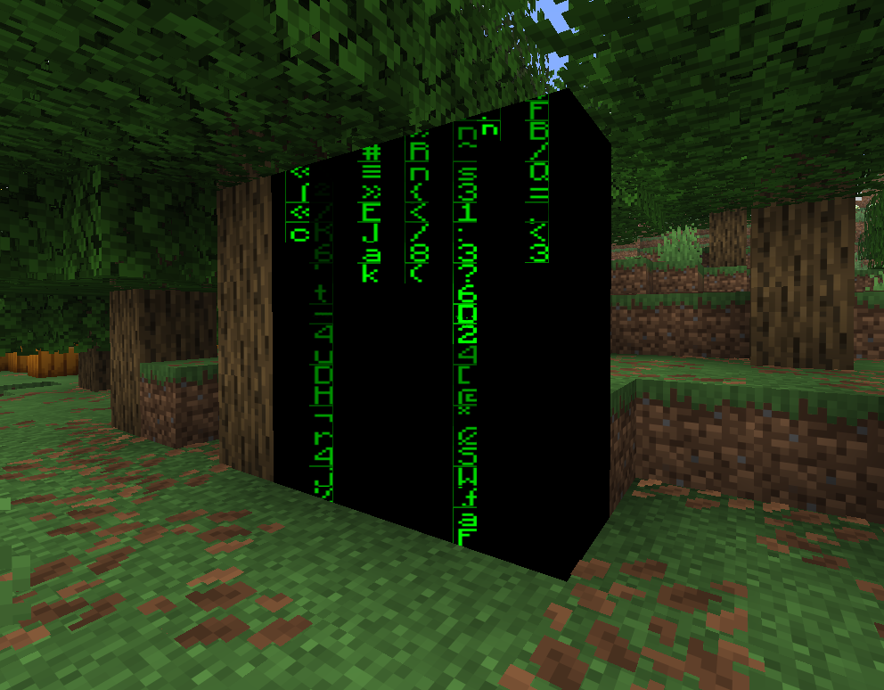

<FeaturedHead
    title='着色器实践篇：代码雨制作'
    authorName='轩宇1725'
    cover = '../_assets/2.png'
/>

## 前言

这是一篇篇幅相对较短的教程，属于着色器实践篇的一部分，主要通过代码雨为实例，介绍以下技巧与技术：

1. 通过纹理标记模型（面），即在颜色通道中存储更多数据的思想

2. 从屏幕坐标采样的使用

3. 计算从子图坐标到精灵图坐标的映射关系，从而访问且仅访问面上的整张纹理

4. 程序化绘制代码雨效果

## 效果展示


## 1. 通过纹理标记模型（面）

在本实例中，我们只修改特定的模型，使其表面上显示代码雨效果。为了实现这一点，我们需要在颜色通道中存储更多数据，以便在片段着色器中识别出这些模型。

我们读取的纹理是RGBA四通道的数据，而只需要一个通道用作存储字符的形状，另外的三个通道都是可以自由使用的，因此我们可以使用颜色通道中的某一个通道（或者三个一起）来进行标记，如本实例中将不透明度设置为 $254/255$ 来标记需要显示代码雨效果的模型。

> 虽然 solid 类型的渲染对象不能输出透明度通道，但其依然可以不透明度.

在检测时，我们使用 `textureLod()` 函数来读取颜色通道数据，并通过判断不透明度是否等于 $254/255$ 来识别出需要显示代码雨效果的模型。关于此函数的说明请参考往期教程 [核心着色器的工作流程（下）](feature/archive/202511/2/content)或官方文档。

```glsl
bool roughly_equals(float a, float b) { // 由于浮点数精度问题，不适合直接使用等号判断
    return abs(a - b) < 0.000001;
}

vec4 color = textureLod(Sampler0, texCoord0, 0.0); // 将Lod等级设为0，避免Mipmap带来的误差
if (roughly_equals(color.a, 254.0 / 255.0)) {
    // 这里是代码雨效果的实现
}
```

## 2. 从屏幕坐标采样的使用

我们希望代码雨效果像末地传送门那样，直接以屏幕坐标进行采样，因此我们需要利用 `projection_from_position()` 函数获取屏幕坐标。

```glsl
// 该函数在 projection.glsl 中定义
vec4 projection_from_position(vec4 position) {
    vec4 projection = position * 0.5; // [-w, w] -> [-w/2, w/2]
    projection.xy = vec2(projection.x + projection.w, projection.y + projection.w); // for xy: [-w/2, w/2] -> [0, w]
    projection.zw = position.zw; // for zw: no change
    return projection;
}
```

该函数的输入是片段在裁剪空间中的位置（即 `gl_Position` ）,在之前的教程中我们已经多次提到过裁剪空间的位置，最终保留的顶点在裁剪空间内的坐标在 $[-w,w]^3$ 内，经过 `projection_from_position()` 函数后，xy 分量被映射到了 $[0,w]$ 区间内，z 分量和 w 分量保持不变。于是，经过透视除法后，xy 分量被映射到了 $[0,1]$ 区间内，z 分量被映射到了 $[0,1]$ 区间内（近裁剪面为0，远裁剪面为1），w 分量变成了1。映射后的 xy 分量即为屏幕坐标。透视除法不需要我们来做，GLSL提供了 `textureProj()` 函数来自动完成透视除法和采样。

该函数接受两个参数，第一个参数是采样器，第二个参数是一个 `vec4` 类型的坐标向量。该函数会自动对坐标向量的前三个分量进行透视除法，然后使用前两个分量作为纹理坐标进行采样。

```glsl
vec4 ndc = projection_from_position(gl_Position);
vec4 screenColor = textureProj(Sampler0, ndc);
```

但是！这是Mojang在末地门渲染中使用的逻辑，但我们实际上可以直接使用 GLSL 的内置特殊变量配合全局量来获取归一化的屏幕坐标，即

```glsl
vec2 ScreenPos = gl_FragCoord.xy / ScreenSize;
vec4 screenColor = texture(Sampler0, ScreenPos);
```

前一种方式的好处在于可以直接使用透视除法后的 z 分量进行深度测试（如末地门方块），而后一种方式则更为简洁高效（但需要从 globals 中获取屏幕尺寸 `ScreenSize` ，检测你使用的版本是否支持该全局量）。我们在下面的代码中采用后一种写法。


## 3. 计算从子图坐标到精灵图坐标的映射关系

由于 Minecraft 的烘焙模型都是体素组成的，而 Minecraft 按每个四边形面（2个三角形，共用4个顶点）的顺序进行渲染。所以，GLSL 的内置变量 `gl_VertexID % 4` 的结果在渲染每个四边形面时都是从0到3循环的。

所以我们可以利用 `gl_VertexID % 4` 来计算出每个顶点在四边形面内的子图坐标（NormalizedUV），即：

```glsl
if (gl_VertexID % 4 == 0) {
        NormalizedUV = vec2(0.0, 1.0);
    } else if (gl_VertexID % 4 == 1) {
        NormalizedUV = vec2(0.0, 0.0);
    } else if (gl_VertexID % 4 == 2) {
        NormalizedUV = vec2(1.0, 0.0);
    } else {
        NormalizedUV = vec2(1.0, 1.0);
    }
```

现在我们希望求出从子图坐标到精灵图坐标的映射关系，假设 **子图区域和精灵图区域之间没有旋转或反转** ，那么我们有如下关系:

$$\begin{pmatrix}\text{texCoord0.x} \\ \text{texCoord0.y}\end{pmatrix} = \underbrace{\begin{pmatrix}k_1 \\ k_2\end{pmatrix} \odot \begin{pmatrix}\text{NormalizedUV.x} \\ \text{NormalizedUV.y}\end{pmatrix}}_{\text{逐分量相乘}}  + \begin{pmatrix}b_1 \\ b_2\end{pmatrix}$$

则我们需要求出向量 $\begin{pmatrix}k_1 \\ k_2\end{pmatrix},\begin{pmatrix}b_1 \\ b_2\end{pmatrix}$

显然，在 Minecraft 的管线限制下，我们无法在 vsh 中获得足够的信息，因此，我们需要利用 fsh 中的偏导函数来求解，即利用已知变量在屏幕坐标上的变化率来求解上述方程中的未知量。

$$\begin{pmatrix}k_1 \\ k_2\end{pmatrix} = \frac{\mathrm{d}\text{texCoord0}}{\mathrm{d}\text{NormalizedUV}}$$

事实上, $\text{texCoord0}$ 和 $\text{NormalizedUV}$ 是关于屏幕坐标 $(x,y)$ 的函数, 则我们可以写出两条独立的分量方程:

为了避免记号上的混乱，我们将 $\text{texCoord0}$ 和 $\text{NormalizedUV}$ 分别记为 $T$ 和 $S$. 两个分量分别为 $T_1,T_2$ 和 $S_1,S_2$. 则上式可以写为.
$$T_1(x,y) = k_1 \cdot S_1(x,y) + b_1 \\
T_2(x,y) = k_2 \cdot S_2(x,y) + b_2$$

对上面两式分别对 $x$ 求偏导数, 得到:

$$\frac{\partial T_1}{\partial x} = k_1 \cdot \frac{\partial S_1}{\partial x}$$

$$\frac{\partial T_2}{\partial x} = k_2 \cdot \frac{\partial S_2}{\partial x}$$

同样地, 对上面两式分别对 $y$ 求偏导数, 得到:

$$\frac{\partial T_1}{\partial y} = k_1 \cdot \frac{\partial S_1}{\partial y}$$

$$\frac{\partial T_2}{\partial y} = k_2 \cdot \frac{\partial S_2}{\partial y}$$

两种表示方式任选其一均可, 这里我们选择对 $x$ 求偏导数的方式. 则我们可以解出:

$$k_1 = \frac{\partial T_1 / \partial x}{\partial S_1 / \partial x}$$

$$k_2 = \frac{\partial T_2 / \partial x}{\partial S_2 / \partial x}$$

由于 GLSL 中的偏导函数和除法都是逐分量操作, 因此我们可以直接写出:

$$\begin{pmatrix}k_1 \\ k_2\end{pmatrix} = \frac{\partial T / \partial x}{\partial S / \partial x}$$

> 注: 算子 $\frac{\partial}{\partial x}$ 即函数 `dFdx()`, 表示对屏幕坐标 $x$ 求偏导数. 同理有 $\frac{\partial}{\partial y}$ 即函数 `dFdy()`.

接下来我们求出向量 $\begin{pmatrix}b_1 \\ b_2\end{pmatrix}$. 由上面的分量方程, 我们可以解出:

$$b_1 = T_1 - k_1 \cdot S_1$$

$$b_2 = T_2 - k_2 \cdot S_2$$

因此我们可以直接写出:

$$\begin{pmatrix}b_1 \\ b_2\end{pmatrix} = T - \begin{pmatrix}k_1 \\ k_2\end{pmatrix} \odot S$$

下面是代码实现:

```glsl
vec2 k = dFdx(texCoord0) / dFdx(NormalizedUV);
vec2 b = texCoord0 - k * NormalizedUV;
vec2 SpriteUV = k * SpriteNormalizedUV + b; // 这一行在最终采样时使用，绘制代码中我们假设在子图内采样即可
```

> 注意，上式的正确性依赖于子图区域和精灵图区域之间没有旋转或反转。如果存在旋转或反转，上述方法将无法正确计算出映射关系。故 vsh 设定子图坐标的代码必须保证特定顺序，**而 Mojang 已经有在不同版本之间修改过顶点顺序的先例** ，因此在实际使用中请务必进行测试验证。

## 4. 绘制代码雨

这里借用了 [Shadertoy, Matrix Code (by _polymath)](https://www.shadertoy.com/view/lsVBWy) 的代码实现，进行了一些修改以适应 Minecraft 着色器环境。

```glsl
#define CELLS vec2(128.0,60.0)
#define FALLERS 7.0
#define FALLERHEIGHT 12.0

vec2 rand(vec2 uv) {
    vec2 r = floor(abs(mod(cos(
        uv * 652.6345 + uv.yx * 534.375 +
        GameTime * 1200 * 0.0000005 * dot(uv, vec2(0.364, 0.934))),
     0.001)) * 16000.0);
    return mod(r, 16.0);
}

float fallerSpeed(float col, float faller) {
    return mod(cos(col * 363.435 + faller * 234.323), 0.1) * 1.0 + 0.3;
}
```

```glsl
// 在我们的 if 分支中
vec2 k = dFdx(texCoord0) / dFdx(NormalizedUV);
vec2 b = texCoord0 - k * NormalizedUV;

vec2 uv = gl_FragCoord.xy / ScreenSize;

vec2 pix = mod(uv, 1.0/CELLS);
vec2 cell = (uv - pix) * CELLS;
pix *= CELLS * vec2(0.8, 1.0) + vec2(0.1, 0.0);

float c = texture(Sampler0, k * (rand(cell) + pix) / 16.0 + b).x;

float brightness = 0.0;
for (float i = 0.0; i < FALLERS; ++i) {
    float f = 3.0 - cell.y * 0.05 -
        mod((GameTime * 1200 + i * 3534.34) * fallerSpeed(cell.x, i), FALLERHEIGHT);
    if (f > 0.0 && f < 1.0)
        brightness += f;
}

fragColor = vec4(0.0, c * brightness, 0.0, 1.0);
```

我们逐行解析绘制原理:

首先对于 `rand` 函数, 它接受一个 `vec2` 类型的 `uv` 坐标, 并返回一个 `vec2` 类型的伪随机数，由于 cell 取的是一系列整数，所以 `rand(cell)` 会返回一个在 $[0,15]$ 之间的整数坐标，用于从子图中选取字符。

接下来是 `fallerSpeed` 函数, 它接受两个浮点数参数 `col` 和 `faller`, 并返回一个浮点数类型的速度值. 该函数同样利用了三角函数的周期性来生成速度值, 使得每一列的代码雨下落速度略有不同。

在主绘制代码中,CELLS 定义了代码雨的列数和行数，`pix` 的计算结果就是当前片元在一个单元格内的偏移量坐标，`cell` 的计算结果就是当前片元所在的单元格坐标。

`pix *= CELLS * vec2(0.8, 1.0) + vec2(0.1, 0.0);` 这一行代码的作用是对 `pix` 进行缩放和平移，使得代码雨的字符在单元格内有一定的边距，从而避免字符紧贴单元格边缘。最终是一个 $[0.1,0.9)$ 之间的数字。

下文采样时的坐标为 `(rand(cell) + pix) / 16.0`，其中 `rand(cell)` 生成了一个基于单元格坐标的伪随机偏移量，这个偏移量是为了在子图中选取随机的字符，而 `pix` 则是当前片元在单元格内的偏移量。将两者相加后除以16.0，是因为子图中的字符是按16x16的网格排列的。

结合前文所说的变换公式，我们将 `(rand(cell) + pix) / 16.0` 代入到 `SpriteNormalizedUV` 中，最终得到的采样坐标为 `k * (rand(cell) + pix) / 16.0 + b`。

从该处采样，取第一个通道得到字符形状 `c` 后，我们需要计算该片元的亮度 `brightness`。亮度的计算是通过一个循环来实现的，循环次数为 `FALLERS`，即代码雨的下落列数。这就达到了下落过程中尾部变暗，头部变亮的效果。

## 5. 最终程序

最终我们组合各个部分，得到完整的片段着色器代码如下:

```glsl
// terrain.vsh
#version 330

#moj_import <minecraft:fog.glsl>
#moj_import <minecraft:globals.glsl>
#moj_import <minecraft:chunksection.glsl>
#moj_import <minecraft:projection.glsl>

in vec3 Position;
in vec4 Color;
in vec2 UV0;
in ivec2 UV2;
in vec3 Normal;

uniform sampler2D Sampler2;

out float sphericalVertexDistance;
out float cylindricalVertexDistance;
out vec4 vertexColor;
out vec2 texCoord0;
out vec2 NormalizedUV; // 这里增加了一个输出变量

vec4 minecraft_sample_lightmap(sampler2D lightMap, ivec2 uv) {
    return texture(lightMap, clamp((uv / 256.0) + 0.5 / 16.0, vec2(0.5 / 16.0), vec2(15.5 / 16.0)));
}

void main() {
    vec3 pos = Position + (ChunkPosition - CameraBlockPos) + CameraOffset;
    gl_Position = ProjMat * ModelViewMat * vec4(pos, 1.0);

    sphericalVertexDistance = fog_spherical_distance(pos);
    cylindricalVertexDistance = fog_cylindrical_distance(pos);
    vertexColor = Color * minecraft_sample_lightmap(Sampler2, UV2);
    texCoord0 = UV0;
    if (gl_VertexID % 4 == 0) { // 通过顶点ID计算子图坐标，注意顺序
        NormalizedUV = vec2(0.0, 1.0);
    } else if (gl_VertexID % 4 == 1) {
        NormalizedUV = vec2(0.0, 0.0);
    } else if (gl_VertexID % 4 == 2) {
        NormalizedUV = vec2(1.0, 0.0);
    } else {
        NormalizedUV = vec2(1.0, 1.0);
    }
}
```

```glsl
// terrain.fsh
#version 330

#moj_import <minecraft:fog.glsl>
#moj_import <minecraft:globals.glsl>
#moj_import <minecraft:chunksection.glsl>

uniform sampler2D Sampler0;

in float sphericalVertexDistance;
in float cylindricalVertexDistance;
in vec4 vertexColor;
in vec2 texCoord0;
in vec2 NormalizedUV; // 这里增加了一个输入变量

out vec4 fragColor;

// 这里的代码是新版原本渲染增加的采样函数，可能看起来比较陌生，我们不需要深入理解它的实现细节

vec4 sampleNearest(sampler2D sampler, vec2 uv, vec2 pixelSize, vec2 du, vec2 dv, vec2 texelScreenSize) {
    ...
}

vec4 sampleNearest(sampler2D source, vec2 uv, vec2 pixelSize) {
    ...
}

// Rotated Grid Super-Sampling
vec4 sampleRGSS(sampler2D source, vec2 uv, vec2 pixelSize) {
    ...
}

bool roughly_equals(float a, float b) { // 由于浮点数精度问题，不适合直接使用等号判断
    return abs(a - b) < 0.000001;
}

#define CELLS vec2(128.0,60.0) // 这一项配置了代码雨的列数和行数
#define FALLERS 4.0 // 决定在同一列上同时模拟的下落雨滴数量。值越大，同一列上同时出现的雨滴流越多，显得越密集
#define FALLERHEIGHT 16.0 // 控制单个雨滴的视觉长度和下落循环的周期。值越大，雨滴越长，且两次重置之间的时间间隔也越长

vec2 rand(vec2 uv) { // 基于三角函数的伪随机数生成函数
    vec2 r = floor(abs(mod(cos(
        uv * 652.6345 + uv.yx * 534.375 +
        GameTime * 1200 * 0.0000005 * dot(uv, vec2(0.364, 0.934))),
     0.001)) * 16000.0);
    return mod(r, 16.0);
}

float fallerSpeed(float col, float faller) { // 基于三角函数的速度生成函数
    return mod(cos(col * 363.435 + faller * 234.323), 0.1) * 1.0 + 0.3;
}

void main() {
    vec4 raw_color = textureLod(Sampler0, texCoord0, 0.0);
    if (roughly_equals(raw_color.a, 254.0 / 255.0)) {        
        vec2 k = dFdx(texCoord0) / dFdx(NormalizedUV);
        vec2 b = texCoord0 - k * NormalizedUV;
        
        vec2 uv = gl_FragCoord.xy / ScreenSize;

        vec2 pix = mod(uv, 1.0/CELLS);
        vec2 cell = (uv - pix) * CELLS;
        pix *= CELLS * vec2(0.8, 1.0) + vec2(0.1, 0.0);
    
        float c = texture(Sampler0, k * (rand(cell) + pix) / 16.0 + b).x;
        
        float brightness = 0.0;
        for (float i = 0.0; i < FALLERS; ++i) {
            float f = 6.0 - cell.y * 0.05 -
                mod((GameTime * 1200 + i * 3534.34) * fallerSpeed(cell.x, i), FALLERHEIGHT);
            if (f > 0.0 && f < 1.0)
                brightness += f;
        }
        
        fragColor = vec4(0.0, c * brightness, 0.0, 1.0);
    }else{
        // 原版渲染分支
        vec4 color = (UseRgss == 1 ? sampleRGSS(Sampler0, texCoord0, 1.0f / TextureSize) : sampleNearest(Sampler0, texCoord0, 1.0f / TextureSize)) * vertexColor;
        color = mix(FogColor * vec4(1, 1, 1, color.a), color, ChunkVisibility);
        #ifdef ALPHA_CUTOUT
        if (color.a < ALPHA_CUTOUT) {
            discard;
        }
        #endif
        fragColor = apply_fog(color, sphericalVertexDistance, cylindricalVertexDistance, FogEnvironmentalStart, FogEnvironmentalEnd, FogRenderDistanceStart, FogRenderDistanceEnd, FogColor);
    }
}

```

而纹理是通过原版资源包的 `textures/font/ascii` 修改而来，这里我们用 r 通道作为形状通道，g,b 通道均设为 $1.0$，a 通道设为 $254/255$ 作为标记。



将纹理应用到方块上，即可得到最终效果：



> 这里修改的是terrain着色器，所以效果只适用于放置在世界中的方块（非实体类型）。如果想要让代码雨效果应用于实体类型的模型，可以将相应的代码移植到 `entity.vsh` 和 `entity.fsh` 中。特别注意的是，如果要应用于粒子效果，需要注意 z-flighting 的问题，粒子可能存在 24 个顶点，但是Minecraft的渲染逻辑是渲染一个方位的全部面，然后再渲染下一个方位的全部面，所以无法通过 `gl_VertexID % 24` 来进行适配，欢迎读者提出更好的解决方案。（不过用展示实体模拟粒子是很方便的）