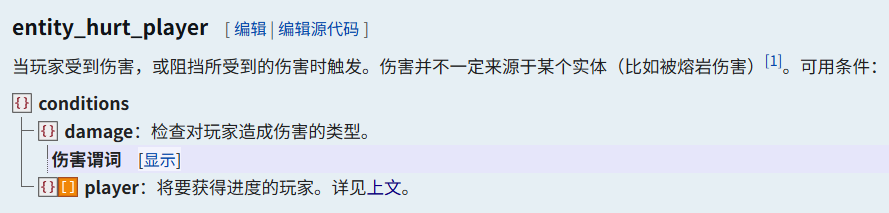
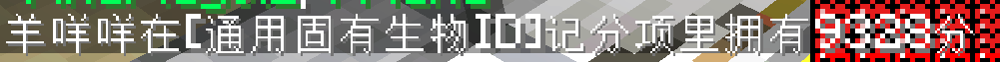

<FeatureHead
    title='TheSkyBlessing 解析其三——检测生物攻击'
    authorName='伶'
    cover = '../_assets/5.png'
/>

## 前言

游戏资产是游戏开发组成的一个重要部分，在 mc 的大型项目中也是如此，从无论是友好还是敌对的所有生物，到游戏中可以收集的每一件装备，如何对这些内容实施统一管理和高效复用是拓展项目绕不开的问题，而这次要提到的是游戏资产中的生物。

生物在资产库中有自己的 attack 函数，其中记录了要传入伤害计算模块的各个参数，而要触发这个 attack 函数需要在检测到生物攻击玩家时获取到生物的资产库 id，或者说要能够以生物为执行者执行一个函数，因此我们便有了检测生物攻击的需求。

而在原版游戏中，有这么一个进度准则触发器 entity_hurt_player，原版的用途为在玩家受到伤害时给予玩家成就，因此很自然地就可以想到用这个触发器来检测生物伤害了玩家或者说发起了攻击，并在玩家获得进度时移除进度并执行需要的函数。



但是这样又有一个新的问题，就是 entity_hurt_player 这个触发器的奖励函数的执行者是受伤的玩家而不是造成伤害的生物，于是为了解决这个问题引入了下面 TSB 地图中的解决方法，在依然使用 entity_hurt_player 检测生物造成伤害的前提下，将问题思路转变为在奖励函数触发时获取到玩家附近刚刚对其造成伤害的这个生物，从而达到其重做原版攻击伤害机制的目的。

相较于前几篇解析这次要介绍的内容会更简短些，只挑选了更贴近原版的那部分介绍，如果有自定义生物和需要重做伤害系统的制作需求，下面要介绍的方案不失为一种选择。依然快速吟唱，TSB 是一个可玩性和技术性含量都很高的地图作品，感兴趣的读者推荐自行游玩，数据包相关内容也都可以在官方项目仓库中找到，相关链接可以在文末找到。

下面进入正题。

## 将 UUID 转换为生物标签

在生物创建时的初始化步骤中用到了这么一个 add_flag 函数

```
scoreboard players add $FlagIndex Global 1
scoreboard players operation $FlagIndex Global %= $2^15 Const
execute if score $FlagIndex Global matches 0 run scoreboard players add $FlagIndex Global 1
scoreboard players operation @s MobUUID = $FlagIndex Global

scoreboard players operation $CloneFlagIndex Temporary = $FlagIndex Global
scoreboard players operation $CloneFlagIndex Temporary *= $2^16 Const
execute if score $CloneFlagIndex Temporary matches 00.. run tag @s add FindFlag0.0
execute if score $CloneFlagIndex Temporary matches ..-1 run tag @s add FindFlag0.1
scoreboard players operation $CloneFlagIndex Temporary *= $2 Const
execute if score $CloneFlagIndex Temporary matches 00.. run tag @s add FindFlag1.0
execute if score $CloneFlagIndex Temporary matches ..-1 run tag @s add FindFlag1.1
scoreboard players operation $CloneFlagIndex Temporary *= $2 Const
execute if score $CloneFlagIndex Temporary matches 00.. run tag @s add FindFlag2.0
execute if score $CloneFlagIndex Temporary matches ..-1 run tag @s add FindFlag2.1
scoreboard players operation $CloneFlagIndex Temporary *= $2 Const
execute if score $CloneFlagIndex Temporary matches 00.. run tag @s add FindFlag3.0
execute if score $CloneFlagIndex Temporary matches ..-1 run tag @s add FindFlag3.1
scoreboard players operation $CloneFlagIndex Temporary *= $2 Const
execute if score $CloneFlagIndex Temporary matches 00.. run tag @s add FindFlag4.0
execute if score $CloneFlagIndex Temporary matches ..-1 run tag @s add FindFlag4.1
scoreboard players operation $CloneFlagIndex Temporary *= $2 Const
execute if score $CloneFlagIndex Temporary matches 00.. run tag @s add FindFlag5.0
execute if score $CloneFlagIndex Temporary matches ..-1 run tag @s add FindFlag5.1
scoreboard players operation $CloneFlagIndex Temporary *= $2 Const
execute if score $CloneFlagIndex Temporary matches 00.. run tag @s add FindFlag6.0
execute if score $CloneFlagIndex Temporary matches ..-1 run tag @s add FindFlag6.1
scoreboard players operation $CloneFlagIndex Temporary *= $2 Const
execute if score $CloneFlagIndex Temporary matches 00.. run tag @s add FindFlag7.0
execute if score $CloneFlagIndex Temporary matches ..-1 run tag @s add FindFlag7.1
scoreboard players operation $CloneFlagIndex Temporary *= $2 Const
execute if score $CloneFlagIndex Temporary matches 00.. run tag @s add FindFlag8.0
execute if score $CloneFlagIndex Temporary matches ..-1 run tag @s add FindFlag8.1
scoreboard players operation $CloneFlagIndex Temporary *= $2 Const
execute if score $CloneFlagIndex Temporary matches 00.. run tag @s add FindFlag9.0
execute if score $CloneFlagIndex Temporary matches ..-1 run tag @s add FindFlag9.1
scoreboard players operation $CloneFlagIndex Temporary *= $2 Const
execute if score $CloneFlagIndex Temporary matches 00.. run tag @s add FindFlag10.0
execute if score $CloneFlagIndex Temporary matches ..-1 run tag @s add FindFlag10.1
scoreboard players operation $CloneFlagIndex Temporary *= $2 Const
execute if score $CloneFlagIndex Temporary matches 00.. run tag @s add FindFlag11.0
execute if score $CloneFlagIndex Temporary matches ..-1 run tag @s add FindFlag11.1
scoreboard players operation $CloneFlagIndex Temporary *= $2 Const
execute if score $CloneFlagIndex Temporary matches 00.. run tag @s add FindFlag12.0
execute if score $CloneFlagIndex Temporary matches ..-1 run tag @s add FindFlag12.1
scoreboard players operation $CloneFlagIndex Temporary *= $2 Const
execute if score $CloneFlagIndex Temporary matches 00.. run tag @s add FindFlag13.0
execute if score $CloneFlagIndex Temporary matches ..-1 run tag @s add FindFlag13.1
scoreboard players operation $CloneFlagIndex Temporary *= $2 Const
execute if score $CloneFlagIndex Temporary matches 00.. run tag @s add FindFlag14.0
execute if score $CloneFlagIndex Temporary matches ..-1 run tag @s add FindFlag14.1
scoreboard players operation $CloneFlagIndex Temporary *= $2 Const
execute if score $CloneFlagIndex Temporary matches 00.. run tag @s add FindFlag15.0
execute if score $CloneFlagIndex Temporary matches ..-1 run tag @s add FindFlag15.1
scoreboard players reset $CloneFlagIndex Temporary
```

撇开下面一长串添加标签的部分，函数的第一步其实很好理解——在全局计分板下有一个每创建一个生物都会增加的索引号，这个索引号最大值为 2^16 达到时重置，这个 ID 即为生物的 UUID

```
scoreboard players add $FlagIndex Global 1
scoreboard players operation $FlagIndex Global %= $2^15 Const
execute if score $FlagIndex Global matches 0 run scoreboard players add $FlagIndex Global 1
scoreboard players operation @s MobUUID = $FlagIndex Global
```

后面的部分看似很复杂，但其实前几篇 TSB 解析中也已经使用了很多次了，十进制转其它进制然后获取数位的方法在地图里使用地非常频繁，这里的思路是——**将 UUID 转换为二进制数后，通过不断左移检测当前位数为 0 或 1 并为生物添加对应位数的标签**。标签格式为 FindFlag（位数）/（为 0 或为 1），注意位数是从 0 开始计算的（第 n 个数字的位数是 n-1）

```
scoreboard players operation $CloneFlagIndex Temporary = $FlagIndex Global
scoreboard players operation $CloneFlagIndex Temporary *= $2^16 Const
execute if score $CloneFlagIndex Temporary matches 00.. run tag @s add FindFlag0.0
execute if score $CloneFlagIndex Temporary matches ..-1 run tag @s add FindFlag0.1
scoreboard players operation $CloneFlagIndex Temporary *= $2 Const

# 不断左移....
```

为了更直观看到这个函数的作用，我们在地图中找到出生点附近的小羊，直接查询其 MobUUID 计分值



以上面生物 UUID 为 9328 为例子，生成此生物时函数流程可以归纳如下

1. 获取当前全局索引号 9328，将其存为生物的 MobUUID
2. 将十进制索引号的值转换为二进制，补齐至十六位（0010 0100 0111 0000）
3. 开始左移
    1. 第 0 位为 0，添加标签 FindFlag0.0
    2. 第 1 位为 0，添加标签 FindFlag1.0
    3. 第 2 位为 1，添加标签 FindFlag2.1
    4. 第 3 位为 0，添加标签 FindFlag3.0
    5. …
    6. 第 15 位为 0，添加标签 FindFlag15.0
4. 16 位数字检查完毕，自此结束

于是在游戏里一个生物实体所拥有的标签会变成这样，除了 AlreadyInitMob、AssetMob、Friend 这三个简单易懂的标签，其余 FindFlag 开头的标签都是为标志生物 UUID 服务的


通过这种生物创建时为其添加标签的操作，我们已经能够通过生物带有的标签得知其 UUID，UUID 对于每一个生物都是唯一的，那么生物带有的 UUID 标签也会是唯一的，那么通过标签反推生物的思路也就有了，而具体的做法要在下面的进度定义的部分中完成

## 进度检测生物造成伤害

在 advancements 目录下有 check_entity_hurt_player 这个进度，文件如下，内容较长做了些注释处理

```
{
  "criteria": {

	  #依次检测16位的标签，共32个准则，此处省略后面的部分

    "0-0": {
      "conditions": {
        "damage": { "source_entity": { "nbt": "{Tags:[\"FindFlag0.0\"]}" } }
      },
      "trigger": "entity_hurt_player"
    },
    "0-1": {
      "conditions": {
        "damage": { "source_entity": { "nbt": "{Tags:[\"FindFlag0.1\"]}" } }
      },
      "trigger": "entity_hurt_player"
    },
    "1-0": {
      "conditions": {
        "damage": { "source_entity": { "nbt": "{Tags:[\"FindFlag1.0\"]}" } }
      },
      "trigger": "entity_hurt_player"
    },
    "1-1": {
      "conditions": {
        "damage": { "source_entity": { "nbt": "{Tags:[\"FindFlag1.1\"]}" } }
      },
      "trigger": "entity_hurt_player"
    },

    # ...

    # 伤害是否被格挡

    "blocked": {
      "conditions": { "damage": { "blocked": true, "source_entity": {} } },
      "trigger": "entity_hurt_player"
    },
    "blocked-false": {
      "conditions": { "damage": { "blocked": false, "source_entity": {} } },
      "trigger": "entity_hurt_player"
    },

    # 伤害类型-爆炸

    "type-explosion": {
      "conditions": {
        "damage": {
          "source_entity": {},
          "type": { "tags": [{ "expected": true, "id": "is_explosion" }] }
        }
      },
      "trigger": "entity_hurt_player"
    },

    # 伤害类型-近战

    "type-melee": {
      "conditions": {
        "damage": {
          "source_entity": {},
          "type": { "tags": [{ "expected": true, "id": "is_melee" }] }
        }
      },
      "trigger": "entity_hurt_player"
    },

    # 伤害类型-弹射物

    "type-projectile": {
      "conditions": {
        "damage": {
          "source_entity": {},
          "type": { "tags": [{ "expected": true, "id": "is_projectile" }] }
        }
      },
      "trigger": "entity_hurt_player"
    }

    # 近战、爆炸、弹射物之外的伤害类型

    "type-other": {
      "conditions": {
        "damage": {
          "type": {
            "tags": [
              { "expected": false, "id": "is_melee" },
              { "expected": false, "id": "is_projectile" },
              { "expected": false, "id": "is_explosion" }
            ]
          }
        }
      },
      "trigger": "player_hurt_entity"
    },
  },
  "requirements": [
    ["0-0", "0-1"],
    ["1-0", "1-1"],
    ["2-0", "2-1"],
    ["3-0", "3-1"],
    ["4-0", "4-1"],
    ["5-0", "5-1"],
    ["6-0", "6-1"],
    ["7-0", "7-1"],
    ["8-0", "8-1"],
    ["9-0", "9-1"],
    ["10-0", "10-1"],
    ["11-0", "11-1"],
    ["12-0", "12-1"],
    ["13-0", "13-1"],
    ["14-0", "14-1"],
    ["15-0", "15-1"],
    ["type-melee", "type-projectile", "type-explosion", "type-other"],
    ["blocked", "blocked-false"]
  ],
  "rewards": {
    "function": "mob_manager:entity_finder/entity_hurt_player/on_hurt"
  }
}
```

参考 wiki 上的进度定义格式，我们可以对这个进度文件的内容做如下划分

1. 定义了 32 个和生物带有的 UUID 标签相关的准则，依次对应 UUID 的十六位和每一位 0 和 1 两种情况。此外还有两个伤害是否被格挡的准则，三个伤害类型的准则。这些准则都会在生物实体伤害玩家后进行检测
2. 达成进度的要求是 16 位 UUID 检测通过，此时受伤玩家会根据造成伤害的生物带有的标签达成对应的准则，如生物带有标签 5-1（UUID 第五位为 1），其对玩家造成伤害时受伤的玩家就会达成准则 5-1
3. 玩家达成成就时执行奖励函数 on_hurt


到这里我们已经通过进度准则触发器中的各种谓词获取到了这一次玩家受伤事件的相关信息，如伤害类型以及是否被格挡，更重要的是将造成伤害的生物带有的 UUID 标签转换为玩家达成的进度准则

奖励函数 on_hurt 以受伤的玩家作为执行者，调用了一个 filters 函数，执行结束时移除了进度。玩家的战斗状态也在这里重置（地图按玩家受到伤害的一段时间来判断玩家是否处于战斗状态）

```
# on_hurt

function mob_manager:entity_finder/entity_hurt_player/filters/
scoreboard players set @s InBattleTick 160
advancement revoke @s only mob_manager:entity_finder/check_entity_hurt_player
```

filters 函数会选取到受伤玩家周围 150 格范围内的所有生物实体，并以这些生物实体为执行者执行过滤函数

```
# filters

execute as @e[type=#lib:living,type=!player,distance=..150] run function mob_manager:entity_finder/entity_hurt_player/filters/15
```

过滤函数共有十六个，每一个分别检测生物 UUID 标签中的一位，根据受伤玩家达成的进度准则来判断是否可以进入下一层过滤，就这样逐层调用十六次，能够全部通过的生物即为刚刚对玩家造成伤害的生物。文件层次较多，下面只贴了一部分示例参考

```
# filters/15

execute if entity @p[tag=DamagedPlayer,advancements={mob_manager:entity_finder/check_entity_hurt_player={15-0=true}}] if entity @s[tag=FindFlag15.0] run function mob_manager:entity_finder/entity_hurt_player/filters/14
execute if entity @p[tag=DamagedPlayer,advancements={mob_manager:entity_finder/check_entity_hurt_player={15-1=true}}] if entity @s[tag=FindFlag15.1] run function mob_manager:entity_finder/entity_hurt_player/filters/14
```

```
# filters/14

execute if entity @p[tag=DamagedPlayer,advancements={mob_manager:entity_finder/check_entity_hurt_player={14-0=true}}] if entity @s[tag=FindFlag14.0] run function mob_manager:entity_finder/entity_hurt_player/filters/13
execute if entity @p[tag=DamagedPlayer,advancements={mob_manager:entity_finder/check_entity_hurt_player={14-1=true}}] if entity @s[tag=FindFlag14.1] run function mob_manager:entity_finder/entity_hurt_player/filters/13
```

```
# filters/0

execute if entity @p[tag=DamagedPlayer,advancements={mob_manager:entity_finder/check_entity_hurt_player={0-0=true}}] if entity @s[tag=FindFlag0.0] run function mob_manager:entity_finder/entity_hurt_player/fetch_entity
execute if entity @p[tag=DamagedPlayer,advancements={mob_manager:entity_finder/check_entity_hurt_player={0-1=true}}] if entity @s[tag=FindFlag0.1] run function mob_manager:entity_finder/entity_hurt_player/fetch_entity
```

依然以上面 UUID 为 9328 号的生物为例，假设其对玩家造成了伤害，这个进度的工作流程如下

1. 进度触发
    1. 生物具有标签 FindFlag0.0，玩家达成准则 0-0
    2. 生物具有标签 FindFlag1.0，玩家达成准则 1-0
    3. 生物具有标签 FindFlag2.1，玩家达成准则 2-1
    4. （以此类推）
    5. 生物具有标签 FindFlag15.0，玩家达成准则 15-0
2. filters 函数触发，执行主体为玩家
3. 选择玩家周围 150 格内所有生物执行过滤函数
    1. 玩家达成准则 0-0，如果生物具有标签 FindFlag0.0，则继续下一步过滤
    2. 玩家达成准则 1-0，如果生物具有标签 FindFlag1.0，则继续下一步过滤
    3. 玩家达成准则 2-1，如果生物具有标签 FindFlag2.1，则继续下一步过滤
    4. （以此类推）
    5. 玩家达成准则 15-0，如果生物具有标签 FindFlag15.0，则说明这就是第一步对玩家造成伤害的生物，以其为执行者执行 fetch_entity 函数
4. 移除玩家的进度

## 找到目标生物之后的操作

到了这里后面的步骤已经很清晰了，因为我们已经在玩家附近找到了对其造成伤害的生物，也能够通过目标选择器以其为执行者执行一个函数，通过其它方式检测生物类型并实现攻击附带 debuff 之类的效果已经非常简单了。作为尾声，这里附上 fetch_entity 函数的部分内容作为功能参考，不理解没关系，因为要想完全解释清楚这些内容不知道还要多少篇解析（

1. **将玩家本次受伤的伤害、造成伤害的生物的 UUID 等信息交给伤害计算模块，通过 UUID 可以在资产库中查找到生物的攻击伤害和攻击属性等信息，计算伤害的最终值并设置玩家的血量（score_to_health 是一个支持通过分数修改玩家血量的轮子数据包，地图中的伤害计算均通过这样修改玩家生命值实现）。从而绕开了原版伤害机制，不再需要通过原版命令设置生物攻击力**

    ```
    scoreboard players set $Damage Temporary 0
    scoreboard players operation $Damage Temporary += @p[tag=DamagedPlayer] TakenDamage
    scoreboard players operation $Damage Temporary += @p[tag=DamagedPlayer] AbsorbedDamage
    scoreboard players operation $Damage Temporary *= $10 Const
    execute store result storage api: Argument.Fluctuation double -0.1 run scoreboard players get @p[tag=DamagedPlayer] AbsorbedDamage
    execute store result storage api: Argument.Attacker int 1 run scoreboard players get @s MobUUID
    data modify storage api: Argument.DeathMessage set value ['{"translate":"%1$s被%2$s击败","with":[{"selector":"@s"},{"nbt":"Return.AttackerName","storage":"lib:","interpret":true}]}']
    data modify storage api: Argument.DisableLog set value true
    execute as @p[tag=DamagedPlayer] at @s run function lib:score_to_health_wrapper/fluctuation
    ```

2. **将玩家本次受伤的事件信息（如是否是近战和是否被格挡）存储到玩家的 OhMyDat 数据空间的神器事件（ArtifactEvents）中，以使玩家有对应效果的神器能够接收事件并触发其效果（如带有受伤时弹反效果的神器）**

    ```
    data modify storage oh_my_dat: _[-4][-4][-4][-4][-4][-4][-4][-4].ArtifactEvents.Damage append value {IsVanilla:true}
    data modify storage oh_my_dat: _[-4][-4][-4][-4][-4][-4][-4][-4].ArtifactEvents.Damage[-1].Type set from storage mob_manager:entity_finder DamageType
    data modify storage oh_my_dat: _[-4][-4][-4][-4][-4][-4][-4][-4].ArtifactEvents.Damage[-1].Blocked set from storage mob_manager:entity_finder Blocked
    execute store result storage oh_my_dat: _[-4][-4][-4][-4][-4][-4][-4][-4].ArtifactEvents.Damage[-1].From int 1 run scoreboard players get @s MobUUID
    execute store result storage oh_my_dat: _[-4][-4][-4][-4][-4][-4][-4][-4].ArtifactEvents.Damage[-1].Amount double 0.01 run scoreboard players get $Damage Temporary
    ```

3. **将生物的攻击事件信息存到生物的数据空间中（如是否被格挡和造成的伤害值），以便这个攻击事件的信息在其它位置调用（如生物的 tick 函数或 attack 函数）**

    ```
    function oh_my_dat:please
    data modify storage oh_my_dat: _[-4][-4][-4][-4][-4][-4][-4][-4].MobEvents.Attack append value {IsVanilla:true}
    data modify storage oh_my_dat: _[-4][-4][-4][-4][-4][-4][-4][-4].MobEvents.Attack[-1].Type set from storage mob_manager:entity_finder DamageType
    data modify storage oh_my_dat: _[-4][-4][-4][-4][-4][-4][-4][-4].MobEvents.Attack[-1].Blocked set from storage mob_manager:entity_finder Blocked
    data modify storage oh_my_dat: _[-4][-4][-4][-4][-4][-4][-4][-4].MobEvents.Attack[-1].To append value -1
    execute store result storage oh_my_dat: _[-4][-4][-4][-4][-4][-4][-4][-4].MobEvents.Attack[-1].To[-1] int 1 run scoreboard players get @p[tag=DamagedPlayer] UserID
    data modify storage oh_my_dat: _[-4][-4][-4][-4][-4][-4][-4][-4].MobEvents.Attack[-1].Amounts append value -1d
    execute store result storage oh_my_dat: _[-4][-4][-4][-4][-4][-4][-4][-4].MobEvents.Attack[-1].Amounts[-1] double 0.01 run scoreboard players get $Damage Temporary
    ```

## 附录

TheSkyBlessing 项目官网

[https://project-tsb.org/](https://project-tsb.org/)

TheSkyBlessing 项目数据包仓库

[GitHub - ProjectTSB/TheSkyBlessing: TheSkyBlessing のベース Datapack のリポジトリ](https://github.com/ProjectTSB/TheSkyBlessing)
