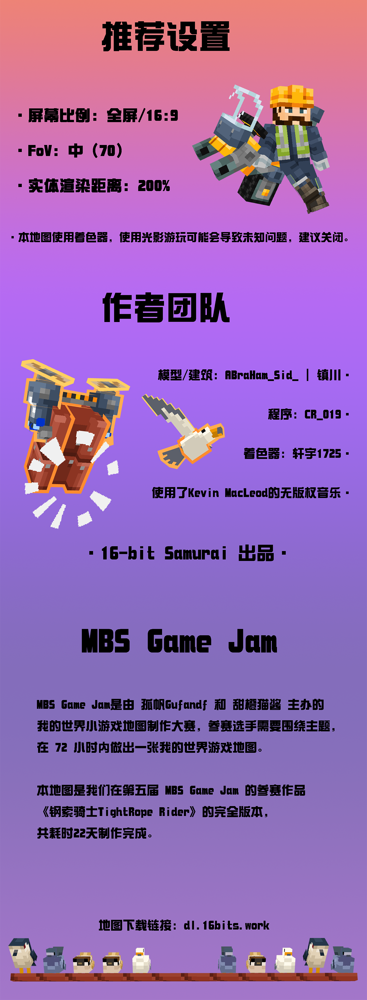
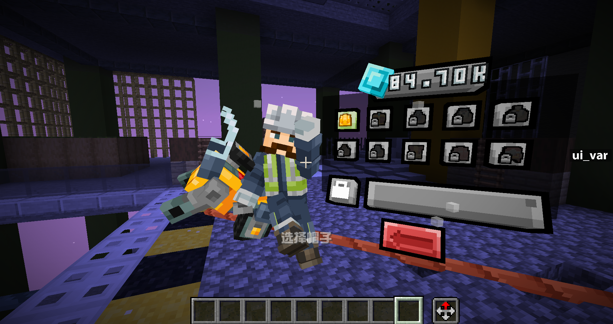
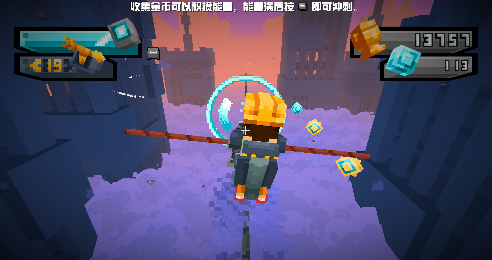
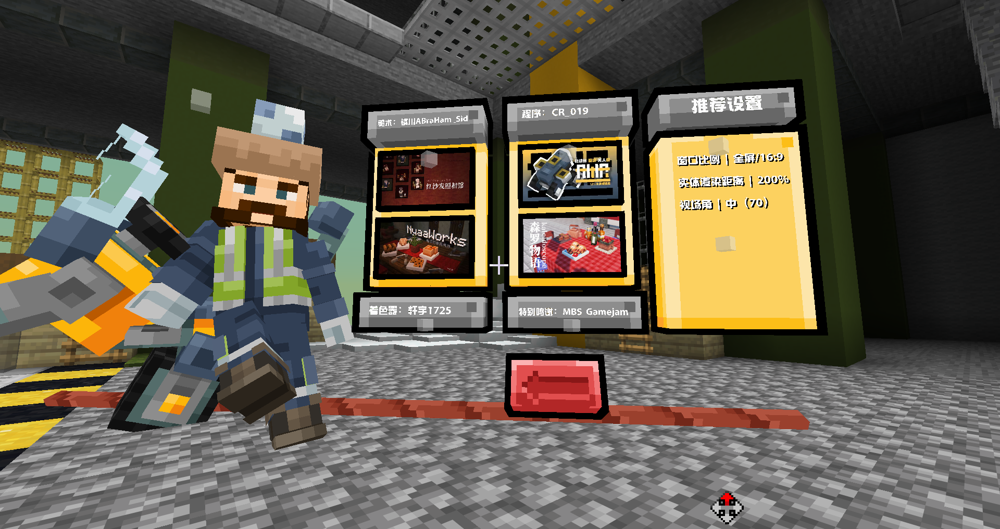
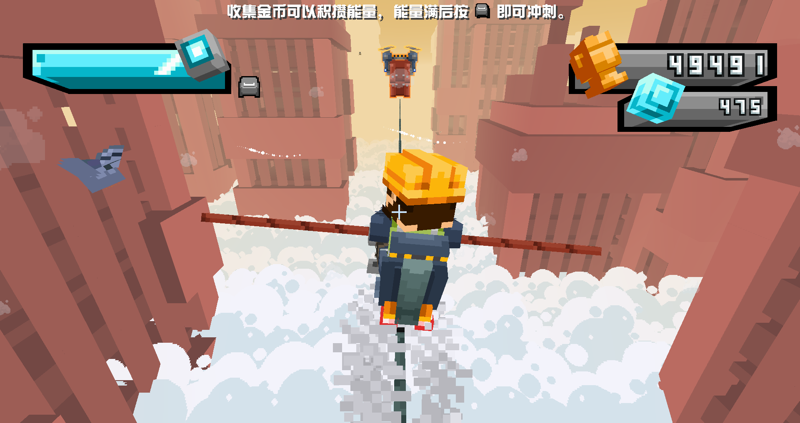
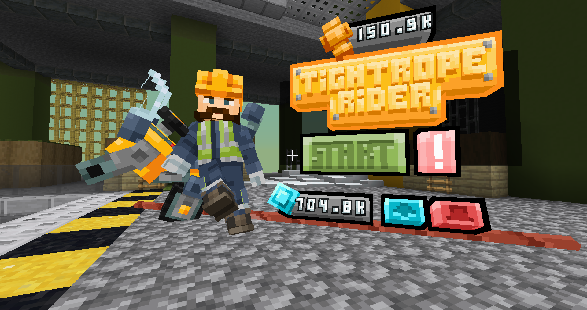
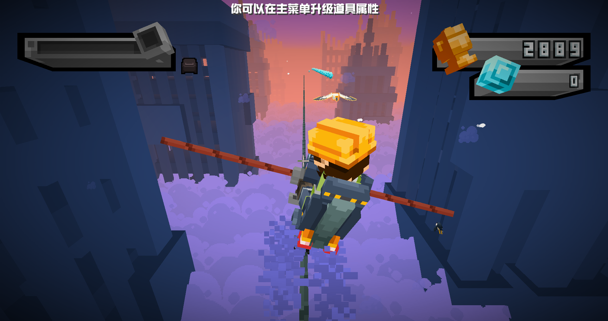

<FeaturedHead
    title='独游水准的MC小游戏？《钢索骑士》'
    authorName='CR_019'
    cover = '../_assets/1.png'
    :extraAuthors="['镇川', '轩宇1725']"
/>

> 你说的对，但是 《钢索骑士TightRope Rider》 是由 16-bit Samurai 自主研发的一款全新单机跑酷游戏。 游戏发生在城市高处的一根钢索上，你将扮演一位骑着平衡机车的神秘角色，在无尽的钢索上邂逅各种鸟类，和他们一起收集道具、躲避障碍——同时，逐步发掘「被海鸥抢走的早餐」的真相。

## 简介
这是一张跑酷小游戏地图，你将在无尽的钢索上保持平衡，收集道具，躲避障碍，并邂逅各种鸟儿。  \
本地图包含特色：  
- 开场CG和流畅的待机动画
- 精致的模型和场景
- 4种鸟类，3种障碍和3种道具
- 升级和帽子选择系统
- 成就系统

## 图片展示

## 宣传片

https://www.bilibili.com/video/BV1MENPzsExT

## 地图下载

地图下载：dl.16bits.work 
备用链接（百度网盘）： https://pan.baidu.com/s/17bb0h82_KnJFaVW8yJ1Sow?pwd=5688
地图支持单人游玩。
仅支持 Minecraft 版本 Java 1.21.11

--- 

16-bit Samurai 交流群：964165648

---

（地图提供三个版本。各版本的地图内容没有本质区别，仅在开幕cg的清晰度上有区分。Lite为480p，Standard为720p，HD为1080p。）