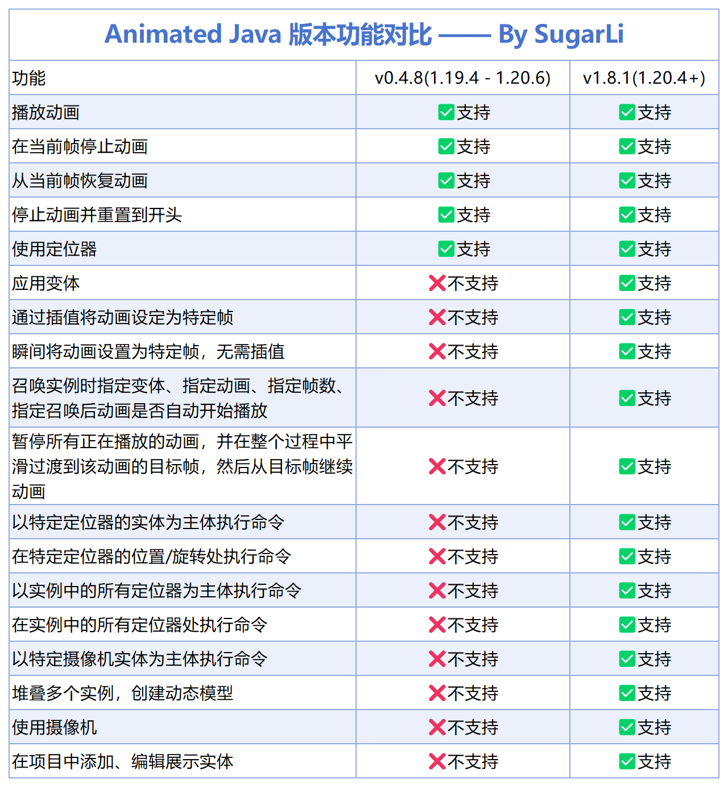

<FeatureHead
    title='Animated Java 原版模型动画制作系列教程'
    authorName='Sugar_Li'
    cover = '../_assets/4.png',
/>

## 项目背景

Animated Java 是一款基于 Blockbench 的插件，它允许创作者在 Minecraft 原版环境中实现复杂的模型动画效果，无需依赖任何模组。然而，我在制作地图时发现，目前网络上缺乏系统性的 AJ 中文教程，官方文档也仅有英文版本，这给许多中文用户带来了学习障碍。

起因是我的朋友凯文在制作八岐物语2时需要做一套boss战系统，但他不知道怎么用AJ。我去B站找教程时发现，竟然没有一套比较系统、全面的AJ教程。于是，我决定自己来录制这么一套教程，同时制作配套的中文文档和汉化插件。

## 教程系列介绍

### 基础教程（已完结）

基础教程以 1.20.1 版本为例，使用 v0.4.8 版本插件进行讲解。这套教程涵盖了从零开始制作AJ动画的完整流程：

**第一期：前置准备与插件安装**

在第一期中，我介绍了使用AJ的前置要求，包括Blockbench 4的下载安装、数据包和资源包基础知识的准备。详细讲解了如何根据游戏版本选择对应的AJ插件版本，以及通过插件中心或URL方式下载安装插件的方法。同时，我还介绍了项目专用的资源包和数据包文件目录结构的搭建。

**第二期：项目创建与动画制作**

第二期是实操的核心部分，我演示了如何在Blockbench中创建AJ项目、设置项目参数、导入模型并制作动画。教程中详细讲解了：

- 动画关键帧的操作（位置、旋转、缩放三种变换）
- 插值类型的选择（线性、平滑、贝塞尔、步）
- 循环模式的区别（单次、保持、循环）
- 项目导出与游戏内测试的方法
- 常用命令的使用（召唤实例、播放动画、移除实例等）

此外，我还介绍了拓展功能，包括动画效果轨道（声音、变体、命令）、定位器的使用，以及IK链式动画的制作方法——这对于制作尾巴、锁链、披风等连续结构的动画非常实用。

**视频链接：**
- 基础教程①：[BV16zfHBGEi2](https://www.bilibili.com/video/BV16zfHBGEi2)
- 基础教程②：[BV1mFfrB6EeA](https://www.bilibili.com/video/BV1mFfrB6EeA)

### 进阶教程

进阶教程针对新版插件（v1.8.1，支持 1.20.4+）进行讲解，介绍新版本的新增功能和改进。

**第一期：汉化获取与新版功能**

在进阶教程第一期中，我首先介绍了如何获取我制作的中文文档和汉化插件。新版AJ插件默认没有中文界面，我通过研究发现官方的语言文件名写错了，而且新版本压根就没有做中文翻译。于是我花费时间制作了汉化版本，方便大家学习使用。

同时，我讲解了新版插件的项目设置方法，与旧版的主要区别在于选择资源包/数据包时需要选择文件夹而非mcmeta文件。新版还增加了缓动类型设置，可以控制动画的运动曲线，实现更自然的动画效果。

**第二期：待更新**

进阶教程第二期正在制作中，将介绍以下内容：

**宏函数与可选参数**

新版 AJ 的函数 API 进行了重大更新，召唤函数和其他控制函数现在支持使用宏参数代替记分板参数。这意味着你可以通过更简洁的方式传递参数：

```mcfunction
function animated_java:<项目名>/summon {args:{variant:'angry', animation:'walk', frame: 20}}
```

相比旧版需要设置多个记分板值，新版的宏函数方式更加直观和便捷，也更容易在命令中嵌入变量。

**变体系统**

变体是模型的变体，可以应用于骨骼实例以更改其外观和 NBT。通过变体面板，你可以创建不同的模型变体（如不同表情、不同装备等），并在游戏中动态切换。变体支持纹理映射、包含/排除节点等高级配置。

**摄像机系统**

摄像机用于在动画期间控制玩家的视角，通过强制玩家观看动画的物品展示实体。摄像机需要额外安装摄像机插件，创建后可以通过添加位置/旋转关键帧进行动画化，实现电影级的镜头移动效果。

**旧版迁移指南**

对于已经使用旧版 AJ 制作项目的用户，我将讲解如何将 `.ajmodel` 文件升级为新版 `.ajblueprint` 格式，以及如何清理过时的导出文件、更新函数 API 调用等迁移步骤。

**堆叠骨骼**

堆叠是将多个骨骼相互挂载的技术，可以用于创建动态模型。通过定位器的"使用实体"和"召唤时命令"属性，可以将多个骨骼堆叠在一起，例如将头部骨骼挂载到身体骨骼上，实现更灵活的模型组合。

::: tip 敬请期待
进阶教程第二期正在制作中，更新后整个AJ系列教程将完结。
:::

**视频链接：**
- 进阶教程①：[BV1swNGzMEvK](https://www.bilibili.com/video/BV1swNGzMEvK)

## 版本兼容性

根据游戏版本选择对应的AJ插件版本：

| 插件版本 | 支持的游戏版本 |
|---------|--------------|
| v1.8.1（最新版） | 1.20.4+ |
| v0.4.8 | 1.19.4 - 1.20.6 |
| v0.2.4 | 1.16.4 - 1.19.3 |

### 新旧版本功能对比



新版插件（v1.8.1）相比旧版增加了许多实用功能：

- 缓动类型设置
- 设置动画到特定帧
- 平滑过渡动画切换
- 暂停所有动画
- 更多动画控制选项

## 中文文档

为促进学习交流，降低 Animated Java 的学习门槛，我翻译并制作了中文文档。

### 文档特点

- 基于 Animated Java v1.8.1 版本翻译
- 大部分内容由 AI 翻译并经人工细致调整
- 提供在线版本和本地版本
- 整站制作时间约为一个晚上（约 19:43 - 次日 5:00）

### 访问方式

**在线文档**：访问 `aj.sugarli.cn` 即可查看

**本地文档**：从网盘下载后，运行 `start_server.bat` 即可在本地查看，加载速度快且不用担心网站挂掉。

::: warning 说明
本文档可能未包含 2026 年 3 月之后更新的内容。虽已反复校对，但仍可能存在未被发现的疏漏或错误，如发现问题欢迎反馈指正。
:::

## 汉化插件

新版 AJ 插件默认无中文界面，我通过研究并修改语言文件，制作了汉化版本。

### 使用方法

1. 从网盘下载汉化插件文件
2. 替换 Blockbench 插件目录中的对应文件
3. 重启 Blockbench 即可看到中文界面

::: warning 版本注意
汉化插件基于 v1.8.1 版本制作，后续版本可能不兼容。
:::

## 资料下载

### 网盘链接

**百度网盘：**
- 链接：https://pan.baidu.com/s/1hRxfVTx8c1e6v_cuqTjvaw
- 提取码：tcbl

**夸克网盘：**
- 链接：https://pan.quark.cn/s/0e512d263e51
- 提取码：vgv1

### 资料内容

网盘中包含以下资源：

- 教学PPT（基础版、进阶版）
- Animated Java 中文文档（本地版）
- 栗子汉化插件 v1.8.1
- 其他配套资料

## 参考资源

在制作教程和文档的过程中，我参考了以下资源：

### 官方资源

- Blockbench 官网：https://www.blockbench.net
- Blockbench Wiki：https://www.blockbench.net/wiki/
- Animated Java 官方文档：https://animated-java.dev/docs
- Animated Java 版本说明：https://animated-java.dev/docs/legacy-releases/versions

### 中文资源

- Animated Java 中文文档：https://aj.sugarli.cn/docs
- 中文 Minecraft Wiki：https://zh.minecraft.wiki/

## 关于作者

哈喽哈喽，这里是栗子，一位鸽子型地图制作者、正在尝试做实况以及一些实用小教程的UP主。

- **B站主页**：https://space.bilibili.com/20703672
- **粉丝交流群**：925118607

欢迎小伙伴加入交流群讨论！

## 免责声明

- 本教程及配套资源仅供学习交流使用，非专业系统教学，可能存在一定纰漏
- 所有内容均以官方文档为准
- 本站为非官方中文资源，与 Animated Java 官方及 Mojang Studios 无关

---

感谢大家的支持！如有问题欢迎在评论区留言或加入交流群讨论，有错误欢迎提出，我会积极改正！
