<FeaturedHead
    title='无限随机生成的跑酷地图你玩过吗？《跃动晶界2》'
    authorName='徐木弦'
    cover = '../_assets/0.jpg'
/>

## 简介
小时候，iOS 系统上有一款抱过我们的游戏：Smash hit。现在，我们把它的想法移植到了 Minecraft 的跑酷地图中。在这张地图中，我们限制了玩家的跳跃次数，只能通过游戏中的补给水晶增加跳跃次数，掉下去会扣除 10 点跳跃次数。跳跃次数归零时，游戏结束。

本地图是随机生成的无限地图，含有：
- 1 个预备关
- 11 个正式关
- 1 个无尽关

本地图玩法：
- 黄色补给水晶只增加 3 点跳跃次数，蓝色增加 5 点，绿色增加 10 点。
- 每个障碍只会给你一次跳跃机会，如果你掉下去了，不是原地复活，而是往前传送。所以，你不用担心会在一处难点卡死了！
- 我们还为游戏添加了简单、经典、地狱三个难度，如果感觉到某一关过不去了，可转战较简单的模式以领略后续关卡的风光~

此地图暂时没有适配多人游戏，只能一个人享受~

版本 Java 1.21.10，祝游玩愉快！

## 宣传片
https://www.bilibili.com/video/BV1GNZpBhEAc

## 地图下载
https://www.minebbs.com/resources/15266/

## 地图截图
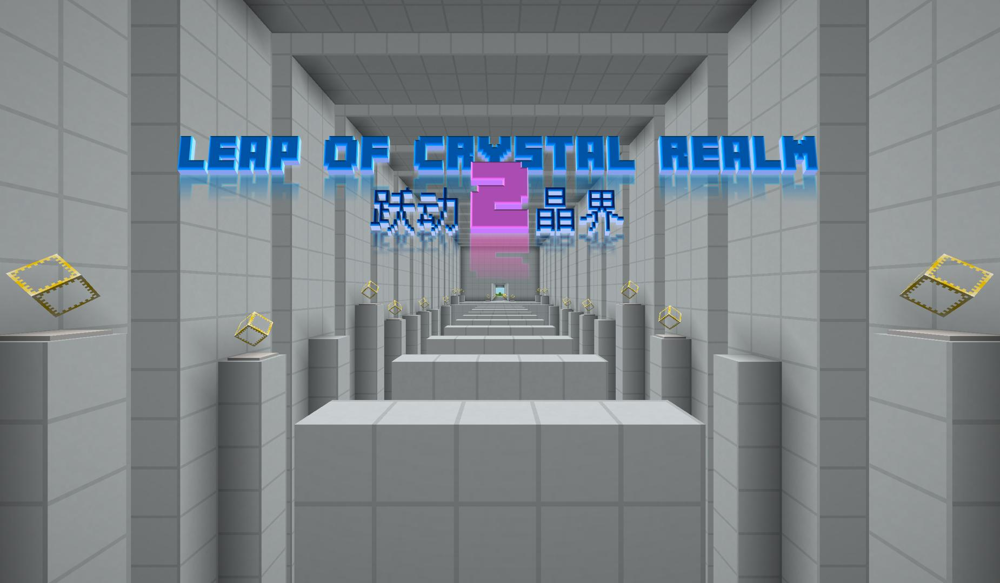  
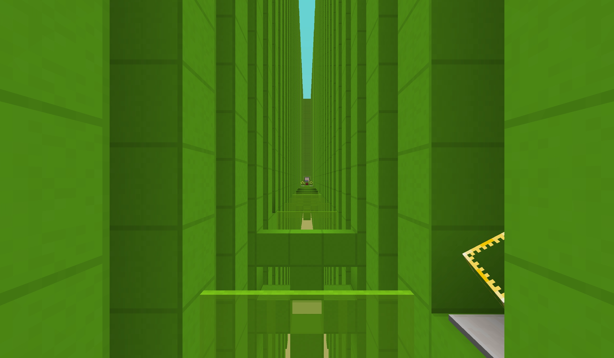  
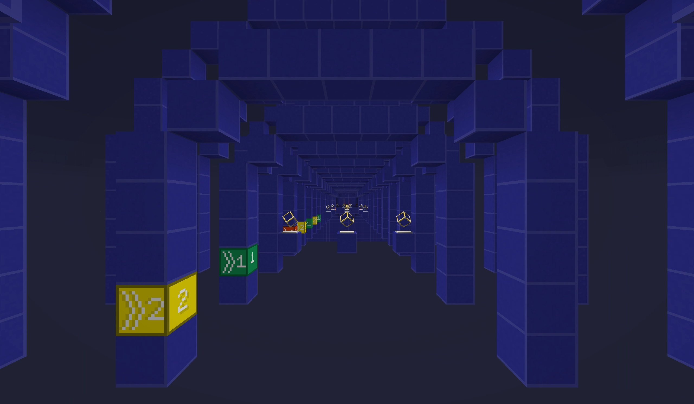  
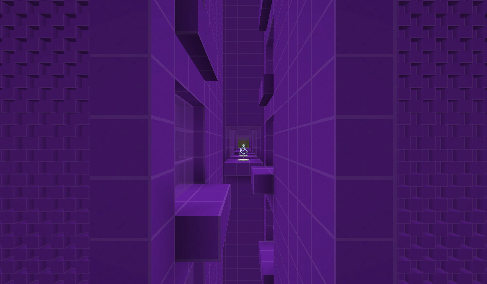  
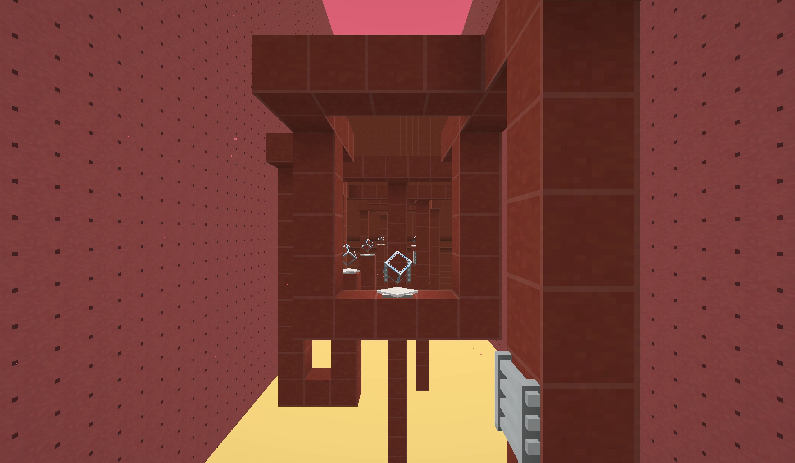  
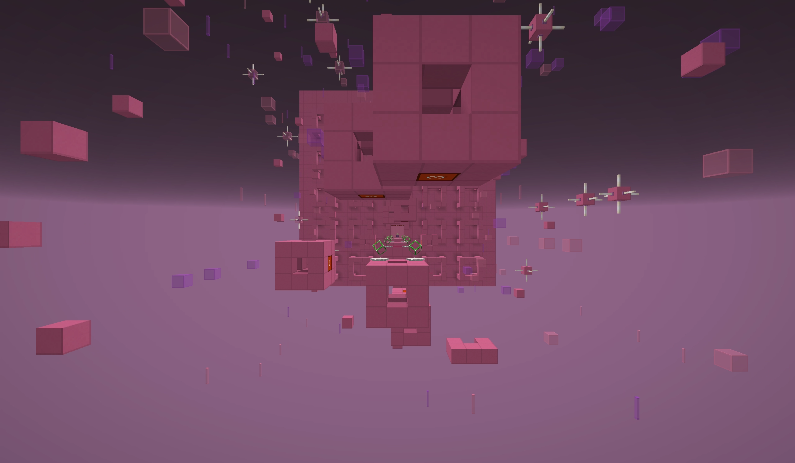  
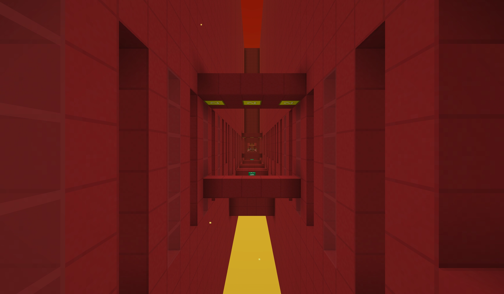  
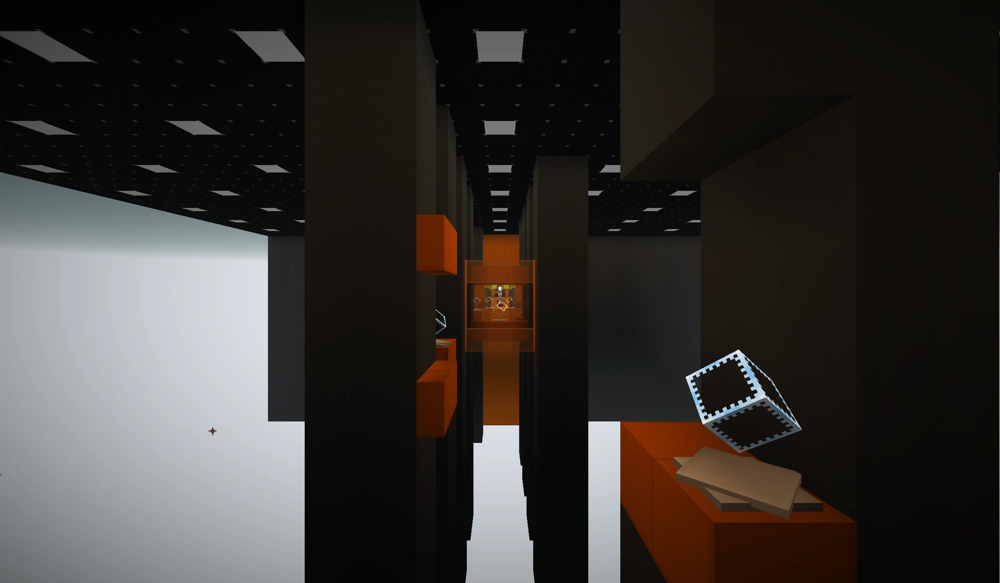  
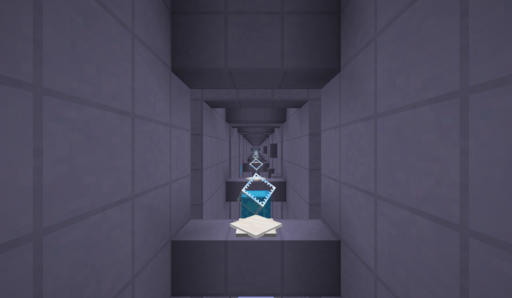  
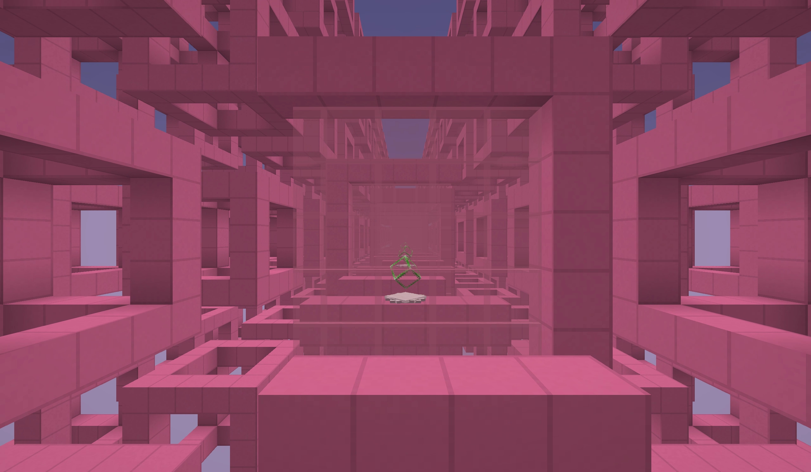  
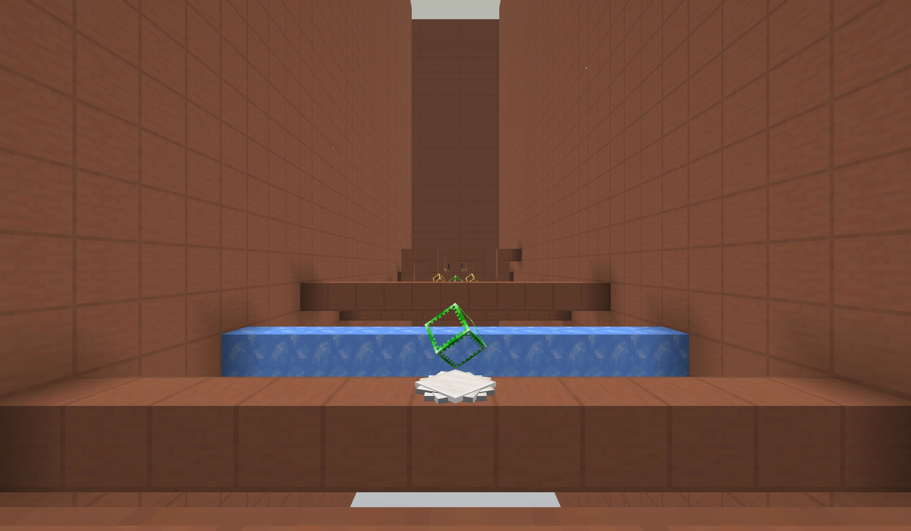  
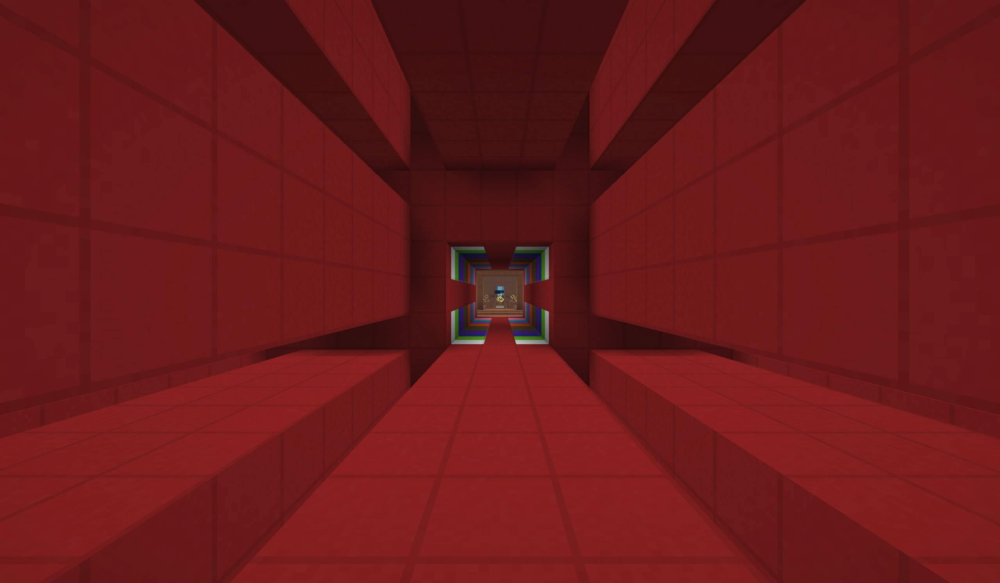  
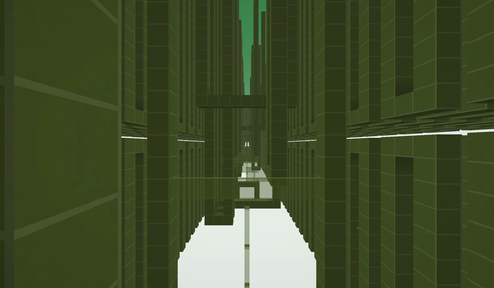  
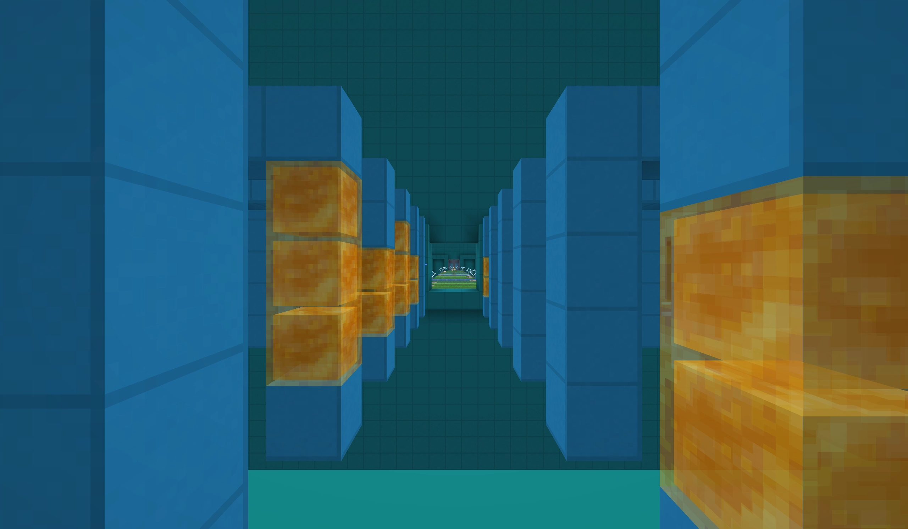

## 奖项
本地图荣获 MineBBS 首届方块创作大赛创思艺海赛道季军。​

## 关于我们
徐木弦个人工作室：g.t.studio

徐木弦 QQ 群：1060595795