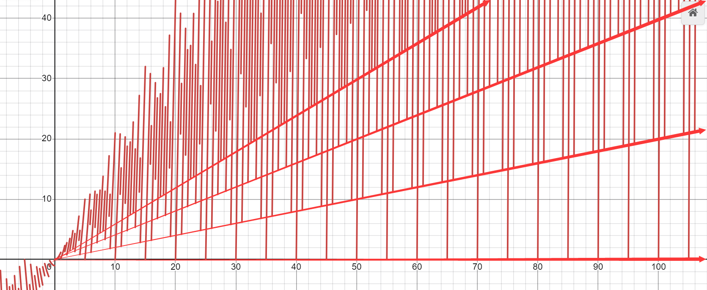

<FeatureHead
    title='轻量级低损耗将OBJ模型转换为体素模型的算法和程序实现'
    authorName='轩宇1725'
/>

## 绪论

### 背景

Minecraft 的模型美术工作者普遍使用 Blockbench 这一软件进行模型的创建与编辑. 有相当一部分美术工作者也会使用 OBJ 格式的模型作为素材或自行在其他更强大的三维软件中设计模型, 随后在 Blockbench 内手动创建这些模型的体素版本.

与此同时, OBJ 模型转换为体素模型的工具虽然在市面上已经有大量实现, 但大多数工具都是简单地将 OBJ 模型离散到边长固定的网格中进行体素化处理, 这种方法既丢失了原有的美术风格和模型细节, 又创造了大量的冗余体素. 在渲染时带来大量的性能开销, 且十分不利于美术工作者对模型进行后续处理和优化.

本文将基于笔者在 Feature 2025.12 刊发表的文章《一种可行的将OBJ模型转换为json模型的方法》中提到的基本框架, 讨论这一框架的程序实现和优化策略. 在实现过程中, 我们将深入探讨关于图论、数论、线性代数等数学工具在模型体素化过程中的应用.

## 算法框架

### 算法流程

结合笔者对美术人员使用 OBJ 模型创建体素模型流程的观察和分析, 本文提出的转换算法主要经历下面几个步骤：

- 构造表面：OBJ 模型的视觉特征是由平整的表面构成的复杂网格, 因此我们将每个平整的表面视作一个对象, 将其用体素表达.

- 寻找最优矩形：使用几个面积较大的矩形尽可能覆盖每个平整表面, 从而用非常少的体素来表达整个表面.

- 拟合三角形：在每个平整表面上使用最优矩形覆盖后, 进一步将剩余未覆盖的区域用三角形进行拟合, 从而尽可能精确地表达原始 OBJ 模型的几何形状.

- 描述体素块：在用体素基本表达了整个模型后, 我们将用不同的格式描述每个体素块的位置、颜色等信息, 从而生成最终可用于 Minecraft 或 Blockbench 的体素模型文件.

### 主要问题

在实现上述算法过程中, 需要解决几个主要问题：

- OBJ 模型的格式有不同的约定和解析方式, 需要在程序中正确处理顶点、法线、纹理坐标以及面信息的读取和组织.

- 平整表面可能是凹多边形, 可能有洞, 这些情况需要特别注意.

- Minecraft 的美术风格一般要求体素的边长为某个最小单位的整数倍, 如 Blockbench 中默认精度为 $1$ 个单位, 精细调整分别有 $0.1, 0.25, 0.05$ 等单位.

## 算法实现

### 构造表面

假设我们已经读取了 OBJ 模型的顶点、法线以及面信息（我们不关心其他的数据）, 将顶点集合记为 $V_0$, 面集合记为 $F_0$. 每个面 $f \in F_0$ 由若干顶点索引组成, 我们将每个面视作一个平整表面, 并将其对应的顶点集合记为 $V_f \subseteq V_0$. 记面 $f$ 的法线为 $\mathbf{n}_f$.

为了构造表面, 我们提出两条条件：

面 $f_1, f_2 \in F_0$ 属于同一个表面, 当且仅当:

1. 两个面共享至少一条边 $\left|V_{f_1} \cap V_{f_2}\right| \ge 2$

2. 两个面的法向量相同, 即 $\mathbf{n}_{f_1} = \mathbf{n}_{f_2}$

我们将 $F_0$ 中满足上述条件的面划分为若干个表面集合, 每个表面集合中的面都属于同一个平整表面, 从而得到模型的表面划分结果. 记这些表面集合为 $\{S_i\}_{i=1}^m$, 其中 $S_i \subseteq F_0$ 且 $\bigcup_{i=1}^m S_i = F_0$, 每个 $S_i$ 中的面都属于同一个平整表面. 由于我们并不特别探讨平整表面的顺序, 故也用 $S$ 表示任意一个表面的面集合.

在实现时, 由于只有共享相同法线的面会被划分到同一个集合中, 因此可以先将 $F_0$ 按法线（或近似的法线）进行分组, 对法线 $\mathbf{n}$ 的分组记为 $F_{\mathbf{n}}$, 再在每个法线组内根据共享边的条件进行连通性分析, 从而得到最终的表面划分结果. 构造集合 $S$ 的首选方法是基于并查集的连通分量检测, 其核心步骤为：

1. 读取程序时, 如果两个法线 $\mathbf{n}_{f_1}, \mathbf{n}_{f_2}$ 相同（或近似相同）, 则将它们记为同一个法线, 并提供索引映射

2. 遍历所有面 $f_i \in F_0$, 如果它的法线索引在映射中对应同一个法线 $\mathbf{n_i}$, 则将其加入集合 $F_{\mathbf{n_i}}$, 最终得到多个法线组 $F_{\mathbf{n}}$

3. 维护一个哈希表, 记录每条边被那些面所共享 $f(x): \bar{e} \mapsto \{f_i \mid \bar{e} \subseteq V^2_{f_i}\}, V^2_{f_i}$ 表示面 $f_i$ 的顶点两两组合所形成的边集合, 用 $\bar{e}$ 表示边 $e$ 的无向表示.

4. 在每个法线组 $F_{\mathbf{n_i}}$ 内, 初始化一个并查集, 每个面都属于一个独立的集合

5. 遍历该法线组内的所有面 $f_i \in F_{\mathbf{n_i}}$ 在哈希表内查询它的每条边 $\bar{e} \subseteq V^2_{f_i}$ 被哪些面共享, 如果某条边被另一个面 $f_j \in F_{\mathbf{n_i}}$ 共享, 则在并查集中将 $f_i$ 和 $f_j$ 合并到同一个集合中, 从而得到该法线组内的连通分量, 每个连通分量对应一个平整表面 $S$

6. 当每个法线组内的并查集处理完毕后, 这些并查集就构成了模型中所有平整表面的划分结果, 每个并查集对应一个平整表面 $S$

下面为一个简短的代码实现:

```python

class UnionFind:
    def __init__(self, n):
        self.parent = list(range(n))
        self.rank = [0] * n

    def find(self, x):
        if self.parent[x] != x:
            self.parent[x] = self.find(self.parent[x])
        return self.parent[x]

    def union(self, x, y):
        xroot = self.find(x)
        yroot = self.find(y)
        if xroot == yroot:
            return
        if self.rank[xroot] < self.rank[yroot]:
            self.parent[xroot] = yroot
        else:
            self.parent[yroot] = xroot
            if self.rank[xroot] == self.rank[yroot]:
                self.rank[xroot] += 1

# 假设 faces 是面列表, 每个面是顶点索引的列表
# normals 是每个面的法线向量
from collections import defaultdict

def construct_surfaces(faces, normals):
    normal_map = {}
    normal_groups = defaultdict(list)
    for i, n in enumerate(normals):
        key = tuple(round(c, 6) for c in n)  # 使用近似法线作为键
        if key not in normal_map:
            normal_map[key] = len(normal_map)
        normal_groups[normal_map[key]].append(i)

    edge_map = defaultdict(list)
    for i, f in enumerate(faces):
        for j in range(len(f)):
            e = tuple(sorted((f[j], f[(j + 1) % len(f)])))
            edge_map[e].append(i)

    surfaces = []
    for group in normal_groups.values():
        uf = UnionFind(len(faces))
        for i in group:
            f = faces[i]
            for j in range(len(f)):
                e = tuple(sorted((f[j], f[(j + 1) % len(f)])))
                for other in edge_map[e]:
                    if other in group:
                        uf.union(i, other)
        components = defaultdict(list)
        for i in group:
            root = uf.find(i)
            components[root].append(i)
        surfaces.extend(components.values())
    return surfaces

```

### 寻找最优矩形

这一步将基本覆盖一般的模型表面, 通过在每个平整表面上寻找若干个面积较大的矩形尽可能覆盖整个表面, 从而用最少的体素表达该表面.

我们的任务是在表面 $S$ 内找到面积最大的矩形序列 $\{r_i\}$, 使得这些矩形尽可能覆盖整个表面 $S$, 从而用最少的矩形（对应最少的体素块）表达该表面.

这些矩形 $\{r_i\}$ 的选择需要满足两个条件：

1. 矩形的边长是 $\delta$ 的整数倍, $\delta$ 是一个正常数.
2. 矩形必须完全位于表面 $S - r_{i-1} - \cdots - r_{1}$ 内, 即矩形的每个顶点都在表面 $S$ 的边界或内部且互不重叠.
3. 在满足前两条的情况下, $r_{i}$ 是 $S - r_{i-1} - \cdots - r_{1}$ 中面积最大的矩形.

由于我们需要循环查找每次在剩余表面 $S - r_{i-1} - \cdots - r_{1}$ 中面积最大的矩形, 因此这是一个贪心算法, 每次选择当前剩余表面中面积最大的矩形作为 $r_i$, 直到剩余表面无法再放置符合条件的矩形为止. 基本过程如下：

1. 计算 $S$ 的切线空间, 我们利用协方差矩阵来获取两个数值稳定的切线:

   记 $V_S$ 为表面 $S$ 上的所有顶点集合, 计算 $S$ 上所有顶点的质心, 记为 $c$:

   $$c = \frac{1}{|V_S|} \sum_{v \in V_S} v$$

   计算协方差矩阵:

   $$\Sigma = \frac{1}{|V_S|} \sum_{v \in V_S} (v - c)(v - c)^T$$

   对协方差矩阵进行特征分解, 取前两个最大特征值对应的特征向量作为切线方向, 记为 $\mathbf{T}, \mathbf{B}$, 并计算可靠法线 $\mathbf{N} = \mathbf{T} \times \mathbf{B},$ 从而得到表面 $S$ 的切线空间基 $\{\mathbf{T}, \mathbf{B}, \mathbf{N}\}$,

2. 将表面 $S$ 的顶点投影到切线空间 $\{\mathbf{T}, \mathbf{B}, \mathbf{N}\}$ 上, 坐标的第三个分量接近 $0$, 抛弃后得到二维坐标 $(u, v)$, 从而将三维表面问题转化为二维平面上的矩形覆盖问题. 由于我们后续要还原三维坐标, 所以不能省略 $\mathbf{N}$ 的计算.

    $$\begin{pmatrix}u \\ v\end{pmatrix} = \begin{pmatrix}\mathbf{T}^T \\ \mathbf{B}^T\end{pmatrix}_{2 \times 3} \mathbf{v}, \space \mathbf{v} \in \mathbb{R}^3$$

    其中 $\mathbf{T}, \mathbf{B}, \mathbf{v}$ 是列向量.

3. 遍历表面 $S$ 内的所有面, 提取所有的有向边索引 $(i, j)$ 并加入集合 $E_0$ 中, 有规则 $E \cup \{-(i,j)\} = E \setminus \{(i,j)\},$ 其中 $-(i,j) = (j,i),$ 最终得到边界集合 $E_0.$

4. 对每条边界边 $e=(p,q) \in E_0$, 构造一个局部平面坐标系, 令 $\mathbf{\hat u} = (q-p)/\|q-p\|$ 为 $u$ 方向, $\mathbf{\hat v} = \mathbf{N} \times \mathbf{\hat u}$ 为 $v$ 方向, 然后将当前表面的全部边界线段变换到该局部坐标系中. 与前一篇文章不同的是, 在当前实现里, 这条边仅用于确定矩形搜索的朝向, 并不强制最终矩形必须贴在该边上, 而是允许矩形在该局部坐标系的搜索区域内自由平移.

5. 在局部坐标系下, 取所有边界顶点的轴对齐包围盒 $[u_{\min}, u_{\max}] \times [v_{\min}, v_{\max}]$ 作为搜索区域, 并以 $\delta$ 为步长离散为网格. 对每一列采样位置 $u_i = u_{\min} + (i + \tfrac{1}{2})\delta$, 计算其与全部边界线段的交点, 再将交点按 $v$ 坐标排序并两两配对, 得到该列位于表面内部的若干有效区间. 落在这些区间中的格子记为可用, 其余格子记为不可用.

6. 将各列的可用区间转化为柱状图高度, 使用“直方图中最大矩形”的单调栈动态规划在线求出仅由可用格子组成的最大轴对齐矩形, 其宽和高均为 $\delta$ 的整数倍. 对所有候选边界方向重复该过程, 并在通过“矩形完全位于外环内部且不与已有孔洞重叠”的合法性检查后, 取面积最大的矩形作为当前表面的最优矩形. 若每个表面都无法找到合法的矩形, 则当前表面直接并入三角表面集合 $S_\Delta.$ 并总之这个表面的搜索.

7. 记下当前找到的最优矩形 $r_i$ 的二维坐标 $(u_{\min}, v_{\min}, u_{\max}, v_{\max})$ 通过矩阵还原其三维坐标，加入最优矩形集合 $R$ 中

8. 获取重构边界 $E_1 = E_0 + E_r,$ E_r 为当前最优矩形 $r_i$ 的边界线段集合, 并从 $E_0$ 中去掉被 $r_i$ 覆盖的边界线段, 得到新的边界集合 $E_1$

9. 对 $E_1$ 进行三角剖分, 并丢弃面积小于 $\delta^2$ 的三角形，并入三角表面集合 $S_\Delta.$

10. 对三角形网格进行表面重建, 得到剩余表面 $S - r_i$, 并在剩余表面上重复步骤 4-7, 直到剩余表面无法再放置符合条件的矩形, 或超出允许的迭代次数为止.

### 拟合三角形

拟合三角形是一个确定的数学过程, 即给定三角形的三个顶点坐标 $(v_0, v_1, v_2),$ 可以给出显式解使得对三角形的拟合误差最小. 在这个阶段, 我们追求的最优解是误差最小, 对不同尺寸的三角形有如下方案:

对于三角面，由于存在最小元 $\delta$，我们首先讨论它的尺寸，若三角形的最小外接矩形的长宽都小于 $\delta$，则称该三角形为小的；若三角形的最大内接矩形的长宽都大于等于 $\delta$，则称该三角形为大的；其他情况称为中等的。

1. 对于小的三角形，我们尝试两种拟合方式：

    1. 使用两个包边矩形拟合三角形。最大角对应的顶点，平行于该顶点的邻边在三角形内侧放置两个矩形，使得两个矩形靠内的边交于这个顶点对边上一点。通过取不同的交点，可以得到不同的拟合，选择误差最小的方式。包边矩形的尺寸不必为 $\delta$ 的整数倍，但若解能够取到 $\delta$ 的整数倍，则选择 $\delta$ 整数倍中能够最小化误差 $e_S$ 的解。

    2. 计算三角形的重心，然后以重心为中心，直接用一个 $\delta \times \delta$ 的矩形拟合该三角形，一条边与三角形的边重合，计算误差 $e_S$。

    此处的误差 $e_S$ 定义为集合 $\{S: S \in S_{voxel}, S \notin S_{triangle}\}$ 的测度的$\frac{1}{4}$，即矩形超出三角形部分的面积：

    $$e_S = \frac{1}{4} \sum_{S \in S_{voxel} - S_{triangle}} Area(S)$$

    选取这两种方式中误差较小的一种作为该小三角形的拟合方式。

2. 对于中等的三角形，我们使用双包边法：

    1. 选取最大角，记为 $A$ ，邻角记为 $B$ 和 $C$，三个角的对边分别记为 $a, b, c$。

    2. 在 $a$ 上取一点 $D$ , 过 $D$ 作 $b，c$ 的垂线，分别于射线 $BA, CA$ 交于点 $E, F$。

    3. 以 $E$ 为例，若 $E$ 在 $b$ 上，则矩形 $R_1$ 的一条边为 $AB$，与其垂直的邻边长为 $d_1$ 其值等于 $D$ 与 $b$ 的距离; 若 $E$ 在 $b$ 沿 $BA$ 方向的延长线上，则矩形 $R_1$ 的一条边为 $BE$ , 与其垂直的邻边长同样为 $d_1$。

    为了简化计算，我们假设 $d_1,d_2$ 都取不到 $\delta$ 的整数倍，这样它们就是连续值，计算出最佳取值后再试图将其调整为 $\delta$ 的整数倍。

    满足下面的最优化约束:

    $$ S(R_1) = \frac{1}{2} \left( d_1^2 \tan B + (\max(0, \cot C d_1 - b))^2 \tan(B+C) \right) $$

    $$ S = S(R_1) + S(R_2) $$

    $$ e_S = \frac{S}{4} = \frac{S(R_1) + S(R_2)}{4} $$

    $$\phi (d_1, d_2) = d_1 \sin B + d_2 \sin C - a = 0$$

    利用拉格朗日乘数法, 我们构造拉格朗日函数:

    $$ \mathcal{L}(d_1, d_2, \lambda) = e_S(d_1, d_2) + \lambda \phi(d_1, d_2) $$

    对 $d_1, d_2, \lambda$ 求偏导并令其为零, 得到方程组:

    $$
    \frac{\partial \mathcal{L}}{\partial d_1} = 0, \quad \frac{\partial \mathcal{L}}{\partial d_2} = 0, \quad \frac{\partial \mathcal{L}}{\partial \lambda} = 0
    $$

3. 对于大的三角形，我们使用环绕包围法:

    1. 我们使用不同的 LOD 来划分内部区域，即将内部区域划分为 $\xi\delta \times \xi\delta$ 的网格，$\xi$ 取 $1, 2, \dots, k$，其中 $k$ 为三角形最大内接矩形的边长与 $\delta$ 的比值的整数部分。对于我们定义中的“大的三角形”，$k \ge 1$。

    2. 在不同的 LOD 下，对内部区域进行像素化处理（内接拟合），即在划分好的网格内，选取完全包含在三角形内的网格作为像素块。

    3. 选取三角形的三个顶点 $A, B, C$，分别沿着邻边方向放置三个矩形 $R_1, R_2, R_3$，其厚度分别为 $d_1, d_2, d_3$。选择最小的 $d_1, d_2, d_3$ 覆盖内接拟合无法覆盖的区域，并计算包边带来的失真面积 $S$。

    对于这一步，我们需要先选取方向，即选取一边为底边，此时已经确定的像素将产生左、右和上边界。对左侧的斜边，我们计算左边界和上边界每个格点距离斜边的距离，取最小值作为 $d_1$，同理右侧的斜边取最小值作为 $d_2$，显然底边的 $d_3$ 为 0.

    分别计算不同边作为底边的 $d_1, d_2, d_3$，然后计算失真面积 $S$，选择使得 $S$ 最小的解。

    $$ S = \frac{1}{2} \left((d_1^2 + d_2^2)\max(0, \cot A) + (d_1^2 + d_3^2) \max(0, \cot B) + (d_2^2 + d_3^2) \max(0, \cot C)\right) $$

    4. 计算每个 LOD 下的误差值 $e_S = \frac{S}{4}$ 和体素数量 $M$，选择使得代价指标 $\mathcal{J} = \alpha e_S + \beta M$ 最小的解作为最终解。

    在这里, $\mathcal{J}$ 近似为一个单峰函数, 因此可以通过在不同 LOD 下计算 $\mathcal{J}$ 并选择最小值来得到近似最优解.

    同样，我们可以基于直方图最大矩形算法找到内部的良好拟合。

### 描述体素块

Minecraft 中的体素块 (elements) 由下列的字段定义:

<div class="nbttree">

<node type="compound" name=""/> 这是一个模型元素。
- <node type="list" name="from" required=true />指定模型元素长方体的起点。
  - <node type="float" name=""/>（不小于 `-16` 且不大于 `32`）长方体在 X 轴上的坐标 `x1`。
  - <node type="float" name=""/>（不小于 `-16` 且不大于 `32`）长方体在 Y 轴上的坐标 `y1`。
  - <node type="float" name=""/>（不小于 `-16` 且不大于 `32`）长方体在 Z 轴上的坐标 `z1`。
- <node type="list" name="to" required=true />指定模型元素长方体的终点。
  - <node type="float" name=""/>（不小于 `-16` 且不大于 `32`）长方体在 X 轴上的坐标 `x2`。
  - <node type="float" name=""/>（不小于 `-16` 且不大于 `32`）长方体在 Y 轴上的坐标 `y2`。
  - <node type="float" name=""/>（不小于 `-16` 且不大于 `32`）长方体在 Z 轴上的坐标 `z2`。
- <node type="compound" name="rotation"/>（默认无旋转）设置元素的旋转。
  - <node type="list" name="origin" required=true />设置旋转中心。
    - <node type="float" name=""/>旋转中心在 X 轴上的坐标。
    - <node type="float" name=""/>旋转中心在 Y 轴上的坐标。
    - <node type="float" name=""/>旋转中心在 Z 轴上的坐标。
  - <node type="bool" name="rescale"/>（默认为 `false`）是否对旋转后的模型元素重新缩放。
  - 可以采用单轴旋转和多轴旋转两种旋转。必须至少指定一种旋转，游戏优先尝试使用单轴旋转。
  - 单轴旋转格式：
    - <node type="float" name="angle" required=true />旋转角度。
    - <node type="string" name="axis" required=true />旋转轴。可以为 `x`、`y` 或 `z`。
  - 多轴旋转格式：
    - <node type="float" name="x" required=true />X 轴上的旋转角度。
    - <node type="float" name="y" required=true />Y 轴上的旋转角度。
    - <node type="float" name="z" required=true />Z 轴上的旋转角度。
- <node type="bool" name="shade"/>（默认为 `true`）是否渲染阴影。
- <node type="int" name="light_emission"/>（`0` 到 `15`）指定发光等级渲染此模型元素。
- <node type="compound" name="faces" required=true />模型元素的所有面。
  - <node type="compound" name="&lt;面&gt;"/>指定某一个面的属性。

</div>

如果将这个定义看做对单位立方体的变换，那么可以写作

$$\mathscr{A}(x) = \mathbf{T_0 R T_0^{-1} S T}x$$

该分解与一个 `json` 字段一一对应，所以我们只需解出每个矩阵即可写出对应的 `json` 字段。

其中 $\mathbf{T}$ 表示 `from` 字段，是一个平移矩阵。$\mathbf{S}$ 是一个缩放矩阵，$\mathbf{R}$ 是旋转矩阵，对应 `rotation.x`, `rotation.y`, `rotation.z`，$\mathbf{T_0}$ 表示旋转中心，对应 `rotation.origin` 字段。

由体素的最终顶点位置解这个变换矩阵的分解并不能唯一确定 $\mathbf{T_0, T}$，因此我们引入两个不同的偏好：

1. 第一种偏好，由于 $\mathbf{T}$ 具有限制，`from` 和 `to` 字段被限制在 $[-16,32]^3$ 范围内，我们将其定为单位矩阵 $I$ 所有的平移由绕顶点旋转变换贡献。

    在这种偏好下，变换退化为
    
    $$\mathscr{A}(x) = \mathbf{T_0 R T_0^{-1} S}x$$

    则由体素一个角及其邻角的四个顶点 $v_0, v_x, v_y, v_z$ 可以确定这个体素，可以写出四个方程：

    $$
    \begin{cases}
    \mathbf{T_0 R T_0^{-1} S}[0, 0, 0, 1]^T = v_0 \\
    \mathbf{T_0 R T_0^{-1} S}[1, 0, 0, 1]^T = v_x \\
    \mathbf{T_0 R T_0^{-1} S}[0, 1, 0, 1]^T = v_y \\
    \mathbf{T_0 R T_0^{-1} S}[0, 0, 1, 1]^T = v_z
    \end{cases}
    $$

    可解出:

    $$\mathbf{S} = \begin{pmatrix}
    \|v_x - v_0\| & 0 & 0 & 0 \\
    0 & \|v_y - v_0\| & 0 & 0 \\
    0 & 0 & \|v_z - v_0\| & 0 \\
    0 & 0 & 0 & 1
    \end{pmatrix}$$

    $$\mathbf{R} = \begin{pmatrix}
    v_x - v_0 & v_y - v_0 & v_z - v_0 & \mathbf{\varepsilon_4} \\
    \end{pmatrix}_{4 \times 4}
    $$

    其中 $\mathbf{\varepsilon_4} = [0, 0, 0, 1]^T$

    $T_0$ 可用几何方法给出一个旋转中心, 由 $\mathbf{R}$ 求得旋转轴 $\mathbf{u} = [u_1, u_2, u_3]^T$ 和旋转角 $\theta$，且有 $\mathbf{u}$ 为 $\mathbf{R}$ 左上 $3 \times 3$ 矩阵特征值为 $1$ 的特征向量。

    则旋转中心为过原点与 $\mathbf{u}$ 垂直的平面 $\mathbf{u_1}x + \mathbf{u_2}y + \mathbf{u_3}z = 0$ 上，使得有向弧 $\overset{\frown}{Ov_0}$ 对应的圆心角为 $\theta$ 的圆心。记为 $C = (x_0,y_0,z_0)$

    即满足 
    $$
    \mathbf{u_1}x_0 + \mathbf{u_2}y_0 + \mathbf{u_3}z_0 = 0, \quad \angle (\overrightarrow{CO}, \overrightarrow{Cv_0}) = \theta
    , \quad \|\overrightarrow{OC}\| = \| \overrightarrow{Ov_0} \| $$

    若记 $\displaystyle \mathbf{v_\bot} = \mathbf{v_0} - \frac{\mathbf{v_0} \cdot \mathbf{u}}{\|\mathbf{u}\|^2}\mathbf{u}$

    则解可写作

    $$C = \frac{\|\mathbf{v}_0\|^2}{2 \|\mathbf{v}_\bot \|^2}\mathbf{v_\bot} + \frac{\|\mathbf{v}_0\|\sqrt{\|\mathbf{v}_\bot\|^2-\|\mathbf{v}_0\|^2\sin^2\frac{\theta}{2}}}{2\|\mathbf{u}\|\|\mathbf{v}_\bot\|^2\sin\frac{\theta}{2}}$$

    则

    $$\mathbf{T_0} = \begin{pmatrix} 0 & 0 & 0 & x_0 \\ 0 & 0 & 0 & y_0 \\ 0 & 0 & 0 & z_0 \\ 0 & 0 & 0 & 1 \end{pmatrix}, \quad \mathbf{T_0}^{-1} = \begin{pmatrix} 0 & 0 & 0 & -x_0 \\ 0 & 0 & 0 & -y_0 \\ 0 & 0 & 0 & -z_0 \\ 0 & 0 & 0 & 1 \end{pmatrix}$$

2. 第二种偏好，为了方便美术人员调整模型，我们将 $T$ 所表示的偏移量设为和体素的中心对齐。同上理，这里 $T$ 的平移量应当使得体素的中心与单位立方体的中心对齐。只需令上面推导中的 $O$ 替换为 $\mathbf{T}\mathbf{v}_0$, 其中

    $$\mathbf{T}[0, 0, 0, 1]^T = \frac{1}{2} (\mathbf{v}_x + \mathbf{v}_y + \mathbf{v}_z - \mathbf{v}_0)$$

## 优化空间

本方法生成的体素全部为面片，生成结果的下界为最少体素的 6 倍，未来可能通过检查内部空间和合并上下表面等方式减少体素数量。三角形包边带来的误差若能藏在体素内部空间中，则可以进一步减少最终误差。

有时原始模型生成的连通分量并不是最佳的，可能通过在不破坏视觉效果的情况下增加顶点和面来辅助拟合，这也需要判断某个位置是否在模型内部。

同时，有时模型可能需要一个缩放变换来让最佳矩形阶段产生的残差最小，此时需要通过每个连通分量内的长宽比来近似一个全局最优缩放比。具体见附录。

## 结论

本文基于原始研究对其复杂度进行了优化，并提出了几个可能的近似方案和改进思路，以在保证视觉效果的前提下减少生成体素的数量和误差。同时给出了一个具体的程序实现思路，能保证方法在一定的复杂度内运行。

## 鸣谢和引用文献

感谢 Boanci 提供的经费支持和刃下狼血对减少最优矩形的误差的讨论与建议.

感谢 Numio、Boanci 提供模型对算法效果进行测试和验证.

感谢 Blender 提供的建模工具支持.

原始研究:《一种可行的将OBJ模型转换为json模型的方法》轩宇1725 flybridOuO Feature 202512
[https://vanillalibrary.mcfpp.top/datapack-index/feature/archive/202512/1/content.html](https://vanillalibrary.mcfpp.top/datapack-index/feature/archive/202512/1/content.html)

## 附录 - 全局最优缩放比的近似计算 (优化最佳矩形)

实践中发现，即使是 `8cube` 的例子也不一定能用 $12$ 个最优矩形完全覆盖，这是因为 $\delta$ 的整数倍与原尺寸有可能并不匹配。对于这样的模型，如果直接用 $\delta$ 的整数倍去划分，可能会出现覆盖不完全的情况。   

为了优化最佳矩形的表现，我们需要找到一个方法，从模型和 $\delta$ 确定一个缩放比例 $k,$ 使得模型在缩放 $k$ 倍后, 仅最佳矩形的覆盖就已经达到这一阶段能达到的最小误差。

在下面的讨论中，我们将边长不受限制的最佳矩形称为理论最佳矩形，边长为 $\delta$ 的整数倍的最佳矩形称为 $\delta-$ 最佳矩形。

误差的定义方法：

 - 在每个连通分量 $i$ 的每个候选的边 $e$ 下，都能找到一个理论最佳矩形 T 和对应的 $\delta-$ 最佳矩形 $T_\delta$

 - 此时误差定义为 $\varepsilon_{e,i}(k) = S(T) - S(T_\delta)$

注意到缩放并不影响最佳边的确定，所以最佳矩形总是出现在同一个边上，且尽管在连续区间上的导数可能不同，对所有 $e, \varepsilon_{e,i}(k)$ 的间断点总是相同的，它们同时取到最小值，因此我们直接研究最佳边上的误差函数，简记为 $\varepsilon_{i}(k)$。

显然对于每个连通分量 $i$，只要找到使得 $\varepsilon_i(k)$ 取到最小值的 $k$，就能得到该连通分量在缩放 $k$ 倍后最佳矩形覆盖的最小误差。我们将对应的最优缩放比例记为 $k_i^*$, 我们下面的理论最好情况与这个无关, 但可能用于某种近似。

我们将整个模型缩放 $k$ 倍后的误差定义为

$$
\varepsilon(k) = \sum_i \varepsilon_i(k)
$$

显然 $\varepsilon(k)$ 的间断点是所有 $\varepsilon_i(k)$ 的间断点的并集。可以证明它的任意一个连续区间必是任何 $\varepsilon_i(k)$ 的连续区间。并同样在每个连续区间上严格递增。因此 $\varepsilon(k)$ 的最小值必然出现在某个间断点的右极限（事实上单调区间都是左闭右开的，因此这个右极限就是该区间的最小值）。

所以我们只需要验证所有的候选缩放比例 $k$ ，并选择让 $\varepsilon(k)$ 取到最小值的 $k$ 即可。

目前来看，尽管我们需要跑完所有的连通分量才能确定候选的 $k$，但由于缩放变换保证了:

 - $\delta-$ 最佳矩形总是出现在同一条边上
 - 理论最佳矩形的位置不随缩放而改变，只是面积的值被改变
 - 因此 $\delta-$ 最佳矩形可以直接取已知的理论最佳矩形的位置，只需根据缩放比例调整其边长为 $\delta$ 的整数倍即可（简单利用向下取整）

下面讨论候选缩放比例 $k$ 的求法。

假设初始不缩放，我们在此时找到理论最佳矩形的长和宽分别为 $l$ 和 $w$。此时当 $l$ 或 $w$ 刚好是 $\delta$ 的整数倍时，会产生跳变点，此时是一个候选的缩放比例 $k$，我们记这些候选的缩放比例为 $\{k\}$ 则可以直接写出

$$
k = \frac{m \delta}{l} \quad \text{或} \quad k = \frac{n \delta}{w}, \quad m,n \in \mathbb{Z}^+
$$

注意到 k 是无穷多的, 显然有下界 $0,$ 而当 $k$ 越大时，会直接导致原论文中三角形处理阶段无法回避的误差增大，因此实际上我们只需要考虑一个有限的 $k$ 上界。由于 $k$ 与模型体积相关，我们可以定 $k$ 的上界为使得模型的 AABB 缩放候最大分量在 48 单位以内，即 $\sup k = \frac{48}{\max(\text{AABB})}.$ 则在上下界内 $k$ 的数量是有限的.

### 一个近似

当 $k$ 很多时，可以选择只考虑 $k_i^*$ 作为候选缩放比例。显然 $\{k_i^*\} \subseteq \{k\}$

分析发现, 当 $\epsilon(k) = 0$ 可以在范围内满足的时候, 一定存在一个 $k_i^*$ 使得 

$$\varepsilon_i(k_i^*) = 0.$$

事实上，第一个这样的 $\displaystyle k = \operatorname{lcm}\left(\left\{\frac{1}{q_i}\right\}\right)/\delta,$ 其中 $\displaystyle \left\{\frac{1}{q_i}\right\}$ 表示第 $i$ 个连通分量理论最佳矩形的长宽比的分母集合. 且这个值一定在 $\{k_i^*\}$ 内.

### 基于的数学前提

 - $\varepsilon_i(k)$ 是一个形如 $ax^2 - \lfloor(x)\rfloor \cdot \lfloor(ax)\rfloor$ 的函数, $a$ 是有理数时, 间断点的分布具有规律性, 可用数论方法显式写出这些间断点.

 

 - 缩放不影响最佳边的确定：缩放后，理论最佳矩形和 $\delta-$ 最佳矩形所在局部空间的边不变.

 - 总误差的函数性质：
    
    - $\varepsilon(k) = \sum_i \varepsilon_i(k)$ 的间断点是所有 $\varepsilon_i(k)$ 的间断点的并集
    - $\varepsilon(k) = \sum_i \varepsilon_i(k)$ 的连续区间上任意的 $\varepsilon_i(k)$ 都是连续的
    - $\varepsilon(k) = \sum_i \varepsilon_i(k)$ 每个连续区间上严格递增

 - 去除 k = 0 的平凡解, 在有理数精度下，最小的 k 首先出现在 `k = q` 处

 - 用长宽比的有理近似 $a^\prime$ 代替 $a$ 计算, 间断点会有偏差，但仍能取到一个较小的误差.

 > 注，实际实现中 $\varepsilon_{e,i}$ 由几次换元得到, 实际可能形如 $$ax^2 \|e_i\|^2 - \delta^2 \lfloor(\frac{kx}{\delta})\rfloor \cdot \lfloor(\frac{akx}{\delta})\rfloor$$