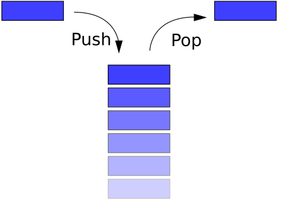

<FeatureHead
    title='命令存储进阶：使用栈管理函数上下文'
    authorName='七柏'
	:extraAuthors="['徐木弦']"
/>

## 摘要
本文探讨如何通过模拟栈结构优化 Minecraft 函数（mcfunction，下文简称 mcf）的数据管理与逻辑设计。针对原生 mcf 作用域局限、过程数据残留及跨函数通信低效等痛点，通过手动管理“压栈/出栈”机制实现变量隔离与上下文传递，支持递归调用与动态作用域嵌套。该方案利用命令存储系统（storage）替代宏解析，提升性能并减少资源冗余，为复杂数据包开发提供清晰的作用域控制与可维护性，尤其在多层嵌套、算法实现等场景中显著增强逻辑清晰度与执行效率，为 mcf 提供规范化开发模式。


## 1. 引言

mcf 没有原生的作用域管理，一旦涉及到大量变量操作时，经常容易出现变量堆积成山的问题。其次，由于变量通常是全局性的，函数在执行时经常会出现时序问题或越界访问等漏洞。这些情况通常会引入一些预料之外的 BUG，在拖慢开发进度的同时也会大幅拉低开发体验。此外，在需要跨函数信息交换的地方，由于上下文关系缺失，在编写复杂算法时会变得异常困难。~~以至于社区内经常能听到开发数据包形同坐牢这样的调侃（bushi）。~~因此亟需引入一种新的机制来解决上述问题，以实现跨函数的上下文调用与变量隔离。本文提出的基于栈结构的管理方案，正是因此而生。

<div style="text-align:center">
	
	<p style="color: gray;">图 1：数据包开发现状</p>
</div>


## 2. 理论背景与工具

### 2.1 栈

> 来自维基百科

**堆栈**（stack）又称为**栈**或**堆叠**，是[计算机科学](https://zh.wikipedia.org/wiki/計算機科學)中的一种[抽象资料类型](https://zh.wikipedia.org/wiki/抽象資料型別)，只允许在有序的线性资料集合的一端（称为堆栈顶端，top）进行加入数据（push）和移除数据（pop）的运算。因而按照[后进先出](https://zh.wikipedia.org/wiki/後進先出演算法)（LIFO, Last In First Out）的原理运作，堆栈常用一维[数组](https://zh.wikipedia.org/wiki/陣列)或[链接串列](https://zh.wikipedia.org/wiki/連結串列)来实现。常与另一种有序的线性资料集合[队列](https://zh.wikipedia.org/wiki/佇列)相提并论。

#### 2.1.1 栈操作

栈有两种基本操作，称为压入（push）和弹出（pop）。

**压入：** 将栈帧堆放至栈顶，并更新栈顶指针至新栈帧；

**弹出：** 将栈顶栈帧移除，并更新栈顶指针到上级栈帧；

<div style="text-align:center">
	
	<p style="color: gray;">图 2：栈操作</p>
</div>

#### 2.1.2 列表栈

列表结构的线性性质天然适用于构建栈结构，其元素的有序性和可动态扩展的特性为模拟栈的“后进先出”原则提供了理想基础。每个列表元素对应一个**栈帧（Stack Frame）**，栈顶始终位于列表的末尾（索引为 `-1` 的位置）。

以下以 Python 做简单示范：

```python
#定义一个空 list 当做栈
stack = []
stack.append(1)
stack.append(2)
stack.append("hello")
print(stack)
print("取一个元素：",stack.pop())
print("取一个元素：",stack.pop())
print("取一个元素：",stack.pop())
```

输出结果为

```python
[1, 2, 'hello']
取一个元素： hello
取一个元素： 2
取一个元素： 1
```

### 2.2 命令存储

> 来自 mcwiki

命令存储（command storage）是一种方便的存储数据的方式。命令和数据包可以通过命令存储直接使用[命名空间ID](https://zh.minecraft.wiki/w/命名空间ID)保存数据，而不需要物品、方块实体或实体间接保存数据。

命令存储采用 NBT 存储游戏数据，支持字符串、列表、字典等多种数据类型。天然适配栈帧的结构化需求。

## 3. 实现方案

结合栈以及命令存储，开发者可以尝试通过 `/data` 对命令存储进行操作，从而在 mcf 中构建一个简单的栈结构。在之后的演示中，本文均以 `example:0` 这个命令存储作为讨论对象。

### 3.1 在函数中构建栈

结合栈结构的性质, 可以采用列表对其进行模拟。显然可以使用 append 方法向栈顶压入栈帧，并由于 `stack` 是一个列表，因此可以使用 `stack[-1]` 作为路径来访问栈顶，使用 `remove stack[-1]` 即可实现栈帧弹出，从而轻松实现栈操作中的 push 与 pop:

```mcfunction
# stack.push()
data modify storage example:0 stack append value {}
# stack.pop()
data remove storage example:0 stack[-1]
```

> [!TIP]
>
> 由于在 storage 中当路径不存在时调用 append 会自动创建一个新列表并压入元素，故此处无需对 stack 进行初始化操作。

### 3.2 执行环境与返回值

现在函数内部已有一个空栈帧，可以尝试向里面写入一些数据并令其作为参数供函数逻辑调用。这里以一个简单的 `max` 函数为例，来讨论如何在 mcf 中管理函数。

::: details Python
```python
'''
输出最大值
'''
def max(input):
    size  = len(input)
    if not size > 1:
        print('error：缺少输入数据！')
        return
    a = input[0]
    while True:
        size -= 1
        if size <= 0:
            return a
        b = input.pop(0)
        if a < b:
            a = b

input = [1, 1, 4, 5, 1, 4, 1, 9, 1, 9 ,8 ,1 ,0, 100, 450, 0, 332]
m = max(input = input)

print('input =', input )
print('m =', m)
```
:::

> [!WARNING]
>
> 为了便于展示，这里的 mcf 使用了内联函数的形式，实际函数编写需要跨文件访问。

::: details mcfunction
```mcfunction
# ---------- #max(input : array) ----------
# stack.push()
data modify storage example:0 stack append value {}

# 读取形参
data modify storage example:0 stack[-1].CONTEXT.input set from storage example:0 stack[-2].CONTEXT.input

# 打擂
scoreboard players reset #size var
execute store result score #size var run data get storage example:0 stack[-1].CONTEXT.input
execute unless score #size var matches 1.. run return run function THIS.parent/errors/unknown_data:
	tellraw @s {"text": "error：缺少输入数据！"}
execute store result score #a var run data get storage example:0 stack[-1].CONTEXT.input[0]
execute store result storage example:0 return int 1 run function THIS.parent/_:
    scoreboard players remove #size var 1
    data remove storage example:0 stack[-1].CONTEXT.input[0]
    execute if score #size var matches ..0 run return run scoreboard players get #a var
	execute store result score #b var run data get storage example:0 stack[-1].CONTEXT.input[0]
	execute if score #a var < #b var run scoreboard players operation #a var = #b var
    function THIS

# stack.pop()
data remove storage example:0 stack[-1]
# ---------- #max(input : array) ----------#

# ---------- main ---------- #
# 调用 max 函数
# stack.push()
data modify storage example:0 stack append value {}

data modify storage example:0 stack[-1].CONTEXT merge value {"input": [1, 1, 4, 5, 1, 4, 1, 9, 1, 9 ,8 ,1 ,0, 100, 450, 0, 332]}
excute store result score #m var run function #max
# 格式化输出
tellraw @s {"translate": "input = %s", with: [{"type": "nbt", "storage": "example:0", nbt: "stack[-1].CONTEXT.input"}]}
tellraw @s {"translate": "m = %s", "with": [{"score": {"name": "#m", "objective": "var"}}]}

# stack.pop()
data remove storage example:0 stack[-1]
# ---------- main ---------- #
```
:::

上述 `max` 函数的示例成功将 Python 的代码逻辑移植在 mcf 中。在编写 mcf 的过程中，使用 stack 为每个层级的函数创建栈帧，将其所处的变量环境隔离开来。

在 `max` 函数中需要从外部向其输入一个名为 `input` 的列表参量。在面对这种跨函数变量交互的场景，笔者建议在栈帧中专门开辟一个上下文变量空间 `CONTEXT`，一是为了提高可读性，二者是在多层级嵌套情况下，使用 `data stack[-1] merge stack[-2]` 的传递方式相较于混存传递作用域更清晰，访问更安全。

针对函数返回值，原版的 `return` 函数提供的返回值较为简单，针对复杂结构返回，笔者约定在命令存储下的 `return` 键内。

## 4. 结论

**作用域**

为每个函数创建独立栈帧，统一使用 `stack[-1]` 对变量进行访问使得各层级函数所管理的变量池清晰直观，提高了函数可读性的同时也防止了函数越界访问之类容易引发 BUG 的操作。

**执行环境**

在每个栈帧中声明一个字典 `CONTEXT` 用于存储函数执行时的自定义上下文环境，从而在限制变量作用域的前提下实现可控的跨函数变量通信。相较于函数宏（macro）的形式, 这种上下文交互模式在**非遍历** `execute store` 和 `data` 操作下对性能的影响通常较小。 

**数据冗余**

在函数栈这种随用随清的结构下, 避免了在 storage 中堆积大量无用数据，在一定程度上提高访问速度的同时使存储结构更加清晰。

## 参考文献

[1] [紫薯真好吃. Python list列表实现栈和队列[EB/OL]. (2021-02-26)[2026-04-02].](https://blog.csdn.net/ftfy123/article/details/114121434)

[2] [维基百科. 堆栈[DB/OL]. (2025-06-19)[2026-04-02].](https://zh.wikipedia.org/wiki/堆栈)

[3] [中文 Minecraft Wiki. 命令存储格式[DB/OL]. (2026-03-24)[2026-04-02].](https://zh.minecraft.wiki/w/命令存储格式)

[4] [Nervonrnent. 【助眠自用】如何用 Minecraft 命令模拟栈[Z/OL]. (2025-04-26)[2026-04-02].](https://b23.tv/VcRQyPc)

[5] [创小业. 我居然用数据包写出了排序算法？[Z/OL]. (2023-08-06)[2026-04-02].](https://b23.tv/zEkwyQ7)

[6] [斑海awa. 论 Minecraft 环境下 Brainduck 解释器的实现与性能优化[J/OL]. Feature, 2026, 2(2).](https://vanillalibrary.mcfpp.top/datapack-index/feature/archive/202602/6/content.html)

[7] [皮革剑. 使用数据包制作编译器或解释器: 以C语言子集C-Minus为例[J/OL]. Feature, 2025, 1(11).](https://vanillalibrary.mcfpp.top/datapack-index/feature/archive/202511/1/content.html)
