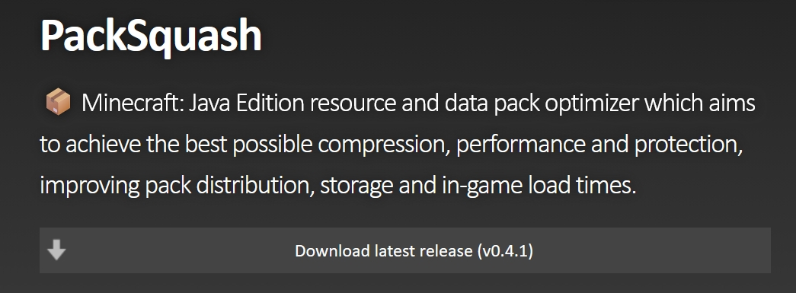
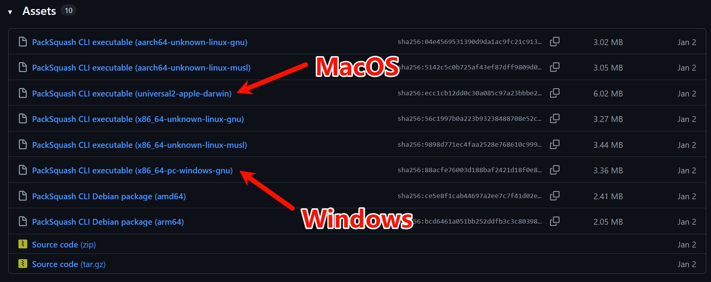
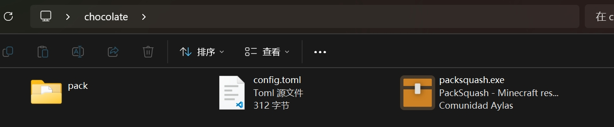
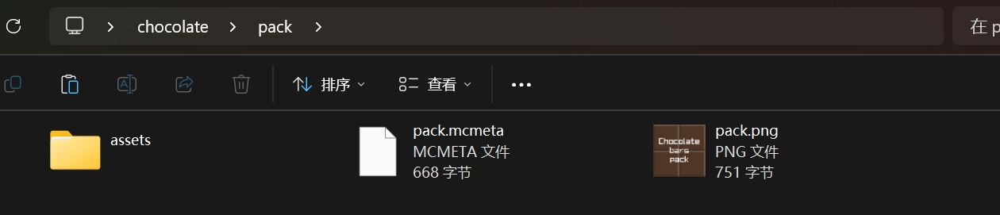
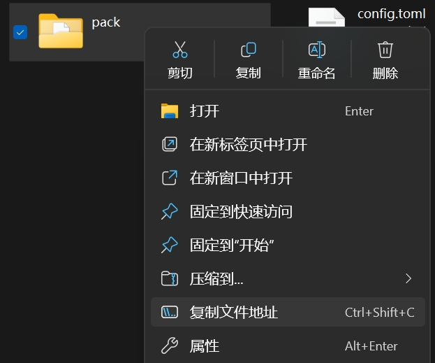

# 使用 PackSquash 压缩与混淆资源包
> bread

PackSquash 是一个资源包压缩与混淆工具，可以帮助减小资源包的体积并简单混淆它

工具的使用并不复杂，不过毕竟是命令行工具，对于不熟悉的人来说还是有点麻烦，本文将简单介绍如何使用

## 下载
前往[项目主页](https://packsquash.aylas.org/)找到按钮 `Download latest release`，会导向到项目的 GitHub Release 页面，也可以直接通过项目的 [Release 页面](https://github.com/ComunidadAylas/PackSquash/releases) 下载



对于 Windows 用户，寻找带有 `windows` 等字样的选项

对于 MacOS 用户，寻找带有 `apple`，`darwin` 或 `macOS` 等字样的选项

对于 Linux 用户，如果你需要教，请停止使用 Linux

图例为 0.4.1 版本的 Release 页面，不同版本命名不一样



以 Windows 为例，解压下载的压缩包，应该能得到一个箱子图标的，名为 `packsquash.exe` 的可执行文件

## 准备
需要准备三个文件：



- `packsquash.exe`：PackSquash 的可执行文件
- 资源包目录：解压的资源包，放在一个目录中，`pack.mcmeta` 应该在这个目录的根目录下
  -  
- 配置文件：一个格式为 `toml` 的文本文件，名称不限，不过此处我将其命名为 `config.toml`

理论上它们可以放在任何地方，不过为了方便起见，此处将它们放在同一个目录下

## 配置
打开 `config.toml`，输入以下内容：

```toml
pack_directory = '资源包目录的路径'
```

将 `资源包目录的路径` 替换为你资源包目录的实际路径

对于如何获取资源包路径，比较简单的方案是右键你的目录，选择 `复制文件地址`


如果是其它版本的 Windows，可能没有 `复制文件地址` 选项，可以选择 `属性`，在弹出的窗口中找到 `位置`，复制它的内容

注意，默认复制的路径使用双引号包裹，而 `toml` 建议使用单引号包裹字符串，所以需要将双引号替换为单引号，最终大概长这样（笔者的路径，请替换为你自己的路径）：

```toml
pack_directory = 'C:\Users\bread\Desktop\chocolate\pack'
```

## 运行

在工作目录下打开终端，一般可以在工作目录的空白处右键，选择 `在终端中打开`，如果没有这个选项，可以复制工作目录的路径，单独启动终端，输入 `cd "路径"` 进入工作目录

输入以下命令：

```sh
.\packsquash.exe .\config.toml
```

如果你搞不懂目录的关系，也可以直接复制 `packsquash.exe` 的路径和 `config.toml` 的路径，输入以下命令：

```sh
"packsquash.exe 的路径" "config.toml 的路径"
```

回车执行，如果一切正常，会在同目录下生成名为 `pack.zip` 的压缩包，这就是压缩与混淆后的资源包了

## 更多配置参数

刚刚的配置文件只是最简单的配置，使用默认的方案，如果想要定制效果，可以参考 [PackSquash 的文档](https://github.com/ComunidadAylas/PackSquash/wiki/Options-files) 来修改配置文件

如果你懒得折腾，笔者自己写了一套以压缩效果为主的，一般来说，它是可靠的，如果使用出现问题，请自行查阅文档修改

```toml
pack_directory = 'C:\Users\bread\Desktop\chocolate\pack'

recompress_compressed_files = true
zip_compression_iterations = 255
zip_spec_conformance_level = 'disregard'
never_store_squash_times = true

['**/*?.png']
image_data_compression_iterations = 255
downsize_if_single_color = true
png_obfuscation = true
```

几个额外选项的功能：
- `recompress_compressed_files`：再压缩
- `zip_compression_iterations`：压缩迭代次数，数值越大压缩率越高，但也越慢，0-255，默认20
- `zip_spec_conformance_level`：特殊打包方案，不符合标准 zip 规范，默认为遵守规范的'pedantic'，不符合规范虽然可以被游戏读取，但某些分发平台可能会拒绝上传
- `never_store_squash_times`：其实没看懂，推测和压缩重用有关，不过按照文档说法开启不会有副作用
- `image_data_compression_iterations`：图片数据压缩迭代次数，相当于图片版本的 `zip_compression_iterations`，0-255，默认15
- `downsize_if_single_color`：如果图片只有一种颜色，直接变成纯色图
- `png_obfuscation`：PNG 混淆，开启后会对 PNG 文件进行混淆

以笔者的[巧克力纹理包](https://modrinth.com/resourcepack/chocolate-bars-pack) 3.9 为例，原包通过 [PNGGauntlet](https://pnggauntlet.com/) 压缩，打包选择 [7-Zip](https://www.7-zip.org/) 的 `Level 9` 压缩，最终产物 1.8 MB；使用该配置压缩后，产物 0.8 MB，压缩率非常不错

## 注意事项

混淆不是加密，虽然被混淆的资源包不再能直接通过解压工具打开，但它的内容本质是可读取的，不要以为混淆了，就不会有盗版，偷卖了

更何况，即使是加密，只要终端用户能解密使用，跟没加也没区别