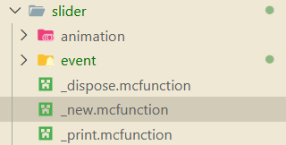

<FeatureHead
    title='Floating UI实战——自定义控件'
    authorName='Alumopper'
/>

:::tip ？！FUI ！？
Floating UI是一个~~可能是原版最~~强大的重量级UI框架，允许你用简单的NBT格式定义一个复杂美观的浮空可交互UI。
:::

<RepoCard repo="Alumopper/Floating-UI"/>

## 效果预览

让我们看看我们这篇文章要做的东西！是一个超炫酷的（并不，但是至少看起来很好用）的滑条控件：

<div style="display: flex; justify-content: center;" >
<iframe src="//player.bilibili.com/player.html?isOutside=true&aid=116364119441510&bvid=BV1mHDiBrE18&cid=37319477305&p=1" scrolling="no" border="0" frameborder="no" framespacing="0" allowfullscreen="true" style="width: 80%; height: 300px"></iframe></div>

需要做些什么呢？

1. 我们需要左右两端各一个元素，表示滑条的两端。
2. 我们需要一个长长的东西在中间表示滑条
3. 我们还需要一个可以移动的东西表示滑块
4. 在滑条上可能还需要一些刻度线来表示数值
5. 最后，我们需要监听用户的鼠标滚动输入来改变滑块的位置，同时可能还要进行一些处理，让滑块对齐刻度

## 定义属性

首先，我们需要明确一下这个控件需要一些什么属性。既然是一个可以拖动的滑条，那么它需要有一个最大值最小值，以及一个当前值，这些都是整数。还需要一个步长，因为我们允许用户用鼠标滚轮控制，滚动一下就是走一个步长。此外需要一个刻度值表示刻度。再来一个布尔类型的属性表示是否显示刻度线，以及一个布尔属性控制是否对齐到刻度。我们还需要一系列的字符串属性，用于指向一个物品模型，以便自定义滑条的外观。最后，我们还需要一个事件来供开发者监听值的改变。

总结一下，大概是这样的：

```js
min: 最小值 = 0
max: 最大值 = 100
step: 步长 = 1
tick: 刻度 = step
value: 当前值 = 0
tickVisible: 是否显示刻度 = false
snapToTicks: 是否自动调整到最近的刻度 = false
left_icon: 左侧图标 = "floating_ui:slider/left"
right_icon: 右侧图标 = "floating_ui:slider/right"
thumb_icon: 输入用的图标 = "floating_ui:slider/thumb"
bar_texture: 滑动条材质 = "floating_ui:slider/bar"
tick_texture: 刻度材质 = "floating_ui:slider/tick"
left_padding: 左侧图标和滑动条最左端之间的距离（倍率10000） = 0
我们定义这个变量，用来适配不同大小的图标，因为我们不能自动获取图标的实际大小
right_padding: 右侧图标和滑动条最右端之间的距离（倍率10000） = 0
value_change: 数值改变时的回调函数 = null
```

对于整数属性，我们需要新建对应的计分板，每一个UI控件对应的物品展示实体在这个计分板上的值就是它的属性值。而其他类型的，我们会存在这个物品展示实体的NBT中。

我已经提前画好了一些图标并设置好了模型，如果用户没有传入这些属性，就默认使用我画的这些图标和模型。

:::details 计分板定义
```mcfunction
# slider最小值
scoreboard objectives add floating_ui.slider.min dummy
# slider最大值
scoreboard objectives add floating_ui.slider.max dummy
# slider长度
scoreboard objectives add floating_ui.slider.length dummy
# slider最大值和刻度之间的差距
scoreboard objectives add floating_ui.slider.max_tick_gap dummy
# slider步长
scoreboard objectives add floating_ui.slider.step dummy
# slider刻度
scoreboard objectives add floating_ui.slider.tick dummy
# slider当前值
scoreboard objectives add floating_ui.slider.value dummy
# slider当前值
scoreboard objectives add floating_ui.slider.shadow_value dummy
# slider是否自动调整到最近的刻度
scoreboard objectives add floating_ui.slider.snapToTicks dummy
# slider是否显示刻度
scoreboard objectives add floating_ui.slider.tickVisible dummy
# slider左侧图标
scoreboard objectives add floating_ui.slider.left_padding dummy
# slider右侧图标
scoreboard objectives add floating_ui.slider.right_padding dummy
```
:::

## 文件结构

当我们需要定义一个新的控件的时候，需要在`floating_ui:element/<控件名>`目录下创建一系列的文件。对于这个滑条控件，我们需要首先创建这些文件和文件夹：



`animation`文件夹用于控件的动画定义，`event`用于事件处理。`_dispose`函数用于定义控件被销毁时的行为，`_new`函数定义了控件如何被创建，`_print`是一个调试用的函数，我们不会在这里介绍它。

## 控件创建

### 属性

让我们看向`_new`函数！

所有的控件都继承了`control`控件，这意味着我们的`_new`函数需要调用父控件的`_new`函数。此外，我们还需要处理控件自己的属性，这些是父控件的函数不会处理的。在`_new`函数中，我们可以通过`storage floating_ui:input temp`访问到创建控件时传入的属性值。例如，我们用如下代码判断用户是否传入了`min`属性，并且将其赋值给计分板：

```mcfunction
execute unless data storage floating_ui:input temp.min run data modify storage floating_ui:input temp.min set value 0
execute store result score @s floating_ui.slider.min run data get storage floating_ui:input temp.min
```

其他属性也是同理。

### 子控件

接下来是比较复杂的部分。我们的控件是由多个子元素组成的，包括左右两端的图标，中间的滑条，滑块，以及可能存在的刻度线。我们将这些子元素视作这个滑条的子控件，在`_new`函数中创建它们。如果全部都写在`_new`中，代码会非常冗长（虽然现在也不短了），因此我们将创建一个新的函数`set_content`来专门处理子控件的创建。

在FUI中，为一个控件创建它的子控件也是非常简单的。只需要将`floating_ui:input temp`中的内容修改为我们需要生成的子空间的布局数据，然后调用`function floating_ui:_new_control`生成这个子控件就好了。不对，我好像说得过于简单了（

代码实际上是这样的：

```mcfunction
# 生成一个物品展示实体。它的朝向和位置都和当前UI一致
# 这都是模板代码，就算你看不懂也可以直接复制
data modify storage floating_ui:input summon.arg.type set value "item_display"
function floating_ui:macro/summon_with_rot with storage floating_ui:input summon.arg
# 生成一个新的控件，类型为sprite，大小为[0,0]，指定tag
data modify storage floating_ui:input temp set value {type: "sprite", size: [0,0], tag:"floating_ui_slider_left_icon"}
# 以刚刚生成的物品展示实体为执行者，调用控件的生成函数
execute as @n[tag=just,distance=..1] run function floating_ui:_new_control
data modify entity 1bf52-0-0-0-2 Thrower set from entity @s UUID
```

在这里，我需要解释一下子控件和父控件的关系是如何绑定的。

1bf52-0-0-0-2世界实体中将会储存一个控件指针。一般来说，当我们调用完毕control的_new函数后，这个控件的UUID就会存在这个物品实体中，通过on origin我们就可以访问到这个控件了。当我们生成子控件的时候，`control/_new`已经执行完毕，所以1bf52-0-0-0-2将会指向当前的控件，也就是指向了子控件的父控件。子控件生成的时候，也会调用`control/_new`，在这个函数中，会把正在生成的控件骑乘到1bf52-0-0-0-2指向的实体上，也就是父控件上。这样，我们就可以通过骑乘建立父子控件的关系了。

这也是为什么，我们最后一行需要重新设置一下1bf52-0-0-0-2的Thrower。因为在生成子控件的时候，1bf52-0-0-0-2的Thrower会被修改为子控件的UUID，所以在生成下一个子控件的时候，实际上会认上一个子控件作为父控件！这可不妙，我们的UI树会乱套的，所以我们需要在每次生成完子控件后都把1bf52-0-0-0-2的Thrower重新设置为当前控件的UUID。

好的喵！我们现在知道了怎么创建子控件，那么还有一个问题，这个子控件应该在哪里呢？

对于左侧的图标，我们希望它在整个控件区域的左侧，并且左边缘对齐；对于右侧的图标则希望它在整个控件区域的右侧，并且右边缘对齐。滑条只需要在整个控件的中央，并且范围从左侧图标的右边缘到右侧图标的左边缘（当然我们不知道图标具体的尺寸，这也是为什么我们需要`right_padding`和`left_padding`）。滑条的x需要根据左右图标的位置动态计算。至于大小，所有的高度都和控件高度一致。为了简单起见，滑块的宽度以及左右两侧图标的宽度和高度一致，也就是都是正方形的（当然，我们这里只是说，它们的纹理保持正方形，而纹理内可能是一个长方形或者三角的图案）。

以左侧图标为例，我们看看实际上是怎么创建这个图标的

```mcfunction
scoreboard players add @s floating_ui.child_z 10

# 生成左侧图标
data modify storage floating_ui:input summon.arg.type set value "item_display"
function floating_ui:macro/summon_with_rot with storage floating_ui:input summon.arg

data modify storage floating_ui:input temp set value {type: "sprite", size: [0,0], tag:"floating_ui_slider_left_icon"}
# 你当然可以分多次修改temp来设置更多的属性喵
data modify storage floating_ui:input temp.model set from entity @s item.components."minecraft:custom_data".data.left_icon、

# 计算宽度和高度
# 图标的高度，宽度均和slider的高度相同
data modify storage floating_ui:input temp.size[] set from entity @s item.components."minecraft:custom_data".data.size[1]
# 图标的左端位置和slider的左端对齐
# 认为图标的默认大小总是16px，也就是1
# 通过floating_ui.size0_without_scale访问到当前控件的大小（size0就是宽度）
# 这些计分板的数值为了保持小数精度，都是放大了10000倍的整数（定点数）
scoreboard players operation x floating_ui.temp = @s floating_ui.size0_without_scale
scoreboard players operation x floating_ui.temp /= 2 int
scoreboard players operation x floating_ui.temp *= -1 int
execute store result storage floating_ui:input temp.x float 0.0001 run scoreboard players add x floating_ui.temp 5000
execute store result storage floating_ui:input temp.z float 0.0001 run scoreboard players get @s floating_ui.child_z
execute as @n[tag=just,distance=..1] run function floating_ui:_new_control
scoreboard players add @s floating_ui.child_z 10
data modify entity 1bf52-0-0-0-2 Thrower set from entity @s UUID
```

你可能会注意到代码中有一个细节，也就是`scoreboard players add @s floating_ui.child_z 10`。`x`和`y`表示上下左右，`z`表示什么呢，就是子控件的前后顺序啦。如果子控件的`z`都是一样的，它们就会重叠在一起，甚至可能会发生Z-fighting（就是两个面重叠在一起的时候，游戏不知道显示哪个，就会闪烁）。因此我们需要每生成一个子控件，就把`z`增加一点，这样就可以保证它们不会重叠了。

其他的几个控件也是同理哦，具体可以查看FUI的源码。

接下来是比较麻烦的，也就是滑块。滑块是一个动态移动的控件，所以我们不能直接在布局元素中写`x`属性。而在生成以后，它的`transformation`又是相对于UI根实体的，所以似乎就会有一点麻烦。但是没事，FUI已经帮我们处理好啦。我们只需要调用`_set_offset`函数，输入xyz，FUI会自动处理相对坐标，以及缩放等问题。因此，我们会这样写：

```mcfunction

# 生成thumb图标
data modify storage floating_ui:input summon.arg.type set value "item_display"
function floating_ui:macro/summon_with_rot with storage floating_ui:input summon.arg
data modify storage floating_ui:input temp set value {type: "sprite", size: [0,0], tag:"floating_ui_slider_thumb_icon"}
data modify storage floating_ui:input temp.model set from entity @s item.components."minecraft:custom_data".data.thumb_icon
# 计算宽度和高度
# 图标的高度和宽度和slider的高度相同
data modify storage floating_ui:input temp.size[] set from entity @s item.components."minecraft:custom_data".data.size[1]
execute store result storage floating_ui:input temp.z float 0.0001 run scoreboard players get @s floating_ui.child_z
execute as @n[tag=just,distance=..1] run function floating_ui:_new_control
scoreboard players remove @s floating_ui.child_z 20
# 根据value更新thumb的位置
function floating_ui:element/slider/update_thumb
```

因为更新滑块位置的逻辑不止是在生成中，当用户每次改变数值的时候，都需要更新滑块的位置，所以我们把它单独写成一个函数`update_thumb`，在所有需要更新滑块位置的时候调用它就好了。

有了FUI提供的函数，更新逻辑也并不复杂了。计算出当前值占整个滑条范围的百分比，然后乘以滑条的长度，就得到了滑块相对于滑条起点的偏移。最后调用`_set_offset`函数设置这个偏移就好啦。

```mcfunction
data modify storage floating_ui:input temp set value {x:0.0f}

scoreboard players operation percent floating_ui.temp = @s floating_ui.slider.value
scoreboard players operation percent floating_ui.temp *= 10000 int
scoreboard players operation percent floating_ui.temp /= @s floating_ui.slider.length
scoreboard players operation percent floating_ui.temp -= 5000 int
scoreboard players operation percent floating_ui.temp *= @s floating_ui.size0_without_scale
execute store result storage floating_ui:input temp.x float 0.0001 run scoreboard players operation percent floating_ui.temp /= 10000 int

# 注意我们这里使用on passengers找到滑块控件，因为当前执行者仍然是slider控件
execute on passengers if entity @s[tag=floating_ui_slider_thumb_icon] run function floating_ui:element/control/_set_offset
```

而刻度的逻辑也是类似的，不过刻度的位置虽然也要根据值来计算，但是它们的数量和位置是固定的。同时，我们需要一个循环逻辑，根据最大值和最小值以及刻度间隔来计算出需要生成多少个刻度，以及它们的位置。因此，我们需要新建一个函数`create_tick`，在其中处理这个循环。

```mcfunction
scoreboard players operation curr_value floating_ui.temp += @s floating_ui.slider.tick
execute if score curr_value floating_ui.temp > @s floating_ui.slider.max run return 0

# 生成刻度

data modify entity 1bf52-0-0-0-2 Thrower set from entity @s UUID
data modify storage floating_ui:input summon.arg.type set value "item_display"
function floating_ui:macro/summon_with_rot with storage floating_ui:input summon.arg
data modify storage floating_ui:input temp set value {type: "sprite", size: [0,0], tag:"floating_ui_slider_tick_icon"}
data modify storage floating_ui:input temp.model set from entity @s item.components."minecraft:custom_data".data.tick_texture
# 计算宽度和高度
# 图标的高度和宽度和slider的高度相同
data modify storage floating_ui:input temp.size[] set from entity @s item.components."minecraft:custom_data".data.size[1]
execute store result storage floating_ui:input temp.z float 0.0001 run scoreboard players get @s floating_ui.child_z
execute as @n[tag=just,distance=..1] run function floating_ui:_new_control

data modify storage floating_ui:input temp set value {x: 0.0f}


scoreboard players operation percent floating_ui.temp = curr_value floating_ui.temp
scoreboard players operation percent floating_ui.temp *= 10000 int
scoreboard players operation percent floating_ui.temp /= @s floating_ui.slider.length
scoreboard players operation percent floating_ui.temp -= 5000 int
scoreboard players operation percent floating_ui.temp *= @s floating_ui.size0_without_scale
execute store result storage floating_ui:input temp.x float 0.0001 run scoreboard players operation percent floating_ui.temp /= 10000 int

execute as 1bf52-0-0-0-2 on origin run function floating_ui:element/control/_set_offset

function floating_ui:element/slider/create_tick
```

有了前面的铺垫，这个逻辑应该不会很复杂了叭，我就不细说了。

最后，在`floating_ui:load`函数中注册这个控件的id：

```mcfunction
#region 控件注册
data modify storage floating_ui:data std set value {\
    "button":0b,\
    "list":0b, \
    "panel":0b, \
    "textblock":0b, \
    "stackpanel": 0b,\
    "numberbox": 0b,\
    "sprite": 0b,\
    "slider": 0b,\  #[!code ++]
}

```

那么现在，我们的控件已经可以被正常的渲染出来啦。写一个简单的测试布局：

```mcfunction
data modify storage floating_ui:input data set value {\
    "type": "panel",\
    "size":[5f,5f],\
    "child": [\
        {\
            "type": "slider",\
            "size": [3.0f,1.0f],\
            "value": 1,\
            "max": 9,\
            "min": 0,\
            "tickVisible": true,\
        }\
    ]\
}
```

然后调用`floating_ui:.player_new_ui`函数，就可以看看效果了w 。

## 监听输入

我们会在控件的`event`文件夹中定义事件处理函数。为了避免麻烦，FUI提供了一个模板，放在`element/custom_control_template`中，我们把它的`event`文件夹复制过来就好了。

对于这个滑条控件，我们需要监听两个输入——一个是用户的滚轮输入，即`roll`事件，对应了`roll_event`函数；另一个是用户的点击输入，即`click`事件，对应了`click_event`函数。

### 滚轮事件

:::tip
在滚轮事件中，我们可以通过变量`score slot floating_ui.temp`获取在这一次事件中，玩家鼠标滚轮滚过了多少个快捷栏。如果玩家鼠标滚轮向下滚动，这个值就是正数；如果向上滚动，这个值就是负数。
:::

还记得我们之前定义了一个属性叫做`snapToTicks`吗？当它为`true`的时候，意味着滑块总是对齐刻度，那么在鼠标滚轮输入的时候只需要让当前值改变一个刻度的距离就好了；反之，我们让值改变以步长为单位的距离。所以我们可以很快的写出这个逻辑——

但是等等！考虑一个特殊的情况，比如说，当滑条的区间范围不是刻度的整数倍的时候，当我们从左向右滚动滑块，由于我们的值肯定是步长的整数倍，这意味着我们最后一次滚动将会超过最大值。你可能会说，欸，我们检测到超过最大值的时候，把它钳制在最大值不就好了吗？但是如果我们这样做，当滑块到达最大值以后，重新向左滚动的时候，值将会变成一个不对齐刻度的数值，这就很尴尬了。

因此，采取一个巧妙的逻辑，我们用一个`shadow_value`来记录当前值在对齐到刻度之前的数值。当用户向右滚动的时候，我们先让`shadow_value`增加一个步长的距离，然后再把它对齐到刻度作为最后的`value`。而当我们重新向左滚动的时候，我们直接让`shadow_value`减少一个步长的距离，而不是从`value`减少一个步长的距离。

因此，最后，我们的逻辑是这样的：

```mcfunction
#update the value
#如果snapToTicks为true，则按照刻度调整，否则按照步长
execute if score @s floating_ui.slider.snapToTicks matches 1 run scoreboard players operation delta floating_ui.temp = @s floating_ui.slider.tick
execute if score @s floating_ui.slider.snapToTicks matches 0 run scoreboard players operation delta floating_ui.temp = @s floating_ui.slider.step
scoreboard players operation change floating_ui.temp = delta floating_ui.temp
scoreboard players operation change floating_ui.temp *= slot floating_ui.temp
execute if score change floating_ui.temp matches ..0 if score @s floating_ui.slider.value = @s floating_ui.slider.max run scoreboard players operation @s floating_ui.slider.value = @s floating_ui.slider.shadow_value
execute if score change floating_ui.temp matches 1.. run scoreboard players operation @s floating_ui.slider.shadow_value = @s floating_ui.slider.value
scoreboard players operation @s floating_ui.slider.value += change floating_ui.temp
# 钳制
execute if score @s floating_ui.slider.value < @s floating_ui.slider.min run scoreboard players operation @s floating_ui.slider.value = @s floating_ui.slider.min
execute if score @s floating_ui.slider.value > @s floating_ui.slider.max run scoreboard players operation @s floating_ui.slider.shadow_value += delta floating_ui.temp
execute if score @s floating_ui.slider.value > @s floating_ui.slider.max run scoreboard players operation @s floating_ui.slider.value = @s floating_ui.slider.max
function floating_ui:element/slider/update_thumb
```

### 点击事件

:::tip
在点击事件中，我们可以通过`score this.u/this.v floating_ui.temp`来获取到点击位置在当前控件中的相对位置，单位为方块长度，而原点则在控件的左上角。
:::

在点击事件中，我们需要获取到用户点击的x坐标，并据此计算出用户点击的位置对应的值。这个逻辑实现起来实际上非常简单。首先，考虑到控件可能会有缩放，我们需要把这个坐标转换为未缩放之前的坐标：

```mcfunction
scoreboard players operation x floating_ui.temp = this.u floating_ui.temp
scoreboard players operation x floating_ui.temp *= @s floating_ui.scale
scoreboard players operation x floating_ui.temp /= 100 int
```

随后，我们需要处理当用户点击到滑条左右两端图标时候的情况。这种时候，应该把值设置为最大值或者最小值：

```mcfunction
# 最小值
execute if score x floating_ui.temp <= @s floating_ui.slider.left_padding run return run scoreboard players operation @s floating_ui.slider.value = @s floating_ui.slider.min
# 最大值
scoreboard players operation to_right floating_ui.temp = @s floating_ui.size0_without_scale
scoreboard players operation to_right floating_ui.temp -= x floating_ui.temp
execute if score to_right floating_ui.temp <= @s floating_ui.slider.right_padding run return run scoreboard players operation to_right floating_ui.temp *= @s floating_ui.slider.max
```

然后，计算点击点到滑条左侧的距离占整个滑条长度的百分比，乘以区间范围，就得到了点击位置对应的值：

```mcfunction
# 在中间，计算
scoreboard players operation bar_length floating_ui.temp = @s floating_ui.size0_without_scale
scoreboard players operation bar_length floating_ui.temp -= @s floating_ui.slider.left_padding
scoreboard players operation bar_length floating_ui.temp -= @s floating_ui.slider.right_padding
scoreboard players operation x floating_ui.temp *= 10000 int
scoreboard players operation x floating_ui.temp /= bar_length floating_ui.temp
scoreboard players operation x floating_ui.temp *= @s floating_ui.slider.length
scoreboard players operation x floating_ui.temp += 5000 int
scoreboard players operation x floating_ui.temp /= 10000 int
scoreboard players operation x floating_ui.temp += @s floating_ui.slider.min
scoreboard players operation @s floating_ui.slider.value = x floating_ui.temp
```

最后，我们用简单的四舍五入把这个值对齐到刻度：

```mcfunction
# 对齐到刻度
# 步长只对滚动事件生效，点击事件不受步长限制
execute if score @s floating_ui.slider.snapToTicks matches 0 run return 0
scoreboard players operation to_tick floating_ui.temp = @s floating_ui.slider.value
scoreboard players operation to_tick floating_ui.temp -= @s floating_ui.slider.min
# 四舍五入
scoreboard players operation to_tick floating_ui.temp += 5000 int
scoreboard players operation to_tick floating_ui.temp /= @s floating_ui.slider.tick
scoreboard players operation to_tick floating_ui.temp *= @s floating_ui.slider.tick
scoreboard players operation to_tick floating_ui.temp += @s floating_ui.slider.min
scoreboard players operation @s floating_ui.slider.value = to_tick floating_ui.temp
```

这样，我们就成功根据用户的输入更新了滑条的值。别忘了更新滑块的位置！

```mcfunction
# 更新
function floating_ui:element/slider/update_thumb
```

## 触发事件

作为一个能获取用户输入的控件，开发者肯定希望通过一种类似事件的方式来监听用户的输入，而不是每tick都去检测值的改变。而在FUI中，自定义一个事件非常的简单。

还记得我们之前定义过的一个属性吗？

```js
value_change: 数值改变时的回调函数 = null
```

在`_new`函数中，它作为字符串属性被存入了控件的物品展示实体的NBT中。这个事件应当在值被改变的时候触发，也就是在用户点击，或者滚动鼠标滚轮的时候。

:::warning 注意
我们这里并没有判断修改前后的值是否真的发生了改变，也就是说，即使用户滚轮输入了一个值，但是由于被钳制了，最终的值没有发生改变，这个事件也会被触发。如果你不想要这种行为，可以在事件函数中自己判断一下当前值和之前值是否相同，如果相同就直接返回。
:::

`value_change`是一个函数的命名空间ID，所以我们得通过一个宏去调用对应的函数。在FUI中，你应该这样写这个调用过程：

```mcfunction
# 触发事件
data modify storage floating_ui:temp arg.function set from entity @s item.components.minecraft:custom_data.data.value_change
function floating_ui:util/function
```

把这段代码添加到你的`click_event`和`roll_event`函数中，这个事件就可以被触发了w

## 总结

虽然说是教程，但是实际上算是我开发过程中的个人总结（？

因为虽然FUI已经是一个成熟的框架，但是受限于性能要求和灵活性，FUI的可能设计存在一些令人不快的小细节，这篇文章也是帮助使用FUI的开发者避开一些可能存在的问题喵。

篇幅限制，还有很多内容没有在这篇文章中介绍到，比如说动画机制，在之后我会写一篇更加偏向于使用的文章，关于如何使用FUI已有的控件创建一个美观的窗体，尽请期待哦~