<FeatureHead
    title='杂谈 - 着色器的应用与滥用'
    authorName='轩宇1725'
/>

我已经在站内发布了不少的着色器教程，虽然依然会发布新的章节，但目前已经覆盖了大部分的基础内容了（后处理着色器除外）。读者已应当有能力自行设计和编写着色器了。

介于反复有人找我咨询一些把问题复杂化的着色器，也出于对当前阶段读者的提醒，有必要写一篇文章来讨论一下着色器的使用时机。

本篇内容是面向已经有着色器基础的读者，但如果你对着色器的使用或定制感兴趣，也可以尝试阅读本文。我们不会涉及到过于技术性的内容，而是更多地讨论设计问题。

## 重申着色器的功能

着色器是一段程序。在这之前，游戏已决定好要渲染哪些东西，不渲染哪些东西。游戏只会发送一些必要的数据到着色器中运行。

**顶点着色器**通过已经被计算好的 MVP 变换矩阵来计算顶点的最终位置，**片段着色器** 通过一些纹理采样和数学运算来计算每个像素的最终颜色。（大部分着色器的功能都是这些，一些着色器会实现特殊的效果，但并不超过这个框架）

而每个着色器程序的文件才是我们可改的部分，我们只能编写一段代码，实现一段流程来处理各种未知的输入数据。着色器程序无法预见、也无法判断数据被分发到不同着色器之前的整体状况。说得更直观一点，我们只能看到每个顶点、每个像素自身（若考虑偏导函数，我们只能看到这个像素和周围的3个像素），而无法看到整个场景的全貌。

虽然着色器经常被我称为“最终解决方案”，那是因为在实践中使用着色器的项目很少，大家都大量地使用资源包的其他部分来实现想要的效果，甚至有很多“奇技淫巧”来实现与 Mojang 开放的 API 似乎不相关的功能。

然而，在着色器被越来越频繁地被应用后，很多人开始依赖着色器来实现一些很简单的功能，甚至一些完全不适合用着色器来实现的功能。

## 为什么不要过度使用着色器

着色器的功能很强大，类似 C 的语法也比 mcfunction 更加灵活，能控制绝大多数画面的细节。按常理来说，我们应该多使用这样高级灵活的工具去实现我们想要的效果才对，但这建立在 **着色器是一个稳定的API** 的基础上。但 **这并不成立**。

[Mojang早就明确表示过](https://www.minecraft.net/en-us/article/minecraft-snapshot-25w31a#:~:text=Shaders%20%26%20Post%2Dprocess%20Effects)**尽管着色器现在开放修改，但官方并不支持用资源包去覆写原版的着色器**, 从 Mojang 近期宣布计划从 **OpenGL** 转向 **Vulkan** 的计划来看，渲染管线会迎来一系列大大小小的变化，每个变化都可能使你专注于 **Minecraft渲染管线特性** 的部分失效。但资源包的其他部分仅仅是分散的资产文件，不像是着色器那样需要依赖于整个渲染管线的特性来实现功能，所以它们的稳定性要高得多。

此外，不是所有玩家都能接受 **不开光影** 的游戏体验，大部分使用了着色器的地图或服务器并没有把画面做到能说服玩家不开光影的程度。我们开发的基于原版着色器的资源包在 **Optifine** 和 **Sodium** 下几乎不可用，而 **Iris** (作为 **Sodium** 的自定义着色器加载器) 和原版的着色器 API 也不兼容。要么要求玩家安装额外的mod，要么再开发一套专门适用于这些 API 的着色器。这些并不是很 Vanilla。

## 资源包的其他组分有什么功能

在讨论着色器的使用时机之前，有必要先了解资源包的其他组分的功能。现在资源包除着色器以外的部分已经十分强大了。我们在这里举一些例子说明曾经需要使用着色器的功能中，有哪些现在被更加稳定且受支持的方案取代了。如果对这些方案不感兴趣，可以直接跳到下一节

### 旋转角度

现在的模型不再受限于旋转角度，烘焙模型制作更加灵活（曾经我确实设计过一些用来扩展旋转限制的着色器，但随着展示实体的加入，以及后来的旋转限制的放宽，这些着色器就完全没什么意义了）。

### 仿射变换

在最新的快照中（属于 `26.1`） 允许在物品模型映射中为模型新增一个 `transformation` 字段，格式同展示实体，这意味着现在的模型变换除了一个刚体变换之外，还可以有一个任意的仿射变换（即允许被剪切），这意味着每个烘焙模型的元素现在可以是一个平行六面体，而这样一来完全可以用烘焙模型表示三角面，而不需要像过去一样用一系列元素去近似三角面，从而 [objmc](https://github.com/Godlander/objmc) 着色器项目未来可能也不再有用武之地（不过模型比较复杂的时候 **objmc** 性能更好，因为使用模型方案会引入数十倍的顶点）。

下图展示了如何用3个平行四边形来表示一个三角形，由于每个平行四边形实际上是一个烘焙模型元素，因此它有 $24 \times 3$ 个顶点和 $12 \times 3$ 个三角面。

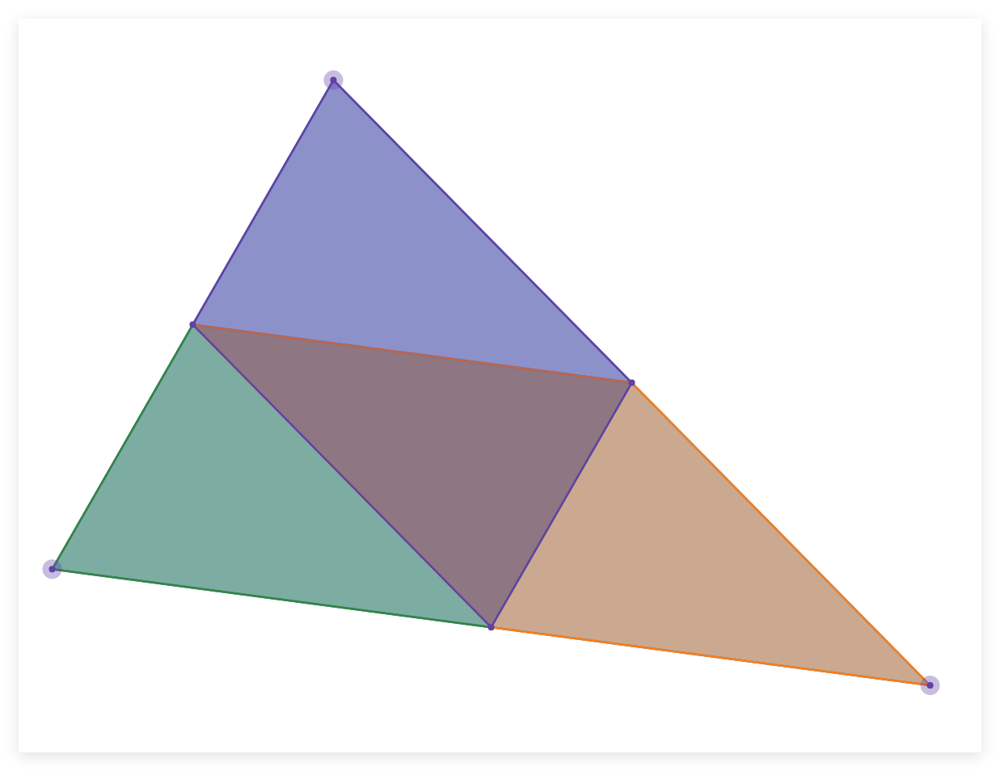

### 与客户端有关的条件检查

物品模型映射允许通过物品堆叠的属性去映射烘焙模型。

着色器的一大应用场景是代替原版没有的客户端条件检查去控制模型的变化，但物品模型映射已经加入了大量允许的条件，未来也会加入更多。除去检查 **物品堆叠(Item Stack)** 在服务端的状态之外，物品模型映射还允许检查：

- extended_view: 检查当前客户端是否按下了 `⇧ Shift` 且物品在GUI内被渲染
- keybind_down: 检查键位绑定是否被按下
- selected: 检查玩家是否在快捷栏内选择了这个物品堆叠
- view_entity: 检查摄像机是否在这个实体上（比如正常模式的自己和旁观者模式旁观的那个实体）
- ...

::: details 吐槽
> 吐槽 view_entity 的介绍在wiki上是真不讲人话，中文wiki是
>
>检查持有此物品堆叠的生物是否为当前正在作为摄像机的实体，即非旁观模式下是否为当前玩家，旁观模式下是否为当前进入视角的对应实体" `（编者注：已不再是）`
>
>英文wiki是
>
> - When not spectating, return true if context entity is the local > player entity, i.e. the one controlled by client.
>
> - When spectating, return true if context entity is the spectated entity.
>
> - If context entity is not present, will return false.
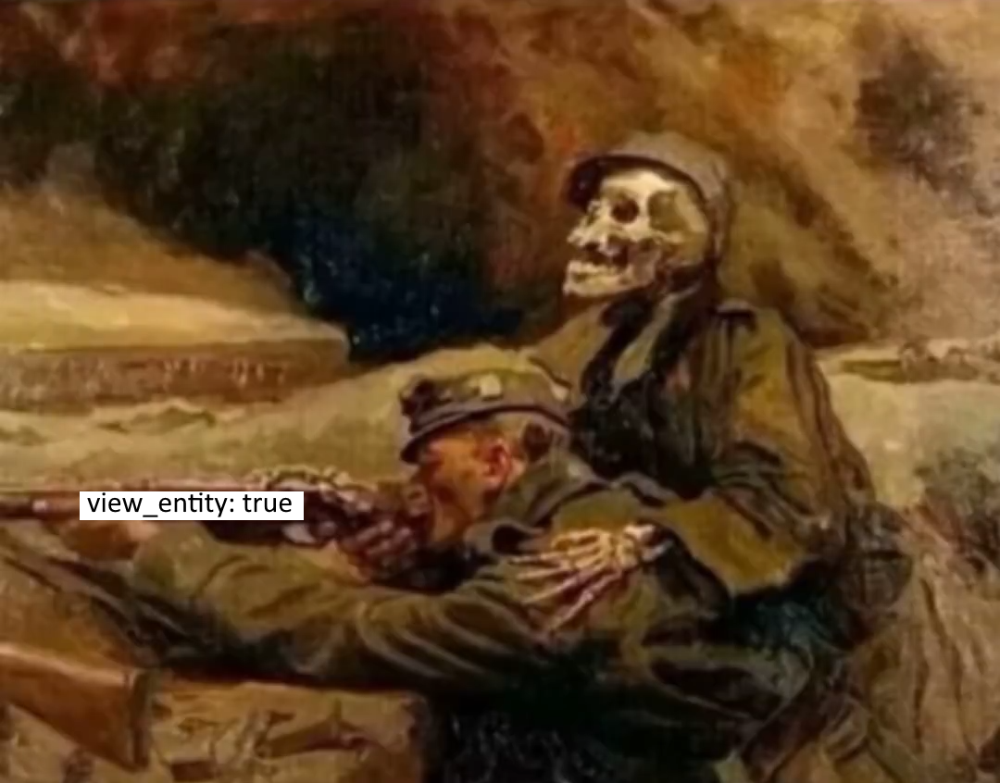
:::

虽然现在要让物品在GUI内和在世界内渲染不同的模型依然需要使用着色器，但未来可能会加入更多的条件检查来让物品在世界内也能根据不同的条件渲染不同的模型，这时就完全不需要着色器了。

### 负尺寸模型

负尺寸模型是一种建模技巧。由于 Minecraft 的渲染管线接受边长为负数的元素，渲染时会将每个有向面反转，从而玩家只能看到通常意义上的模型背面而非前面。通过这个技巧可以做到一种类似描边的效果。（也可用于实现镂空）

下面是来自 [夜洛伊_ALoyi](https://space.bilibili.com/352879603) 、[numio](https://space.bilibili.com/420920060) 和 [镇川](https://space.bilibili.com/10016652) 的三个负尺寸模型的例子：

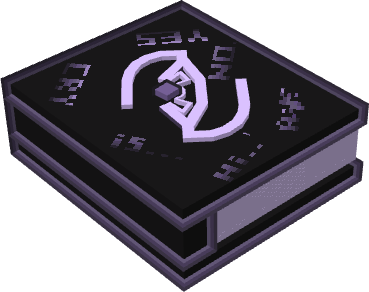

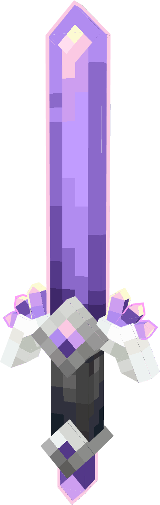

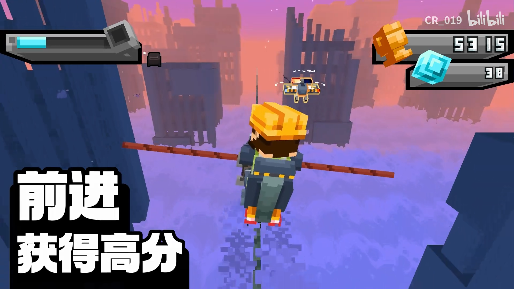

### 负空格

负空格是指在自定义字体中引入的一种宽度为负数的不可见字符，正常来说，字体需要依赖一个宽度来决定它的下一个字符应该从哪里开始渲染。如果这个宽度是负数的，那么我们的指针就会向前移动，从而在渲染时产生一些重叠的效果。这就免去了用着色器进行对文字左右平移的麻烦了，同时，基于原生的字体系统能够免去很多给着色器做标记的工作。

（如果需要大量上下移动则可能依旧需要着色器，可以参考前置 [BetterTitle - 火昱](https://vanillalibrary.mcfpp.top/datapack-index/wheel/resources/Better_Title.html)）

### 连接纹理（面剔除）

这是一个略显特殊的例子，它利用了面剔除这一优化机制来做到 optfine 的连接纹理效果。主要原理是将各个不同的差分放到同一个模型中，通过面剔除来决定剔除其他差分的面，只保留一个。这样一来方块就可以根据他周围方块的连接情况来决定使用不同的模型。

这个技巧甚至几乎可以完全代替着色器，因为着色器只能看到每个顶点或像素自身，而无法看到周围的方块是什么样子的。这个技巧在[本文](../2_texture/content)中介绍。

## 着色器的主要应用场景

这一段文字可能看起来像是教科书上写的，但是我们必须明确着色器最初被引入是为了完成什么工作。

从目的上来说，顶点着色器的工作是将程序中定义的顶点位置通过高效的矩阵运算来得到最终的屏幕位置，而片段着色器的工作是通过一些纹理采样和数学运算来得到每个像素的最终颜色。不过他们的功能却可以总结为：决定任何一个顶点的位置和决定任何一个像素的颜色。

由于 Minecraft 并不是一个高度自由的游戏引擎（虽然很多人已经把它当引擎用了），很多功能无法被 Mojang 提供的接口很好地实现（或者说实现起来非常麻烦），这些任务最终就落到了着色器的肩上了，因此着色器才会被我成为 “最终解决方案”，显然，前提是已经尝试过其他方案了。

那么目前还有那些典型应用是着色器才能实现的呢？我们可以总结为以下几类：

- 微调光照模型：Minecraft 的光照模型是固定的，唯一的可操作空间是方块模型的环境光遮蔽（可关闭）、展示实体的光照等级、烘焙模型的自发光。但如动态模型等元素则完全不允许修改，因此需要依赖着色器对这些内容进行自定义的调整。

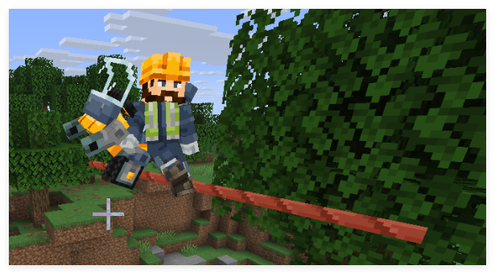

- 天空盒：Minecraft 的天空盒是固定的，而 Optfine 很早就引入了自定义天空盒的功能，是一个高需求的功能。但 Minecraft 的天空盒是通过一个特殊的着色器来渲染的纯色贴图，颜色只和位置有关，因此我们只能用着色器程序化地生成天空了。(图像来自 [狼王](https://space.bilibili.com/508626439) )

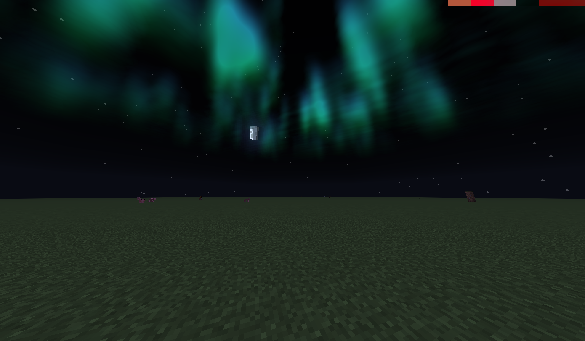

- 摄像机控制：虽然数据包能够操控玩家的坐标和朝向，但存在抖动问题。为了解决抖动问题必须要做到客户端层面的摄像机控制（如基岩版的 `/camera` 命令，但 Java 版没有），这就需要着色器来实现，通过修改 MVP 矩阵来控制摄像机的位置和朝向。

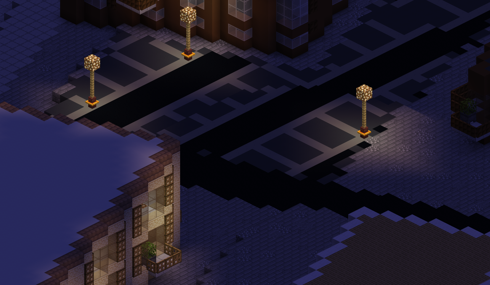

- 强制半透明：Minecraft 的有些着色器不支持半透明的渲染（比如26.1之前的固体方块），而元素通过什么类型的着色器渲染是硬编码的，因此我们只能通过着色器来强制实现半透明效果（随机丢弃片元）。

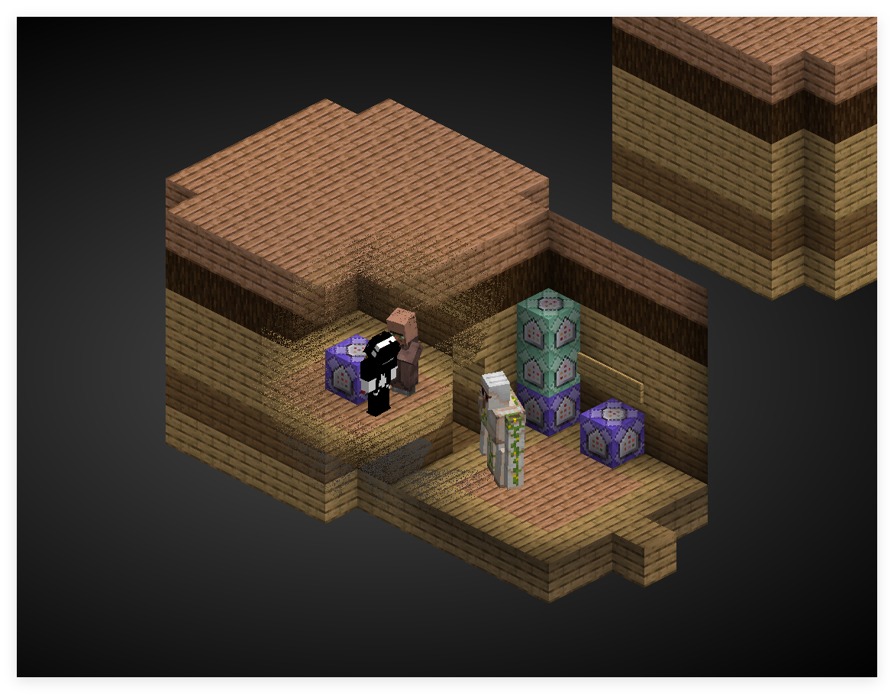

- 完全删除某些元素：Minecraft 有大量的内容不允许修改纹理，或者根本不通过纹理渲染（如旧版的tooltip），因此我们只能通过着色器来完全删除这些元素。

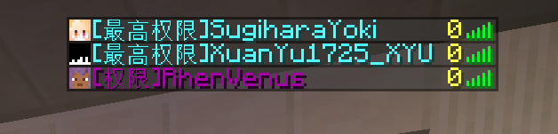 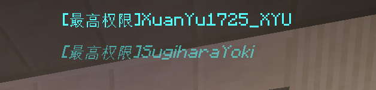

- 生成纹理：与上面的相似，对不能通过修改纹理来更改的元素，我们只能通过着色器来生成新的纹理了。（算法来自 [_polymath](https://www.shadertoy.com/view/lsVBWy) ）

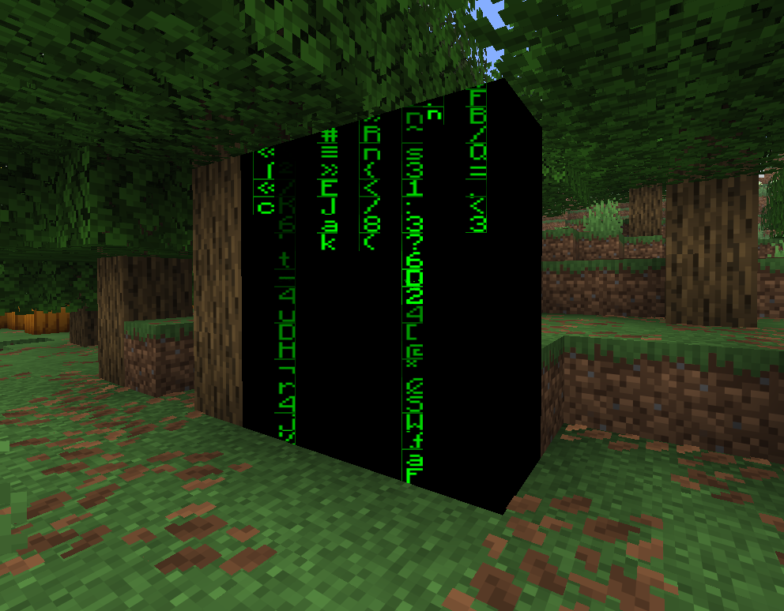

- 在不同的上下文渲染不同的模型：虽然物品模型映射已经允许我们根据一些条件来渲染不同的模型了，但这些条件仍然是非常有限的，因此我们只能通过着色器来实现更复杂的条件检查了。(主要是通过将多个模型同时渲染，然后通过着色器来决定丢弃哪些模型) (模型来自 [不是泽狸](https://space.bilibili.com/1236612296) )

> 本文发布时，这个功能已经可以用物品模型映射实现了。

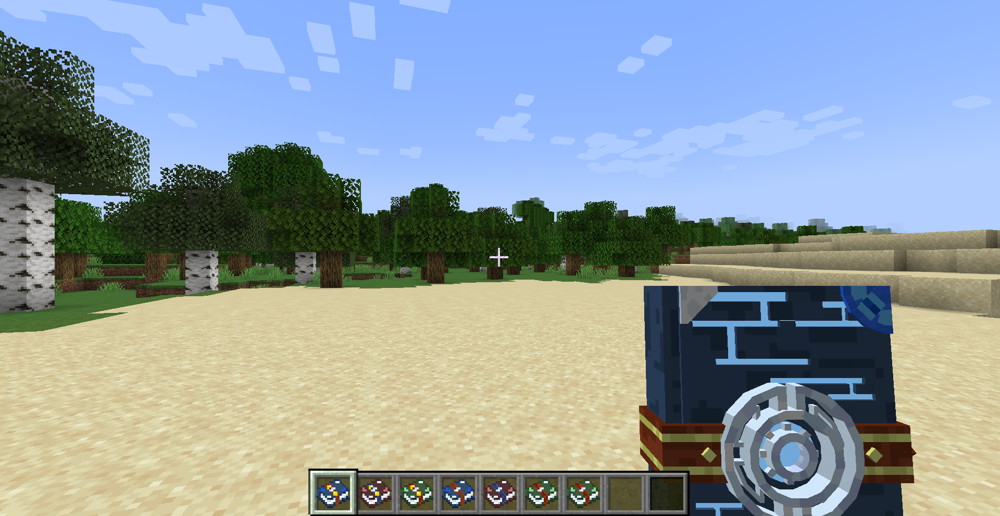

上述内容都是随着 Mojang 开放新的接口可能解决的，而下面的功能则是即使 Mojang 加入也必须要通过着色器来实现的（即着色器的本职工作）：

- 水面波纹：在不考虑物理交互的情况下，简单的水面波纹非常适合用着色器实现，只需要保证着色器计算的结果在数据的范围内有整数个周期，且处处连续即可做出不错的波纹效果。

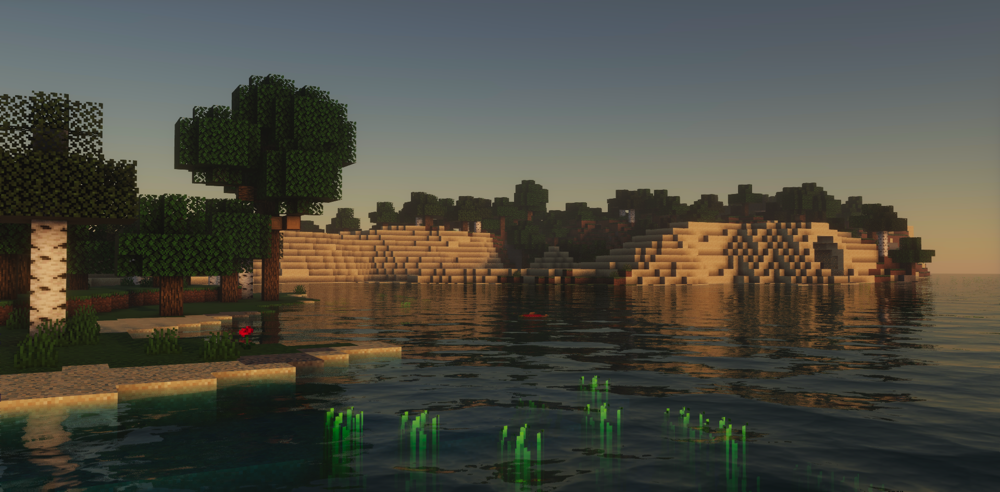

- 光照模型：Minecraft 采用了非常简化的光照模型（类似 Lambert 漫反射），而着色器可以让我们实现更复杂的光照模型（如 Blinn-Phong、Cook-Torrance 等）。

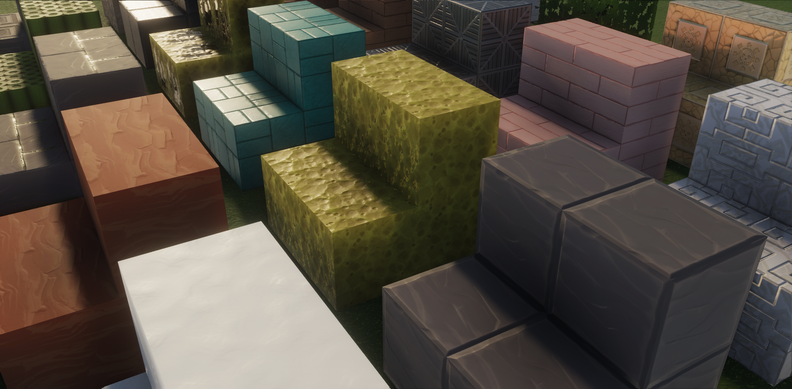

- 风格化渲染：通过着色器我们可以实现一些特殊的渲染效果，如卡通渲染、像素化、边缘检测等，这些是着色器的典型应用场景。

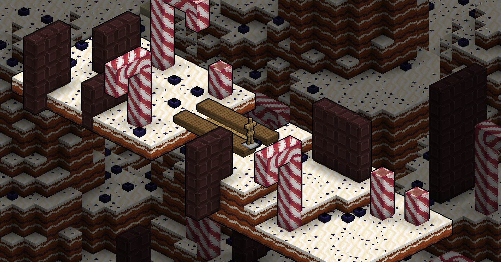

- 后处理效果：通过着色器我们可以实现一些全局的后处理效果，如模糊、色调映射、景深等，这些也是着色器的典型应用场景。 (图像来自 [晴路卡](https://space.bilibili.com/33229178) )

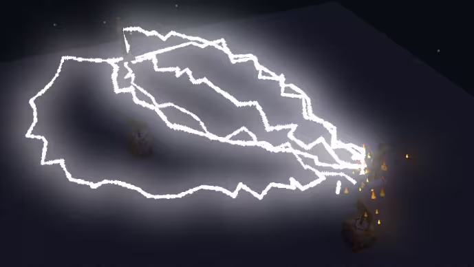

## 总结

在采用着色器之前，先确定这些功能是否可以由更加稳定的 API 轻易实现。如果你对着色器足够了解，或者继续深入学习，你将能自然地判断那些功能适合用着色器来实现，而那些功能不适合用着色器来实现了。

## 引用和资源

- objmc - GodLander: [通过将顶点数据烘焙到纹理中，绕过Java版模型限制](/wheel/resources/objmc)
- BetterTitle - 火昱: [基于负空格和着色器实现的多文本操作库](/wheel/resources/Better_Title)
- CEM-S - DartCat25: [CEM-S实体模型修改支持库](/wheel/resources/CEM-S)
- vanilla-shaderpack - JNNGL: [https://github.com/JNNGL/vanilla-shaderpack](https://github.com/JNNGL/vanilla-shaderpack)
- Shadertoy - _polymath: [https://www.shadertoy.com/view/lsVBWy](https://www.shadertoy.com/view/lsVBWy)
- Particle Bloom - 晴路卡: www.mcbbs.net/thread-1210511-1-1.html (已失效)