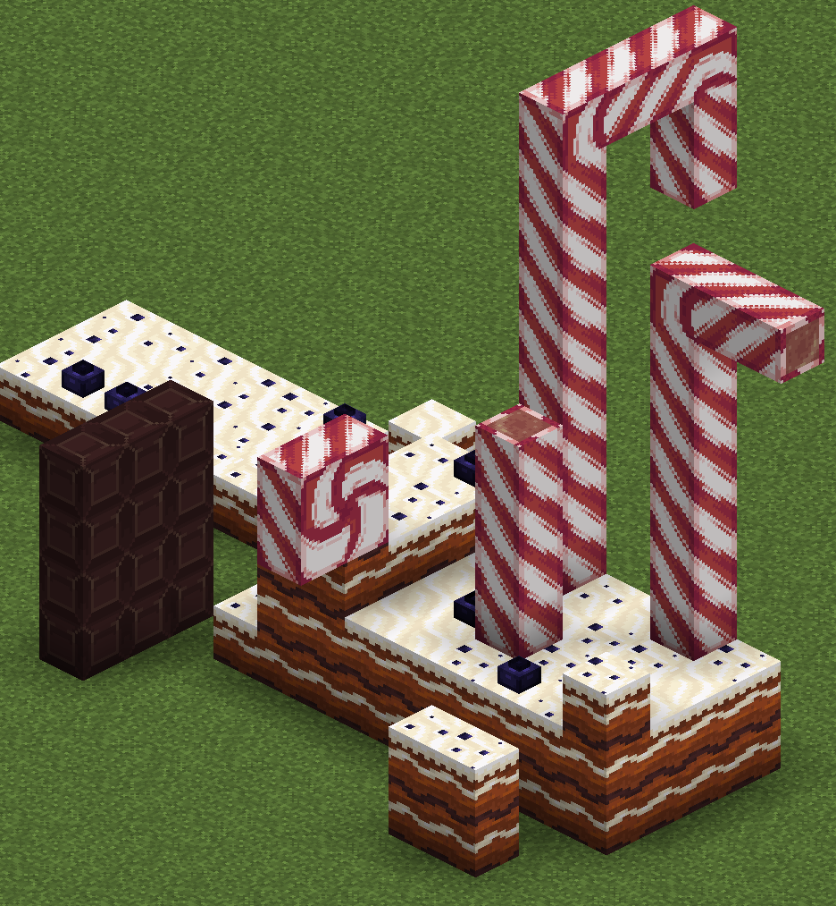
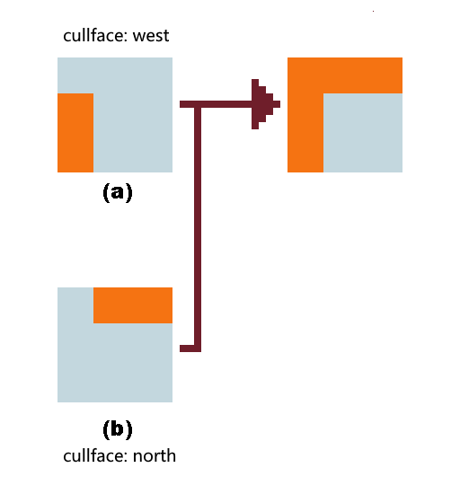
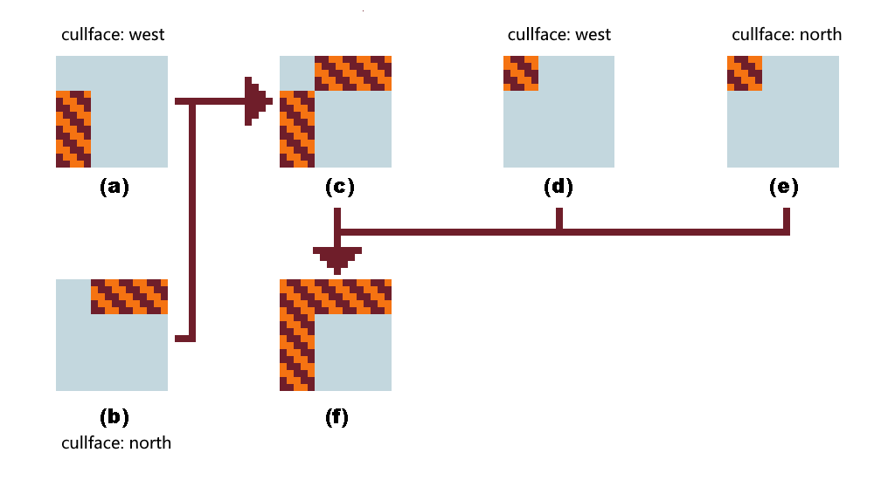
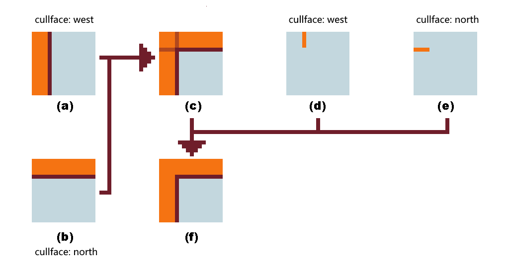
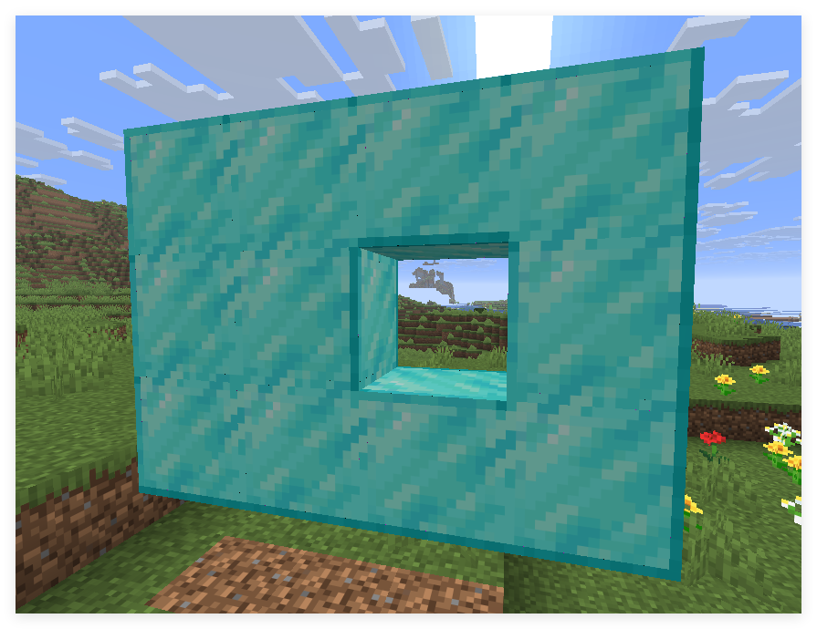

<FeatureHead
    title='基于面剔除的原版连接纹理'
    authorName='轩宇1725'
/>

## 前言

连接纹理是一个基于方块周围的环境自动改变自身外观的机制。在过去，这项工作主要依靠 [Optifine](https://optifine.net/home) 等第三方模组实现。在本文章中，我们将提供一种原版的近似方案，同样能实现类似的连接纹理效果。（更适用于自定义地图，对原版生存的兼容性仍有限）

## 原理简述

我们的基本思路是利用 `面剔除 (Culling)` 来判断方块周围是否有完整面，通过有选择地剔除面，我们可以让方块在相邻方块存在时隐藏对应的面，从而实现类似连接纹理的视觉效果。

这也直接决定了这个方案的兼容范围：无法对非所有方块进行连接纹理处理，也无法区分周围的方块是否与自己是同一类型的方块，无法完全实现 $64$ 种完全不相关的模型。尽管如此，这个方案在自定义地图中表现仍然非常不错。



图中的蛋糕地面、巧克力块和拐棍糖分别都只采用了一种方块建造。

## 面剔除介绍

在烘焙模型中，每个体素 (elements) 都可以定义其六个面的属性，面的数据格式如下：

<div class="nbttree">

<node type="compound" name="面"/> 这是一个模型面的定义。
- <node type="string" name="texture" required=true />指定所使用的纹理变量（以 `#` 开头）。
- <node type="list" name="uv"/>设置纹理映射。
  - <node type="float" name=""/>绑定到纹理起点的纹理横坐标 `u1`。
  - <node type="float" name=""/>绑定到纹理起点的纹理纵坐标 `v1`。
  - <node type="float" name=""/>绑定到纹理终点的纹理横坐标 `u2`。
  - <node type="float" name=""/>绑定到纹理终点的纹理纵坐标 `v2`。
- <node type="int" name="rotation"/>（默认为 `0`）根据特定的角度旋转纹理，可以为 `0`、`90`、`180` 或 `270`。
- <node type="int" name="tintindex"/>（默认为 `-1`）使用硬编码的着色索引对纹理重新着色。若为物品模型，则可指定为物品模型映射 `tints` 的下标以引用非硬编码的着色。
- <node type="string" name="cullface"/>指定剔除此模型面使用的遮挡方向。

</div>

其中 `cullface` 字段是一个枚举，用来指定这个面会在哪个方向有完整面时被剔除。可选值包括 `"up"`、`"down"`、`"north"`、`"south"`、`"west"` 和 `"east"`。

## 实现方式

基于这个特性，我们可以实现任意的连接纹理效果。假设我们想让模型在北面有完整面时使用模型 A, 其他情况下使用模型 B，那么我们可以将 B 的每个面设置 `cullface` 为 `"north"`，这样当北面有完整面时，B 的北面就会被剔除，从而显示出模型 A。而 A 可设置一个极小的缩放，使得 B 未被剔除时，B 将遮挡 A。

注意，B 模型不必是完整模型，可能仅遮住 A 的一部分即可。比如 B 只用于遮住特定方向的边缘。

当一个边界方向上有完整表面时，我们就触发剔除，让这个边被剔除，因此这个每个边界应当是一个独立的体素。

根据纹理情况，有下列几种处理流程：





图 1 适合纯色、边框纹理无旋转或只有一像素宽度的边框。(a) 与 (b) 同高度直接叠加。在原版，一般纯色的 z-flighting 不会产生明显的闪烁现象，因此可以直接叠加，若在特定光影下出现闪烁，则可使用 图 2 所示的边界填充法。(a) 和 (b) 以相同高度叠加得到 (c)，(d) 与 (e) 以稍异的高度叠加到 (c) 上。



这一流程适合一般性的角落处理，叠加方式同上，目的是为了遮住 z-flighting 的部分。当 north 方向剔除时，只保留 (a) 和 (d)，这样就留下了 west 方向的完整边界。同理，当 west 方向剔除时，只保留 (b) 和 (e)，从而留下 north 方向的完整边界。

## 例子：钻石块连接纹理

我们先分析钻石块的连接纹理需求：钻石块会相互剔除，在每个面上的处理是相似的，因此我们只研究一个面的上下左右四个方向的处理。

下面是一个完整的钻石块角落处理模型定义示例：

::: details 模型定义格式
```json
{
	"format_version": "1.21.11",
	"credit": "Made with Blockbench",
	"parent": "minecraft:block/cube_all",
	"textures": {
		"0": "block/diamond_block_down",
		"1": "block/diamond_block_left",
		"2": "block/diamond_block_right",
		"3": "block/diamond_block_surface",
		"4": "block/diamond_block_up",
		"particle": "block/diamond_block_down"
	},
	"elements": [
		{
			"name": "surface",
			"from": [0, 0, 0],
			"to": [16, 16, 16],
			"faces": {
				"north": {"uv": [0, 0, 16, 16], "texture": "#3"},
				"east": {"uv": [0, 0, 16, 16], "texture": "#3"},
				"south": {"uv": [0, 0, 16, 16], "texture": "#3"},
				"west": {"uv": [0, 0, 16, 16], "texture": "#3"},
				"up": {"uv": [0, 0, 16, 16], "texture": "#3"},
				"down": {"uv": [0, 0, 16, 16], "texture": "#3"}
			}
		},
		{
			"name": "cull_up",
			"from": [-0.003, 14.99998, -0.003],
			"to": [16.003, 15.99898, 16.003],
			"rotation": {"angle": 0, "axis": "y", "origin": [8, 8, 8]},
			"faces": {
				"north": {"uv": [0, 0, 16, 1], "texture": "#4","cullface": "up"},
				"east": {"uv": [0, 0, 16, 1], "texture": "#4","cullface": "up"},
				"south": {"uv": [0, 0, 16, 1], "texture": "#4","cullface": "up"},
				"west": {"uv": [0, 0, 16, 1], "texture": "#4","cullface": "up"},
				"up": {"uv": [0, 0, 16, 16], "texture": "#missing"},
				"down": {"uv": [0, 0, 16, 16], "texture": "#missing"}
			}
		},
		{
			"name": "cull_down",
			"from": [-0.003, 0.003, -0.003],
			"to": [16.003, 1.002, 16.003],
			"rotation": {"angle": 0, "axis": "y", "origin": [8, 8, 8]},
			"faces": {
				"north": {"uv": [0, 16, 16, 15], "texture": "#0","cullface": "down"},
				"east": {"uv": [0, 16, 16, 15], "texture": "#0","cullface": "down"},
				"south": {"uv": [0, 16, 16, 15], "texture": "#0","cullface": "down"},
				"west": {"uv": [0, 16, 16, 15], "texture": "#0","cullface": "down"},
				"up": {"uv": [0, 16, 16, 0], "texture": "#missing"},
				"down": {"uv": [0, 16, 16, 0], "texture": "#missing"}
			}
		},
		{
			"name": "cull_north",
			"from": [-0.002, 0.00102, -0.002],
			"to": [16.002, 1.00002, 16.002],
			"rotation": {"x": 90, "y": 0, "z": 0, "origin": [8, 8, 8]},
			"faces": {
				"north": {"uv": [0, 1, 16, 0], "texture": "#4","cullface": "north"},
				"east": {"uv": [16, 0, 15, 16], "rotation": 90, "texture": "#2","cullface": "north"},
				"south": {"uv": [0, 16, 16, 15], "texture": "#0","cullface": "north"},
				"west": {"uv": [1, 0, 0, 16], "rotation": 90, "texture": "#1","cullface": "north"},
				"up": {"uv": [0, 16, 16, 0], "texture": "#missing"},
				"down": {"uv": [0, 16, 16, 0], "texture": "#missing"}
			}
		},
		{
			"name": "cull_south",
			"from": [-0.002, 0.00102, -0.002],
			"to": [16.002, 1.00002, 16.002],
			"rotation": {"x": -90, "y": 0, "z": 0, "origin": [8, 8, 8]},
			"faces": {
				"north": {"uv": [0, 1, 16, 0], "texture": "#4","cullface": "south"},
				"east": {"uv": [1, 0, 0, 16], "rotation": 90, "texture": "#1","cullface": "south"},
				"south": {"uv": [0, 16, 16, 15], "texture": "#0","cullface": "south"},
				"west": {"uv": [16, 0, 15, 16], "rotation": 90, "texture": "#2","cullface": "south"},
				"up": {"uv": [0, 16, 16, 0], "texture": "#missing"},
				"down": {"uv": [0, 16, 16, 0], "texture": "#missing"}
			}
		},
		{
			"name": "cull_west",
			"from": [-0.001, 0.00102, -0.001],
			"to": [16.001, 1.00002, 16.001],
			"rotation": {"x": 0, "y": -90, "z": -90, "origin": [8, 8, 8]},
			"faces": {
				"north": {"uv": [16, 0, 15, 16], "rotation": 90, "texture": "#2","cullface": "west"},
				"east": {"uv": [1, 0, 0, 16], "rotation": 90, "texture": "#1","cullface": "west"},
				"south": {"uv": [1, 0, 0, 16], "rotation": 90, "texture": "#1","cullface": "west"},
				"west": {"uv": [16, 0, 15, 16], "rotation": 90, "texture": "#2","cullface": "west"},
				"up": {"uv": [0, 16, 16, 0], "texture": "#missing"},
				"down": {"uv": [0, 16, 16, 0], "texture": "#missing"}
			}
		},
		{
			"name": "cull_east",
			"from": [-0.001, 0.00102, -0.001],
			"to": [16.001, 1.00002, 16.001],
			"rotation": {"x": 0, "y": 90, "z": 90, "origin": [8, 8, 8]},
			"faces": {
				"north": {"uv": [1, 0, 0, 16], "rotation": 90, "texture": "#1","cullface": "east"},
				"east": {"uv": [1, 0, 0, 16], "rotation": 90, "texture": "#1","cullface": "east"},
				"south": {"uv": [16, 0, 15, 16], "rotation": 90, "texture": "#2","cullface": "east"},
				"west": {"uv": [16, 0, 15, 16], "rotation": 90, "texture": "#2","cullface": "east"},
				"up": {"uv": [0, 16, 16, 0], "texture": "#missing"},
				"down": {"uv": [0, 16, 16, 0], "texture": "#missing"}
			}
		}
	]
}
```
:::



> [下载资源包](https://github.com/CR-019/datapack-index/raw/refs/heads/lib-hosting/prod/feature_2026.05.diamond_resources.zip)\
> [镜像链接](https://gitee.com/Dahesor/server_resourcepacks/raw/lib/prod/feature_2026.05.diamond_resources.zip)

## 引用

钻石块的连接纹理借用了 Connected Textures (CTM) Overhaul 的纹理，这是一个依赖 Continuity 或 OptiFine 的资源包。

[https://modrinth.com/resourcepack/ctm-overhaul](https://modrinth.com/resourcepack/ctm-overhaul)