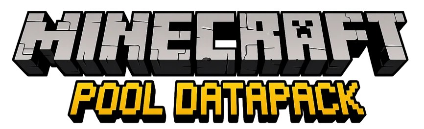
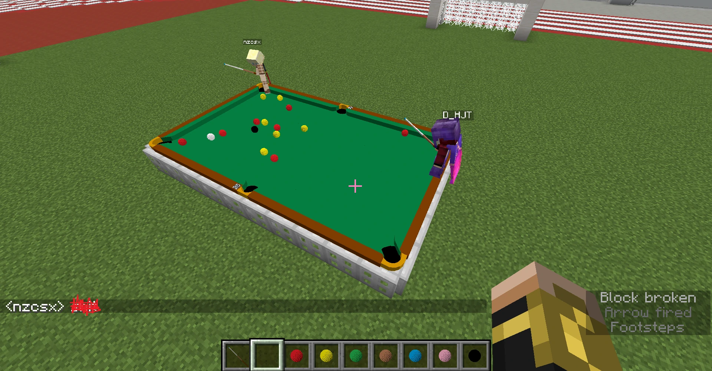
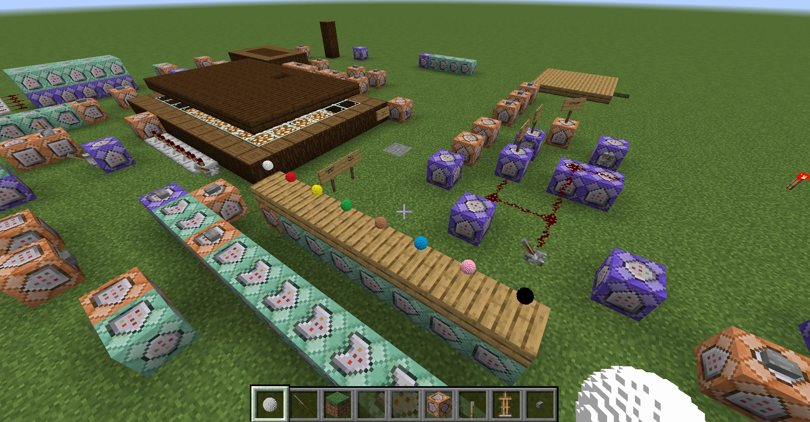
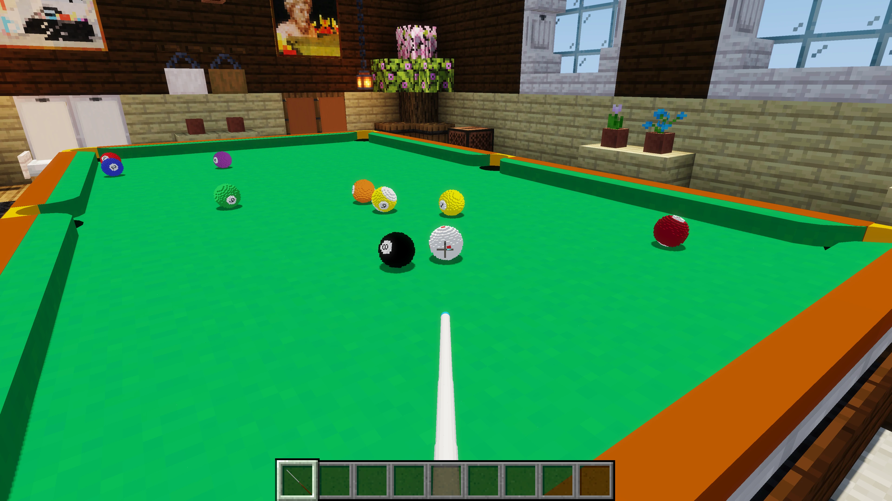
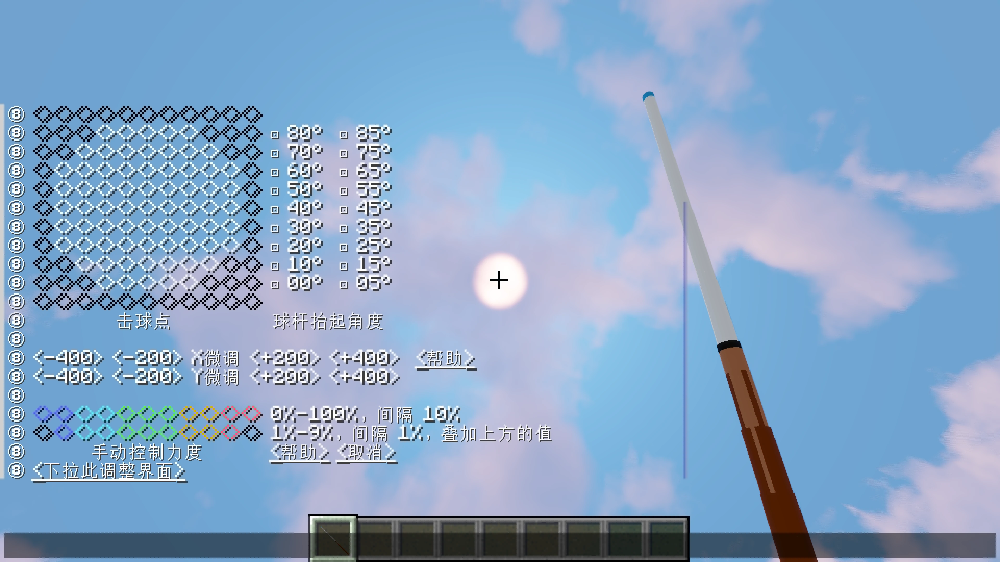
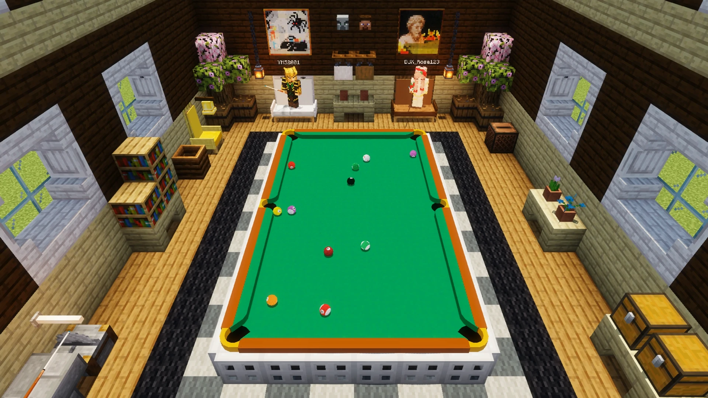
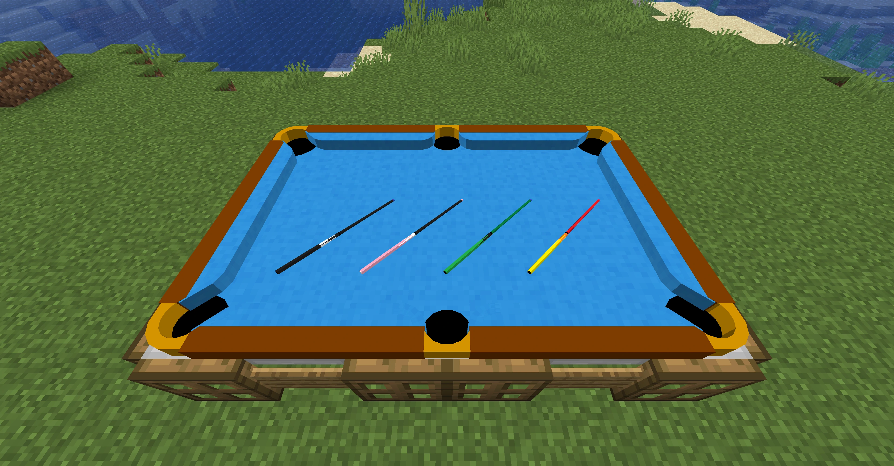

<FeatureHead
    title='在原版 Minecraft 中实现一个真实好玩的台球游戏'
    authorName='YMS2001'
    cover = '../_assets/3_cover.webp'
/>

这是一个适用于 **Minecraft Java 版** 的原版台球数据包，支持斯诺克、八球、九球和自定义练习模式，也支持单人游戏与双人对战。项目的目标是在不使用 Mod 的前提下，通过数据包、资源包和原版命令系统，实现一个具有物理模拟、规则判定、击球杆法控制和联机对局体验的真实台球游戏。数据包支持 1.16 以来的所有版本，并提供中英文双语支持。

  
   

> 项目主页：[GitHub 页面](https://github.com/MingshiYangUIUC/Pool-Minecraft-Squid-Workshop-Project)
> 正式版宣传片：[Bilibili](https://www.bilibili.com/video/BV1md9TBiEGu)

---

### 方块世界里的台球？

我最初的需求其实很简单：想在不能出门时用 Minecraft 自己打台球，也想在服务器里和朋友联机，击败他们。但我们都不玩 Mod，并且希望这个项目能够长期跟随游戏版本更新，所以我从一开始就选择了一条**原版**的路线。除此之外，我心里也不确定我和 Minecraft 的极限在哪里：只靠游戏里自带的指令和资源包，真的能实现这个目标吗？

在 Minecraft 里制作**台球**，听起来似乎并不稀奇。许多玩家都尝试过用彩色方块、船、鸡，或新版本中的硫磺史莱姆来模拟台球。实体被攻击、推动、碰撞、弹开，如果只是想做一个“看起来像”的短视频，这类直观又有趣的玩法非常受欢迎。但船有自己的碰撞逻辑，生物会受到游戏机制影响，方块也无法呈现自然滚动的效果。如果想要打一局**足够真实的**台球，问题就变得完全不同。

  
   
  <em>图 2：前期的双人英式八球对局。一开始球的模型不会旋转，所以只有单色台球。</em>

---

### 从底层建模开始的原版物理系统

在 Minecraft 中让一个球体模型沿直线移动、互相撞击、速度衰减，并在碰到边界时反弹，近年来网上能找到不少相关展示和教程。但从一开始，我想做的就不只是一个“球会动”的演示，而是一个尽量接近真实台球的游戏。现实中的台球包含摩擦、旋转、碰撞、走位，甚至袋口附近那种微妙的“吐球”效果。

  
   
  <em>图 3：用 1.16 开发时的测试场地。物理、显示和规则系统都需要在原版环境中反复调试。</em>

于是，这个项目从一个动量和能量守恒的基础物理模型开始，使用 Minecraft 计分板中的加减乘除等运算模拟台球的各种物理效果。玩家看到的一次击球、一次碰撞或一次进袋，背后是大量指令在跟踪每个球的位置，计算它们的速度、旋转，以及各种相互作用。视觉效果也随着物理系统一起更新。早期（例如图 2）的显示方式较为基础，后期加入计分板高效计算的盔甲架姿态和渲染实体转换数据，从而更真实地呈现旋转效果并支持带数字的球。

为了让 Minecraft 中的模拟进一步接近真实台球，项目并没有满足于普通的弹性碰撞模型。例如开球时，球堆会在极短时间内发生挤压造成的连续传力，这种过程很难只靠简单碰撞公式表现自然，微秒级的传力也几乎无法在 Minecraft 中以合理速度逐步计算。因此，系统加入了 AI 开球模拟：通过线下高精度物理模拟数据训练轻量神经网络，再将模型计算转换为 Minecraft 计分板逻辑，用来瞬间预测炸球堆那一刻的结果。于是，在原版 Minecraft 里，真的能像现实一样一杆清台。

  
   
  <em>图 4：九球模式的第一人称击球视角。</em>

---

### 从模拟效果到实际对局

击球时，玩家可以控制力度大小，也可以调整母球打点和杆身角度，实现高杆、低杆、加塞、扎杆等效果。为了验证物理表现，我还用它复刻过真实球局中的名场面，并做过一些物理实验模拟，例如对比真实实验中的分离角和球路变化，以及不同球桌摩擦力下低杆效果的差异。实验结果显示，数据包与真实台球表现已经相当接近。

  
   
  <em>图 5：母球打点（加塞）、球杆抬起角度（扎杆）和出杆力度的调整界面。</em>

在物理系统的基础上继续加入摆球、规则、计分等流程，这个数据包就变成了一个能玩的台球小游戏集。玩家可以单人练习，也可以双人联机对战；可以体验 8 球、9 球和斯诺克等模式；也可以在练习模式中自由摆球、研究杆法和走位。其中，斯诺克模式已经可以用来展示单杆 147 的连续进攻流程（详见文末链接）。

  
   
  <em>图 6：后期的双人中式八球对战场景。</em>

---

### 仍在继续扩展的功能

这个项目已经实现了一套较完整的原版台球游戏，但它远不是终点。近期版本更新继续加入了更多自定义内容，例如自定义的桌边样式、球杆模型、台布纹理和更灵活的规则设置。未来还会继续扩展到更多玩法，例如更好的生存/冒险模式兼容，更多种类的游戏，甚至玩家对战电脑的模式。

  
   
  <em>图 7：新版中自定义球桌与球杆的外观。</em>

---

### 后记

Minecraft 的世界由方块组成，没有真正的圆，而台球恰恰应该**是圆的**。正因如此，在原版 Minecraft 中实现看起来像、动起来像、打起来也像的台球，本身就是一个有趣的挑战。

从最初的一次弹性碰撞，到模拟物理、复刻球局、支持联机对战的完整系统，这个项目始终围绕一个简单想法展开：

**_让玩家能够在原版 Minecraft 里打一局像样的台球。_**

---

### 更多链接

- [斯诺克 147 视频](https://www.bilibili.com/video/BV1u7VdzxEpS)
- [GitHub 页面](https://github.com/MingshiYangUIUC/Pool-Minecraft-Squid-Workshop-Project)：项目主页与完整开源代码
- [Modrinth 页面](https://modrinth.com/datapack/pool-and-billiards)：推荐下载渠道，可自动安装依赖组件
- [CurseForge 页面](https://www.curseforge.com/minecraft/data-packs/pool-and-billiards)：备用下载渠道