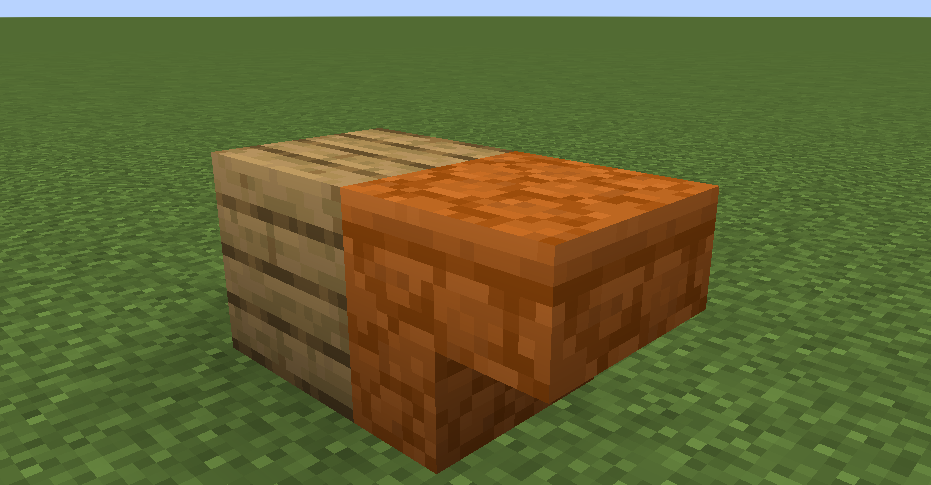
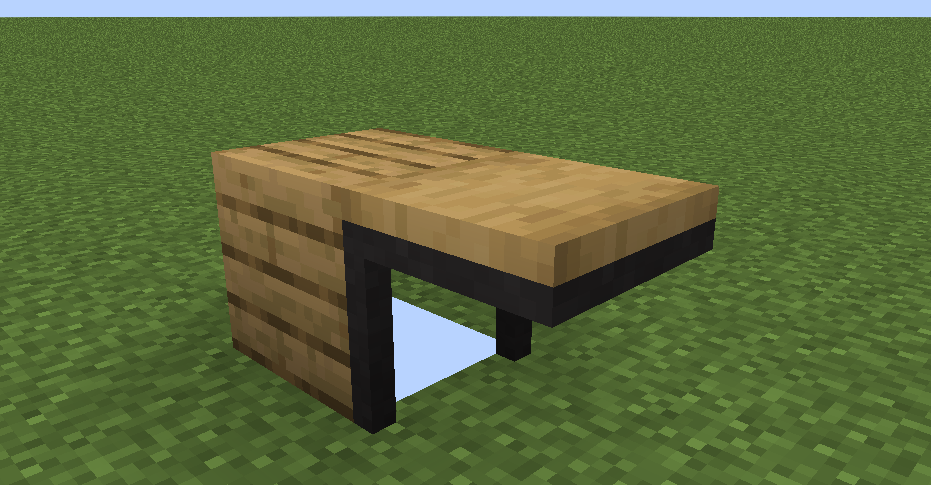

<script setup>
import { useData } from 'vitepress'
import ColorLine from '/.vitepress/vue/ColorLine.vue'
const { isDark } = useData()
</script>

# 封二
<ColorLine :height="4"/>

## 命令快闪 Command Flashlight
> 主编在5月14日晚上23:37才想起来封二没做，所以来不及找小知识了，鸽一期（


## 我问你答 Quizs

:::warning 本栏目不是“你问我答”！
在这一栏目中，我们将会提出几道题目，读者可以在评论区给出自己的解答（标明题号）。  
答案会在下一期Feature公布。  

本期出题人：徐木弦
:::

:::tip
本期问题均基于`26.1`版本。
:::

---

1. 为某冒险地图制作专用资源包时，将红砂岩楼梯的模型做成了桌子，当它与橡木木板搭建成左图所示的结构后，应用资源包，得到的渲染情况如右图所示。简述这种现象形成的原因。

  

---

2. 统计当前服务器内的游戏人数，把结果存入记分项。

---

3. 以下函数的运行结果为

```mcfunction
tellraw @a "\\"\
\\"
\"
```

---

### 上期参考答案

> 注：答案并非唯一。能解决问题即可。

题目1：

```mcfunction
execute as @e[type=wolf] on owner run tellraw @s "[提示] 你可以通过狗尾巴的角度判断它的生命值"
```

题目2：  

`0.3125f`

题目3：

声音事件 `backrooms:ambient.level0` 不在注册表中，生物群系定义文件不能直接用字符串形式的命名空间ID来引用未注册的声音事件。


题目4：

> data > easecation > tags > block > not_red_concrete.json
```json
{
  "values": [
    "minecraft:brown_concrete",
    "minecraft:orange_concrete",
    "minecraft:yellow_concrete",
    "minecraft:lime_concrete",
    "minecraft:green_concrete",
    "minecraft:cyan_concrete",
    "minecraft:light_blue_concrete",
    "minecraft:blue_concrete",
    "minecraft:purple_concrete",
    "minecraft:magenta_concrete",
    "minecraft:pink_concrete"
  ]
}
```

```mcfunction
fill 0 0 0 31 0 31 air replace #easecation:not_red_concrete
```


<ClientOnly>
  <GiscusComment
    repo="CR-019/datapack-index"
    repoId="R_kgDONRhuqw"
    category="闲聊 Chats"
    categoryId="DIC_kwDONRhuq84CkchW"
    mapping="number"
    term="64"
    :strict="false"
    :reactionsEnabled="true"
    emitMetadata="0"
    inputPosition="top"
    :theme="isDark ? 'dark' : 'light'"
    lang="zh-CN"
    loading="lazy"
    class="giscus-wrapper"
  />
</ClientOnly>