<FeaturedHead
    title='用 Minecraft 还原接水管小游戏：基于 Prim 算法的随机树生成和基于 Tarjan 算法的环路搜索'
    authorName='徐木弦'
    :extraAuthors="['洪旗']"
    cover = '../_assets/0.png'
    resourceLink = 'https://github.com/xu-mu-xian/Pipes-Mini-game-for-Minecraft'
/>


## 1. 引言
接水管（Pipes，或称 Freenet）是一种益智类小游戏，其玩法是：在 $w \times h$ 大小的网格中分布有不同形状的管道，目标是通过旋转这些管道，将所有管道连接成一个没有环路的结构。
<div style="text-align:center">
  <div style="display:flex; justify-content:center; align-items:center; gap:8px;">
    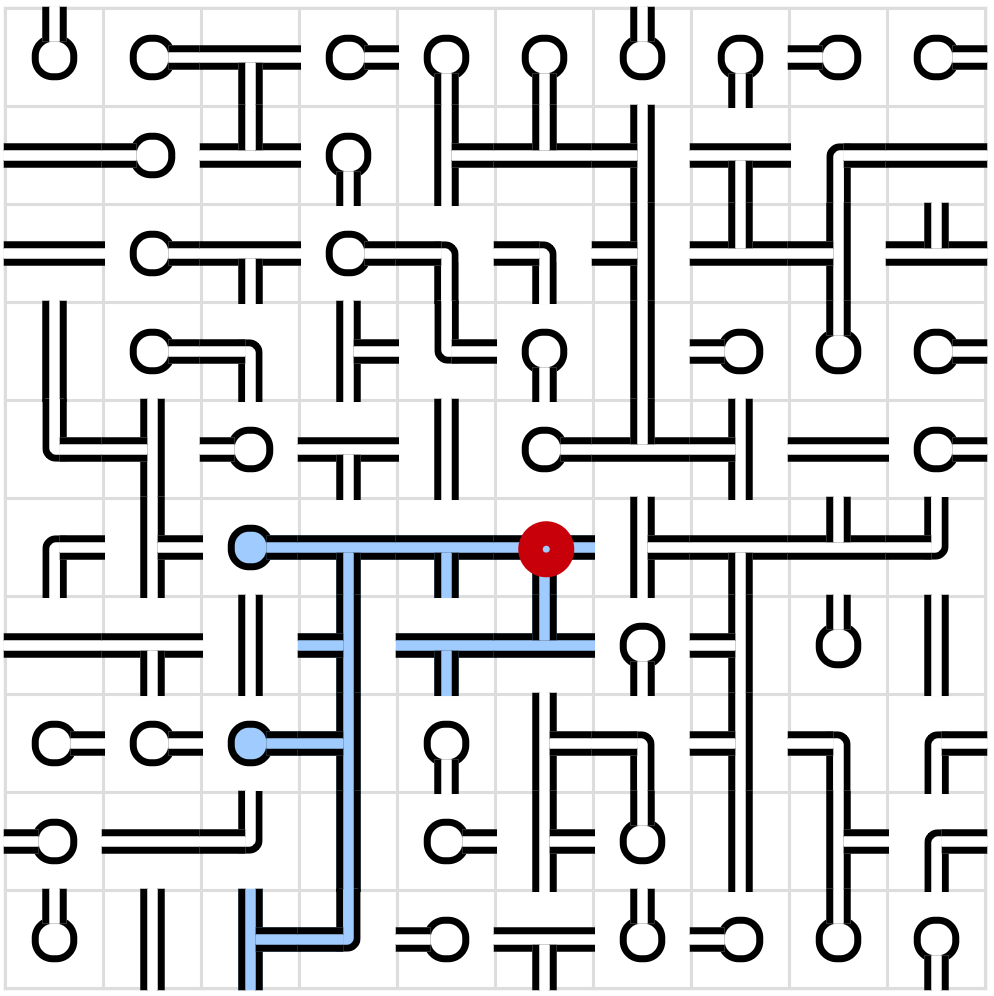
    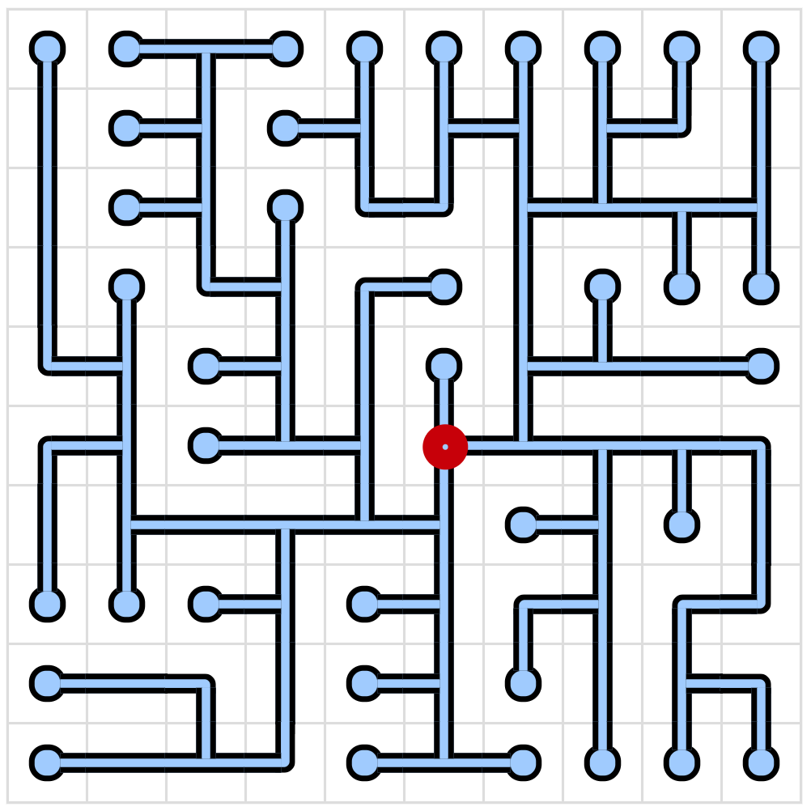
  </div>
  <p style="color: gray;">图 1：接水管小游戏实例，左图为题目，右图为答案</p>
</div>

为了确保游戏一定是有解的，一般的做法是先生成地图，再随机打乱其中的管道。这些随机生成的地图实际上是树，每一个方格被视为节点，其中水源（即为图 1 中标注出来的红色圆圈的位置）是为树的根节点。它有如下的性质：
- 图中不存在环路。
- 图中仅存在一棵树，沿着树能到达网格上的所有位置。
- 树仅包含以下形状的管道，**十字型的管道不被允许生成**。
  - 端点（死胡同），含有四个方向。
  - 直管，有 ━、┃ 两个方向。
  - L 型弯管，有 ┏、┓、┗、┛ 四种形状。
  - T 型管，有 ┣、┳、┫、┻ 四种形状。

用于生成随机树的方法有很多种，包括但不限于深度优先算法、Prim 算法、Kruskal 算法、Wilson 算法等。这些算法各自有其特点，生成的图有不一样的偏好。比如深度优先算法更倾向于生成长直线路径，相对于其他算法而言产生的分支较少，这使得生成的地图比较死板，游戏难度也会相应降低。Kruskal 和 Wilson 算法更适合生成自然的、均匀的随机树。Kruskal 算法在初始化时会将每个方格视为一个独立的集合，每次随机连边时都要做复杂的并查集判断，看两个格子是否属于同一个集合。Wilson 算法采用的是回路消除随机游走，每次选择一个未生成图的位置，随机游走直到碰到已有的树，这个过程需要确认路径轨迹、将新生成的分支与已有的树产生连接。Prim 生成的图路径通常比较短且碎，错落有致，产生的谜题难度理论上较大。与 Wilson 算法“从未知向已知游走”的生成模式不同，Prim 算法是较为纯粹的向外生长的生成模式，理论上这种方式对 mcf 而言实现起来会略微简便一些。因此，本文采用 Prim 算法作为用 Minecraft 生成接水管谜题的初次探索。

不过，仅仅生成随机树对于接水管小游戏而言是远远不够的，还需要判断玩家是否完成接水管谜题。一种可能的办法是，直接对比游戏局面和最终解，如果它们是完全一致的，就说明玩家已经完成了谜题。但是这种方法仅适用于唯一解的情况。既有研究对 Prim 算法生成唯一解谜题的频率作了统计，当网格面积越大，Prim 算法的唯一解谜题大幅度下滑，在 $5 \times 5$ 大小的网格中，生成唯一解的概率约为 70%；而到了 $20 \times 20$，这一概率下降至仅 0.02%。因此不能直接通过对比来判断玩家是否完成谜题。

由于最终解是树，因此可以从根节点出发，遍历树上的所有节点是否覆盖了整个网格。遍历树的方法也有很多，如广度优先搜索（以下简称 BFS）、深度优先搜索（以下简称 DFS）。比较关键的地方在于，玩家在尝试连接的过程中会不可避免地产生环路，而环路在树中被视为非法连接，如图 2 所示。BFS 和 DFS 都能够识别环路，程序从一个节点向前遍历时，若下一个节点已经被访问过了，它可以认为此处产生了环路，但不会知道环是从什么地方绕过来的。
<div style="text-align:center">
  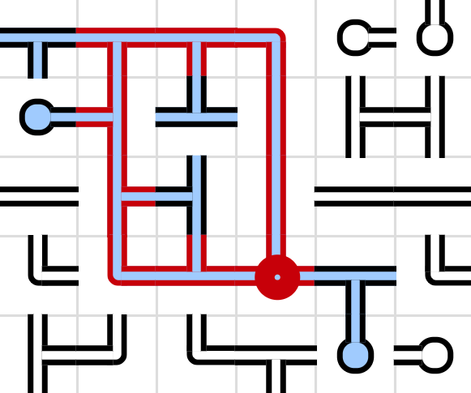
  <p style="color: gray;">图 2：接水管小游戏官网标注了出现环路的地方</p>
</div>

为了更好地还原这个小游戏，尤其是顺着图标记出位于环路上的所有节点，此时需要考虑此图为有向图还是无向图。这两者在节点数据的存储上会有所不同，有向图中每个节点需要记录的内容为：当前节点的位置、**指向的**邻居节点；无向图需要记录当前节点的位置和**连接的**邻居节点。这意味着有向图的生成过程中需要检查每一条边的方向，如果一条边是由邻居节点指向它的，那么这条边就不能算该节点指向的邻居节点，此处相比无向图而言多了一条判断语句。此外，在游戏过程中，有向图会很大程度地造成水流流向的混乱。
<div style="text-align:center">
  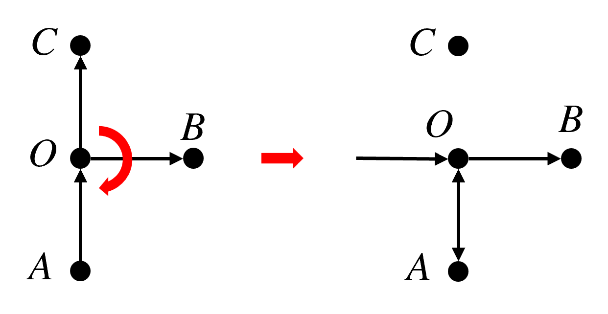
  <p style="color: gray;">图 3：有向图在接水管旋转上的问题</p>
</div>

如图 3，左侧显示的是一个正常的有向图。然而，当玩家尝试对 T 型管 $O$ 顺时针旋转 90° 时，管道的空间物理几何开口发生了改变，造成 $OA$ 之间的连接变成双向的，形成了一个二元互锁环路。这是因为每个节点的旋转仅能改写自身流入和流出的方向，它无法主动跨节点修改原本存在的流向。若要修正这一现象，算法必须从水源根节点出发，重新定义当前全图的唯一合法的水流方向网络，每个格子有 4 个旋转方向，全图一共有 $4^{mn}$ 种状态组合，这样会造成巨大的损耗。玩家面对的节点不应该预先存储出入方向，全图的流向是灵活可变的，因此接水管小游戏更适合用无向图来构建。

在无向图中，如果进行 DFS，经过的边可分为树边和反向边，其中反向边是指向已经在 DFS 栈中的祖先节点的边。下图展示了两种形态的环路，其中左图的 $AB$ 和 $AC$ 是两棵独立的子树，然而这种形态的环路在 DFS 上是不可能存在的，因为 DFS 会将一条分支探索完毕再进行下一条分支，所以无法同时存在两棵正在被遍历的子树，任何非树边必然连接某个节点及其上游节点，如右图所示。
<div style="text-align:center">
  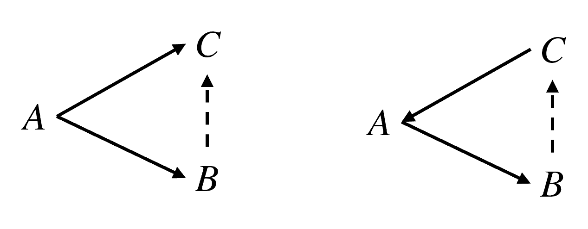
  <p style="color: gray;">图 4：两种形态的环路</p>
</div>

Tarjan 算法利用了这个性质，通过维护 `dfn` 和 `low` 两个数组，仅需一次 DFS 就能在回溯的过程中将所有的环路识别出来。本项目将使用 Tarjan 算法作为接水管谜题的解题判定方式。

## 2. 思路与流程
接下来需要确定具体的算法和思路。由于本文涉及的算法较为复杂，因此先用伪代码对这些算法做一个初步规划，从而方便后续的编写。本文涉及的算法主要包含两种：用于**生成地图**的随机 Prim 算法和用于**判断解题**的 DFS，其中为使 DFS 能够遍历环路，此算法另外添加了环路回溯。

### 2.1 随机 Prim 算法
**Prim 算法**是一种用于在加权连通图中构建最小生成树的算法。它从一个根节点开始，将节点的边纳入候选边列表，然后每一步选择候选边列表中权重最小的边，并将该边所连的未选节点加入树中。这个过程不断重复，直到所有节点都被纳入生成树，从而得到一棵包含全部节点且总权重最小的树。

在该条件下，如果令每一条边的权重相等，每次等可能地抽取任意的边，就变成了本文所使用的**随机化 Prim 算法**。完整的随机 Prim 算法所用的伪代码如下所示：

::: details Prim 算法伪代码

```
t = t_source  // t：节点，t_source：根节点
visit t
for n ∈ N do
  push (t, t_n) to list  // t_n：t的邻居节点
end for
while list is not empty do
  x = random(1, size of list)
  (t_c, t_cn) = list[x]  // t_cn：t_c的邻居节点
  if t_cn unvisited & t_c not t_shape then
    connect(t_c, t_cn)
    visit t_cn
    for n ∈ N do
      if t_cnn unvisited then  // t_cnn：t_cn的邻居节点
        push (t_cn, t_cnn) to list
      end if
    end for
  end if
  erase t_c from list
```
:::
<div style="text-align:center">
  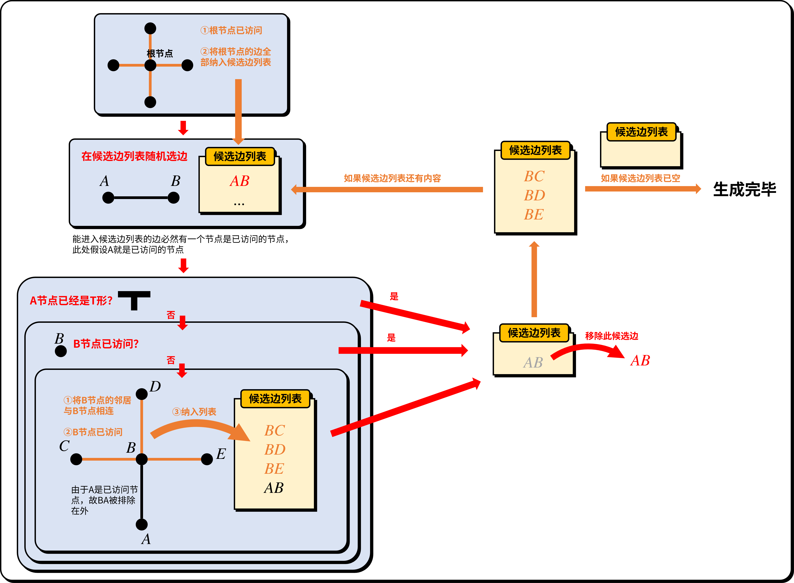
  <p style="color: gray;">图 5：Prim 算法流程图</p>
</div>

### 2.2 Tarjan 算法
要找环路，本质上就是要找割点。Tarjan 提出了一个极其经典的局部判定条件。对于 DFS 树中的一个父节点 $u$ 和它的子节点 $v$，有：

$$\text{low}(v) \ge \text{dfn}(u)$$

其中 `dfn` 是节点的遍历计数。只要遇到未访问的节点，`dfn` 就会增加 1，所以它是一直递增的，记录了每个节点被遍历的先后顺序。`low` 是指：从节点 $A$ 出发，继续往前遍历，在直接回溯的前提下，顺着其他路径向前遍历能走到的所有节点中 `dfn` 最小、也就是最早被遍历的节点的 `dfn` 值。

这个公式的意义是：子树 $v$ 里的所有节点，无论怎么通过反向边往前遍历，最多也只能遍历到 $u$，无法越过 $u$ 到达更上游的节点。于是，一旦把 $u$ 删掉，子树 $v$ 就会彻底孤立。因此，$u$ 是一个割点。在 DFS 回溯到 $u$ 的那一瞬间，程序只需要检查子节点的 $\text{low}(v)$ 是否满足这个条件，就能判定以 $u$ 为分界线的这部分子图是一个独立的环路。

在向深处搜索时，将所有遍历的节点和边（邻居节点）依次入栈。由于 DFS 保证了搜索的连续性，当回溯到某个节点 $u$ 满足 $\text{low}(v) \ge \text{dfn}(u)$ 时，此时栈顶到子节点 $v$ 之间的所有元素，恰好就是这个环路中的所有成员。此时算法只需要把栈里的元素不断弹出，直到把 $v$ 也弹出来。完整的 Tarjan 算法如下所示：

::: details Tarjan算法

```python
class Tile:
  def __init__(self, x, y):
    self.dfn = 0
    self.low = 0
    self.pos = (x, y)
    self.side = bytearray([0, 0, 0, 0])
    self.state = "none"

def neighbours(current_tile: Tile):
  neighbour_tiles = []
  x, y = current_tile.pos
  directions = [
    (-1, 0, 0, 2),
    (0, -1, 1, 3),
    (1, 0, 2, 0),
    (0, 1, 3, 1)
  ]
  for dx, dy, current_side, neighbour_side in directions:
    if (x + dx, y + dy) in grid:
      neighbour_tile = grid[(x + dx, y + dy)]
      if current_tile.side[current_side] == 1 and neighbour_tile.side[neighbour_side] == 1:
        neighbour_tiles.append(neighbour_tile)
  return neighbour_tiles

stack = []
dfn_counter = 0
warn_tiles_count = 0

def dfs(current_tile: Tile, parent: Tile):
  global dfn_counter, stack, warn_tiles_count
  dfn_counter += 1
  current_tile.low = dfn_counter
  current_tile.dfn = dfn_counter
  current_tile.state = "flood"
  stack.append(current_tile)
  for neighbour_tile in neighbours(current_tile):
    if neighbour_tile == parent:
      continue
    if neighbour_tile.state == "none":
      dfs(neighbour_tile, current_tile)
      current_tile.low = min(current_tile.low, neighbour_tile.low)
      if neighbour_tile.low >= current_tile.dfn:
        pop_tiles = []
        while True:
          pop_tile = stack.pop()
          pop_tiles.append(pop_tile)
          if pop_tile == neighbour_tile:
            break
        pop_tiles.append(current_tile)
        if len(pop_tiles) >= 3:
          for t in pop_tiles:
            warn_tiles_count += 1
            t.state = "warn"
    elif neighbour_tile.state == "flood":
      current_tile.low = min(current_tile.low, neighbour_tile.dfn)
```
:::

### 2.3 具体流程
整个游戏可分为生成、解题两大模块，其中生成的过程可分为以下几个阶段：
1. 初始化盘面，根据所需的长宽绘制网格。
2. 用随机化 Prim 算法生成地图。
3. 随机打乱整个盘面。
4. 对玩家显示盘面。

当玩家进行解题时，每旋转一次盘面上的任意水管，都要运行一次 Tarjan 算法，以随时检测玩家是否完成谜题，此程序执行完毕后，对玩家显示盘面。

## 3. 代码实现
具体的游戏流程已在 2.3 节有完整说明，参考第 2 章给出的伪代码，接下来就可以用 mcf 写出具体的代码。

### 3.1 网格
首先需要确定的是整个盘面的大小。本项目配置了一个记分项 `[pipes.var]`，一局游戏的网格宽度由 `#width` 存储，高度由 `#height` 存储。网格的所有数据存放在命令存储 `pipes:grid` 内，使用一个二维列表 `grid`，其中一级列表存储网格宽度方向的数据，二级列表存储网格高度方向的数据。`grid` 内的数据按行列对应实际网格内的节点，网格左上角的节点为 `grid[0][0]`，宽度方向的坐标 $x$ 向右增大，高度方向的坐标 $y$ 向下增大，右下角的节点为 `grid[<width-1>][<height-1>]`。
<div style="text-align:center">
  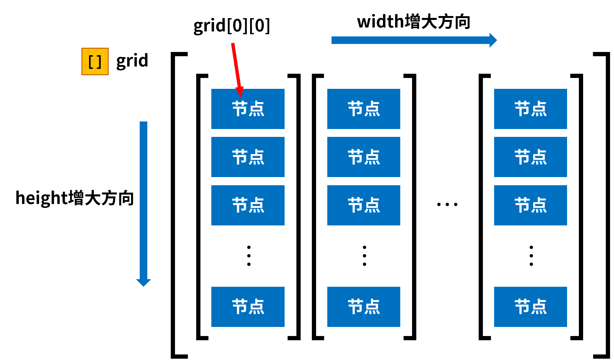
  <p style="color: gray;">图 6：grid数据示意图</p>
</div>

其中每一个 `grid[x][y]` 都有如下的数据：
<div class="nbttree">

<node type="compound" name=""/> 节点根标签
- <node type="int" name="index"/>该节点的索引，从 1 开始计数，计算方式为 `<index>=<x>+<y>*<width>+1`。
- <node type="int" name="parent_x"/>该节点的父节点的 $x$ 坐标。
- <node type="int" name="parent_y"/>该节点的父节点的 $y$ 坐标。
- <node type="byte_list" name="side"/>该节点在四个方向上的连接情况，数组内一共有 4 个元素，依次代表左、上、右、下四个方向，其中 `0b` 为未连接，`1b` 为连接。
- <node type="bool" name="source"/>该节点是否为根节点。
- <node type="byte" name="state"/>该节点的状态，`0b` 为无，`1b` 为灌水，`2b` 为警告，`3b` 为待访问。
- <node type="bool" name="visited"/>该节点在生成阶段是否已访问，在游戏阶段无实际作用。
- <node type="int" name="x"/>该节点的 $x$ 坐标。
- <node type="int" name="y"/>该节点的 $y$ 坐标。
</div>

接下来生成初始化的整个网格：

::: details data\pipes\function\grid\.mcfunction

```mcfunction
data modify storage pipes:grid grid set value []
scoreboard players set #x pipes.var 0
function pipes:grid/width
scoreboard players reset #tile_index pipes.var
```
:::

::: details data\pipes\function\grid\width.mcfunction

```mcfunction
scoreboard players set #y pipes.var 0
data modify storage pipes:grid grid append value []
function pipes:grid/height
scoreboard players add #x pipes.var 1
execute if score #x pipes.var < #width pipes.var run function pipes:grid/width
```
:::

::: details data\pipes\function\grid\height.mcfunction

```mcfunction
data modify storage pipes:grid grid[-1] append value {side:[B;0b,0b,0b,0b],visited:false}
execute store result storage pipes:grid grid[-1][-1].x int 1.0 run scoreboard players get #x pipes.var
execute store result storage pipes:grid grid[-1][-1].y int 1.0 run scoreboard players get #y pipes.var
scoreboard players operation #tile_index pipes.var = #y pipes.var
scoreboard players operation #tile_index pipes.var *= #height pipes.var
scoreboard players operation #tile_index pipes.var += #x pipes.var
scoreboard players add #tile_index pipes.var 1
execute store result storage pipes:grid grid[-1][-1].index int 1.0 run scoreboard players get #tile_index pipes.var
scoreboard players add #y pipes.var 1
execute if score #y pipes.var < #height pipes.var run function pipes:grid/height
```
:::

### 3.2 生成地图
用以下命令设置需要生成的网格的宽高：
```
scoreboard players set #width pipes.var <width>
scoreboard players set #height pipes.var <height>
```

然后可以执行以下函数：

::: details data\pipes\function\prim\process.mcfunction

```mcfunction
scoreboard players enable @s pipes.operation

#生成特定大小的方格
function pipes:grid/

#创建候选边列表
data modify storage pipes:prim alternative_side set value []

#确定起始生成的格子
scoreboard players operation #starting_tile_x pipes.var = #width pipes.var
scoreboard players operation #starting_tile_x pipes.var /= #2 pipes.constant
scoreboard players operation #starting_tile_y pipes.var = #height pipes.var
scoreboard players operation #starting_tile_y pipes.var /= #2 pipes.constant
data modify storage pipes:prim cache.current.tile set value [I;0,0]
execute store result storage pipes:prim cache.current.tile[0] int 1.0 run scoreboard players get #starting_tile_x pipes.var
execute store result storage pipes:prim cache.current.tile[1] int 1.0 run scoreboard players get #starting_tile_y pipes.var

#把当前的格子标记为已访问
execute store result storage pipes:prim macro.x int 1.0 run scoreboard players get #starting_tile_x pipes.var
execute store result storage pipes:prim macro.y int 1.0 run scoreboard players get #starting_tile_y pipes.var
function pipes:prim/visit_source with storage pipes:prim macro

#创建起始格子的候选边
data modify storage pipes:prim cache.current.side set value [B;-1b,0b]
data modify storage pipes:prim alternative_side append from storage pipes:prim cache.current
data modify storage pipes:prim cache.current.side set value [B;0b,-1b]
data modify storage pipes:prim alternative_side append from storage pipes:prim cache.current
data modify storage pipes:prim cache.current.side set value [B;1b,0b]
data modify storage pipes:prim alternative_side append from storage pipes:prim cache.current
data modify storage pipes:prim cache.current.side set value [B;0b,1b]
data modify storage pipes:prim alternative_side append from storage pipes:prim cache.current

#主函数：生成地图
function pipes:prim/main/

#打乱管道
function pipes:upset/

#显示生成结果
function pipes:operation/tarjan/
function pipes:display/

#删除候选边列表
data remove storage pipes:prim alternative_side
```
:::

该函数实际上覆盖了整个随机 Prim 算法生成的过程。此处根节点被强制设置为位于整个 $w \times h$ 网格中心的节点。由于求商运算自身的特性，当宽高为偶数时，该中心节点坐标实际上为 $(\cfrac{w}{2} + 1, \cfrac{h}{2} + 1)$。在先前的伪代码中，根节点需要被访问，访问根节点所用的函数如下所示：

::: details data\pipes\function\prim\visit_source.mcfunction

```mcfunction
$data modify storage pipes:grid grid[$(x)][$(y)] merge value {source:true,state:3b,visited:true}
```
:::

#### 3.2.1 候选边列表
存储 `pipes:prim` 是随机 Prim 算法的专用存储，候选边列表是其中的一个字段 `alternative_side`。由于它存储的实际上是边的数据而不是节点的数据，因此列表内元素的内容与节点数据有所区别。以下称候选边所属的节点为“**当前节点**”，候选边延伸方向的节点为“**邻居节点**”。每条候选边都有如下的数据：
<div class="nbttree">

<node type="compound" name=""/> 候选边根标签
- <node type="byte_list" name="index"/>该候选边的方向，一共有 2 个元素。前一个元素为 `-1b` 时，表示此边向左延伸；为 `1b` 时，此边向右延伸。后一个元素为 `-1b` 时，表示此边向上延伸；为 `1b` 时，此边向下延伸，实际上只有 4 种有效值：左 `[B;-1b,0b]`，上 `[B;0b,-1b]`，右 `[B;1b,0b]`，下 `[B;0b,1b]`。
- <node type="int_list" name="parent_x"/>当前节点的坐标，一共有 2 个元素，依次为 $x$、$y$ 坐标。
</div>

对于伪代码中的循环部分，则由以下函数完成：

::: details data\pipes\function\prim\main\.mcfunction

```mcfunction
#从候选边列表抽取
execute store result storage pipes:prim macro.length_of_alternative_side int 1.0 run data get storage pipes:prim alternative_side
function pipes:prim/main/random with storage pipes:prim macro

#删除这一项
function pipes:prim/main/remove with storage pipes:prim macro

#递归
execute if data storage pipes:prim alternative_side[0] run function pipes:prim/main/
```
:::

该函数用于从候选边列表抽取边：

::: details data\pipes\function\prim\main\random.mcfunction

```mcfunction
$execute store result score #random_in_alternative_side pipes.var run random value 1..$(length_of_alternative_side) pipes:prim
execute store result storage pipes:prim macro.random int 1.0 run scoreboard players remove #random_in_alternative_side pipes.var 1
function pipes:prim/main/check_connection_conditions with storage pipes:prim macro
```
:::

::: details data\pipes\function\prim\main\check_connection_conditions.mcfunction

```mcfunction
$data modify storage pipes:prim cache.current set from storage pipes:prim alternative_side[$(random)]
execute store result score #current_x pipes.var run data get storage pipes:prim cache.current.tile[0]
execute store result score #current_y pipes.var run data get storage pipes:prim cache.current.tile[1]
execute store result score #neighbour_x pipes.var run data get storage pipes:prim cache.current.side[0]
execute store result score #neighbour_y pipes.var run data get storage pipes:prim cache.current.side[1]
scoreboard players operation #neighbour_x pipes.var += #current_x pipes.var
scoreboard players operation #neighbour_y pipes.var += #current_y pipes.var
execute store result storage pipes:prim macro.x int 1.0 run scoreboard players get #current_x pipes.var
execute store result storage pipes:prim macro.y int 1.0 run scoreboard players get #current_y pipes.var
execute store result storage pipes:prim macro.neighbour_x int 1.0 run scoreboard players get #neighbour_x pipes.var
execute store result storage pipes:prim macro.neighbour_y int 1.0 run scoreboard players get #neighbour_y pipes.var
function pipes:prim/main/get_current_and_neighbour with storage pipes:prim macro

#检查邻居节点是否未访问
execute if data storage pipes:prim cache.tile_check.neighbour{visited:true} run return fail

#检查本节点是否已是T形管
execute if data storage pipes:prim cache.tile_check.current{side:[B;1b,1b,1b,0b]} run return fail
execute if data storage pipes:prim cache.tile_check.current{side:[B;1b,1b,0b,1b]} run return fail
execute if data storage pipes:prim cache.tile_check.current{side:[B;1b,0b,1b,1b]} run return fail
execute if data storage pipes:prim cache.tile_check.current{side:[B;0b,1b,1b,1b]} run return fail

#如果上面的检查都通过了，就进行下面的内容
#连接邻居节点和当前节点
execute if data storage pipes:prim cache.current{side:[B;-1b,0b]} run function pipes:prim/main/connect/left with storage pipes:prim macro
execute if data storage pipes:prim cache.current{side:[B;0b,-1b]} run function pipes:prim/main/connect/up with storage pipes:prim macro
execute if data storage pipes:prim cache.current{side:[B;1b,0b]} run function pipes:prim/main/connect/right with storage pipes:prim macro
execute if data storage pipes:prim cache.current{side:[B;0b,1b]} run function pipes:prim/main/connect/down with storage pipes:prim macro

#将邻居节点标记为已访问
function pipes:prim/visit_neighbour with storage pipes:prim macro

#将邻居节点纳入候选边列表
scoreboard players operation #left_tile pipes.var = #neighbour_x pipes.var
scoreboard players remove #left_tile pipes.var 1
execute store result storage pipes:prim macro.left int 1.0 run scoreboard players get #left_tile pipes.var
scoreboard players operation #up_tile pipes.var = #neighbour_y pipes.var
scoreboard players remove #up_tile pipes.var 1
execute store result storage pipes:prim macro.up int 1.0 run scoreboard players get #up_tile pipes.var
scoreboard players operation #right_tile pipes.var = #neighbour_x pipes.var
scoreboard players add #right_tile pipes.var 1
execute store result storage pipes:prim macro.right int 1.0 run scoreboard players get #right_tile pipes.var
scoreboard players operation #down_tile pipes.var = #neighbour_y pipes.var
scoreboard players add #down_tile pipes.var 1
execute store result storage pipes:prim macro.down int 1.0 run scoreboard players get #down_tile pipes.var
function pipes:prim/main/neighbour_alternative_tiles with storage pipes:prim macro
```
:::

::: details data\pipes\function\prim\main\get_current_and_neighbour.mcfunction

```mcfunction
$data modify storage pipes:prim cache.tile_check.current set from storage pipes:grid grid[$(x)][$(y)]
$data modify storage pipes:prim cache.tile_check.neighbour set from storage pipes:grid grid[$(neighbour_x)][$(neighbour_y)]
```
:::

#### 3.2.2 对邻居节点的处理
当邻居节点未访问且当前节点不是 T 形管时，需要连接邻居节点和当前节点，以左侧为例：

::: details data\pipes\function\prim\main\connect\left.mcfunction

```mcfunction
$data modify storage pipes:grid grid[$(x)][$(y)].side[0] set value 1b
$data modify storage pipes:grid grid[$(neighbour_x)][$(neighbour_y)].side[2] set value 1b
```
:::

这实际上就是把当前节点 `side` 的第 0 个元素（代表左）设为 `1b`，把邻居节点 `side` 的第 2 个元素（代表右）设为 `1b`。其他方向的情况以此类推。

随后将邻居节点标记为已访问：

::: details pipes-minigame\data\pipes\function\prim\visit_neighbour.mcfunction

```mcfunction
$data modify storage pipes:grid grid[$(neighbour_x)][$(neighbour_y)].visited set value true
```
:::

最后一步是将将邻居节点的所有可用边纳入候选边列表：

::: details data\pipes\function\prim\main\neighbour_alternative_tiles.mcfunction

```mcfunction
data modify storage pipes:prim cache.neighbour.tile set value [I;0,0]
data modify storage pipes:prim cache.neighbour.tile[0] set from storage pipes:prim macro.neighbour_x
data modify storage pipes:prim cache.neighbour.tile[1] set from storage pipes:prim macro.neighbour_y
#左
$execute store result score #visited pipes.var run data get storage pipes:grid grid[$(left)][$(neighbour_y)].visited
execute unless score #left_tile pipes.var matches ..-1 unless score #visited pipes.var matches 1 run function pipes:prim/main/neighbour/left
scoreboard players reset #visited pipes.var
#上
$execute store result score #visited pipes.var run data get storage pipes:grid grid[$(neighbour_x)][$(up)].visited
execute unless score #up_tile pipes.var matches ..-1 unless score #visited pipes.var matches 1 run function pipes:prim/main/neighbour/up
scoreboard players reset #visited pipes.var
#右
$execute store result score #visited pipes.var run data get storage pipes:grid grid[$(right)][$(neighbour_y)].visited
execute unless score #right_tile pipes.var >= #width pipes.var unless score #visited pipes.var matches 1 run function pipes:prim/main/neighbour/right
scoreboard players reset #visited pipes.var
#下
$execute store result score #visited pipes.var run data get storage pipes:grid grid[$(neighbour_x)][$(down)].visited
execute unless score #down_tile pipes.var >= #height pipes.var unless score #visited pipes.var matches 1 run function pipes:prim/main/neighbour/down
scoreboard players reset #visited pipes.var
```
:::

依然以邻居节点的左侧为例，其他方向以此类推：

::: details data\pipes\function\prim\main\neighbour\left.mcfunction

```mcfunction
data modify storage pipes:prim cache.neighbour.side set value [B;-1b,0b]
data modify storage pipes:prim alternative_side append from storage pipes:prim cache.neighbour
```
:::

#### 3.2.3 删除候选边
对一个候选边操作完成后，需要从候选边列表删去这个候选边，因为它已经处理完毕，与它有关的这一部分图已经确定。

::: details data\pipes\function\prim\main\remove.mcfunction

```mcfunction
$data remove storage pipes:prim alternative_side[$(random)]
execute store result score #test pipes.var run data get storage pipes:prim alternative_side
```
:::

### 3.3 打乱管道
执行完整的随机 Prim 算法程序之后，开发者得到了一个完美的树。但 `grid` 存储的还是树形态的数据，并不具备一个接水管谜题的特征。所以接下来需要打乱其中的管道。此处需要遍历完整的网格，随机旋转每一个节点：

::: details data\pipes\function\upset\.mcfunction

```mcfunction
data modify storage pipes:grid cache.processing_data set from storage pipes:grid grid
data modify storage pipes:grid cache.processing_data_cache set value []
function pipes:upset/width
data modify storage pipes:grid grid set from storage pipes:grid cache.processing_data_cache
data remove storage pipes:grid cache.processing_data
data remove storage pipes:grid cache.processing_data_cache
```
:::

::: details data\pipes\function\upset\width.mcfunction

```mcfunction
data modify storage pipes:grid cache.processing_data_cache append value []
function pipes:upset/height
data remove storage pipes:grid cache.processing_data[0]
execute if data storage pipes:grid cache.processing_data[0] run function pipes:upset/width
```
:::

::: details data\pipes\function\upset\height.mcfunction

```mcfunction
data modify storage pipes:grid cache.upset set from storage pipes:grid cache.processing_data[0][0]
function pipes:upset/random
data modify storage pipes:grid cache.processing_data_cache[-1] append from storage pipes:grid cache.upset
data remove storage pipes:grid cache.processing_data[0][0]
execute if data storage pipes:grid cache.processing_data[0][0] run function pipes:upset/height
```
:::

::: details data\pipes\function\upset\random.mcfunction

```mcfunction
execute store result score #upset pipes.var run random value 1..4 pipes:prim
execute if score #upset pipes.var matches 1 run return run function pipes:upset/1
execute if score #upset pipes.var matches 2 run return run function pipes:upset/2
execute if score #upset pipes.var matches 3 run function pipes:upset/3
```
:::

该函数用于随机旋转单个节点，规定随机值为 `1` 时顺时针旋转 1 次，为 `2` 时顺时针旋转 2 次，为 `3` 时顺时针旋转 3 次，为 `4` 时不发生旋转。节点的 `side` 是一个含有 4 个元素的数组，将数组的最后一个元素挪到第 0 位，即原先下侧的连接信息被移动到左侧，其他方向依次发生变化，是为完成了一次顺时针旋转。
<div style="text-align:center">
  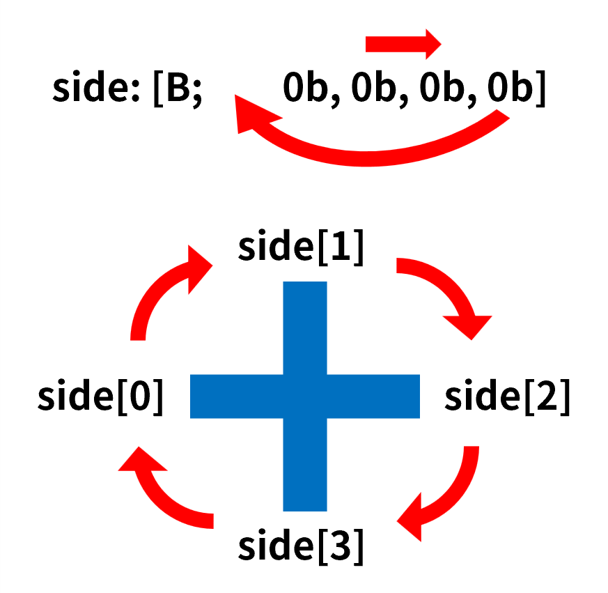
  <p style="color: gray;">图 7：节点的旋转</p>
</div>

因此旋转 1 次所用的函数为

::: details data\pipes\function\upset\1.mcfunction

```mcfunction
data modify storage pipes:grid cache.upset.side prepend from storage pipes:grid cache.upset.side[-1]
data remove storage pipes:grid cache.upset.side[-1]
```
:::

旋转多次可以在函数内重复执行这两条命令。

### 3.4 游戏过程
玩家的操作需要被监听。`pipes.operation` 是一个触发器类型的记分项，当玩家旋转任意的节点时，将玩家在该记分项上的分数设为对应节点的 `index`，从而识别玩家旋转的是哪一个节点，具体的实现方式见第 4 章。监听操作使用的进度如下所示：

::: details data\pipes\advancement\operation.json

```json
{
  "criteria": {
    "rotate": {
      "conditions": {
        "player": [
          {
            "condition": "minecraft:any_of",
            "terms": [
              {
                "condition": "minecraft:entity_scores",
                "entity": "this",
                "scores": {
                  "pipes.operation": {
                    "min": 1
                  }
                }
              },
              {
                "condition": "minecraft:entity_scores",
                "entity": "this",
                "scores": {
                  "pipes.operation": -1
                }
              }
            ]
          }
        ]
      },
      "trigger": "minecraft:tick"
    }
  },
  "rewards": {
    "function": "pipes:operation/trigger/"
  }
}
```
:::

::: details data\pipes\function\operation\trigger\.mcfunction

```mcfunction
#旋转管道
advancement revoke @s only pipes:operation
execute store result storage pipes:grid macro.tile_index int 1.0 run scoreboard players get @s pipes.operation
function pipes:operation/trigger/tile with storage pipes:grid macro
scoreboard players reset @s pipes.operation
scoreboard players enable @s pipes.operation

#解题判定
function pipes:operation/tarjan/

#显示操作后的图
function pipes:display/

#音效
playsound item.book.page_turn player @s
```
:::

以下函数用于旋转节点：

::: details data\pipes\function\operation\trigger\tile.mcfunction

```mcfunction
$data modify storage pipes:grid cache.processing_tile set from storage pipes:grid grid[][{index:$(tile_index)}]
data modify storage pipes:grid cache.processing_tile.side prepend from storage pipes:grid cache.processing_tile.side[-1]
data remove storage pipes:grid cache.processing_tile.side[-1]
$data modify storage pipes:grid grid[][{index:$(tile_index)}] set from storage pipes:grid cache.processing_tile
data remove storage pipes:grid cache.display
```
:::

注意，玩家的每一次操作后都需要运行一次解题判断。根据 2.2 节的 Python 代码，这个部分的函数如下所示：

::: details data\pipes\function\operation\tarjan\.mcfunction

```mcfunction
#重置计数器
scoreboard players reset #flood_tiles_count pipes.var

#重置状态
function pipes:operation/reset/
data modify storage pipes:grid stack set value []
data modify storage pipes:grid DFS set value []
scoreboard players set #dfn_counter pipes.var 0
scoreboard players set #warn_tiles_count pipes.var 0

#进入深度优先搜索
data modify storage pipes:grid DFS append value {}
data modify storage pipes:grid DFS[-1].current_tile set from storage pipes:grid grid[][{source:true}]
execute store result score #max_x pipes.var run data get storage pipes:grid grid
execute store result score #max_y pipes.var run data get storage pipes:grid grid[0]
scoreboard players remove #max_x pipes.var 1
scoreboard players remove #max_y pipes.var 1
scoreboard players reset #parent_x pipes.var
scoreboard players reset #parent_y pipes.var
function pipes:operation/tarjan/dfs/
data remove storage pipes:grid stack
data remove storage pipes:grid DFS

#判断是否全部灌水
scoreboard players operation #total pipes.var = #width pipes.var
scoreboard players operation #total pipes.var *= #height pipes.var
scoreboard players operation #flood_tiles_count pipes.var = #dfn_counter pipes.var
scoreboard players operation #flood_tiles_count pipes.var -= #warn_tiles_count pipes.var
execute unless score #total pipes.var = #flood_tiles_count pipes.var run return run tag @s remove pipes.win
tag @s add pipes.win
```
:::

#### 3.4.1 重置状态
每次解题判断都需要清除上一次判断遗留在网格节点内的 `state`，否则会造成本次判断过程紊乱：

::: details data\pipes\function\operation\reset\.mcfunction

```mcfunction
data modify storage pipes:grid cache.processing_data set from storage pipes:grid grid
function pipes:operation/reset/width
data modify storage pipes:grid grid set from storage pipes:grid cache.processing_data_cache
data remove storage pipes:grid cache.processing_data
data remove storage pipes:grid cache.processing_data_cache
```
:::

::: details data\pipes\function\operation\reset\width.mcfunction

```mcfunction
data modify storage pipes:grid cache.processing_data_cache append value []
function pipes:operation/reset/height
data remove storage pipes:grid cache.processing_data[0]
execute if data storage pipes:grid cache.processing_data[0] run function pipes:operation/reset/width
```
:::

::: details data\pipes\function\operation\reset\height.mcfunction

```mcfunction
data modify storage pipes:grid cache.processing_data_cache[-1] append from storage pipes:grid cache.processing_data[0][0]
data modify storage pipes:grid cache.processing_data_cache[-1][-1].state set value 0b
data remove storage pipes:grid cache.processing_data_cache[-1][-1].dfn
data remove storage pipes:grid cache.processing_data_cache[-1][-1].low
data remove storage pipes:grid cache.processing_data_cache[-1][-1].parent
data remove storage pipes:grid cache.processing_data[0][0]
execute if data storage pipes:grid cache.processing_data[0][0] run function pipes:operation/reset/height
```
:::

#### 3.4.2 Tarjan 主循环
以下是 Tarjan 算法需要递归运行的函数。由于 Minecraft 的记分板和命令存储都是全局变量，因此需要显式栈来配合递归的运行。

::: details data\pipes\function\operation\tarjan\dfs\.mcfunction

```mcfunction
execute store result storage pipes:grid DFS[-1].current_tile.low int 1.0 store result storage pipes:grid DFS[-1].current_tile.dfn int 1.0 run scoreboard players add #dfn_counter pipes.var 1
data modify storage pipes:grid DFS[-1].current_tile.state set value 1b
function pipes:operation/tarjan/dfs/set_current with storage pipes:grid DFS[-1].current_tile
data modify storage pipes:grid stack append from storage pipes:grid DFS[-1].current_tile

#检查邻居
function pipes:operation/tarjan/dfs/neighbour/
execute if data storage pipes:grid DFS[-1].neighbour_tile[0] run function pipes:operation/tarjan/dfs/neighbours
```
:::

::: details data\pipes\function\operation\tarjan\dfs\set_current.mcfunction

```mcfunction
$data modify storage pipes:grid grid[$(x)][$(y)] merge from storage pipes:grid DFS[-1].current_tile
```
:::

其中 `DFS` 是递归函数所需的显式栈，`stack` 是 Tarjan 算法所需的栈。此处还需注意，`DFS` 内存放的是 `grid` 内的实际数据在某一时刻的快照数据，当实际数据发生变动时，`DFS` 内的数据并不会随之变动。因此需要慎用栈内的快照数据，最好使用栈保存的地址，如 `index`、`x`、`y`，用地址访问实际数据。

#### 3.4.3 建立邻居列表
这个部分即为 Python 代码中对应的 `neighbours` 函数，将其转换为如下所示的 mcf 函数：

::: details data\pipes\function\operation\tarjan\dfs\neighbour\.mcfunction

```mcfunction
execute store result score #current_x pipes.var run data get storage pipes:grid DFS[-1].current_tile.x
execute store result score #current_y pipes.var run data get storage pipes:grid DFS[-1].current_tile.y

#左侧邻居
scoreboard players operation #neighbour_x pipes.var = #current_x pipes.var
scoreboard players remove #neighbour_x pipes.var 1
execute store result storage pipes:grid macro.neighbour_x int 1.0 run scoreboard players get #neighbour_x pipes.var
execute store result storage pipes:grid macro.neighbour_y int 1.0 run scoreboard players get #current_y pipes.var
execute if score #neighbour_x pipes.var matches 0.. run function pipes:operation/tarjan/dfs/neighbour/left with storage pipes:grid macro

#上侧邻居
scoreboard players operation #neighbour_y pipes.var = #current_y pipes.var
scoreboard players remove #neighbour_y pipes.var 1
execute store result storage pipes:grid macro.neighbour_x int 1.0 run scoreboard players get #current_x pipes.var
execute store result storage pipes:grid macro.neighbour_y int 1.0 run scoreboard players get #neighbour_y pipes.var
execute if score #neighbour_y pipes.var matches 0.. run function pipes:operation/tarjan/dfs/neighbour/up with storage pipes:grid macro

#右侧邻居
scoreboard players operation #neighbour_x pipes.var = #current_x pipes.var
scoreboard players add #neighbour_x pipes.var 1
execute store result storage pipes:grid macro.neighbour_x int 1.0 run scoreboard players get #neighbour_x pipes.var
execute store result storage pipes:grid macro.neighbour_y int 1.0 run scoreboard players get #current_y pipes.var
execute if score #neighbour_x pipes.var <= #max_x pipes.var run function pipes:operation/tarjan/dfs/neighbour/right with storage pipes:grid macro

#下侧邻居
scoreboard players operation #neighbour_y pipes.var = #current_y pipes.var
scoreboard players add #neighbour_y pipes.var 1
execute store result storage pipes:grid macro.neighbour_x int 1.0 run scoreboard players get #current_x pipes.var
execute store result storage pipes:grid macro.neighbour_y int 1.0 run scoreboard players get #neighbour_y pipes.var
execute if score #neighbour_y pipes.var <= #max_y pipes.var run function pipes:operation/tarjan/dfs/neighbour/down with storage pipes:grid macro
```
:::

以左侧邻居为例：

::: details data\pipes\function\operation\tarjan\dfs\neighbour\left.mcfunction

```mcfunction
execute store result score #connect pipes.var run data get storage pipes:grid DFS[-1].current_tile.side[0]
execute unless score #connect pipes.var matches 1 run return fail
$execute store result score #connect pipes.var run data get storage pipes:grid grid[$(neighbour_x)][$(neighbour_y)].side[2]
execute unless score #connect pipes.var matches 1 run return fail

$data modify storage pipes:grid DFS[-1].neighbour_tile append from storage pipes:grid grid[$(neighbour_x)][$(neighbour_y)]
```
:::

判断邻居节点是否与当前节点连接即是判断当前节点 `side` 的第 0 个元素和邻居节点 `side` 的第 2 个元素是否为 `1b`。其他方向的写法以此类推。

#### 3.4.4 对邻居节点的遍历
在建立邻居节点列表后，遍历列表内的邻居节点：

::: details data\pipes\function\operation\tarjan\dfs\neighbours.mcfunction

```mcfunction
function pipes:operation/tarjan/dfs/check_neighbours
data remove storage pipes:grid DFS[-1].neighbour_tile[0]
execute if data storage pipes:grid DFS[-1].neighbour_tile[0] run function pipes:operation/tarjan/dfs/neighbours
```
:::

::: details data\pipes\function\operation\tarjan\dfs\check_neighbours.mcfunction

```mcfunction
execute store result score #parent_tile_index pipes.var run data get storage pipes:grid DFS[-1].current_tile.parent
function pipes:operation/tarjan/dfs/get_neighbour with storage pipes:grid DFS[-1].neighbour_tile[0]
execute store result score #neighbour_tile_index pipes.var run data get storage pipes:grid DFS[-1].neighbour_tile[0].index

#邻居节点是否不是当前节点的父节点
execute if score #parent_tile_index pipes.var = #neighbour_tile_index pipes.var run return fail

#判断邻居节点的状态
#无
execute store result score #neighbour_tile_state pipes.var run data get storage pipes:grid DFS[-1].neighbour_tile[0].state
execute if score #neighbour_tile_state pipes.var matches 0 run function pipes:operation/tarjan/dfs/none/

#灌水
execute store result score #neighbour_tile_state pipes.var run data get storage pipes:grid DFS[-1].neighbour_tile[0].state
execute if score #neighbour_tile_state pipes.var matches 1 run function pipes:operation/tarjan/dfs/flood
```
:::

::: details data\pipes\function\operation\tarjan\dfs\get_neighbour.mcfunction

```mcfunction
$data modify storage pipes:grid DFS[-1].neighbour_tile[0] set from storage pipes:grid grid[][{index:$(index)}]
```
:::

#### 3.4.5 邻居节点的状态为未访问时执行的函数
当邻居节点的状态为未访问时，需要进行 DFS 递归，将邻居节点设为当前节点，从而深度优先地将树搜索下去。当子层递归结束返回该层（即子树全部遍历完毕返回该节点）时，更新当前节点的 `low`，并在 $\text{low}(n) \ge \text{dfn}(c)$ 时将栈内的环路全部弹出。

::: details data\pipes\function\operation\tarjan\dfs\none\.mcfunction

```mcfunction
#DFS递归
function pipes:operation/tarjan/dfs/none/dfs with storage pipes:grid DFS[-1].neighbour_tile[0]

#当前节点和邻居节点的low取较小值
execute store result score #current_tile_low pipes.var run data get storage pipes:grid DFS[-1].current_tile.low
function pipes:operation/tarjan/dfs/none/get_neighbour_low with storage pipes:grid DFS[-1].neighbour_tile[0]
scoreboard players operation #current_tile_low pipes.var < #neighbour_tile_low pipes.var
execute store result storage pipes:grid DFS[-1].current_tile.low int 1.0 run scoreboard players get #current_tile_low pipes.var
function pipes:operation/tarjan/dfs/set_current with storage pipes:grid DFS[-1].current_tile

#如果邻居节点的low大于等于当前节点的dfn
execute store result score #current_tile_dfn pipes.var run data get storage pipes:grid DFS[-1].current_tile.dfn
execute if score #neighbour_tile_low pipes.var >= #current_tile_dfn pipes.var run function pipes:operation/tarjan/dfs/neighbour_low
```
:::

::: details data\pipes\function\operation\tarjan\dfs\none\dfs.mcfunction

```mcfunction
execute store result score #current_tile_index pipes.var run data get storage pipes:grid DFS[-1].current_tile.index
data modify storage pipes:grid DFS append value {}
$data modify storage pipes:grid DFS[-1].current_tile set from storage pipes:grid grid[$(x)][$(y)]
execute store result storage pipes:grid DFS[-1].current_tile.parent int 1.0 run scoreboard players get #current_tile_index pipes.var
function pipes:operation/tarjan/dfs/
data remove storage pipes:grid DFS[-1]
```
:::

::: details data\pipes\function\operation\tarjan\dfs\none\get_neighbour_low.mcfunction

```mcfunction
$execute store result score #neighbour_tile_low pipes.var run data get storage pipes:grid grid[][{index:$(index)}].low
```
:::

::: details data\pipes\function\operation\tarjan\dfs\neighbour_low.mcfunction

```mcfunction
data modify storage pipes:grid pop_tiles set value []
function pipes:operation/tarjan/dfs/none/pop_tiles
data modify storage pipes:grid pop_tiles append from storage pipes:grid DFS[-1].current_tile
scoreboard players reset #length_of_pop_tiles pipes.var
execute store result score #length_of_pop_tiles pipes.var run data get storage pipes:grid pop_tiles
execute if score #length_of_pop_tiles pipes.var matches 3.. run function pipes:operation/tarjan/dfs/none/warn/
```
:::

::: details data\pipes\function\operation\tarjan\dfs\none\pop_tiles.mcfunction

```mcfunction
data modify storage pipes:grid pop_tiles append from storage pipes:grid stack[-1]
data remove storage pipes:grid stack[-1]
execute store result score #pop_tile_index pipes.var run data get storage pipes:grid pop_tiles[-1].index
execute store result score #neighbour_tile_index pipes.var run data get storage pipes:grid DFS[-1].neighbour_tile[0].index
execute unless score #pop_tile_index pipes.var = #neighbour_tile_index pipes.var run function pipes:operation/tarjan/dfs/none/pop_tiles
```
:::

::: details data\pipes\function\operation\tarjan\dfs\none\warn\.mcfunction

```mcfunction
scoreboard players add #warn_tiles_count pipes.var 1
function pipes:operation/tarjan/dfs/none/warn/macro with storage pipes:grid pop_tiles[-1]
data remove storage pipes:grid pop_tiles[-1]
execute if data storage pipes:grid pop_tiles[0] run function pipes:operation/tarjan/dfs/none/warn/
```
:::

::: details data\pipes\function\operation\tarjan\dfs\none\warn\macro.mcfunction

```mcfunction
$data modify storage pipes:grid grid[$(x)][$(y)].state set value 2b
```
:::

#### 3.4.6 邻居节点的状态为已灌水时执行的函数
当邻居节点的状态为已灌水时，需要更新当前节点的 `low`，使得 $\text{low}(c) = \text{dfn}(n)$，为底层递归的环路弹栈做准备。

::: details data\pipes\function\operation\tarjan\dfs\flood.mcfunction

```mcfunction
execute store result score #current_tile_low pipes.var run data get storage pipes:grid DFS[-1].current_tile.low
execute store result score #neighbour_tile_dfn pipes.var run data get storage pipes:grid DFS[-1].neighbour_tile[0].dfn
scoreboard players operation #current_tile_low pipes.var < #neighbour_tile_dfn pipes.var
execute store result storage pipes:grid DFS[-1].current_tile.low int 1.0 run scoreboard players get #current_tile_low pipes.var
function pipes:operation/tarjan/dfs/set_current with storage pipes:grid DFS[-1].current_tile
```
:::

## 4. 可视化
到目前为止，游戏核心的数据已经基本编写完毕，现在需要将这些数据可视化。目前，对话框已用于很多小游戏的制作，对对话框 UI 的研究也已经成熟，故本项目将使用对话框显示接水管小游戏。一般而言，UI 的制作可用对话框原生的按钮，也可在 `body` 中用带点击事件的字体拼接，本项目选择后者。

每一种水管都被赋予了一个码位，并显示为特定位图字体，由于位图字体右侧的透明部分会被剔除，为了使网格整体对齐，所有字符对应的位图都被设计为统一的 $16 \times 16$ 大小。同时，由于水管被划分为了普通、灌水、警告这几种状态，另外还有作为水源的水管，因此需要设计多套不同的字体。当水管的状态发生变化时，修改字符使用的字体就能改变水管的外观。下表罗列了所有种类水管对应的码位以及不同状态水管使用的字体。

**表 1：水管字符使用的字体，其命名空间均为 pipes**
|  | 对应字符 | 普通水管 | 灌水的水管 | 产生警告的水管 | 水源 |
| --- | --- | --- | --- | --- | --- |
| 字体 | - | `tube` | `tube_flooded` | `tube_warning` | `tube_source` |
| 端点（左） | a |  |  | - |  |
| 端点（上） | b |  |  | - |  |
| 端点（右） | c |  |  | - |  |
| 端点（下） | d |  |  | - |  |
| 直管 ━ | e | |  |  |  |
| 直管 ┃ | f | |  |  |  |
| L 型弯管 ┛ | g |  |  |  |  |
| L 型弯管 ┗ | h |  |  |  |  |
| L 型弯管 ┏ | i |  |  |  |  |
| L 型弯管 ┓ | j |  |  |  |  |
| T 型管 ┫ | k |  |  |  |  |
| T 型管 ┻ | l |  |  |  |  |
| T 型管 ┣ | m |  |  |  |  |
| T 型管 ┳ | n |  |  |  |  |

以字体 `pipes:tube` 为例，其配置文件大致如下所示：

::: details assets\pipes\font\tube.json

```json
{
  "providers": [
    {
      "type": "bitmap",
      "file": "pipes:font/none/source/1.png",
      "height": 19,
      "ascent": 13,
      "chars": [
        "a"
      ]
    },
    {
      "type": "bitmap",
      "file": "pipes:font/none/source/2.png",
      "height": 19,
      "ascent": 13,
      "chars": [
        "b"
      ]
    },
    {
      "type": "bitmap",
      "file": "pipes:font/none/source/3.png",
      "height": 19,
      "ascent": 13,
      "chars": [
        "c"
      ]
    },
    {
      "type": "bitmap",
      "file": "pipes:font/none/source/4.png",
      "height": 19,
      "ascent": 13,
      "chars": [
        "d"
      ]
    },
    {
      "type": "bitmap",
      "file": "pipes:font/none/straight/1.png",
      "height": 19,
      "ascent": 13,
      "chars": [
        "e"
      ]
    },
    {
      "type": "bitmap",
      "file": "pipes:font/none/straight/2.png",
      "height": 19,
      "ascent": 13,
      "chars": [
        "f"
      ]
    },
    {
      "type": "bitmap",
      "file": "pipes:font/none/turn/12.png",
      "height": 19,
      "ascent": 13,
      "chars": [
        "g"
      ]
    },
    {
      "type": "bitmap",
      "file": "pipes:font/none/turn/23.png",
      "height": 19,
      "ascent": 13,
      "chars": [
        "h"
      ]
    },
    {
      "type": "bitmap",
      "file": "pipes:font/none/turn/34.png",
      "height": 19,
      "ascent": 13,
      "chars": [
        "i"
      ]
    },
    {
      "type": "bitmap",
      "file": "pipes:font/none/turn/41.png",
      "height": 19,
      "ascent": 13,
      "chars": [
        "j"
      ]
    },
    {
      "type": "bitmap",
      "file": "pipes:font/none/trible/1.png",
      "height": 19,
      "ascent": 13,
      "chars": [
        "k"
      ]
    },
    {
      "type": "bitmap",
      "file": "pipes:font/none/trible/2.png",
      "height": 19,
      "ascent": 13,
      "chars": [
        "l"
      ]
    },
    {
      "type": "bitmap",
      "file": "pipes:font/none/trible/3.png",
      "height": 19,
      "ascent": 13,
      "chars": [
        "m"
      ]
    },
    {
      "type": "bitmap",
      "file": "pipes:font/none/trible/4.png",
      "height": 19,
      "ascent": 13,
      "chars": [
        "n"
      ]
    },
    {
      "type": "bitmap",
      "file": "pipes:font/empty.png",
      "height": 19,
      "ascent": 13,
      "chars": [
        "o"
      ]
    }
  ]
}
```
:::

同一行的节点会按顺序从左到右依次排列，随后连续添加 2 个换行符，继续排列下一行的节点。行内相邻的字符被添加了宽度为 -2 的空格以保证网格整体呈现正方形。同时，每个字符都应该是一个可以点击的文本组件，以供玩家旋转具体的管道。每个点击事件都应配备相应节点的标识，以供监听系统识别玩家旋转的是哪一个节点，如：

::: details data\pipes\function\display\trigger.mcfunction

```mcfunction
$data modify storage pipes:grid cache.display.click_event.command set value "trigger pipes.operation set $(tile_index)"
```
:::

<div style="text-align:center">
  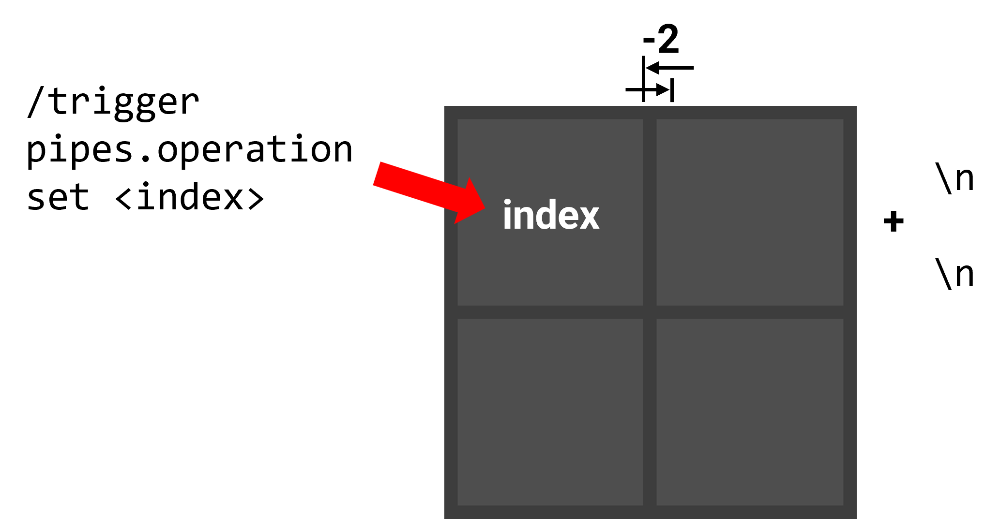
  <p style="color: gray;">图 8：可视化排布方案</p>
</div>

负空格字体使用如下的定义：
::: details assets\pipes\font\tube_space.json

```json
{
  "providers": [
    {
      "type": "space",
      "advances": {
        "%": -2
      }
    }
  ]
}
```
:::

以下函数作为可视化的入口：

::: details data\pipes\function\display\.mcfunction（部分）

```mcfunction
data remove storage pipes:grid display
data modify storage pipes:grid cache.processing_data set from storage pipes:grid grid
data modify storage pipes:grid display set value ["\n\n"]
data modify storage pipes:grid cache.processing_data_cache set value []
function pipes:display/height
function pipes:display/show with storage pipes:grid
data remove storage pipes:grid cache.processing_data
```
:::

注意到，盘面数据所在的 `grid` 是一个二维列表，根据图 6，它的次级列表实际上存储的是一整列的节点而非一整行的节点，即所谓“列主序”。但是显示的部分显然需要“行主序”，因此只能遍历 `grid`，依次将其中每个列表的第 0 位元素提取出来，然后依次提取每个列表的第 1 位，以此类推。
<div style="text-align:center">
  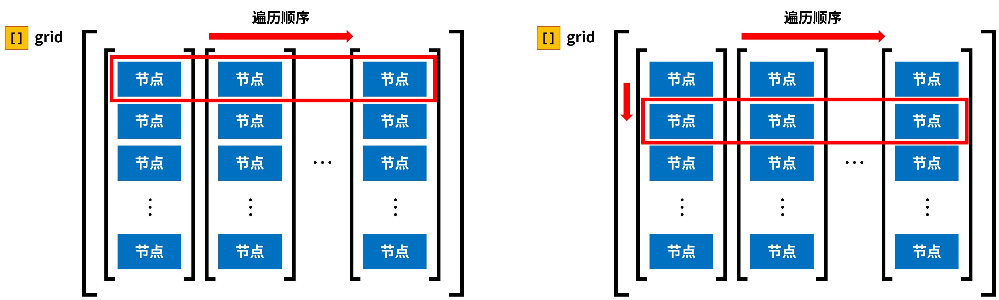
  <p style="color: gray;">图 9：可视化过程的遍历顺序</p>
</div>

这个过程使用以下的函数：

::: details data\pipes\function\display\height.mcfunction

```mcfunction
function pipes:display/width
data modify storage pipes:grid display append value "\n\n"
data modify storage pipes:grid cache.processing_data set from storage pipes:grid cache.processing_data_cache
data remove storage pipes:grid cache.processing_data_cache
execute if data storage pipes:grid cache.processing_data[0][0] run function pipes:display/height
```
:::

::: details data\pipes\function\display\width.mcfunction

```mcfunction
data modify storage pipes:grid cache.processing_tile set from storage pipes:grid cache.processing_data[0][0]
function pipes:display/shapes
data modify storage pipes:grid macro.tile_index set from storage pipes:grid cache.processing_data[0][0].index
function pipes:display/trigger with storage pipes:grid macro
data modify storage pipes:grid display append from storage pipes:grid cache.display
execute if data storage pipes:grid cache.processing_tile{state:1b} run data modify storage pipes:grid display[-1].font set value "pipes:tube_flooded"
execute if data storage pipes:grid cache.processing_tile{state:2b} run data modify storage pipes:grid display[-1].font set value "pipes:tube_warning"
execute if data storage pipes:grid cache.processing_tile.source run data modify storage pipes:grid display[-1].font set value "pipes:tube_source"
data modify storage pipes:grid display append value {font:"pipes:tube_space",text:"%"}
data remove storage pipes:grid cache.processing_data[0][0]
data modify storage pipes:grid cache.processing_data_cache append from storage pipes:grid cache.processing_data[0]
data remove storage pipes:grid cache.processing_data[0]
execute if data storage pipes:grid cache.processing_data[0] run function pipes:display/width
```
:::

::: details data\pipes\function\display\shapes.mcfunction

```mcfunction
execute if data storage pipes:grid cache.processing_tile{side:[B;1b,0b,0b,0b]} run return run data modify storage pipes:grid cache.display set value {click_event:{action:"run_command",command:"trigger pipes.operation set -1"},font:"pipes:tube",text:"a"}
execute if data storage pipes:grid cache.processing_tile{side:[B;0b,1b,0b,0b]} run return run data modify storage pipes:grid cache.display set value {click_event:{action:"run_command",command:"trigger pipes.operation set -1"},font:"pipes:tube",text:"b"}
execute if data storage pipes:grid cache.processing_tile{side:[B;0b,0b,1b,0b]} run return run data modify storage pipes:grid cache.display set value {click_event:{action:"run_command",command:"trigger pipes.operation set -1"},font:"pipes:tube",text:"c"}
execute if data storage pipes:grid cache.processing_tile{side:[B;0b,0b,0b,1b]} run return run data modify storage pipes:grid cache.display set value {click_event:{action:"run_command",command:"trigger pipes.operation set -1"},font:"pipes:tube",text:"d"}
execute if data storage pipes:grid cache.processing_tile{side:[B;1b,0b,1b,0b]} run return run data modify storage pipes:grid cache.display set value {click_event:{action:"run_command",command:"trigger pipes.operation set -1"},font:"pipes:tube",text:"e"}
execute if data storage pipes:grid cache.processing_tile{side:[B;0b,1b,0b,1b]} run return run data modify storage pipes:grid cache.display set value {click_event:{action:"run_command",command:"trigger pipes.operation set -1"},font:"pipes:tube",text:"f"}
execute if data storage pipes:grid cache.processing_tile{side:[B;1b,1b,0b,0b]} run return run data modify storage pipes:grid cache.display set value {click_event:{action:"run_command",command:"trigger pipes.operation set -1"},font:"pipes:tube",text:"g"}
execute if data storage pipes:grid cache.processing_tile{side:[B;0b,1b,1b,0b]} run return run data modify storage pipes:grid cache.display set value {click_event:{action:"run_command",command:"trigger pipes.operation set -1"},font:"pipes:tube",text:"h"}
execute if data storage pipes:grid cache.processing_tile{side:[B;0b,0b,1b,1b]} run return run data modify storage pipes:grid cache.display set value {click_event:{action:"run_command",command:"trigger pipes.operation set -1"},font:"pipes:tube",text:"i"}
execute if data storage pipes:grid cache.processing_tile{side:[B;1b,0b,0b,1b]} run return run data modify storage pipes:grid cache.display set value {click_event:{action:"run_command",command:"trigger pipes.operation set -1"},font:"pipes:tube",text:"j"}
execute if data storage pipes:grid cache.processing_tile{side:[B;1b,1b,0b,1b]} run return run data modify storage pipes:grid cache.display set value {click_event:{action:"run_command",command:"trigger pipes.operation set -1"},font:"pipes:tube",text:"k"}
execute if data storage pipes:grid cache.processing_tile{side:[B;1b,1b,1b,0b]} run return run data modify storage pipes:grid cache.display set value {click_event:{action:"run_command",command:"trigger pipes.operation set -1"},font:"pipes:tube",text:"l"}
execute if data storage pipes:grid cache.processing_tile{side:[B;0b,1b,1b,1b]} run return run data modify storage pipes:grid cache.display set value {click_event:{action:"run_command",command:"trigger pipes.operation set -1"},font:"pipes:tube",text:"m"}
execute if data storage pipes:grid cache.processing_tile{side:[B;1b,0b,1b,1b]} run return run data modify storage pipes:grid cache.display set value {click_event:{action:"run_command",command:"trigger pipes.operation set -1"},font:"pipes:tube",text:"n"}
data modify storage pipes:grid cache.display set value {font:"pipes:tube",text:"o"}
```
:::

最后直接显示对话框：

::: details data\pipes\function\display\show.mcfunction

```mcfunction
$dialog show @s {after_action:"none",body:{contents:$(display),type:"minecraft:plain_message",width:500},pause:false,title:"",type:"notice"}
```
:::

显示的结果如下图所示。至此，接水管小游戏已制作完毕。
<div style="text-align:center">
  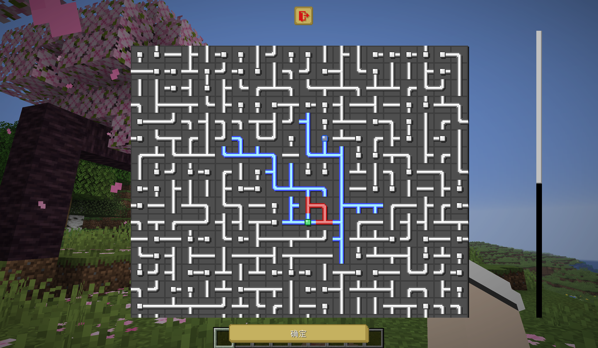
  <p style="color: gray;">图 10：最终成果</p>
</div>

## 5. 讨论
本项目基于完全的数据驱动，即只使用记分板和命令存储处理所有数据，因此在一些地方会不可避免地用到函数宏，这对于性能而言是不可小觑的影响。观察整个项目，可以发现绝大多数的函数宏都被用在了列表元素的索引，尤其是 `grid` 内节点的选定，而这又通常伴随整个列表甚至整个网格的遍历。对于 $5 \times 5$ 这样的小型接水管而言性能尚可，但随着盘面越来越大，命令链长度和消耗时间也会随之增加。

### 5.1 命令链长度
由于图是随机生成的，每次生成时分支数量、分支长短都不一致，因此完成一次生成以及进行一次解题判定所运行的命令链长度并不一致。例如，将游戏规则 `max_command_sequence_length` 设为 5000 时，尝试生成 $5 \times 5$ 大小的图，在 1000 次中仅成功生成了 393 次，这意味着另外的 607 次因为命令链过长而中途被截断。

在正常的游戏流程中，这种中途截断的现象显然是不可接受的。因此需要探讨在特定大小的网格下，`max_command_sequence_length` 到底设为多少才能保证 100% 的成功生成率。此处的生成接水管地图整个过程包括初始化网格、生成地图、打乱管道、初次尝试解题判定以及可视化这些操作。以 $10 \times 10$ 大小为例，对每个不同的 `max_command_sequence_length` 尝试生成 1000 次，得到的结果如下图所示：
<div style="text-align:center">
  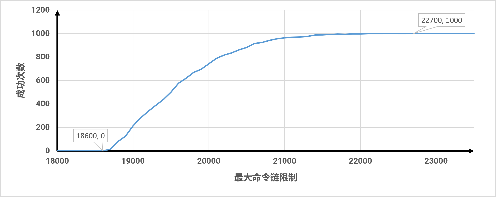
  <p style="color: gray;">图 11：10x10 网格 1000 次尝试成功生成次数曲线图</p>
</div>

数据表明，算法的计算开销并非呈现宽幅的无序毛刺分布，而是表现出极强的局部凝聚性与概率长尾性。在 18700 至 21000 的区间内，成功率发生了爆发式跃迁。而 21100 至 22600 出现了成功率停滞平台期，本质上是算法在防止十字型节点生成时高频触发空转剪枝所带来的概率长尾性。最终，算法在 22700 处实现了千次采样的绝对闭合收敛。由于概率长尾性的存在，特定大小网格成功生成图所需的命令链长度限制需要往上提升。本研究对不同边长（$N$）正方形网格做了最大命令链绝对收敛阈值测定，`max_command_sequence_length` 以千为步进长度，得到的结果如下表所示：

**表 2：各网格尺度下算法命令链消耗的临界阈值统计表**
| 网格边长（$N$） | 节点总数（$N^2$） | 绝对收敛阈值 |
| --- | --- | --- |
| 4 | 16 | 5000 |
| 5 | 25 | 7000 |
| 6 | 36 | 10000 |
| 7 | 49 | 12000 |
| 8 | 64 | 15000 |
| 9 | 81 | 19000 |
| 10 | 100 | 23000 |
| 11 | 121 | 28000 |
| 12 | 144 | 32000 |
| 13 | 169 | 36000 |
| 14 | 196 | 42000 |
| 15 | 225 | 48000 |
| 16 | 256 | 55000 |
| 17 | 289 | 61000 |
| 18 | 324 | 67000 |
| 19 | 361 | 75000 |
| 20 | 400 | 82000 |

**第 3 列的数据即为不同大小网格所需 `max_command_sequence_length` 的参考值，在实际运行游戏的过程中可随网格大小调整之。** 根据第 3 列的数据，网格从 $4 \times 4$ 扩大到 $20 \times 20$，节点总数扩大至原先的 25 倍，但是命令链长度只扩大为原先的约 16.4 倍。这表明算法没有发生任何严重的嵌套循环或逻辑失控，架构设计在宏观尺度上是比较健康的，在最坏工况下的时间复杂度上界为 $O(N^2)$。纵向对比单个节点命令分摊率可知，在 $4\times4$ 尺度下，平均单节点计算密度为 313 条 / 格，而在 $20\times20$ 尺度下，该指标收敛至 205 条 / 格。这一算力边际递减效应表明，算法的全局初始化冗余开销随拓扑规模的扩大而快速被稀释，循环体的执行效率保持了高度的扁平，展现出算法架构对于长线巨型关卡生成的极佳适配度。

### 5.2 消耗时间
本研究还测试了不同尺寸网格生成接水管时所消耗的时间，所用设备 CPU 为 i7-14650HX，GPU 为 GeForce RTX 4060。研究仅测试了边长为 5、10、15、20 的正方形网格，每组测试 1000 次。测试使用 Minecraft 原生的秒表，仅作粗略测试使用，具体方法如下：
```mcfunction
stopwatch restart pipes:debug
execute store result score #time1 pipes.var run stopwatch query pipes:debug 1000
#程序
execute store result score #time pipes.var run stopwatch query pipes:debug 1000
scoreboard players operation #time pipes.var -= #time1 pipes.var
```

测得的数据绘制成如下图所示的箱线图，单位为毫秒：
<div style="text-align:center">
  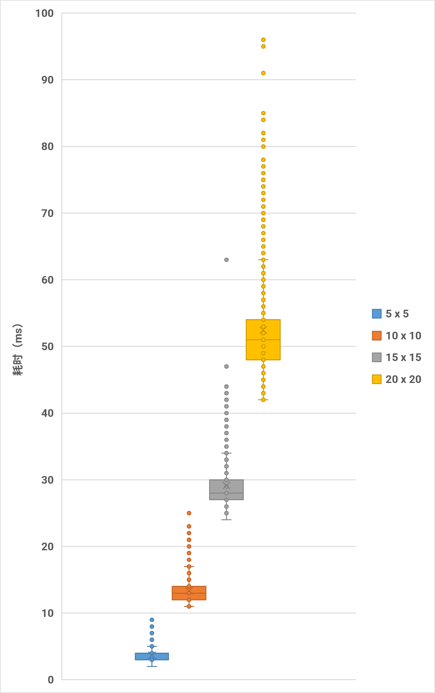
  <p style="color: gray;">图 12：不同尺寸网格生成接水管耗时箱线图（单位：ms）</p>
</div>

**表 3：不同尺寸网格生成接水管耗时统计表**
| 边长 | 5 | 10 | 15 | 20 |
| --- | --- | --- | --- | --- |
| 平均值（ms） | 3.657 | 13.366 | 29.147 | 52.45 |
| 中位数（ms） | 4 | 13 | 28 | 51 |

由于 Minecraft 默认的游戏刻速率为 20，故前三者都能很好地在 1 tick 内完成。此外，平均单节点的计算耗时在 0.130 ~ 0.146 毫秒 / 格之间，现实硬件耗时的膨胀倍数与面积的膨胀倍数产生同步。

此外，针对特定大小网格在游戏过程中解题判定的耗时，本研究取了 $10 \times 10$ 大小的网格，随机进行 5 局游戏，这 5 局游戏的操作步数各不相同。测试方式与上述相同，测试对象是函数 `pipes:operation/trigger/`。所得结果绘制成如下所示的箱线图：
<div style="text-align:center">
  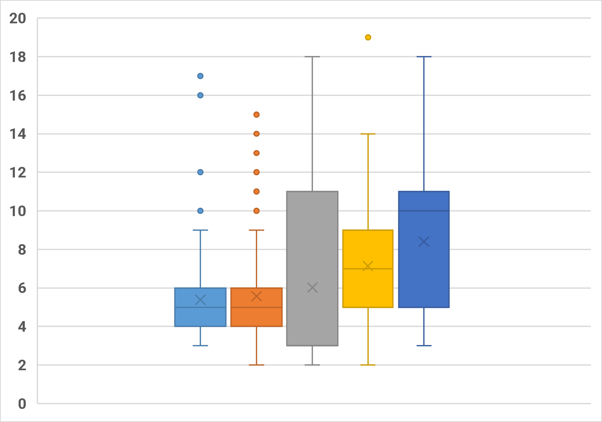
  <p style="color: gray;">图 13：10 x 10 网格接水管解题判定耗时箱线图（单位：ms）</p>
</div>

平均每次操作引发的解题判定耗时约为 6.64 毫秒，小于 $10 \times 10$ 接水管本身生成的耗时。

## 6. 总结
本项目在 Minecraft 原版游戏环境中，成功设计并落地了一套接水管益智游戏生成与运行控制系统，其中前者基于 Prim 算法的随机树生成，后者基于 Tarjan 算法的环路搜索。

在核心模块的编写过程中，本项目坚持了“纯数据驱动”的架构设计，将网格拓扑、边集状态全面解耦存储于游戏内记分板与命令存储器中。在预先编写对应伪代码及 Python 代码的情况下，成功用原版命令还原了随机 Prim 算法和 Tarjan 算法，将最坏工况下的算法时间复杂度严格控制在 $O(N^2)$ 的多项式级别。

尽管本项目通过纯数据驱动确保了系统极佳的跨版本迁移性与逻辑纯净度，但面对 $20\times20$ 及以上的尺寸时，数据表明系统依然存在不可忽视的性能瓶颈。由于列表天然缺乏 $O(1)$ 的常数级随机寻址能力，系统在选定节点时高频依赖函数宏。鉴于此，未来的研究可以基于其他的随机迷宫生成算法或是 Minecraft 特有的实体化算法。

## 参考文献
[1] Meili Hegeman. Generating Pipes puzzles using maze-generating algorithms[D]. Leiden University, 2022.

[2] [七柏, 徐木弦. 命令存储进阶：使用栈管理函数上下文[J/OL]. Feature, 2026, 4(2).](https://cr-019.github.io/datapack-index/feature/archive/202604/4/content.html)

[3] [CR_019. 使用对话框制作2D小游戏[J/OL]. Feature, 2025, 6(1).](https://cr-019.github.io/datapack-index/feature/archive/202506/5/content.html)

[4] [徐木弦. 基于按位操作及多进制编码的对话框多输入控件设计[J/OL]. Feature, 2025, 11(1).](https://cr-019.github.io/datapack-index/feature/archive/202511/4/content.html)

[5] [CR_019. 如何使用最新最热的MC特性制作带劲的国际象棋（上）[J/OL]. Feature, 2026, 1(2).](https://cr-019.github.io/datapack-index/feature/archive/202601/d/content.html)

[6] [CR_019. 如何使用最新最热的MC特性制作原版象棋（下）[J/OL]. Feature, 2026, 2(2).](https://cr-019.github.io/datapack-index/feature/archive/202602/4/content.html)

[7] [Dahesor. 数据包优化原则以及分析方式简述[J/OL]. Feature, 2025, 4(1).](https://cr-019.github.io/datapack-index/feature/archive/202504/3/content.html)

[8] [皮革剑. 从 /stopwatch 开始: 与时间检测有关的一些胡思乱想[J/OL]. Feature, 2025, 10(1).](https://cr-019.github.io/datapack-index/feature/archive/202510/5/content.html)