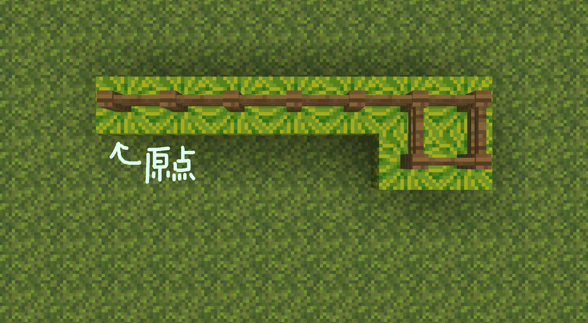
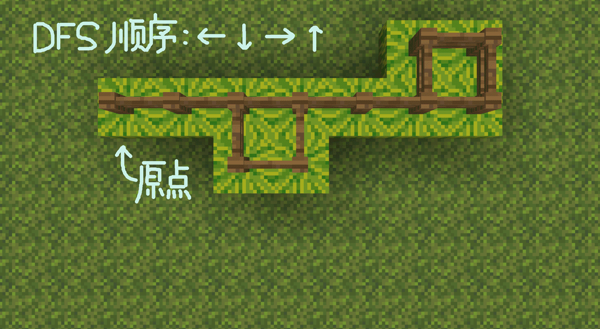
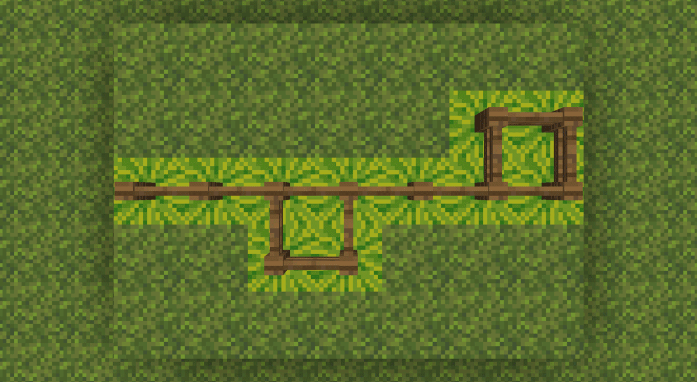
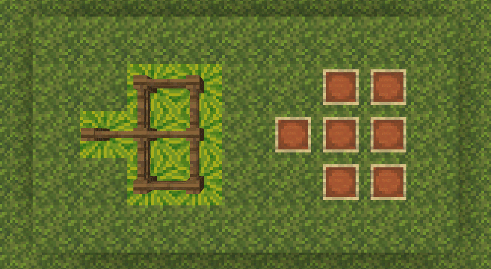
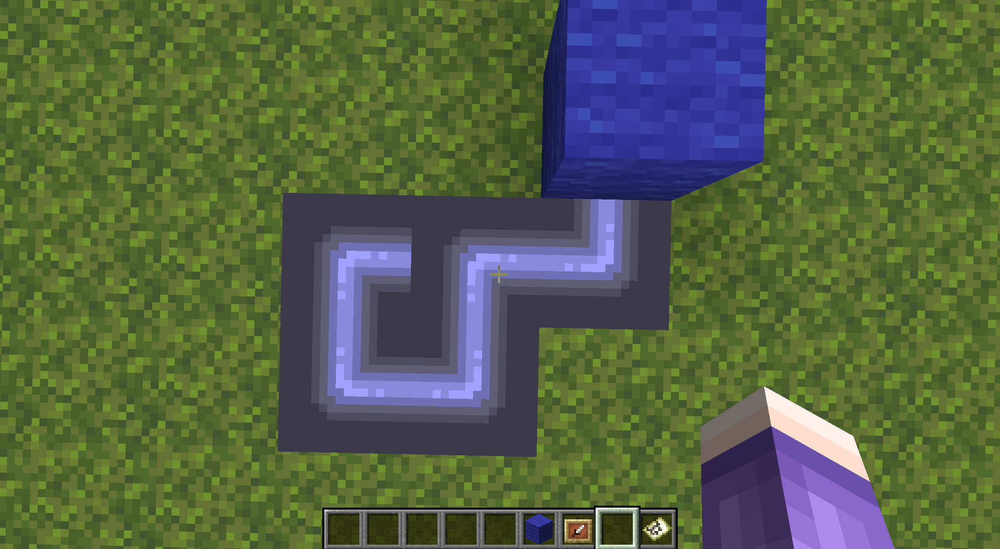
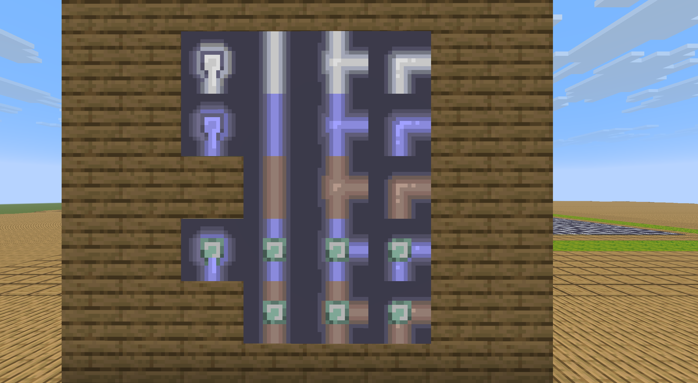

<FeaturedHead
    title='接水管地图生成与检验的实现（实体化方案）'
    authorName='皮革剑'
    cover = '../_assets/1.png'
/>

:::tip 作者注
本文提供了同样基于Prim和DFS算法的接水管游戏地图生成与检验的另一种方案。  
书接同期 洪色羽毛 与 徐木弦 在本月刊的[联合稿](/feature/archive/202606/0/content.md)（以下简称前篇）。  
洪色羽毛 提供的原Prim实现思路与本人相差较大，但经过 徐木弦 的修改后，两边的算法已经大差不差。故本文不会再重新介绍问题及算法，有需要的读者请翻阅前篇。

为方便读者对应，本文的章节编号也将与前篇对齐，可将其视作前篇的某种扩展。
:::


实体化方案较数据化方案在生成和处理上可能稍差一些（由于需要大量与方块和实体进行交互，不过其实差的也没多少，30x30范围250~300ms也生成得出来），
但胜在结构清晰简洁，几乎与算法文字描述完全对应，无需反复使用宏，方便初学者快速制作和理解。

同时，实体化方案也方便在相同的命令链长度下生成更多的内容。
本文使用的方案在默认命令链长度下最大可以生成33x33的地图（包括打乱与初始检验染色）。
## 2. 思路与流程
### 2.2b 实体化方案中DFS检验的实现
由于实体化方案中所有数据在某个实际的方块区域中运行，其DFS过程可以不涉及建立实际的栈或另行召唤实体。
本方案中，DFS直接使用函数栈完成，参与的实体全部是地图展示框，不另行制作人工栈。  
因此，与前篇不同的是，本方案无法进行主动回溯，只能依赖函数栈本身的回溯工作。

本方案使用如下节点类型：
- `dry`：该节点未被访问，对应方块为西瓜。
- `wet`：该节点已灌水，对应方块为南瓜灯（其同时起到 `parent` 标识的作用，在非环路中其指向其直接水源，后面会用到。）
    - `source`：该节点为水源，对应方块为菌光体。（与南瓜灯共有标签 `pipes:wet`。）
- `visiting`：DFS当前正在走的路径，对应方块为黄色蛙明灯 `ochre_froglight`。
    - `conflict_n`：一个位置出现冲突的次数，即在已经经过一次该位置后再试图访问该位置的次数。该项不以方块记录而是记录在展示框实体的 `pipes_conflict` 计分板中，即其可与前几项同时存在。
    - `ring_n`：该节点在 `n` 个环上。同上，记录在展示框实体的 `pipes_ring` 计分板中。

可以注意到的是，相比前篇，本方案在DFS流程中增加了“正在走的路径”状态。这直接使得前篇图5的环路类型1不会出现（可以想想是为什么），冲突只会由“又一次走到了已经走过的地方”一种方式产生。  
因此，我们在被动回溯的过程中用计数方式处理环路标注。

我们提供了以下例子以充分说明这样的方案是如何发展出来的。  
在这些例子中，原 `ring` （相当于现 `ring_1`）状态以绿色蛙明灯显示，原 `conflict` （相当于现 `conflict_1`）状态以紫色蛙明灯显示，但这两者与 `visiting` 状态事实上是互相独立的。
#### 2.2b.1 从一个环开始
假设DFS过程中，其中一个支路走到了已经走过的地方，形成一个环。
简化一点，整个图就是一个 `q` 形。如何把环标出来呢？

我们可以发现，如果遇到已经走过的区域时将其标注为 `conflict` 状态，则环内与环外的区域就由此分隔开。

DFS递归的回溯过程与搜索时的路径是反过来的，因此回溯时遇到 `conflict` 状态前经过的地方就是环路，遇到之后经过的地方（也就是搜索到环之前走过的区域）就不是环的一部分。

由于实体化方案不像前篇那样记录 `parent` 链（至少全局DFS部分是不使用这部分数据的），我们无法采用主动回溯的方式进行状态标注。不过，实体化方案比较好的一点是可以很容易地进行全图选择。因此，我们的方案如下：



在DFS的每一步：
1. 如果该点处于 `ring` 状态，则返回。（否则一个环会走两遍，在一条路上有多个环时消耗是指数级的。）
2. 如果该点已经处于 `visiting` 状态：
    - 对所有处于 `visiting` 状态的点（如果是非实体方案则此处需要主动回溯）添加 `ring` 状态，变为 `visiting_ring` 状态。
    - 对该点添加 `conflict` 状态，变为 `visiting_conflict_ring` 状态。
    - 返回。
3. 朝向所有非来源方向进行搜索。
4. 回溯时如果该点带有 `conflict` 状态：
    - 对所有同时处于 `visiting_ring` 状态的点（不包括自身），清除其 `ring` 状态。

通过这样的方式，我们就可以将图上的环标注出来了。伪代码如下：
```python
function dfs(now_tile,from_direction)
    if now_tile.RING do
        return
    if now_tile.state == VISITING do
        for tile in visiting_list do
            tile.RING = True
        now_tile.CONFLICT = True
        return
    
    now_tile.state = VISITING
    for direction in directions if has_edge(now_tile,direction) and not direction == from_direction do
        neighbor_tile = now_tile.neighbor(direction)
        if neighbor_tile.state == DRY do
            dfs(neighbor_tile,direction)
    
    now_tile.state = WET
    if now_tile.CONFLICT do
        for tile in visiting_list if tile.RING do
            tile.RING = False
        now_tile.CONFLICT = False
```
#### 2.2b.2 多个环的解决方案
然而，这个方案迅速地出现了一些bug。

下图中有连续两个环。原本应该在找到左侧的环之后回溯并完成该环标记的DFS过程，在标记之后、回溯之前离开了环的范围并搜索到了新的环（右侧）。
于是，左侧环的标签在DFS过程从右侧环回溯之后被当作环外区域清除掉了。



解决方案也很简单。既然“覆盖”会导致前后冲突，那就把“覆盖”改为“叠加”。
具体来说就是，把 `ring` 状态改为数值，遇到冲突则所有访问中的节点 `ring` 值加上1，回溯冲突时再减去1。伪代码如下：
```python
function dfs(now_tile,from_direction)
    if now_tile.RING >= 1 do
        return
    if now_tile.state == VISITING do
        for tile in visiting_list do
            tile.RING += 1
        now_tile.CONFLICT = True
        return
    
    now_tile.state = VISITING
    for direction in directions if has_edge(now_tile,direction) and not direction == from_direction do
        neighbor_tile = now_tile.neighbor(direction)
        if neighbor_tile.state == DRY do
            dfs(neighbor_tile,direction)
    
    now_tile.state = WET
    if now_tile.CONFLICT do
        for tile in visiting_list if tile.RING >= 1 do
            tile.RING -= 1
        now_tile.CONFLICT = False
```



当然，到这一步，该算法仍然是存在问题的。

下图中的两个环（在某种意义上其实是3个环）会在同一个位置产生冲突，即“冲突”也互相覆盖了。这一覆盖会导致DFS流程离开这个环之后环外区域的 `ring` 值仍然没有恢复到0，导致出现一条从起点到环的线也被标记为环的一部分。



不过既然我们知道又是互相覆盖，那么解法也很明显了，就是把 `conflict` 状态也改为数值记录。最终的伪代码如下。
```python
function dfs(now_tile,from_direction)
    if now_tile.RING >= 1 do
        return
    if now_tile.state == VISITING do
        for tile in visiting_list do
            tile.RING += 1
        now_tile.CONFLICT += 1
        return
    
    now_tile.state = VISITING
    for direction in directions if has_edge(now_tile,direction) and not direction == from_direction do
        neighbor_tile = now_tile.neighbor(direction)
        if neighbor_tile.state == DRY do
            dfs(neighbor_tile,direction)
    
    now_tile.state = WET
    if now_tile.CONFLICT >= 1 do
        for tile in visiting_list if tile.RING >= 1 do
            tile.RING -= now_tile.CONFLICT
        now_tile.CONFLICT = 0
```
这样就形成了这一部分的最终算法。
### 2.4 部分检验
前篇的检验是每一次点击都清除地图上所有标记并重新进行一次完整的DFS，对于较大的地图而言其实相当浪费性能。

考虑到每一次点击事实上只改变一个格子的状态，我们事实上可以在每一次点击时只对该格子改变的地图区域进行更新。

除非与某个环直接交互，一个格子连接的多个方向的灌水状态始终是互相独立的。  
我们可以把一个格子对地图的更新分为两类：灌水与干燥。

这两类变化仍然由DFS完成，灌水部分与全图DFS完全共用代码（也就是说，全图更新相当于将所有格子重置为干燥状态再从水源开始灌水）；  
干燥部分也很简短，只需要对灌水部分略微修改即可，伪代码如下。
```python
function dfs_dry(now_tile,from_direction)
    if now_tile.state == VISITING do
        return
    
    now_tile.state = VISITING
    for direction in directions if not direction == from_direction do
        neighbor_tile = now_tile.neighbor(direction)
        if connected(now_tile,neighbor_tile) and neighbor_tile.state == WET do
            dfs(neighbor_tile,direction)
    
    now_tile.state = DRY
    now_tile.RING = 0
```
所以，关键是我们如何确定该进行什么样的修改。

如果一个格子原先是 `dry` 状态，那么只需要检查其修改之后成功连接到的格子当中是否有 `wet` 状态的。如果有就在当前位置执行灌水就行了。
但如果一个格子原先是 `wet` 状态，事情就不大好办了，因为我们很难只通过一个格子本身的静态信息（即使已经存储了依附关系）判断该格子是否会变得干燥。

至于为什么，请看下面的例子。



注意指针指向的这一格，点击这一格会使其改为连接左侧和下方。

假设我们只能获得该格及其周围4格邻居的信息（包括其依附关系），直觉上我们可能会提出这样的方案：检查该格四周相连的邻居是否有 `wet` 状态且依附的水源不是该格本身的格子，如果有，其继续有水。

但很可惜，该方案在这一例子上会导致环路脱网后仍然自灌溉而不会干涸。因为可能的环路产生（尽管该例子变化前后没有任何一个格子应该被标注为在环路上），不直接依附该格的格子仍然可能通过另一条路依赖该格。而如果考虑对其查找依赖关系，那这就不再是仅使用静态信息的判定了。

所以，本方案这样处理：
1. 如果一个格子是 `wet` 状态，先（按照旋转前的连接）对其进行干涸更新。
2. 这样格子就转化为了 `dry` 状态，就可以使用先前的函数进行灌水更新了。

这不一定是最高效的方案，但确实是较为简便的。
### 2.4.1 部分检验的取舍
前面的部分检验流程事实上完全没有考虑环路。如果操作的格子在环路上（对环路外格子的操作即使影响环路也没有这一问题），则并不满足多个方向的灌水状态互相独立，且记录的依赖关系会变得混乱。

例如，前述自灌溉现象在部分检验遇上环路时非常常见，常常反而把水源标注为依赖环路的格子，导致环路一旦断开则整个地图全部干涸。

本方案事实上没有很好地解决这一问题。为避免引入更多麻烦，本方案的部分检验在以下三种状况下会降级至全图检验：
1. 如果一次操作形成的管道连接了2个以上的湿润格子（也就是即将形成一个环）
2. 如果对一个环上的格子进行操作
3. 如果对水源进行操作（主要是为防止与水源环路有关的bug的发生）

不过我们其实还是相信有方案可以完美地在部分检验流程内处理环路。读者也可以想一想，如果能做到的话肯定是十分不错的。
## 3. 代码实现
与前篇不同，我们计划利用游戏世界（而不是对话框交互）放置接水管游戏的地图。
我们将以 $31*31$ 的地图（水源在正中央）为例，有需要更小或更大地图的读者可自行更改。
### 3.1b 网格
场地区域是一个水池形状，但接水管游戏并非在场地内部而是在场地表面（称为“棋盘”）进行。场地是用于存储地图生成所需数据的。

场地范围是 $31*3*31$ 范围，其中第3层存储每一格是否访问过，第`1~2`层则分别存储x轴方向和z轴方向的连接边。
我们约定西瓜 `melon` 代表0，南瓜 `pumpkin` 代表1。正常情况下，运行结束后第三层必定被南瓜填满。

具体而言，参照上文所需，我们约定如下。
- 只有候选边（有向边）使用实体标记。生成阶段，所有标记候选边的标记实体始终都在第四层（即所有方块表面）活动，在第三层放置方块标记访问。
    - 标记候选边的实体始终位于该边的起点，面向该边的终点。所有此类实体含有标签 `pipes_vec` 和 `pipes_（方向）` 。
        - 如面向x轴正向（东）的候选边实体还带有标签 `pipes_vec` 和 `pipes_east` 。
    - 目标选择器 `@e[type=marker,sort=random,tag=pipes_vec,limit=1]` 相当于上文在容器V（候选列表）中随机选择一条边的操作。
    - 如果 `execute if block ~ ~-1 ~ pumpkin` 成功，对于候选边标记实体，意味着其起点被访问过。
    - 如果 `execute if block ^ ^-1 ^1 pumpkin` 成功，对于候选边标记实体，意味着其终点被访问过。
- 第1层与第2层存储连接格子的边（无向边），形成“方块地图”。生成和检验都主要依赖“方块地图”完成，但打乱与可视化交互由“实体地图”负责。
    - 生成阶段在“方块地图”区域生成地图后对应放置展示框转为“实体地图”；
    - 初始检验阶段由打乱的“实体地图”重新生成对应的“方块地图”后，按照“方块地图”的边进行DFS遍历；
    - 之后每一次对一个格子操作后只对应更新“方块地图”中该格连接的边。
    - 第2层存储x轴方向的连接边，（相对玩家的）`execute if block ~1 ~-2 ~1 pumpkin` 意思是坐标(1,1)和(1,2)的点之间有没有连接边。
    - 第1层存储z轴方向的连接边，（相对玩家的）`execute if block ~1 ~-3 ~1 pumpkin` 意思是坐标(1,1)和(2,1)的点之间有没有连接边。
        - 如果 `execute if block ~ ~-2 ~ pumpkin` 成功，意味着该点向x轴正方向（东）有连接边。
        - 如果 `execute if block ~-1 ~-2 ~ pumpkin` 成功，意味着该点向x轴负方向（西）有连接边。
        - 如果 `execute if block ~ ~-3 ~ pumpkin` 成功，意味着该点向z轴正方向（南）有连接边。
        - 如果 `execute if block ~ ~-3 ~-1 pkmpkin` 成功，意味着该点向z轴负方向（北）有连接边。
- 地图的“水源”格的地图展示框除了拥有 `pipes_source` 标签还拥有 `pipes_checkerboard` 标签。
    - 也就是，该展示框实体即为该棋盘包括生成和检验等一切行为的起始实体，具体见下文。
### 3.2b 地图生成与打乱
请读者先参照前篇 2.1 节的伪代码后，再来阅读下方的生成代码。

函数 `pipes:generate/`（如果附近存在棋盘则由水源实体执行，否则由玩家执行。）
```mcfunction
# 如果附近已经有水源实体，则改为由其执行，相当于已有的棋盘重新生成。
execute unless entity @s[tag=pipes_checkerboard] as @e[distance=..100,type=item_frame,tag=pipes_checkerboard] at @s run return run function pipes:generate/

# 场地初始化（31x31）
fill ~-16 ~-3 ~-16 ~16 ~-1 ~16 oak_log
fill ~-15 ~-3 ~-15 ~15 ~-1 ~15 melon

# 注意：这一条也会将现有棋盘的水源实体清除。
kill @e[type=item_frame,tag=pipes]

# 访问起点并创建初始候选边，与函数 pipes:generate/visit 内容基本一致。
summon marker ~ ~ ~ {Rotation:[-90f,0f],Tags:["pipes_vec","pipes_east"]}
summon marker ~ ~ ~ {Rotation:[90f,0f],Tags:["pipes_vec","pipes_west"]}
summon marker ~ ~ ~ {Rotation:[0f,0f],Tags:["pipes_vec","pipes_south"]}
summon marker ~ ~ ~ {Rotation:[-180f,0f],Tags:["pipes_vec","pipes_north"]}
setblock ~ ~-1 ~ pumpkin

# 重新生成水源展示框实体。注意该实体现在无法通过 @s 选择器选择。
summon item_frame ~ ~ ~ {Tags:["pipes","pipes_source","pipes_checkerboard"],Facing:1b,Invulnerable:1b,Item:{id:"filled_map"}}

# Prim 算法生成游戏地图。
execute as @e[distance=..30,type=marker,tag=pipes_vec,sort=random,limit=1] at @s run function pipes:generate/prim

# 对于每一个格子，检查其连接的边，然后用地图展示框的方式使其可视化，即由“方块地图”转化为“实体地图”。
execute as @e[distance=..30,type=item_frame,tag=pipes] at @s store result entity @s Item.components."minecraft:map_id" int 1 store result score @s pipes_tile_id_colored store result score @s pipes_tile_id run function pipes:generate/set_map/

# 在“实体地图”中打乱管道，随后立即记录打乱后的连接方向。
execute as @e[distance=..30,type=item_frame,tag=pipes] run function pipes:generate/after/shuffle

# 重置场地（即删除原“方块地图”），重新检查打乱后各边的连接，将新的“实体地图”转化回“方块地图”。注意如果修改了场地尺寸则这里后面的fill参数都需要手动修改。
fill ~-15 ~-3 ~-15 ~15 ~-1 ~15 melon

# x轴方向重新连接可用的边，只有相邻两个格子均提供半边才能连接上。清除连接到边界的边以免一些错判。
execute at @e[distance=..30,type=item_frame,tag=pipes,tag=pipes_east] run setblock ~ ~-2 ~ pumpkin
fill ~15 ~-2 ~-15 ~15 ~-2 ~15 melon
execute at @e[distance=..30,type=item_frame,tag=pipes,tag=!pipes_west] run setblock ~-1 ~-2 ~ melon

# z轴方向重新连接，同上。
execute at @e[distance=..30,type=item_frame,tag=pipes,tag=pipes_south] run setblock ~ ~-3 ~ pumpkin
fill ~-15 ~-3 ~15 ~15 ~-3 ~15 melon
execute at @e[distance=..30,type=item_frame,tag=pipes,tag=!pipes_north] run setblock ~ ~-3 ~-1 melon

# DFS 进行初始的灌水与环路判定。
execute as @e[distance=..0,type=item_frame,tag=pipes_source] run function pipes:validate/dfs/wet/source
```
#### 3.2b.1 Prim 算法的主要函数
函数 `pipes:generate/prim`
```mcfunction
# 只要检查到了这条候选边，其就将从列表中被删去。此处 kill 前置不会影响后面的 @s 选择器判定。
kill @s

# 如果条件不通过，则不连接，直接进入下一条候选边。注意此处 return 必须前置，否则候选边列表为空会导致该边仍被错误连接。
execute if function pipes:generate/check run return run execute as @e[distance=..60,type=marker,tag=pipes_vec,sort=random,limit=1] at @s run function pipes:generate/prim

# 连接该边
execute if entity @s[tag=pipes_east] run setblock ~ ~-2 ~ pumpkin
execute if entity @s[tag=pipes_west] run setblock ~-1 ~-2 ~ pumpkin
execute if entity @s[tag=pipes_south] run setblock ~ ~-3 ~ pumpkin
execute if entity @s[tag=pipes_north] run setblock ~ ~-3 ~-1 pumpkin

# 访问该边的终点并创建新的候选边
execute positioned ^ ^ ^1 run function pipes:generate/visit

# 随机选择下一条候选边，如果选不到则直接退出。
execute as @e[distance=..60,type=marker,tag=pipes_vec,sort=random,limit=1] at @s run function pipes:generate/prim
```
函数 `pipes:generate/check` （返回1是不通过。）
```mcfunction
# 如果终点已经被占用（想想为什么不用检查起点。）
execute unless block ^ ^-1 ^1 melon run return 1

# 或 如果起点已经连接了3条边（想想为什么不用检查终点。）
execute unless block ~-1 ~-2 ~ pumpkin run return run execute if block ~ ~-3 ~-1 pumpkin if block ~ ~-2 ~ pumpkin if block ~ ~-3 ~ pumpkin
execute unless block ~ ~-3 ~-1 pumpkin run return run execute if block ~ ~-2 ~ pumpkin if block ~ ~-3 ~ pumpkin
execute unless block ~ ~-2 ~ pumpkin run return run execute if block ~ ~-3 ~ pumpkin
return run execute unless block ~ ~-3 ~ pumpkin
```
函数 `pipes:generate/visit`
```mcfunction
# 生成新的候选边
execute if block ~1 ~-1 ~ melon run summon marker ~ ~ ~ {Rotation:[-90f,0f],Tags:["pipes_vec","pipes_east"]}
execute if block ~-1 ~-1 ~ melon run summon marker ~ ~ ~ {Rotation:[90f,0f],Tags:["pipes_vec","pipes_west"]}
execute if block ~ ~-1 ~1 melon run summon marker ~ ~ ~ {Rotation:[0f,0f],Tags:["pipes_vec","pipes_south"]}
execute if block ~ ~-1 ~-1 melon run summon marker ~ ~ ~ {Rotation:[-180f,0f],Tags:["pipes_vec","pipes_north"]}

# 标记现在的位置为已访问
setblock ~ ~-1 ~ pumpkin

# 放置地图展示框
summon item_frame ~ ~ ~ {Tags:["pipes"],Facing:1b,Invulnerable:1b,Item:{id:"filled_map"}}
```
#### 3.2b.2 打乱与重新记录相关函数
函数 `pipes:generate/shuffle`（由所有地图展示框执行。）
```mcfunction
# 随机打乱水管
execute store result entity @s ItemRotation int 1 store result score @s pipes_tile_rot_new store result score @s pipes_tile_rot run random value 0..3

# 重新记录打乱后的连接方向。这部分涉及到素材准备（见第四章）的配合。实际使用时也可将函数中的内容内联化。
function pipes:tile_update/
```
::: details 非通用函数
这部分函数与算法没有什么关系，仅与素材准备相关。
如果按照文章进行复现的话可以直接抄，但如果准备的素材与本文不符的话只有这些部分需要修改。

函数 `pipes:generate/set_map/` （合起来写）
```mcfunction
execute if block ~ ~-2 ~ pumpkin run return run function .../e:
    execute if block ~-1 ~-2 ~ pumpkin run return run function .../ew:
        execute unless block ~ ~-3 ~ pumpkin unless block ~ ~-3 ~-1 pumpkin run return 1
        return 2
    execute unless block ~ ~-3 ~ pumpkin unless block ~ ~-3 ~-1 pumpkin run return 0
    execute if block ~ ~-3 ~ pumpkin if block ~ ~-3 ~-1 pumpkin run return 2
    return 3
execute if block ~-1 ~-2 ~ pumpkin run return run function .../w:
    execute unless block ~ ~-3 ~ pumpkin unless block ~ ~-3 ~-1 pumpkin run return 0
    execute if block ~ ~-3 ~ pumpkin if block ~ ~-3 ~-1 pumpkin run return 2
    return 3
execute if block ~ ~-3 ~ pumpkin if block ~ ~-3 ~-1 pumpkin run return 1
return 0
```
函数 `pipes:tile_update/`（不是独立函数，见上）
```mcfunction
function .../01:
    execute if score @s pipes_tile_rot matches 0 run tag @s add pipes_south
    execute if score @s pipes_tile_rot matches 1 run tag @s add pipes_west
    execute if score @s pipes_tile_rot matches 2 run tag @s add pipes_north
    execute if score @s pipes_tile_rot matches 3 run tag @s add pipes_east
execute if score @s pipes_tile_id matches 1..2 run function .../02:
    execute if score @s pipes_tile_rot matches 0 run tag @s add pipes_north
    execute if score @s pipes_tile_rot matches 1 run tag @s add pipes_east
    execute if score @s pipes_tile_rot matches 2 run tag @s add pipes_south
    execute if score @s pipes_tile_rot matches 3 run tag @s add pipes_west
execute if score @s pipes_tile_id matches 2..3 run function .../03:
    execute if score @s pipes_tile_rot matches 0 run tag @s add pipes_east
    execute if score @s pipes_tile_rot matches 1 run tag @s add pipes_south
    execute if score @s pipes_tile_rot matches 2 run tag @s add pipes_west
    execute if score @s pipes_tile_rot matches 3 run tag @s add pipes_north
```
:::

#### 3.2b.3 全图初始DFS相关函数（后面还会用到）
函数 `pipes:validate/dfs/wet/source` （由水源执行）  
以及函数 `pipes:validate/dfs/wet/（东南西北四个方向）`
```mcfunction
# 检查冲突。source 函数内可以把下面这段注释掉。
execute if block ~ ~-1 ~ ochre_froglight run return run function pipes:validate/dfs/wet/conflict/create
execute if entity @e[distance=..0.5,type=item_frame,tag=pipes,scores={pipes_ring=1..}] run return 0

# 标注现在格子的状态为 VISITING。
setblock ~ ~-1 ~ ochre_froglight

# DFS 递归。各方向函数注释掉往各自反方向的那一行，以免一直找到2节点环路。
execute if block ~-1 ~-2 ~ pumpkin positioned ~-1 ~ ~ run function pipes:validate/dfs/wet/west
execute if block ~ ~-2 ~ pumpkin positioned ~1 ~ ~ run function pipes:validate/dfs/wet/east
execute if block ~ ~-3 ~-1 pumpkin positioned ~ ~ ~-1 run function pipes:validate/dfs/wet/north
execute if block ~ ~-3 ~ pumpkin positioned ~ ~ ~1 run function pipes:validate/dfs/wet/south

# 以下内容为各方向函数所特有。
setblock ~ ~-1 ~ jack_o_lantern[facing=（各自的反方向）]
execute as @e[distance=..0.5,type=item_frame,tag=pipes] run function pipes:validate/dfs/wet/after

# 由于 source 函数直接由其本身执行所以可以直接 @s 选。以下是 source 函数的特有内容，代替各方向函数调用的after函数。
setblock ~ ~-1 ~ shroomlight
execute if score @s pipes_conflict matches 1.. run function pipes:validate/dfs/wet/conflict/solve
scoreboard players operation @s pipes_tile_id_colored = @s pipes_tile_id
execute unless score @s pipes_ring matches 1.. store result entity @s Item.components."minecraft:map_id" int 1 run return run scoreboard players add @s pipes_tile_id_colored 12
execute store result entity @s Item.components."minecraft:map_id" int 1 run return run scoreboard players add @s pipes_tile_id_colored 16
```
函数 `pipes:validate/dfs/wet/after`
```mcfunction
execute if score @s pipes_conflict matches 1.. run function pipes:validate/dfs/wet/conflict/solve

scoreboard players operation @s pipes_tile_id_colored = @s pipes_tile_id
execute unless score @s pipes_ring matches 1.. store result entity @s Item.components."minecraft:map_id" int 1 run return run scoreboard players add @s pipes_tile_id_colored 4
execute store result entity @s Item.components."minecraft:map_id" int 1 run return run scoreboard players add @s pipes_tile_id_colored 8
```
函数 `pipes:validate/dfs/wet/conflict/create`
```mcfunction
execute as @e[distance=..60,type=item_frame,tag=pipes] at @s if block ~ ~-1 ~ ochre_froglight run scoreboard players add @s pipes_ring 1
scoreboard players add @e[distance=..0.5,type=item_frame,tag=pipes] pipes_conflict 1
```
函数 `pipes:validate/dfs/wet/conflict/solve`
```mcfunction
scoreboard players operation #conflict pipes = @s pipes_conflict
execute as @e[distance=..60,type=item_frame,tag=pipes,scores={pipes_ring=1..}] at @s if block ~ ~-1 ~ ochre_froglight run scoreboard players operation @s pipes_ring -= #conflict pipes
scoreboard players reset @s pipes_conflict
```
### 3.4b 游戏流程
与前篇类似，本方案同样使用进度检查玩家操作。

不过可惜的是，似乎不大容易选到点击的那个地图展示框，因此这里的方案要选展示框还得再多一步检查所有展示框的旋转次数。

进度 `pipes:click_frame`（格式仅适用于26.2之后版本。）
```json
{"criteria":{"_":{"trigger":"player_interacted_with_entity",
"conditions":{"entity":{"entity_type":"item_frame","entity_tags":{"all_of":["pipes"]}}}}},"rewards":{"function":"pipes:trigger/"}}
```
函数 `pipes:trigger/`
```mcfunction
advancement revoke @s only pipes:frame
execute as @e[distance=..40,type=item_frame,tag=pipes_checkerboard,sort=nearest,limit=1] at @s run function pipes:trigger/checkerboard
```
基本思路见 2.2b 节。由于生成时就已经保存了一版“方块地图”，第二次检验即使是全图检验也可以节省非常多。

函数 `pipes:trigger/checkerboard`
```mcfunction
# 将物品旋转角提至计分板备查
execute as @e[distance=..30,type=item_frame,tag=pipes] store result score @s pipes_tile_rot_new run data get entity @s ItemRotation

# 查找更改的格子。只会有一个格子运行函数。
execute as @e[distance=..30,type=item_frame,tag=pipes] unless score @s pipes_tile_rot = @s pipes_tile_rot_new at @s run function pipes:trigger/tile/

# 如果带标签 pipes_reloading 返回，说明部分检验无法处理了，则回退至全图DFS检验。
execute unless entity @s[tag=pipes_reloading] run return run execute unless entity @e[distance=..30,type=item_frame,tag=pipes,scores={pipes_tile_id_colored=0..3}] run function pipes:goal
tag @s remove pipes_reloading

# 仍然是面对 31x31 的地图，如果其他尺寸则此处需要修改。只fill第三层，保留“方块地图”。
fill ~-15 ~-1 ~-15 ~15 ~-1 ~15 melon

# 主要的 DFS 过程，调用之前的函数
scoreboard players reset * pipes_ring
function pipes:validate/dfs/wet/source

# 应该干涸的格子进行染色
execute as @e[distance=..30,type=item_frame,tag=pipes,scores={pipes_tile_id_colored=4..}] at @s if block ~ ~-1 ~ melon store result entity @s Item.components."minecraft:map_id" int 1 run scoreboard players operation @s pipes_tile_id_colored = @s pipes_tile_id

# 检验成功。goal函数什么效果读者可以自行定义。
execute unless entity @e[distance=..30,type=item_frame,tag=pipes,scores={pipes_tile_id_colored=0..3}] run function pipes:goal
```

函数 `pipes:trigger/tile/`
```mcfunction
# 刷新自身旋转计分板数值
execute store result entity @s ItemRotation int 1 store result score @s pipes_tile_rot run scoreboard players operation @s pipes_tile_rot_new %= #4 pipes

# 重新标注连接方向
tag @s remove pipes_west
tag @s remove pipes_east
tag @s remove pipes_north
tag @s remove pipes_south
function pipes:tile_update/

# 获取 pre_（方向）：在点击之，该格子连接到哪些方向
execute store success score #pre_east pipes if block ~ ~-2 ~ pumpkin
execute store success score #pre_west pipes if block ~-1 ~-2 ~ pumpkin
execute store success score #pre_south pipes if block ~ ~-3 ~ pumpkin
execute store success score #pre_north pipes if block ~ ~-3 ~-1 pumpkin

# 按照“实体地图”的更改，更新该格在“方块地图”的连接边。
execute positioned ~1 ~ ~ if entity @e[distance=..0.5,type=item_frame,tag=pipes_west] run setblock ~-1 ~-2 ~ pumpkin
execute positioned ~-1 ~ ~ if entity @e[distance=..0.5,type=item_frame,tag=pipes_east] run setblock ~ ~-2 ~ pumpkin
execute positioned ~ ~ ~1 if entity @e[distance=..0.5,type=item_frame,tag=pipes_north] run setblock ~ ~-3 ~-1 pumpkin
execute positioned ~ ~ ~-1 if entity @e[distance=..0.5,type=item_frame,tag=pipes_south] run setblock ~ ~-3 ~ pumpkin

execute at @s[tag=!pipes_east] run setblock ~ ~-2 ~ melon
execute at @s[tag=!pipes_west] run setblock ~-1 ~-2 ~ melon
execute at @s[tag=!pipes_south] run setblock ~ ~-3 ~ melon
execute at @s[tag=!pipes_north] run setblock ~ ~-3 ~-1 melon

# 获取 post_（方向）：点击之后，该格子连接到哪些方向
execute store success score #post_east pipes if block ~ ~-2 ~ pumpkin
execute store success score #post_west pipes if block ~-1 ~-2 ~ pumpkin
execute store success score #post_south pipes if block ~ ~-3 ~ pumpkin
execute store success score #post_north pipes if block ~ ~-3 ~-1 pumpkin

# 前面的“方块地图”更新是必要的，即使是要回退至全图更新，前面的步骤也都需要做。做完之后有些格子可以直接回退了。
execute if entity @s[tag=pipes_source] run return run tag @s add pipes_reloading
execute if score @s pipes_ring matches 1.. run return run tag @e[distance=..30,type=item_frame,tag=pipes_checkerboard] add pipes_reloading

# 如果是干涸状态就直接找水
execute if block ~ ~-1 ~ melon run return run function pipes:trigger/tile/dry

# 如果是湿润状态，下面的函数会利用该格之前的连接将其变为干涸。
setblock ~ ~-1 ~ ochre_froglight

execute if score #pre_west pipes matches 1 if block ~-1 ~-1 ~ #pipes:wet[facing=east] positioned ~-1 ~ ~ run function pipes:validate/dfs/dry/west
execute if score #pre_east pipes matches 1 if block ~1 ~-1 ~ #pipes:wet[facing=west] positioned ~1 ~ ~ run function pipes:validate/dfs/dry/east
execute if score #pre_north pipes matches 1 if block ~ ~-1 ~-1 #pipes:wet[facing=south] positioned ~ ~ ~-1 run function pipes:validate/dfs/dry/north
execute if score #pre_south pipes matches 1 if block ~ ~-1 ~1 #pipes:wet[facing=north] positioned ~ ~ ~1 run function pipes:validate/dfs/dry/south

setblock ~ ~-1 ~ melon
function pipes:trigger/tile/dry
```
函数 `pipes:trigger/tile/dry`
```mcfunction
# 统计该格子将连接的水源数量
scoreboard players set #src_tot pipes 0
execute if score #post_west pipes matches 1 if block ~-1 ~-1 ~ #pipes:wet unless block ~-1 ~-1 ~ #pipes:wet[facing=east] run scoreboard players add #src_tot pipes 1
execute if score #post_east pipes matches 1 if block ~1 ~-1 ~ #pipes:wet unless block ~1 ~-1 ~ #pipes:wet[facing=west] run scoreboard players add #src_tot pipes 1
execute if score #post_north pipes matches 1 if block ~ ~-1 ~-1 #pipes:wet unless block ~ ~-1 ~-1 #pipes:wet[facing=south] run scoreboard players add #src_tot pipes 1
execute if score #post_south pipes matches 1 if block ~ ~-1 ~1 #pipes:wet unless block ~ ~-1 ~1 #pipes:wet[facing=north] run scoreboard players add #src_tot pipes 1

# 如果是0则仍然干涸，如果是2则将形成环路，降级至全图DFS。
execute if score #src_tot pipes matches 0 run return run execute store result entity @s Item.components."minecraft:map_id" int 1 run scoreboard players operation @s pipes_tile_id_colored = @s pipes_tile_id
execute if score #src_tot pipes matches 2.. run return run tag @e[distance=..30,type=item_frame,tag=pipes_checkerboard] add pipes_reloading

# 如果是1则去找可以连接的方向进行连接
execute if score #post_west pipes matches 1 if block ~-1 ~-1 ~ #pipes:wet run return run function pipes:validate/dfs/wet/east
execute if score #post_east pipes matches 1 if block ~1 ~-1 ~ #pipes:wet run return run function pipes:validate/dfs/wet/west
execute if score #post_north pipes matches 1 if block ~ ~-1 ~-1 #pipes:wet run return run function pipes:validate/dfs/wet/south
execute if score #post_south pipes matches 1 if block ~ ~-1 ~1 #pipes:wet run return run function pipes:validate/dfs/wet/north
```
函数 `pipes:validate/dfs/dry/（方向）`
```mcfunction
# 不用标环路，直接返回。
execute if block ~ ~-1 ~ ochre_froglight run return 0

# 同样需要注释掉反方向。（尽管这里其实不注释也会自行返回）
setblock ~ ~-1 ~ ochre_froglight
execute if block ~-1 ~-2 ~ pumpkin positioned ~-1 ~ ~ run function pipes:validate/dfs/dry/west
execute if block ~ ~-2 ~ pumpkin positioned ~1 ~ ~ run function pipes:validate/dfs/dry/east
execute if block ~ ~-3 ~-1 pumpkin positioned ~ ~ ~-1 run function pipes:validate/dfs/dry/north
#execute if block ~ ~-3 ~ pumpkin positioned ~ ~ ~1 run function pipes:validate/dfs/dry/south

execute as @e[distance=..0.5,type=item_frame,tag=pipes] run function pipes:validate/dfs/dry/after
```
函数 `pipes:validate/dfs/dry/after`
```mcfunction
setblock ~ ~-1 ~ melon
execute store result entity @s Item.components."minecraft:map_id" int 1 store result score @s pipes_tile_id_colored run scoreboard players get @s pipes_tile_id
scoreboard players reset @s pipes_ring
```
## 4 可视化
与前篇使用对话框构建游戏环境不同，这一版使用地图展示框（旋转一次为90°）显示素材。为此，素材将以地图画形式制作。（这也同时意味着，相比作为数据包+资源包发布，这一版数据包相对更适合固定地图进行游玩。）

我们需要使用地图画网站制作以下18种素材，导出为dat格式，在`存档文件夹/data/minecraft/maps`分别替换ID为`0~19`（有跳号）的地图。（可能需要先绘制20份地图。）



其中，地图`0~3`是干涸，`4~7`是湿润，`9~11`是环路（显然只连接1条边的格子不可能是环路的一部分，所以跳过8）；`12~15`是水源，`17~19`是水源环路。地图素材编号按照如下顺序。

如果有读者制作的素材方向不同或占用了不同的地图ID，在第4.3节中可能需要另外校正ID和显示方向。
- 地图0，一个点。（此处制作的是向下）
- 地图1，一条直线。（此处制作的是上-下连接）
- 地图2，一个丁字形转折。（此处制作的是上、下、右）
- 地图3，一个折线。（此处制作的是下-右连接）
## 参考文献
[1] Meili Hegeman. Generating Pipes puzzles using maze-generating algorithms[D]. Leiden University, 2022.  
[2] 徐木弦, 洪色羽毛. ⽤Minecraft还原接⽔管⼩游戏：基于Prim算法的随机树⽣成和基于⽆向图的环路回溯. [J/OL]. Feature, 2026, 6(1).