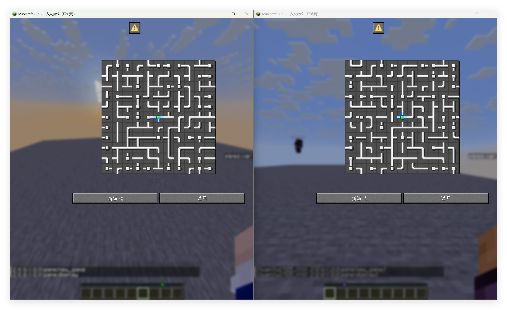
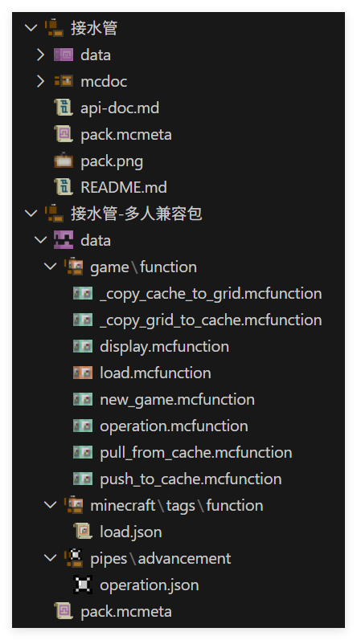
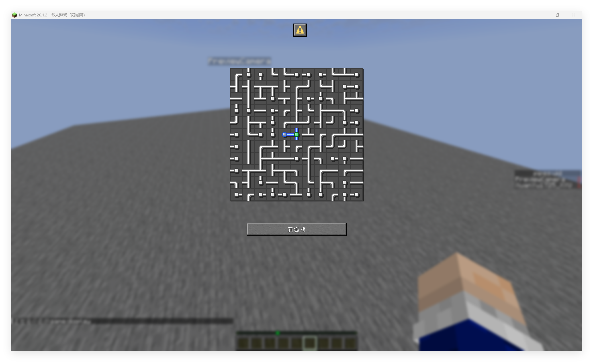
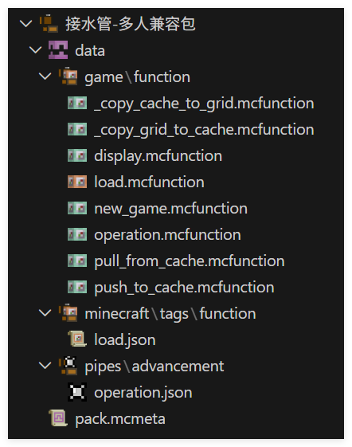

<FeaturedHead
    title='如何将单人游戏适配多人 - 以徐木弦的 Pipes 为例'
    authorName='轩宇1725'
/>


本文将基于 徐木弦 版本的 Pipes 数据包进行多人适配，作为一个通用的例子，该数据包的功能仅作为背景，并不是多人兼容的核心因素。本文主要基于思路分析并对原数据包进行简单修改进行多人适配，内容较简单。

## 游戏简介

本期 Feature 应当有相当多的 Pipes 文章，所以在此不赘述数据包的功能和玩法。简单来说，我们需要将 生成 - 显示 - 交互 - 判定的过程适配于多人环境。

## 分析

### 前端交互

徐木弦设计的基于 dialog 的交互方案天然适合兼容多人，因为 dialog 只对单个玩家展示，类似的方案还有基于聊天栏或 title 的显示方案。如果用展示实体，则需要注意展示实体的可见性和交互权限。我们这里接着采用 dialog 的方案。

### 实例存储

每个玩家正在进行的游戏应该抽象为一个独立的游戏实例，而 dialog 本身只是作为渲染和交互的工具，因此我们需要为每个玩家维护一个游戏实例。游戏实例包含了当前关卡、玩家位置、游戏状态等信息。

## 数据包现状

这个版本的 Pipes 不适配多人主要是因为仅有一个全局变量插槽，玩家的所有操作都是基于该全局变量的。因此我们有两种方案：

1. 大改数据包，实现每个玩家一个独立的变量插槽，在插槽内操作。

2. 微调数据包，每个玩家单独存储自己的游戏实例，在响应玩家操作前将自己的实例克隆到全局变量插槽。

我们先选择后一种解法。

## 实现

### 数据结构

我们先检查数据结构，原文采用了一个列优先的二维数组 `grid` 来存储地图，

其中每一个 `grid[x][y]` 都有如下的数据：
<div class="nbttree">

<node type="compound" name=""/> 节点根标签
- <node type="int" name="index"/>该节点的索引，从 1 开始计数，计算方式为 `<index>=<x>+<y>*<width>+1`。
- <node type="int" name="parent_x"/>该节点的父节点的 $x$ 坐标。
- <node type="int" name="parent_y"/>该节点的父节点的 $y$ 坐标。
- <node type="byte_list" name="side"/>该节点在四个方向上的连接情况，数组内一共有 4 个元素，依次代表左、上、右、下四个方向，其中 `0b` 为未连接，`1b` 为连接。
- <node type="bool" name="source"/>该节点是否为根节点。
- <node type="byte" name="state"/>该节点的状态，`0b` 为无，`1b` 为灌水，`2b` 为警告，`3b` 为待访问。
- <node type="bool" name="visited"/>该节点在生成阶段是否已访问，在游戏阶段无实际作用。
- <node type="int" name="x"/>该节点的 $x$ 坐标。
- <node type="int" name="y"/>该节点的 $y$ 坐标。
</div>

存储在 `storage pipes:grid grid` 内，这个是游戏实例的核心变量，另还有

`storage pipes:grid dialog` 用于存储前端的自定义文本

(score_holder) `#record pipes.var` 用于存储游玩时间

这三个数据将组成一个游戏实例。但为了方便，我们只考虑第一个数据的兼容。

### 独立存储

为了做到多人兼容，我们只需要在玩家开局时，使用

```mcfunction
function pipes:prim/
```

创建地图，并将 `storage pipes:grid grid` 中的内容复制到自己的 cache 内。

我们可以按玩家 uid 为玩家分配 storage 空间，并用宏去访问。由于只有玩家操作时我们才访问一次，因此这里宏并不会带来太多的消耗。

在每个玩家创建游戏实例时，我们使用下面的命令为玩家自动分配连续的 uid, 已获得 uid 的玩家不会被重复分配。

```mcfunction
# game:new_game.mcfunction
execute unless score @s pipes.uid matches -2147483648..2147483647 store result score @s pipes.uid run scoreboard players add #Pointer pipes.uid 1
```

然后我们创建地图，并将其复制到 cache 内

```mcfunction
# game:new_game.mcfunction
$scoreboard players set #width pipes.var $(w)
$scoreboard players set #height pipes.var $(h)

function pipes:prim/
function pipes:upset/

execute store result storage pipes:cache uid int 1.0 run scoreboard players get @s pipes.uid
function game:_copy_grid_to_cache with storage pipes:cache
```

```mcfunction
# game:_copy_grid_to_cache
$execute unless data storage pipes:cache players[{uid:$(uid)}] run data modify storage pipes:cache players append value {uid:$(uid)}
$data modify storage pipes:cache players[{uid:$(uid)}].grid set from storage pipes:grid grid
```

借助内置的渲染器，实现渲染 cache 内的谜题

```mcfunction
# game:display
execute store result storage pipes:cache uid int 1.0 run scoreboard players get @s pipes.uid
function game:_copy_cache_to_grid with storage pipes:cache

function pipes:display/

scoreboard players enable @s pipes.trigger
scoreboard players enable @s pipes.operation
```

```mcfunction
# game:_copy_cache_to_grid
$data modify storage pipes:grid grid set from storage pipes:cache players[{uid:$(uid)}].grid
```

现在一个基础的新建游戏示例的功能就做好了，不同玩家可以通过

```mcfunction
function game:new_game {w:11,h:11}
function game:display
```

来创建并显示自己的游戏，互不干扰



进一步将拉取和上传包装为函数，方便以后调用

```mcfunction
# game:pull_from_cahce
execute store result storage pipes:cache uid int 1.0 run scoreboard players get @s pipes.uid
function game:_copy_cache_to_grid with storage pipes:cache
```

```mcfunction
# game:push_to_cache
execute store result storage pipes:cache uid int 1.0 run scoreboard players get @s pipes.uid
function game:_copy_grid_to_cache with storage pipes:cache
```

### 响应操作

当玩家每次点击图格时，我们需要

1. 拉取玩家 cache

2. 执行原本的操作

3. 上传玩家 cache

这意味着我们需要简单修改一下旋转的触发链路

进入 `pipes:operation/trigger/`

```mcfunction
# pipes:operation/trigger/
#旋转管道
advancement revoke @s only pipes:operation
execute store result storage pipes:grid macro.tile_index int 1.0 run scoreboard players get @s pipes.operation
function pipes:operation/trigger/tile with storage pipes:grid macro
scoreboard players reset @s pipes.operation
scoreboard players enable @s pipes.operation

#解题判定
function pipes:operation/tarjan/

#显示操作后的图
function pipes:display/

#音效
playsound item.book.page_turn player @s
```

我们在整个文件之前加入拉取和上传的操作即可

```mcfunction
# pipes:operation/trigger/
function game:pull_from_cache

#旋转管道
advancement revoke @s only pipes:operation
execute store result storage pipes:grid macro.tile_index int 1.0 run scoreboard players get @s pipes.operation
function pipes:operation/trigger/tile with storage pipes:grid macro
scoreboard players reset @s pipes.operation
scoreboard players enable @s pipes.operation

#解题判定
function pipes:operation/tarjan/

#显示操作后的图
function pipes:display/

#音效
playsound item.book.page_turn player @s

function game:push_to_cache
```

更健壮的方法是覆盖进度 `pipes:operation`，将其重定向到函数 `game:operation`

```json
# pipes:operation
{
  "criteria": {
    "rotate": {
      "conditions": {
        "player": [
          {
            "condition": "minecraft:any_of",
            "terms": [
              {
                "condition": "minecraft:entity_scores",
                "entity": "this",
                "scores": {
                  "pipes.operation": {
                    "min": 1
                  }
                }
              },
              {
                "condition": "minecraft:entity_scores",
                "entity": "this",
                "scores": {
                  "pipes.operation": -1
                }
              }
            ]
          }
        ]
      },
      "trigger": "minecraft:tick"
    }
  },
  "rewards": {
    "function": "game:operation"
  }
}
```


```mcfunction
# game:operation
function game:pull_from_cache

function pipes:operation/trigger/

function game:push_to_cache
```

### 自定义前端

我们没有直接修改原有的代码，这意味着我们提供的仅仅是一个独立的兼容层，后续我们可以自定义我们的 dialog 前端。



刚刚的 `game:display` 中调用了原有的渲染方法 `function pipes:display/`

只需要修改这个方法为自己的渲染函数及配套的 dialog 界面，即可制作一个自定义前端。

下面提供的自定义前端砍掉了原包的多级菜单，只保留了游戏本体。

```
# game:display
function game:pull_from_cache

# template from original pack
data modify storage pipes:grid cache.processing_data set from storage pipes:grid grid
data modify storage pipes:grid dialog.body.contents[2] set value [""]
data modify storage pipes:grid cache.processing_data_cache set value []
function pipes:display/height
data modify storage pipes:grid dialog.body.contents[2][-1] set value "\n\n\n\n"
execute unless entity @s[tag=pipes.win] run data modify storage pipes:grid dialog.body.contents[3] set value ""
execute if entity @s[tag=pipes.win] run function pipes:display/win
    # injection: remove buttons
    data modify storage pipes:grid dialog.actions set value [\
        {action: {type: "minecraft:run_command", command: "function game:new_game {w:5, h:5}"}, label:{"translate":"dialog.pipes.game.new_game"}}\
    ]
function pipes:display/show with storage pipes:grid
data remove storage pipes:grid cache.processing_data

scoreboard players enable @s pipes.trigger
scoreboard players enable @s pipes.operation
```

要完全自定义前端，需要用同样的方式覆盖 `pipes:tirgger` 进度。这里只是简单示例。



## 总结

本文不修改原数据包，而是通过仅覆盖一个进度文件实现了一个最小侵入的兼容层，从而将一个原本只兼容单人的游戏修改为兼容多人的版本。



这一方面得益于原数据包良好的数据管理，即一个明确的全局变量插槽，与玩家无关，使得我们能够最大规模地沿用现有架构来开发兼容层。另一方面得益于明确的交互响应架构，使得我们能够用最少的覆盖来注入玩家缓存的上传与拉取操作。