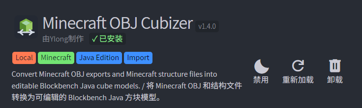
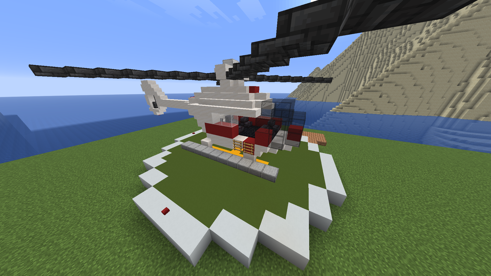
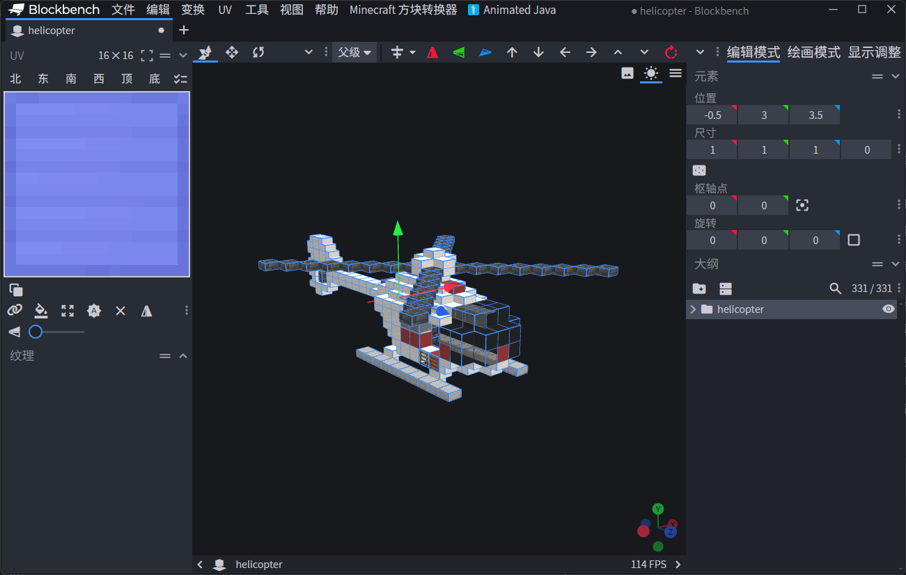
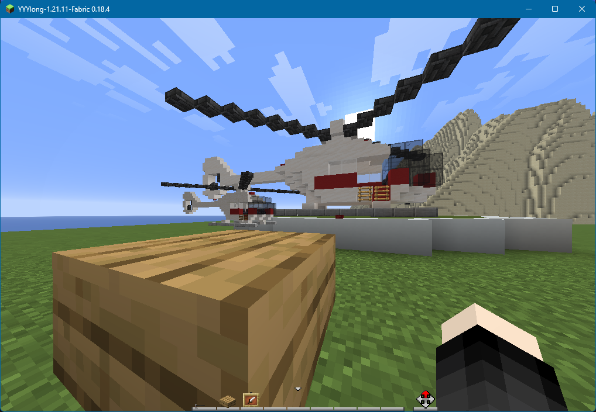
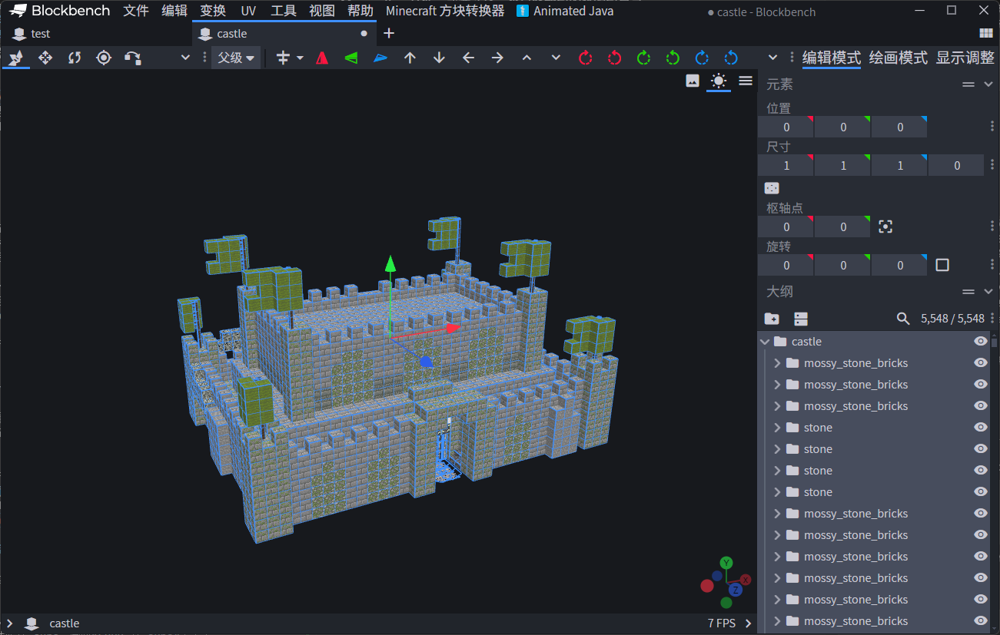
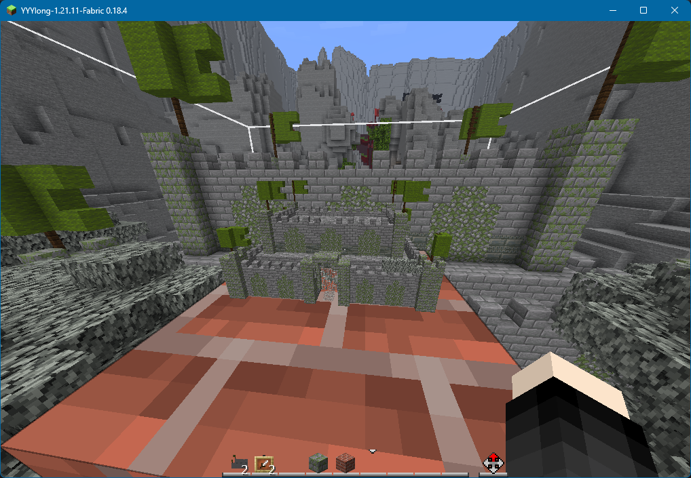

<FeatureHead
    title='把 Minecraft 建筑搬进 Blockbench：Minecraft OBJ Cubizer 插件'
    authorName='歪浪Ylong'
    cover = '../_assets/6.png'
/>

Minecraft OBJ Cubizer 是一个面向 Blockbench 桌面版的辅助插件。它主要用于把 Minecraft 里的建筑、结构文件或方块化的 OBJ 模型，转换成可以在 Blockbench 中编辑、导出，并可以交给 Animated Java 等工具使用的 Java 方块模型。本文旨在介绍插件的原理、支持的输入格式、贴图处理方式，以及一套基本使用流程。

<p align="center">
  
</p>

## 为什么要做这个插件

首先请看这样一个案例：我已经在游戏里搭建出了一架直升机，现在想让它的螺旋桨转起来，并且使直升机可以移动飞行。这个时候如果继续用方块展示实体去做，就会很麻烦。我知道 Blockbench 中的 Animated Java 插件可以辅助制作原版动画，但前提是我需要先在 Blockbench 中有这个模型。手动重新搭建很显然很不健康，那么有没有一种更方便的方式呢？
<p align="center">
  
</p>
在原版地图的创作中，我们时常会遇到与上述例子类似的需求：我已经在 Minecraft 里搭好了一个建筑，或者拿到了一个 `.schem`、`.litematic`、结构 `.nbt` 文件，现在想把它放进 Blockbench 里继续加工，最后做成资源包模型、展示实体模型，或者交给 Animated Java 做动画。

这件事听上去应该很简单，毕竟 Minecraft 建筑大多由方块组成，Blockbench 的 Java Block/Item Model 里也有 cube。把一个方块变成一个 cube，似乎只是坐标转换。

但实际做起来会发现，问题不止一个：

- 原版 nbt 文件无法直接读取并转换成 cube。
- OBJ 模型是通用三维模型格式，Blockbench 的 Java 模型是 Minecraft 资源包 json。
- Minecraft 方块不仅有完整立方体，还有半砖、楼梯、栅栏、墙、按钮、火把、红石线等特殊形状。
- 原版方块模型的贴图路径、父模型、UV、旋转和方块状态都需要被正确解析。
- 箱子、床、告示牌等方块并不是普通方块模型，而是游戏渲染器单独处理的方块实体模型。
- Java Block/Item Model 自身有尺寸和性能上的现实限制。

所以我制作了这么一个插件，把 Minecraft 建筑尽可能转换成 Blockbench 能理解的 cube 结构，让创作者们可以继续编辑、拆分、调轴心、做动画或导出资源包 json，而不是再从头手动搭一遍。

## 插件支持什么

目前插件主要有两条导入路线。

第一条是 OBJ 导入。

适合已经用 Mineways 等工具把 Minecraft 建筑导出成 `.obj + .mtl + png` 的情况。插件会读取 OBJ 几何、MTL 材质和贴图文件，把其中能识别为轴对齐方块面的部分重组为 Blockbench cube。

第二条是直接结构导入。

适合直接导入 Minecraft 结构类文件，包括：

- `.schematic`
- `.schem`
- `.litematic`
- 结构 `.nbt`
- 单个 `.mca` 区域文件

直接结构导入会从 NBT 或区域文件中读取方块坐标、方块 ID 和方块状态，再根据 Minecraft 原版或资源包中的 blockstate/model json 生成 Blockbench cube。

这两条路线面向的场景略有不同：

- 如果你已经有 Mineways 导出的 OBJ，走 OBJ 导入更直接。
- 如果你手里是结构文件，走直接结构导入可以保留更多方块状态信息。

> [!TIP] 插件需求
> Blockbench 最低版本：4.8.0
> Minecraft Java 最低版本：1.8
> 推荐 Minecraft Java 版本：1.13 及以上，最好选择与被导入建筑相同的游戏版本 jar
> 导入结构时建议选择与建筑来源版本一致的 Minecraft jar。版本不一致时，部分新方块或特殊方块可能找不到对应 blockstate/model JSON，从而退回为完整方块。
## 思路：从方块到 cube

Blockbench 的 Java 模型本质上由许多 cube 组成。每个 cube 有 `from`、`to`、`faces`、`uv`、`rotation` 等信息。插件要做的，就是把 Minecraft 方块或 OBJ 面片翻译成这些字段。

### OBJ 导入

OBJ 是面片模型。插件导入 OBJ 时，会先读取顶点、面、材质名称和贴图引用，然后寻找轴对齐的矩形面。

Minecraft 建筑导出的 OBJ 通常有一个特点：虽然格式上是 OBJ，但实际几何来自方块网格。只要这些面没有被斜切或复杂化，就可以按坐标关系重新组合成立方体。

插件会把可识别的方块面整理成 cube，并为每个面绑定对应贴图。对于无法构成立方体的斜面、三角面或异常面，插件会跳过，并在导入结果中提示数量。

所以，OBJ 导入适合“由 Minecraft 方块构成的建筑 OBJ”，不适合普通三角网格模型、曲面模型或雕塑类模型，这也符合这个插件的名字。

### 结构导入

结构导入不从三角面开始，而是直接从方块数据开始。

插件会解析 NBT 数据，得到类似下面的信息：

```text
方块 ID：minecraft:oak_stairs
方块状态：facing=north, half=bottom, shape=straight
坐标：x, y, z
```

接下来，插件会到贴图来源中查找 Minecraft 的模型文件：

```text
assets/minecraft/blockstates/oak_stairs.json
assets/minecraft/models/block/oak_stairs.json
assets/minecraft/textures/block/oak_planks.png
```

这里的“贴图来源”可以是：

- 解包后的资源包目录
- `assets` 文件夹
- `assets/minecraft` 文件夹
- Minecraft `.jar` 或 `.zip`

当找到 blockstate 后，插件会根据当前方块状态选择对应的 model；再解析 model json 中的 `elements`，把每个 element 转成一个 Blockbench cube。

如果模型有父模型，插件会继续解析父模型并合并贴图变量。比如某些模型只写了：

```json
{
  "parent": "minecraft:block/cube_all",
  "textures": {
    "all": "minecraft:block/stone"
  }
}
```

插件需要知道 `cube_all` 的六个面如何使用 `#all`，再把 `#all` 解析成 `minecraft:block/stone`。否则 Blockbench 里就会出现“父模型提供的纹理文件”无法正确显示的问题。


> [!TIP] 特殊方块
> 对于箱子、床、告示牌、陶罐等特殊方块。它们不是普通 block model，而是游戏中由独立渲染逻辑处理。插件目前采用内置可编辑模型的方式：识别到对应方块后，直接生成预设的 cube 结构，再套用对应实体贴图。
> 这种做法不读取箱子物品、告示牌文字、旗帜图案、自定义头颅主人等方块实体数据。
> 目前无法导入 minecraft:water 方块。

## 贴图处理

插件中的贴图分两类理解会更清楚。

第一类是预览贴图。

当你选择 Minecraft jar 或资源包作为贴图来源时，插件会读取里面的 PNG，用于在 Blockbench 里显示模型效果。对于 jar 中读取到的原版贴图，插件会把它们视为“仅预览资源”，保存模型时不会强制把所有原版 PNG 另存一遍。

这样做的原因很简单：如果你已经使用原版贴图，就没有必要在保存模型时复制一堆 Minecraft 自带贴图。

第二类是导出路径。

导出 Java 模型 json 时，贴图路径需要写成 Minecraft 能识别的格式，例如：

```json
{
  "textures": {
    "stone": "minecraft:block/stone"
  }
}
```

如果你使用自己的资源包命名空间，也可以在插件设置里填写。例如命名空间是 `fo`，贴图文件夹是 `block`，导出路径就会变成：

```json
"fo:block/stone"
```

这也是为什么插件设置里会有“贴图命名空间”和“贴图文件夹”两项。

## 安装插件

插件目录结构如下：

```text
minecraft_obj_cubizer/
├─ minecraft_obj_cubizer.js
├─ about.md
├─ changelog.json
├─ icon.svg
└─ members.yml
```

安装时，打开 Blockbench 桌面版，进入插件界面，选择从文件加载插件，然后选择：

```text
minecraft_obj_cubizer/minecraft_obj_cubizer.js
```

加载成功后，Blockbench 顶部菜单栏会出现：

```text
Minecraft Cubizer / Minecraft 方块转换器
```

插件的 OBJ 导入、结构导入、两套设置和贴图导出功能都在这个菜单里。

## 使用流程一：从 OBJ 导入建筑

如果你的建筑已经通过 [Mineways](http://mineways.com/) 或类似工具导出为 OBJ，可以使用这一流程。

我们回到开头的例子，借助工具从存档中将直升机建筑导出为 OBJ 模型。
确认文件结构没有被破坏。OBJ、MTL 和贴图应保持原有相对路径：

```text
helicopter_obj/
├─ helicopter.obj
├─ helicopter.mtl
└─ textures/
   ├─ iron_block.png
   ├─ red_concrete.png
   └─ ...
```

然后在 Blockbench 中打开：

```text
Minecraft 方块转换器 > 将 Minecraft OBJ 导入为方块
```

常用设置建议如下：

| 设置项 | 建议值 | 说明 |
| --- | --- | --- |
| OBJ 方块缩放 | `1` | Mineways 导出的建筑通常是 1 个 Minecraft 方块对应 1 个 OBJ 单位 |
| 默认方块厚度 | `1` | 普通方块面重组成完整 cube 时使用 |
| 贴图尺寸 | `16` | 原版方块贴图通常是 16x16 |
| 贴图命名空间 | `minecraft` 或自定义 | 例如资源包命名空间为 `fo` 就填写 `fo` |
| 贴图文件夹 | `block` | 对应资源包中的 `textures/block` |
| 居中到原点 | 按需开启 | 做动画时可能更方便 |

这里最容易填错的是“OBJ 方块缩放”。不要看到 Minecraft 贴图是 16x16 就把缩放填成 16。缩放填 16 会把坐标一起放大，可能导致导出的 json 坐标超出 Java Block/Item Model 常见范围。

<p align="center">
  
</p>

导入成功检查无误后，可以使用 Blockbench 自带的 Java Block/Item Model 导出 json 文件至资源包的 models/item 目录中。定义相应的物品模型映射文件后，就可以在游戏中使用该模型了。

<p align="center">
  
</p>

如果 OBJ 使用了自带贴图（非原版），还可以使用：

```text
Minecraft 方块转换器 > 导出 OBJ 贴图到资源包
```
把导入的 PNG 贴图复制到资源包的 textures/block 目录中。

当然，也可以转换项目至 Animated Java 格式，制作直升机的螺旋桨旋转动画。
制作完成后再通过 Animated Java 插件自带的功能导入至数据包和资源包。


## 使用流程二：直接导入结构文件

如果你手里是 `.schem`、`.litematic`、结构 `.nbt` 或 `.mca`，可以直接使用结构导入。

> [!TIP] 提示
> 需要注意的是，`.schem`、`.litematic`、结构 `.nbt` 和 `.mca` 的存储上限并不相同。
> 原版结构 `.nbt` 在游戏中通常受结构方块一次最多 `48 x 48 x 48` 的保存范围限制；
> `.mca` 则是按区域文件存储世界数据，一个 `.mca` 对应 `32 x 32` 个区块。
> 相比之下，`.schem` 和 `.litematic` 一般没有这么小的固定方块上限，实际更常受到编辑器实现、内存占用和文件体积的限制。

以一座在游戏中用结构方块保存的城堡为例，打开：

```text
Minecraft 方块转换器 > 导入 Minecraft 结构
```

选择位于 `存档根目录\generated\minecraft\structures\` 下的 nbt 结构文件，在弹窗里重点设置“贴图来源文件夹或 Minecraft jar”。建议直接选择对应版本的 Minecraft jar文件，或者选择一个已经解包的资源包目录。

然后确认以下设置：

| 设置项 | 说明 |
| --- | --- |
| 读取 Minecraft 方块模型 | 开启后会读取 blockstate/model json，用于生成楼梯、栅栏、墙等特殊方块 |
| 最多创建方块数 | 限制生成的 Blockbench cube 数量，默认 5000 |
| 移动到原点 | 将导入结构整体移动到原点附近 |
| 居中到原点 | 更适合需要围绕中心制作动画的模型 |
| 设置 Java cullface | 为面写入 cullface 信息，按需求开启 |

导入完成后，插件会显示统计信息，包括：

- 非空气方块数量
- 生成的 Blockbench cube 数量
- 跳过的隐藏方块数量
- 因数量限制截断的数量
- 使用模型 json 的方块数量
- 退回完整方块的方块 ID 和原因
  

如果某些方块退回完整方块，通常是因为插件没有找到对应的 blockstate/model json，或者该模型无法产生可显示的面。此时优先检查贴图来源是否选对版本、路径是否包含 `assets/minecraft/blockstates` 和 `assets/minecraft/models`。

<p align="center">
  
</p>

随后将该模型导入至资源包中。

<p align="center">
  
</p>

## 关于数量和尺寸限制

插件设置里的“最多创建方块数”统计的是生成后的 Blockbench cube，不是原始 Minecraft 方块数量。

举个例子，一个普通石头方块可能只生成 1 个 cube，但一个栅栏、墙、楼梯、箱子或床可能生成多个 cube。因此“5000 个 cube”不等于“5000 个 Minecraft 方块”。

插件默认上限是 5000 个 cube。超过这个数量后，Blockbench 仍然可能能打开，但编辑、选择、保存和验证都会变慢，请大家自行判断。超过 10000 个 cube 通常建议拆分导入，然后通过物品模型映射把多个模型拼在一起。

此外，Java Block/Item Model 也不是为超大型建筑准备的。Blockbench 对 Java 方块模型的常见范围可以理解为约 3x3x3 方块，也就是坐标大致在 `-16` 到 `32` 之间。按插件默认比例换算，建议最终模型尽量控制在约：

```text
48 x 48 x 48 格
```

越大越容易遇到导出、显示、性能或游戏内使用问题。大型建筑更适合拆成多个部件，再根据项目需要分别处理。

> [!TIP] 提示
> 如果不执着使用物品模型的话，将项目转换为 Animated Java 格式，再导入游戏中可以获得不错的性能提升，且不限制于 Java Block/Item Model 的大小限制。

## 更新方向

目前这个插件在导入大型建筑时，最明显的问题就是：一旦生成的 Blockbench cube 太多，编辑、选择、保存甚至视图操作都会出现比较严重的卡顿。所以后续更新的重点，不会只是单纯继续提高上限，而是尽量减少无意义的 cube，并且让导入过程本身更轻一些。

后续有以下三个更新方向。

- 在导入前减少要处理的内容，按选区、按高度范围、按方块种类筛选导入。

- 尽量降低最终生成的 cube 数量，对连续的完整方块做合并。

- 继续优化导入和整理流程本身。

## 常见问题

### 导入后没有特殊方块模型

优先检查“贴图来源文件夹或 Minecraft jar”是否正确。

如果没有读取到原版 blockstate/model json，插件只能把很多特殊方块退回成完整方块。推荐选择当前 Minecraft 版本的 `.jar`，或者选择包含 `assets/minecraft` 的资源包目录。

### 贴图显示成“父模型提供的纹理文件”

这通常说明模型引用了父模型或贴图变量，但贴图链没有解析完整。请确认贴图来源中同时存在 `models`、`blockstates` 和 `textures`。如果使用资源包，也要确认资源包内的父模型没有缺失。

### 导出 json 后坐标过大

OBJ 导入时最常见原因是缩放设置过大。Minecraft 建筑 OBJ 通常建议 `OBJ 方块缩放 = 1`。如果填成 16，每个方块都会被放大 16 倍，导出坐标很容易超出 Java 模型常见范围。

### 保存时不想导出一堆原版贴图

当贴图来源是 Minecraft jar 或 zip 时，插件会把这些贴图视作预览资源，不会在保存模型时强制另存原版 PNG。需要复制 OBJ 自带贴图时，再使用插件菜单中的“导出 OBJ 贴图到资源包”。

### 能不能读取头颅纹理、告示牌文字或旗帜图案

目前不读取。插件主要转换模型外形和贴图，不处理方块实体内部数据。箱子、告示牌、床等会尽量生成可编辑模型，但其中的物品、文字、图案和玩家头主人等数据不属于当前目标。

## 适合怎样的工作流

这个插件最适合下面几种情况：

- 想把 Minecraft 建筑快速搬进 Blockbench 做二次编辑。
- 想把 `.schem` 或 `.litematic` 中的一小段结构做成展示模型。
- 想把建筑拆成部件，再交给 Animated Java 制作原版动画。
- 想研究某个结构的方块模型组成，并在 Blockbench 中调整 UV、轴心和分组。

它不适合把完整世界、超大型地图或复杂地形一次性变成单个 Java 模型。那类需求更适合专门的地图渲染、实体展示系统，或者拆分成多个模型模块。

## 结语

Minecraft OBJ Cubizer 的核心思路并不复杂，把 Minecraft 的方块、方块状态和模型 json，尽量翻译成 Blockbench 能编辑的 cube。麻烦的是贴图链、父模型、UV、旋转、特殊方块和体量控制。

对于原版创作者来说，它的价值在于减少重复劳动。当你想给一些建筑做动画时，你不需要手动把一个建筑里的每个方块都制作出一个方块展示实体或者在Blockbench重新搭成 一系列cube，也不需要从零复刻每个楼梯、栅栏和墙的形状。插件先完成大部分机械转换，创作者再把精力放到别的的地方。

## 插件链接
- [推荐下载链接](https://treehey.github.io/Fimel/#/works/tools)
- [备用蓝奏云下载链接](https://ylong4004.lanzn.com/iVFNA3obc03e)
- [Github仓库](https://github.com/Ylong4004/minecraft_obj_cubizer)

