<FeatureHead
    title='数据包测试终极答案——大沙包（Datapack Sandbox）'
    authorName='Alumopper'
    resourceLink = 'https://dbs.afox.moe/'
/>

## I. Introduction

长期以来，数据包的测试一直是一个令人头疼的问题。数据包作者们通常需要不断的在自己的函数中插入 say hi 判断函数是否可达，或者使用 tellraw 对自己的数据包运行中的某些过程量进行输出。为了解决这样的问题，已经有不少相关的工具出现了。例如，由我和bookshelf共同开发的[Sniffer](https://github.com/mcbookshelf/Sniffer)提供了一个Fabric Mod以及VSCode插件，允许用户在VSCode中设置函数断点，控制游戏中函数的进行，查看断点时期游戏的各种状态。然而，Mod的维护成本较大，对游戏的侵入性较大，使得这个项目目前开发较为困难。

因此，我们决定大胆开发一个全新的工具——Datapack Sandbox，简称DSB（大沙包）。它从0开始，构建了一个和Minecraft环境类似的纯净沙箱，为数据包提供了一个本地的、轻量级的、可控的虚拟运行时。和Minecraft庞大的代码库不同，大沙包只需要维护基本的运行时环境，提供数据包运行所需的最基本的功能，因此其维护工作比Mod简单得多，可以轻易兼容从1.20.4到26.2的所有正式版本的数据包运行环境。同时，大沙包作为一个测试运行时，从底层即支持**断点调试**、获取快照等功能，允许用户精细捕捉各种运行时状态，可以极大提高调试效率。此外，借助大沙包运行时，我们还开发了一系列的工具链，包括单元测试工具、**配套的VSCode插件**。更令人振奋的还有**纯前端**的在线运行时，允许开发者在编写数据包文档的时候直接将大沙包嵌入自己的网站，读者可以在阅读文档的时候直接在网页中编辑、运行mcfunction，查看运行结果，极大提高了文档的可读性和交互性。目前，香草图书馆已经开放提供了大沙包的使用，本文除了介绍大沙包的功能，也会介绍如何在香草图书馆中使用大沙包。

:::warning ATTENTION
对于绝大多数数据包开发者，建议先阅读DSB VSCode Plugin和DSB Playground部分
:::

## II. ~~Materials and methods~~ DSB Core

沙盒，顾名思义，一个封闭的纯净环境。大沙包提供了一个和Minecraft环境类似的纯净沙箱，从而能运行、调试数据包。但是，大沙包并不是Minecraft的一个完整实现，它只提供了数据包运行所需的最基本的功能。无论是网页端，还是JVM端，大沙包都只是一个轻量级的运行时环境。当然，我们也在致力于让大沙包尽可能完整的模拟原版Minecraft中的各种特性，如果你发现了任何不一致，欢迎来到我们的仓库中提出Issue。

### DSB CLI

:::tip
本节详细文档参阅：https://dbs.afox.moe/workflows/cli.html
:::

大沙包提供了命令工具，允许用户在命令行中启动一个洁净沙盒，在其中运行数据包，并运行各种命令，查看沙盒状态，修改沙盒状态等。

要使用CLI，首先需要一个Java运行环境，不过我觉得这对于Minecraft玩家应该是不需要多说的。随后，前往github的发布页下载最新版本的`datapack-sandbox-cli.jar`。准备好一个数据包，然后在命令行中运行：

```bash
java -jar datapack-sandbox-cli.jar repl --version 26.2 --pack ./my_pack
```

这里指定了使用26.2版本的运行时，并指定了数据包的路径。随后，你将会看到一个这样的界面：

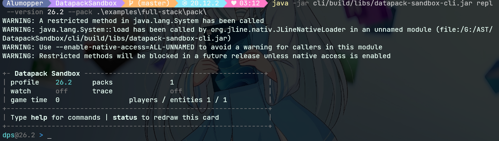

DSB首先会显示一些基本信息，比如当前 的状态，加载的数据包的数量，游戏运行的tick数。注意，此时游戏不会自动进行tick迭代，也就是说，整个沙箱处于静止状态。现在，我们可以输入一些简单的命令执行。DSB会提供命令的补全等，所以你输入命令的时候应该不会很费劲。下图展示了一个执行了一条命令，并且正在进行第二条命令的命令补全的输入状态。

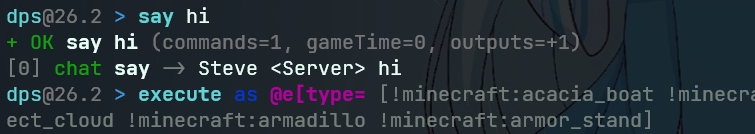

除此之外，因为我们在命令行中指定了一个数据包的路径，因此，我们可以在打开的沙箱中去调用这个数据包的内容。

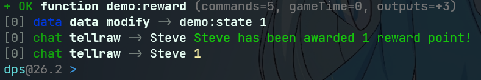

CLI提供了一些额外的命令，用于查看、修改沙箱的状态。例如，查看沙箱中的计分板情况，和实体数据

```txt
inspect scoreboard
inspect score
inspect entity Steve
```

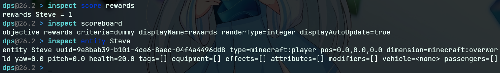

CLI提供的是一些最基本的功能，来帮助用户快速验证某些想法或者进行测试。有关更多的CLI命令，以及CLI的详细文档可以查看本节开头指向的详细文档。

### DSB Manifest Test

:::tip
本节详细文档参阅：https://dbs.afox.moe/workflows/manifest-tests.html
:::

大沙包为数据包提供了Manifest测试的功能。在`.dps.json`文件中，可以定义测试的输入、预期输出和测试的执行方式。借此，数据包开发者可以定义一系列固定的测试用例，确保数据包功能正常。

```json
{
  "version": "26.2",
  "packs": ["pack"],
  "steps": [{ "functionText": "say manifest ok", "source": "<example>" }],
  "assertions": [{ "output": { "command": "say", "contains": "manifest ok", "count": 1 } }]
}
```

以上是一个最小测试样例。`version`定义了游戏版本，`packs`定义了数据包的相对路径，`steps`为测试的执行步骤，`assertions`为测试的断言。在这个例子中，测试的步骤是执行一个函数`<example>`，这个函数中包含了一个命令`say manifest ok`。随后，测试会检查输出中是否包含了`say`命令，并且输出中是否包含了`manifest ok`，并且输出的数量为1。

配合VSCode插件，开发者可以在VSCode中直接运行Manifest测试，并查看测试结果。

:::tip
**DSB or DPS?**

你可能注意到，出现了两个缩写：DSB和DPS。实际上它们都是大沙包的缩写，只是一开始的时候，我把缩写写的是DPS（**D**ata**P**ack **S**andbox）但是后面群友说大沙包，我觉得这个名字更好，所以就把缩写改成DSB（**D**atapack**S**and**B**ox），但是因为之前的文档和代码中已经有了DPS的缩写，所以就一直沿用下来了（
:::

### DSB Render

:::tip
本节详细文档参阅：https://dbs.afox.moe/guide/rendering-notebook.html
:::

虽然DSB一开始的时候，定位是一个命令行工具，不准备触及渲染方面的内容，但是在后续的开发中，我们仍然决定给大沙包添加基本的渲染功能。在大沙包的JVM运行时中，提供了基于GLFW/OpenGL 3.3的实时视窗功能，同时提供在某个节点进行截图输出以及进行GIF动态渲染的能力。例如，以下动图是使用小豆的VVE 3.0数据包渲染的投掷骰子的GIF动图。


注意，大沙包只提供了基本的渲染功能。大沙包的渲染管线独立于原版Minecraft编写，因此大沙包并不支持原版Minecraft的渲染特性，例如资源包的自定义着色器和后处理器等。同时，大沙包也不保证渲染的结果和原版Minecraft完全一致，大沙包仅保证渲染的结果和原版Minecraft在大多数情况下是**相似**的。渲染功能的目的是为数据包作者开发提供一个轻量级的预览画面，而不是作为开发引擎替代原版Minecraft的渲染功能。

要打开渲染功能，需要在JVM运行时中使用`viewport`参数启动大沙包：

```bash
java -jar datapack-sandbox-cli.jar viewport `
  --version 26.2 `
  --minecraft-assets "D:\.minecraft\versions\26.1.2\26.1.2.jar" `
  --command "setblock 0 0 2 minecraft:stone"
```

你将会打开一个如下的窗口：

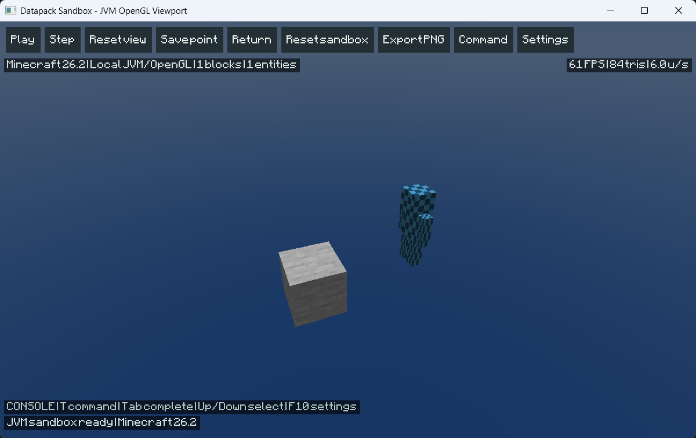

在图形窗口中，控制方式和Minecraft的旁观者模式类似：WSAD控制前后左右，Shift下降空格键上升，鼠标控制视角，滚轮控制飞行速度。窗口顶部的控制按钮可以控制整个沙盒的运行状态，例如暂停、单步迭代、快进等。也可以导出当前画面（其实就是截图）。按下T或者/键都可以打开命令的输入窗口。

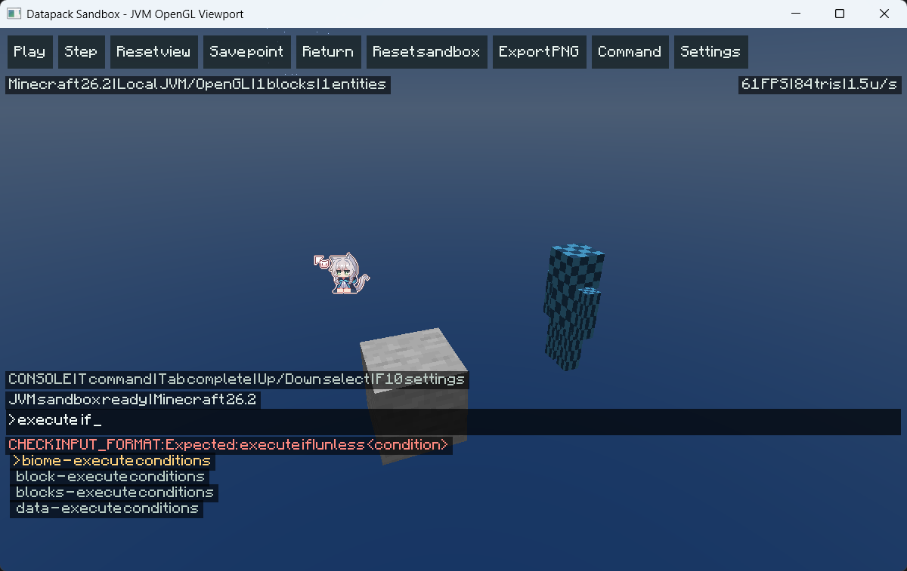

和Minecraft中输入命令不同，你不必输入斜杠`/`作为命令的开头。

按下Settings按钮或者F10可以打开设置页面，调整鼠标灵敏度、飞行速度、UI缩放和fov等。

### DSB API

:::tip
本节详细文档参阅：https://dbs.afox.moe/guide/code-test-api.html
:::

DSB开放了一套测试API，允许开发者在自己的程序中调用大沙包的调试功能。在文档中，我们称之为QuickTest API。QuickTest API对于使用[Kore](http://kore.ayfri.com/)或者[MCFPP](https://www.mcfpp.top/)之类的基于Java/Kotlin的程序开发者来说非常方便。

要将QuickTest API集成到自己的程序中，需要在Maven或者Gradle中添加依赖：

```kt
repositories {
    maven("https://nexus.mcfpp.top/repository/maven-releases/")
    mavenCentral()
    maven("https://libraries.minecraft.net")
}

dependencies {
    implementation("moe.afox.dpsandbox:testkit:1.1.0")  // 将QuickTest API集成到你的程序中
    // 或者 testImplementation("moe.afox.dpsandbox:testkit:1.1.0")，如果你只是想在测试源码中使用大沙包
}
```

随后，你就可以在自己的程序中使用QuickTest API了。例如，以下是一个简单的测试用例：

```kt
import moe.afox.dpsandbox.core.SandboxQuickTest

@Test
fun generatedFunctionKeepsItsContract() {
    //创建一个沙盒，并定义一个临时测试函数
    SandboxQuickTest.singleFunctionText(
        """
        scoreboard objectives add runs dummy
        scoreboard players set #quick runs 1
        say quicktest ready
        """.trimIndent(),
        version = "26.2",
    )
        //执行这个函数
        .function()
        //断言执行完毕后，计分板#quick的runs分数为1
        .assertScore("#quick", "runs", 1)
        //断言输出中包含了say命令，并且输出中包含了"quicktest ready"，并且输出的数量为1
        .assertOutput(command = "say", contains = "quicktest ready", count = 1)
        //要求断言通过，否则抛出异常
        .requirePassed()
}
```

API也允许使用`SandboxQuickTest.create`读取一个或多个完整的数据包，并在沙盒中运行它们。API也提供了Fixure API，允许开发者在测试中定义一个临时的沙盒环境，进行更复杂的测试。

以下是QuickTest Fixture的简单示例：

```kt
SandboxQuickTest.singleFunctionText(source, version = "26.2")
    .world {
        // 定义了沙盒世界的各项属性，比如说玩家位置，方块，已经存在的分数和NBT Storage数据等
        player("Alex", x = 0.0, y = 64.0, z = 0.0, xp = 3)
        block(0, 63, 0, "minecraft:stone")
        score("Alex", "runs", 0)
        storage("demo:state", "{ready:true}")
    }
    .function()
    .requirePassed()
```

我们也提供了存档导入的功能。使用`.importSave`函数可以将原版Minecraft存档中的某些区块导入到沙盒中作为测试环境。虽然理论可以，但是我们不建议加载整个世界。

有关QuickTest API的更多内容，请查看大沙包文档。

## III. DSB Tools

依赖大沙包运行时，我们开发了一系列的工具链，帮助数据包开发者更高效的进行数据包开发。

### DSB Jupyter

:::tip
本节详细文档参阅：https://dbs.afox.moe/integrations/jupyter.html
:::

大沙包提供了Jupyter Notebook的支持。开发者可以在Notebook中编写Markdown文档，插入代码块，运行代码块，并查看运行结果。

建议从Github Release安装Jupyter的支持：

首先下载`datapack_sandbox_kernel-<version>-py3-none-any.whl`。这是大沙包的Jupyter内核，为Jupyter提供mcfunction支持。随后，建议继续安装`datapack-sandbox-vscode-<version>.vsix`，这是大沙包的VSCode插件，便于开发者直接在VSCode中操作大沙包。VSCode的插件支持会在后续更加详细的说明。

随后，执行如下命令安装wheel，并注册 kernelspec：

```bash
python -m pip install --upgrade .\datapack_sandbox_kernel-<version>-py3-none-any.whl jupyterlab
datapack-sandbox-kernel --user
python -m jupyterlab --no-browser
```

验证安装是否成功：

```bash
& $py -c "from jupyter_client.kernelspec import KernelSpecManager; print(KernelSpecManager().find_kernel_specs())"
```

若看到`datapack-sandbox`在输出结果中，则说明安装成功。

接下来，打开VSCode，安装`Microsoft Python`和`Jupyter`插件，以及`Datapack Sandbox`插件，创建一个新的Notebook，例如`example.ipynb`，点击右上角Select Kernel，选择`Datapack Sandbox(MCFunction)`，即可开始使用大沙包的Notebook功能。

一般来说，第一个配置单元格需要指定大沙包的版本和数据包路径，例如：

```
%dps version 26.2
%dps config autoRender true
%dps reset --apply
```

在Notebook中，以%dps开头的单元格是大沙包的控制命令，类似之前CLI中的大沙包特有命令。

在之后的单元格中，你就可以正常的编写mcfunction代码块了，例如：

```mcfunction
setblock 0 0 2 minecraft:stone
summon minecraft:zombie 2 0 4
```

大沙包独立提供了代码补全和检查的功能，不依赖于Spyglass。大沙包仅在获取生成vanilla NBT schema 时使用 Spyglass。

### DSB VSCode Plugin

:::tip
本节详细文档参阅：https://dbs.afox.moe/guide/vscode-extension.html
:::

考虑到数据包开发者多使用VSCode进行开发，我们开发了大沙包的VSCode插件。这个插件提供了大沙包的集成，允许用户在VSCode中直接运行数据包，并查看运行结果。

插件目前已经在VSCode Marketplace上发布，用户可以直接搜索`Datapack Sandbox`进行安装。当然，也可以在Github Release中下载最新版本的`.vsix`文件进行安装。

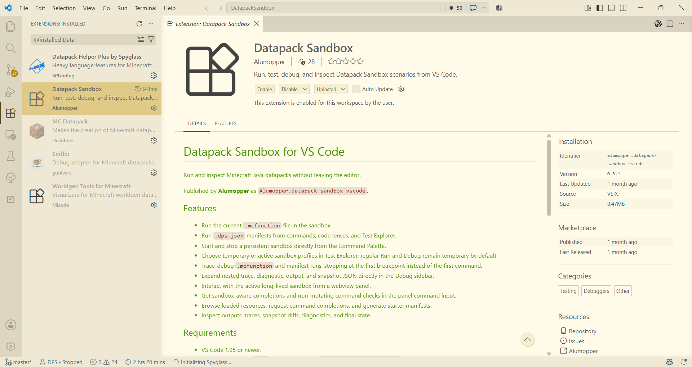

成功安装插件以后，可以在左侧侧边栏看到插件的图标，点击即可进入插件页面。这里会显示沙盒的运行状态。在刚刚开始的时候，沙盒是没有运行的，所以这里什么都没有。在底部的状态栏的左侧，有一个`DPS`开头的按钮，点击即可打开沙盒的控制台。在其中，可以新建沙盒，在沙盒中执行命令，观察沙盒的状态、输出情况等。

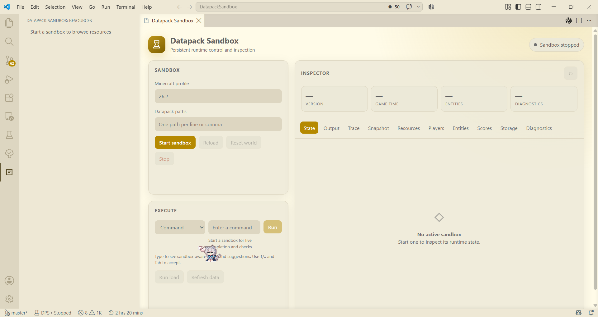

接下来，打开一个mcfunction文件，你会看到文件编辑器的顶部出现了一个新的工具栏：

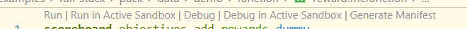

从左到右，它们的功能分别是：

* 创建一个临时的干净沙盒，在其中执行这个函数。
* 在一个已经打开的沙盒中执行这个函数。这个沙盒一般是你在刚刚的控制面板中启动的那个沙盒。
* 调试这个函数。调试功能允许你在函数中设置断点，单步执行函数，并查看沙盒的状态。
* 和Run in Active Sandbox类似，在一个已有的沙盒中执行这个函数/
* 为这个函数生成一个Manifest测试用例。Manifest测试用例可以在沙盒中运行，并检查输出是否符合预期。

现在执行以下Run，大概会得到这样的结果：

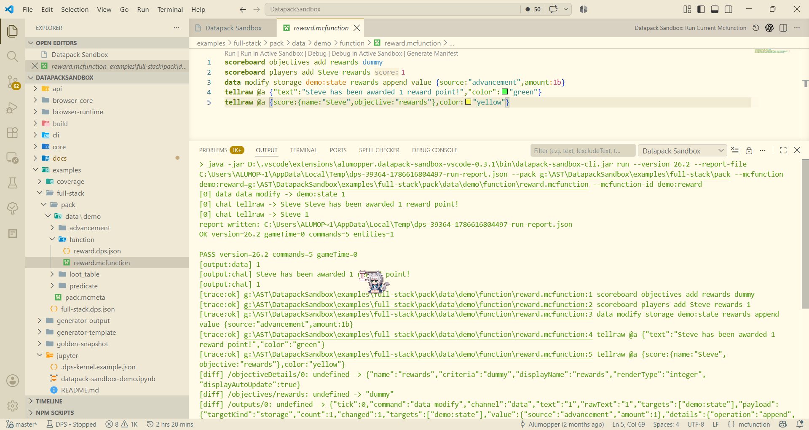

:::details 运行结果
```txt
demo:reward=g:\AST\DatapackSandbox\examples\full-stack\pack\data\demo\function\reward.mcfunction --mcfunction-id demo:reward
[0] data data modify -> demo:state 1
[0] chat tellraw -> Steve Steve has been awarded 1 reward point!
[0] chat tellraw -> Steve 1
report written: C:\Users\ALUMOP~1\AppData\Local\Temp\dps-39364-1786616804497-run-report.json
OK version=26.2 gameTime=0 commands=5 entities=1

PASS version=26.2 commands=5 gameTime=0
[output:data] 1
[output:chat] Steve has been awarded 1 reward point!
[output:chat] 1
[trace:ok] g:\AST\DatapackSandbox\examples\full-stack\pack\data\demo\function\reward.mcfunction:1 scoreboard objectives add rewards dummy
[trace:ok] g:\AST\DatapackSandbox\examples\full-stack\pack\data\demo\function\reward.mcfunction:2 scoreboard players add Steve rewards 1
[trace:ok] g:\AST\DatapackSandbox\examples\full-stack\pack\data\demo\function\reward.mcfunction:3 data modify storage demo:state rewards append value {source:"advancement",amount:1b}
[trace:ok] g:\AST\DatapackSandbox\examples\full-stack\pack\data\demo\function\reward.mcfunction:4 tellraw @a {"text":"Steve has been awarded 1 reward point!","color":"green"}
[trace:ok] g:\AST\DatapackSandbox\examples\full-stack\pack\data\demo\function\reward.mcfunction:5 tellraw @a {score:{name:"Steve",objective:"rewards"},color:"yellow"}
[diff] /objectiveDetails/0: undefined -> {"name":"rewards","criteria":"dummy","displayName":"rewards","renderType":"integer","displayAutoUpdate":true}
[diff] /objectives/rewards: undefined -> "dummy"
[diff] /outputs/0: undefined -> {"tick":0,"command":"data modify","channel":"data","text":"1","rawText":"1","targets":["demo:state"],"payload":{"targetKind":"storage","count":1,"changed":1,"targets":["demo:state"],"value":{"source":"advancement","amount":1},"details":{"operation":"append","path":"rewards"},"results":[{"target":"demo:state","before":{},"after":{"rewards":[{"source":"advancement","amount":1}]},"changed":true}]},"source":{"file":"g:\\AST\\DatapackSandbox\\examples\\full-stack\\pack\\data\\demo\\function\\reward.mcfunction","line":3,"command":"data modify storage demo:state rewards append value {source:\"advancement\",amount:1b}","functionStack":[{"id":"demo:reward","file":"g:\\AST\\DatapackSandbox\\examples\\full-stack\\pack\\data\\demo\\function\\reward.mcfunction"}]}}
[diff] /outputs/1: undefined -> {"tick":0,"command":"tellraw","channel":"chat","text":"Steve has been awarded 1 reward point!","rawText":"Steve has been awarded 1 reward point!","targets":["Steve"],"payload":{"text":"Steve has been awarded 1 reward point!","color":"green"},"source":{"file":"g:\\AST\\DatapackSandbox\\examples\\full-stack\\pack\\data\\demo\\function\\reward.mcfunction","line":4,"command":"tellraw @a {\"text\":\"Steve has been awarded 1 reward point!\",\"color\":\"green\"}","functionStack":[{"id":"demo:reward","file":"g:\\AST\\DatapackSandbox\\examples\\full-stack\\pack\\data\\demo\\function\\reward.mcfunction"}]},"segments":[{"text":"Steve has been awarded 1 reward point!","color":"green"}]}
[diff] /outputs/2: undefined -> {"tick":0,"command":"tellraw","channel":"chat","text":"1","rawText":"1","targets":["Steve"],"payload":{"score":{"name":"Steve","objective":"rewards"},"color":"yellow"},"source":{"file":"g:\\AST\\DatapackSandbox\\examples\\full-stack\\pack\\data\\demo\\function\\reward.mcfunction","line":5,"command":"tellraw @a {score:{name:\"Steve\",objective:\"rewards\"},color:\"yellow\"}","functionStack":[{"id":"demo:reward","file":"g:\\AST\\DatapackSandbox\\examples\\full-stack\\pack\\data\\demo\\function\\reward.mcfunction"}]},"segments":[{"text":"1","color":"yellow"}]}
[diff] /scores/rewards: undefined -> {"Steve":1}
[diff] /storage/demo:state: undefined -> {"rewards":[{"source":"advancement","amount":1}]}
```
:::

主要看前面的output:data部分的内容。这部分是数据包作者更加熟悉的聊天输出信息。沙盒也会输出大量的跟踪信息，以及沙盒状态的变化信息。虽然看起来很大一坨但是只要有耐心，还是应该可以看懂的（小声）。

对于数据包作者来说，更加实用的大概是调试功能。调试功能允许你在函数中设置断点，单步执行函数，并查看沙盒的状态。这部分上，DBS提供的功能和Sniffer类似，只是Sniffer是基于Mod的，需要真实的Minecraft，而大沙包是基于纯净沙盒的。设置断点的方式很简单，也就是在函数中点击行号即可设置断点。断点设置好以后，点击调试按钮，就可以进入调试模式了。

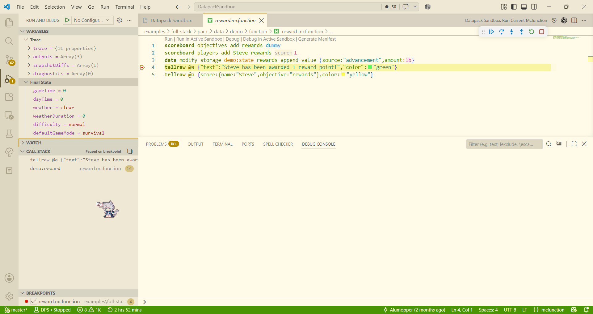

如图所示，函数的执行已经停止在了第四行的命令上，VSCode使用黄色高亮标注了这一点。

在左侧的调试状态栏中，我们可以看到沙盒当前的状态。比如VARIABLES部分显示了执行过程中的一些关键信息。trace表示当前执行的函数上下文，包括执行了什么命令，执行是否成功，执行者是谁，执行的坐标等等。outputs显示了命令的输出，表示了命令的执行结果。snapshotDiffs表示了沙盒状态的变化，表示了命令执行前后沙盒状态的差异。最后，diagnostics显示了沙盒的诊断信息，也就是是否有报错或者警告等。此外，在Final State中，则是沙盒的细节属性，比如说gameTime表示游戏时间，weather显示了天气等。

在左侧的状态栏下方是函数的调用栈，开发者可以看到当前函数的调用关系。点击调用栈中的函数，可以跳转到对应的函数文件中。

至于单步调试等动作，和一般语言的调试功能并无太大差异，这里就不多赘述了。

除此之外，DSB VSCode插件也提供了数据包中mcfunction的语言支持，此功能和Spyglass独立，可一定程度上作为Spyglass的平替。但是本插件的核心功能暂时不会考虑和Spyglass看齐（只是顺手写了一个支持喵 xwx）。

### DSB Web Runtime

DBS Web 运行时将DBS带到了浏览器。DBS Web运行时是一个纯前端的架构，通过TeaVM将JVM字节码编译到JavaScript中，因此浏览器运行大沙包无需额外安装验证Java环境。因此，DBS Web运行时是一套与JVM CLI相同的核心，而非使用TS构建的独立的新的模拟器。然而，DBS Web运行时的渲染功能是基于WebGL2的，代表编辑器和组件也是基于Vue和CodeMirror的，因此在浏览器中运行大沙包的渲染功能和JVM运行时的渲染功能并不完全一致。

### DSB Playground

:::tip
本节详细文档参阅：https://dbs.afox.moe/guide/playground.html
:::

啦啦啦终于到最后的压轴环节了——也就是本次随着本月刊的发布已经同步部署在香草图书馆的 **DSB Playground**！

先看看效果（下面这个可不是图片喵！）：

<script setup lang="ts">
import DpsPlayground, {
  type PlaygroundNotebook,
} from '@datapack-sandbox/vitepress-playground'

import DpsCell from '@datapack-sandbox/vitepress-playground/cell'
import { ref } from 'vue'

const source = ref('')
const notebook: PlaygroundNotebook = {
  version: '26.2',
  cells: [
    {
      id: 'welcome',
      type: 'markdown',
      source: '### 测试沙盒\n\两个编辑器共享一个沙盒。',
    },
    {
      id: 'setup',
      type: 'code',
      source: [
        'scoreboard objectives add feature_reads dummy',
        'scoreboard players set #visitor feature_reads 1',
        'say Feature sandbox is ready',
      ].join('\n'),
    },
    {
      id: 'inspect',
      type: 'code',
      source: 'execute if score #visitor feature_reads matches 1 run say Welcome to Feature',
    },
  ],
}
</script>

<DpsPlayground
    :notebook="notebook"
    :allow-import="false"
    :render="{ auto: false }"
    theme="auto"
    layout="compact"
    checkpoint-name="feature-test"
    site-id="vanilla-library"
/>

试试在编辑器中编辑函数，然后运行吧！

当然，也有提供一个小号的编辑器，更轻量化。

<DpsCell
    v-model="source"
    version="26.2"
/>

这个控件的意义就是，为一些数据包文档提供了一个可以直接在网页中运行的沙盒环境。读者可以在阅读文档的时候直接在网页中编辑、运行mcfunction，查看运行结果，极大提高了文档的可读性和交互性。

在此后的香草图书馆中，任何作者都可以在自己的文档中使用这个控件。

首先，在文档的顶部插入：

```vue

<script setup lang="ts">
import DpsPlayground, {
  type PlaygroundNotebook,
} from '@datapack-sandbox/vitepress-playground'

import DpsCell from '@datapack-sandbox/vitepress-playground/cell'
import { ref } from 'vue'

const source = ref('')
const notebook: PlaygroundNotebook = {
  version: '26.2',
  cells: [
    {
      id: 'welcome',
      type: 'markdown',
      source: '### 测试沙盒\n\两个编辑器共享一个沙盒。',
    },
    {
      id: 'setup',
      type: 'code',
      source: [
        'scoreboard objectives add feature_reads dummy',
        'scoreboard players set #visitor feature_reads 1',
        'say Feature sandbox is ready',
      ].join('\n'),
    },
    {
      id: 'inspect',
      type: 'code',
      source: 'execute if score #visitor feature_reads matches 1 run say Welcome to Feature',
    },
  ],
}
</script>
```

在notebook变量中，定义了一个Notebook的内容。Notebook中包含了一个Markdown单元格和两个代码单元格。Markdown单元格中包含了一些文本内容，代码单元格中包含了一些mcfunction代码。

随后，在你的文档中需要添加沙盒的地方，插入：

```vue
<DpsPlayground
    :notebook="notebook"
    :allow-import="false"
    :render="{ auto: false }"
    theme="auto"
    layout="compact"
    checkpoint-name="feature-test"
    site-id="vanilla-library"
/>
```

变量的简单描述：

* `notebook`：Notebook的内容。这里值是notebook，所以内容是上面script中定义的notebook变量。
* `allow-import`：是否允许导入数据包。这里设置为false，表示不允许导入数据包。
* `render`：渲染的配置。这里设置为`{ auto: false }`，表示不自动渲染。若开启自动渲染，则会像Java运行时一样，提供一个实时的可操控的渲染窗口。

如果要插入一个小号的编辑器，可以插入：

```vue
<DpsCell
    v-model="source"
    version="26.2"
/>
```

其他的更多的变量内容，可以前往[DSB Playground文档](https://dps.afox.moe/playground/)查看。