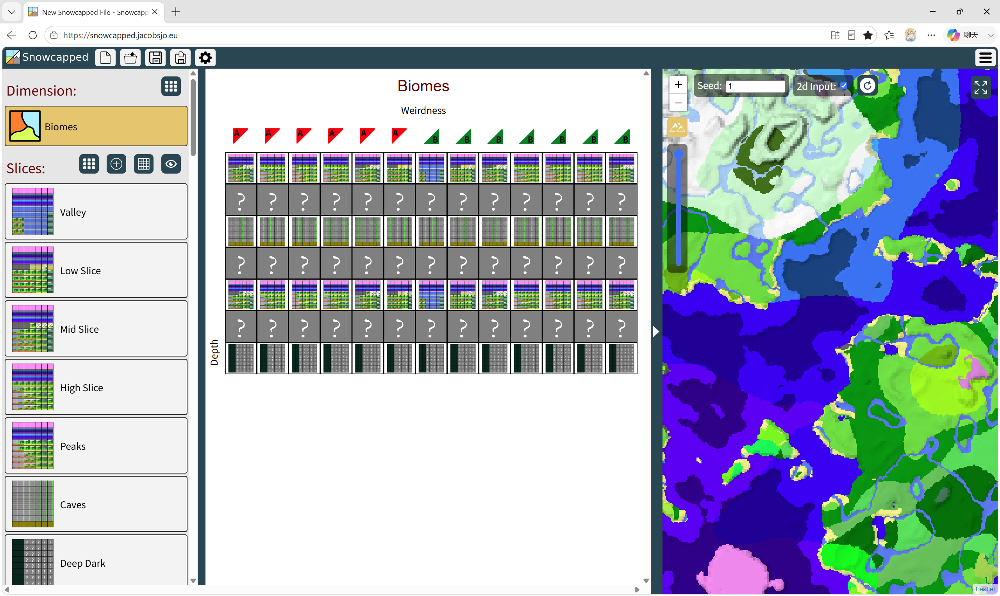
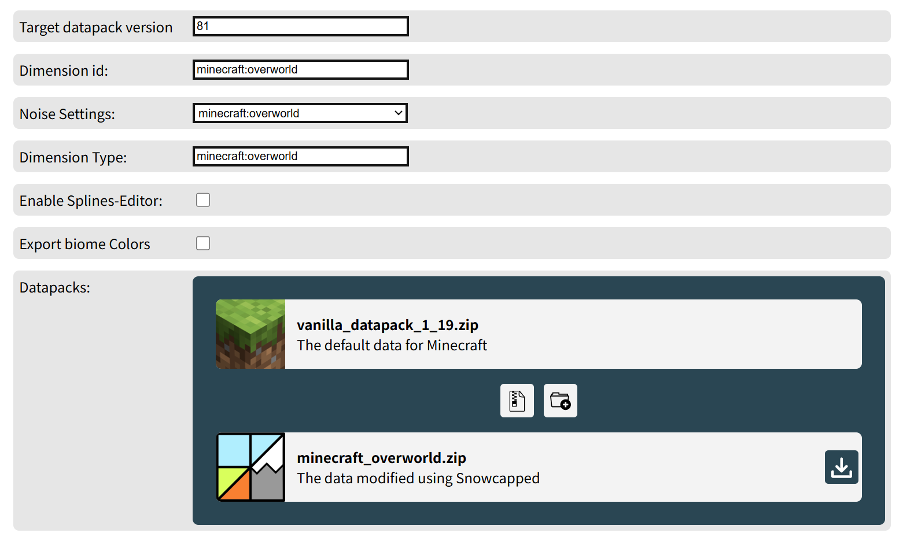
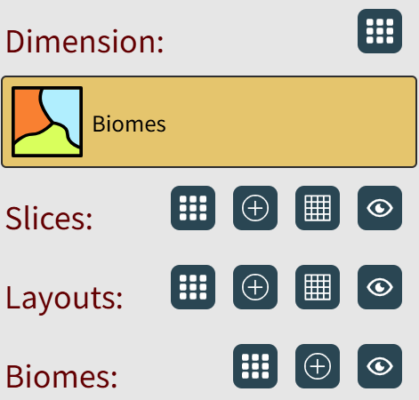
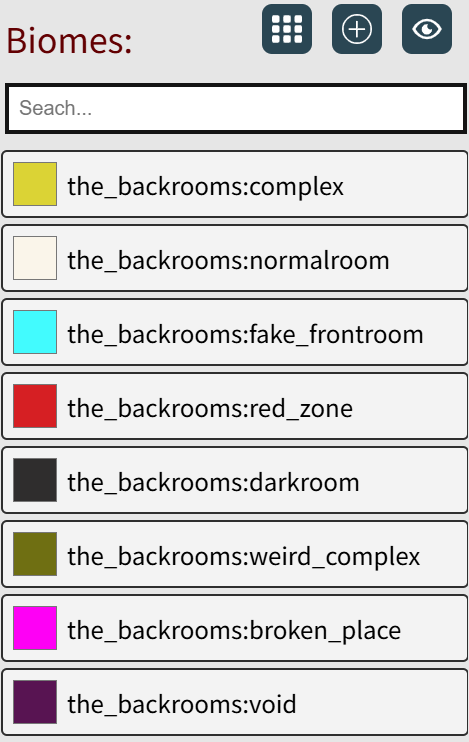
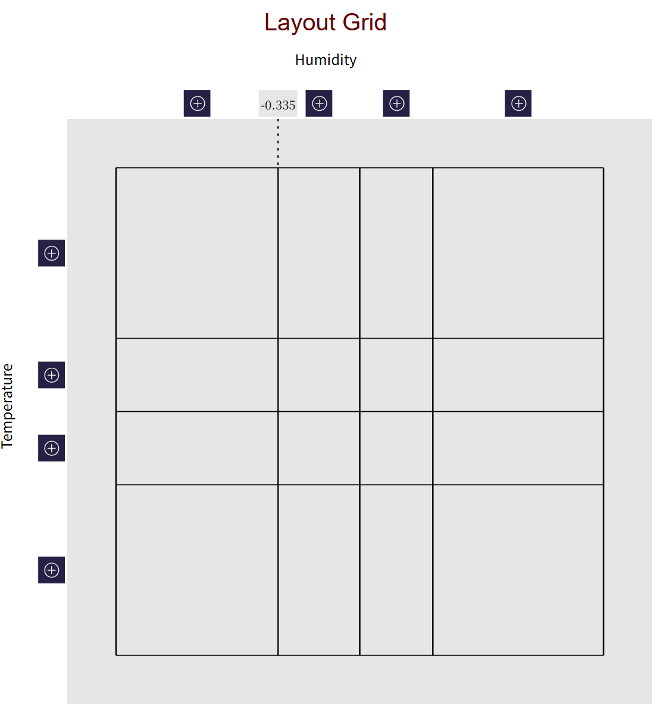
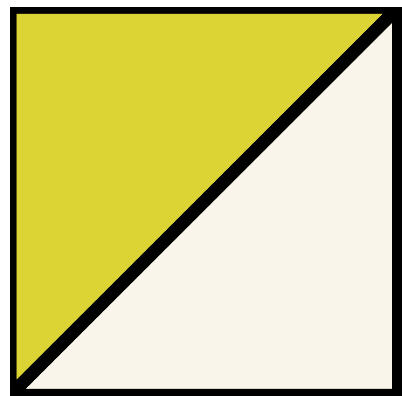
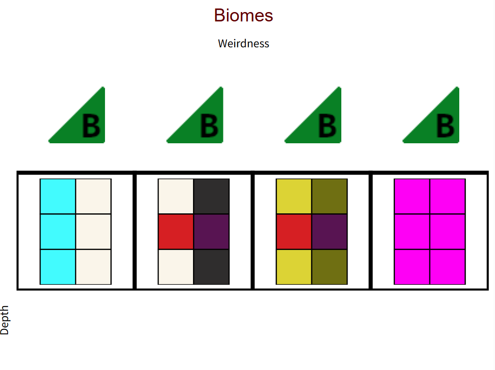
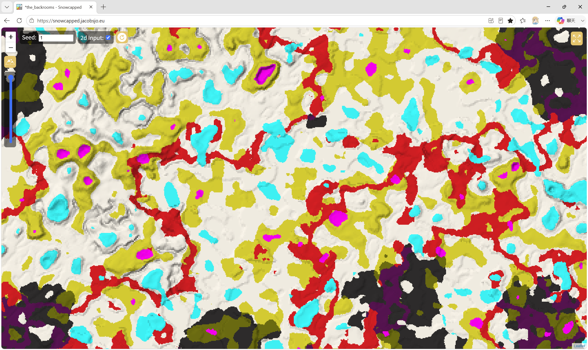

<FeatureHead
  title="可视化多噪声型生物群系源编辑网站使用方法概述"
  authorName="徐木弦"
  abstractText="多噪声型生物群系源实际上是六维的映射关系，为了解决原版数据包不直接展示生物群系参数列表以及生物群系参数较难编写的问题，本文介绍了网站 Snowcapped。该网站将六维参数两两分组切片成平面网格进行可视化编辑，是数据包世界生成模块的一个功能强大的第三方工具网站。"
  cover="../_assets/3.png"
/>

## 1. 引言
生物群系源是维度定义的一部分，它决定了维度中的生物群系如何放置。作为生物群系源的一种，多噪声型生物群系主要用于主世界和下界的生物群系放置，通过噪声模拟并生成多样化又有逻辑性、连续性的地理环境。

制作自定义维度时，按照惯例，开发者会参考原版数据包的相应内容。但是原版数据包世界预设定义文件 `data\minecraft\worldgen\world_preset\normal.json` 中主世界的定义方式如下所示：

```json
"minecraft:overworld": {
  "type": "minecraft:overworld",
  "generator": {
    "type": "minecraft:noise",
    "biome_source": {
      "type": "minecraft:multi_noise",
      "preset": "minecraft:overworld"
    },
    "settings": "minecraft:overworld"
  }
}
```

该多噪声参数列表是硬编码的 `minecraft:overworld`，此部分内容需要通过源码获取底层的映射数据。如果尝试内联定义生物群系源，其树状结构如下所示：

<div class="nbttree">

<node type="list" name="biomes"/>生物群系源
- <node type="compound" name=""/>一个生物群系及其放置条件。
  - <node type="string" name="biome"/>该生物群系的命名空间ID。
  - <node type="compound" name="parameters"/>该生物群系的放置条件。
    - <node type="float" name=""/><node type="list" name=""/><node type="compound" name="continentalness"/>放置所需的大陆性。
    - <node type="float" name=""/><node type="list" name=""/><node type="compound" name="depth"/>放置所需的深度。
    - <node type="float" name=""/><node type="list" name=""/><node type="compound" name="erosion"/>放置所需的侵蚀度。
    - <node type="float" name=""/><node type="list" name=""/><node type="compound" name="humidity"/>放置所需的湿度。
    - <node type="float" name="offset"/>放置偏移程度，此值越小越容易生成。
    - <node type="float" name=""/><node type="list" name=""/><node type="compound" name="temperature"/>放置所需的温度。
    - <node type="float" name=""/><node type="list" name=""/><node type="compound" name="weirdness"/>放置所需的奇异度。
</div>

多噪声算法基于六维参数空间（温度、湿度、大陆性、侵蚀度、奇异度与深度）计算欧氏距离或度量阈值。在纯文本手工配置过程中，由于高维参数空间的直观度差，开发者通常会无意间制造严苛的生成条件，使得部分生物群系很难甚至完全无法生成。

针对以上问题，本文将介绍基于一个第三方可视化配置工具网站 **Snowcapped**：https://snowcapped.jacobsjo.eu/ ，该网站将多噪声型生物群系源编辑工作做了可视化处理，使得生物群系源的编写更方便合理。

## 2. 网站功能介绍
从上方链接进入网站，如图所示，默认内容是原版主世界的生成规则：



此时就可以以内联的形式导出原版多噪声型生物群系源，下文介绍其导出及导入的方法：

### 2.1 导出、导入项目
点击上方的齿轮图标，进入 `Settings` 界面：



在其中填写数据包元数据，即可导出**数据包**，它可以直接被原版开发项目使用。

然而，Snowcapped 本身无法导入数据包并识别其中的生物群系源数据。对于在 Snowcapped 内编辑的项目，需要以 Snowcapped 能够识别的格式导出并导入。界面上方的 `Save` 和 `Save As` 可将当前项目导出为 `json` 文件，而后该项目才能由 `Open` 按钮打开并编辑。

### 2.2 可视化编写
点击界面上方最左侧的按钮，创建一个 `Empty` 项目，此即为一个新项目。如果想要修改原版的生物群系源参数，也可以选择其中预设的原版项目。

界面左侧主要有四个模块，从下到上依次为 Biomes、Layouts、Slices 和 Dimension。其中 Layouts、Slices 和 Dimension 三个模块掌管生物群系源所需的六个参数。由于噪声到生物群系的映射关系是六维的，人脑很难想象这样的图形，Snowcapped 遂将六个参数两两分组，以二维切片的形式让用户进行编辑。



#### 2.2.1 Biomes
生物群系是维度数据的基本单位，在这个模块内，点击 `+` 按钮即可创建一个新生物群系，用命名空间 ID 命名之。读者可以修改每种生物群系在可视化界面上的显示颜色。



#### 2.2.2 Layouts
Layouts 这一层控制温度和湿度两个参数。在创建新的 Layouts 之前，读者应该先点击 `Edit Layout Grid` 按钮编辑温度和湿度的等级划分网格。每个参数都可以在 -1 和 1 之间划分成若干等级。点击 `+` 可以新增行列（网格），移动网格线可以更改不同等级之间的界限。若要删除某一个等级，可将相应的网格线移动至与相邻的网格线重合。



该网格及相应的等级划分对于所有的 Layouts 均适用。

网格划分完毕即可点击左侧的 `Add Layout` 新增一个 Layout，此时可将 Biomes 中定义的生物群系填充至 Layout 内部。按住 `Ctrl` 可将生物群系填充至左上方或右下方，该功能的作用会在节 2.2.4 中阐述。



#### 2.2.3 Slices
Slices 这一层控制侵蚀度和大陆性两个参数。其中网格的定义与 Layouts 完全相同，网格及相应的等级划分对于所有的 Slices 均适用。此处不再赘述。新增 Slices 之后，可以往图内填充已经在下层定义好的 Layouts，也可以直接填充生物群系。同样，此处也有按住 `Ctrl` 在一个格子内填充两种内容的功能。

#### 2.2.4 Dimension
Dimension 这一层控制深度奇异度和深度两个参数，与 Layouts 和 Slices 不同的是，Dimension 只有一个可用的图，无法新增也无法删除 Dimension，它的网格划分位于 `Edit Grid` 这个按钮中，划分方式与 Layouts 和 Slices 一致。划分完毕后，可以往图内填充已定义的 Slices、Layouts 或 Biomes。



此外，奇异度这一参数处有一个三角形按钮，它可以为红色的左上三角形“A”或绿色的右下三角形“B”，上图所示均为绿色三角形“B”。当某一列（即这一等级的奇异度）使用红色三角形“A”时，这一列内所有内容（包括下层的 Slices 和 Layouts）均使用图内所有网格左上方的内容；为绿色三角形“B”时均使用右下方的内容。输出的数据包也会因此发生变动。

## 3. 成果展示
下图是使用 Snowcapped 编辑的一个维度。



## 参考文献

[1] https://zh.minecraft.wiki/w/%E7%BB%B4%E5%BA%A6%E5%AE%9A%E4%B9%89%E6%A0%BC%E5%BC%8F

[2] https://zh.minecraft.wiki/w/%E4%B8%96%E7%95%8C%E7%94%9F%E6%88%90