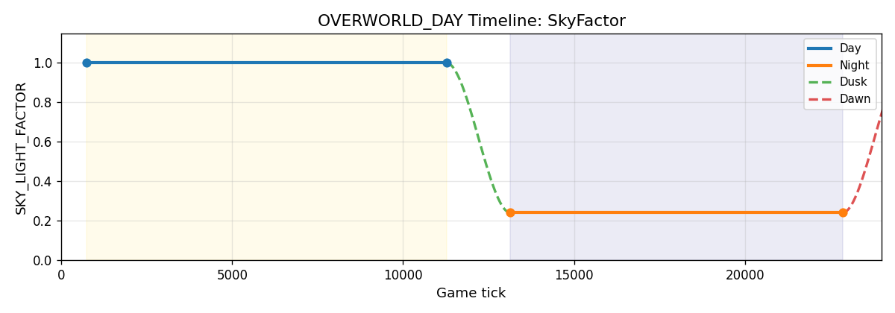
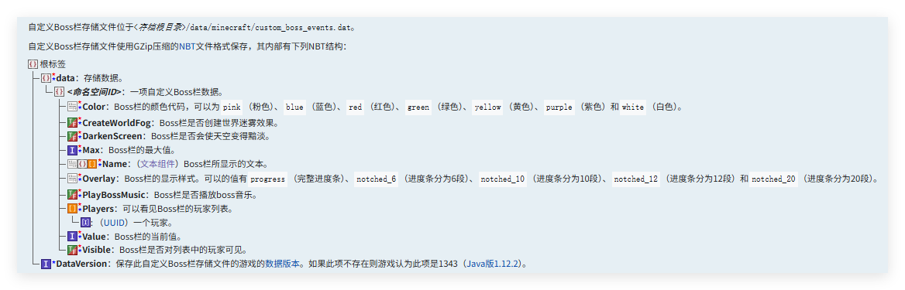
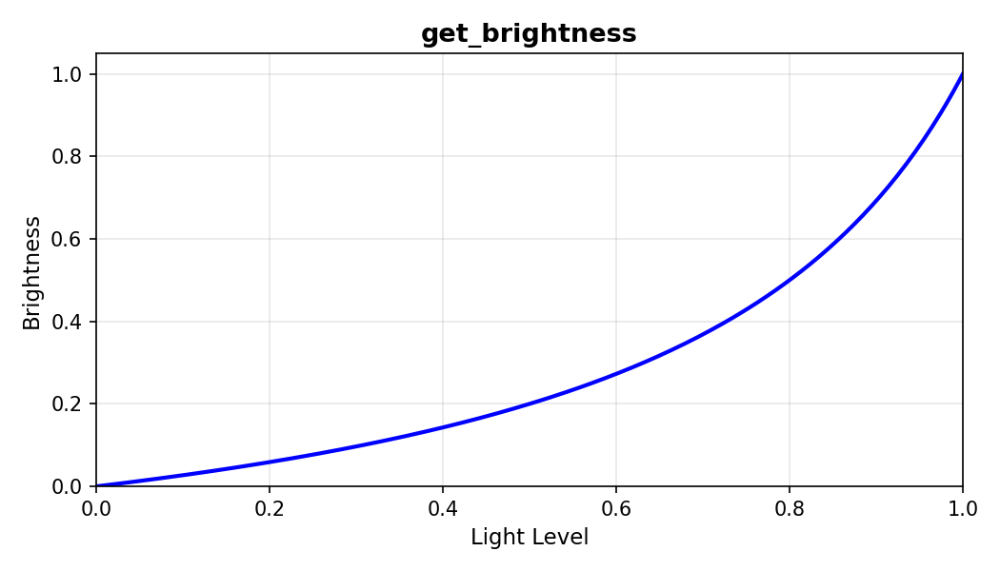
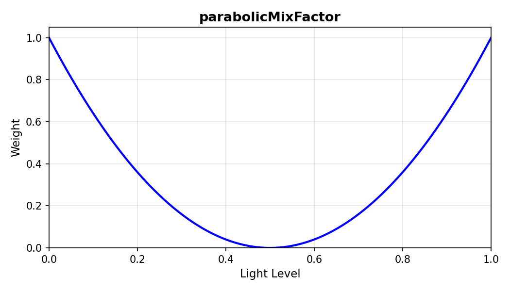

<FeatureHead
title='光照贴图生成原理和修改'
authorName='轩宇1725'
/>

## 综述

光照贴图是一张 $16\times 16$ 的程序化纹理。横轴对应方块光照等级（0–15），纵轴对应天空光照等级（0–15），每个像素存储 RGB 颜色值。自 1.21.2 起，光照贴图的生成程序 `lightmap` 加入了资源包，顶点着色器为 `screenquad.vsh`，片元着色器为 `lightmap.fsh`。本文主要分析了该片元着色器的 uniform 语义与合成顺序。

## 前言

从本篇开始，我们对着色器的介绍已经不再以资源包中的 GLSL 代码为重心了，而是以游戏源码为中心，说明各个着色器的渲染上下文和数学原理。着色器的 GLSL 代码仅作为参考，读者可以在源码中找到对应的实现。

以下用 $(t)$ 表示游戏时间 (tick)，$(d)$ 表示帧间插值，即上一 tick 到本 tick 的时间占比。读者在文中看到类似 $(t - d)$ 的表达式可以直接看做这一帧的游戏时间。

下面的代码中多次使用 `lerp(a, b, t)`，它是线性插值函数，返回 $(1 - t)a + t \cdot b$。在 GLSL 中可以直接使用 `mix(a, b, t)`。

## LightmapInfo Uniform 块

`lightmap.fsh` 的全部输入如下：

```glsl
layout(std140) uniform LightmapInfo {
    float SkyFactor;
    float BlockFactor;
    float NightVisionFactor;
    float DarknessScale;
    float BossOverlayWorldDarkeningFactor;
    float BrightnessFactor;
    vec3 BlockLightTint;
    vec3 SkyLightColor;
    vec3 AmbientColor;
    vec3 NightVisionColor;
} lightmapInfo;

in vec2 texCoord;
```

## 每个变量的数学描述

### SkyFactor — 天空光衰减

天空是两种主光源的一种，直观上，天空有多亮，来自天空的光照就越强。SkyFactor 就是确定天空光照强度的系数。它的最终值由四层叠加决定：昼夜 timeline、天气压暗、闪电脉冲、末地闪光。

**昼夜更替**：SkyFactor 的基础值 $\lambda(t)$ 由维度（Dimension）的 **timeline** 驱动。下界和末地没有昼夜更替，$\lambda(t) \equiv 1.0$。主世界的 `OVERWORLD_DAY` 时间线是一条有 4 个关键帧的 cubic bezier S 曲线：

- 昼段 (tick 730–11270): $\times 1.0$，长 10540 tick ≈ 8.8 分钟
- 夜段 (tick 13140–22860): $\times 0.24$，长 9720 tick ≈ 8.1 分钟
- 过渡段（11270→13140 / 22860→730，1870 tick ≈ 1.6 分钟）



**雨天和雷暴**：服务端每 tick 将 `rainLevel` / `thunderLevel` 向目标值（1 = 开启，0 = 停止）以 $\pm 0.01$ 速率线性爬升/下降，再帧间 `lerp` 插值。记 $r \in [0,1]$ 为降雨强度，$u \in [0,1]$ 为雷暴因子：

$$w_r = r \cdot (1 - u),\qquad w_t = r \cdot u$$

$a_r = 0.3125$（下雨 alpha），$a_t = 0.5273$（雷暴 alpha），向目标值 $0.24$ 混合：

$$s_{\text{rain}} = \text{lerp}\!\big(a_r \cdot w_r,\ \lambda(t),\ 0.24\big)$$

$$s_{\text{weather}} = \text{lerp}\!\big(a_t \cdot w_t,\ s_{\text{rain}},\ 0.24\big)$$

因此即使在正午，雷暴也能把天空压暗到白天的 60%。

**闪电**：`ClientLevel` 的 `TimeBased` 层通过 `getSkyFlashTime() > 0` 强制覆盖 $s = 1.0$。这是闪电击中后短暂的脉冲闪烁——服务端下发倒计时值，客户端每 tick 递减。

**末地闪光**：末地闪光每 600 tick（30 秒）为一个周期，周期内随机选取偏移 $o \in [0, 200]$ 和窗口宽 $p \in [100, 380]$。在闪窗口 $[o, o+p]$ 内：

$$I_{\text{flash}}(T, d) = \sin\left(\frac{\tau - o}{p} \cdot \pi\right),\quad \tau = T \bmod 600$$

否则为 $0$。$s \mathrel{+}= I_{\text{flash}}$（Boss 雾存在时 $I_{\text{flash}}/3$）。

Boss雾是被 bossbar 带来的一种雾。原版没有指令可以为自定义的 bossbar 开启此效果，但凋灵等 bossbar 有 `CreateWorldFog=true`（自定义 bossbar 也可以通过修改 NBT 文件来开启此效果。）



> 注：26.1 前，存储在 `level.dat` 的 `CustomBossEvents` 字段下

### BlockFactor — 方块光闪烁

方块光是两种主光源的另一种。方块光照等级显然是恒定的，此参数提供了一种光源的呼吸效果。记 BlockFactor 为 $\beta_n$，每 tick 更新：

$$\beta_n = f_n + 1.4$$

其中 $R_1,R_2,R_3,R_4$ 为每帧独立抽取的 $[0,1)$ 均匀随机数（即 `Math.random()`）。

$$f_{n+1} = 0.9 \cdot \big(f_n + (R_1-R_2) \cdot R_3 \cdot R_4 \cdot 0.1\big)$$

$\beta_n \in [1.3, 1.5]$，提供视觉呼吸感。

### NightVisionFactor — 夜视强度

夜视强度 $\nu$ 有三个来源（优先级从高到低）：

$$\nu = \begin{cases} \nu_{\text{nv}}(T_{\text{rem}}, d) & \text{有夜视效果} \\ \tau_{\text{water}}(t_{\text{uw}}) & \text{有潮涌能量 + 水下} \\ 0 & \text{否} \end{cases}$$

**夜视 $\nu_{\text{nv}}$**：$T_{\text{rem}}$ 为夜视效果剩余 tick。超过 200 tick（10 秒）时满效 $1.0$，进入最后 200 tick 则正弦振荡：

$$\nu_{\text{nv}}(T_{\text{rem}}, d) = \begin{cases}
1.0 & T_{\text{rem}} > 200 \\
0.7 + 0.3 \cdot \sin\!\big((T_{\text{rem}} - d) \cdot 0.2\pi\big) & T_{\text{rem}} \le 200
\end{cases}$$

值域 $[0.4, 1.0]$，振荡周期约 $10\text{ tick} = 0.5$ 秒。

**水下视觉 $\tau_{\text{water}}$**：$t_{\text{uw}}$ 为玩家入水累计 tick。两段线性爬升——前 5 秒快速达到 0.6，后 25 秒缓慢爬满至 1.0：

$$\tau_{\text{water}}(t_{\text{uw}}) = \begin{cases}
0.6 \cdot \dfrac{t_{\text{uw}}}{100} & t_{\text{uw}} \in [0, 100) \\[4pt]
0.6 + 0.4 \cdot \dfrac{t_{\text{uw}} - 100}{500} & t_{\text{uw}} \in [100, 600) \\[4pt]
1.0 & t_{\text{uw}} \ge 600
\end{cases}$$

玩家不在水中时 $t_{\text{uw}}$ 重置为 $0$，$\tau_{\text{water}} = 0$。

### DarknessScale — 黑暗效果强度

DarknessScale 由两个独立层合成：黑暗状态效果的因子 $G$ 和辅助功能滑条 $S$。

$$D(\tau,d) = \max\!\big(0,\ 0.45 \cdot G \cdot S \cdot \cos((\tau-d) \cdot \pi \cdot 0.025)\big) \cdot S$$

化简为：

$$D = 0.45 \cdot G \cdot S^2 \cdot \max\!\big(0,\ \cos((\tau-d) \cdot 0.025\pi)\big)$$

变量含义：
- $G$ = 黑暗因子，在监守者距离 $<20$ 格或幽匿尖啸体范围内时渐变至 $1.0$，离开后渐变回 $0$。$22$ tick 线性过渡
- $S$ = `辅助功能设置→黑暗脉动效果` 滑条值 ($0$–$1$)

### BrightnessFactor — Gamma 调节

$$B = \max(0,\ \gamma - G \cdot S)$$

$\gamma$ = `视频设置→亮度` 滑条 ($0$–$1$)，$G$ 和 $S$ 同上（有黑暗效果时额外压暗）。

### BossOverlayWorldDarkeningFactor — Boss 栏变暗

每 tick 更新，上升和下降速率不对称：

$$b_{n+1} = \begin{cases}
\min(1,\ b_n + 0.05) & \text{bossbar 的 DarkenSky=true} \\
\max(0,\ b_n - 0.0125) & \text{bossbar 的 DarkenSky=false}
\end{cases}$$

$+0.05$/tick → 变暗只需 $20\text{ tick}=1$ 秒；$-0.0125$/tick → 消退需 $80\text{ tick}=4$ 秒。

### 颜色系变量

四位：`BlockLightTint`、`SkyLightColor`、`AmbientColor`、`NightVisionColor`。全部来自 `EnvironmentAttribute` 系统通过群系/时间/天气 `TimeBased` layer 合成。

## 着色器合成顺序

计算方块光照等级和天空光照等级
texCoord 的范围是 [0, 1]，离散为16格。
    
```glsl
float block_level = floor(texCoord.x * 16) / 15;
float sky_level = floor(texCoord.y * 16) / 15;
```

使用曲线修正亮度

$$b(\ell) = \frac{\ell}{4 - 3\ell}$$

```glsl
float block_brightness = get_brightness(block_level) * lightmapInfo.BlockFactor;
float sky_brightness = get_brightness(sky_level) * lightmapInfo.SkyFactor;
```



计算环境光照（含夜视增幅）

```glsl
vec3 nightVisionColor = lightmapInfo.NightVisionColor * lightmapInfo.NightVisionFactor;
vec3 color = max(lightmapInfo.AmbientColor, nightVisionColor);
```

光照的叠加是加法混合，下面叠加上天空光照和方块光照。

```glsl
// Add sky light
color += lightmapInfo.SkyLightColor * sky_brightness;

// Add block light
vec3 BlockLightColor = mix(lightmapInfo.BlockLightTint, vec3(1.0), 0.9 * parabolicMixFactor(block_level));
color += BlockLightColor * block_brightness;
```

parabolicMixFactor也是一个修正曲线：

$$w(\ell) = (2\ell - 1)^2$$



可以看到当光照等级接近 0 或 16 时，光照颜色更接近白光，而在中间时，光照颜色更接近方块光的颜色。

下面应用bossbar和黑暗的效果，前者将光照与另一个更暗的光照混合，后者将光照整体降低。

```glsl
// Apply boss overlay darkening effect
color = mix(color, color * vec3(0.7, 0.6, 0.6), lightmapInfo.BossOverlayWorldDarkeningFactor);

// Apply darkness effect scale
color = color - vec3(lightmapInfo.DarknessScale);
```

最后得到的光照经过类反 gamma 矫正和客户端设置处理，输出光照贴图

```glsl
// Apply brightness
color = clamp(color, 0.0, 1.0);
vec3 notGamma = notGamma(color);
color = mix(color, notGamma, lightmapInfo.BrightnessFactor);

fragColor = vec4(color, 1.0);
```

> 这里的 notGamma 函数大概是 mj 自创的，没有什么图形学渊源

```glsl
vec3 notGamma(vec3 color) {
    float maxComponent = max(max(color.x, color.y), color.z);
    float maxInverted = 1.0f - maxComponent;
    float maxScaled = 1.0f - maxInverted * maxInverted * maxInverted * maxInverted;
    return color * (maxScaled / maxComponent);
}
```

## 修改

修改光照贴图主要是为了在其他核心着色器中获取更多的渲染上下文，也就是在16*16的光照贴图中存储变量，而非用作光照贴图。

在未经修改的原版管线中, 虽然采样和合成时使用了全部的rgba四个通道，但光照贴图的生成其实总是会输出 alpha = 1.0。我们可以在 `lightmap.fsh` 中修改 alpha 通道的输出，存储更多的变量（256个浮点数）。同时需要修改 sample_lightmap.glsl 来避免 alpha 通道被合成到片元颜色上。

```glsl
void main(){
    int x = floor(texCoord.x * 16);
    int y = floor(texCoord.y * 16);

    ...

    if(x == 0 && y == 0){
        fragColor.a = ...
    }

    ...
}
```

这样一来，在其他着色器中就可以在 Sampler2 中采样到 LightmapInfo 的全部信息。

不过我们更加关注的是稳定的状态，如夜视和bossbar可以视作一个 0/1 变量，可用于在核心着色器内实现开关效果。BlockFactor 则可以作为随机数源。DarknessScale 可作为一个脉冲信号源。BrightnessFactor 可用于接收玩家输入。

此外，`lightmap.fsh` 还允许引入 Globals 块，也可在渲染 Lightmap 时预计算一些数据并存入 Alpha 通道中。

## 参考和致谢

BOSS 栏：https://zh.minecraft.wiki/w/Boss%E6%A0%8F

自定义Boss栏存储格式：https://zh.minecraft.wiki/w/%E8%87%AA%E5%AE%9A%E4%B9%89Boss%E6%A0%8F%E5%AD%98%E5%82%A8%E6%A0%BC%E5%BC%8F

存档基础数据存储格式：https://zh.minecraft.wiki/w/%E5%AD%98%E6%A1%A3%E5%9F%BA%E7%A1%80%E6%95%B0%E6%8D%AE%E5%AD%98%E5%82%A8%E6%A0%BC%E5%BC%8F

末地闪光：https://zh.minecraft.wiki/w/%E5%A4%A9%E7%A9%BA#%E6%9C%AB%E5%9C%B0%E9%97%AA%E5%85%89

感谢 Alumopper 提供的源码支持和小鲸鱼的代码解读。